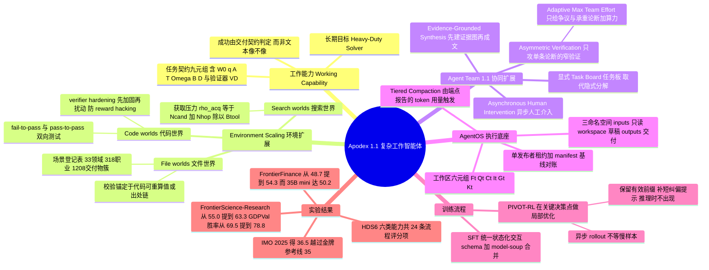

## 一、论文是干什么的？

现在的大模型很像一个知识渊博的实习生：你问它什么，它都能对答如流，条理清楚、引经据典。但如果你把一堆乱七八糟的 Excel、PDF、实验数据丢给它，说「帮我做完这个项目，两小时后我要看到一份可以直接交给客户的报告，附上所有原始计算」，它往往就露怯了——找错了文件版本、代码跑挂了不知道怎么修、中途忘了自己一开始要干什么、最后交出来一篇读着很顺但数字对不上的稿子。

Apodex 1.1 这篇技术报告，想解决的正是这个落差。作者把它命名为**工作能力**（working capability），定义是「面向一个真实目标，持续、可验证地推进进度」。注意这里有两个关键词：**持续**（不是一问一答，而是几十上百步地干下去）和**可验证**（不是听起来对，而是每个数字都能被独立重算或追溯到出处）。论文的核心主张相当直白：衡量智能体智能高低的单位不该是「一次回答」，而应该是「一件干完的活」。

为了做到这一点，团队沿着两条互补的路线扩展：一条叫**Environment Scaling**（环境扩展），即造出海量真实、可执行、可判分的「世界」让模型在里面练手；另一条叫**Agentic Coordination Scaling**（智能体协同扩展），即训练模型自己拆任务、派活、并行推进、边干边改计划。两条路线共用一套执行框架和一个叫 AgentOS 的运行时底座。最终的成果是：完整版 Apodex 1.1 在金融、科研、专业办公、数学、代码、深度检索等一大批基准上进入第一梯队；而只有 350 亿参数的 Apodex 1.1 mini 还开源了权重，能在本地跑。

## 二、核心方法与创新

### 2.1 先把「一件活」写成数学定义

要让机器学会「干完一件活」，第一步是给「活」下一个精确定义。论文用一个九元组来描述一个任务契约：

$$
\mathcal{E}=(\mathcal{W}, W_0, q, \mathcal{A}, \mathcal{T}, \Omega, \mathbf{B}, D, V_D)
$$

翻译成大白话：$\mathcal{W}$ 是「工作台可能长成什么样」的所有状态空间，$W_0$ 是「一开始桌上摆着什么」，$q$ 是「要干成什么」，$\mathcal{A}$ 是「你能做哪些动作」，$\mathcal{T}$ 是「做了动作世界怎么变」，$\Omega$ 是「你能看到什么反馈」，$\mathbf{B}$ 是预算向量（可以约束轮数 $B_{\mathrm{turn}}$、工具调用次数 $B_{\mathrm{tool}}$、token、墙钟时间、并发数），$D$ 是**交付契约**（必须交出什么、要满足哪些约束），$V_D$ 则是最终判卷的验证器。

执行过程写成两行递推：$W_{t+1}=\mathcal{T}(W_t,a_t)$、$o_{t+1}=\Omega(W_t,a_t,W_{t+1})$。整条轨迹 $\tau_H=(u_0,a_0,o_1,\ldots,u_{H-1},a_{H-1},o_H)$ 结束后，由 $S_D=V_D(W_0,W_H,\tau_H)$ 给出成绩。

这个定义有个很重要的隐含意思：一篇写得漂亮的报告本身**不构成成功**，它只是终态工作区 $W_H$ 里的一个产物；成功与否由交付契约的条款说了算。这跟传统「模型输出 vs 参考答案」的评测范式是根本不同的。

### 2.2 Environment Scaling：把「造世界」当成新的扩展维度

传统扩展大家都懂：加参数、加数据、加推理算力。这篇论文提出第四个维度——**扩展环境本身**。理由是：模型在真实工作中翻车，很少是因为「不知道答案」，而是因为找不到权威文件、跨工具调用时状态丢了、代码报错不会修、证据互相矛盾不会调和。这些能力只能在能真正执行、能真正判分的世界里练出来。

论文造了三类「世界」：

**File worlds**（文件世界）模拟真实职场的文件堆：嵌套目录、多种格式、历史版本、跨文件引用。信息不在 prompt 里，而散落在工作区里，模型必须自己找出哪份才是权威版本、重建业务逻辑链、过滤掉过期记录。造这种世界的思路是「反向工程」——先定义底层业务状态、权威关系、推导逻辑和交付要求，再把它们投影成一个凌乱的工作区。覆盖面靠一张持续维护的场景登记表来扩展，目前覆盖 **33 个领域、318 种职业、1208 个交付物簇**，再往下还有「角度」层生成同一职业内的不同任务。关键是难度不靠堆文件数量：目录再大，如果权威路径一眼可见，任务并不会更难。

**Search worlds**（搜索世界）把开放网络研究建模成「发现 + 获取 + 证据综合」。它的标准答案不只是最终结论，还包括相关来源集合、论断与证据的对齐关系、以及来源冲突处的显式不确定性标注。为了衡量这类任务的难度，论文提出一个「获取压力」坐标：

$$
\rho_{\mathrm{acq}}(\mathcal{E})=\frac{N_{\mathrm{cand}}(\mathcal{E})+N_{\mathrm{hop}}(\mathcal{E})}{B_{\mathrm{tool}}(\mathcal{E})}
$$

其中 $N_{\mathrm{cand}}$ 是需要花成本去核查的候选来源数，$N_{\mathrm{hop}}$ 是承重的证据跳转次数，$B_{\mathrm{tool}}$ 是工具调用预算。$\rho_{\mathrm{acq}}$ 越高，模型就越被逼着学会分诊、导航、状态跟踪和「什么时候该收手」。作者特别强调这只是一个一阶坐标，不是通用难度尺。

**Code worlds**（代码世界）是有状态的沙箱仓库环境。验证靠执行：对从真实 PR 采集来的世界，要求 fail-to-pass 测试在改前失败、改后通过，pass-to-pass 测试改前改后都通过。对合成出来的世界没有外部标准答案，所以除了「参考解能过」之外，还额外做一件事——主动测试「求解器能不能不真干活就骗到奖励」，只有在沙箱里真的成功的攻击才算验证器失效。评分与求解器隔离，模型改不了自己的判卷人。

三类世界共用同一套构造原则，作者概括为「**正向便宜、逆向昂贵**」：生成器用隐藏状态或参考程序低成本地把世界造出来并解掉，而智能体只看到渲染后的工作区，必须在约束下把路径重新走出来。

### 2.3 Agent Team 1.1：从「一次性分工」到「持续协商的任务板」

1.0 版本里，主智能体在开头想一想、分个工、派几个子智能体出去，就算完事了。1.1 把这个决定**外化**成一块持久的**任务板**（Task Board）。每个条目都记录：一个有界的子目标、依赖关系、负责人集合、解决状态（open / in_progress / resolved / cancelled）、以及回传的证据或产物。

这个改动的意义比看起来大。任务板不是「私有推理的可视化」，而是模型、运行时、用户三方共享的协调记录。子智能体从板上领取范围，完成的工作挂回板上，改计划则表现为对板的工具调用式编辑。于是：一个结果返回就能立刻解锁下游任务；一个被推翻的前提只作废它的后代而不是全盘重来；一条慢分支不再堵住其他独立分支。

在此之上加了四项新能力：

**异步人工介入**（Asynchronous Human Intervention）。真实研究任务开头必然是欠定义的，往往干到一半才知道该问什么。Apodex 允许用户在执行中途插话 $u_t$，模型据此更新活的任务板。作者构造了覆盖十余类介入的训练轨迹：澄清需求、纠正事实、改优先级、补新文件、换假设或方法、限定来源与工具、改预算或截止时间、暂停恢复取消、进度查询、输出格式与语言偏好、甚至无关的闲聊问题。规则很清晰：不改变验收条款的介入只更新相关板条目、作废受影响的后代、通知在跑的子智能体，同时保持 $(q,D)$ 不变；如果消息实质性改变了目标或交付要求，运行时就开一个新的任务契约，但把仍然有效的工作区状态带过去。这训练出来的行为是「保持因果连续性」，而不是一句话就全部推倒重来。

**非对称验证**（Asymmetric Verification）。1.0 已经有独立上下文的审查者了，但作者发现「独立」还不够：如果让一个同等能力的验证者把整道题重做一遍，它很可能引入第二条同样不受约束的错误链，反而变成新的污染源。1.1 的做法是让**验证任务本身比生成任务窄**：验证者只拿到一条具体论断、它的支撑证据、以及适用的交付约束，任务是去攻击这条论断——找反例、用真正独立的来源类别做三角验证、核对人名日期数字公式这类原子细节、或检查格式合规。这样产出的信号也更可操作：反馈直接点名争议论断、反证或失败的检查项、以及需要的修复动作。

**自适应最大团队投入**（Adaptive Max Team Effort）。测试时扩展算力确实有用，但均匀撒钱会把预算浪费在已经板上钉钉的子问题上。这里的做法是只对**弱、有争议、或承重**的论断追加独立范围的调查；扩散时沿真正不同的假设、方法、来源类别或提问框架展开；后续几波算力分配给未解决或被证伪的分支。因为每次返回后都会重新分配，扩展变量是「有用的协调工作量」，而不是固定的智能体数量。

**证据锚定合成**（Evidence-Grounded Synthesis）。长任务的最后一步不能直接拿主智能体的末尾上下文来压缩成稿——早期证据会丢，试探性的分支结论会被写成板上钉钉。所以论文加了一个独立的合成阶段，输入是终态任务板、子智能体报告、检索到的证据、产出的文件和验证结论。它分两遍：先把各分支结果调和成一张**论断与证据图**，标出哪些论断是承重的、被佐证的、有争议的、未解决的；再把这张图交给写作智能体，在同样的工具、引用和交付约束下成文。追溯不到证据或计算的论断被限定或删掉，缺失的承重依赖则退回主智能体继续干活，而不是用漂亮话填上。

值得一提的是：论文明确说明这个合成阶段**只用于线上产品，不计入离线评测**，这一点在读实验表时要记住。

### 2.4 AgentOS：长周期工作的操作系统

AgentOS 把抽象的工作区实例化成六个组件：

$$
W_t=(F_t, Q_t, C_t, I_t, G_t, K_t)
$$

分别是文件状态 $F_t$、检索到的证据 $Q_t$、可执行状态与日志 $C_t$、产物索引 $I_t$、连接来源与动作与产物的依赖图 $G_t$、以及可选的运行时控制状态 $K_t$。单智能体运行时 $K_t$ 里可能只有轻量的计划元数据；Agent Team 则把它实例化成显式的任务板加 Agent Bus。

几个工程细节挺见功力：

**三个文件命名空间**。`/inputs` 是任务给定文件的只读视图，`/workspace` 放计算、笔记和候选产物，`/outputs` 是最终交付物的收集根目录。这样验证器就能区分「给的材料」「中间草稿」「声称要交付的东西」。另外还可挂载 `/shares`，一个跨运行存在的只读组织文档库。

**分层压缩**（Tiered Compaction）。上下文快撑爆时，触发条件不是本地估算的文本长度，而是**推理端点实际报告的 token 用量**。第一层便宜：丢掉老工具观察的正文，保留消息结构、近期结果和受保护的汇聚报告；只有当实测缓解不够时才升级到第二层——用 LLM 摘要轨迹中段。升级由实际获得的缓解量驱动，而不是固定时间表。

**优雅的预算耗尽**。每个执行预算同时给出一个软截止和一个外层硬超时。软截止临近时，观察者会要求活跃智能体先把发现整合起来，模型重试和工具调用把等待时间收敛到剩余时间内。到软截止时循环正常结束，然后跑一次有界的、无工具的收尾调用，从已完成的工作里抢救出一个有用的部分结果；硬取消只作为最后手段。

**受控的产物交付**。「产出一个文件」和「声明它是最终交付物」被严格分开：发布方要声明 `/outputs` 下的精确清单，一个运行级租约保证同一时刻最多一个会话有提交权。非发布方对 `/outputs` 的写入直接 fail-closed，发布方也只能写自己声明过的路径。终止时每条清单项都要跟授予租约时拍的基线快照对账——空文件、或者上一轮遗留的同名旧文件，都无法冒充交付。最终答复里如果有清单没覆盖的交付声明，会被显式标出而不是当成成功。

作者也坦率写了边界：这套机制保证的是状态、执行和交付的运行时契约，**不保证**检索到的来源、计算、科学方法或最终结论是对的；协调平面是运行级的而非持久分布式数据库，进程重启恢复和历史文件系统回滚不在当前契约内。

### 2.5 训练：SFT 打底 + PIVOT-RL 精修

SFT 阶段把通用推理、工具使用、搜索、文件交互、代码、数学、科学与金融推理、专业交付、多智能体协同全部归一化成**同一套有状态交互 schema**，让这些行为能在一个策略里组合起来。过滤强调行为有效性：删掉工具交互非法、状态不一致、无视观察、交付不完整的轨迹；对异步智能体数据放宽角色交替约束；有标准答案时用常规拒绝采样，rubric 评分的任务则挑选任务相关的评分维度和阈值，而不是依赖单一的总分裁判。最后在通用、智能体、代码等几个大能力域上分别训 SFT 变体，再用 **model-soup 合并**得到统一的初始化检查点。

RL 阶段的核心难题是**信用分配**：一条几百步的长轨迹只有末端一个粗糙的成败信号，中间到底哪一步该改？论文的答案是 **PIVOT-RL**（在关键决策点做局部优化）。做法是事后回溯分析，找出「转折点」（pivot）——模型开始走上不产出的策略、依赖了不充分的证据、误用了工具、或该修正假设却没修正的那一步。然后保留有用的前缀，从转折点起构造一个带**简短纠偏提示**的局部续写任务；对有状态任务还会恢复对应的可执行环境状态。这个提示只提供方向性指引，**从不作为预测目标，推理时也完全不出现**。局部续写与不带提示的完整任务混合训练，兼顾「在失败相关状态上高效学习」和「端到端自主解题」。

打个比方：普通 RL 像是让学生把整套卷子重做一百遍，只告诉他总分；PIVOT-RL 则是老师翻到他做错的那一步，说「这里应该换个思路」，然后让他从这一步接着做——前面做对的部分不用重来，学习信号全集中在真正需要改正的那一段。

工程上还有一条：完成的轨迹**异步进入优化**，不等慢的 episode。搜索、代码执行、文件处理、协同这些任务的墙钟成本差异极大，同步等待会严重拖低吞吐。

## 三、使用了哪些模型和计算资源？

| 项目 | 内容 |
|---|---|
| 完整版模型规模 | 397B（论文 HDS6 章节明确写道 Deep Discover 与 Deep Solve 两个评测切片使用 397B 模型） |
| 轻量版模型规模 | Apodex 1.1 mini，论文写作 35B；HuggingFace 模型页显示总参数约 35.95B（约 36B） |
| mini 的基座模型 | 模型卡的 `base_model` 字段写明为 `Qwen/Qwen3.5-35B-A3B`，架构为 `Qwen3_5MoeForConditionalGeneration`（MoE，混合线性注意力与全注意力层） |
| 开源许可 | mini 权重为 Apache 2.0 |
| 上下文长度 | 262,144 tokens |
| 推荐部署 | SGLang（`--tp 8 --context-length 262144`）或 vLLM（`--tensor-parallel-size 8 --max-model-len 262144`），即建议 8 卡张量并行 |
| 推荐推理参数 | temperature 1.0、top_p 0.95 |
| 量化版本 | 官方另外发布了 NVFP4、GPTQ-Int4、FP8 三个量化权重 |
| GPU 型号与数量 | **暂无相关信息**（报告未披露训练硬件） |
| 训练时长与算力总量 | **暂无相关信息**（报告只给了 RL 随算力增长的趋势图，没有绝对数值） |
| 训练数据规模 | **暂无相关信息**（只描述了混合成分与过滤策略，未给 token 数或轨迹条数） |
| API 调用成本 | 论文未披露；官方提供 [API 平台](https://platform.apodex.ai)，具体定价需以平台为准 |

评测中用到的外部模型包括 GPT-5.6-Sol、GPT-5.5、Claude-Opus-5、Claude-Opus-4.6/4.7/4.8、Claude-Fable-5、Kimi-K3 (max)、Kimi-K2.6、DeepSeek-V4-Pro、DeepSeek-V4-Flash-0731、Gemini-3.1-Pro、Gemini-3.6-Flash、GLM-5.2、Qwen3.7/3.8-Max、Grok-4.6 等；FrontierResearchBench 的语义评分部分使用 GPT-5.6-Sol 作为裁判模型。

## 四、实验结果

一句话总结：**底层模型本身已经很能打（ReAct 模式就接近第一梯队），而训练过的多智能体协同还能再稳稳加上 4 到 9 分**；但在纯代码基准和最难的端到端科研工作流上，它离顶尖仍有差距，作者也没有粉饰。

评测分两种模式：**ReAct** 是最简单的「想一步、调工具、看结果」循环，反映模型本身的策略；**Agent Team** 是主智能体动态派生子智能体并行干活，反映系统级增益。

### 专业办公与金融

| 基准 | Apodex 1.0 | 1.1 ReAct | 1.1 Agent Team | 最强参考值 |
|---|---|---|---|---|
| APEX-Agents（480 个跨应用长任务） | 16.5 | 34.4 | 38.5 | Claude-Opus-5 42.3 |
| GDPVal（44 种职业，胜率） | 59.3 | 69.5 | 78.8 | Claude-Opus-5 89.4 |
| FrontierFinance（220 题，11543 条专家评分项） | 40.3 | 48.7 | **54.3**（该表最佳） | Claude-Fable-5 49.2 |
| YC-Bench 期末净资产 | 47,966 美元 | 1,038,255 美元 | 未单独报告 | Claude-Fable-5 约 197.8 万美元 |

APEX-Agents 上 ReAct 相比 1.0 直接翻倍还多，Agent Team 再加 4.1 分；GDPVal 上协同带来 9.3 分增益。

### 科研、通用推理与深度检索

| 基准 | Apodex 1.0 | 1.1 ReAct | 1.1 Agent Team | 最强参考值 |
|---|---|---|---|---|
| FrontierScience-Research（60 题，10 分制，7 分及格） | 28.3 | 55.0 | **63.3**（该表最佳） | DeepSeek-V4-Flash-0731 55.0 |
| BioMysteryBench 人类困难子集（17 题） | 17.6 | 23.5（4/17） | 35.3（6/17） | Claude-Opus-5 49.4 |
| Humanity's Last Exam | 49.0 | 53.2 | 56.1 | Claude-Opus-5 64.7 |
| DeepSearchQA（F1） | 84.6 | 88.2 | 92.4 | Claude-Opus-5 与 Kimi-K3 均 95.0 |

FrontierScience-Research 的平均 rubric 分从 ReAct 的 6.7 提到 Agent Team 的 6.9——注意及格线是 7 分，所以通过率跳了 8.3 个点，但平均分只挪了 0.2，说明协同主要是把「差一点及格」的那批题推过线。

### 35B mini 的效率结果

这是本文最被媒体引用的一组数字：

| 基准 | 1.0 mini ReAct | 1.1 mini ReAct | 1.1 mini Agent Team | 对照 |
|---|---|---|---|---|
| FrontierFinance | 33.2 | 40.0 | **50.2**（该对照组最佳） | GPT-5.6-Sol 46.8、DeepSeek-V4-Pro 45.5 |
| FrontierScience-Research | 25.0 | 45.0 | 51.7 | DeepSeek-V4-Flash-0731 55.0 |
| APEX-Agents | 15.4 | 24.2 | 27.7 | Kimi-K2.6 27.9 |

也就是说一个 35B 模型在 APEX-Agents 上打到了 27.7，与 Kimi-K2.6 的 27.9 只差 0.2 分。作者自己很谨慎地把这表述成「进入性能带」而不是「超越」，理由是若干闭源参考系统的参数量并未公开。

### 数学（MathArena 协议）

| 评测集 | 参考线 | 1.0 Agent Team | 1.1 ReAct | 1.1 Agent Team |
|---|---|---|---|---|
| IMO 2025 | 35 | 12.5 | 24.3 | 36.5 |
| IMO 2026 | 29 | 13.0 | 18.5 | 30.5 |
| USAMO 2026 | 25 | 5.8 | 16.0 | 26.5 |
| IMO-ProofBench Basic | 无 | 63.3 | 80.0 | 96.7 |
| IMO-ProofBench Advanced | 无 | 20.0 | 46.4 | 63.3 |

Agent Team 模式在三个集合上都越过了参考线，其中包含 IMO 金牌线。注意 ReAct 单独跑是过不了线的——这里协同带来的增益特别大。

### 代码：诚实的短板

| 基准 | Apodex 1.1 | 最强参考值 |
|---|---|---|
| Terminal-Bench 2.1 | 70.8 | Gemini 3.6 Flash 91.9 |
| SWE-bench Verified | 77.7 | Claude Opus 5 92.2 |

这是全文里 Apodex 落后最明显的一块，报告没有回避。

### 内部基准

**FrontierSearchBench**（41 个可验证深搜任务）的评分公式为

$$
s_{\mathrm{FSB}}=\frac{100}{N}\sum_{i=1}^{N} r_i
$$

其中 $N=41$，每题分数 $r_i\in[-1,1]$——**答错要倒扣**，以此惩罚「穷举乱猜」。结果：Agent Team 拿到 69.1 分（正分题占 87.8%、零分题 9.8%、负分题 2.4%），超过 GPT-5.6-Sol 的 67.4 和 Claude-Opus-5 的 64.4，是该对照中的第一；ReAct 为 57.0。协同大致把「拿不到分」的题目比例砍了一半。

**FrontierResearchBench**（基于 FrontierChallenge，97 个跨材料科学、化学、生信、医学影像等领域的可执行任务）用 Pass Rate（拿满分的比例）计分，结果就没那么好看了：Apodex 1.1 Agent Team 在自家 FrontierAgent 框架下 12.4%，换到 Claude Code 框架下 10.3%；但最强的 GPT-5.6-Sol 加 Codex 与 Grok-4.6 加 Claude Code 也才 20.6%。作者的结论是「可靠地完成一个指定科研流程并交齐每一件产物，对所有被测系统都仍然困难」。

### HDS6：不只看结果，还看过程

最后一层评测叫 HDS6，它不问「答对没有」，而问「这活干得讲不讲理」。它评六类流程能力（长周期状态连贯性、证据保真度、假设管理、边界与失败推理、工具使用与执行状态管理、验证下的自我纠正），每类 4 条评分项共 24 条，每条给 0/1/2 三档，并且必须引用可见执行日志中的具体事件作为依据。评分对最终成败**盲判**，且排除私有推理。之上还有一道**完整性闸门**：只要发现编造的工具结果、或叙述了一个从未发生过的动作，整条轨迹直接清零，不走加权评分。从 1.0 到 1.1 单项提升最大的两条是「初始分解」（+1.3）和「最终验证」（+0.8），正好对应任务板带来的工作组织能力和更强的验证行为。

## 五、潜在应用与已落地应用

**已落地的公开产物**（均可直接访问）：

- [FrontierAgent](https://github.com/ApodexAI/FrontierAgent)：开源的智能体框架，命令行 TUI，支持 ReAct 与 Agent Team 两种模式，Apache 2.0 许可。截至本综述撰写时约有 1233 个 star。
- [Apodex-1.1-mini](https://huggingface.co/apodex/Apodex-1.1-mini)：开放权重的 35B 模型，Apache 2.0，另有 NVFP4、GPTQ-Int4、FP8 三个量化版本。
- [FrontierChallenge 数据集](https://huggingface.co/datasets/apodex/FrontierChallenge)：97 个可执行科研任务，公开发布（另有一个 gated 的 reference 版本）。
- [在线演示 Space](https://huggingface.co/spaces/apodex/frontier-agent-demo)：可在浏览器里跑 ReAct 和 Agent Team。
- 在线工作台 [apodex.ai](https://www.apodex.ai) 与 [API 平台](https://platform.apodex.ai)，以及[官方技术博客](https://www.apodex.com/blog/apodex-1.1-scaling-agentic-intelligence-for-complex-work)。

**论文自身展示的端到端案例**（附录 A）覆盖三类真实科研工作流：临床生存分析（异体移植后 EASIX 指标的预后作用，交付完整统计流程加 Excel 与 Word 产物）、分子对接与粗粒化分子动力学建模（Martini 3 力场、三拷贝蛋白体系、能量最小化）、以及电化学腐蚀分析。这些案例里的细节相当扎实——比如智能体会主动核对 em.tpr 中嵌入的坐标与 ionized.gro 的全部 63,484 个粒子逐一吻合（最大绝对差为 0），以此**用二进制证据而非口头断言**来证明提交的输入、日志和输出结构确实来自同一次运行；也会诚实披露遗留缺陷（粗粒化模型的残基序列在 131 个位置偏离输入结构）。

**潜在应用方向**：投行与咨询的长周期尽调与建模、法务文档的跨文件核对、生物信息学与计算化学的端到端分析交付、企业内跨系统的报表与合规产出。论文里那套 `/inputs`、`/workspace`、`/outputs` 分离加清单对账的机制，对任何「AI 产出必须能被审计」的场景都有直接借鉴价值。

**但要注意作者自己划的边界**：这套运行时保证的是状态、执行和交付的契约，不保证科学结论正确；高风险场景仍然需要任务适配的验证、可复现计算和人工复核。

## 六、网络上的讨论与评价

**HuggingFace 论文页**：截至 2026-08-29 有 **200 个 upvote**，是当日 Daily Papers 的第 1 名（由 HF 当日榜单接口的返回顺序确认，该榜单本身不提供排名字段）。评论区共三条：

1. 提交者 Wang Xinyu（用户名 oriuta，同时也是作者之一）发布的官方介绍贴，列出三层发布结构（完整模型走在线工作台、mini 走开放权重、FrontierAgent 走开源）。
2. Librarian Bot 的自动相似论文推荐，列出了 Argus、LongHorizon-Harness、AstronOS、StructAgent、Agentao、Self-Evolving Coding Agents 等一批同期长周期智能体运行时工作——从这个列表能看出 2026 年下半年「智能体运行时」已经是个相当拥挤的赛道。
3. 唯一一条实质性批评，来自用户 Maksym Riabov（2026-08-28）：「说实话这些模型太贵了。生产环境还是会用 DeepSeek——它大 10 倍（知识更多），在主流 AI 网关上还便宜 10 倍。」这条评论截至综述时无人回复。

**第三方分析**：[explainx.ai 的评测文章](https://www.explainx.ai/blog/apodex-1-1-agent-team-frontieragent-august-2026)给出了几条相当克制的质疑，值得原样转述：一是 APEX-Agents、FrontierFinance、FrontierScience-Research 中有多项属于 Apodex 自建的评测套件，「用来追踪 Apodex 自己的进步很有用，但在被独立复现之前不适合用来做跨厂商比较」；二是对照不完整，Kimi-K2.6 的数字只在 APEX-Agents 上出现，其他基准没有同模型的对比分；三是 GDPVal 用的是胜率而非准确率，跟其他基准的分数不可直接横比；四是该文明确建议「在拿它做采购决策之前，先用你自己的评测集跑一遍」。这条批评切中要害——论文自己在表 3 的脚注里也确实注明了多个外部模型的 GDPVal 与 APEX-Agents 成绩是「在 Apodex 框架下内部复现的」。

**社交媒体**：X 平台上有官方账号 [@Apodex_AI 的发布贴](https://x.com/Apodex_AI/status/2091916791308313018)，以及若干 AI 领域博主的转述评论（如 [@VaibhavSisinty](https://x.com/VaibhavSisinty/status/2092199944346284341)、[@riyazmd774](https://x.com/riyazmd774/status/2092089523467624817)），共同的传播点是「它不只是想，它是真的把活干完」。中文圈有若干自媒体解读文章（如觉醒 AI、aiposthub 等），主要转述发布内容与 35B 开源这件事本身；机器之心、量子位等主流科技媒体的专门报道**截至综述时未检索到**。

**未检索到集中讨论的渠道**：Reddit 的 r/MachineLearning 与 r/LocalLLaMA、Hacker News、知乎——多次检索均未找到针对本文的集中讨论帖。考虑到 mini 是开放权重且体积适中，后续在本地部署社区出现独立复现和实测，是比较可期待的。

## 七、思维导图

