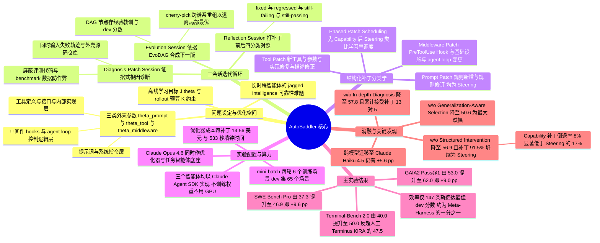

## 一、论文是干什么的？

想象你雇了一位聪明但心不在焉的实习生。他脑子很好使，可你让他连着做二十步的活儿——查资料、发邮件、改代码、再验证一遍——中间只要有一步走岔了，后面全盘皆输。你不太可能把这个人的大脑重新训练一遍，但你可以给他配一套**工作流程**：一份写清楚规矩的操作手册、一箱趁手的工具、几个在他即将犯错时弹出来的提醒便签。这套包在模型外面的东西，业内叫做**harness**（本文译作「外壳」或「驭具」）。

问题是，这套外壳目前几乎全靠人手工调。工程师要盯着几百条长得吓人的执行日志，猜测智能体到底在哪一步想歪了，然后改提示词、加个工具、插一段控制逻辑，再跑一遍看有没有变好。这个过程既贵又慢，而且每换一个底座模型或者换一个应用领域，就得从头再来一遍。这篇来自微软、KAIST、POSTECH 与南方科技大学的论文提出的 **AutoSaddler**，做的就是**把这个手工活自动化**：让一群 AI 智能体去读另一个 AI 智能体的失败日志，自己写补丁、自己验证、自己决定要不要留下这次修改。

论文里有个很关键的措辞：**durable updates**（可持久的更新）。意思是它要的不是「针对这一条失败轨迹的临时补丁」，而是**换到没见过的新任务上依然管用的改动**。在 GAIA2、SWE-Bench Pro、Terminal-Bench 2.0 三个长时程智能体基准上，AutoSaddler 分别把成功率提升了 9.0、9.6、10.0 个百分点——而这一切**完全没有动模型的一个权重**。

## 二、核心方法与创新

### 2.1 先把「外壳」形式化成可优化的参数

论文首先把一个模糊的工程概念变成了数学对象。它参照 LangChain 的工程实践，把外壳拆成三层参数：

$$
\theta = (\theta_{\mathrm{prompt}}, \theta_{\mathrm{tool}}, \theta_{\mathrm{middleware}}) \in \Theta
$$

- $\theta_{\mathrm{prompt}}$：系统提示词与各类指令，相当于**员工手册**。
- $\theta_{\mathrm{tool}}$：智能体能调用的工具及其接口、参数、内部实现，相当于**工具箱**。
- $\theta_{\mathrm{middleware}}$：运行时控制逻辑，包括钩子（hooks）和 agent loop 的行为，相当于**车间里的流水线规矩与安全护栏**。

优化目标写成期望形式：

$$
J(\theta) = \mathbb{E}_{(x, y^{*}) \sim \mathcal{T}} \mathbb{E}_{(\tau, \hat{y}) \sim P_{\theta}(\cdot \mid x)} [\mu(\hat{y}, y^{*})], \qquad \theta^{*} = \arg\max_{\theta \in \Theta} J(\theta)
$$

其中 $x$ 是任务，$\tau$ 是执行轨迹，$\hat{y}$ 是最终输出，$\mu$ 是评分函数（这里就是通过或失败）。注意 $P_{\theta}$ 是**随机的**——同一个外壳跑同一个任务两次，结果可能不同，因为 LLM 采样、工具调用决策、环境交互都带随机性。

现实中 $J(\theta)$ 看不见，每跑一次任务就烧掉一次预算。所以论文引入 rollout 预算 $K$，用经验估计代替：

$$
\widehat{J}_{D}(\theta) = \frac{1}{|D|} \sum_{(x_i, y_i^{*}) \in D} \frac{1}{R_i} \sum_{r=1}^{R_i} \mu(\hat{y}_{i,r}, y_i^{*})
$$

最后返回的，是**在开发集上得分最高的那个候选外壳**：

$$
\hat{\theta}_{\mathrm{AS}} = \arg\max_{\theta \in \mathcal{V}_{K,\mathrm{dev}}} \widehat{J}_{D_{\mathrm{dev}}}(\theta)
$$

这个「用 dev 集挑选」的动作看似平淡，后面消融实验会证明它是**整套方法里最要命的一环**。

### 2.2 一个绝妙的类比：把外壳优化当成 mini-batch 训练

论文最优雅的地方，是把整套流程设计成**标准机器学习训练循环的文本版**。把任务集切成训练集、开发集、测试集，然后每一轮迭代 $n$ 就像神经网络训练的一个 step：

1. 拿当前外壳 $H_n$ 在一个 mini-batch $B_n$ 上跑一遍（相当于**前向传播**）。
2. 诊断失败轨迹，生成结构化补丁 $\Delta\theta_n$，得到 $H_n' = H_n + \Delta\theta_n$（相当于**反向传播算梯度**）。
3. 在同一个 mini-batch 上验证：如果 $\widehat{J}_{B_n}(H_n') > \widehat{J}_{B_n}(H_n)$，才算这次更新有效（相当于**检查这一步下降了没有**）。
4. 通过验证的，再拿到开发集上跑一遍，看看是不是真的能泛化。

论文自己点出了这个类比里最重要的**不同点**：数值梯度是数学保证正确的，你不用验算；但**文本梯度不是**——一个 LLM 说「我觉得失败是因为提示词没写清楚」，它可能完全说错了。所以每一次更新都必须显式地「提出假设、动手改、跑实验验证」，这就是为什么 AutoSaddler 的第 3 步验证不可省略。

### 2.3 三个会话：诊断打补丁、反思、演化

整个循环由三个各司其职的智能体组成，全部用 Claude Agent SDK 实现。

**诊断打补丁会话**（Diagnosis-Patch Session）。这是最花力气的一步。诊断智能体拿到的不只是失败日志的摘要，而是**成功和失败的完整轨迹 + 外壳的源代码仓库**，它可以像人类工程师一样一层层往下翻：调工具查看某一步的具体输入输出、打开某个源文件看实现细节。论文特别强调它**不把诊断和打补丁拆成两步**——因为查案过程中攒下的上下文，正是写补丁时最需要的东西。同时有一道安全线：**只暴露实现外壳功能逻辑的源文件，评测代码和基准数据一律禁止访问**，防止智能体走捷径去改判分标准。

**反思会话**（Reflection Session）。补丁打完跑完之后，反思智能体把前后两次结果做对比，把每个任务归进四个筐：**fixed**（原来错现在对）、**regressed**（原来对现在错）、**still-failing**（一直错）、**still-passing**（一直对）。每一类都配有针对性的自省问题：这个补丁为什么管用？它修的是哪一类失败模式？为什么会引起倒退？为什么修得还不够？这一步的核心价值在于**发现副作用**——很多补丁在目标任务上是对的，却把一大批原本正常的任务搞坏了。

**演化会话**（Evolution Session）。所有历史经验存在一个叫 **EvoDAG** 的有向无环图 $\mathcal{G} = (V, E)$ 里：每个节点 $v_n$ 是一个探索过的外壳版本，挂着它的经验教训和性能分数；每条有向边 $e$ 是父版本到子版本的 diff $\Delta\theta$。演化智能体**不必只从最新版本往下接着改**，它可以查阅整张图，从任意几个历史分支里挑出好用的零件重新组装。这就像 Git 的 cherry-pick——论文在附录 J 的搜索轨迹可视化里明确区分了三种边：顺序继承、rebase 继承、以及导致图结构而非链结构的 **cherry-pick 合并**。这个设计的作用是**跳出局部最优**：某个早期分支上有个很妙的工具改动，但那条线后来走死了，EvoDAG 让这块零件还能被捡回来用。

### 2.4 补丁分类学：不许乱改，只能按类型改

如果放任智能体自由编辑整个代码库，会发生什么？论文给了一个非常尖锐的实测答案（见第四节消融）。所以它划出了明确的补丁类型表：

| 大类 | 子类型 | 性质 | 说明 |
| --- | --- | --- | --- |
| Prompt Patch | Prompt Rule Addition | Steering | 在系统提示里新增行为规则 |
| Prompt Patch | Prompt Rule Modification | Steering | 修订已有规则以消解冲突或加强指引 |
| Tool Patch | New Tool Addition | Capability | 现有工具无法完成某动作时新增工具 |
| Tool Patch | Argument Modification | Capability | 增补或修正工具参数以增强筛选能力 |
| Tool Patch | Implementation Fix | Capability | 修复工具内部 bug 或扩展功能 |
| Tool Patch | Tool Description Fix | Steering | 改写 docstring 以避免工具误用 |
| Middleware Patch | PreToolUse Hook | Steering | 在某个工具调用前注入即时提醒 |
| Middleware Patch | Infrastructure Change | Capability | 改配置、迭代预算或环境设置 |
| Middleware Patch | Agent Loop Logic Change | Capability | 在 agent loop 中加预处理步骤或预算提醒 |

这九种补丁又被归为两大阵营：**Capability Patch**（能力型，改的是可执行代码或编排逻辑，标 C）与 **Steering Patch**（引导型，只改文字不改代码，标 S）。

### 2.5 分阶段补丁调度：文本世界里的学习率衰减

最后一个巧思是 **Phased Patch Scheduling**（分阶段补丁调度）。论文明说这是在类比**学习率调度**：优化先进入 **Capability 阶段**——先做那些改动大、风险高、收益也高的结构性手术（加工具、改循环、调基础设施）；等结构定型了，再切到 **Steering 阶段**——做低风险的文字微调。转换点 $k$ 可以直接指定迭代数，也可以通过 capability 阶段的 epoch 数 $E$ 与 mini-batch 大小 $B$ 隐式确定。论文实验里 $E = 1$ 效果就很好，即让搜索带着高影响力补丁把训练集完整走一遍，然后转入精细调校。

这个顺序的道理很朴素：**先搭骨架再刷漆**。如果一上来就允许改提示词，智能体会本能地选那条最省事的路，永远不去动工具和中间件——这正是第四节要讲的实验发现。

### 2.6 三条设计原则

整篇论文把自己的贡献收敛成三句话，也是三条消融的对应项：

- **In-depth diagnosis**（深度诊断）：长时程失败需要**真正的调试**，而不是对着日志做一次浅层反思。
- **Structured intervention**（结构化干预）：外壳空间又大又杂，需要**有靶向的修改**，而不是无约束的乱编辑。
- **Generalization-aware selection**（泛化感知的选择）：目标是提升整个任务分布上的表现，需要**保留普适有用的改动**，而不是修好单条轨迹。

## 三、使用了哪些模型和计算资源？

这篇论文有个值得注意的特点：**它完全不训练模型，因此不涉及 GPU**。全文没有出现任何 GPU 型号、显卡数量或权重训练时长的描述，所有开销都是 API 调用开销。

| 项目 | 内容 |
| --- | --- |
| 主力底座模型 | **Claude Opus 4.6**，同时充当优化器侧 LLM 与任务智能体底座，使用默认端点设置 |
| 跨模型迁移实验 | **Claude Haiku 4.5** 作为较弱的任务智能体底座，外壳仍沿用 Opus 4.6 优化出来的版本 |
| 智能体实现框架 | **Claude Agent SDK**（CA-SDK），三个智能体（Diagnosis-Patch、Reflection、Evolution）均基于它构建 |
| GPU 型号与数量 | 暂无相关信息（本工作不训练模型权重，致谢中仅提到 Bo Qiao 协助搭建计算服务器） |
| 权重训练时长 | 不适用，暂无相关信息 |

**优化器侧开销**（GAIA2，按每条生成的补丁平均）：

| 方法 | 生成补丁数 | 被拒补丁 | 被接受补丁 | 墙钟时间/补丁 | 花费/补丁 | LLM 调用/补丁 | 输出 token/补丁 |
| --- | ---: | ---: | ---: | ---: | ---: | ---: | ---: |
| GEPA | 76 | 58 | 18 | 386 秒 | 5.50 美元 | 21.3 | 11,416 |
| Meta-Harness | 20 | 不适用 | 不适用 | 883 秒 | 12.65 美元 | 66.9 | 43,429 |
| **AutoSaddler** | 39 | 19 | 20 | **533 秒** | 14.56 美元 | 76.1 | 21,464 |

缓存相关的 token 用量：GEPA 每补丁 156,788 缓存创建输入 token 与 280,940 缓存读取输入 token；Meta-Harness 为 250,466 与 3,528,484；AutoSaddler 为 430,933 与 3,246,158。

读法是这样的：AutoSaddler 每条补丁比 Meta-Harness **贵 1.91 美元**，但**墙钟时间少 39.6%**（533 秒对 883 秒）。GEPA 最便宜，但它只搜索系统提示词这一个维度，可比性有限。

**任务智能体评测开销**（GAIA2，每次 rollout 平均）：20.2 次 LLM 调用、550,988 个输入 token、7,380 个输出 token、203.9 秒墙钟时间。论文指出**评测远比优化本身贵**，所以真正决定总成本的是「你评测了多少次」，而不是「你想补丁想了多久」。

- Meta-Harness 每次候选更新都要跑完 GAIA2 训练集加开发集共 **140 个场景**。
- AutoSaddler 每轮只跑 **6 个训练场景**，只有当补丁在 mini-batch 上有改善时，才触发 **65 个场景的开发集评测**。

论文没有披露端到端的总美元花费，只给了上述单位成本，这一项**暂无相关信息**。

## 四、实验结果

### 4.1 数据集与切分

为了真正考验泛化，论文没有做随机切分，而是**按任务组做分布外切分**：

| 基准 | 切分维度 | 训练集 | 开发集 | 测试集 |
| --- | --- | --- | --- | --- |
| GAIA2 | Universe（人物设定） | Universe 29，75 题 | Universe 30，65 题 | Universe 21 共 107 题、Universe 22 共 112 题、Universe 27 共 81 题 |
| SWE-Bench Pro | 代码仓库（编程语言） | qutebrowser（Python），79 题 | Vuls（Go）40 题、NodeBB（JavaScript）40 题 | Ansible（Python）96 题、Flipt（Go）85 题、Element-web（TypeScript）56 题 |
| Terminal-Bench 2.0 | 随机划分 | 30 题 | 19 题 | 40 题 |

Terminal-Bench 2.0 全库只有 89 题且横跨系统运维、机器学习、网络安全等异质领域，找不到天然的分组轴，只能随机切。

优化预算方面，AutoSaddler 与 GEPA 在 GAIA2 与 SWE-Bench Pro 上跑 2 个 epoch，在 Terminal-Bench 2.0 上跑 4 个 epoch。Meta-Harness 是全批量模式，2 个 epoch 只等于两次补丁更新，对它不公平，因此按**总任务执行次数对齐**，给它 GAIA2 跑 20 个 epoch、SWE-Bench Pro 跑 8 个、Terminal-Bench 2.0 跑 15 个。

### 4.2 主结果

以下均为测试集 Pass@1，原文报告的是三次运行的均值加减标准差，此处只列均值（原文标准差以下标形式给出，跨度大致从 0 到 7.6 个百分点）。

**GAIA2**

| 外壳（类型） | Universe 21 | Universe 22 | Universe 27 | 平均 |
| --- | ---: | ---: | ---: | ---: |
| Default Agent（人工） | 54.8 | 51.5 | 52.7 | 53.0 |
| GEPA（自动） | 60.1 | 47.9 | 56.4 | 54.6 |
| Meta-Harness（自动） | 53.0 | 51.5 | 56.0 | 53.2 |
| **AutoSaddler（自动）** | **61.4** | **60.7** | **64.6** | **62.0** |

**SWE-Bench Pro**

| 外壳（类型） | Ansible | Flipt | Element-web | 平均 |
| --- | ---: | ---: | ---: | ---: |
| SWE-agent（人工） | 40.6 | 31.0 | 41.1 | 37.3 |
| GEPA（自动） | 50.0 | 32.2 | 45.2 | 42.5 |
| Meta-Harness（自动） | 36.9 | 31.3 | 38.7 | 35.3 |
| **AutoSaddler（自动）** | **58.0** | **36.5** | 43.5 | **46.9** |

**Terminal-Bench 2.0**

| 外壳（类型） | 测试集 40 题 |
| --- | ---: |
| Terminus 2（人工） | 40.0 |
| Terminus KIRA（人工专家调优） | 47.5 |
| GEPA（自动） | 42.5 |
| Meta-Harness（自动） | 43.3 |
| AutoSaddler 第 2 轮（自动） | 45.0 |
| **AutoSaddler 第 34 轮（自动）** | **50.0** |

用大白话总结三件事：

1. **相对各自的基线外壳**，AutoSaddler 分别提升 **+9.0 pp**（GAIA2）、**+9.6 pp**（SWE-Bench Pro）、**+10.0 pp**（Terminal-Bench 2.0）。
2. **相对最强的自动化基线**，分别领先 **+7.4 pp**、**+4.4 pp**、**+6.7 pp**。值得注意的是，两个自动化基线在部分基准上甚至**跑输了人工基线**——Meta-Harness 在 SWE-Bench Pro 上只有 35.3，比 SWE-agent 的 37.3 还低。
3. 在 Terminal-Bench 2.0 上，AutoSaddler 的 50.0 **超过了人类专家手工调优的 Terminus KIRA**（47.5），领先 2.5 pp。这大概是全文最有冲击力的一个数字：机器自动调的外壳，赢过了人调的。

### 4.3 效率：少烧十倍的轨迹

论文比较的不只是天花板，还有**到达天花板要烧多少次任务执行**。

- AutoSaddler 用约 1,000 次 rollout 达到 **72.3%** 开发集准确率；GEPA 与 Meta-Harness 烧了约 2,800 次，分别只饱和在 **64.6%** 与 **61.5%**。
- 若按「真正用于学习的轨迹数」算，AutoSaddler 只消耗 **147 条轨迹**就达到最佳开发集分数，比 Meta-Harness 的 1,400 条**少约 10 倍**。
- 论文另给出一个更严苛的对照：AutoSaddler 仅用 **391 次** rollout 就达到 67.7% 开发集准确率，已经超过 Meta-Harness 烧了 1,400 次才摸到的 61.5% 峰值。

### 4.4 三组消融：哪一块最不能少

| 设置 | GAIA2 测试集 Pass@1 | 相对完整版 |
| --- | ---: | ---: |
| **完整 AutoSaddler** | **62.0** | — |
| w/o In-depth Diagnosis | 57.8 | −4.2 pp |
| w/o Structured Intervention | 56.9 | −5.1 pp |
| w/o Generalization-Aware Selection | 50.6 | **−11.4 pp** |

**RQ1，深度诊断**。把 CA-SDK 式的深挖诊断换成「一次 LLM 调用读日志猜原因」这种自动提示词优化里常见的浅层反思，成绩掉到 57.8。附录数据说明了差在哪：诊断打补丁联合会话平均每步多用 **6.2 次工具调用**和 **5.8 次文件访问**。到第一个 epoch 结束（第 25 轮）时，深度诊断累计通过了 **13 个**补丁，浅层反思只有 **5 个**。多花力气查案，确实换来更多真正管用的修改。

**RQ2，结构化干预**。这一组的分析最有意思。去掉补丁分类学与分阶段调度、让智能体自由编辑之后，成绩从 62.0 掉到 56.9。原因不是「改得不够多」，而是**改得太偷懒**：无约束设置下，**91.5% 的补丁全部坍缩到 Steering 类**，也就是改改文字了事，几乎不碰工具和基础设施。

而按接受率排，恰恰是那些它不愿意碰的类型最有价值：**New Tool 接受率 83%、Agent Loop 变更 71%、基础设施变更 67%**。这些高价值补丁在无约束设置下只占生成量的 **4%**，AutoSaddler 通过结构化调度把它们的占比拉到 **25% 以上**。

更细的拆解还显示，**Capability 类补丁与 Steering 类补丁的修复率相当（55% 对 58%），但引发倒退的比例低得多（8% 对 17%）**——这正是标题里 durable（可持久）一词的实证支撑：改代码比改措辞更不容易产生副作用。

进一步的细粒度消融：只去掉分阶段调度，Pass@1 从 60.7 掉到 54.8；再去掉整个结构化干预，进一步掉到 53.3。

**RQ3，泛化感知的选择**。这是跌得最惨的一项，−11.4 pp。有趣的是，论文把成绩拆成两个指标后发现，两种设置的 **fix rate**（原本失败的场景被修好的比例）**差不多**——也就是说，差距不在「会不会解题」，而在 **regression rate**（原本通过的场景被搞坏的比例）。AutoSaddler 的倒退率整体呈**下降趋势（−0.24 pp/轮）**，消融版则是**上升趋势（+0.16 pp/轮）**。

论文举了一个非常具体的案例：消融版在第 20 轮加了个新工具 `send_progress_message_to_user`，还改了高频工具 `send_message_to_user` 的钩子，强行把智能体导向新工具。因为没有反思机制去评估附带损害，这个过宽的补丁被留了下来，结果第 21 轮开发集倒退率从 **8% 飙到 22%**。有意思的是，**AutoSaddler 自己在第 4 轮也犯过一模一样的错**——同样是给高频工具挂了个越界的钩子——但反思机制把它拦下来了。这个对照非常干净地说明了这套机制在防什么。

细粒度上：只去掉 dev 集过滤，Pass@1 从 60.7 掉到 50.0；再去掉带 EvoDAG 的反思，进一步掉到 44.9。

### 4.5 稳健性与跨模型迁移

- **优化随机性**：另一次独立的优化运行得到 58.6% Pass@1，仍显著高于基线外壳。
- **训练分布偏移**：换一个训练 Universe 重新优化，得到 57.4%，相对基线仍有 +5.9 pp。
- **跨模型迁移**：把任务智能体底座从 Opus 4.6 换成更弱的 **Haiku 4.5**、外壳保持不变，AutoSaddler 相对默认外壳仍有 **+5.6 pp** 提升，并且在所有测试 Universe 上都优于全部基线与消融设置。这说明**外壳优化的成果有一定的跨模型可移植性**，不是过拟合到某个特定模型的怪癖上。

### 4.6 需要留意的一处原文数字不一致

论文正文 5.2 节写「over SWE-agent on SBP by +8.4 pp（37.3% 到 46.9%）」，但 $46.9 - 37.3 = 9.6$，与摘要、引言、结论以及 GitHub README 中的 **+9.6 pp** 一致，因此正文那个 8.4 应为笔误。同样，5.2 节写相对最强自动化基线在 SBP 上领先 6.2 pp、在 TB2 上领先 4.4 pp，但按表格计算应为 SBP **+4.4 pp**、TB2 **+6.7 pp**，与引言和结论的表述一致——5.2 节这里疑似把两个数字写颠倒了。本综述采用与表格计算相符的版本。

## 五、潜在应用与已落地应用

### 已经落地的部分

- **开源代码库**：[microsoft/AutoSaddler](https://github.com/microsoft/AutoSaddler)，MIT 许可证，要求 Python 3.12 到 3.14 加 uv 加 Git。截至本综述撰写时（2026-08-29）有 132 个 star、7 个 fork，最近一次推送为 2026-08-25。
- **项目主页与短视频**：[AutoSaddler 项目主页](https://autosaddler-projectpage.github.io/)，提供交互式的分模型结果、消融、算力效率图与优化轨迹可视化。
- **后续版本迭代**：README 的 News 显示，2026-08-25 已加入 V2 支持，可在 GAIA2 上优化 [Meta-ARE](https://github.com/pshlego/Meta-ARE) 外壳。
- README 中还列出了一项论文正文之外的工程特性：**durable execution**（可持久执行），包括只追加的事件记录、不可变来源追溯、可恢复状态与内容寻址的候选版本管理——这是把研究原型往工程可用方向推的信号。

### 潜在方向

- **换模型时的自动适配**。论文引言明确点出这个动机：当你把底座从一个 LLM 换到另一个，原来精心调的外壳未必还适用。AutoSaddler 加上跨模型迁移的实证（Haiku 4.5 上 +5.6 pp），提供了一条「换模型后自动重调外壳」的路径。这在成本敏感的生产环境里价值很直接——用贵模型优化外壳，再把外壳部署到便宜模型上。
- **企业级编码智能体的持续改进**。SWE-Bench Pro 的切分方式本身就是按仓库和编程语言分的，Ansible 上从 40.6 提到 58.0 这种幅度，对内部代码助手的落地体验会有明显影响。
- **智能体运维的自动化**。EvoDAG 这套「每次改动都有 diff、有经验教训、有分数」的结构，本质上是给智能体系统建了一份**可追溯的变更历史**，很适合接进 CI 流程。
- **需要清醒看待的限制**。论文自己划了边界：它假设任务**无状态且相互独立**，因此**明确不考虑记忆与技能编排**（memory 与 skill curation）这两类外壳组件。此外优化过程本身要烧掉上千次任务执行，对没有可靠自动评分器的场景不好直接套用。

## 六、网络上的讨论与评价

截至 2026-08-29 综述撰写时，检索到的情况如下。

**HuggingFace 论文页**（[papers/2608.23041](https://huggingface.co/papers/2608.23041)）：**60 个 upvote**，由第一作者 Sungho Park 于 2026-08-26 提交到 Daily Papers。评论区目前只有两条：

1. 第一作者本人贴出 GitHub 仓库链接（收到 1 个 👍 反应）。
2. **Librarian Bot** 的自动化相似论文推荐，列出了 Co-Harness、Hierarchical Self-Improvement、Evo-Harness、MemoHarness、Harness-R1、TTHE、Rethinking the Evaluation of Harness Evolution for Agents 等一批 2026 年的同期工作。

这份机器人推荐列表本身就是个有价值的信号：**2026 年的 harness 自动优化方向已经相当拥挤**，同时期至少有七八篇同主题论文，AutoSaddler 是其中把「结构化补丁分类 + 泛化感知选择」讲得最系统的一篇。

**AI 通讯报道**：[smol.ai 的 AINews 2026-08-25 期](https://news.smol.ai/issues/26-08-25-not-much)提到了这篇论文，原文表述为「a new Microsoft-led paper on AutoSaddler treats the harness as code and patches prompts, tool configs, and control logic offline using failure traces, reporting gains of +9.0 on GAIA2, +9.6 on SWE-Bench Pro, and +10.0 on Terminal-Bench 2.0 over base harnesses」。这是一句中性的事实转述，没有附带评价。

**未检索到的部分**：截至综述时**未检索到 Twitter/X、Reddit r/MachineLearning、Hacker News、知乎、机器之心上针对这篇论文的集中讨论或深度点评**。中文搜索的结果主要指向 Harness Engineering 这个大方向的科普内容（如 datawhalechina/self-harness 教程、相关综述与知乎讨论），并未出现专门分析 AutoSaddler 的中文文章。GitHub 的 132 star、7 fork 属于起步阶段的关注度，考虑到论文发布仅五天且挂在 microsoft 组织下，还看不出明确的社区扩散趋势。

一句话总结舆论现状：**学术圈内的能见度尚可（60 upvote、被 AI 通讯点名），但公共讨论区还没有真正热起来**。

## 七、思维导图

