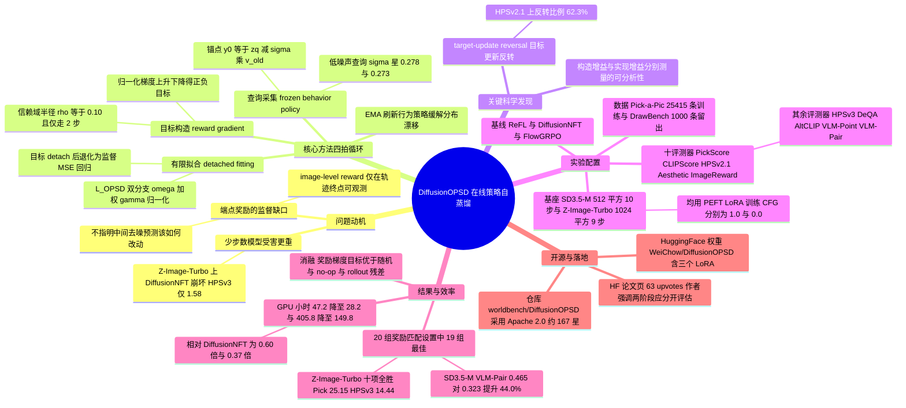

## 一、论文是干什么的？

想象你在教一个学徒画画。学徒画完一整幅画交给你，你只说一句「这幅画 7 分」。学徒会很崩溃：我到底哪里画错了？是构图？是配色？是第三笔线条太粗？只给一个总分，学徒根本不知道下一次该怎么改。这就是当前用强化学习（RL）对齐扩散模型时的核心尴尬：扩散模型生成一张图要经过几十步「从噪声一点点擦干净」的去噪过程，而人类偏好模型（比如 HPSv2、PickScore）只在最后那张成品图上打一个分数。这个分数没法告诉模型：**第 7 步的那个中间预测应该往哪个方向挪一点**。论文把这个现象叫做「中间预测处的监督缺口」。

这篇来自 ByteDance Seed 等机构的论文提出了 **DiffusionOPSD**（On-Policy Self-Distillation in Diffusion Models，扩散模型中的在线策略自蒸馏）。它的思路特别直观：既然打分模型是可微分的（能算梯度），那我们就不要只把分数当成一个「事后评语」，而是直接问它一句「如果我把这张中间预测图往某个方向挪一点点，分数会涨还是会跌？」。顺着这个方向挪一小步，就得到一个「更好的样板」；逆着挪一小步，就得到一个「更差的反例」。然后让正在训练的模型去**照着这个样板临摹**——把原本模糊的「7 分」变成了每一步都看得见、摸得着的具体目标。因为老师和学生本质上是同一个模型的两个副本（一个冻结当「行为策略」，一个可训练当「学生」），所以叫做「自蒸馏」；因为查询状态来自模型自己当前跑出来的轨迹，所以叫「在线策略（on-policy）」。

结果相当漂亮：在 SD 3.5-M 和 Z-Image-Turbo 两个基座、十个评测器、共 20 组奖励对齐设置里，它在 19 组拿下最佳的留出集成绩，相对最强基线最高提升 **44.0%**，同时相对 DiffusionNFT 把训练 GPU 小时数分别砍掉了 **40%** 和 **63%**。代码已在 [worldbench/DiffusionOPSD](https://github.com/worldbench/DiffusionOPSD) 以 Apache 2.0 协议开源。

## 二、核心方法与创新

### 2.1 先理解「扩散模型的监督缺口」到底缺在哪

扩散模型生成图像，可以理解成一个「逐步擦除噪声」的过程。设某个时刻的带噪隐变量为 $z_q$，对应的噪声水平为 $\sigma_q$，模型预测一个速度场 $v(z_q, c, \sigma_q)$（$c$ 是文本条件）。由此可以外推出模型此刻「心里想画成的那张干净图」：

$$
y_0 = z_q - \sigma_q\, v_{\mathrm{old}}(z_q, c, \sigma_q)
$$

这个 $y_0$ 论文称为**锚点**（anchor），也就是「当前这一步的干净输出预测」。传统 RL 方法（如 FlowGRPO、DiffusionNFT）拿到的只是整条轨迹跑完后成品图的一个标量奖励 $R$，然后靠策略梯度或者对比信号把这个标量「摊回」到每一步上。这就像老师只说「7 分」，学生得自己猜哪一笔该改。DiffusionOPSD 的关键动作是：**直接在锚点 $y_0$ 的邻域里，把这个标量奖励变成一个明确的坐标**。

### 2.2 用奖励梯度在锚点周围造出「正样板」和「反样板」

既然奖励模型 $\widetilde R(y, c)$ 对图像 $y$ 是可微的，那么 $\nabla_y \widetilde R(y, c)$ 就直接告诉了我们「往哪挪能涨分」。论文从锚点出发，做若干次**归一化的梯度上升 / 下降**：

$$
y_+ \leftarrow y_+ + h\,\frac{\nabla_y \widetilde R(y_+, c)}{\|\nabla_y \widetilde R(y_+, c)\|_2 + \epsilon}
$$

$$
y_- \leftarrow y_- - h\,\frac{\nabla_y \widetilde R(y_-, c)}{\|\nabla_y \widetilde R(y_-, c)\|_2 + \epsilon}
$$

这里有三个设计非常讲究：

- **归一化**。分母上的 $\|\cdot\|_2$ 把梯度的长度抹平，只保留方向。这样不管奖励模型此刻给出的梯度是特别陡还是特别平，每一步挪动的幅度都由步长 $h$ 说了算，避免了某些奖励模型梯度尺度失控导致训练爆炸。$\epsilon$ 只是防止除零的小常数。
- **有界（bounded）**。整个挪动被限制在以锚点为中心、半径为 $\rho$ 的**信赖域**里（论文两个基座都用 $\rho = 0.10$）。这就像老师改画时只能在原作上做轻微修饰，不能重画一张——保证目标始终在学生「够得着」的范围内，不会变成一个学生一步跳不到的空中楼阁。
- **正负成对**。$y_+$ 是「这么改会更好」的样板，$y_-$ 是「这么改会更糟」的反例。同时提供正反两个方向，比只给一个正样板信息量更大，也更能防止模型在奖励模型的盲区里「刷分作弊」（reward hacking）。

论文中默认只走 **2 步**梯度，非常保守。这不是省算力，而是有理论上的考量（见 2.4 节的重要发现）。

### 2.3 「脱钩的有限拟合」：把目标当成静态的临摹范本

拿到 $y_+$ 和 $y_-$ 之后，它们被 **detach**（切断梯度回传），变成两个纯粹的常数张量 $\bar y_+$、$\bar y_-$。可训练策略 $\theta$ 在同一个查询状态上给出自己的干净输出预测 $y_\theta^+$、$y_\theta^-$，然后做最简单的均方误差回归：

$$
\mathcal{L}_{\mathrm{OPSD}} = \omega\,\frac{\|y_\theta^{+} - \bar y_{+}\|_2^2}{\gamma_{+}} + (1-\omega)\,\frac{\|y_\theta^{-} - \bar y_{-}\|_2^2}{\gamma_{-}}
$$

其中 $\gamma_+$ 和 $\gamma_-$ 是「脱钩的平均绝对残差归一化因子」，作用是让正负两条分支的损失量级可比，不至于一边压倒另一边；权重 $\omega$ 则根据该样本 rollout 得到的奖励高低动态决定「这次是更该学正样板还是更该躲开反例」。

这一步的意义远比它看上去大。**它把一个强化学习问题降格成了一个监督学习问题**：不再需要重要性采样、不再需要 KL 惩罚项、不再需要在整条轨迹上回传梯度。学生要做的只是「临摹两张静态的图」。这正是训练加速的来源——DiffusionNFT 之类的方法需要在长轨迹上反复前向反向，而 OPSD 只在一个采样到的查询状态上做有限次拟合。

### 2.4 最有意思的发现：目标构造得越好，模型不一定学得越好

这篇论文真正的「学术味」在于，它把整个流程**显式地拆成两个可以分别测量的阶段**：

1. **目标构造增益**（target construction）：我造出来的 $\bar y_+$，比锚点 $y_0$ 的奖励高了多少？
2. **有限实现增益**（finite realization）：学生模型照着 $\bar y_+$ 拟合一次之后，它真正生成的东西，奖励涨了多少？

直觉上这两者应该正相关：范本越好，学生学完越好。但论文的**受控同查询实验**（controlled same-query experiments）给出了反直觉的结论：**目标构造的增益变大，并不一定带来更大的实际实现增益**。论文把这个现象叫做**目标—更新反转**（target-update reversal）。在 HPSv2.1 这个奖励上，「构造得更好」的目标反而带来更差的模型更新，比例高达 **62.3%**。

这个发现解释了为什么方法要如此保守（只走 2 步梯度、信赖域半径只有 0.10）：把目标推得太远，虽然在奖励模型的数值上很好看，但那个点可能落在扩散模型的自然输出流形之外，学生一步拟合不到，硬拟合反而会把模型带偏。作者在 HuggingFace 论文页的评论里也强调了这一点，大意是「目标构造和目标实现是两个不同的优化问题，应当分开评估」。这也是摘要里把本方法称作 efficient and analyzable 的原因——传统 RL 方法把这两件事糊在一起，出了问题根本没法定位。（注意 analyzable 只出现在摘要末句，并不在论文标题里。）

### 2.5 EMA 刷新：让老师和学生一起进步

如果冻结的行为策略永远不变，那么它采集到的查询状态会越来越偏离学生当前的真实分布（分布漂移）。DiffusionOPSD 的做法是：每完成一个外层迭代，就用**指数滑动平均**（EMA）把学生的权重缓慢地融进行为策略里。于是老师始终比学生「慢半拍但方向一致」，下一轮采集到的查询状态又重新贴合学生的当前能力。

整个循环因此可以概括成四拍：

1. **采查询**：冻结的行为策略跑出轨迹，在**较低噪声水平**处采样查询状态（SD 3.5-M 用 $\sigma^{*} = 0.278$，Z-Image-Turbo 用 $\sigma^{*} = 0.273$），并算出锚点 $y_0$。之所以挑低噪声段，是因为此时的干净输出预测已经比较像一张真实图片，奖励模型给出的梯度才有意义。
2. **造目标**：用归一化奖励梯度在信赖域内构造 $\bar y_+$ 与 $\bar y_-$。
3. **拟合**：可训练策略在有限的更新预算内回归这两个脱钩目标。
4. **刷新**：EMA 更新行为策略，回到第 1 步。

### 2.6 和已有方法的对比一句话总结

- **ReFL**：直接把奖励梯度回传穿过去噪步骤，简单但容易 reward hacking，也吃显存。
- **FlowGRPO**：把流匹配采样改造成 MDP 上的 GRPO，是纯策略梯度路线，信号稀疏。
- **DiffusionNFT**：用正负样本的对比来做无似然的策略优化，不需要梯度，但轨迹开销大。
- **DiffusionOPSD**：不做策略梯度，而是**先把奖励翻译成图像空间里的显式坐标，再用监督回归去追**。这既保留了 on-policy 的分布匹配优势，又拿回了监督学习的稠密信号和低开销。

## 三、使用了哪些模型和计算资源？

**扩散模型基座（两个）**

| 基座 | 分辨率 | 采样步数 | 训练 CFG | 微调方式 |
|---|---|---|---|---|
| SD 3.5-M（Stable Diffusion 3.5 Medium） | $512^2$ | 10 步，CFG-free rollout | 1.0 | PEFT LoRA |
| Z-Image-Turbo（步数蒸馏模型） | $1024^2$ | 9 步原生少步 | 0.0 | PEFT LoRA |

两个基座的留出评测协议并不相同：SD 3.5-M 用 DrawBench 的 Flow-40 CFG-free 协议（40 步、guidance scale 1.0）；Z-Image-Turbo 则沿用它自己原生的 9 步、$1024^2$ 协议（guidance scale 0.0）。

**算力**

- 官方仓库给出的是**八卡（eight-GPU）配置档**用于效率测量；对于 Z-Image 配重型奖励模型（HPSv3、DeQA）的场景，采用 6 个策略 rank 加 1 个可微奖励服务 rank 的拓扑（`NPROC=7`）。
- **具体 GPU 型号（如 A100 / H100 / H800）暂无相关信息**——摘要页、仓库 README 与可获取的页面均未明确写出卡型，故不做臆测。
- 训练开销（每 100 次优化器更新）：

| 基座 | 方法 | 每次更新秒数 | 峰值显存 | GPU 小时 / 100 次更新 | 相对 NFT |
|---|---|---|---|---|---|
| SD 3.5-M | DiffusionNFT | 212.4 | 47.8 GB | 47.2 | 1.00 倍 |
| SD 3.5-M | DiffusionOPSD | 126.9 | 50.0 GB | 28.2 | 0.60 倍 |
| Z-Image-Turbo | DiffusionNFT | 1826.2 | 49.9 GB | 405.8 | 1.00 倍 |
| Z-Image-Turbo | DiffusionOPSD | 674.0 | 61.5 GB | 149.8 | 0.37 倍 |

也就是省下 40%（SD 3.5-M）到 63%（Z-Image-Turbo）的 GPU 小时。代价是显存略高一些（多出约 2 GB 到 12 GB），属于「用一点显存换很多时间」的划算买卖。

**数据与超参**

- 训练提示词：Pick-a-Pic 论文清单，共 **25,415 条**提示词，仓库提供带 SHA-256 校验的重建脚本。
- 留出评测：固定 **1,000 条** DrawBench 提示词清单。
- 关键超参：信赖域半径 $\rho = 0.10$；奖励梯度步数 2；分支系数 $\beta = 1.0$（Open3 场景用 0.1）；每次更新 48 个 prompt group；主实验预算 100 次优化器更新；损失中的梯度系数 $c_{\mathrm{adv}} = 5$；查询噪声水平如上表所述。步长 $h$、$\epsilon$ 的具体数值与 EMA 衰减系数在可获取的材料中**暂无相关信息**。

需要说明的一点：本文的评测集是 DrawBench 与十个奖励/偏好评测器，**并未使用 GenEval、T2I-CompBench 这类组合性构图基准**，任务描述中提到的这些名称在本文中未见出现。

## 四、实验结果

一句话大白话：**在几乎所有测试项上都是第一名，而且训练时间只要对手的一半左右。**

论文的评测协议是「奖励匹配（reward-matched）」——即用哪个奖励训练，就重点看那个奖励在留出集上涨了多少，避免了「用 A 训练却只报 B 的分数」这种取巧。两个基座乘以十个评测器共 20 组设置，DiffusionOPSD 拿下 **19 组**的最佳最终留出成绩。

**SD 3.5-M 留出集结果**

| 方法 | Pick | CLIP | HPSv2.1 | Aes | ImgR | HPSv3 | DeQA | AltCLIP | Point | Pair |
|---|---|---|---|---|---|---|---|---|---|---|
| ReFL | 23.92 | 0.308 | 0.358 | 12.09 | 1.28 | 9.33 | 4.85 | 0.408 | 0.193 | 0.290 |
| DiffusionNFT | 23.43 | 0.298 | 0.336 | 9.11 | 1.46 | 9.14 | 4.76 | 0.412 | 0.199 | 0.323 |
| **DiffusionOPSD** | **24.94** | **0.340** | **0.390** | 12.08 | **1.76** | **13.34** | **4.94** | **0.450** | **0.214** | **0.465** |

那个被摘要重点提及的 **44.0%** 提升，正是出现在 SD 3.5-M 的 VLM-Pairwise 这一列：0.465 对 DiffusionNFT 的 0.323，恰好高出 44.0%。而唯一没拿第一的那格，是 SD 3.5-M 的 Aesthetic 分（12.08 对 ReFL 的 12.09），差距是小数点后第二位，基本可以视为打平。

**Z-Image-Turbo 留出集结果**

| 方法 | Pick | CLIP | HPSv2.1 | Aes | ImgR | HPSv3 | DeQA | AltCLIP | Point | Pair |
|---|---|---|---|---|---|---|---|---|---|---|
| FlowGRPO | 22.96 | 0.275 | 0.305 | 5.46 | 1.01 | 7.11 | 4.51 | 0.394 | 0.217 | 0.420 |
| ReFL | 24.54 | 0.313 | 0.380 | 9.79 | 1.37 | 13.77 | 4.60 | 0.441 | 0.227 | 0.481 |
| DiffusionNFT | 22.28 | 0.280 | 0.277 | 6.07 | 0.58 | 1.58 | 3.37 | 0.363 | 0.166 | 0.357 |
| **DiffusionOPSD** | **25.15** | **0.320** | **0.390** | **10.74** | **1.79** | **14.44** | **4.78** | **0.451** | **0.243** | **0.551** |

值得注意的是，DiffusionNFT 在 Z-Image-Turbo 这个**步数蒸馏**基座上表现明显崩坏（HPSv3 只有 1.58，ImageReward 只有 0.58，都低于其他方法一大截）。这从侧面印证了论文的动机：对少步数模型来说，每一步的信息量极大，把奖励信号靠稀疏的轨迹级对比「摊回去」是不够的，必须给每一步明确的目标。

**消融实验的三条结论**

1. **奖励梯度目标确实有效**：把 $\bar y_\pm$ 换成随机方向目标、no-op（不动）目标、或者 rollout 残差目标作为对照，效果都不如真正的奖励梯度目标。说明涨分来自「方向对」，不是来自「多做了一次回归」这种正则化副作用。
2. **实现设置很稳健**：在测试过的一系列变体中，论文给出的默认设置（$\rho = 0.10$、2 步梯度、正负双分支）表现稳定，不需要针对每个奖励精细调参。
3. **目标—更新反转**：如 2.4 节所述，构造增益与实现增益并非单调对应，HPSv2.1 上反转比例达 62.3%。消融还专门隔离了训练与评测两端 CFG 设置的依赖性。

## 五、潜在应用与已落地应用

**已落地的部分（可直接用）**

- 官方仓库 [worldbench/DiffusionOPSD](https://github.com/worldbench/DiffusionOPSD) 已完整开源，Apache 2.0 协议，截至综述时约 167 星、1 fork、2 个 issue。环境要求为较新的 Linux、CUDA GPU、Python 3.10 到 3.11。
- 提供了四套训练启动脚本：`train_public.sh`（7 个评测器的单奖励训练）、`train_mixed_reward.sh`（任意正权重的多奖励混合）、`train_baseline.sh`（DiffusionNFT 与 FlowGRPO 基线）、`train_refl.sh`（ReFL 基线）。基线复现脚本一并给出，这一点在同类工作中比较少见，方便公平比较。
- 已在 HuggingFace 上放出三个 LoRA 权重（仓库 `WeiChow/DiffusionOPSD`）：`sd35-m-hpsv3`、`z-image-turbo-hpsv3`、`z-image-turbo-pointwise`。
- 需要注意：HPSv3 与 DeQA 这两个「重型奖励」需要单独配环境以避免依赖冲突。

**潜在方向**

- **文生图产品的偏好对齐**：因为省一半以上 GPU 小时，且以 LoRA 形式增量微调，很适合在已上线的模型上做低成本的风格 / 审美迭代。
- **少步数蒸馏模型的后训练**：Z-Image-Turbo 上 63% 的加速与 DiffusionNFT 的明显崩坏形成对比，说明这条路线对 Turbo 类少步数模型特别友好——而这类模型正是实际部署的主流。
- **多奖励混合与可定制审美**：`train_mixed_reward.sh` 支持任意正权重组合，理论上可以按业务需求调配「更好看」与「更贴合文本」之间的比例。
- **迁移到其他连续状态的生成模型**：论文提出的「把标量奖励翻译成状态空间里的有界目标」这个范式，原则上不限于图像扩散，视频扩散、3D 生成、乃至扩散语言模型都可能适用（学界已有 dOPSD 等面向扩散语言模型的相关工作在探索类似方向）。
- **可诊断的对齐研究**：把「目标构造」与「目标实现」分离测量这一方法论本身，可能比方法本身更有长期价值——它给了研究者一把定位 RL 对齐失败原因的尺子。

## 六、网络上的讨论与评价

**HuggingFace 论文页**：[huggingface.co/papers/2608.24646](https://huggingface.co/papers/2608.24646) 截至综述时获得 **63 个 upvote**，在同期论文中属于关注度不错的水平。页面上有作者本人留下的一条要点评论，核心意思是：**目标构造阶段的更大奖励增益，并不必然带来模型更新后更大的实际增益**，因此目标构造与目标实现应当被视为两个独立的优化问题、分别评估。这与论文正文中「目标—更新反转」的发现一致，也说明作者自己把这条方法论上的观察看得比 SOTA 数字更重。除此之外，**未检索到 HF 页面上有其他社区用户的讨论串**。

**GitHub**：仓库约 167 星、1 fork、2 个未关闭 issue，属于刚发布不久、正在起量的状态。issue 内容暂无相关信息。

**社交媒体与中文社区**：截至综述时（2026-08-29，论文发布仅 4 天），**未检索到 Twitter/X、Reddit r/MachineLearning、Hacker News 上针对本文的集中讨论**，也未检索到知乎、机器之心等中文平台对这篇论文的专门解读文章。搜索中文关键词时，返回的多是关于 on-policy distillation（OPD）这一大方向的综述性讨论，以及同期相关但不同的工作（如 D-OPSD、DiffusionOPD、dOPSD），并非针对本文。

需要提醒读者：由于论文极新，目前所有正面评价基本来自论文自身报告的数字与官方仓库，**尚无独立第三方复现或批评性评论**，结论请保留一定审慎。

**关于本综述的信息来源限制**：arXiv 的 [HTML 全文页面](https://arxiv.org/html/2608.24646) 与 [v1 页面](https://arxiv.org/html/2608.24646v1) 在撰写时均返回 404，PDF 文件超出抓取工具的体积上限，因此本文的方法细节主要综合自 arXiv 摘要页、官方 GitHub 仓库 README、以及第三方论文索引站的摘录。下列信息**暂无相关信息**：GPU 具体型号、EMA 衰减系数、步长 $h$ 与 $\epsilon$ 的数值、$\omega$ 的具体计算式、完整的消融数值表、学习率与 LoRA 秩。

## 七、思维导图

