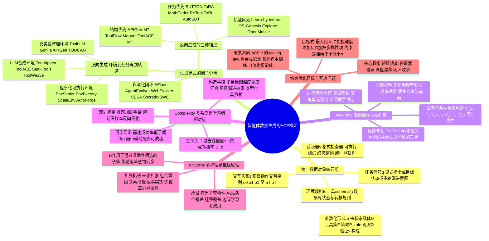

## 一、论文是干什么的？

现在的大模型（LLM）不只是聊天了，它们要去「干活」：调用 API 查天气、点开网页填表单、在代码仓库里跑测试、操作手机 App。这类会动手的模型叫**智能体**（Agent）。要教会模型干活，就得给它看大量「干活的录像」——某个环境长什么样、用户提了什么要求、模型一步步怎么操作、最后有没有成功。这些录像就叫**智能体数据**（agentic data）。

问题在于，真实的干活录像极其稀缺（谁会把自己一天点了哪些按钮录下来给你训练？），所以业界几乎全靠「合成」——让一个强模型自己编环境、自己出题、自己作答。于是过去两年冒出了上百种数据合成方法，各说各话：做工具调用的一套，做网页 GUI 的另一套，做代码的又是一套，指标也互不相通。这篇来自华为、上海交大等机构的综述想解决的就是这个乱局：**它不提出新模型，而是提出一副「眼镜」，让你能用同一套语言看懂所有这些方法在干什么、好在哪、差在哪。**

打个比方：这篇论文就像给「练习题出题行业」写了一本教研手册。以前每个学科的老师各自出题，数学老师说要难，语文老师说要多样，物理老师说要贴合实际，谁也说服不了谁。这本手册说：不管什么学科，一道好题都要同时满足三件事——**题目本身不能出错**（准确性）、**难度要卡在学生的成长区间**（复杂度）、**一整套题要覆盖不同题型而不是同一题换数字**（多样性）。这三个词的英文首字母拼起来就是论文标题里的 ACE：Accuracy、Complexity、divErsity。

## 二、核心方法与创新

### 2.1 第一层：把所有智能体数据拆成同一个四元组

论文的第一步是「统一度量衡」。它主张：无论你是做工具调用、网页操作还是软件工程，一条智能体数据都可以写成同一个四元组：

$$
d = (E, q, \tau, v)
$$

- $E$ 是**环境规格**（Environment specification）：这个世界里有什么工具、数据库长什么样、状态怎么转移、有哪些权限和终止条件。相当于游戏的地图和规则书。
- $q$ 是**任务信号**（Task signal）：要达成什么目标、有什么约束。它可以是一句明确指令，也可以是一个目标状态，甚至是用户藏着掖着、要靠多轮对话才慢慢说清的意图。相当于任务卡。
- $\tau$ 是**交互实现**（Interaction realization）：具体怎么一步步做的，形如 $\tau = (o_0, a_1, o_1, \ldots, a_T, o_T)$，也就是「观察—动作—观察」的交替序列。做监督微调（SFT）时它就是一条示范轨迹。相当于通关录像。
- $v$ 是**验证器**（Verifier）：可选的判分接口，可以是格式检查器、可执行的单元测试、终态判定规则、策略规则、证明助手，或者一个 LLM 裁判。相当于标准答案或裁判。

底层的形式化建模是一个部分可观测马尔可夫决策过程（POMDP）：

$$
\mathcal{M} = (\mathcal{U}, \mathcal{S}, \mathcal{A}, \mathcal{O}, \mathcal{P}, \mathcal{R})
$$

其中 $\mathcal{U}$ 是任务与用户意图空间，$\mathcal{S}$ 是隐状态空间，$\mathcal{A}$ 是动作空间（包含说话和调工具两类），$\mathcal{O}$ 是观测空间，$\mathcal{P}$ 是状态转移，$\mathcal{R}$ 是可选奖励。环境本身则被参数化为：

$$
e = (\mathcal{D}, \mathcal{F}, \mathcal{P}_{\mathrm{rule}}, \Omega, v)
$$

$\mathcal{D}$ 是状态载体（数据库、代码仓、模拟器），$\mathcal{F}$ 是可用工具集，$\mathcal{P}_{\mathrm{rule}}$ 是策略与约束，$\Omega$ 决定哪些状态可被观测，$v$ 是成功判定接口。

这个拆法的价值在于：**它把「造候选」和「验证筛选」这两件长期被混为一谈的事情彻底分开了**。很多论文声称自己的数据质量高，其实说的是验证环节严，而不是生成环节强；反过来也有论文生成花样很多，但没人检查过这些花样是否自洽。

### 2.2 第二层：按「先造哪一个因子」给所有方法分类

有了四元组，生成一条数据无非是按某个顺序把 $E$、$q$、$\tau$ 依次采样出来。论文用条件概率的因子分解来刻画这个顺序：

$$
p(E, q, \tau) = p(E) \, p(q \mid E) \, p(\tau \mid E, q)
$$

**正向生成**（Forward generation）就是严格按 $E \to q \to \tau$ 走：先搭好环境，再在环境里出题，最后让模型跑出轨迹。论文把正向方法的环境来源分成三类：真实或人工整理的接口规格（ToolLLM、Gorilla、APIGen、ToolDial、TOUCAN）、LLM 凭空合成的环境（ToolAlpaca、ToolACE、Seal-Tools、SynthTools、ToolWeave）、以及程序化可执行环境（AutoForge、EnvScaler、Agent-World、EnvFactory、ScaleEnv）。

**反向生成**（Reverse generation）则是换个顺序开工，又细分为三种锚点：

- **任务优先**：先定下想要的能力或指令，再倒推需要什么环境和轨迹来支撑。代表工作有 BUTTON、ToRA、MathCoder、ReTool、ToRL、AutoSDT 等。
- **轨迹优先**：先让智能体在环境里瞎逛或从真实日志里挖工作流，事后再给这条路径「补写」一个用户会怎么问的题面。代表工作有 Learn-by-interact、OS-Genesis、Explorer、OpenMobile。这类做法天然保证了轨迹可执行，因为它本来就是执行出来的。
- **结构优先**：先生成一个中间脚手架（工具依赖图、计划、任务蓝图），再用它去约束其余因子。代表工作有 APIGen-MT、ToolFlow、Magnet、ToolACE-MT。

此外还有一类**自演化**方法（AFlow、Chain-of-Agents、AgentEvolver、WebEvolver、SESA、Socratic-SWE），它们用累积的经验、验证结果和模型表现反过来改写生成策略本身。

### 2.3 ACE 的正式目标：一个带约束的分布设计问题

论文最核心的表述是把数据生成写成一个优化问题。设生成器参数为 $\varphi$，采样出一批数据 $\mathcal{B}$，其中通过准确性检验的子集记为 $\mathcal{B}_A$，则目标是：

$$
\max_{\varphi} \; \mathbb{E}_{\mathcal{B} \sim p_{\varphi}} \left[ \lambda_C \frac{1}{|\mathcal{B}_A|} \sum_{d \in \mathcal{B}_A} g_z(C_z(d)) + \lambda_D \, D(\mathcal{B}_A) \right] \quad \mathrm{s.t.} \quad \Pr_{d \sim p_{\varphi}}[A(d) = 1] \ge \alpha
$$

这个式子读起来吓人，白话讲就是：**准确性是一道硬门槛（约束），你必须先保证至少 $\alpha$ 比例的数据是有效的；在这个合格池子里面，你再去追求难度分布合理（$C$ 项）和覆盖面广（$D$ 项）**。三者不是并列的三个好处，而是有明确层级——准确性划定可行域，复杂度决定学习质量往哪儿堆，多样性控制覆盖与冗余。

### 2.4 准确性：不是「对不对」，而是四层相互一致

论文把准确性定义成一个合取式判定：

$$
A(d) = V_E(E) \wedge V_q(q \mid E) \wedge V_\tau(\tau \mid E, q) \wedge V_v(v \mid E, q, \tau)
$$

批次层面的准确率则是 $\mathrm{Acc}(\mathcal{B}) = \frac{1}{|\mathcal{B}|}\sum_{d} \mathbb{I}[A(d) = 1]$。

注意这里的每一项都是**条件**的：任务要在给定环境下可行，轨迹要在给定环境和任务下合法，验证器要在给定前三者下判得对。这就是论文反复强调的「关系一致性」——四个因子单独看都没毛病，凑一起可能完全说不通。比如环境里根本没有订机票的工具，任务却让模型订机票；或者轨迹调用了一个不存在的参数，而验证器居然判它成功。

在保障手段上，论文归纳了四条路径：**分层校验**，按成本从低到高串联规则检查、模型语义检查、人工审核（APIGen 先做格式校验再做语义复核，ToolACE 和 TOUCAN 用规则加模型双层，APIGen-MT 用委员会评审加迭代反馈）；**约束式构造**，用结构锚点从源头堵住错误级联（APIGen-MT 先产出经过验证的蓝图再模拟多轮对话）；**执行与状态验证**，不看「像不像对的」而看「跑起来对不对」（真调函数、真查数据库状态、真编译真跑测试、形式化领域用证明助手）；**反馈修复与选择性准入**（EnvFactory、EnvScaler 会定位失败的测试并重新生成坏掉的工具）。

代价也很明确：验证越强越贵；确定性检查可靠但看不见副作用，模型裁判覆盖语义但不稳定；而且**长期对着一个固定验证器优化，会诱导出「满足检查但没真正完成任务」的解**。论文因此建议准确率要按因子、领域、失败类型分开报告，而不是压成一个总通过率。

### 2.5 复杂度：难度不是数据的属性，是「数据与学生的关系」

这是全文最反直觉、也最有价值的一个观点。论文把复杂度定义为：

$$
C_z(d) = 1 - \Pr[v(d, \tau) = 1 \mid d, z]
$$

其中 $z$ 是**执行配置**：具体哪个模型、给了哪些工具、什么脚手架、什么预算。同一条数据对不同的 $z$ 有完全不同的复杂度。换句话说，**「这道题很难」这句话本身是不完整的，必须说「这道题对谁很难」。**

由此引出「可学习带」（learnable band）的判据：真正有训练价值的样本，是基座模型自己做成功率低于某个阈值 $\rho$、但在带辅助的配置下能成功的那批题。太简单的题模型早会了，学不到东西；太难的题连一条成功轨迹都采不出来，等于没有信号。

论文还澄清了几个常见误解：**环境大不等于复杂**——多加几十个工具，只有当它们制造出任务相关的可选项、前置依赖、不确定性或后果时才增加难度，否则只是噪声；**任务难不等于话说得绕**——语言晦涩不是复杂度，信息缺失只有在「可以通过交互找回来」时才构成有意义的复杂度；**给验证器查不了的额外要求，制造的是标签噪声而不是难度**。

构造和标定难度的手段包括：结构化规约与组合（子目标图、工具依赖路径的深度、宽度、汇合、条件分支）、任务与信息控制（ToolDial、ToolACE-MT 的渐进式信息披露）、环境与交互设计（EnvFactory、EnvScaler 的类型化依赖与共享状态）、完成条件与反馈设计、演化式渐进变换（AFlow、AgentEvolver、WebEvolver）、失败驱动的模型感知标定，以及**双向标定**——难题加脚手架、超出能力前沿的题反过来简化。

### 2.6 多样性：是一批数据的性质，不是一条数据的性质

论文强调多样性 $D(\mathcal{B}_A)$ 是**批次级**指标，奖励覆盖、惩罚冗余。它同样分四层：环境规格多样性（工具库、API 集合、状态空间、仓库生态）、任务信号多样性（意图模式、组合方式、难度层次、领域覆盖）、交互实现多样性（不同的求解策略、探索模式、失败恢复方式——同一道题的两条不同但都正确的路径是有价值的）、以及生成器与来源多样性（不同模型规模、不同温度、人类演示、真实日志）。

扩展手段有五类：来源与支撑集扩张、组合式重组（BUTTON 把原子任务拼成复杂多轮请求）、探索与经验优先发现（Explorer、OS-Genesis 从真实交互中采集多条行为轨迹）、扰动与反事实变化、覆盖引导的平衡与自适应采样。

度量上论文提出了几个比「文本相似度低」更硬的指标：因子覆盖与均衡、行为层面的非冗余性（同一任务下有多少条真正不同的成功策略）、**ACE 条件覆盖**（在准确性和复杂度约束内的覆盖才算数）、迁移覆盖，以及**边际学习者效用**（新样本相对已有数据集的增量贡献）。

风险是：一味追求表面变化会引入未经验证的「任务与环境错配」组合，也就是拿多样性换掉了准确性；异质来源混合还可能互相干扰。

### 2.7 三个维度是互相拉扯的

论文用了大量篇幅讲权衡，这也是它区别于普通「方法罗列型综述」的地方：准确性与复杂度冲突（还没确认可行的样本不能算「难」，只能算「坏」）；准确性与多样性冲突（验证器太窄会误杀合法的替代策略，所以验证能力必须随复杂度和多样性一起扩张）；复杂度与真实性冲突（合成环境可能既难又不像真实工作流）；还有闭环偏置与课程漂移——生成、训练、验证形成回路后，数据分布会慢慢滑向「讨好验证器」的形态。

## 三、使用了哪些模型和计算资源？

这是一篇**综述与立场论文**（survey / position paper），本身不训练模型、不跑实验，因此：

- **LLM 基座模型**：暂无相关信息（论文不涉及自训模型；文中大量提及的模型均为所综述工作中他人使用的）。
- **GPU 型号与数量**：暂无相关信息。
- **训练或推理时长**：暂无相关信息。
- **API 调用与成本**：暂无相关信息。论文在 4.4 节定性讨论了验证成本的层级——规则检查最便宜，其次是执行与环境搭建，再次是多模型评审，人工审核最贵，因此流水线应当「把便宜的检查放在前面」——但没有给出具体金额或 token 消耗数字。
- **论文规模**：分 8 个正式章节（引言、形式化、生成范式、准确性、复杂度、多样性、讨论、结论），含三张归纳表，正文引用 158 篇文献。

## 四、实验结果

由于这是综述论文，**没有传统意义上的 benchmark 跑分表**。它的「结果」是三张对已有工作的结构化归纳表，以及从文献里提炼出的三条趋势判断。

### 4.1 论文的三张归纳表

| 表格 | 主题 | 分类维度 | 收录代表方法 |
|---|---|---|---|
| Table 1 | 正向生成 | 环境来源 | 真实或整理：ToolLLM、Gorilla、APIGen、ToolDial、InfTool、TOUCAN；LLM 合成：ToolAlpaca、ToolACE、Seal-Tools、SynthTools、ToolWeave；程序化可执行：AutoForge、EnvScaler、Agent-World、EnvFactory、ScaleEnv |
| Table 2 | 反向生成 | 生成锚点 | 任务优先：AgentInstruct、BUTTON、ToRA、MathCoder、MARIO、ReTool、ToRL、AutoSDT 等；轨迹优先：Learn-by-interact、OS-Genesis、Explorer、OpenMobile 等；结构优先：APIGen-MT、Magnet、ToolFlow、ToolACE-MT 等；自演化：AFlow、Chain-of-Agents、AgentEvolver、WebEvolver、SESA、Socratic-SWE |
| Table 3 | 领域多样性 | 主要应用领域 | 按三大领域分组：工具使用与数字智能体（ToolLLM、APIGen、ToolACE、ToolFlow、ACE-Router 等）；Web、GUI 与 computer-use 智能体；编程与软件工程智能体。每项工作还标注了它带来行为多样性的关键机制与公开仓库地址 |

### 4.2 论文得出的三条趋势结论

| 维度 | 早期做法 | 论文观察到的趋势 |
|---|---|---|
| Accuracy 准确性 | 靠 LLM 判断「看起来对不对」 | 转向**执行落地**：真跑函数、真查数据库状态、真编译跑测试、用证明助手判定 |
| Complexity 复杂度 | 用绝对难度标签或轨迹步数当难度 | 转向**学习者相对**：难度定义为 $1 - \Pr[\mathrm{success}]$，且必须声明执行配置 $z$ |
| divErsity 多样性 | 换措辞、加数据量 | 转向**超越表面变化**：看行为层面的非冗余性与 ACE 条件下的有效覆盖 |

论文的一句话总纲是：**核心挑战不是生成更多数据，而是在智能体和环境不断演化的过程中，持续地分配有效、有信息量且不冗余的经验。**

### 4.3 论文指出的未解问题（第 7 章）

| 方向 | 具体问题 |
|---|---|
| ACE 视角下的 scaling law | 验证成本、难度标定、覆盖广度与数据规模之间到底是什么定量关系 |
| 真实数据与合成数据 | 如何在保真度、可控性、成本三者间做混合配比 |
| 预训练与中训练阶段 | ACE 框架能否往前推到后训练之前的阶段 |
| 自演化智能体 | 生成与学习共演化的闭环系统里，数据分布如何避免漂移 |

## 五、潜在应用与已落地应用

**潜在方向**。这套框架最直接的用处是给数据合成流水线做**体检清单**：你的流水线在哪一步保证 $V_E$、$V_q$、$V_\tau$、$V_v$ 的一致性？你的难度标签是相对哪个 $z$ 算出来的？你的多样性指标是文本层面还是行为层面？此外，把准确性写成硬约束、把复杂度和多样性写成目标，为「数据配比自动搜索」提供了一个可优化的形式，尤其适合强化学习（RL）阶段的题库自动调度——RL 对验证器 $v$ 的依赖远高于 SFT，论文明确指出验证器出错会直接污染奖励信号。

**已知落地情况**。这篇论文本身**没有找到配套的开源仓库或 awesome-list**（截至综述时未检索到）。但它归纳的绝大多数被引方法是开源的，可直接取用，例如 [ToolBench](https://github.com/OpenBMB/ToolBench)、[Gorilla](https://github.com/ShishirPatil/gorilla)、[xLAM / APIGen](https://github.com/SalesforceAIResearch/xLAM)、[OS-Genesis](https://github.com/OS-Copilot/OS-Genesis)、[AFlow](https://github.com/FoundationAgents/MetaGPT)。论文的作者团队来自华为，其此前的 ToolACE 系列工作已在 [Hugging Face](https://huggingface.co/Team-ACE) 上公开了模型与数据，可视为该框架在工具调用领域的先行实践。

## 六、网络上的讨论与评价

- **HuggingFace Daily Papers**：该论文于 2026-08-28 进入 HF 每日论文列表，截至本综述撰写时获得 **56 个 upvote**。这在综述类论文中属于中等偏上的关注度。该页评论区有两条内容。一条是通讯作者 Xingshan Zeng 本人于 2026-08-28 发的要点自述，他把全文主旨概括为一句话：扩展智能体数据不只是生成更多轨迹，而是要分配**有效的、可学习的、不冗余的**经验（原文 allocating valid, learnable, and non-redundant experience）。另一条是 Librarian Bot 于 2026-08-29 自动推荐的 7 篇相关论文，包括 AgentMercury、Apodex 1.1、Self-Evolving Coding Agents、NexForge、From Execution to Capability、Isolation as a First-Class Principle 与 SETA。
- **arXiv**：分类为 cs.AI 与 cs.CL，提交日期 2026-08-27。
- **社交平台与中文媒体**：使用英文标题、方法名（ACE lens、agentic data generation）、arXiv ID 等关键词在 X（Twitter）、Reddit r/MachineLearning、Hacker News、知乎、机器之心等方向做了多轮检索，**截至综述时未检索到针对本文的集中讨论或深度解读**。搜索结果中出现的同名「ACE」条目多为另一篇不相关的工作 Agentic Context Engineering（arXiv:2510.04618），请注意区分——那篇讲的是让模型演化自己的上下文，与本文讲的数据生成完全不是一回事。
- **一点观察**：这类「不提新方法、只提新框架」的综述通常热度爬升较慢但生命周期长，其影响力更多体现在后续论文的引用与工业界数据团队的内部采用上，短期社交讨论稀少属于正常现象。

## 七、思维导图

