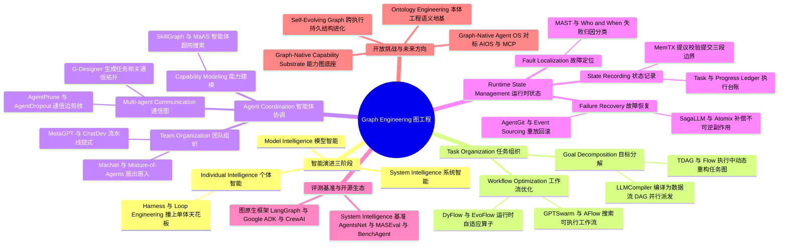

## 一、论文是干什么的？

想象你开了一家装修公司。刚起步时，你一个人包揽所有活：量房、画图、买料、砌墙、刷漆、验收。这时候你要提升业绩，办法很直接——多学技能（相当于给大模型做**预训练**和**后训练**）、多带工具（**Harness Engineering**，给智能体接上工具、记忆、技能）、每干完一段就回头检查一遍（**Loop Engineering**，让智能体反思并自我修正）。这条路走得通，但有天花板：一个人没法同时在两个房间干活，没法自己验收自己的活还保持客观，更没法在干到第 90 步时准确回忆起第 3 步到底哪里出了岔子。

这篇由吉林大学 DEEP 实验室牵头、35 位作者共同完成的综述，讲的正是这个天花板，以及怎么捅破它。作者们提出：LLM 智能体工程已经走过了 Prompt Engineering、Context Engineering、Harness Engineering、Loop Engineering 四个阶段，这四个阶段的共同点是都在优化「**一个**智能体」；而下一站叫 **Graph Engineering**（图工程），它优化的对象变成了「**一群**智能体组成的系统」。用装修公司的比喻说，就是从「把一个师傅培养成全能工匠」，转向「设计一套施工组织架构」——谁干哪一块、活儿之间谁先谁后、谁来验收、出了问题从哪一步返工、这次的教训怎么写进下次的施工规范。作者把系统层面涌现出的这种能力命名为 **System Intelligence**（系统智能），并明确强调一句话：系统智能不是把智能体数量堆上去就有的（more agents ≠ more intelligence）。

论文的核心主张是：要把这套「组织架构」写成**显式的、动态的、可演化的图结构**，而不是让它隐含在某个提示词或某段对话历史里。任务之间的依赖是一张图，智能体之间的分工与通信是一张图，运行过程中的状态与因果是一张图。把这三张图外化出来，系统才可调度、可观测、可诊断、可恢复、可优化。这就是 Graph Engineering 这个名字的由来。全文引用了 461 篇文献，含 8 张概念图与 4 张大表，并配套开源了一个 awesome-list 仓库。

## 二、核心方法与创新

这是一篇综述兼立场论文，它没有提出某个新模型，而是提出了一套**分类体系与概念框架**。下面拆开讲。

### 2.1 三级智能阶梯

论文先搭了一个三层的「智能坐标系」，用来给现有的所有工作定位：

- **Model Intelligence**（模型智能）：能力装在参数里，通过 Pre-training 与 Post-training 建立，通过 Prompt Engineering 与 Context Engineering 被激发和调控。评测单位是「一次模型输出」。
- **Individual Intelligence**（个体智能）：能力装在「模型 + 外壳」里。Harness Engineering 负责工具接入、记忆管理、技能组合、运行时编排；Loop Engineering 负责循环架构、交互范式、环境反馈。评测单位从「输出」变成「轨迹」。
- **System Intelligence**（系统智能）：能力装在「多个组件之间的关系」里。评测单位再升一级，变成「组织结构本身」。

用公司类比：模型智能是员工的个人素质，个体智能是给这个员工配电脑、配权限、配 SOP，系统智能则是整个公司的组织架构与流程制度。

### 2.2 为什么单体智能一定会撞墙？三条硬约束

论文在 3.5 节列了三条无法靠「加强单个智能体」解决的结构性限制，这是整篇文章的立论基础：

**❶ 并行与依赖任务的调度问题。** 单智能体的执行循环天然是串行的，它会把本可并行的分支压扁成一条时间线。论文举的例子很具体：软件故障诊断中，日志分析、故障复现、代码审查本可以三路并行，修复和测试才依赖它们的结果；但单智能体会把三路串成一路，既浪费了并行效率，又让错误传播后难以定位是哪一支出的问题。

**❷ 专业分工与独立验证的问题。** 单智能体即使被提示词分配了不同角色，这些角色仍然共享同一个控制回路和同一份上下文。结果就是角色混淆与确认偏误——**当同一个智能体既写代码又评代码时，它容易把「我认为代码是对的」当成「代码确实是对的」**。这不是提示词能修的，是架构性的。

**❸ 持久状态与故障恢复的问题。** 单智能体的上下文不是一份有组织、可持久化的状态。一旦错误进入循环，它会被后续步骤继承下去，既难只修受影响的那部分，也难做可追溯、可核查的回滚。论文形容：长程网页或编码任务中，早期的一个小错误可能一路隐藏到任务末尾才爆发，那时已很难判断它最初从哪里冒出来。

### 2.3 支柱一：Task Organization 任务组织，结构化「要做什么」

把一个高层目标变成可调度、可优化、可修订的图。分两个子问题。

*Goal Decomposition*（目标分解）：节点是子任务，边是先后顺序、数据流或逻辑关系。早期工作如 HuggingGPT 把多模态请求拆成子任务并按依赖路由给专用模型，ReWOO 用变量引用把推理与工具执行解耦。之后 LLMCompiler 把函数调用计划编译成**数据流 DAG**，上游依赖一满足就并行派发下游节点；Plan-over-Graph 专门研究在依赖约束下生成可并行的调度。再往后 TDAG 和 Flow 放宽了「任务图执行前必须固定」的假设，允许根据中间结果动态重构，在多智能体设定下这种演化中的任务图还能驱动智能体生成与任务分派。

*Workflow Optimization*（工作流优化）：把语义子目标编译成具体算子（LLM 调用、检索模块、工具、记忆操作、聚合器、验证器），并把这张工作流图本身当作**优化对象**。GPTSwarm 把语言智能体系统表示成计算图，同时优化节点行为和边连接；ADAS 在代码定义的工作流空间里搜索；AutoFlow 与 AFlow 把工作流生成形式化为自动搜索问题，其中 AFlow 用 LLM 引导的搜索直接优化可执行工作流代码；A2Flow 从演示中学习抽象算子，不再假定固定算子库；MermaidFlow 引入基于 Mermaid 的结构化中间表示与安全约束下的演化式编程，提升可读性、有效性与可控性；VFlow 把领域验证器（语法检查、功能正确性、可合成性、硬件约束）塞进搜索回路。更进一步是**执行期自适应**：DyFlow 根据中间反馈动态生成后续算子子图，EvoFlow 在推理时维持多个竞争的工作流候选并即时演化，QualityFlow 用质量检查决定接受、调试、澄清、回滚还是继续，FlowSteer 则强调工作流结构可以在执行循环内部被修改而不只是部署前优化。

一句话概括：把「隐式推理」变成「显式的、可编译可优化的工作结构」。

### 2.4 支柱二：Agent Coordination 智能体协调，结构化「谁来干」

又拆成三张图。

*Agent Capability Graph*（能力图）：节点是智能体、技能、工具、模型、资源，带类型的边编码能力归属、资源访问、权限、可靠性。论文举例：如果某个智能体失去了对某个算力资源的访问权，系统可以直接查这张图找到兼容的替补并重新分派任务。代表工作有 DyLAN（按贡献度保留有用智能体）、Agent-Oriented Planning（分派可解且不冗余的子任务）、MasRouter（按任务难度和成本选择协作模式、角色与底座模型）、AutoAgents / EvoAgent / AOrchestra / Captain Agent（动态生成或招募专家角色）、SkillGraph（用显式技能指导通信拓扑构建）、MaAS（在「智能体超网」中搜索合适的多智能体结构）。论文同时批评：现有方法的能力表示大多是为某个特定任务临时构建的分数或路由策略，还不是**可持久、可更新、可跨任务复用**的显式关系。

*Agent Team Graph*（团队图）：谁负责哪块、成果交给谁、谁审批、谁复核。论文归纳出四类拓扑：**链式**（MetaGPT 的 SOP 流水线、ChatDev 的顺序聊天链）、**路由式**（Magentic-One 的中心编排器规划、委派、监控与失败后重规划，WorkTeam 的 supervisor 调度，AgentVerse 的按需组队）、**扇出扇入式**（Mixture-of-Agents 的分层并行生成再整合，MacNet 用有向无环图泛化分支与聚合）、**动态重组式**（Puppeteer 按当前任务状态动态选择与排序，AgentNet 去掉中央控制器让智能体自行调整连接与路由，SwarmAgentic 联合优化智能体功能与协作模式）。每类都有明确代价：路由式给中心节点压力大，扇出扇入式通信、计算与聚合开销高。论文强调一个真实系统往往需要把这几种结构组合在同一张图里。

*Communication Graph*（通信图）：这是**运行时激活的动态图**，与相对稳定的团队图刻意区分开。团队图决定「谁参与、各自负责什么」，通信图决定「此刻谁需要跟谁交换信息、反馈怎么传、反馈如何改变后续动作」。论文提醒一个反直觉结论：**连边越多不一定协作越好**，因为错误信息也沿着边传播。于是有 MAgICoRe 把生成、评估、修订组成反馈闭环，G-Designer 综合考虑候选智能体、性能、通信成本与结构鲁棒性生成任务相关拓扑，AMAS 按输入选择交互结构，AgentPrune 剪掉时空消息图中的冗余连接，AgentDropout 跨轮次动态丢弃低贡献智能体及其边。还有反馈驱动的重构：DyTopo 每轮按「谁需要什么信息、谁能提供」重建稀疏通信边，CARD 让通信结构随模型能力、工具可用性、算力资源的变化而适配，QueenBee Planner 从执行轨迹与评估结果中提炼可复用的通信设计规则。人类也被显式建模为图中的一类参与者（Collaborative Gym 支持人、智能体与任务环境之间的异步双向交互），边表示求助、反馈、审批与升级。

### 2.5 支柱三：Runtime State Management 运行时状态管理，结构化「系统怎么运转」

这是论文中最工程化、也最有工业味道的一节，作者直接借用了数据库与分布式系统的词汇。

*State Recording*（状态记录）：可靠状态要满足四个条件——**结构化表示**（Magentic-One 的 Task Ledger 与 Progress Ledger 台账、Graph of States 用因果图与状态机约束信念状态转移）、**受控更新**（PatchBoard 在提交前用 schema、角色权限、运行时不变量校验智能体生成的补丁；MemTX 区分「试探性写入」与「事务性信念提交」，带显式溯源与修复语义，即一条明确的提议、校验、提交三段边界）、**作用域可见性**（Collaborative Memory 做按身份与时间切分的投影，共享状态不必全局可见）、**一致性管理**（并发写入下的隔离、因果排序、冲突消解；事件溯源用只追加历史支持重建、重放与分叉）。论文坦承：这些研究识别出了可靠状态记录的基本需求，但**还没有一个统一的图原生实现**。

*Fault Localization*（故障定位）：把「为什么错了」当成一个需要用证据检验的**假设**，而不是假定时间上或结构上的相邻就等于因果。MAGE 把执行表示成层级状态树的路径，从而识别出错分支与最近的有效决策边界；失败归因研究 Who and When 同时定位「哪个智能体」和「哪一步」，MAST 把失败分成系统设计、智能体间协调、任务验证三类，TraceElephant 主张要看执行轨迹与中间上下文而非只看最终输出；TDAD 把代码变更与受影响测试通过显式依赖连起来，Cordon 用带类型的血缘、影子状态与语义事务边界把运行时动作关联到外部副作用。论文的判断是：依赖关系能**缩小**搜索范围，但不能**证明**因果。

*Failure Recovery*（故障恢复）：核心是选一个**明确的恢复边界**，然后决定怎么安全续跑。可选动作包括撤回无效状态、重放可重算部分、补偿外部副作用、或分叉到另一条执行路径。MAGE、ALAS、CausalFlow、ReflexGrad 做局部修复以避免昂贵的全局重算；事件溯源、AgentGit、Shepherd 支持重放、回滚与分支；DART 把恢复限制在下游依赖与已提交效应允许的语义有效边界内。关键难点在于**不可回滚的外部副作用**——已经发出的邮件、已经下的订单不能靠 rollback 撤销——所以 SagaLLM 与 RAC 用检查点加补偿，Atomix 用事务式结算协调可逆与不可逆效应，Aegis 则从改善智能体与环境交互入手减少环境诱发的失败。

### 2.6 System Evolution：让系统跨任务变聪明

三大支柱之上还有第四层：**系统演化**。论文严格区分了两个容易混淆的概念——

> **运行时自适应**只改变**这一次**的执行轨迹（条件路由、临时招人、故障恢复）；**持久系统演化**则要把执行证据变成**下次也生效**的结构性改动。

真正的自演化系统需要一个闭环：执行与观测，到结构性归因（到底是哪条任务依赖、哪个智能体关系、哪次能力分配导致了成功或失败），到图修改，到验证，最后提交或回滚。论文还点出一个更棘手的问题叫**跨图演化**（cross-graph evolution）：改任务图会改变对团队能力的要求，换一个智能体可能让原有的通信关系、权限和运行假设全部失效。所以这几张图不能各改各的，必须在共享约束下协同修改。代表工作包括 ReCreate（从成败轨迹中提炼可复用领域模式）、SkillGraph（把失败案例蒸馏成推理启发式，维护在演化中的 Skill Bank）、Swarm Skills（把成功轨迹抽成可复用协作技能，按有效性、使用率、新鲜度刷新）、Meta-Team（用分布式执行经验改进行为、协调与团队组织）、MemTX（信念被撤回时做级联修复，限制无效状态扩散）、ActiveGraph（事件溯源历史支持确定性重放与高效分叉）。论文同时警告了安全面：FlowSteer 证明被操纵的规划信号可以把重规划和依赖形成引向有害路径，所以「结构修订必须建立在可信执行反馈之上」。

### 2.7 未来方向：Ontology Engineering 本体工程

论文最后抛出一个更上位的命题：图结构只解决了「关系是否显式」，没解决「大家对同一个词的理解是否一致」。多个智能体可能对「任务算完成了没有」「证据够不够」「状态是否有效」「这个动作是否被授权」有不同理解。**Ontology Engineering** 要建立一套机器可解释的共享模型，定义系统里有哪些实体、关系是什么意思、必须满足哪些约束、能推出什么结论。论文提出应采用**分层模块化本体**：核心本体定义跨系统共享概念（Goals、Agents、Capabilities、Evidence、Policies、States、Outcomes），专门模块描述目标与价值、智能体与能力、观测与证据、动作与状态、评价标准，领域本体再做扩展。引用的代表系统包括 LAMP（Planner、Builder、Verifier 三个角色通过 MCP 访问领域本体，在推理时使用显式结构化知识而非只靠模型参数）、Agentology（主张把本体定义的环境而非单个智能体提示词当作系统设计的首要对象）、OntoCodex 与 CoA-Text2OWL（多智能体协同扩充与构建本体）、AgentO 与 Ontology-to-Tools（把语义概念接到可执行能力与工具接口上）。三者关系被论文总结为一句话：**本体工程定义系统智能的共享概念模型，图工程把这个模型实例化为具体任务结构，运行时机制强制执行它的操作后果**。

### 2.8 与已有综述的区别

附录里作者专门做了辨析。已有的「图 + 智能体」综述里，图主要是**增强某项能力**的表示或计算机制（增强推理、规划、记忆、检索、工具组织、通信）；而 Graph Engineering 把显式图结构当作**整个智能系统的组织基底**。与最接近的「自演化智能体的动态图变换」视角相比，后者从「智能体如何持久演化」出发，而本文从「系统智能如何组织」出发，把演化当作图工程的一个维度而非唯一主轴。作者还提出了一个很好用的判据来区分现状与目标：**graph-structured（有图结构）不等于 graph-engineered（被图工程化）**——今天大量系统确实在按显式的工作图、团队图、状态图执行，但这些结构通常是人手工选定或执行前就固化的；真正的图工程还需要结构层面的优化目标、图级可观测性、受控变异、跨图一致性，以及「成功的结构改动能持久保留并迁移到新任务」的证据。

## 三、使用了哪些模型和计算资源？

**这是一篇综述与立场论文，作者没有做自己的训练或推理实验，因此论文中不包含任何 GPU 型号、显卡数量、训练小时数、API 调用量或成本数据。** 这一点在论文中是明确的：它的产出是分类体系、文献梳理与四张对比大表，而非实验数字。

它调研覆盖的代表性系统与基础设施，按三级智能阶梯分层如下（均来自论文第 8 节及 Table 2 的梳理）：

| 层级 | 代表性开源库与系统 | 论文给出的定位 |
| --- | --- | --- |
| Model Intelligence | Transformers、Megatron Core、LLaMA-Factory、verl、slime、vLLM、SGLang | Transformers 提供统一模型定义与执行接口，Megatron Core 负责大规模分布式预训练，LLaMA-Factory 打包监督与偏好后训练，verl 与 slime 做可扩展 RL 流水线并连接训练、rollout、奖励计算与智能体环境交互，vLLM 与 SGLang 提供推理与 rollout 底座 |
| Individual Intelligence | LangChain、OpenAI Agents SDK、Claude Agent SDK、Pydantic AI、LlamaIndex Workflows、Haystack、Burr、Letta、Graphiti、MCP、Langflow、Dify | 工程对象从模型参数转向模型外围的运行时，涵盖模型与工具循环、中间件、权限、校验、会话、状态与人工控制；Letta 维护长期智能体状态与记忆，Graphiti 用带溯源的时序图表示变化的上下文知识，MCP 标准化工具与资源的暴露方式，Langflow 与 Dify 用可视化编排降低实现门槛 |
| System Intelligence | LangGraph、Microsoft Agent Framework、Google ADK、AutoGen、AG2、CrewAI、CAMEL Workforce、Mastra、GPTSwarm | 提供面向图的执行模型，可组合条件、并发、循环与协作结构；CrewAI 区分角色导向的 Crews 与事件驱动的 Flows，CAMEL Workforce 把任务分解与工人分派和层级协调耦合，Mastra 结合智能体与显式工作流引擎及持久执行状态，GPTSwarm 直接把图连通性当作优化变量 |

在应用侧，论文点名了大量已上线的产品级智能体系统作为「系统智能正在发生」的证据，包括 Codex（并发智能体在隔离 worktree 中工作）、[Claude Code](https://claude.com/claude-code)（子智能体、检查点、hooks、后台执行、agent teams）、OpenCode（可配置主智能体与子智能体）、Cline（在共享看板上表示任务与依赖并跨会话持久化团队状态）、OpenHands（用持久事件流连接代码、shell、浏览器与委派）、SWE-agent、Gemini Enterprise Agentic RAG 等。**论文没有给出这些系统的任何性能数值。**

关于论文本身的可核实规模数据：**8 张概念图，4 张综述表，arXiv 分类为 cs.IR / cs.AI / cs.ET，v1 于 2026-08-21 提交、v2 于 2026-08-26 更新；参考文献 v1 为 461 篇，v2 增至 479 篇。** 配套仓库 [DEEP-JLU/Awesome-Graph-Engineering](https://github.com/DEEP-JLU/Awesome-Graph-Engineering) 在本综述撰写时为 231 stars。

## 四、实验结果

**本文不含原创实验，因此没有 benchmark 分数、消融表或对比曲线可以汇报。** 以下是论文自己给出的关键结论与它明确列出的待解问题。

### 4.1 关键结论

| 结论 | 论文的意思 |
| --- | --- |
| 加智能体数量不等于加系统智能 | 系统的价值取决于工作如何分解、责任如何分配、状态如何共享、失败如何诊断与恢复，而不取决于智能体的个数 |
| 单体智能的三条限制是架构性的 | 并行调度、独立验证、持久状态与恢复，这三条靠扩上下文或加工具都补不上 |
| 通信边不是越多越好 | 正确信息和错误信息沿同一批边传播，所以要剪枝而不是无脑连通 |
| 运行时自适应不等于持久演化 | 条件路由与故障恢复只改变本次轨迹，不改变下次任务所用的组织结构 |
| 有图结构不等于被图工程化 | 现有系统大多是人工选定或执行前固化的结构，缺少结构级优化目标、图级可观测性与受控变异 |
| 三类结构的成熟度不均衡 | 跨领域看，工作组织与团队组织已相当普及，运行时状态管理正在变得可见，而持久系统演化仍然罕见 |

### 4.2 评测该怎么做

论文第 7 节给出的评测框架也值得单列。三级智能各自的评测单位不同：

| 层级 | 评测单位 | 代表性基准 |
| --- | --- | --- |
| Model Intelligence | 单次模型输出 | 知识与推理、指令遵循、可执行代码、多模态、检索增强推理类基准；LiveBench 刷新题目对抗污染；NPPC 自动生成可验证的 NP 完全问题实例且难度可扩展 |
| Individual Intelligence | 执行轨迹 | AgentBench、GAIA、WebArena、OSWorld、SWE-bench、AppWorld、TheAgentCompany；更新的 AgencyBench、AgentGym2、LongCLI-Bench、Trainee-Bench、SEA-Eval、Evo-Bench |
| System Intelligence | 组织结构本身 | AgentsNet 考察网络化智能体的自组织与扩展、DBS 研究分布式异构与隐私约束下的工作流合成、MASEval 把拓扑与编排与框架与运行时都当作系统级变量、MAS-PromptBench 评测跨多智能体配置的优化、MAFBench 比较不同框架设计、BenchAgent 在受控协议下直接对比单智能体与固定多智能体与演化式工作流 |

论文要求所有层级都报告**有效性、效率、鲁棒性**三项，图工程化的系统还要额外报告**结构保真度、操作正确性、演化与治理**三项。它明确点了三条评测缺口：第一，**必须把系统级改进和「换了更强的模型 / 更长上下文 / 更多工具 / 更多重试 / 更多算力」带来的收益分开**；第二，现有资源在工作组织、协调、运行时状态、演化四个方面各自为政，跨结构的交互效应测不出来；第三，结构性的功劳归因与动态系统级评测仍然很弱。它建议未来的基准要提供**对齐的执行预算、带版本的图工件、完整轨迹与状态快照、受控的结构扰动，以及跨任务跨时间的重复评测**。

### 4.3 开放问题

论文第 5 节与第 6 节列出四大类开放挑战：

1. **Graph-Native Capability Substrates**（图原生能力底座）：现在记忆库、技能库、工具注册表各自为政，它们之间的依赖、替代、组合、授权、成本、可靠性关系都是隐式的。已有苗头包括 A-MEM（把相关记忆动态连成演化记忆网络）、Zep（用时序知识图表示变化的事实及其时间关系）、Graph of Skills（用技能间依赖与工作流关系检索可执行的技能包而非孤立条目）、SkillDAG（让带类型的技能关系从执行证据中演化）。真正的挑战不是把每一族能力各画成一张图，而是**把能力图与任务图、智能体图、状态图连起来**。
2. **Self-Evolving Graph Systems**（自演化图系统）：需要「执行与观测，到结构归因，到图修改，到验证，到提交或回滚」的完整闭环，还要处理跨图演化的一致性，并通过溯源、版本、验证、重放与回滚保持可治理。论文强调目标不是无限制的自我修改，而是「能积累有用的组织经验，同时阻止不可靠的结构改动扩散」。
3. **Graph-Native Agent Operating Systems**（图原生智能体操作系统）：当前的模型服务、harness、工作流引擎、记忆系统、多智能体框架、状态存储各用一套抽象。MCP 改善了能力互通但没提供可执行系统组织的统一表示，LangGraph 提供了显式工作流与状态表示，AIOS 则从操作系统视角提供调度、上下文、记忆、存储、工具与访问控制服务，被论文视为重要先例。未来的图原生 OS 应把任务、智能体、能力、运行时状态做成带类型、带版本的一等系统对象，共享一套图调度、能力发现、状态存储、事件与溯源日志、结构事务、权限执行、检查点、重放、回滚与图级可观测能力。
4. **Privacy and Ethics**（隐私与伦理）：多智能体系统里敏感信息会在组件间复制、沿工作流传播、沉淀进持久状态，带来越权访问、跨任务泄漏、以及从执行轨迹反推私密属性的风险；决策分散后责任归属也更难界定。论文呼吁隐私保护的状态管理、作用域权限、溯源感知日志与强人类监督。

## 五、潜在应用与已落地应用

论文第 9 节按六个领域做了应用调研，并给出了「哪些已经在做、哪些还没做到」的判断。

**软件工程与 IT 运维**（论文认为这是从个体智能到系统智能过渡最清晰的领域）。已落地案例：[MetaGPT](https://github.com/FoundationAgents/MetaGPT) 与 ChatDev 用预定义阶段与专家角色组织开发，SWE-agent 证明智能体与仓库之间的接口本身会强烈影响执行，[OpenHands](https://github.com/All-Hands-AI/OpenHands) 用持久事件流连接代码、shell、浏览器与委派。更新的一批把并行智能体工作变成显式工程对象：Codex 支持并发智能体在隔离 worktree 中作业，Claude Code 组合了子智能体、检查点、hooks、后台执行与 agent teams，OpenCode 暴露可配置的主智能体与子智能体，Cline 在共享看板上表示任务与依赖并跨会话持久化团队状态。IT 运维方向有 Project ALICE，在遥测与软件依赖证据之上协调专家智能体。论文认为该领域剩下的挑战是：把规划、代码依赖、归属权、外部副作用、测试与恢复连进一个带版本的结构，从而不仅能解释「补丁成功了没有」，还能解释「为什么这种工作组织方式会成功」。

**科学发现与实验室自动化**：SciAgents 用本体化知识结构给协同科研智能体提供地基，AI Scientist 把选题、实现、实验、写作、评审组织成长周期研究流程，Virtual Lab 用一个 PI 智能体加若干专家科学家智能体显式表达团队结构并把计算工作连到物理实验验证，Co-Scientist 把生成、批判、排序、精炼分派给专门智能体并由异步 supervisor 管理，Robin 把文献检索与数据分析智能体和实验室结果打通，让实验证据直接更新后续假设。论文提醒：**迭代式假设精炼不等于智能体组织本身的持久演化**，图工程更强的要求是保存假设、负结果、数据血缘、实验干预与因果依赖。

**医疗与临床决策支持**：MAC 用多个医生智能体加一个 supervisor 复现多学科会诊，DeepRare 用中心 host 协调表型、基因型、检索与分析智能体并累积可追溯的诊断证据，CARE-AD 与 MAP 组织跨纵向证据的专科推理，AMIE 把问题从单次诊断扩展到多次就诊的疾病管理——对话智能体维持会话状态，管理推理智能体把纵向患者信息与临床指南综合成演进中的护理计划。论文特别强调：临床场景的运行时状态远不止会话记忆，既往症状、治疗、反应、检查与建议会改变后续动作的有效性，因此必须同时保存溯源、不确定性、访问边界与人工授权；同时也直言**图化组织能改善协作与可追溯性，但本身并不保证临床正确性**。

**企业工作流与数字组织**：WorkTeam 把工作流构建分给 supervisor、orchestrator、filler 三类智能体，SOAN 把可复用工作流结构封装成智能体来搭建层级网络，FinRobot-ERP 把专家智能体接到金融业务流程模型上，Agent-Ops 把 SOP 精炼、网页执行与文档校验组合成生产级流水线，Gemini Enterprise Agentic RAG 把多源检索拆成编排、规划、查询改写、搜索、上下文充分性检查与综合，并在信息不足时用反馈继续检索。论文指出企业场景里「任务完成」远远不够，还必须遵守权限、职责分离、政策约束、事务边界与回滚义务——这正是运行时状态管理最重要的落地场景。

**通用数字智能体与个人自动化**：OpenClaw 用网关维护独立的智能体身份、工作区、认证配置、会话与频道绑定，让持久智能体跨通信界面运行同时保持明确的状态边界；Hermes Agent 组合系统工具、委派、定时执行、持久记忆与跨会话可复用技能，还能把成功流程转成可复用技能并在后续经验中修订。论文认为这些提供了跨执行的适应与持久组织，但仍不构成一般意义上的结构性自演化。

**社会与经济仿真**（这里图从内部执行机制变成了被研究现象本身）：AgentSociety 支持大规模智能体在真实感并行环境中互动，EconAgent 建模异质家庭的工作与消费决策如何与宏观经济状态互动，SRAP-Agent 连接申请者决策、分配规则、稀缺资源与政策结果，TwinMarket 把个体社交与交易行为耦合到共享市场反馈与涌现的金融动态。论文同时警告一个认知风险：涌现行为依赖模型选择、人设构造、交互拓扑、记忆、提示与环境规则，**仿真中的涌现在未经真实观测校准与不确定性分析之前，不能被当作现实世界因果的证据**。

配套资源方面，论文把所有相关论文、开源数据与项目汇总在了 [Awesome-Graph-Engineering](https://github.com/DEEP-JLU/Awesome-Graph-Engineering) 仓库中，README 按 Model Intelligence、Individual Intelligence、System Intelligence 三级组织，与论文的分类体系一一对应。

## 六、网络上的讨论与评价

**HuggingFace 页面**：截至本综述撰写时（2026-08-29），[HF 论文页](https://huggingface.co/papers/2608.21156) 显示 **57 upvotes**，由用户 eric-xiang 于 2026-08-24 提交到 Daily Papers。页面讨论区目前**只有一条自动化评论**——Librarian Bot 于 2026-08-25 发布的相似论文推荐，列出了 Focus Is All You Need: Adaptive Goal-aware Attention Orchestration for Multi-Agent Graph Systems、Self-Improvements in Modern Agentic Systems: A Survey、CHILL-Harness、Atomic Task Graph、Agentic Transaction: Towards ACID-Compliant Agent Systems 五篇。**没有检索到人类撰写的实质性评论或争论。**

**GitHub**：配套的 awesome-list 仓库获得 231 stars，说明社区对这份文献地图有实际使用需求，但仓库未见集中的技术争论。

**英文社区**：用英文标题、arXiv ID 与方法名多轮搜索后，**未检索到 Twitter/X、Reddit r/MachineLearning 或 Hacker News 上的集中讨论帖**。检索到的唯一一篇英文博客是 [Rick's Cafe AI 的转载](https://cafeai.home.blog/2026/08/28/graph-engineering-in-the-era-of-llm-agents-from-individual-intelligence-to-system-intelligence/)，但它只是摘要搬运加导流链接，未提供任何批评性分析或独立评价。

**中文社区**：反而是中文技术社区的讨论更活跃一些，不过大多是「概念普及型」而非「学术批评型」。检索到的内容包括：知乎专栏《图解 Graph Engineering》（抓取时返回 HTTP 403，未能读到正文）、CSDN 智能体开发者社区的[《从 Loop Engineering 到 Graph Engineering》](https://agent.csdn.net/6a7045c810ee7a33f2958f82.html)与另一篇《Graph Engineering：从循环工程到图编排》、以及 YouTube 上的概念讲解视频。其中 CSDN 那篇较有信息量，它把工程范式排成 Prompt 到 Context 到 Harness 到 Loop 再到 Graph 五层，强调图工程不是取代循环工程而是建立在其之上（一张可靠的图等于多个可靠的循环，加上明确的节点职责、受控的状态流转、独立验证与故障恢复），并配了可运行的 LangGraph Python 示例；它也提出了几点值得注意的疑虑——**假定验证器与路由器都能用确定性代码可靠实现，但现实中大量判定条件是模糊的**；对验证开销的成本、以及「验证器自己出错时怎么办」讨论不足。另有一篇 [zgeo.net 的分析文章](https://zgeo.net/news/graph-engineering-ai-agent-geo-guide)给这篇论文打了个自制的质量分 86/100，并明确指出**原文没有给出任何具体的性能提升百分比**，这一点与我们直接读原文的结论一致。同一篇文章提到该论文来自「吉林大学、厦门大学等 15 个研究机构」——**这是二手来源的说法，arXiv HTML 全文的作者块并未列出任何机构信息，仅通讯作者邮箱为 jlu.edu.cn，加上仓库归属 DEEP-JLU，可以确认吉林大学为牵头单位，其余机构构成与总数未能从一手材料核实**。

总体评价：这篇论文目前处于「概念被广泛引用、但尚未被严肃辩论」的阶段。它的分类体系清晰、文献覆盖极广（v2 达 479 篇），作为领域地图很好用；但正因为它是立场型综述、没有任何实验支撑，社区暂时缺少一个可以争论的具体靶子。可以预期的争议点是：Graph Engineering 究竟是一个真正的新范式，还是对已有的工作流编排、多智能体框架与分布式系统实践的一次重新命名与统一叙事——论文自己在附录中已经预判并回应了这个质疑（区别在于图是「增强某项能力的机制」还是「整个系统的组织基底」），但这一辩护尚未在公开讨论中被检验。

## 七、思维导图

