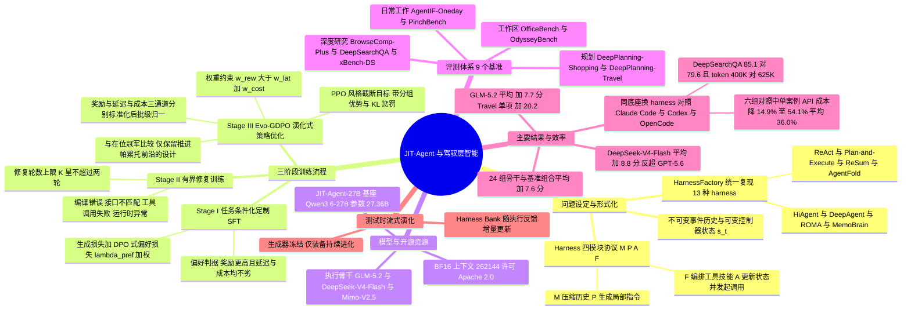

## 一、论文是干什么的？

想象你请了一位非常聪明的临时工。他智商极高、知识渊博，但你把他丢进一个陌生工厂，只给他一句「把这批货处理好」，他大概率会手足无措——不是因为他笨，而是因为你没给他**工作台**、没告诉他**记事本放哪**、没教他**先干哪一步**、也没把**扳手和螺丝刀**摆到他手边。在 AI 智能体（Agent）领域，这套「工作台 + 记事本 + 作业流程 + 工具箱」有个专门的名字，叫 **harness**（驾驭层，也常被译作脚手架）。它管的是：模型的历史对话怎么压缩存储、遇到复杂任务怎么拆解规划、每一步动作怎么发出去、以及在成千上万个工具里该把哪几个递到模型面前。

这篇论文的核心观察是：**同一个大模型，配上不同的 harness，表现天差地别**——harness 的贡献甚至可能盖过底座模型本身的强弱。可问题在于，今天的 harness 全是人手工写的：Claude Code 有一套、Codex 有一套、各种开源 Agent 框架各有一套，每套都是针对某类任务精心调过的固定模板。一旦任务类型换了（从「网上查资料」换到「订机票做行程」），原本好用的模板就会水土不服。于是作者提出一个大胆的想法：**能不能训练一个专门的模型，让它在看到任务的当场，现给这个任务量身「配装备」？** 这就是 JIT-Agent（Just-in-Time Agent）名字的由来——借用编译器里「即时编译」（JIT compilation）的概念：不预先编好一套万能代码，而是在运行现场按需生成最合适的那一份。

更进一步，作者把这件事上升成一个新的能力维度，称为 **harness intelligence**（驾驭层智能）：构建、修复、进化智能体运行脚手架的能力，本身是**可训练、可迁移、可累积**的，而且这条轴线与「把底座模型做得更大更强」是**正交**的。换句话说，就算你手里只有一个中等水平的开源模型，只要给它配上一套现场定制的好装备，它也能在多个基准上打赢闭源旗舰模型。

## 二、核心方法与创新

### 2.1 先把「装备」标准化：四模块协议

要让模型「生成 harness」，第一步得让 harness 变成一种**机器可写、可执行、可组合的产物**，而不是一堆散落在各个仓库里风格迥异的代码。作者为此定义了一个固定的四模块协议，把任意一套 harness 都拆解成四元组：

$$
h = (M, P, A, F)
$$

- $M$（Memory，记忆）：负责压缩历史、维护控制器状态。就像临时工的记事本，把已经发生的事浓缩成几行要点。
- $P$（Planning，规划）：根据当前任务上下文，产生「下一步该干什么」的局部指令。相当于工头下的工单。
- $A$（Action，行动）：更新控制器状态并真正发出工具调用。相当于伸手去拧那颗螺丝。
- $F$（Capability Orchestration，能力编排）：从工具/技能注册表里挑出此刻真正相关的那几件，暴露给模型。相当于把该用的扳手摆到手边，其余的收进柜子。

协议同时区分了两类信息：**不可变的事件历史** $\xi_{\lt t}$（发生过的事实，只能追加不能改写）和**可变的控制器状态** $s_t$（模型当前的工作记忆，可以被压缩重写）。运行时的调用顺序固定为 $M \to P \to F \to A$：先整理记忆，再定计划，再挑工具，最后动手。

这个约束非常关键。它的作用类似于「乐高的凸点标准」——只要所有积木的接口一致，你就可以放心地混搭、替换、自动拼装。作者据此实现了一个统一代码库 **HarnessFactory**，用同一套协议重写并复现了 13 种代表性的公开 harness 设计，包括 ReAct、Plan-and-Execute、ReSum、Flash-Searcher、GAM、MemoBrain、AggAgent、OAgent、AgentFold、HiAgent、DeepAgent、ROMA、AOrchestra。这既是训练数据的来源，也是公平对比的实验台。

### 2.2 训练分三步走：会定制、会修 bug、会进化

JIT-Agent 的训练分成三个阶段，可以理解为培养一位「装备师」的三段成长：先学会照着任务配装备，再学会配坏了怎么修，最后学会在实战反馈中不断把装备升级。

**阶段一：定制（Customizing Harness）。** 这一阶段是监督微调（SFT）。做法是让一个冻结的、更强的教师模型 $q_\phi$ 针对各类任务生成大量符合协议的 harness，然后**实际跑一遍**来验证它们是否可执行、效果如何。损失函数由两部分构成：

$$
\mathcal{L}_{\mathrm{I}}(\theta) = \mathcal{L}_{\mathrm{I}}^{\mathrm{gen}}(\theta) + \lambda_{\mathrm{pref}} \mathcal{L}_{\mathrm{I}}^{\mathrm{pref}}(\theta)
$$

前一项是标准的下一词预测损失（学会「写出合法的 harness 代码」），后一项是 DPO 风格的偏好损失（学会「在两份都能跑的 harness 里挑更好的那份」）。这里的「更好」不是单看分数，而是一个多目标判据：

$$
h^+ \succ h^- \iff r^+ > r^- \wedge \ell^+ \le \ell^- \wedge \kappa^+ \le \kappa^- \wedge (\ell^+ < \ell^- \vee \kappa^+ < \kappa^-)
$$

其中 $r$ 是任务奖励，$\ell$ 是平均延迟（每个案例的墙钟时间），$\kappa$ 是每案例的 API 成本（美元）。这个判据的意思很直白：**只有在分数不降、延迟不涨、成本不涨，且延迟或成本至少有一项严格下降时，才算真的更优**。这有效防止了模型学会「靠堆更长的轨迹、烧更多 token 来刷分」这种作弊路径。

**阶段二：修复（Repairing Harness）。** 现实里生成的代码不可能一次就跑通。作者把「失败的生成」变成宝贵的训练信号：把编译错误、接口不匹配、工具调用失败、运行时异常等诊断信息喂回给模型，让它学会生成**修补丁** $\Delta$。目标函数形如：

$$
\mathcal{L}_{\mathrm{II}}(\theta) = -\mathbb{E}\left[\sum \log p_\theta\left(\Delta^{\star}_{(k+1)} \mid c_\tau, \text{repair history}\right)\right]
$$

一个务实的设计是**修复轮数最多两轮**（$K^{\star} \le 2$）：最多修两轮就停。这不是偷懒，而是贴合真实部署——生产环境里没人愿意为一份脚手架无限重试，两轮修不好就该换方案了。

**阶段三：进化（Evo-GDPO）。** 这是最有意思的一步，名为 **Evolutionary Group-Decoupled Policy Optimization**（演化式分组解耦策略优化）。传统 RL 是「采样一组候选，谁得分高就往谁靠」；Evo-GDPO 多了一层**演化**逻辑：新生成的候选 harness 不只是彼此比较，还要跟**已有的在位冠军**（archive 里的历史最优 harness）比，只有推进了「性能-延迟-成本」帕累托前沿的设计才会被保留进档案库。

奖励设计是分层的：主奖励是任务表现（带 margin bonus，鼓励明显超越而非险胜）；延迟和成本是**门控的次级奖励**——只有在任务奖励没有退化的前提下，省时间省钱才算加分。三个通道各自标准化后再做批级归一化，最后聚合成：

$$
A_i^{\Sigma} = w_{\mathrm{rew}} A_i^{\mathrm{rew}} + w_{\mathrm{lat}} A_i^{\mathrm{lat}} + w_{\mathrm{cost}} A_i^{\mathrm{cost}}, \quad w_{\mathrm{rew}} > w_{\mathrm{lat}} + w_{\mathrm{cost}}
$$

那个权重约束 $w_{\mathrm{rew}} > w_{\mathrm{lat}} + w_{\mathrm{cost}}$ 是一道保险丝：**保证效率优化永远不可能压倒任务质量**——不能为了省钱把活干砸。优化本身采用 PPO 风格的截断目标，带分组优势和 KL 惩罚。

### 2.3 测试时还在继续变强：Harness Bank 与流式进化

训练完之后，故事还没结束。JIT-Agent 在推理时维护一个**harness 档案库**（harness bank）$\mathcal{B}_n$。面对新任务 $\tau$ 时，它会从库里检索一小组参考 harness $\mathcal{E}_{\tau,n}$，连同任务描述、协议规范、工具/技能注册表一起作为上下文，生成本次的专属 harness。任务跑完后，执行轨迹和反馈又回流更新档案库。

这就形成了一个漂亮的性质：**生成器本身是冻结的，但它产出的装备在持续变好**。作者称之为「测试时流式进化」（test-time streaming evolution）——把评测数据当成一条数据流依次处理，累计准确率的优势会随着执行反馈的累积逐渐显现，并一直保持到数据流末端，而这一切不需要再训练任何参数。这像是一位老师傅，手艺没变，但他的工具箱和经验笔记在每一单活之后都更丰富一点。

### 2.4 为什么这件事重要

论文最有价值的论断，其实是一个「反直觉」的结论：**没有任何一套固定 harness 能在所有任务上称王**。实验里 Claude Code、Codex、OpenCode、Hermes、NanoBot 这五套业界成熟脚手架，在九个基准上互有胜负，谁也无法通吃。这恰恰说明「即时定制」不是花架子，而是刚需。论文附图还展示了生成结果的差异：面对有产物依赖关系的规划任务，JIT-Agent 生成的是 DAG（有向无环图）式的计划结构；面对证据不断分叉的深度检索任务，它生成的却是递归委派式的结构。这种**结构层面的自适应**，是任何手写模板都难以覆盖的。

## 三、使用了哪些模型和计算资源？

**JIT-Agent 本体（元模型）：**

| 项目 | 信息 |
| --- | --- |
| 模型名 | JIT-Agent-27B |
| 基座 | [Qwen/Qwen3.6-27B](https://huggingface.co/Qwen/Qwen3.6-27B) |
| 参数量 | 27.36B |
| 精度 | BF16 |
| 上下文长度 | 262,144 tokens（推荐服务时用 163,840） |
| 许可证 | Apache 2.0 |
| 权重地址 | [JIT-Agent/jit-27b](https://huggingface.co/JIT-Agent/jit-27b) |

HuggingFace 模型页说明该 checkpoint 是在初版 harness-customization 模型基础上，从最终研究迭代版本蒸馏而来。

**被「配装备」的执行骨干模型（executor）：** GLM-5.2、DeepSeek-V4-Flash-Preview、DeepSeek-V4-Pro、Qwen3.6-Flash/Plus、Mimo-V2.5-Flash/Pro。作为对照的前沿模型包括 GPT-5.6、Gemini 3.1 Pro、Gemini 3.5 Flash、Kimi K2.7 Code。

**教师模型：** 论文在阶段一中只写明使用「一个冻结的、更强的教师模型 $q_\phi$」，**未公开具体型号**。

**GPU 型号与数量、训练时长、节点数、学习率、批大小、SFT 数据规模、Evo-GDPO 的分组大小 $G$ 与 KL 系数 $\beta_{\mathrm{KL}}$ 的具体取值：暂无相关信息**——arXiv HTML 全文与 GitHub README 中均未披露这些实现细节，README 仅注明环境要求为 Python 3.11，且刻意不包含本地元模型的服务代码（vLLM/SGLang + torch 需自行部署）。

**API 成本：** 论文报告的是**推理侧**的每案例成本，而非训练成本。例如在 DeepSearchQA 上，JIT-Agent 方案每案例约 0.066 美元，而对照的 Claude Code harness 约 0.088 美元、OpenCode 约 0.258 美元。

## 四、实验结果

评测覆盖 **9 个基准、4 类任务**，所有指标均归一到 0 到 100 分：深度研究（BrowseComp-Plus 准确率、DeepSearchQA 答案 F1、xBench-DeepSearch 准确率）、日常工作（AgentIF-Oneday 归一化 rubric 分、PinchBench 平均分）、规划（DeepPlanning-Shopping 购物车匹配率、DeepPlanning-Travel 复合约束分）、工作区操作（OfficeBench、OdysseyBench 任务成功率）。

### 4.1 给同一个模型换装备，提升有多大

| 基准 | GLM-5.2 原生 | + JIT-Agent | 提升 | DeepSeek-V4-Flash 原生 | + JIT-Agent | 提升 |
| --- | --- | --- | --- | --- | --- | --- |
| BrowseComp-Plus | 72.0 | 78.0 | +6.0 | 68.1 | 74.0 | +5.9 |
| DeepSearchQA | 89.2 | 93.9 | +4.7 | 76.2 | 85.1 | +8.9 |
| xBench-DeepSearch | 76.0 | 88.0 | +12.0 | 70.1 | 82.0 | +11.9 |
| AgentIF-Oneday | 63.0 | 69.9 | +6.9 | 58.4 | 63.8 | +5.4 |
| PinchBench | 87.0 | 93.3 | +6.3 | 81.7 | 92.9 | +11.2 |
| DeepPlanning-Shopping | 78.2 | 83.4 | +5.2 | 59.1 | 83.9 | +24.8 |
| DeepPlanning-Travel | 62.8 | 83.0 | +20.2 | 54.8 | 61.3 | +6.5 |
| OfficeBench | 63.0 | 68.4 | +5.4 | 61.0 | 63.4 | +2.4 |
| OdysseyBench | 75.3 | 78.7 | +3.4 | 71.0 | 73.0 | +2.0 |
| **平均** | — | — | **+7.7** | — | — | **+8.8** |

用大白话说：**模型一个参数都没动，只是换了套现场定制的工作流，平均就多拿七到九分**。而且在 DeepPlanning 这类结构复杂的规划任务上，提升最夸张（DeepSeek-V4-Flash 在购物规划上从 59.1 冲到 83.9）。

### 4.2 能不能打赢闭源旗舰

论文的招牌结论是：**JIT-Agent 加持的开源模型能反超 GPT-5.6**。JIT + GLM-5.2 在 9 个基准中赢下 7 个，其中 DeepSearchQA 领先 17.9 分（93.9 对 76.0）、PinchBench 领先 9.1 分（93.3 对 84.2）。即便是定位「便宜快速」的 DeepSeek-V4-Flash，配上 JIT-Agent 后也在 DeepSearchQA 上领先 GPT-5.6 达 9.1 分（85.1 对 76.0）、在 OdysseyBench 上领先 4.3 分（73.0 对 68.7）。

### 4.3 同底座、只换 harness 的对照实验

这是全文最有说服力的实验：固定用 DeepSeek-V4-Flash 做执行模型，只更换外层 harness。

| 基准/指标 | JIT-Agent | Claude Code | Codex | OpenCode | Hermes | NanoBot |
| --- | --- | --- | --- | --- | --- | --- |
| DeepSearchQA 分数 | **85.1** | 79.6 | 77.8 | 75.9 | 69.9 | 80.4 |
| DeepSearchQA token 量（K） | **400** | 625 | 760 | 1,832 | 1,157 | 924 |
| DeepSearchQA 成本 | **0.066 美元** | 0.088 美元 | 0.107 美元 | 0.258 美元 | 0.163 美元 | 0.131 美元 |
| xBench-DS 分数 | **82.0** | 75.0 | 70.0 | 65.0 | 72.0 | 78.0 |
| xBench-DS token 量（K） | **212** | 559 | 680 | 1,157 | 1,254 | 527 |
| xBench-DS 成本 | **0.039 美元** | 0.079 美元 | 0.096 美元 | 0.159 美元 | 0.177 美元 | 0.075 美元 |
| AgentIF 分数 | 63.8 | **66.9** | 58.5 | 48.1 | 60.3 | 53.1 |
| AgentIF token 量（K） | **476** | 808 | 870 | 950 | 1,000 | 1,034 |
| AgentIF 成本 | **0.097 美元** | 0.114 美元 | 0.123 美元 | 0.135 美元 | 0.142 美元 | 0.147 美元 |

两个要点：第一，**分数更高的同时 token 更省**——不是靠拉长轨迹堆出来的，xBench-DS 上 JIT-Agent 只用了 OpenCode 五分之一左右的 token 却高出 17 分。第二，论文一共跑了**六组**同底座对照（上表列出的是 DeepSeek-V4-Flash 那三组），在这六组里 JIT-Agent 的 token 消耗与 API 成本都是最低的；相对每组中最便宜的那个固定 harness，每案例成本降低了 14.9% 到 54.1%，六组平均降幅 36.0%。上表可见的三组分别是降 25.0%、48.0% 与 14.9%。同时表格也诚实地显示，在 AgentIF 上 Claude Code 的 harness 仍略胜一筹（66.9 对 63.8），这反过来印证了「没有万能模板」的论点。

### 4.4 换底座还能不能行

在 24 组「骨干模型与基准」组合（涵盖 DeepSeek V4、Qwen 3.6、Mimo 2.5 三个家族）上，平均提升 +7.6 分。分家族看：DeepSeek V4 平均 +10.2、Mimo 2.5 平均 +8.6、Qwen 3.6 平均 +4.0。分基准看，DeepSearchQA 提升最猛，平均 +15.2（Mimo-V2.5-Pro +22.2、DeepSeek-V4-Flash +19.0）。这说明 harness 智能是**跨模型可迁移**的。

### 4.5 测试时进化

开启流式模式（允许 harness bank 随反馈更新）后，在 DeepPlanning-Shopping、DeepPlanning-Travel、OfficeBench 上的累计准确率增益全程为正，并保持到数据流末端，全面优于静态一次性生成。这意味着**部署得越久、跑过的任务越多，同一个冻结的 JIT-Agent 产出的装备就越好**。

需要说明的是：论文并未提供逐阶段消融表（例如去掉 Stage I / II / III 各自掉多少分）——**这部分暂无相关信息**，主要的对照证据来自 4.3 节的固定 harness 对比和 4.5 节的流式对照。

## 五、潜在应用与已落地应用

**已开源的资源：**

- 代码库：[bingreeky/JIT](https://github.com/bingreeky/JIT)，包含元智能体、HarnessFactory 预置设计、各基准适配器与数据集下载脚本。截至检索时约 72 stars、5 forks，环境要求 Python 3.11，通过 `.env` 配置各家模型 API 凭据；本地部署元模型的服务栈（vLLM/SGLang）需使用者自行搭建。
- 模型权重：[JIT-Agent/jit-27b](https://huggingface.co/JIT-Agent/jit-27b)，Apache 2.0 许可。
- 论文与项目页：[arXiv:2608.25593](https://arxiv.org/abs/2608.25593)，项目站点 [JIT-site](https://bingreeky.github.io/JIT-site)（检索时该站点存在重定向，未能取回正文）。

**潜在应用方向：**

1. **Agent 平台的自动配置层。** 目前企业接入智能体时，最重的人力都花在「给这个业务场景调 prompt、调工具集、调记忆策略」上。JIT-Agent 提供的路径是把这层工作交给一个专门的模型自动完成，人只负责写任务规格。
2. **降本增效的推理优化。** 论文显示平均 36.0% 的 API 成本下降，在高并发的生产场景里这是可直接折算成钱的收益。而且这种优化不需要改动底座模型，对已经采购了某家 API 的团队门槛极低。
3. **让小模型/开源模型顶上。** 既然 harness 能补足七到九分，很多原本必须调用旗舰模型的场景，可能换成「开源模型 + 定制 harness」就够用了，这对数据合规敏感的私有化部署尤其有吸引力。
4. **持续自进化的长期部署系统。** harness bank 的设计天然适合客服、运维、数据分析这类「同类任务反复出现」的岗位——跑得越久越顺手，且无需重新训练。
5. **作为 harness 研究的公共实验台。** HarnessFactory 把 13 种主流设计统一到同一协议下，本身就是一个有价值的可复现基准平台。

截至综述时，**尚未检索到 JIT-Agent 被集成进具体商业产品的公开案例**。

## 六、网络上的讨论与评价

**HuggingFace Papers 页面：** 该论文于 2026-08-26 提交 arXiv，2026-08-27 登上 HF Daily Papers，截至本次检索获得 **107 个 upvote**，属于当日的高热度条目。该页评论区有两条内容：一条是提交者 gbz 于 2026-08-27 发的官方帖，标题为 Model-as-a-Harness; Harness Intelligence Model，附带项目主页、GitHub 与 HuggingFace 数据集 [JIT-Agent/jit-meta-harness](https://huggingface.co/datasets/JIT-Agent/jit-meta-harness) 三个链接；另一条是 Librarian Bot 于 2026-08-28 自动推荐的同赛道论文列表，包括 Harness-R1、MemoHarness、Hierarchical Self-Improvement、ADIAS、EvoHarness-RL、Living-Harness 与 Evo-Harness——这份名单本身就说明 2026 年「外壳进化」这个方向有多拥挤。

**GitHub：** 仓库约 72 stars、5 forks，数字尚小，属于论文发布首周的正常量级。HF 模型页显示上月下载量仅个位数，说明社区尚处在「围观」阶段而非规模化使用。

**搜索引擎检索情况：** 用英文标题、方法名（JIT-Agent、harness intelligence、Evo-GDPO）、arXiv ID 分别在 Twitter/X、Reddit r/MachineLearning、Hacker News、知乎、机器之心等方向检索，**均未找到针对本文的集中讨论、深度解读或批评文章**。中文检索返回的多是关于 Harness Engineering 这一概念本身的科普与综述文章（例如知乎上的多篇 Harness Engineering 解析），并非针对本论文。

**相关工作背景：** 检索过程中可以看到 harness 自动化确实是 2026 年的一条活跃赛道，同期出现了若干主题相近的预印本（如涉及测试时 harness 演化、编码智能体 harness 自动进化、以及一篇专门质疑「harness 更新是否等于 harness 收益」的解耦分析论文）。这说明本文所处的问题域正在快速升温，也意味着它的核心主张——harness 质量可训练、可迁移、可累积——很可能在接下来几个月里迎来独立的复现与质疑。

**综合判断：** 论文本身自评角度积极，但目前**缺乏第三方独立验证**。几个值得读者自行留意的点：一是 GPT-5.6 等对照模型是否在同等 harness 条件下被公平评测；二是 Qwen3.6-27B 作为元模型的训练成本未披露，无法评估整体性价比；三是缺少逐阶段消融，三个训练阶段各自的贡献占比不明。

## 七、思维导图

