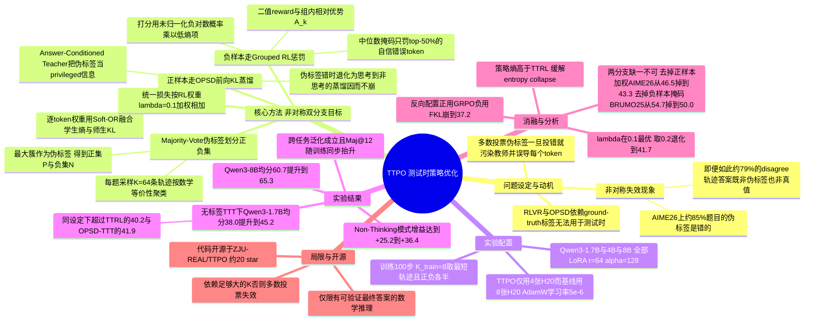

## 一、论文是干什么的？

想象一个准备数学竞赛的学生。平时他做题，老师会给标准答案，他对照答案改错、总结方法，于是越来越强。但真到了考场上——**没有标准答案**。这时候他还能不能变强？传统的做法说：不能，没答案就没法学。

这篇论文回答说：能。它的思路很朴素——让模型对同一道题**做 64 遍**，然后看这 64 份答卷里哪个答案出现得最多，就把它当成「大家公认的答案」（专业术语叫「**多数投票伪标签**」，majority-vote pseudo-label）。然后模型就拿这个自己投票投出来的答案当老师，继续训练自己。

问题在于，这个「班级公认答案」经常是错的。论文实测发现，在 AIME 2026 这样的高难度竞赛题上，Qwen3-1.7B 投票投出来的答案有约 85% 是错的。如果盲目地把错答案当成标准答案去学，模型只会越学越歪。TTPO 这篇论文最关键的贡献，就是发现了一个救命的「**非对称规律**」，并据此设计了一套即使伪标签错了也不会崩的训练目标。它属于「**测试时训练**」（Test-Time Training，TTT）这个方向：模型在面对一批没有答案的新题目时，边做边学，当场把自己变强。

## 二、核心方法与创新

### 2.1 关键观察：错也要错得有讲究

先说那个救命的观察。假设模型对一道题跑了 $K$ 条推理轨迹（rollout），投票选出伪标签 $\hat{a}$。把轨迹分成两堆：

- **正样本集** $\mathcal{P}$：答案等于 $\hat{a}$ 的那些轨迹（跟大多数人一致）；
- **负样本集** $\mathcal{N}$：答案不等于 $\hat{a}$ 的那些轨迹（跟大多数人不一致）。

现在，即便伪标签 $\hat{a}$ 本身是错的（也就是 $\hat{a} \neq a^*$，$a^*$ 是真正的标准答案），论文统计发现：**约 79% 的负样本给出的答案，既不是伪标签也不是真正的标准答案**——也就是说它们是「另一种错法」，它们就是纯粹的错答案。

这就是「非对称」的含义：**惩罚负样本这件事，几乎总是对的**，跟伪标签准不准没什么关系。而「奖励正样本」这件事，就危险得多——一旦伪标签错了，你等于在鼓励模型犯同一个错。

用班级类比：如果全班一半人算出 42，另一半人算出 17、23、31、55 各不相同，那么就算 42 也是错的，那些五花八门的答案更是错的，罚它们不会冤枉。这个观察直接决定了 TTPO 的架构：**正负样本必须用完全不同的方式处理**。

### 2.2 正样本分支：带答案的自己当老师（OPSD）

对于正样本，TTPO 用的是「**在线策略自蒸馏**」（On-Policy Self-Distillation, OPSD）。它的巧妙之处在于：老师和学生是**同一个模型**，只是老师被给了三点优待——**能看到标准答案**、权重固定为未加 LoRA 的基座副本、并且开启思考模式，而学生是关闭思考模式的 LoRA 版本。

具体地，老师端的输入是把伪标签一起塞进 prompt 里的「特权信息」版本，学生端只看题目：

$$
q_t^{(\hat{a})} = \pi_\theta(\cdot \mid [x; \hat{a}]_{\mathrm{teacher}}, y_{<t}), \qquad p_t = \pi_\theta(\cdot \mid x_{\mathrm{student}}, y_{<t})
$$
论文用的教师 prompt 大意是：「这里有一份参考解法……读完之后请确保你真正理解了每一步背后的推理，不要抄写或改写它。现在用你自己的话和独立推理，推导出同样的最终答案。」

然后用**前向 KL 散度**让学生去逼近老师的逐 token 分布：

$$
\mathcal{L}_{\mathrm{OPSD}}(k) = \frac{1}{T_k}\sum_{t=1}^{T_k} w(t)\cdot \mathrm{KL}\big(q_t^{(\hat{a})} \,\|\, p_t\big)
$$
这里有个非常聪明的兜底：**就算伪标签是错的，这个分支也不会崩**。因为正样本本来就是「答案等于 $\hat{a}$」的那些轨迹，老师被喂的答案，恰恰就是学生自己已经写出来的答案。两边说的是同一件事，所以这时的蒸馏退化成了一种「思考模式 → 非思考模式」的知识压缩——学生只是在学「怎么把这条路走得更利索」，而不是在学一个新的错误结论。这也解释了为什么后面在非思考模式下的增益特别夸张。

### 2.3 逐 token 加权：只在该用力的地方用力

不是每个 token 都值得学。有些位置学生早就学会了（比如写「首先，我们设 $x$ 为」），再学一遍纯属浪费梯度。TTPO 用两个信号来判断一个位置值不值得学：

- 学生自己的熵 $\hat{H}(t)$：熵高说明学生在这个位置犹豫不决；
- 师生分歧 $\hat{\Delta}(t) = \mathrm{KL}(q_t \| p_t)$ 归一化后的值：分歧大说明学生跟看过答案的老师想法不一样。

两者都先在每条样本内做 min-max 归一化到 $[0,1]$，然后用一个「**软或**」（Soft-OR）组合：

$$
w(t) = \hat{H}(t) + \hat{\Delta}(t) - \hat{H}(t)\cdot\hat{\Delta}(t)
$$
这个式子的行为很直观：只要**两个信号里有任何一个亮起**，权重就往上走；只有当学生**既笃定又跟老师一致**（两个都接近 0）时，权重才趋近于零。相当于说「我犹豫的地方要学，我跟老师想法不一样的地方也要学，只有我又有把握又答对了的地方才可以跳过」。

### 2.4 负样本分支：只罚「自信的错误」

负样本走的是 **Grouped RL**（GRPO 风格）。每条轨迹拿一个二值奖励：答案等于伪标签得 $r_k = 1$，否则得 $r_k = 0$；优势 $A_k$ 在这一组 $K$ 条 rollout 内做组内相对归一化。损失是：

$$
\mathcal{L}_{\mathrm{GRPO}}(k) = -\frac{A_k}{T_k}\sum_{t=1}^{T_k} m(t)\cdot \log \pi_\theta\big(y_k^{(t)} \mid x, y_k^{(<t)}\big)
$$
但这里同样有个关键细节：**不能整条轨迹一起罚**。一条错误的推理里，往往前面十几步都是对的，只有某一步走岔了。如果一棍子打死，模型会连正确的推理习惯一起忘掉。

于是 TTPO 给每个 token 打分：

$$
s(t) = -\log \pi_\theta\big(y_k^{(t)} \mid x, y_k^{(<t)}\big)\cdot\big(1 - \hat{H}(t)\big)
$$
然后只保留分数在中位数以上的那 50% token 参与惩罚：

$$
m(t) = \mathbf{1}\big[s(t) \geq \mathrm{median}(\{s(t')\}_{t'=1}^{T_k})\big]
$$
这个打分式子读起来是：$-\log \pi_\theta$ 大表示「模型自己都觉得这个 token 不太可能」（异常输出），$1 - \hat{H}(t)$ 大表示「模型在这个位置其实很笃定」（低熵）。两者相乘，挑出来的就是「**明明很笃定，写出来的东西却很反常**」的位置——这正是「自信的错误」的特征。注意这里刻意用了**未归一化**的负对数概率来排序，目的是把那些局部正确、高概率的 token 排除在惩罚之外。

### 2.5 合起来：一个非对称目标

最终损失把两路按权重 $\lambda$ 拼起来：

$$
\mathcal{L}_{\mathrm{TTPO}} = \frac{1}{|\mathcal{B}|}\left(\sum_{k \in \mathcal{P}} \mathcal{L}_{\mathrm{OPSD}}(k) + \lambda \sum_{k \in \mathcal{N}} \mathcal{L}_{\mathrm{GRPO}}(k)\right)
$$
论文取 $\lambda = 0.1$，理由是这个值大致让两个分支的梯度幅度持平。

### 2.6 训练流程一句话版

每一步迭代做四件事：**采样 → 投票 → 分堆 → 两路更新**。具体是：对每道题采 $K = 64$ 条轨迹；抽取答案、按数学等价性聚类，最大簇作为伪标签 $\hat{a}$；分出 $\mathcal{P}$ 和 $\mathcal{N}$；从中各挑一半、总共 $K_{\mathrm{train}} = 8$ 条参与梯度更新；正的走加权前向 KL，负的走掩码 GRPO，一起反传。

一个特别有意思的细节：挑哪 8 条参与训练？论文做了消融，发现挑**最短的**轨迹效果最好。理由是短轨迹里关键推理步骤占的比例更高，噪声更少。

### 2.7 和 TTRL、OPSD 的区别

- 跟 **TTRL** 比：TTRL 也用多数投票做无标签 RL，但它只有**二值奖励**这一个稀疏信号。TTPO 额外引入了「看过答案的教师」，能在正确轨迹上传递**逐 token 的稠密知识**。
- 跟 **OPSD-TTT** 比：OPSD 只利用正样本做蒸馏，把负样本整个扔掉了。TTPO 通过选择性 RL 惩罚，把负样本这一大半数据也榨出了信号。

论文还给了一个副产品证据：TTPO 训练过程中的**策略熵**比 TTRL 等基线更高，缓解了强化学习常见的「熵坍缩」（entropy collapse）——投票与蒸馏共同促进了探索。

## 三、使用了哪些模型和计算资源？

| 项目 | 具体配置 |
| --- | --- |
| 基座模型 | Qwen3-1.7B、Qwen3-4B、Qwen3-8B |
| 微调方式 | LoRA，秩 $r = 64$，$\alpha = 128$ |
| LoRA 目标模块 | `q_proj`, `k_proj`, `v_proj`, `o_proj`, `gate_proj`, `up_proj`, `down_proj` |
| GPU | TTPO 用 4 张 H20；所有对照基线用 8 张 H20 |
| 精度 / 加速 | bfloat16 + Flash Attention 2 |
| 优化器 | AdamW，学习率 $5\times 10^{-6}$，梯度裁剪 $0.1$ |
| 有效 batch size | 32 |
| 每题采样数 | $K = 64$；参与梯度的 $K_{\mathrm{train}} = 8$（正负各半） |
| RL 权重 | $\lambda = 0.1$ |
| 采样参数 | 温度 1.1，top-p 0.95，top-k 20 |
| 生成长度 | 训练阶段最长 16000 token，梯度更新截取 1024 token |
| 训练步数 | 100 步，每 25 步存一次 checkpoint |
| 评测协议 | Avg@12，温度 1.0，top-p 0.95，最大生成 38912 token，开启 thinking 模式 |
| 训练数据 | OpenThoughts（用于有标签对照实验）；TTT 设置直接在评测集自身上无标签训练 |

关于**具体的墙钟训练时长与 GPU 小时数**：论文只说明了 GPU 型号与数量，未给出耗时数字，属于**暂无相关信息**。同样，论文未涉及外部 API 调用与成本，也是**暂无相关信息**。

值得留意的一点是资源对比本身就是结果的一部分：TTPO 只用 4 张 H20，而它对比的基线用了 8 张，却依然赢了。

## 四、实验结果

### 4.1 有标签对照组（在 OpenThoughts 上训练）

这一组的意义是：让 TTPO（**完全不用标签**）跟用了真标签的 GRPO、OPSD 掰手腕。带 † 的是用了 ground-truth 标签的方法。

| 模型 / 方法 | AIME25 | HMMT25 | AIME26 | HMMT26 | BRUMO25 | 平均 |
| --- | --- | --- | --- | --- | --- | --- |
| Qwen3-1.7B 基座 | 36.9 | 21.9 | 37.8 | 28.8 | 47.5 | 34.6 |
| +GRPO † | 37.3 | 23.6 | 40.3 | 29.3 | 48.1 | 35.7 |
| +OPSD † | 40.3 | 28.1 | 46.4 | 31.4 | 52.5 | 39.7 |
| **+TTPO**（无标签） | 41.7 | 26.1 | 46.5 | 31.6 | 54.7 | **40.1** |
| Qwen3-4B 基座 | 66.1 | 41.9 | 65.8 | 42.4 | 64.0 | 56.0 |
| +GRPO † | 66.7 | 45.0 | 66.6 | 43.2 | 66.1 | 57.5 |
| +OPSD † | 68.3 | 44.2 | 68.1 | 44.4 | 67.2 | 58.4 |
| **+TTPO**（无标签） | 69.4 | 43.6 | 68.1 | 44.7 | 67.2 | **58.6** |
| Qwen3-8B 基座 | 66.7 | 44.2 | 67.5 | 45.5 | 69.2 | 58.6 |
| +GRPO † | 70.3 | 46.7 | 69.2 | 48.0 | 71.9 | 61.2 |
| +OPSD † | 70.8 | 46.4 | 72.5 | 47.2 | 71.4 | 61.7 |
| **+TTPO**（无标签） | 71.4 | 46.1 | 74.2 | 48.0 | 73.1 | **62.6** |

大白话：**一个不看答案的学生，考出了跟看答案的学生一样甚至更好的成绩**。三个尺寸上 TTPO 的平均分都追平或略微超过了用真标签的 OPSD。

### 4.2 纯测试时训练（完全无标签）

这一组才是 TTPO 的主场：直接在待测的题目上边做边学，谁也没有标签。

| 模型 / 方法 | AIME26 | HMMT26 | BRUMO25 | 平均 |
| --- | --- | --- | --- | --- |
| Qwen3-1.7B 基座 | 37.8 | 28.8 | 47.5 | 38.0 |
| +TTRL | 39.2 | 30.6 | 50.9 | 40.2 |
| +OPSD-TTT | 44.7 | 30.3 | 50.8 | 41.9 |
| **+TTPO** | 48.9 | 33.6 | 53.1 | **45.2** |
| Qwen3-4B 基座 | 65.8 | 42.4 | 64.0 | 57.4 |
| +TTRL | 66.4 | 43.2 | 66.7 | 58.8 |
| +OPSD-TTT | 67.8 | 43.4 | 66.9 | 59.4 |
| **+TTPO** | 70.8 | 45.7 | 66.9 | **61.1** |
| Qwen3-8B 基座 | 67.5 | 45.5 | 69.2 | 60.7 |
| +TTRL | 70.8 | 48.0 | 70.1 | 63.0 |
| +OPSD-TTT | 71.7 | 47.2 | 72.2 | 63.7 |
| **+TTPO** | 73.9 | 48.5 | 73.6 | **65.3** |

Qwen3-1.7B 从 38.0 涨到 45.2，绝对提升 7.2 个点，比 TTRL 高 5.0 个点、比 OPSD-TTT 高 3.3 个点。

### 4.3 关掉思维链之后：最夸张的一组数字

Qwen3 支持「思考 / 非思考」两种模式。把思考关掉之后（也就是不让模型写长推理链，直接出答案），TTPO 的增益变得非常离谱：

| 模型 | 基座 | +OPSD（有标签） | +TTPO（无标签） | TTPO 增益 |
| --- | --- | --- | --- | --- |
| Qwen3-1.7B | 9.5 | 16.6 | **34.7** | +25.2 |
| Qwen3-4B | 19.9 | 25.7 | **50.5** | +30.6 |
| Qwen3-8B | 20.3 | 23.8 | **56.7** | +36.4 |

有标签的 OPSD 只能带来 3.5 到 7.1 个点的提升，TTPO 却能带来 25 到 36 个点。这印证了 2.2 节的分析：正样本分支实质上把「长思考模式下的能力」压缩进了「不思考直接答」的行为里。

### 4.4 消融实验

**逐 token 选择的两个部件都有用**（Qwen3-1.7B，OpenThoughts）：

| 配置 | AIME26 | HMMT26 | BRUMO25 |
| --- | --- | --- | --- |
| TTPO 完整版 | 46.5 | 31.6 | 54.7 |
| 去掉正样本加权 | 43.3 | 30.6 | 52.8 |
| 去掉负样本掩码 | 45.4 | 29.5 | 50.0 |

**「正用蒸馏、负用 RL」这个分工不能反过来**（Qwen3-1.7B，AIME26 测试时训练）：

| 配置 | 分数 |
| --- | --- |
| 完整 TTPO：正 = 前向 KL，负 = GRPO | **48.9** |
| 只用正样本前向 KL | 46.7 |
| 正负都用前向 KL | 46.3 |
| 只用负样本 GRPO | 43.9 |
| 反过来：正 = GRPO，负 = 前向 KL | 37.2 |

反配置直接崩到 37.2，比基座还差，说明这个非对称分工是方法的命根子。

**其他消融结论**：RL 权重 $\lambda$ 在 0.1 处取到最优（0.01 时为 41.4，0.2 时退化到 41.7）；正负样本固定各占一半（46.5）优于随机（45.8）和动态比例（46.1）；挑选轨迹时取最短的（46.5）优于最长（45.6）、随机（45.0）和按信号强度挑（45.8）。

**自我进化的良性循环**：训练过程中 Avg@12 稳步上升并追平初始的 Maj@12，而且 Maj@12 本身也在同步上涨——模型变强 → 采样质量变高 → 伪标签更准 → 训练天花板被抬高，形成正反馈。此外**跨任务泛化**成立：在任一个 benchmark 上训练，另外两个的分数也会一起涨，说明学到的是通用推理能力而非死记题目。

## 五、潜在应用与已落地应用

**已开源**：代码仓库在 [ZJU-REAL/TTPO](https://github.com/ZJU-REAL/TTPO)，截至综述时约有 20 个 star。环境要求 Python 3.10、PyTorch 2.8.0、vLLM 0.11.0；训练用 `bash scripts/run_ttpo_1b.sh` 一类脚本，为 4 卡 + LoRA 场景做了优化；评测入口是 `evaluate_math.py`。仓库引用了形如 `outputs/ttpo/qwen31b_ttpo_openthoughts/checkpoint-100` 的 checkpoint 目录，但**未提供已训练权重的下载链接**。

**潜在应用方向**：

1. **模型上线后的持续自我进化**：面对用户真实提交的、没有标准答案的题目流，模型可以在线继续变强，而不必等人工标注。
2. **小模型的低成本增强**：4 卡 H20 + LoRA 就能跑，对算力有限的团队友好，尤其适合把小模型在某个垂直题库上「就地打磨」。
3. **蒸馏出「不思考也很强」的模型**：4.3 节那组数据暗示，TTPO 可以作为一种低成本手段，把长思考链的能力压进短输出模式里，直接降低推理成本与延迟。
4. **可迁移到其他可验证任务**：论文自己承认目前只做了「有可验证最终答案的数学推理」，但同样的框架原则上适用于代码执行结果可验证、单元测试可判定的编程任务。

**已知的产品集成案例**：截至综述时**暂无相关信息**。

## 六、网络上的讨论与评价

- **官方项目主页**：[zju-real.github.io/TTPO](https://zju-real.github.io/TTPO/)。
- **HuggingFace Daily Papers**：该论文在 [HuggingFace 论文页](https://huggingface.co/papers/2608.27448) 上获得 **67 个 upvote**，并有 **2 条社区评论**，由用户 LZXzju 提交。遗憾的是，多次尝试抓取该页面时返回的都是缓存中的错误内容（一张 entropy 图片的说明），**这 2 条评论的具体文字内容未能获取**。
- **GitHub**：官方仓库 [ZJU-REAL/TTPO](https://github.com/ZJU-REAL/TTPO) 已开源，约 20 star，说明社区关注度处于「刚起步」阶段。
- **与 TTRL 的对比讨论**：检索到的公开材料中，最集中的讨论点就是 TTPO 相对 TTRL 的改进——TTRL 只有二值奖励这一个稀疏信号，TTPO 补上了逐 token 的稠密蒸馏信号，并且在三个模型尺寸上全面超过 TTRL（1.7B 上 45.2 对 40.2）。
- **相关工作的密集涌现**：搜索过程中能看到同期出现了不少同方向工作，例如 OptPO（测试时策略优化的 rollout 分配）、TTCS（测试时课程合成）、SERPO（开放式测试时强化学习的自演化 rubric），以及一篇专门研究「多数投票错误时的干预时机与灭绝窗口」的论文。这说明「无标签测试时训练」正在成为一个热门赛道，但也意味着 TTPO 尚未积累起长期的第三方复现评价。
- **中文社区**：截至综述时，在知乎、机器之心等中文渠道**未检索到针对本文的集中讨论**。
- **Reddit r/MachineLearning 与 Hacker News**：截至综述时**未检索到相关讨论帖**。

总体判断：论文本身热度不低（HF 当日第 2），但由于发布仅一两天，尚处于「有人点赞、少人深挖」的阶段，缺乏独立复现与批评性讨论。

## 七、思维导图

