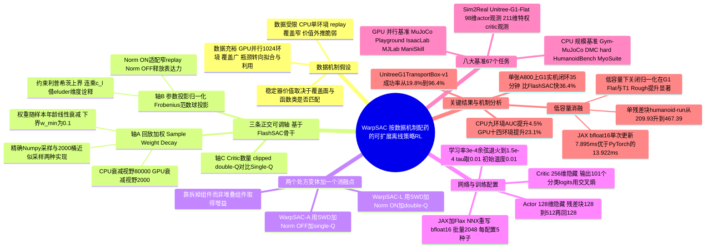

## 一、论文是干什么的？

想象你在教一个机器人走路。十年前，收集机器人的「练习数据」非常慢——一次只能跑一个仿真环境，就像一个厨师一次只能炒一盘菜。数据这么金贵，算法设计者就得处处小心：万一学到的经验太少、见过的场面太窄，模型就容易「自信过头」，把没见过的动作也估得很高，最后摔个跟头。于是研究者们发明了一大堆「安全带」：熵正则化逼着策略去尝试新动作、双 Q 网络取最小值来压制高估、参数归一化把网络的表达能力关进笼子里。这些机制统称**稳定器**（stabilizer），几乎成了离线策略强化学习的标配。

但今天情况变了。像 IsaacLab、MuJoCo Playground、MJLab 这样的 GPU 并行仿真器，可以同时跑 1024 个环境，数据从「一次一盘菜」变成了「工业流水线」。这篇论文提出的问题非常朴素却很关键：**当数据从稀缺变成过剩，那些为稀缺时代设计的安全带，还有必要一直系着吗？** 作者们在 8 个基准家族、总共 67 个环境或任务上做了受控实验，得出的答案是「要看情况」——参数归一化在数据窄的时候救命，在数据充裕的时候反而勒住了价值函数的手脚；双 Q 保守估计在高吞吐操作任务里可以安全放松；只有基于「样本年龄」的回放加权在两种情况下都有用。基于这些发现，他们造出了 **WarpSAC**——一个「看菜下饭」的算法家族。名字里的 Warp 取自《星际迷航》里的曲速引擎，暗示更快的可扩展学习。

## 二、核心方法与创新

### 2.1 核心洞察：稳定器是「数据机制依赖」的

论文提出了一个**数据机制假设**（data-regime hypothesis）：一个稳定器的价值不是算法固有的属性，而是取决于回放缓冲区的覆盖面与它想保护的函数类是否匹配。

- **数据受限机制**（CPU 单环境）：回放池里的状态-动作覆盖很窄，价值外推很脆弱。这时归一化和保守估计能约束有效函数类、压制未覆盖动作上虚高的 $Q$ 值，是有益的。
- **数据充裕机制**（GPU 并行）：上千个 actor 同时往缓冲区里灌高吞吐、高多样性的轨迹，瓶颈从「怎么获得足够覆盖」转向了「怎么高效拟合和利用海量数据」。这时同样的保守机制反而会限制价值拟合、增加不必要的悲观偏差和计算开销。

打个比方：新手司机上路要装限速器、要开双保险，因为路况全靠猜；老司机在自己开了一万遍的路上，限速器就纯粹是拖后腿。WarpSAC 干的事情就是——**根据你是新手路况还是老司机路况，决定装几道保险**。

### 2.2 三条可独立调节的「轴」

作者以 FlashSAC 为骨干（FlashSAC 是同期的可扩展离线策略基线，特点是高吞吐采样、大网络、低更新频率加范数控制），把通常被捆绑在一起的设计拆成三条正交的轴，其他一切——训练骨干、优化器、环境接口、网络结构——全部固定不变：

- **轴 A：回放加权** $w_t(i)$。缓冲区里的转移是均匀采样，还是按「年龄」加权采样。
- **轴 B：参数投影归一化**。是否在每次优化器更新后对线性层权重做逐列范数归一化（Norm ON / Norm OFF）。
- **轴 C：Critic 数量**。用 clipped double-Q 目标（两个 critic），还是只用单个 critic（Single-Q）。

只有把这三条轴独立拆开，才能做到「按机制配药」，而不是笼统地给出一个「更强」或「更弱」的 SAC 配方。

### 2.3 SAC 与 clipped double-Q 的数学底子

标准 SAC 在回报目标上加了熵项：

$$
J_{\mathrm{SAC}}(\pi)=\mathbb{E}_{(s_t,a_t)\sim\rho_\pi}\left[\sum_{t=0}^{\infty}\gamma^t\left(r(s_t,a_t)+\alpha\mathcal{H}(\pi(\cdot|s_t))\right)\right]
$$

其中 $\alpha$ 控制熵项的权重，也就是「鼓励多探索」的强度。SAC 维护一个回放缓冲区 $\mathcal{D}$、一个随机策略 $\pi_\theta$，以及两个 critic $Q_{\phi_1},Q_{\phi_2}$，用 clipped double-Q 目标来对抗高估偏差：

$$
y=r+\gamma\left(\min_{i=1,2}Q_{\bar\phi_i}(s',a')-\alpha\log\pi_\theta(a'|s')\right)
$$

取 $\min$ 就是「两个裁判打分，取低的那个」——在数据窄的时候能防止把没见过的动作吹上天，但代价是多养一个 critic，而且天然带悲观偏差。Single-Q 变体就是直接去掉这个 $\min$，只留一个 critic。

### 2.4 参数投影归一化：给网络套上利普希茨紧箍咒

对每个权重矩阵 $W_\ell$，参数投影把它压回一个 Frobenius 范数球内：

$$
W_\ell \leftarrow \Pi_{\|W\|_F \le c_\ell}(W_\ell)
$$

由于 $\|W_\ell\|_2 \le \|W_\ell\|_F$，约束 Frobenius 范数也就约束了谱范数。对使用 1-利普希茨激活函数的网络，这给出标准的利普希茨上界：

$$
\mathrm{Lip}(f_\theta)\le\prod_{\ell=1}^{L}\|W_\ell\|_2\le\prod_{\ell=1}^{L}c_\ell
$$

论文借用 **eluder 维度**（eluder dimension）这一理论视角做概念性解释：函数类的有效复杂度越低，解决未来预测的不确定性所需的信息样本越少。所以在数据稀缺时，范数约束相当于「帮你减少需要探索的空间」；但在数据本已充裕时，同一个约束就只剩下「削弱表达力」这一个副作用了。作者明确说明这只是概念性诠释，不是对神经网络的形式化样本复杂度保证。

### 2.5 Sample Weight Decay：唯一跨机制通用的部件

**样本权重衰减**（Sample Weight Decay，简称 SWD）是三条轴里唯一无论数据多少都启用的机制。设转移 $\tau_i=(s_i,a_i,r_i,s'_i)$ 在时刻 $t_i$ 入池，它在训练步 $t$ 时的年龄为 $A_t(i)=t-t_i$，则：

$$
w_t(i)=\max\!\left(w_{\min},\ 1-\frac{A_t(i)}{T_{\mathrm{decay}}}\right),\qquad p_t(i)=\frac{w_t(i)}{\sum_j w_t(j)}
$$

$T_{\mathrm{decay}}$ 是衰减视野，$w_{\min}>0$ 是一个下限，防止老样本被彻底抛弃；把 $T_{\mathrm{decay}}$ 设为 $0$ 就退化回均匀采样。所有实验中 $w_{\min}=0.1$。

直观理解：策略的表现主要由**当前策略实际走过的区域**和高价值轨迹沿线的 Bellman 误差决定。均匀采样对这个结构一无所知，会把同样多的更新预算花在几百万步之前、由一个完全不同的旧策略产生的转移上。SWD 只改动小批量的采样分布，不动 UTD（update-to-data 比例）、不动更新规则、不加辅助网络、不加额外 Bellman 目标，就把固定的更新预算重新导向了更相关的样本。因为这个论证只依赖策略年龄、不依赖数据体量，所以 SWD 在两种机制下都保留。

SWD 本身源自同一作者组更早的可塑性研究工作（Wu et al., 2026），原本的动机是缓解**可塑性流失**（plasticity loss）；这篇论文把它重新诠释为一种「面向利用的回放机制」。

### 2.6 两个处方变体

| 数据机制 | 变体名 | 回放（A） | 归一化（B） | Critic（C） |
|---|---|---|---|---|
| 数据受限（CPU 单环境） | WarpSAC-L | SWD | Norm ON | Clipped Double-Q |
| 数据充裕（GPU 并行） | WarpSAC-A | SWD | Norm OFF | Single-Q |
| 消融中间点 | WarpSAC w Norm OFF | SWD | Norm OFF | Clipped Double-Q |
| 共享基线 | FlashSAC | 均匀采样 | Norm ON | Clipped Double-Q |

这里有个很反直觉但很漂亮的点：**GPU 并行下的性能提升是靠「拆掉」组件而不是「堆上」组件获得的**。去掉归一化，让 critic 自由拟合海量数据；去掉第二个 critic，critic 侧计算量直接减半。结果是一个既更简单又更强的算法，与业界常见的「不断堆稳定机制以求鲁棒」形成鲜明对比。论文还给了一段面向工程师的实操指南：CPU 规模用 WarpSAC-L，GPU 并行用 WarpSAC-A，而 SWD 两边都开。

### 2.7 SWD 的两种实现与工程取舍

精确的 SWD 每次采样都要对整个百万级缓冲区构造并归一化一个概率向量，开销不小。作者因此提供了**分桶近似采样**（bucketed approximate sampling，2000 个桶），避开全量扫描。工程结论是：CPU 规模的回放缓冲区（存在主机上，容量 $10^6$）用近似采样；GPU 并行域（回放张量在 GPU 上，分类采样由 JAX 做 CUDA 加速）用精确 SWD，因为精确采样的绝对开销相对于学习器计算已经很小了。

## 三、使用了哪些模型和计算资源？

### 网络结构

所有实验共用同一套 FlashSAC 风格的 actor-critic 骨干，线性层不带偏置：

- **Actor**：输入经 BatchNorm 后投影到 128 维隐藏层，接 $B_\pi$ 个 FlashSAC 残差块，最后接 RMSNorm。残差块结构为 Linear $128\to512$、BatchNorm、ReLU、Linear $512\to128$、BatchNorm、ReLU 加残差连接。输出为两个正交初始化的线性头，分别预测动作均值与对数标准差，采样自 tanh 压缩的对角高斯分布，动作重缩放到 $[-1,1]$，对数标准差范围为 $[-10,2]$。
- **Critic**：观测与动作拼接后经 BatchNorm 投影到 256 维，接 $B_Q$ 个残差块（Linear $256\to1024$、BatchNorm、ReLU、Linear $1024\to256$、BatchNorm、ReLU 加残差），最后接 RMSNorm；输出是 **101 个分类 logits** 的分布式价值头，用交叉熵作为 critic 损失。
- 主实验用 $B_\pi=B_Q=2$；容量消融中取 $B_\pi=B_Q\in\{1,2,3\}$。

### 优化与 SAC 超参

| 超参 | 取值 |
|---|---|
| Actor / Critic / 温度学习率 | $3\times10^{-4}$，余弦退火到 $1.5\times10^{-4}$ |
| 初始熵温度 $\alpha$ | 0.01 |
| 目标熵 | $\frac{1}{2}\lvert\mathcal{A}\rvert\log(2\pi e\cdot 0.15^2)$ |
| 目标网络更新率 $\tau$ | 0.01，每次 critic 更新都同步 |
| 策略更新频率 | 每 2 次 critic 更新更新一次 |
| 奖励归一化 | 全部实验启用 |
| SWD 最小采样权重 $w_{\min}$ | 0.1 |

### 数据规模与吞吐

| 配置 | CPU-scale | MuJoCo Playground | MJLab | ManiSkill | IsaacLab | Sim2Real |
|---|---|---|---|---|---|---|
| 并行环境数 | 1 | 1024 | 1024 | 1024 | 1024 | 1024 |
| 总环境步数 | $1.0\times10^6$ | $50{,}000{,}896$ | $50{,}000{,}896$ | $50{,}000{,}896$ | $50{,}000{,}896$ | $100{,}001{,}792$ |
| 回放缓冲容量 | $1.0\times10^6$ | $1.0\times10^7$ | $1.0\times10^7$ | $1.0\times10^7$ | $1.0\times10^7$ | $1.0\times10^7$ |
| 回放存放位置 | CPU | GPU | GPU | GPU | GPU | GPU |
| 批量大小 | 512 | 2048 | 2048 | 2048 | 2048 | 2048 |
| 每交互步梯度步数 | 1 | 2 | 2 | 2 | 2 | 2 |
| 折扣因子 $\gamma$ | 0.99 | 0.97 | 0.99 | 0.90 | 0.99 | 0.99 |
| $n$-step 回报 | 1 | 1 | 3 | 1 | 3 | 3 |
| SWD 衰减视野 $T_{\mathrm{decay}}$ | $80{,}000$ | $2{,}000$ | $2{,}000$ | $2{,}000$ | $2{,}000$ | $2{,}000$ |
| 计算精度 | float32 | bfloat16 | bfloat16 | bfloat16 | bfloat16 | bfloat16 |
| 预热步数（learning starts） | $10{,}000$ | $100{,}000$ | $100{,}000$ | $100{,}000$ | $100{,}000$ | $100{,}000$ |

### GPU 与训练时长

- **端到端训练与 Sim2Real**：单张 **NVIDIA A800**。Unitree G1 的仿真到实机闭环训练约 **35 分钟**，FlashSAC 在同样设置下约 **55 分钟**，即节省 36.4% 的墙钟时间。作者据此推测若换用更高端 GPU（例如 B200），有望做到「分钟级部署」。
- **微基准测试**：使用 **NVIDIA GeForce RTX 5060 Ti**，合成批量、观测维度 128、动作维度 12、批量 2048，JIT 或 torch.compile 预热后测量。
- 所有学习曲线均报告 **5 个随机种子**的均值与标准差。
- 作者用 **JAX 加 Flax NNX** 重新实现了 FlashSAC 骨干，以获得编译更新路径与 bfloat16 的吞吐优势。

## 四、实验结果

### 主要成绩单

| 指标 | 结果 |
|---|---|
| CPU 规模 9 个环境的归一化「分数对步数」AUC | 相对 FlashSAC 提升 **4.5%** |
| GPU 并行 14 个环境的同一 AUC | 相对 FlashSAC 提升 **23.1%** |
| UnitreeG1TransportBox-v1 成功率 | 从 **19.8%** 提升到 **96.4%** |
| MuJoCo Playground 平均归一化「墙钟时间 AUC」 | 提升 **19.1%** |
| Unitree G1 仿真到实机部署墙钟时间 | 比 FlashSAC 快 **36.4%**，35 分钟对 55 分钟 |

### 分机制看

**数据受限（CPU 规模）**：在 MuJoCo、DMC 困难任务、HumanoidBench、MyoSuite 上，两个 WarpSAC 变体都明显超过 FlashSAC。WarpSAC-L 在 humanoid-run、h1-slide-v0 和 myo-pen-twirl-hard 上拿到最强的最终回报，学习过程也更稳。只有 Humanoid-v4 上 Norm OFF 版本略高一点点，说明归一化的最优选择是任务相关的，但 SWD 带来的回放侧收益是稳健的。

**数据充裕（GPU 并行）**：模式完全反转。在 IsaacLab、MuJoCo Playground、MJLab 上，Norm OFF 版本与 Norm ON 版本相当甚至更强——说明当回放已经提供了足够覆盖时，参数投影归一化会变成束缚。在 ManiSkill 上，单 critic 加 Norm OFF 的 WarpSAC-A 表现最强，说明在部分高吞吐操作任务里 clipped double-Q 的保守性可以放松而不损性能。不过在 MJLab 的崎岖地形 Unitree G1 任务上，双 critic 版本反而更好、WarpSAC-A 不够稳定，说明 critic 侧保守性即便在 GPU 并行内部也仍然是任务相关的。

### 机制消融一：SWD 与网络容量的交互（CPU 规模）

SWD 在**低容量**时收益最大。只用 1 个残差块时，相对均匀采样的最终回报提升为：

| 任务 | FlashSAC（均匀采样） | WarpSAC-L（SWD） | 相对提升 |
|---|---|---|---|
| humanoid-run | 209.93 | 467.39 | 超过 2 倍 |
| humanoid-walk | 627.07 | 924.39 | 约 47% |
| h1-hurdle-v0 | 83.80 | 101.09 | 约 21% |
| h1-reach-v0 | 3018.97 | 3529.44 | 约 17% |

随着容量增加，在已经饱和的任务（如 humanoid-walk）上差距收窄，但在更难的 HumanoidBench 任务上仍然可见。结论是 SWD 并不只是「参数不够时的替代品」，它改变的是**已有容量怎么被使用**。

### 机制消融二：归一化与网络容量的交互（GPU 并行）

在 MuJoCo Playground 上，只用 1 个残差块时关闭归一化在 G1 Flat 与 T1 Rough 上带来显著的最终回报与 AUC 提升；用 2 个块时差距缩小，但 Norm OFF 在四个任务上仍然持平或更好。作者特别强调：当归一化强烈约束函数类时，**光有 SWD 是不够的**，最佳配置是 SWD 与放松归一化的组合——回放侧的利用效率与网络表达力必须联合平衡。

### 计算开销的微基准

单次完整 SAC 更新耗时（RTX 5060 Ti，合成批量）：

| 实现 | 单次完整更新耗时 |
|---|---|
| JAX/NNX bfloat16 | 7.895 ms |
| JAX/NNX float32 | 13.244 ms |
| PyTorch FlashSAC，torch.compile 加 AMP | 13.922 ms |
| PyTorch FlashSAC，torch.compile 不开 AMP | 12.293 ms |

回放采样耗时（容量 $10^6$，批量 2048）：

| 采样器 | CPU 采样 | GPU 采样 |
|---|---|---|
| 均匀采样 | 0.710 ms | 0.267 ms |
| 精确 SWD | 3.263 ms | 1.751 ms |
| 分桶近似 SWD（2000 桶） | 0.959 ms | 1.187 ms |

精确 SWD 在 CPU 上比均匀采样慢 $4.59\times$，分桶近似把它压到只慢 $1.35\times$。GPU 上精确 SWD 慢 $6.56\times$，但绝对开销仍然很小：精确 SWD 采样加一次 JAX/NNX bfloat16 更新总共约 9.646 ms，仍快于编译版 PyTorch FlashSAC 的 13.922 ms。

在 A800 上的真机端到端计时显示，WarpSAC w Norm OFF 在 4 个 IsaacLab 环境上到达 5000 万步终点的墙钟加速分别为 $1.11\times$（Isaac-Open-Drawer-Franka-v0）、$1.03\times$（Isaac-Repose-Cube-Allegro-Direct-v0）、$1.04\times$（Isaac-Velocity-Rough-G1-v0）、$1.05\times$（Isaac-Velocity-Flat-H1-v0）。

### 评测范围

八大基准家族共 67 个环境或任务：IsaacLab v2.1.0（12 个任务）、MuJoCo Playground v0.0.5（4 个人形运动任务，含 G1Joystick 与 T1Joystick 的平地与崎岖地形）、MJLab v1.2.0（8 个任务，含 4 个 Unitree 速度跟踪与 4 个 Yam 操作任务，覆盖状态、深度、RGB、分割四种观测）、ManiSkill（6 个夹爪操作任务，环境快照对应提交 aad75f2）、Gym-MuJoCo v4（5 个运动任务）、DMC 困难任务（humanoid 与 dog 域）、HumanoidBench（14 个 H1 全身控制任务）、MyoSuite（10 个灵巧操作任务）。

Sim2Real 任务为 Unitree-G1-Flat，来自宇树科技的 unitree_rl_mjlab 流水线，采用非对称 actor-critic：部署策略接收 98 维 actor 观测，critic 用 211 维特权观测训练，动作维度 29。PPO 基线为了公平比较被作者主动增强，加入了 bfloat16 自动混合精度与 torch.compile，而非原版 rsl_rl 代码路径。

## 五、潜在应用与已落地应用

**已开源**：项目提供了完整的代码与项目主页。

- 代码仓库：[wzhhasadream/warprl](https://github.com/wzhhasadream/warprl)，MIT 许可证，Python 实现，创建于 2026 年 8 月 2 日，最近推送为 2026 年 8 月 26 日。截至本综述撰写时（2026 年 8 月 29 日）约有 12 个 star。
- 项目主页：[WarpSAC Project Page](https://wzhhasadream.github.io/WarpSAC/)，包含真实机器人演示视频、多任务演示、各基准套件的学习曲线以及网络容量消融图。
- HumanoidBench 使用了作者维护的兼容分支 [humanoid-bench-compatible](https://github.com/wzhhasadream/humanoid-bench-compatible)。

**已验证的落地场景**：Unitree G1 人形机器人的真实世界行走。论文用完整的仿真到实机闭环证明，在单张 A800 上 35 分钟即可训练出可部署的运动策略。这直接挑战了「离线策略强化学习对 sim-to-real 太脆弱」的传统印象，尤其是在高维人形系统上。

**潜在方向**：

- **人形与四足机器人的快速迭代**：训练时间从小时级压到分钟级，意味着奖励设计、地形课程等超参可以像调试普通程序一样快速试错。
- **灵巧操作与工业抓取**：ManiSkill 上单 critic 版本表现最好，说明在高吞吐操作场景中可以用更简单更便宜的算法拿到更好效果。
- **在线自适应机制选择**：作者在局限性中明确指出，当前的处方是**离线**在 WarpSAC-L 与 WarpSAC-A 之间二选一。如果部署跨越两种机制（例如先在窄数据上预训练、再做并行微调），就需要一个在线监测回放覆盖度或价值外推信号、连续调节归一化强度与 critic 数量的自适应变体。
- **对其他稳定器做同样的体检**：熵权重、目标网络延迟、梯度裁剪、回放比例调度等经典机制是否也有同样的机制依赖性，是论文点名的下一步。

## 六、网络上的讨论与评价

**HuggingFace 页面**：该论文在 [HuggingFace Papers](https://huggingface.co/papers/2608.24479) 上获得 **134 个 upvote**，由作者之一 Yifu Yuan（HF 账号 IffYuan）提交到 Daily Papers，提交日期为 2026 年 8 月 27 日。页面归属组织为 Tianjin University。第一作者 Zihao Wu 与 Huizhong Song 均已在 HF 上完成作者身份认证。

页面上的评论区比较冷清，主要是三条：

1. 作者账号 wzhhasadream 的一条评论已被隐藏。
2. 作者 IffYuan 的一条介绍性评论：项目主页提供 WarpSAC 概览、演示、基准结果与 sim-to-real 评测，GitHub 仓库包含源码、安装说明、训练脚本、环境集成与实验配置。
3. 自动化的 librarian-bot 推荐了若干相似论文，包括 FastDSAC（通过受约束探索提升策略可塑性以支持可扩展人形运动）、Collaborative Weighting with Pessimistic Critic、ReBRAC-v2、Rethinking the Suitability of RL Algorithms Under Practical Transfer Constraints、Decoupling Policy Extraction for Offline RL 等。

**其他平台**：截至本综述撰写时（2026 年 8 月 29 日），在 Twitter/X、Reddit r/MachineLearning、Hacker News、知乎、机器之心上均**未检索到针对 WarpSAC 的集中讨论帖或深度解读文章**。搜索结果中出现最多的是它的直接基线 [FlashSAC](https://arxiv.org/abs/2604.04539)（同样是可扩展离线策略 RL，在超过 60 个任务、10 个仿真器上超过 PPO 与强离线策略基线），以及一个名字相近但完全无关的工作 [Warp RL](https://arxiv.org/abs/2606.31043)（关于重塑基础策略分布以适应动力学变化）——检索时需要注意区分。

**相关的中文讨论**：WarpSAC 所依赖的核心组件 SWD 来自同一课题组更早的工作，该论文被 ICLR 2026 接收，题为 The Rank and Gradient Lost in Non-stationarity: Sample Weight Decay for Mitigating Plasticity Loss in Reinforcement Learning，作者同为 Zihao Wu、Hongyao Tang、Yi Ma 等。知乎上有该组的[成果介绍文章](https://zhuanlan.zhihu.com/p/2020942532146729948)，讨论可塑性流失下的强化学习理论与稳定训练方法，可作为理解 SWD 动机的背景材料——但它讨论的是 SWD 本身，而非 WarpSAC。

**一个有趣的细节**：论文明确声明大语言模型仅用于语言润色与语法纠正，所有想法、方法设计、分析、图表与实验结果均由作者完成。论文标题里的 Warp 出自作者的脚注致敬——《星际迷航：无限太空》（1979）中柯克舰长的台词「Warp Drive, Mr. Scott. Ahead Warp One, Mr. Sulu.」，隐喻更快的可扩展离线策略学习。

**信息缺口说明**：HuggingFace 的评论 API 端点返回 404，评论内容是从页面 HTML 的嵌入数据中提取的，可能不完整（尤其是被隐藏的那条）。此外，摘要中提到的 UnitreeG1TransportBox-v1 任务并未出现在附录列出的 6 个 ManiSkill 环境表中，该数值只在摘要、引言与贡献列表中出现，具体归属的基准套件**暂无相关信息**。

## 七、思维导图

