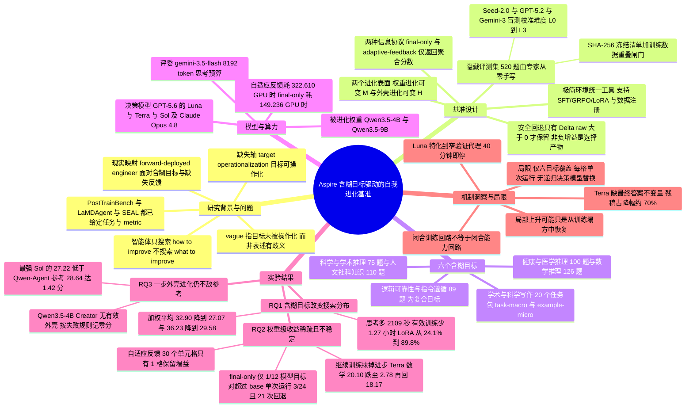

## 一、论文是干什么的？

想象两种学生。第一种学生拿到的任务是：「下周三考 AIME，考纲在这里，历年真题在这里，满分 15 分，你去练。」他要操心的只有一件事——怎么练得更高效。第二种学生拿到的任务是一句话：「你要成为一个更好的物理学家。」没有考纲，没有真题，没有分数线，甚至不知道最后会考什么。他得先自己想明白：我到底哪里弱？该补哪一块？找什么材料练？练完了怎么判断自己真的变强了，而不是自我感觉良好？

现在几乎所有关于「大模型自我进化」的研究，训练的都是第一种学生。PostTrainBench、LaMDAgent、SEAL 这些工作都是先由人类把「提升数学推理能力」翻译成「在 AIME 上涨分」，再把评测脚本和奖励函数交给智能体，智能体只需要在**怎么优化**这一条轴上搜索。这篇论文的作者认为，这恰恰跳过了最难、也最贵的那一步：把一个模糊的能力方向**变成**一个可训练、可验证的目标。他们给这一步起了个名字，叫**目标可操作化**（target operationalization）。

于是 ByteDance Seed 联合新加坡科技设计大学、M-A-P、TokenWave.AI 做了 Aspire 这个基准，专门训练和考核第二种学生。规则很简单也很残酷：智能体只会收到一句自然语言的能力目标（比如「提升数学推理」），下游到底考什么、题目长什么样、参考答案是什么、评分标准是什么，**全部对智能体隐藏**。它必须自己去找数据、自己决定用 SFT 还是 GRPO、自己搭一套验证集来判断有没有进步，最后交出一个模型权重或者一套智能体外壳（harness）。研究者手里握着一份 520 道题、由领域专家从零手写的隐藏评测集，用它来判定智能体究竟有没有真的变强。

论文的标题是个问句，答案基本是否定的。用作者自己的话说：**闭合训练回路，还不等于闭合能力回路**。智能体能非常熟练地跑完「找数据—训练—产出 checkpoint—自评」这一整套流程，但跑完之后模型往往还不如没训之前。这篇论文的价值不在于提出了什么新算法（它明确说自己不引入任何新训练算法），而在于把这个「假装在进步」的失败模式，用一套严密的实验协议和一堆扎实的数字给量化出来了。

## 二、核心方法与创新

### 2.1 什么叫「含糊」目标

论文特意澄清：这里的**含糊**（vague）不是「表述不清」或「有歧义」。它指的是一个**尚未被操作化成固定任务级目标和评测指标的宽泛能力方向**。「提升数学推理」这句话本身意思很清楚，含糊的是它没有告诉你考什么题型、什么难度、用什么指标、达到多少算成功。

这个区别很关键，因为它把智能体的搜索空间从一维扩展成了二维：原来只需要搜索「怎么优化」，现在还得同时搜索「优化什么」。而这个扩展带来一个更深的失败模式——**智能体在自己搭的代理指标上涨分，未必对应真实能力的提升**。

### 2.2 两个可进化的表面

Aspire 允许智能体在两个层面上「改造自己」：

- **模型权重进化**（RQ1、RQ2）：可变的是模型权重 $M$，外壳 $H_0$、决策模型 $D_r$、控制器和评测器在这一轮内固定不变。
- **智能体外壳进化**（RQ3）：可变的是外壳 $H$（运行时指令、工具策略、工作流、记忆、验证逻辑），模型权重 $M_0$ 固定不变。

论文还严格区分了两个概念：**决策模型**（$D_r$，负责指挥搜索的那个大脑）和**被改造的对象**（权重或外壳）。一轮进化里决策模型是冻结的；只有在一轮结束后，控制器才可以显式地把某个被验证过的训练后代提拔为下一轮的决策模型。文中报告的所有实验都**没有**做这种递归提拔，所以这篇论文测的是「自导向的权重搜索」，还不是完整的递归自我改进。

### 2.3 隐藏评测集：把尺子藏起来

这是整个基准设计上最讲究的地方。要衡量自我进化，你必须有一把外部的尺子；但只要智能体能看见尺子，它就会去优化尺子而不是能力。Aspire 的解法是：把评测器留在**控制器一侧**当作科研仪器，只对智能体隐藏它的任务定义、题目、答案和可分解奖励。

520 道题全部由领域专家**从零手写**。GPQA、MMLU-Pro、MedQA 只被用作「题型、领域覆盖、难度档位」的参考，**没有任何一道题被抄录、改写或收录**。质量控制流程包括：独立评审剔除错误/不完整/表述不足/评分不稳定的题；盲测难度校准（由 Seed-2.0、GPT-5.2、Gemini-3 三个模型独立作答，用 L0 到 L3 标记有几个模型答错）；精确与语义去重；与参考基准的重叠审计；评分器绑定；本地端到端验证。最后整套题集被冻结进一个带 SHA-256 的不可变清单，跑到一半的实验绝不换版本。

智能体注册的每一份训练数据，在进入训练后端之前都要过一道**与隐藏评测集的精确+语义重叠闸门**，命中就直接拒绝。

信息边界分两档协议：

| 协议 | 智能体能看到什么 | 用途 |
|---|---|---|
| **final-only**（只看终局） | 提交最终 checkpoint 之前，一个分数都看不到 | 测开环执行能力 |
| **adaptive-feedback**（自适应反馈） | 可以在配额内反复查询同一目标的**聚合分数**，但永远看不到题目、答案、逐题反馈、评委推理 | 测稀疏黑箱反馈下的搜索能力 |

### 2.4 极简交互环境与安全回退

作者刻意把「战略复杂度」和「基建复杂度」剥离开：智能体**不操作 shell、不下载训练仓库、不搭运行时、不实现分布式执行**。它面对的是一个统一的工具，暴露一组带类型、可组合的语义动作——搜索/下载/导入公开数据集、合成并注册新数据、启动 SFT 或 GRPO（可配 LoRA 等）、查询任务状态、在自己的验证集上跑检查、开分支或终止某条血脉。控制器负责凭证、存储、调度、资源隔离和 checkpoint 校验。

这个设计的意思是：不让智能体在「装环境」这种杂活上失分，把它彻底暴露在「该学什么」这个真问题面前。

**安全回退**（safe retention）机制值得单独说。对候选 $k$ 定义原始分数变化

$\Delta^{\mathrm{raw}}(k) = \hat{s}_\Gamma(Y(k)) - \hat{s}_\Gamma(Y^{\mathrm{in}})$

只有当选中的 checkpoint $k^\star$ 满足 $\Delta^{\mathrm{raw}}(k^\star) > 0$ 时控制器才保留它，否则整个回退到进来时的状态。于是**保留增益** $\Delta^{\mathrm{ret}} \geq 0$ 恒成立。作者特别提醒：这个非负性是**选择机制的产物，不是每次更新都有效的证据**——读这类论文时最容易被这个数字骗到。

## 三、使用了哪些模型和计算资源？

### 3.1 模型清单

| 角色 | 具体模型（含版本） | 出处 |
|---|---|---|
| RQ1 决策模型（含糊目标条件） | Claude Opus 4.8、GPT-5.6 | 4.2 节 |
| RQ1 对照参考 | 官方 PostTrainBench 成绩：Claude Opus 4.8 Max、GPT-5.6 | 表 3 |
| RQ2 被进化的权重（base model） | **Qwen3.5-4B** 与 **Qwen3.5-9B** 的指令微调 checkpoint | 4.3 节 |
| RQ2 自导向决策模型（Self） | 冻结的 Qwen3.5-4B / Qwen3.5-9B 初始 checkpoint 本身 | 4.3 节 |
| RQ2 外部决策模型 | GPT-5.6 的三个配置：**Luna**、**Terra**、**Sol**（均改造同一个 Qwen3.5-4B） | 4.3 节 |
| RQ3 运行时模型（固定） | **Qwen3.5-4B** | 4.4 节 |
| RQ3 参考外壳 | 原版 **Qwen-Agent** | 表 1 |
| RQ3 外壳创造者 | Qwen3.5-4B Creator、GPT-5.6 Luna / Terra / Sol | 4.4 节 |
| 开放题评委 | **gemini-3.5-flash**，8,192 token 思考预算，10% fail-closed 阈值 | 附录 C.3 |
| 难度盲测模型 | **Seed-2.0**、**GPT-5.2**、**Gemini-3** | 附录 A.2 |

可用的更新方法包括 SFT、GRPO、LoRA/PEFT，以及活动期内的继续预训练（continual pretraining）。

### 3.2 计算资源

- **RQ1**：每次试验占用**一张 H20 沙箱 GPU**，最长 10 小时。匹配比较共 **48 对**（matched run pairs）。
- **RQ2 final-only 协议**：24 次运行、83 个训练任务，**结算训练 GPU 时共 149.236 小时**；其中 Qwen3.5-4B 用掉 **59.269** GPU 时，Qwen3.5-9B 用掉 **89.967** GPU 时。
- **RQ2 adaptive-feedback 协议**：30 个「配置—目标」单元格、124 份训练计划、107 个训练任务，**结算训练 GPU 时共 322.610 小时**。
- **按决策模型拆分**（自适应反馈）：Luna 产出 22 个被评测 checkpoint，耗 **89.57** GPU 时；Terra 产出 19 个，耗 **91.73** GPU 时；Sol 产出 33 个，耗 **76.56** GPU 时。
- **RQ3**：4 次外壳创造尝试，**训练 GPU 时为 0**（不更新权重，创造者与运行时推理不计入训练账本）。
- **评测阶段**：评测器作为本地进程运行，checkpoint 推理用 no-thinking 模式，**checkpoint 部署占用 8 张 GPU**，评测完即清理。

> ⚠️ 论文只在 RQ1 明确写了 GPU 型号是 H20；RQ2 与 RQ3 的训练所用 GPU 具体型号，全文**暂无相关信息**。

### 3.3 一个完整计算单位要跑多久

| 单位 | 预算 / 实测耗时 |
|---|---|
| RQ1 单次试验 | 1 张 H20，**上限 10 小时** |
| RQ2 自适应反馈的一个「配置—目标」单元格 | 上限 **40 GPU 时 + 10 小时墙钟时间** |
| RQ2 final-only 的一次运行 | 上限 **40 GPU 时**，只许提交 1 个最终 checkpoint |
| RQ1 匹配对的实际时间分解 | 含糊目标下：GPU 空转从 0.6 小时升到 1.2 小时，有效工作从 8.0 小时降到 6.7 小时；决策模型思考时间**多 2,109 秒** |
| 长尾运行实例（final-only） | 4B 数学 Run B：20 个训练任务、**26.570 GPU 时**；9B 数学 Run B：17 个任务、**32.286 GPU 时**；9B 写作 Run B：16 个任务、**30.530 GPU 时** |
| RQ3 外壳创造耗时 | Luna 约 **40 分钟**；Sol **3 小时 11 分钟**；Terra 未给出具体时长 |

轨迹分析的规模也顺带一提：确定性提取覆盖了每一个「配置—目标」单元格，读取了 **63,973 条 agent 事件、1,196 条训练事件、2,194 条阶段事件**，还原出 **124 份训练计划**和 **95 次候选评测尝试**。

## 四、实验结果

### 4.1 那六个含糊目标到底是什么

这是理解全文的钥匙。520 道题被划成六个互不重叠的组，每组对应一个含糊目标：

| 含糊目标（原文） | 中文 | 题量 |
|---|---|---|
| Scientific and academic reasoning | 科学与学术推理 | 75 |
| Humanities and social-science knowledge | 人文与社会科学知识 | 110 |
| Health and medical reasoning | 健康与医学推理 | 100 |
| Mathematical reasoning | 数学推理 | 126 |
| Logic, reliability, and instruction following | 逻辑、可靠性与指令遵循 | 89 |
| Academic and scientific writing | 学术与科学写作 | 20 |
| **合计** | 六个互不重叠的组 | **520** |

第五个目标是**有意做成复合的**：论文明确说，当前协议**不宣称**能把逻辑推理、抗幻觉、指令遵循这三样当作三个独立可识别的目标来测，而是把它们当成一个整体的「可靠性目标」。第六个写作目标的 20 道题是 20 个**顶层任务包**，一个任务包可能产出多个被评分的样例，所以 RQ3 要同时报 task-macro 和 example-micro 两种聚合。

给智能体看的提示词长什么样？以数学目标为例，它要求智能体「提升困难的多步推理、精确计算和清晰论证」，**完全不提评测题的存在形态**。

### 4.2 RQ1：把明确任务换成含糊目标，会发生什么

在 PostTrainBench 上，把「benchmark 名字」换成「宽泛能力描述」，其余接口和原始任务评测器都不变：

| 基准 | 官方 Claude Opus 4.8 Max | 含糊目标 Claude Opus 4.8 | 官方 GPT-5.6 | 含糊目标 GPT-5.6 |
|---|---|---|---|---|
| AIME 2025 | 10.83 | 5.83 | 7.50 | 3.75 |
| GPQA Main | 28.35 | 24.89 | 30.13 | 27.04 |
| HealthBench | 31.68 | 12.62 | 27.39 | 9.93 |
| HumanEval | 47.33 | **56.63** | 63.95 | 56.40 |
| GSM8K | 68.87 | 66.98 | 69.48 | **74.35** |
| ArenaHard | 36.09 | 13.07 | 26.40 | 21.72 |
| BFCL | 47.13 | **58.63** | 94.38 | 79.38 |
| **加权平均** | **32.90** | **27.07** | **36.23** | **29.58** |

总分明显掉了（32.90 掉到 27.07，36.23 掉到 29.58），但任务级并非一致下滑——含糊目标的 Claude 在 HumanEval 和 BFCL 上反而更高，含糊目标的 GPT-5.6 在 GSM8K 上更高。

更有意思的是**精力去哪了**。在匹配的 Claude Opus 4.8 运行对里，含糊目标下：

- 决策模型思考时间每对多 **2,109 秒**，GPU 空转多 **0.61 小时**，而有效训练与评测时间少 **1.27 小时**；
- 「阅读任务定义」的轨迹密度变成 **2.98 倍**，「检查评测脚本」变成 **2.39 倍**，「LoRA/PEFT 使用」变成 **3.09 倍**；
- LoRA 出现在 **89.8%** 的含糊目标运行中，而匹配的明确任务运行只有 **24.1%**；有 **33 对**从不用 LoRA 切换到用 LoRA，**反向切换一例也没有**；
- 但工具动作总数**没有增加**（每条轨迹平均从 188.5 降到 179.2）。

所以作者的措辞很克制：含糊目标让智能体做了更多**目标解读**的工作、更少**实际更新**的工作，但这只是描述性关联，不能断言谁挤掉了谁。

顺带一个横向对照：含糊目标 Claude 每条轨迹 3.54 次评测、6.17 次训练启动，即每次训练 **0.57 次评测**；官方 GPT-5.6 是 39.21 次评测配 14.91 次启动，即 **2.63 次**，反馈密度是前者的 **4.6 倍**。而官方 Claude Opus 4.8 Max 是另一种画风：每条轨迹只有 2.89 次评测、5.14 次启动（0.56 次每启动，几乎和含糊目标条件一样），但记录了 **165,851** 个思考字符，官方 GPT-5.6 只有 **30,895** 个。一个靠高频试错，一个靠深度思考。

### 4.3 RQ2：权重级收益到底有多稀疏、多不稳定

这是全文最扎心的部分。

**final-only 协议**（24 次运行，每个「模型—目标」对跑两次取算术平均 Avg@2）：

| 含糊目标 | 4B base | 4B Run A | 4B Run B | 4B 均值 | 4B Δ | 9B base | 9B Run A | 9B Run B | 9B 均值 | 9B Δ |
|---|---|---|---|---|---|---|---|---|---|---|
| 科学与学术推理 | 44.000 | 0.000 | 0.000 | 0.000 | −44.000 | 45.330 | 48.000 | 48.000 | 48.000 | **+2.670** |
| 人文与社科 | 18.820 | 9.000 | 5.909 | 7.455 | −11.365 | 27.450 | 10.273 | 9.091 | 9.682 | −17.768 |
| 数学推理 | 17.860 | 16.746 | 0.159 | 8.452 | −9.408 | 25.160 | 0.714 | 2.540 | 1.627 | −23.533 |
| 健康与医学 | 87.000 | 63.000 | 68.000 | 65.500 | −21.500 | 87.000 | 71.000 | 72.000 | 71.500 | −15.500 |
| 逻辑与指令遵循 | 27.460 | 21.437 | 23.754 | 22.596 | −4.864 | 26.190 | 6.141 | 16.338 | 11.240 | −14.950 |
| 学术与科学写作 | 19.270 | 0.000 | 15.308 | 7.654 | −11.616 | 22.930 | 23.588 | 0.000 | 11.794 | −11.136 |

**「权重级收益稀疏且不稳定」的具体数字**：

- 以「模型—目标」对为单位：Qwen3.5-4B **0/6** 高于 base，Qwen3.5-9B **1/6**。12 个对里只有 1 个正的均值。
- 唯一的正例是 9B 的科学与学术推理：两次运行都从 45.33 涨到 48.00，均值 48.00，比 base **高 2.67 分**。
- 以单次运行为单位：**3/24** 个最终 checkpoint 超过 base（4B 是 0/12，9B 是 3/12），另外 **21 个运行被回退到 base 模型**。
- 未回退前的原始宏平均：4B 从 **35.735 掉到 18.609**，9B 从 **39.010 掉到 25.640**。
- 这不是评测出故障：24 次评测全部一次通过评委，2,080 个逐题输出**全部非空**，没有一道题报评测错误。
- 即便那个唯一的正例也很脆：两次运行都答对 36/75 题，但**只有 26 题重叠**，**20/75 题在两次运行间翻转对错**。所以一致的只是聚合方向，不是逐题稳定性。

**adaptive-feedback 协议**（30 个「配置—目标」单元格，每格一次运行）：

- **30 格** → **28 格**产出被评测的 checkpoint → **21 格**产出满足溯源/探索/完成/终局记录要求的合格 checkpoint → 只有 **2 格**的最佳 checkpoint 超过 base → 最后只有 **1 格**的增益被保留。
- 两个超过 base 的：Qwen3.5-4B Self 在科学上从 44.00 涨到 45.33（但没有任何 Self 单元格最终保住高于 base 的模型）；Terra 把 Qwen3.5-4B 的数学从 17.86 提到 20.10——这是**唯一**同时满足「超过 base + 通过合格性 + 回退后仍存活」的单元格。
- 作者对这唯一的成功也留了余地：那个 20.10 是在同一片固定评测切片上用重复聚合反馈选出来的，**没有独立的确认切片**，所以它是「反馈引导选择」的证据，而不是独立复现的能力增益。

**「继续搜索训练反而会抹掉先前进步」的具体数字**：

- 22 个有多个 checkpoint 的单元格共 **62 次相邻转移：28 次上升、13 次持平、21 次下降**。14/22 的单元格里「后来的搜索」胜过「第一个 checkpoint」——但这**完全不代表**超过了 base。
- 最典型的例子：Qwen3.5-4B Self 在数学上从 **0.79 → 1.75 → 2.38** 一路单调上升，看起来很励志，可它的 base 是 **17.86**。这条漂亮的上升曲线，实质是**从训练造成的塌方里往回爬**。
- Terra 那个唯一保住的数学 20.10，**后续的后代从 20.10 跌到 2.78，再恢复到 18.17**——搜下去反而把成果搞没了。
- Sol 搜得最广：注册 40 份计划、36 次评测尝试、23 次搜索动作、12 个不同数据集名字，产出 **33 个**被评测的 checkpoint，烧掉 **76.56 GPU 时**，结果**没有一个超过对应的 base 分数**。
- 各外部决策模型的最佳成绩：Luna 在人文 7.27、逻辑 20.39；Terra 在数学 20.10、写作 16.01；Sol 在科学 30.67、医学 11.00。**六个目标里有五个，连这些最高分都仍在 base 之下。**
- final-only 里三条长尾运行跑了 16 到 20 个训练任务、烧掉 26.570 到 32.286 GPU 时，最终提交的 checkpoint 分别只拿到 **0.159**（4B 数学）、**2.540**（9B 数学）、**0**（9B 写作）。

**一个具体的翻车机制**：数值标签 SFT 导致答案格式坍塌。Qwen3.5-4B Self 在 **30/32** 次数据导入事件里都拉的是 GSM8K 或 Hendrycks 数学数据——**包括那些本该做科学、逻辑、写作的运行**（9B Self 好一点，15 次导入里 11 次是数学数据）。final-only 里有 5 个提交的 checkpoint 训在数值标签 MMLU SFT 上：**21,000 个训练目标全是单个数字**，对应的 **279 个评测输出也全是单个数字**，五个分数是 **0、0、0、6.141、0**。模型被训成了一台只会吐数字的机器。

### 4.4 RQ3：外壳进化，最强的仍打不过 Qwen-Agent

固定 Qwen3.5-4B 作运行时模型，以原版 Qwen-Agent 为参考外壳 $H_0$，让四个创造者各自尝试产出一个后继外壳 $H_1$，冻结后在同样的 20 道写作题上各执行三次取均值：

| 配置 | Task macro | Example micro |
|---|---|---|
| 原版 Qwen-Agent 参考 | **28.64** | **27.65** |
| Qwen3.5-4B Creator（未产出有效外壳） | N/A | N/A |
| GPT-5.6 Luna 后继外壳 | 19.32 | 18.33 |
| GPT-5.6 Terra 后继外壳 | 20.76 | 20.14 |
| GPT-5.6 Sol 后继外壳 | 27.22 | 25.97 |

**「最强进化 harness 仍低于 Qwen-Agent 参考」的具体数字**：三个有效后继全部低于参考。最接近的 Sol 是 27.22/25.97，**task macro 比参考低 1.42 分**；Terra 20.76/20.14；Luna 19.32/18.33。Qwen3.5-4B Creator 一个有效外壳都没产出，按预先声明的失败规则**记零分**。

三条失败轨迹很有教学意义：

- **Luna——在窄代理上过早收手**：它用一道验证提示配一份八项检查清单来评估 $H_0$，拿到 7/8 后加了一个固定的五段式研究回答模板（研究问题、设计、分析、风险、局限），于是在那道题和另外两道类似题上都拿到 8/8，**约 40 分钟就停了**。可在隐藏评测集上，这个模板会把「问机理、问公式、问参数、问工程细节」的题**统统改写成研究设计题**来答。验证集涨分与隐藏集 19.32 的 task macro，正是「特化到了一个窄代理」的写照。
- **Terra——审查了答案却没守住输出完整性**：它正确地砍掉了一个会凭空捏造显著性结果和效应量的两轮审阅器，却漏了一条「最终答案不变量」：调用计算器之后如果模型的最终回复为空，外壳会把**调用工具之前的半成品草稿**当成答案提交。被检视的那次执行里有两道题这样翻车，返回了 **342 字符和 520 字符**的残稿，分数从 $H_0$ 下的 **75.00 和 52.33 掉到 2.57 和 2.91**——这两道题**在算术上就占了那次执行总降幅的约 70%**。
- **Sol——测得广，选得保守**：它花 **3 小时 11 分钟**在自己验证集的四类任务上测了提示长度、工具调用恢复、禁用工具、审阅环节等多种变体，甚至纠正了自己一条错误的本地参考答案，并且**主动否掉了那些验证分更高但有幻觉、延迟或工具控制问题的变体**。它最终的改动只是恢复原版 Qwen-Agent 策略，再加一个「最后一条模型回复是否完整非空」的检查——而这个检查在被检视的 20 道题上**一次都没触发过**。它改善的是失败处理语义，轨迹里看不出它带来了准确率增益。

作者的边界声明也很克制：每个条件只有**一条创造轨迹**，三次执行测的是**冻结外壳的运行时波动**而不是三次独立进化；没有任何一次把 $H_1$ 再演化成 $H_2$，所以这测的是**一步式外壳生成**，不是递归的外壳自我改进。

## 五、潜在应用与已落地应用

**这套基准本身就是产出物。** 项目页 [Self-Developing Agents](https://self-developing-agents.github.io/) 把 Aspire 放在一个三段式研究议程里：Aspire 管**目标**（该改进什么），[S³Gym](https://arxiv.org/abs/2608.31100) 管**经验**（能否从经验中学），[HarnessDev](https://arxiv.org/abs/2609.01437) 管**系统**（改进能否持久）。Aspire 对外提供的可复用资产包括：六个能力目标、封存的 520 题专家评测集、支持权重与外壳更新的极简交互环境，以及 **48 对**含糊目标与明确任务的匹配运行轨迹。

**最直接的现实映射是前向部署工程师**（forward-deployed engineer, FDE）。论文的 Background 一节整节都在讲这个类比：一个被派驻到客户现场的工程师面对的正是三件事——目标是含糊的（一个非正式的部署需求要翻成具体目标）、反馈信号缺失或不可靠（测试和评判机制得先造出来）、执行系统还不存在（工具、上下文管理、状态、生命周期逻辑得边建边改）。今天这个缺口靠人填，Aspire 问的是模型能不能自己填。项目页把这条链路总结成五步：平台 → 发现真问题 → 交付方案 → 提炼可复用模式 → 沉淀为能力，并强调最终的检验标准是**复用**：下一个项目能不能用上这次的成果。

**对做自我进化系统的人的实操启示**，论文和项目页给了几条很硬的：

1. **必须拿智能体看不见的评测来判定目标选得对不对**，只看自建代理指标会系统性地骗自己；
2. **进步要对着 base 模型比，不要只对着上一个 checkpoint 比**——本文里 14/22 的单元格「后来比最初好」，但绝大多数还在 base 之下；
3. **回退和版本化是必需品而不是保险**：21/24 的 final-only 运行靠回退才保住了 base 模型；
4. **别信 SFT 数据的表面匹配**：训练目标的答案格式（比如全是单个数字）会直接把模型的输出格式带偏；
5. **搜得多不等于搜得好**：Sol 烧了 76.56 GPU 时、产出 33 个 checkpoint，一个都没超过 base。

至于**已落地应用**：论文没有报告任何把 Aspire 用于生产系统的案例，也没有在正文中给出代码或数据的公开发布地址。作者在 HuggingFace 讨论区给出的唯一链接是项目页。这一部分**暂无相关信息**。

## 六、网络上的讨论与评价

**HuggingFace 论文页**（[huggingface.co/papers/2608.31111](https://huggingface.co/papers/2608.31111)）：截至撰写时 **210 票赞**，被列为 **#3 Paper of the day**，8 月 31 日发表、9 月 3 日由 `wuyuhao` 提交，署名机构 ByteDance Seed。

讨论区目前有两条内容：

- **论文提交者** `mozhu` 的介绍帖（2 天前）：「我们提出 ASPIRE，一个考察模型能否仅从一个含糊的能力目标出发自我进化、且无法接触下游评测任务的基准。在覆盖六个目标的 520 道专家撰写题目上，智能体能够跑完训练与外壳编辑回路，但它们的收益仍然稀疏且不稳定，因为它们选择的数据和自我评估常常与隐藏目标不匹配。」并附上项目页链接。
- 自动推荐机器人 **librarian-bot** 的推荐帖（约 24 小时前），列出 Semantic Scholar 认为相似的论文：*Rethinking Self-Evolving Agents: Do We Still Need Prescribed Optimization Pipelines?*、*AI4AI-Bench*、*Harness-R1: Learning to Edit Executable Runtime Harnesses from Agent Failure Trajectories*、*Recursive Self-Improvement in AI: From Bounded Self-Refinement to Autonomous Research Loops*、*StarHarness*、*Argus*、*DarwinX*。这批推荐本身就说明了这篇论文所处的语境——2026 年上半年「自我进化 / 外壳进化 / 递归自我改进」是一条非常拥挤的赛道。

页面还显示这篇论文已被 **3 个 collection** 收录（Meta learning and Evolution、Continual learning、AI Particle），但**引用它的模型、数据集、Space 数量均为 0**。

**项目页** [self-developing-agents.github.io](https://self-developing-agents.github.io/) 由 ByteDance Seed 与 TokenWave 于 2026 年 9 月 1 日发布，提供了带交互图表的三基准总览，核心结论被概括成一句话：**「目标不是不断改变，而是知道该保留哪些改变。」** 页面上关于 Aspire 的可视化直接复现了论文里 30 格漏斗（30 → 28 → 21 → 1）和 4B Self 数学 0.79/1.75/2.38 对 base 17.86 的对比图。

**其他平台**：在 X（Twitter）、Reddit、Hacker News 上多轮检索**未找到**针对这篇论文的专门讨论帖或深度评论。除 HuggingFace 讨论区和官方项目页外，**暂无其他可引用的第三方评价**。

## 七、思维导图

