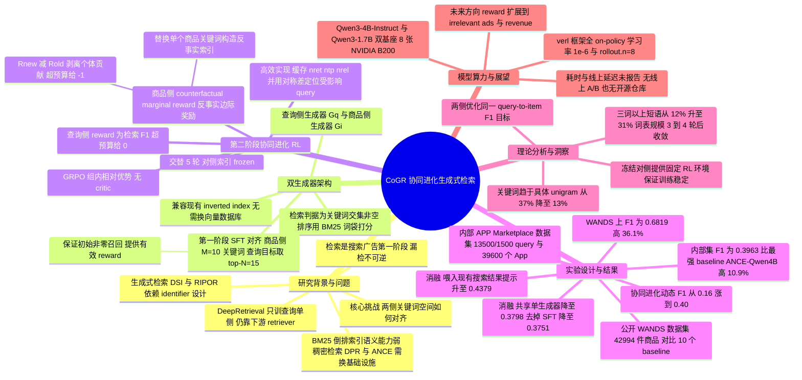

## 一、论文是干什么的？

想象一个大型跳蚤市场。买家进门喊一句「我想要能哄小孩睡觉的东西」，市场管理员必须在三秒内从四万个摊位里挑出几百个可能相关的摊位，交给后面的评委去精挑细选。这个「粗筛」环节就是搜索和广告系统里的**检索**（retrieval）阶段。它有个残酷的特点：漏掉的东西后面谁都救不回来——第一步没被捞出来的商品，无论后面的排序模型多聪明，都不可能再出现在用户眼前。

传统市场的做法是让每个摊主自己在牌子上写几个关键词（「摇篮曲」「儿童」「睡前故事」），买家喊的话也被拆成关键词，两边对上词就算匹配。这就是**倒排索引**加 BM25 的老办法，几十年来支撑着绝大多数搜索广告系统——在竞价广告里，广告主本来就是直接对关键词出价的。它的毛病是死板：买家喊「哄小孩睡觉」，摊主牌子上写的是「白噪音」，字面对不上，就错过了。

这篇来自 Apple 的论文提出的 CoGR（Co-Evolving Generative Retriever）的想法很直接：既然牌子上的词是死的，那就**让两个大语言模型分别去写这两块牌子**——一个模型负责把用户的 query 展开成一组关键词，另一个模型负责把每个 App 的标题和描述压缩成一组关键词，然后照旧走倒排索引匹配。更关键的是第二步：这两个模型不是各写各的，而是**用强化学习交替训练、互相迁就**，一轮轮下来，买家侧和摊主侧的「行话」逐渐收敛到同一套词汇上。作者把这叫做 co-evolving（协同进化），论文标题「It Takes Two to Match」（匹配需要两个人配合）就是这个意思。

结果是：在 Apple 内部的 APP Marketplace 搜索数据集上，$F_1$ 比最强 baseline 高 10.9%；在公开的 WANDS 商品搜索基准上高 36.1%。而且整套东西的输出仍然只是「一串关键词」，可以塞进现有的倒排索引里，不需要换一套向量数据库。

## 二、核心方法与创新

### 2.1 先说清楚：什么是倒排索引，为什么「兼容它」这么重要

**倒排索引**（inverted index）本质上就是一本书后面的索引页。正着看，一本书是「第 37 页上有哪些词」；倒过来建表，就是「『量子』这个词出现在第 37、112、285 页」。搜索引擎把它用在商品上：为每个关键词维护一张「哪些 App 挂了这个词」的列表。用户查询产生几个关键词，系统把对应的几张列表取出来求并集，就得到了候选集。

这套结构之所以统治工业界几十年，是因为它**快得离谱且工程成熟**：查一个词就是一次哈希查表，列表还能压缩、分片、缓存；广告计费、关键词竞价、黑名单过滤、人工干预，全套运营工具都是围着它建的。

对比一下另一条路线——**稠密检索**（dense retrieval，如 DPR、ANCE）。它把 query 和商品都编码成几百维的浮点向量，靠向量近邻搜索来匹配。语义能力确实强，但代价是：你得部署一整套向量索引（ANN 服务）、要处理向量版本与商品变更的一致性、要重新设计运维和监控、广告主也没法再直接对「关键词」出价。对一个已经在跑真金白银广告业务的系统来说，这是一次伤筋动骨的基础设施迁移。

CoGR 的设计取舍就在这里：**模型再聪明，最终吐出来的也只是一串纯文本关键词**。论文原文写得很明确——生成的关键词直接作为检索表示，通过倒排索引匹配，从而保持了与现有基于关键词的检索基础设施的兼容性。检索集合的定义是一个朴素的集合求交：

$$I_{\mathrm{ret}}(q)=\{i:(S_q\cup\{q\})\cap(S_i\cup\{i\})\neq\varnothing\}$$

其中 $S_q$ 是查询侧生成的关键词集合，$S_i$ 是商品侧生成的关键词集合，注意原始 query 文本和商品文本本身也被算作一个「关键词」放进去。命中之后，排序仍然用最老实的 BM25——把两侧的关键词集合当成词袋算分。

换句话说，CoGR 做的是：**不动管道，只换写牌子的人**。这一点在工程落地上的价值，可能比论文里那些百分点更值钱。

### 2.2 什么是生成式检索

**生成式检索**（generative retrieval）是最近几年检索领域一条很火的路线。传统检索是「比对」：算 query 和每个文档的相似度，排序取前 K。生成式检索则改成「默写」：把文档编号（identifier）当成一串 token，训练一个序列模型，输入 query，直接**自回归地把相关文档的编号吐出来**。代表工作是 DSI（Transformer Memory as a Differentiable Search Index），它给每个文档分配一个语义 ID，让模型背下 query 到 ID 的映射；后续的 DSI-QG、RIPOR 等在标识符设计和优化目标上做改进。

这条路线的麻烦，论文在引言里点得很准：**过度依赖标识符的设计，并且在解码可扩展性和泛化性上有困难**。新商品上架了怎么办？模型没背过这个 ID 就永远生成不出来。标识符编码方式换一种，效果可能天差地别。

CoGR 可以看作生成式检索的一个变体，但它生成的不是人造的语义 ID，而是**自然语言关键词**——这些词本来就在预训练词表里，模型天然会用；新 App 上架只要跑一遍商品侧生成器就有了关键词，不需要重训；而且人可以直接看懂这些词，运营能介入。

顺带说一句现有 LLM+检索工作的共同短板：不论是 HyDE 这类提示 LLM 写假文档的方法，还是 DeepRetrieval 这类用检索指标做奖励训练查询改写器的方法，**它们都只训练一侧（几乎总是查询侧）**，最后的匹配还是丢给一个独立的下游检索器。CoGR 问的问题是：能不能两侧都由 LLM 来构造表示，并且直接在这个表示空间里完成匹配？

### 2.3 第一阶段：用 SFT 把两边的词表先对齐

如果一上来就用强化学习让两个模型自由生成，会出现一个致命问题：**一开始两边根本对不上词，检索结果全是空，奖励恒为零，模型学不到任何东西**。所以要先做一次监督微调（SFT）来「破冰」。

作者的构造办法很巧妙，只用了三步：

1. 用原始（未微调的）LLM 为每个商品 $i$ 生成 $M$ 个关键词，得到初始集合 $S_i$。
2. 对每个 query $q$，把所有**标注为相关**的商品的关键词汇总成一个多重集合，取出现频次最高的前 $N$ 个，作为该 query 的目标关键词集 $S_q$。
3. 分别用 $\{(q,S_q)\}$ 和 $\{(i,S_i)\}$ 微调出查询侧生成器和商品侧生成器。

这一步的精髓在于第 2 步：query 的目标关键词**不是凭空写的，而是从它的相关商品那里「抄」来的**。这就在构造上强制保证了相关 query 与商品之间必然存在关键词重叠，RL 一开始就有非零的召回，也就有了有意义的奖励信号。论文实验用的具体数值是查询侧 top-$N$ 取 $15$，商品侧关键词预算 $M$ 取 $10$。

### 2.4 GRPO 是什么

**GRPO**（Group Relative Policy Optimization，组相对策略优化）出自 DeepSeekMath，是目前 LLM 强化学习里最主流的算法之一。理解它最省事的方式是跟 PPO 对比。

PPO 需要额外训练一个「价值网络」（critic）来估计「当前状态大概能拿多少分」，用实际得分减去这个估计值得到优势（advantage），告诉模型「这次比预期好还是差」。价值网络跟策略模型一样大，训练成本几乎翻倍，还容易训崩。

GRPO 的做法是把价值网络整个扔掉，改用**同组内的相对比较**：对同一个输入，让模型采样出一组（论文里是 8 个）不同的回答，每个回答算一个奖励分，然后**用这一组分数的均值和标准差把它们归一化**。高于组内平均的回答被鼓励，低于平均的被抑制。相当于不请一个裁判来打绝对分，而是让 8 个答案自己排个名次。

这个思路特别适合 CoGR：查询侧对同一个 query 采样 8 组关键词，每组走一遍检索算出 $F_1$，谁的 $F_1$ 在这 8 组里排前面，就往谁的方向调参数。奖励是可以精确算出来的确定值（有标注数据就有 $F_1$），属于典型的 RLVR（可验证奖励强化学习）场景，不需要训练奖励模型。

查询侧的奖励定义直接就是检索的 $F_1$，再加一个关键词数量上限的约束：

$$\mathcal{R}_q(S_q)=\begin{cases}F_1\bigl(I_{\mathrm{ret}}(q),\mathrm{rel}(q)\bigr),&|S_q|\leq K_{\max},\\ 0,&|S_q|>K_{\max}.\end{cases}$$

论文解释了为什么选 $F_1$ 而不是单看召回或精度：在工业检索系统里，精度直接关系到用户体验（少给用户看不相关的东西），召回则关系到进入下游排序与竞价的候选覆盖度，也就直接关系到潜在收入。$F_1$ 把两者平衡起来。作者还提到，如果业务上对精度和召回的优先级不同，可以换成带权 F-measure。

### 2.5 商品侧的 counterfactual marginal reward——全文最巧妙的一步

现在轮到商品侧。问题来了：**一个商品的关键词好不好，怎么打分？**

最自然的想法是「照抄查询侧」：把商品当成 query，看它能召回多少相关 query，算个对称的 $F_1$。论文把这个方案叫 Transposed $F_1$，并在消融实验里证明它更差（$F_1$ 只有 0.3743，完整版是 0.3963）。原因也好理解：**这是在优化一个错误的目标**。线上真实发生的是「用 query 找商品」，不是「用商品找 query」，两者的候选集大小、竞争关系完全不同。

作者的方案是**反事实边际奖励**（counterfactual marginal reward）。核心问题被重新表述成一句非常干净的话：

> 如果把这个商品的关键词从「原来那套」换成「模型新生成的这套」，而**其他所有商品的关键词一个字都不改**，整个系统的检索质量会变好多少？

用生活化的比喻：一个足球运动员的价值怎么衡量？不是看他个人进了几个球，而是看**把他换下场之后，整支球队的胜率跌了多少**——经济学里叫边际贡献，因果推断里叫反事实。

具体实现是：在每一轮商品侧更新开始时，冻结查询侧索引，并把当前的商品侧索引整体记为「参考状态」（reference）。对模型采样出的每个候选关键词集 $S_i$，构造一个**反事实索引**：只把商品 $i$ 的关键词替换掉，其余商品原封不动。然后奖励定义为两个全局指标之差：

$$\mathcal{R}_i(S_i)=\begin{cases}\displaystyle\sum_{q\in\mathcal{Q}}F_1\!\left(I_{\mathrm{ret}}^{\mathrm{cand}}(q;S_i),\mathrm{rel}(q)\right)-\sum_{q\in\mathcal{Q}}F_1\!\left(I_{\mathrm{ret}}^{\mathrm{ref}}(q),\mathrm{rel}(q)\right),&|S_i|\leq K_{\max},\\[4pt] -1,&\text{otherwise}.\end{cases}$$

前一项是换了关键词之后全体 query 的 $F_1$ 总和，后一项是没换之前的总和。**两者相减，就把这个商品自己的功劳从所有其他商品的功劳里干净地剥离了出来**。注意这里优化的仍然是查询到商品这个方向的 $F_1$，也就是说，查询侧和商品侧优化的是**同一个目标函数**，只是商品侧拿到的是这个目标对自己的边际贡献（一次有限差分，而非严格意义上的偏导数）。这正是「co-evolving」能收敛的根本原因。

### 2.6 这个奖励怎么算得起？——一次查表加常数级更新

上面这个定义看着很美，但天真实现会直接把训练成本炸掉：每采样一个候选关键词集，就要重建一次商品索引、对全部 13500 个 query 重跑一遍检索。GRPO 每个商品要采 8 个样本，商品有 39600 个，这个量级根本跑不动。（13500 个训练 query、39600 个商品、rollout.n=8 这三个数都出自论文，但把它们相乘估算开销这一步是本综述所做，论文未给出该算式。）

论文附录 B.3 给出的加速方案，是本文工程上最漂亮的一段。关键观察是：**每次反事实只改动了一个商品，所以绝大多数 query 的 $F_1$ 根本不会变，在减法里直接抵消掉了。**

具体做法：

**第一步，缓存计数**。在每轮商品侧训练开始时，对每个 query 记下三个整数——检索到的商品数 $n_q^{\mathrm{ret}}$、其中命中相关商品的数量（真正例）$n_q^{\mathrm{tp}}$、相关商品总数 $n_q^{\mathrm{rel}}$。有了这三个数，参考状态的 $F_1$ 就是一个除法：

$$F_1^{\mathrm{ref}}(q)=\frac{2n_q^{\mathrm{tp}}}{n_q^{\mathrm{ret}}+n_q^{\mathrm{rel}}}$$

**第二步，找出受影响的 query**。对每个商品 $i$，缓存「在参考关键词下有哪些 query 会检索到它」的集合 $\mathcal{Q}_i^{\mathrm{ref}}$。给定新采样的 $S_i$，只需**对冻结的查询侧倒排索引做一次查表**，就得到新关键词能匹配上的 query 集合 $\mathcal{Q}_i^{\mathrm{cand}}$。真正受影响的只有这两个集合的对称差：

$$\mathcal{Q}_i^{\Delta}=\mathcal{Q}_i^{\mathrm{cand}}\,\triangle\,\mathcal{Q}_i^{\mathrm{ref}}$$

**第三步，常数时间更新**。对受影响的 query，商品 $i$ 要么是新进了检索集，要么是被踢出了检索集，分母加一或减一、分子看它是不是相关商品加减一即可：

$$F_1^{\mathrm{cand}}(q)=\begin{cases}\dfrac{2\left(n_q^{\mathrm{tp}}+\mathbb{I}[i\in\mathrm{rel}(q)]\right)}{n_q^{\mathrm{ret}}+1+n_q^{\mathrm{rel}}},&q\in\mathcal{Q}_i^{\mathrm{cand}}\setminus\mathcal{Q}_i^{\mathrm{ref}},\\[8pt] \dfrac{2\left(n_q^{\mathrm{tp}}-\mathbb{I}[i\in\mathrm{rel}(q)]\right)}{n_q^{\mathrm{ret}}-1+n_q^{\mathrm{rel}}},&q\in\mathcal{Q}_i^{\mathrm{ref}}\setminus\mathcal{Q}_i^{\mathrm{cand}}.\end{cases}$$

最终奖励就只在这个很小的集合上求和：

$$R_i(S_i)=\sum_{q\in\mathcal{Q}_i^{\Delta}}\left(F_1^{\mathrm{cand}}(q)-F_1^{\mathrm{ref}}(q)\right)$$

于是，**每一个 rollout 的奖励计算 = 一次倒排索引查表 + 若干次常数时间的四则运算**，既不用重建索引，也不用重跑全量检索。这一段把一个理论上很优雅但看似算不动的奖励，变成了工程上真能跑的东西。

### 2.7 交替循环：谁在动，谁被冻住

有了两侧的奖励，剩下的就是安排训练顺序。核心原则是：**每次只让一侧动，另一侧的索引冻住不变**。否则两个模型同时漂移，谁都在追一个移动靶，训练必然不稳。

循环长这样：

1. 用 SFT 后的商品侧模型建一份商品索引；
2. 针对这份冻结的商品索引，用 GRPO 训练查询侧模型；
3. 用更新后的查询侧模型建一份查询索引；
4. 针对这份冻结的查询索引，用 GRPO 训练商品侧模型；
5. 用更新后的商品侧模型重建商品索引，回到第 2 步。

论文一共跑了 5 轮这样的交替。作者也说明，这套奖励设计并不绑定 GRPO，换成 PPO 一样能用。

## 三、使用了哪些模型和计算资源？

### 3.1 基座模型

CoGR 在查询侧和商品侧各实例化一个**独立**的生成器，同一规模下两侧用**相同的基座架构**（但是两份独立的权重）：

| 配置 | 两侧生成器的基座 | 参数量 |
|---|---|---|
| CoGR-4B | Qwen3-4B-Instruct | 4B |
| CoGR-1.7B | Qwen3-1.7B | 1.7B |

除非特别说明，论文后续的所有分析都用 CoGR-4B。消融实验（Table 3、Table 4）注明使用 Qwen3-4B / Qwen3-4B-Instruct 作为基座。

关于**版本号**需要如实说明：论文正文对 CoGR 自身的基座只写到 `Qwen3-4B-Instruct` 和 `Qwen3-1.7B` 这一层，**没有给出带日期后缀的完整版本号**。全文唯一出现完整版本串的地方是附录 E 的 baseline 表——DeepRetrieval 使用 `Qwen3-4B-Instruct-2507`。CoGR 自身是否用的同一个 2507 快照，论文未明示，此处不做推测。

作为对照，各 baseline 的基座（论文 Table 9）：

| Baseline | 基座模型 |
|---|---|
| BM25 | 无（无参数方法） |
| DPR | bert-base-multilingual-uncased |
| ANCE | roberta-base |
| SPLADE-v2 | naver/splade_v2_max |
| Qwen3-4B emb. | Qwen3-Embedding-4B |
| ANCE-Qwen4B | Qwen3-Embedding-4B |
| DSI / DSI-QG / RIPOR | mT5-base |
| DeepRetrieval | Qwen3-4B-Instruct-2507 |

### 3.2 计算资源

- **GPU**：GRPO 训练使用 **8 张 NVIDIA B200**。这是论文附录 B.2 明确写出的唯一硬件信息。GRPO 超参表里 `n_gpus_per_node` 也是 `8`，即单节点 8 卡。
- **训练框架**：verl（Sheng et al., 2024）。
- **Baseline 侧**：附录 E 说明，可训练的 baseline 统一使用 **8 张 GPU** 配分布式数据并行，但**没有说明这 8 张是什么型号**。
- **SFT 阶段的硬件**：论文**没有单独说明**，只在附录 B.2 中提到「For GRPO training, we use 8 NVIDIA B200 GPUs」。SFT 是否用同一批卡，暂无相关信息。

### 3.3 训练规模与耗时

先说结论：**论文没有报告任何以时间为单位的耗时数字**（不论是 GPU 小时、墙钟小时，还是线上推理延迟的毫秒数）。能确认的只有「训练量」这一侧的计量单位：

| 项目 | 数值 |
|---|---|
| 交替轮数 | 5 轮 |
| 每轮查询侧 GRPO epoch 数 | 10 |
| 每轮商品侧 GRPO epoch 数 | 5 |
| 累计 GRPO epoch | 查询侧 50，商品侧 25 |
| 学习率 `optim.lr` | $10^{-6}$（两侧相同） |
| `rollout.n`（每个样本采样数） | 8（两侧相同） |
| `train_batch_size` | 查询侧 512，商品侧 256 |
| `ppo_mini_batch_size` | 查询侧 512，商品侧 256 |
| `ppo_micro_batch_size_per_gpu` | 查询侧 64，商品侧 32 |
| `max_response_length` | 512（两侧相同） |
| `use_kl_loss` | False（两侧相同） |
| 关键词数量上限 $K_{\max}$ | 30（两侧相同） |
| RL rollout 采样 | 温度 1.0，top-p 1.0，top-k 为 $-1$，min-p 为 0 |
| 初始化 / 评测 / 建索引采样 | 温度 0.7，top-p 0.8，top-k 为 20，min-p 为 0 |

论文还特别说明采用**完全 on-policy 的在线 RL**：每次更新都从当前策略重新采样，不复用旧数据。

**关于线上推理延迟**：论文**没有给出任何延迟数字**。唯一相关的一句话是设计层面的说明——作者刻意**不使用思维链提示**（no chain-of-thought prompting），理由正是「避免额外的推理开销」。除此之外，关于 QPS、P99 延迟、索引构建耗时等生产指标，全文暂无相关信息。

## 四、实验结果

### 4.1 数据集

| 数据集 | 训练 / 评测 query 数 | 商品库规模 | 每个 query 的相关商品数 |
|---|---|---|---|
| Internal（Apple APP Marketplace） | 13,500 / 1,500 | 39,600 个 App | 约 1,000 |
| WANDS（Wayfair 商品搜索） | 430 / 50 | 42,994 个商品 | 约 200 |

两个数据集都只沿 query 维度切分，商品全集在训练和验证时都保留，所以验证集成绩反映的是**对未见过的 query 的泛化能力**。相关性标注方面，Internal 数据集用内部的 LLM-as-a-judge 打五档（excellent / good / acceptable / poor / bad），acceptable 及以上算相关；WANDS 是人工三档标注（Exact / Partial / Irrelevant），前两档算相关。

作者特意挑这两个数据集，是因为它们**每个 query 都有大量相关商品**，更贴近真实工业检索的多对多场景，而传统 IR 数据集的相关性标注往往过于稀疏。

### 4.2 主结果

下表摘录了两个数据集上完整检索集合的宏平均 $F_1$（论文 Table 2，还报告了 MRR@100、NDCG@100 等指标，此处从略）。带「冻结」标记的行表示商品侧参数固定不训练。

| 数据集 | 类型 | 方法 | 精度 P | 召回 R | $F_1$ |
|---|---|---|---|---|---|
| Internal | 稀疏 | BM25 | 0.2453 | 0.1141 | 0.1056 |
| Internal | 稀疏 | SPLADE-v2 | 0.2706 | 0.4486 | 0.3019 |
| Internal | 稠密 | Qwen3-4B emb. | 0.2310 | 0.2689 | 0.2191 |
| Internal | 稠密 | DPR | 0.2408 | 0.4058 | 0.2700 |
| Internal | 稠密 | ANCE | 0.2671 | 0.4396 | 0.2971 |
| Internal | 稠密 | ANCE-Qwen4B（最强 baseline） | 0.3756 | 0.4354 | 0.3575 |
| Internal | 生成式 | DSI | 0.2882 | 0.4790 | 0.3220 |
| Internal | 生成式 | DSI-QG | 0.2901 | 0.4814 | 0.3241 |
| Internal | 生成式 | RIPOR | 0.3371 | 0.3793 | 0.3167 |
| Internal | 生成式 | DeepRetrieval 4B | 0.2907 | 0.3333 | 0.2750 |
| Internal | 本文 | CoGR 1.7B（商品侧冻结） | 0.3177 | 0.2289 | 0.2399 |
| Internal | 本文 | CoGR 1.7B | 0.3523 | 0.4169 | 0.3527 |
| Internal | 本文 | CoGR 4B（商品侧冻结） | 0.3335 | 0.2459 | 0.2617 |
| Internal | 本文 | **CoGR 4B** | **0.3976** | 0.4569 | **0.3963** |
| WANDS | 稀疏 | BM25 | 0.4768 | 0.6149 | 0.4418 |
| WANDS | 稀疏 | SPLADE-v2 | 0.5914 | 0.6050 | 0.4903 |
| WANDS | 稠密 | Qwen3-4B emb. | 0.3371 | 0.3408 | 0.2634 |
| WANDS | 稠密 | DPR | 0.5612 | 0.5581 | 0.4520 |
| WANDS | 稠密 | ANCE | 0.5731 | 0.5485 | 0.4554 |
| WANDS | 稠密 | ANCE-Qwen4B（最强 baseline） | 0.6136 | 0.6092 | 0.5012 |
| WANDS | 生成式 | DSI | 0.3994 | 0.3468 | 0.2890 |
| WANDS | 生成式 | DSI-QG | 0.5051 | 0.5044 | 0.4023 |
| WANDS | 生成式 | RIPOR | 0.4760 | 0.4205 | 0.3595 |
| WANDS | 生成式 | DeepRetrieval 4B | 0.4802 | 0.6155 | 0.4431 |
| WANDS | 本文 | CoGR 1.7B（商品侧冻结） | 0.5073 | 0.3751 | 0.3664 |
| WANDS | 本文 | CoGR 1.7B | 0.7325 | 0.5503 | 0.5685 |
| WANDS | 本文 | CoGR 4B（商品侧冻结） | 0.5691 | 0.4696 | 0.4662 |
| WANDS | 本文 | **CoGR 4B** | **0.7940** | 0.6885 | **0.6819** |

用大白话总结三点：

1. **CoGR 4B 在两个数据集上都拿了最高的 $F_1$**：0.3963（对最强 baseline ANCE-Qwen4B 的 0.3575 提升 10.9%）和 0.6819（对 0.5012 提升 36.1%）。
2. **协同进化是必需的，不是锦上添花**。把商品侧冻住只训查询侧，Internal 上 $F_1$ 从 0.3963 掉到 0.2617——比一半 baseline 还差；同样只训查询侧的 DeepRetrieval 也只有 0.2750。这说明**光把用户的话说得更漂亮没用，摊主的牌子也得跟着改**。
3. **1.7B 的小模型配上协同进化，就能干翻 4B 的单侧方法**：CoGR 1.7B 在 Internal 上是 0.3527，明显高于 DeepRetrieval 4B 的 0.2750。

另外值得注意的是，稀疏检索在更难的 Internal 数据集上崩得很惨（BM25 只有 0.1056），而生成式检索 baseline 在更小更简单的 WANDS 上反而退化明显——只有 CoGR 在两边都稳。

### 4.3 协同进化的动态过程

论文 Figure 3 追踪了 5 轮交替过程中的验证集 $F_1$：从 SFT 初始化后的**约 0.16**，一路涨到 5 轮之后的**约 0.40**。增益最大的是第一轮（RL 开始把两个关键词空间往一起拽），后续几轮是更小但稳定的提升。整个过程没有出现震荡或崩溃，说明交替优化在动态上是稳定的。

### 4.4 消融实验

在 Internal 数据集上，全部使用 Qwen3-4B 基座：

| 变体 | 精度 P | 召回 R | $F_1$ |
|---|---|---|---|
| Transposed $F_1$（商品侧改用对称目标） | 0.3482 | 0.4462 | 0.3743 |
| Shared generator（两侧共用一个模型） | 0.3678 | 0.4635 | 0.3798 |
| No SFT（跳过第一阶段直接 RL） | 0.3800 | 0.4283 | 0.3751 |
| CoGR（完整版） | 0.3976 | 0.4569 | **0.3963** |

三个设计选择都被验证有效，但差距并不悬殊——作者据此认为整个协同进化框架对这些配置变化是**鲁棒**的，即使换个次优配置也能跑出合理成绩。

另一组关于输入信息的消融：

| 变体 | 精度 P | 召回 R | $F_1$ |
|---|---|---|---|
| CoGR（默认：商品侧含标题+描述） | 0.3976 | 0.4569 | 0.3963 |
| 去掉商品描述（只留标题） | 0.3875 | 0.4204 | 0.3759 |
| 查询侧额外加入搜索结果 | 0.4381 | 0.5002 | **0.4379** |

这里最有意思的是最后一行：把现有搜索系统返回的结果作为提示喂给查询侧生成器，$F_1$ 从 0.3963 直接涨到 0.4379。作者解释收益主要来自**消歧**——解决歧义查询、拼写错误、实体型查询和非英语查询。

### 4.5 关键词是怎么演化的

这部分是全文最直观的证据。5 轮 RL 之后：

- **单词（unigram）占比从 37% 降到 13%**，三词及以上的短语占比**从 12% 涨到 31%**。也就是说，模型自发地从写「mobile」「fun」这类泛泛的大词，转向写更具体、更有信息量的长短语。
- 商品侧词表在早期轮次**收缩**，查询侧词表**扩张**，大约 3 到 4 轮之后，两边的独立关键词数量**收敛到相近水平**。这正是「两侧词表互相对齐」的量化体现。

附录 D 的例子极为生动，展示了给查询侧额外提供搜索结果之后的变化：

| Query | 不给搜索结果时生成的关键词 | 给了搜索结果之后 |
|---|---|---|
| family search | album, anniversary, birthday, digital, photo, search, sharing, tracker… | genealogy, family history, genealogy app, family calendar, ancestry, family tree… |
| 解压软件 | relaxation, mindfulness, meditation, stress relief, puzzle game, mental health… | archive, compress, compression, extract, extractor, file, manager, rar, unzip, zip… |
| zenless | mindfulness, meditation, relaxation, mental health, stress relief… | action, adventure, battle, combat, defense, fantasy, royale, rpg… |
| duch bros | action, multiplayer, action game, arcade game, adventure game… | burger, coffee, deals, delivery, drink, fast, food, local, order, pizza… |

中文「解压软件」被当成了「解压力」（放松）而不是「解压缩」，`zenless` 被当成了 zen（禅）相关的冥想 App 而不是游戏《绝区零》，`duch bros` 是 Dutch Bros（美国连锁咖啡品牌）的拼写错误——三个都是活生生的翻车案例，也说明了为什么给生成器补充上下文这么重要。

商品侧同理：一个叫 `10000000` 的 App，只看标题时模型只能生成 `10000000, 1000` 这种废话，给了描述之后立刻变成 `rpg, dungeon crawler, puzzle, action rpg, roguelike, adventure`；`Compound Quest` 只看标题被当成了 DeFi 加密项目（compound 是知名 DeFi 协议），给了描述才知道是个「复合词」拼字教育 App。

## 五、潜在应用与已落地应用

### 5.1 潜在应用方向

- **搜索广告的关键词匹配**。这是论文最直接对准的场景。竞价广告里广告主本来就对关键词出价，CoGR 生成的关键词可以直接进入现有的竞价与计费链路。作者在结论里明确说，下一步要把奖励从 $F_1$ 这类相关性指标**扩展到下游业务目标，包括不相关广告占比和收入增益**。
- **电商商品搜索**。WANDS 本身就是 Wayfair 的家居商品搜索数据集，验证了方法在电商场景的可迁移性。
- **任何已经跑着倒排索引、又不想推倒重来的检索系统**。这是 CoGR 相对稠密检索最大的现实优势：换模型不换管道。
- **冷启动与长尾商品**。商品侧生成器可以为标题信息不足的新商品补出可检索的词，实验里去掉描述后 $F_1$ 下降也侧面印证了这一点。
- **多语言与拼写纠错前置**。附录 D 的例子说明加上搜索结果提示后，模型能处理非英语查询和拼写错误。

### 5.2 已落地应用：**查证结果是没有公开证据**

这一点需要非常谨慎地表述。经过检索，情况如下：

- 论文**只声明使用了一个内部 APP Marketplace 搜索数据集**，由去标识化、随机采样的用户查询构成。这是**离线数据集**，论文**没有报告任何线上 A/B 实验、上线灰度、流量占比或业务指标**（收入、CTR、不相关广告率等一概没有）。
- 反过来，论文结论部分把「把奖励扩展到不相关广告占比和收入增益」明确列为**未来工作**——这更像是在说 CoGR 目前**还停留在离线阶段**，尚未接入真实的广告目标。
- 检索 Apple 官方渠道（machinelearning.apple.com）、Apple Search Ads 的产品公告与第三方 ASO 行业报道，**没有找到任何提及 CoGR 已在 App Store 搜索或 Apple Search Ads 中上线的信息**。可以查到的、Apple 确实公开谈论过的相关工作是另一篇论文《Scaling Search Relevance: Augmenting App Store Ranking with LLM-Generated Judgments》（[arXiv:2602.23234](https://arxiv.org/abs/2602.23234)，也在 [Apple ML Research](https://machinelearning.apple.com/research/augmenting-app) 上发布），那篇讲的是用 LLM 生成的相关性标注去增强 App Store 排序，与本文不是同一件事（不过本文 Internal 数据集的标签正是由「内部 LLM-as-a-judge」打的，二者在方法论上有呼应）。
- 论文第一作者 Runpeng Dai 是 UNC Chapel Hill 的博士生，脚注写明这是**在 Apple 实习期间完成的工作**。

**结论：截至查证时点，没有任何公开信息可以证实 CoGR 已在 App Store 搜索或 Apple Search Ads 中落地。** 论文本身也没有作此声明。此处不做任何推测。

## 六、网络上的讨论与评价

### 6.1 HuggingFace Papers

论文由第一作者 Runpeng Dai 于 9 月 3 日提交到 [HuggingFace Papers](https://huggingface.co/papers/2609.00638)，标注机构为 Apple。截至本综述查证时，页面显示 **70 个 upvote**（本文 frontmatter 记录的是收录时的 67 票）。讨论区共有两条留言：

**一条来自论文作者本人**（用户名 Leo-Dai，标注为 Paper author / Paper submitter），原文大意是：

> 很高兴分享我们的工作 CoGR（Co-evolving Generative Retrieval），我们训练 LLM 为用户查询和 App 两侧都生成检索关键词。CoGR 遵循协同进化的训练框架：我们交替优化一侧、固定另一侧，让查询关键词和 App 关键词逐渐互相适应。通过这个迭代过程，我们观察到检索性能的稳定提升。

**另一条是自动化的 librarian-bot**，它通过 Semantic Scholar API 推荐了 7 篇相似论文，包括 GRASP（Agentic RAG 的粒度感知搜索策略）、UniGD（工业检索的统一生成-判别框架）、ICEGR（电商搜索的意图连贯端到端生成式检索）、《Learning from What You Retrieve: Online RL Fine-Tuning for Semantic Retrieval》以及《The Case Against Generation for Retrieval》等。这个列表本身说明了一件事：**2026 年「生成式检索 + 强化学习」已经是一个相当拥挤的赛道**，而且已经出现了唱反调的工作。

该论文还被收录进 5 个 HuggingFace collection（包括一个 225 条目的 Reinforcement learning 合集和一个 26 条目的 RAG 合集）。

### 6.2 其他平台

- **arXiv 收录页与聚合站**：论文被 [HyperAI](https://hyper.ai/en/papers/2609.00638) 等论文聚合站收录，但这些页面只有摘要与结构化摘要，**没有独立的编辑点评或第三方评论**。
- **X（Twitter）/ Reddit / Hacker News**：多轮定向检索**没有找到任何针对这篇论文的公开讨论帖**。这与它 70 票的 HF 热度形成一定反差，可能与论文本身偏工业落地、话题不够「爆点」有关。需要说明的是，Reddit 域名对本次检索所用的爬虫不开放，因此 Reddit 上是否有讨论**无法确认**，不能断言为「没有」。
- **代码与模型**：HuggingFace 页面显示引用该论文的 model、dataset、Space **均为 0**，论文中也**没有给出任何开源仓库地址**。考虑到内部数据集不可公开、方法涉及 Apple 生产系统，短期内开源的可能性不大。

总体印象：这篇论文在社区里的接受度不错（票数不低、被多个合集收录），但属于**工业界务实型工作**——没有引发争论，也没有被大规模转载讨论。它的价值更可能体现在被同行在自己的检索系统里默默复现上。

## 七、思维导图

