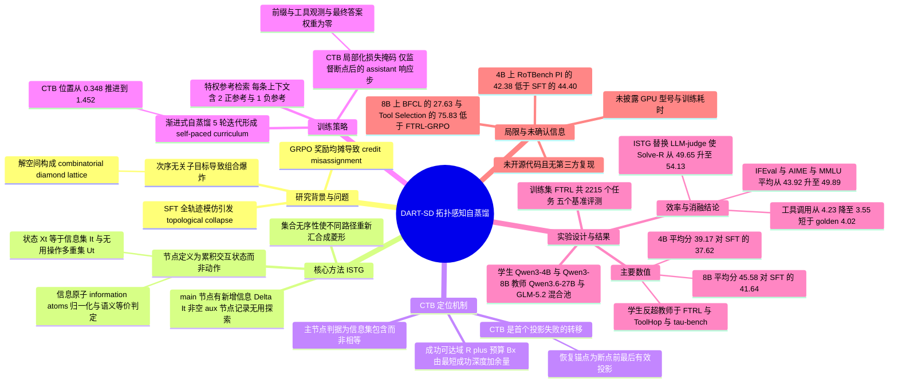

## 一、论文是干什么的？

想象你在带一个新来的实习生跑腿。任务是：帮我把这三件事办了——去邮局取包裹、去菜市场买菜、去银行交电费。这三件事互不相干，先干哪件都行。你自己跑过一趟，顺序是「邮局 → 菜市场 → 银行」，于是你把这趟路线录下来交给实习生，说：照着做。

第二天实习生出门，他先去了银行，因为银行就在楼下。结果你打开录像一比对，第一步就对不上，于是你把他这一天的所有动作全部否定，让他从头再背一遍你的录像。这显然荒谬——他做的事完全正确，只是顺序不同。可当今训练「多轮工具调用智能体」的主流做法，做的正是这件荒谬的事。

这篇来自字节跳动与中国科学技术大学的论文，指出了这个问题的根源并给出了解法。作者说：对于含有多个「**次序无关子目标**」的任务，正确解不是一条线，而是一张网——准确地说，是一个**组合菱形格**（combinatorial diamond lattice）。传统的行为克隆（Behavior Cloning）和监督微调（SFT）把这张网硬压成一条线来让模型模仿，会造成他们所说的**拓扑坍缩**（topological collapse）：模型被无差别地惩罚了那些完全合法的另一条路，学到的不是任务的逻辑骨架，而是某一条冗余路线的死记硬背，**策略多样性**（policy diversity）被摧毁。而标准强化学习（如 GRPO）也好不到哪去——奖励均匀摊到所有中间工具调用上，一条失败轨迹里那些原本正确的步骤跟着一起被扣分，这叫**信用错配**（credit misassignment）。

DART-SD 的解法可以用一句话概括：**别把整条录像塞给他，先找出他第一次真正走错的那一步，只从那一步开始教，前面对的部分一个字都不改**。为了找到「第一次真正走错的那一步」，作者需要一张图——这就是全文的技术核心。

## 二、核心方法与创新

### 2.1 先讲清楚菱形拓扑：为什么正确路径会组合爆炸

回到那三件跑腿的事。三件事互不影响，那么合法的完成顺序有 $3! = 6$ 种。如果是四件事，就是 24 种；五件事，120 种。这就是**阶乘级的组合爆炸**——正确答案的数量随子目标数量爆炸式增长，而你手里只有其中一条。

但更有意思的是这些路径在「状态空间」里长什么样。假设我们不看动作，只看**已经办成了哪些事**。起点是「什么都没办」，终点是「三件都办完」。中间状态就是各种子集：{邮局}、{菜市场}、{银行}、{邮局, 菜市场}、{邮局, 银行}、{菜市场, 银行}。把这些状态按包含关系连起来画出来，你会得到一个立方体的骨架图——从一个顶点出发，分叉成三条边，再两两汇合，最后收束到对角顶点。这种「分叉后必然重新汇合」的格子结构，就是论文标题里的**菱形**（diamond）。它的关键性质是：**不同的路径会在同一个中间状态重新相遇**。先买菜再取包裹，和先取包裹再买菜，最终站在的是同一个格点上。

现在看传统 SFT 干了什么。它把这个立方体压扁成一条线，宣布只有「邮局 → 菜市场 → 银行」这一条棱是对的，其余 5 条路径上的每一步都要被梯度往下压。模型学到的信号是：「先去银行」是错的。可这是彻头彻尾的谎言——先去银行完全正确。反复灌输这种谎言的结果，就是模型不敢再自主分叉，遇到新任务只会僵硬地套用背下来的固定顺序。这就是**把它练呆了**的机制：不是模型变笨了，而是它的**探索分布被人为压成了一个点**。

论文用一句很精准的话描述这个后果：模型「记住了冗余轨迹，而不是提取出任务的核心逻辑骨架」。

### 2.2 ISTG：把节点定义成「已获得的信息」，而不是「刚做的动作」

要让机器看见这个菱形，第一步是换一种方式定义「状态」。论文的做法叫**交互状态转移图**（Interaction-State Transition Graph, ISTG），关键设计是：

**节点不是动作，而是累积的交互状态。**

具体地，对每个任务 $x$，先把所有工具返回的有用事实归一化成一组**信息原子**（information atoms）$\mathcal{K}_x$。这一步分两个阶段做：

- **确定性阶段**：把工具响应结构化解析成字段，如果每个字段都只是状态信号、空值或占位符，就判定为「无信息」（比如报错、查无结果）；只要还留着一个实质性的值，就算有信息。所有无信息响应按工具折叠成一类，不做语义判断就把语料里的大头去掉了。
- **语义阶段**：把一个任务的所有剩余候选**放在一起**判断，条件是任务问题加上一条成功轨迹，产出一个集合值的原子映射 $\alpha_x$，满足 $|\alpha_x(e)| \le 1$。同一个事实无论是哪个工具用什么格式返回的，都映射到同一个原子。

作者特意强调「放在一起判断」这件事的必要性：只有把所有候选同时摆在眼前，才能判定它们是否信息等价；如果一条条独立打标签再指望标签自然吻合，等价关系根本不可判定。

有了原子，第 $t$ 步的状态就写成 $X_t = (I_t, U_t)$，其中 $I_t$ 是到这一步为止**累积获得的信息原子集合**，$U_t$ 是自上一个主节点以来做过的**无用操作**的多重集。新增信息量 $\Delta I_t$ 决定节点类型：

- $\Delta I_t \neq \varnothing$ 时是**主节点**（main），信息获取骨架上的一环；
- $\Delta I_t = \varnothing$ 且 $U_t \neq \varnothing$ 时是**辅助节点**（aux），挂在最近主节点下的一次无用探索。

**为什么这个定义能变出菱形**？因为 $I_t$ 是一个**集合**。集合天生没有顺序。「先买菜后取包裹」和「先取包裹后买菜」，走到第二步时 $I_t$ 都等于 {菜, 包裹}，于是它们**落在同一个节点上**——两条路自动汇合，菱形就自己长出来了。这就是论文说的「以累积交互状态而非瞬时动作定义节点，自然消解了顺序依赖冲突」。

反过来，作者也解释了为什么必须把无信息响应映射到空集：如果给每一次报错都按它自己的文本编一个标识，就会凭空制造出一堆没有任何证据支持的「信息状态」，把图的信息维度撑爆。而且由于只有有信息的响应才产原子，判断失误的残余误差**倾向于漏掉一个原子而不是发明一个原子**，图会变稀疏但绝不会捏造出不存在的状态或可达性。这是一个很克制、也很工程化的设计取舍。

学生模型的 rollout 用**完全相同的状态更新规则**重放一遍，于是教师和学生被嵌入同一个交互状态空间，不需要逐个动作对齐就能分别匹配「信息获取」和「无用探索」两件事。

### 2.3 成功可达域与 CTB：找出「第一次真正走错的那一步」

图有了，接下来要判断学生在哪一步脱离了「还有救」的区域。

**成功可达域**（success-reachable region）。作者不把所有成功轨迹上的节点都算作安全区，而是加了一个**预算**。设 $d_x^{\min}$ 是所有成功教师 rollout 中从根到成功终点的最少转移步数，定义任务预算

$$
B_x = \min\bigl(d_x^{\min} + \Delta_x,\ B_x^{\max}\bigr)
$$

其中 $\Delta_x$ 是允许超出最短成功深度的余量，$B_x^{\max}$ 是预算上限。然后

$$
\mathcal{R}_x^{+} = \{v \in V_x \mid \exists \tau \in \mathcal{T}_x^{+},\ v \in \tau,\ r_\tau(v) \le B_x\}
$$

$r_\tau(v)$ 是从 $v$ 到该条成功轨迹终点的剩余步数。注意这里是**从终点倒着量剩余距离**，而不是从根正着量深度——含义是「还能不能在预算内收工」。只在失败轨迹上出现过的状态仍然保留在图里，但被排除在 $\mathcal{R}_x^{+}$ 之外，不能当恢复锚点。

**按类型投影**。学生的主节点 $s_t$ 只要满足 $I(v) \subseteq I_t^s$ 就能对上一个可达教师主节点——**不要求信息集完全相等**，也不管无用操作那一栏。这个「子集」而非「相等」的判据非常关键，它正是允许学生走另一条棱、甚至暂时走得比教师更靠前的地方。学生的辅助节点则先找出信息被学生包含的可达教师主节点里信息最多的那个 $m_t$，再要求锚点是挂在 $m_t$ 下、**无用操作次数相同**的辅助节点——只比数量，不要求失败的工具一模一样。

定义 $\rho_t = \mathbb{I}[\mathcal{A}_t \neq \varnothing]$，也就是「这一步还投影得上吗」。

**关键拓扑断点**（Critical Topological Breakpoint, CTB）就是从「投影得上」翻转到「投影不上」的第一次转移：

$$
t_{\mathrm{C}} = \min\{t : \rho_{t-1} = 1,\ \rho_t = 0\}, \qquad a_{\mathrm{C}} = \pi(s_{t_{\mathrm{C}}-1})
$$

初始状态师生共享，所以 $\rho_0 = 1$ 恒成立，这个定义总是良定的。$a_{\mathrm{C}}$ 是断点前最后一个有效的教师投影，也就是**恢复锚点**。如果学生一路都投影得上却仍然失败了，就把终止状态当作纠正边界，用它最后一次有效投影作锚点。

用批改作业来类比：老师不是把整份卷子打个红叉重写，而是逐行往下看，找到**第一处真正推错的地方**，前面的推导全部保留，从那一行开始重来。CTB 就是那一行的行号。

### 2.4 局部化监督：只在修复步骤上算损失

找到断点之后，怎么生成「正确的下半段」？

作者从教师图里随机采样成功和失败的轨迹作为**特权参考**（privileged references）$\mathcal{C}^{\mathrm{priv}}$。注意这些参考**不是直接拼在学生前缀后面的**——因为两条轨迹的调用和观测很可能对不上，硬拼会产生语义断裂。取而代之的是一个增强生成器：

$$
c_{t_{\mathrm{C}}}^{*} = \operatorname{AugGen}\bigl(x,\ \tau_{<t_{\mathrm{C}}}^{s},\ \mathcal{C}^{\mathrm{priv}}\bigr)
$$

它以任务、断点前保留的学生前缀、以及特权参考为条件，生成一段接续。这样**学生真实经历过的上下文被完整保留**，教师轨迹只提供场外提示。

最后是损失。训练轨迹 tokenize 成 $\tilde{y}$，用带掩码的因果语言建模目标：

$$
\mathcal{L}_{\mathrm{DART}} = -\sum_{i=1}^{L} m_i \log p_\theta\bigl(\tilde{y}_i \mid \tilde{y}_{<i},\ x\bigr)
$$

掩码 $m_i = 1$ 的条件很严：这个 token 必须属于 **CTB 之后、最终答案步之前**的助手响应步。学生前缀、用户消息、工具观测、最终答案步一律权重为零。也就是说，梯度只落在「修复动作」上，**已经做对的推理前缀被严格保护，不会被破坏性的梯度更新覆盖掉**。

### 2.5 渐进式自蒸馏：让能力边界自己往后挪

ISTG 在整个自蒸馏过程中一直保留。每一轮，当前学生产生新的 rollout，映射进共享状态空间，走一遍类型投影和断点定位；失败的 rollout 变成局部化蒸馏样本。随着学生变强，它能保持「投影得上」的前缀越来越长，**检测到的 CTB 位置自然往后挪**。

这带来一个很漂亮的性质：CTB 追踪的是**当前策略的能力边界**，所以监督信号会自动向「刚好超出当前能力」的行为倾斜——一个自动生成的、无需人工设计难度的**自定步调课程**（self-paced curriculum）。

## 三、使用了哪些模型和计算资源？

### 3.1 LLM 模型

| 角色 | 模型 | 说明 |
|---|---|---|
| 学生（被训练的基座） | **Qwen3-4B**、**Qwen3-8B** | 两个参数规模都做了完整实验，引用 Qwen3 技术报告 |
| 教师（轨迹来源） | **Qwen3.6-27B** 与 **GLM-5.2** 的混合池 | 论文原文为 mixed pool 表述；GLM 一侧引用的是 GLM-5 技术报告 |
| 对比 baseline 使用的模型 | 与学生同为 **Qwen3-4B / Qwen3-8B** | SFT、SCoRe-SFT、OPSD、FTRL-GRPO、ToolRL、MatchTIR 全部在相同基座上训练评测，属严格受控对比 |

**训练与采样超参数**（论文 4.1 节 Implementation Details 全部原文数值）：

- 自蒸馏迭代轮数：**5 轮** CTB 引导的局部化 SFT
- 训练任务量：FTRL 训练集全部 **2,215 个任务**
- 每轮采样：每个任务由当前学生检查点生成 **8 条轨迹**，温度 **0.7**
- 最大生成长度 **4,096 tokens**，最多 **9 轮交互**
- 每轮微调 **1 个 epoch**，学习率 $5 \times 10^{-7}$，batch size **32**
- 每条增强训练上下文含 **2 条正参考加 1 条负参考**，每条正参考附带一段教师生成的分析

### 3.2 计算资源

**暂无相关信息。** 全文（含实验设置章节）没有出现任何 GPU 型号、卡数、节点数、训练框架或显存配置的描述。论文没有配备算力说明段落，也没有附录。

### 3.3 每个完整计算单位的耗时

**暂无相关信息。** 论文没有给出任何 GPU 小时数、单轮训练墙钟时间、rollout 采样耗时或推理延迟数据。唯一与「量」有关的可核实信息是上面 3.1 列出的迭代轮数、任务数和每任务轨迹数（5 轮乘 2,215 任务乘 8 条轨迹），但作者没有把它折算成任何时间成本。

## 四、实验结果

### 4.1 测了哪些基准

训练集是 **FTRL**（一个包含 2,000 多个自动构建、带可验证反馈的工具环境的数据集），它把任务分成四种结构：Single（单个子问题）、Para-Single（多个可并行的独立子问题）、Multi（一串有依赖的子问题）、Para-Multi（独立与依赖混合）——注意 Para-Single 和 Para-Multi 正是产生菱形拓扑的那两类。

评测用五个基准，FTRL 作为**域内**测试集，另外四个是**域外**泛化测试：

| 基准 | 指标 | 考察什么 |
|---|---|---|
| FTRL | Solve-P / Solve-R / Solve-F1 | 轨迹精度与任务完成度 |
| BFCL | Multi-Turn 平均分 | 四个子项 Base / Miss Function / Miss Parameter / Long Context 的平均 |
| ToolHop | AC（Answer Correctness） | 多跳工具依赖 |
| $\tau$-bench | Pass^1 | 真实 API 编排 |
| RoTBench | TS / PI / CF | 工具选择、参数识别、内容填充的执行鲁棒性 |

所有方法都在 **no-thinking** 配置下训练评测，以保证严格受控。

### 4.2 主表：比 full-trajectory SFT 高多少

摘要里只说了 significantly outperforms，具体数字在 Table 1。下面是两个基座上最关键的几行（数值均为论文原表）：

**Qwen3-4B 基座**

| 方法 | Solve-F1 | BFCL | ToolHop | $\tau$-bench | RoT-PI | Avg. |
|---|---|---|---|---|---|---|
| Base（未训练） | 21.81 | 10.14 | 20.20 | 15.15 | 26.31 | 25.19 |
| SFT（全轨迹模仿） | 37.96 | 14.57 | 40.50 | 21.82 | **44.40** | 37.62 |
| FTRL-GRPO（最强 RL 基线） | 37.84 | 13.50 | 29.25 | 20.61 | 32.62 | 33.66 |
| MatchTIR (KM) | 26.50 | 10.00 | 26.63 | 21.82 | 33.81 | 29.87 |
| **DART-SD** | **39.77** | **23.88** | **42.11** | **23.03** | 42.38 | **39.17** |

**Qwen3-8B 基座**

| 方法 | Solve-F1 | BFCL | ToolHop | $\tau$-bench | RoT-PI | Avg. |
|---|---|---|---|---|---|---|
| Base（未训练） | 23.48 | 18.38 | 28.54 | 10.13 | 36.29 | 29.60 |
| SFT（全轨迹模仿） | 41.89 | 19.25 | 43.52 | 26.06 | 48.81 | 41.64 |
| FTRL-GRPO | 40.22 | **35.25** | 34.57 | 23.03 | 42.74 | 40.33 |
| ToolRL | 35.00 | 20.50 | 44.72 | 25.45 | 51.43 | 39.94 |
| MatchTIR (KM) | 35.37 | 23.25 | 41.71 | 26.06 | 42.26 | 38.31 |
| **DART-SD** | **45.66** | 27.63 | **45.03** | **27.12** | **57.38** | **45.58** |

把「比 full-trajectory baseline 高多少」算清楚：

- **Qwen3-8B 上，DART-SD 平均分 45.58，SFT 41.64，高 3.94 分**；对未训练的 Base（29.60）高 15.98 分；对最强 RL 基线 FTRL-GRPO（40.33）高 5.25 分。
- 分项上，8B 相对 SFT：FTRL Solve-F1 高 3.77（45.66 对 41.89）、BFCL Multi-Turn 高 8.38（27.63 对 19.25）、ToolHop AC 高 1.51、$\tau$-bench Pass^1 高 1.06、RoTBench PI 高 8.57（57.38 对 48.81）、CF 高 5.24（35.48 对 30.24）。
- **Qwen3-4B 上，DART-SD 平均分 39.17，SFT 37.62，高 1.55 分**；对 Base（25.19）高 13.98 分。最抢眼的是 BFCL Multi-Turn：23.88 对 SFT 的 14.57，**高 9.31 分**，相对提升约 64%。

**不回避的短板**（论文表格里可直接读出，作者未逐项讨论）：4B 上 RoTBench PI 一项 DART-SD 的 42.38 低于 SFT 的 44.40；8B 上 BFCL Multi-Turn 的 27.63 明显低于 FTRL-GRPO 的 35.25，Tool Selection 的 75.83 既低于 SFT 的 75.95 也低于该列最高的 FTRL-GRPO 77.02。也就是说 DART-SD 是**综合最优而非项项第一**。

### 4.3 学生反超教师

Figure 3 用同一个 8B 基座对比学生、DART-SD 和教师：DART-SD 在全部五个基准上都超过了 Qwen3-8B 起点，并且在 **FTRL、ToolHop、$\tau$-bench 三个基准上超过了教师本身**——而教师是 Qwen3.6-27B 与 GLM-5.2 组成的混合池。作者的解释是：DART-SD 学到的不是教师的具体轨迹，而是 ISTG 里编码的**结构性知识**，所以能提炼出可复用、可泛化的工具使用行为。

### 4.4 越练越短：它不是在背答案

这是最有说服力的一个证据（Table 2）。如果模型只是在背教师轨迹，那它的工具调用次数应该向教师看齐；但实测是**成功率涨、轨迹变短**：

| 迭代 | Iter1 | Iter2 | Iter3 | Iter4 | Iter5 | Golden 参考 |
|---|---|---|---|---|---|---|
| 平均工具调用次数 | 4.23 | 3.99 | 3.71 | 3.65 | **3.55** | 4.02 |
| FTRL Solve-F1 | 40.37 | 42.95 | 43.78 | 44.67 | **45.66** | 无 |

最终模型的平均调用次数 **3.55，比数据构建时给定的 golden 参考轨迹的 4.02 还短**。分任务看，Para-Multi 从 7.25 降到 5.62（golden 是 6.97），Para-Single 从 3.29 降到 2.22（golden 2.11）。作者的结论：模型发现了优化过的捷径，而不是盲从给定的子任务结构。

### 4.5 能力边界确实在往后挪

Table 3 追踪失败轨迹里 CTB 的平均位置——这个数越大，说明模型能正确执行的前缀越长：

| 迭代 | Iter1 | Iter2 | Iter3 | Iter4 | Iter5 |
|---|---|---|---|---|---|
| CTB 平均位置（Overall） | 0.348 | 1.185 | 1.310 | 1.421 | **1.452** |
| 相对 Iter1 的增量 | 无 | +0.837 | +0.962 | +1.073 | **+1.104** |

Multi 类任务从 0.500 推到 1.953，Para-Multi 从 0.395 推到 1.816，正是最复杂的两类任务推进最多。这直接验证了 2.5 节说的自定步调课程确实在发生。

### 4.6 消融：四个组件各值多少分

Table 6 在 Qwen3-8B 上逐层加：

| 配置 | Solve-P | Solve-R | Solve-F1 |
|---|---|---|---|
| Qwen3-8B | 21.18 | 30.71 | 23.48 |
| 加自蒸馏 SD | 36.23 | 44.46 | 38.10 |
| 加 CTB 局部化监督 | 36.62 | 46.32 | 39.51 |
| 加渐进式 SFT | 41.32 | 49.65 | 43.93 |
| **加 ISTG（完整版）** | 42.00 | **54.13** | **45.66** |

值得注意的是最后一行：ISTG 替换掉的是「用 LLM 当裁判来找断点」的做法，仅这一项就把 Solve-R 从 49.65 拉到 54.13。也就是说，**用拓扑投影而不是让另一个大模型拍脑袋来定位断点，是有实打实收益的**。

### 4.7 思考模式与通用能力

**思考模式**（Table 4，Qwen3-8B）：DART-SD 在 FTRL 41.03 / BFCL 49.75 / ToolHop 46.43，三项全部第一，分别超过次优的 MatchTIR (KM) 的 37.33 / 47.13 / 46.16。

**通用能力保持**（Table 5，thinking 模式）：这一项回答了「练工具调用会不会把模型练偏」的疑问。

| 方法 | IFEval | AIME24 | AIME25 | MMLU | Avg. |
|---|---|---|---|---|---|
| Qwen3-8B | 34.75 | 46.67 | 23.33 | 70.94 | 43.92 |
| SFT | 35.30 | 43.33 | 26.67 | 71.43 | 44.18 |
| **DART-SD** | **45.29** | **50.00** | **30.00** | **74.27** | **49.89** |

平均分从 43.92 提到 49.89，而 SFT 只提到 44.18，且 AIME24 反而从 46.67 掉到 43.33。这与第二节讲的机制是自洽的：既然梯度只落在修复步骤上、不去覆写模型原有的正确推理，通用能力自然不容易被破坏。

## 五、潜在应用与已落地应用

**已落地应用：暂无相关信息。** 论文出自字节跳动，但全文没有提及任何线上系统部署、产品集成或开源仓库地址；HuggingFace 论文页面显示当前有 0 个模型、0 个数据集、0 个 Space 关联本文。

**潜在方向**（部分为论文明示，部分为基于方法性质的合理推断，已分别标注）：

- **小模型工具调用蒸馏**（论文明示）。这是本文的直接目标场景：把昂贵前沿模型的规划与交互能力，转移到 4B/8B 这类可低成本部署的开源模型上。8B 学生在三个基准上反超由 Qwen3.6-27B 与 GLM-5.2 组成的教师池，对成本敏感的 Agent 服务很有吸引力。
- **企业 API 编排与多工具工作流**（推断）。$\tau$-bench 和 BFCL 考察的正是真实 API 编排；FTRL 的 Para-Single 与 Para-Multi 任务结构，与「同时查库存、查物流、查账期」这类企业场景高度同构，而这恰是菱形拓扑最密集的地方。
- **降低推理成本**（论文明示）。4.4 节的结果表明训练后模型平均工具调用次数下降，这在按调用计费的生产环境里是直接的成本节省。
- **图结构信用分配的一般化**（论文明示的展望）。作者在结论里说，他们希望这个视角能推动「结构感知的智能体训练」和「长程推理与决策的图表示」研究——CTB 这套「定位第一处真正失效、只在其后施加监督」的思路，原则上不限于工具调用，代码智能体、GUI 智能体、深度搜索智能体都有同构的问题。

## 六、网络上的讨论与评价

**HuggingFace 论文页面**：本文获得 **91 个 upvote**（截至综述时），被标为 **#1 Paper of the day**，由第一作者 Hangrui Xu 于 8 月 31 日提交，并被收入 3 个 Collection（RAG、Library、Tool）。页面地址：[huggingface.co/papers/2608.18524](https://huggingface.co/papers/2608.18524)。

讨论区共有三条留言：

1. **作者本人 Hangrui-Xu 的自述帖**。他把论文的立论浓缩成一句话，很值得引用：与其强迫智能体模仿整条轨迹，DART-SD 学的是「**推理究竟在哪里出错，然后只从那里开始修**」。他同时点名强调了两个卖点：跨五个工具使用基准、两个模型规模上稳定超过强 SFT 和 RL 基线；以及 Qwen3-8B 学生反超远比它大的教师。
2. **librarian-bot（自动机器人）** 推荐了七篇 Semantic Scholar 判定的相似论文，从标题可以看出这是一个正在快速升温的方向：TurnSight（回合级 hindsight 自蒸馏）、DeepSearch-World、From Trajectories to Prefixes（复用教师轨迹的前缀重放与在线接续）、Beyond Outcome Rewards（步级自蒸馏策略优化）、UI-MOPD（GUI 智能体多平台 on-policy 蒸馏）、From Proprietary to Open-Source、EviSD。其中 From Trajectories to Prefixes 的思路与 DART-SD 的前缀保护尤其接近，值得对照阅读。
3. **researchstudio-bot（自动机器人）** 发帖说为本文生成了一份可交互的 Reel，包含海报、视频和博客。

**alphaXiv**：[该论文页面](https://www.alphaxiv.org/abs/2608.18524)已收录并生成了 AI 概述，页面计数显示 8，但**没有人类撰写的评论**。

**X（Twitter）、Reddit、Hacker News**：多轮检索（含论文名、arXiv ID、核心术语组合）**未找到任何相关讨论帖**。Hacker News 的 arxiv.org 提交列表中也没有本文。考虑到论文 8 月 19 日上传、8 月 31 日才提交到 HuggingFace，社交平台的扩散可能尚未发生，也可能这类偏工程细节的训练方法论文本身就较少进入泛技术社区的视野。

**综述作者的一点观察**：目前可见的全部公开评价都来自 HuggingFace 的投票（91 票、当日第一）和作者自荐，尚无第三方的独立复现或批评意见。考虑到论文没有开源代码、没有公布算力成本，$\Delta_x$ 和 $B_x^{\max}$ 这两个关键超参数在正文中只有符号定义而没有给出实际取值，独立复现目前会有相当的难度——这也许是评价该方法时需要保留的一分谨慎。

## 七、思维导图

