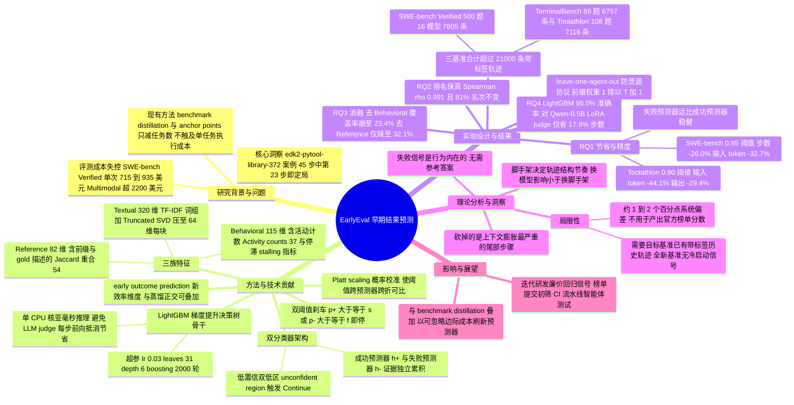

## 一、论文是干什么的？

想象你是一位马拉松裁判，要给两百名选手计成绩。传统做法是让每个人都跑完全程 42 公里，你在终点线一个个记录。但有些选手在第 5 公里就抽筋倒地、扶着膝盖走路，你其实已经能非常确定他不会在关门时间内完赛；另一些选手在第 30 公里已经甩开第二名十分钟，你也基本能确定他一定完赛。既然如此，为什么还要让所有人都把全程跑完，白白消耗补给站的水和你的时间？

这篇论文干的就是这件事，只不过「选手」换成了 LLM 智能体，「补给站的水」换成了真金白银的 API token 费用。今天评测一个智能体有多贵？论文引用 OpenHands Index 这个公开榜单给出了具体账单：用 OpenHands 这套外壳跑一遍 SWE-bench Verified 的 500 道题，Claude 5 要花约 715 美元、GPT-5.5 约 760 美元、Gemini 3.1 Pro 约 935 美元；换成 rollout 更长的 SWE-bench Multimodal，最贵的一个模型单次要超过 2200 美元。而在真实研发中，团队每改一次提示词、每换一次脚手架、每微调一版模型都要重跑一遍，一个开发周期里跑几十遍是常事——这就是摘要里那句「一次评测要花数百到数千美元，而且要反复付」的出处。

以前学界省钱的思路叫**基准蒸馏**（benchmark distillation）：从 500 道题里挑出 50 道有代表性的，用小题库估算大题库的成绩。这相当于「少考几道题」。EarlyEval 提出的是**正交的另一条省钱轴**：题目一道不少，但每道题不跑完——在智能体的行为已经明显预示成败的那一刻，直接按预测结果记分并掐断运行。作者管这个新问题叫 **early outcome prediction**（早期结果预测）。

论文里举了一个很具体的例子说明「结局确实能提前看出来」：在 tianocore/edk2-pytool-library 仓库一个真实 issue（编号 `tianocore__edk2-pytool-library-372`）上，一条公开的 OpenHands 轨迹总共跑了 45 步，最终成功修复。但实际上，智能体在第 20 步写好了复现脚本，在第 23 步做出了它对源码的**唯一一次修改**（把路径分隔符归一化，就一行），此后再没动过源码，只是在各个方向上反复测试。一个能看到标准答案的观察者在第 23 步就已经可以宣布「这题过了」——在那里停下来，能拿到一模一样的评测结论，却只花大约一半的钱。

## 二、核心方法与创新

### 2.1 整体流程：离线训裁判，在线边跑边判

EarlyEval 分两个阶段。

**阶段一（离线）**：拿一批历史轨迹来训练「裁判」。这些轨迹从哪来？作者的观察很务实——成熟的智能体基准通常自带一堆 baseline 运行记录，公开榜单上还会不断积累带标注的提交，所以「别的智能体在同一个基准上跑过什么、结果如何」是现成的公开资源。把每条完整轨迹按步数**切成一系列前缀**（长度 0、1、2、…、$T$），每个前缀都打上这条轨迹**最终**的成败标签，就得到了训练集。

**阶段二（在线）**：新智能体跑起来，每走一步就把「到目前为止的全部行为」抽成一个特征向量丢给裁判。裁判吐出两个置信度，任何一个越过预设阈值，立刻叫停并记下预测结果；都没越过，就放它继续跑。

### 2.2 什么是 LightGBM？为什么不用大模型当裁判？

这是全文最关键、也最容易被外行忽略的一个技术选择，值得单独说清楚。

**LightGBM 不是神经网络，更不是大语言模型。** 它是微软开源的一个**梯度提升决策树**（Gradient Boosting Decision Tree, GBDT）工具库。所谓决策树，就是一串「如果……那么……」的判断题：比如「这个智能体到现在编辑过源码没有？没有 → 往左走；有 → 那它跑过测试没有？……」，一路问下去到叶子节点，给出一个分数。单棵树很笨，但**梯度提升**的做法是：先种第一棵树，看它哪里判错了，再种第二棵树专门去纠正第一棵的错误，再种第三棵纠正前两棵的残余错误……几百上千棵树的分数加起来，就成了一个相当强的分类器。

这套东西在传统机器学习里已经是「表格数据之王」，Kaggle 上打结构化数据比赛几乎人手一个。它有三个特性正好被这篇论文吃干抹净：

1. **快到离谱**。论文原话是：树集成在**单个 CPU 核心上、远低于一毫秒**就能处理完一个几百维的特征向量（RQ4 里又说了一次「亚毫秒级 CPU 时间」）。这意味着智能体每走一步都重新打一次分，额外开销小到可以忽略不计。
2. **不挑特征**。树模型天然处理量纲不同、稀疏、含缺失值的混合特征，不需要归一化，也不怕你塞进去一堆没用的列。
3. **不需要 GPU**。整个「裁判」跑在 CPU 上。

对照组是什么？论文在 RQ4 里认真做了实验：拿一个用 LoRA 微调过的 **Qwen-0.5B** 直接读原始轨迹文本当裁判。结果是这个 LLM 裁判**在保真度上确实能打**（准确率 90.7%，指标扭曲仅 0.8 个百分点），但**在效率上输了一半**（只省 17.9% 的步数，LightGBM 是 26.0%）。而且论文点出了更要命的一条逻辑：**LLM 裁判每一步都要做一次模型前向传播，这笔推理开销会直接把早停省下来的算力抵消掉**。你为了省 API 费用，结果每步又搭进去一次模型调用——那不是白折腾了吗？

**这就是「几乎零额外开销」的关键**：省钱的工具本身必须便宜到不值一提，否则整个方案在经济上不成立。LightGBM 恰好是那个便宜到可以忽略的选择。

### 2.3 为什么要训「两个」分类器而不是一个？

EarlyEval 训的不是一个二分类器，而是**一对**：成功预测器 $h_+$ 和失败预测器 $h_-$。两者吃的是同一份特征向量，但训练目标相反——$h_+$ 学「哪些前缀最终会成功」，$h_-$ 学「哪些前缀最终会失败」。

这个设计有两层用意。第一，**成功和失败在行为上的信号是不对称的**：反复对同一处代码做同样的修改、错误信息一字不变，这是失败的强信号；而恰好碰到了标准答案里那行代码，这是成功的强信号——两类证据的形态完全不同，让它们各自独立累积更合理。第二，也是更巧妙的一点：两个分类器同时给出低概率时，就自然形成了一个「**说不准区**」——这时候系统什么都不做，放智能体接着跑。单个分类器做不到这件事，因为它的输出只有一个数，低概率必然意味着高概率的反面。

实验结果印证了这个设计：在几乎每个操作点上，**双分类器的步数节省恰好等于两个单分类器各自节省之和**（比如 SWE-bench Verified 在 0.95 阈值下，10.6% 加 15.4% 正好等于 26.0%）。既然轨迹一旦触发就会停，这种可加性说明两个分类器**几乎从不在同一条轨迹上同时开火**——正面证据和负面证据基本不会在一次运行里同时出现。

### 2.4 裁判看什么？三大类特征

论文的 Table II 把特征分成三个家族，加起来是一个五百多维的向量：

| 家族 | 特征组 | 维数 | 大白话说的是什么 |
|---|---|---|---|
| Behavioral 行为 | Activity counts 活动计数 | 37 | 到目前为止走了几步、调了几次工具、看了几次文件、改了几次代码、跑了几次测试、提交了没有 |
| | Last step 最近一步 | 11 | 刚才那一步是什么类型的动作、有没有输出、环境反馈里有没有报错或 traceback |
| | Event timing 事件时序 | 18 | 第一次编辑发生在第几步、距离上次报错过了几步、某类事件到底发生过没有 |
| | Working pattern 工作节奏 | 32 | 读几次改一次、改几次测一次、有没有在原地打转（重复动作、重复搜索）、有没有连续很多步不改代码、有没有没测就交卷 |
| | Error & test status 错误与测试 | 17 | 见过哪些错误类型（assertion、type、syntax、import、timeout 等）、测试通过没有、失败数量是不是在往下降 |
| Textual 文本 | Task prompt 任务描述 | 64 | 题面文字的 TF-IDF 表示经 SVD 压缩后的向量 |
| | Action text 动作文本 | 128 | 全部动作历史 + 最近一次动作 |
| | Feedback text 反馈文本 | 128 | 全部环境反馈 + 最近一次反馈 |
| Reference 参考解 | Gold descriptors 标准答案属性 | 28 | 标准补丁有多大（字符数、行数、hunk 数）、改了几个文件、fail-to-pass 与 pass-to-pass 测试各几个、仓库与难度 |
| | Prefix-gold overlap 前缀与标准解重叠 | 54 | 智能体碰过的文件、API 符号、测试名，和标准答案里的那些有多大 Jaccard 重叠——也就是「离正确答案还有多远」 |

文本这一块的处理值得一提：作者没有用任何神经网络 embedding，而是老老实实用 **TF-IDF**（词频-逆文档频率，一种统计词汇重要性的经典方法，这里用一元和二元词组、最小文档频率 5、词表上限 30000）把文本变成稀疏向量，再用 **Truncated SVD**（截断奇异值分解）压到 64 维。为什么不合并成一个大块？因为分开向量化能**保住语义边界**——题面、动作、反馈是三种性质完全不同的文字。压到低维则是为了让每步推理保持廉价，和整体设计哲学一致。

**特征里最狠的一招是 Reference 家族**：既然是在跑基准，标准答案本来就在评测方手里（SWE-bench Verified 每题都带 gold patch），那就直接拿来比对。这就把第一节里那个「能看到标准答案的观察者」直觉给工程化了。不过 TerminalBench 和 Toolathlon 不公开每题的参考解，所以在这两个基准上这一整族特征被**整体关掉**，只靠行为和文本特征——而实验证明这样也照样能用（见 RQ3）。

### 2.5 概率校准与双阈值刹车

树集成有个老毛病：**输出的分数不是真正的概率**，尤其在做了正则化和样本加权之后，尺度会被扭曲。0.9 分未必真的代表 90% 的把握。EarlyEval 因此加了一步 **Platt scaling**（普拉特缩放）——用一个一维逻辑回归把原始分数 $\hat{s}$ 映射成校准后的概率：

$$p = \sigma\big(a\,\mathrm{logit}(\hat{s}) + b\big)$$

其中 $a$ 和 $b$ 在留出的验证集上拟合。因为这个变换是**单调**的，它不会改变样本排序、也不改变 AUC，唯一作用就是让「0.95」在两个分类器之间、在不同交叉验证折之间，都代表同一个含义的把握程度。这一步对整个方案至关重要，否则阈值就是个没有可比性的魔法数字。

校准完的 $p_+$ 和 $p_-$ 分别与成功阈值 $s$、失败阈值 $f$ 比较，**第一次**出现 $p_+ \geq s$ 或 $p_- \geq f$ 的那一步就刹车。极罕见地两个阈值在同一步同时越线时，按时间上更早的那次为准。阈值就是那个可调旋钮：**调高 = 更准但省得少，调低 = 省得多但失真大**。

### 2.6 防泄漏：留一智能体交叉验证

这套方法有个显而易见的质疑：你拿别的智能体的轨迹训出来的裁判，去判一个从没见过的新智能体，靠谱吗？作者用了相当严格的协议来回答：

- **leave-one-agent-out**：每次留一个智能体作为测试对象，裁判只用**其余全部**智能体的轨迹训练。
- 训练/验证的划分**按任务切分**，同一条轨迹产生的所有前缀严格待在同一侧，杜绝前缀之间互相泄漏。
- 长度不足 10 步的轨迹整条丢弃，因为信号太少。
- 每个前缀样本按 $1/(T+1)$ 加权，保证**长轨迹不会因为前缀多就主导损失函数**——每条轨迹对目标函数的总贡献相等。
- TerminalBench 的轨迹是异质的（同一个模型可能出现在不同脚手架里），所以额外做了两套更严的切分：**训练集里不许出现同一个模型**，以及**训练集里不许出现同一个脚手架**。

## 三、使用了哪些模型和计算资源？

### 3.1 被评测的智能体：脚手架 + 基座模型的组合

论文里「一个智能体」的定义是：**一套提示词或脚手架（scaffold/harness）搭配一个基座 LLM**。三个基准合计收集了**超过 21000 条**带真实成败标签的轨迹。

| 基准 | 任务数 | 脚手架 | 基座模型 | 轨迹数 | 有无参考解 |
|---|---|---|---|---|---|
| SWE-bench Verified | 500 道（12 个 Python 仓库） | 单一脚手架 mini-SWE-agent | 16 个基座 LLM，覆盖 Claude、GPT-5、Gemini、GLM、DeepSeek、Devstral、Kimi、MiniMax 各家族 | 7805 | 有 gold patch |
| TerminalBench | 89 道命令行自动化任务 | mini-SWE-agent、Codex、Claude Code、Gemini CLI、OpenHands、Terminus-2 | GPT-5、GPT-5-mini、Claude-Haiku-4.5、Claude-Opus-4.5、Gemini-2.5-Pro | 6757（37 种智能体配置，每题多次 rollout） | 无 |
| Toolathlon | 108 道 API 与工具调用任务 | Toolathlon 原生脚手架 | 22 个基座 LLM | 7116（每题 3 次 rollout） | 无 |

**具体带版本号出现在正文表格里的模型**（Table IV 的各基准 top-3 榜单）：

- SWE-bench Verified：**Gemini-3-Pro**、**GPT-5.2-High**、**Claude-Sonnet-4.5**
- TerminalBench：**Terminus-2 + Claude-Opus-4.5**、**Claude-Code + Claude-Opus-4.5**、**OpenHands + Claude-Opus-4.5**
- Toolathlon：**Claude-Opus-4.5**、**Claude-Sonnet-4.5**、**Gemini-3-Pro**

需要说明：SWE-bench Verified 那 16 个基座模型、Toolathlon 那 22 个基座模型的**完整逐一名单与版本号，论文正文没有列出**，只给了家族名和 top-3。此外 Table I 的成本表里出现了 **Claude 5**、**GPT-5.5**、**Gemini 3.1 Pro** 三个模型，但那是引用 OpenHands Index 的价格数据，不是本文自己跑的评测对象。

### 3.2 EarlyEval 自己用的模型：一个 LLM 都没有

这是本文最反直觉的一点。**EarlyEval 的预测器完全不含大模型**，技术栈是：

- **LightGBM** 两个梯度提升树集成（成功预测器 + 失败预测器）
- **scikit-learn** 提供 TF-IDF 向量化、Truncated SVD 降维、以及 Platt 校准用的一维逻辑回归
- 整个实现用 Python 写成

**LightGBM 超参数**（论文明确给出，两个预测器共用一套，只在验证集上调过一次，全部基准通用）：学习率 0.03，31 个叶子，最大深度 6，最小子样本数 200，行采样 0.75、列采样 0.70，L1 正则 0.5、L2 正则 10.0，最多 2000 轮 boosting，连续 50 轮验证集无提升则早停。每折内留 15% 的训练轨迹做验证。随机种子固定为 42。

**RQ4 里作为对照跑过的其他架构**（不是 EarlyEval 本身）：Direct MLP（多层感知机）、Linear dense LR（在稠密特征上的逻辑回归）、Linear TF-IDF LR（在 SVD 之前的原始 TF-IDF 上做逻辑回归）、以及唯一一个真·LLM——**用 LoRA 微调的 Qwen-0.5B 裁判模型**，它直接读原始轨迹文本。

### 3.3 计算资源

**GPU：论文正文完全未披露型号与卡数。** 事实上按照论文的技术路线，EarlyEval 主体**根本不需要 GPU**——它明确宣称树集成在**单个 CPU 核心**上就能亚毫秒级完成一次打分。唯一可能用到 GPU 的是 RQ4 里那个 LoRA 微调的 Qwen-0.5B 对照基线，但论文没有交代它的训练硬件。

**API 与费用：** 本文自己**没有重新跑基准**，所有轨迹都来自公开来源（基准自带的 baseline 运行、公开榜单积累的带标注提交），所以论文没有报告自己花了多少 API 费用。论文给出的费用数字全部来自引用的 **OpenHands Index** 公开榜单（2026 年 6 月检索），用 OpenHands 智能体跑一遍的单次全量费用如下：

| 基准 | 任务数 | Claude 5 | GPT-5.5 | Gemini 3.1 Pro |
|---|---|---|---|---|
| SWE-bench Verified | 500 | 715 美元 | 760 美元 | 935 美元 |
| SWT-bench | 500 | 735 美元 | 460 美元 | 810 美元 |
| Commit0 | 54 | 674 美元 | 300 美元 | 64 美元 |
| GAIA | 165 | 1305 美元 | 122 美元 | 297 美元 |
| SWE-bench Multimodal | 517 | 2270 美元 | 1453 美元 | 641 美元 |

这就是摘要那句「数百到数千美元」的**确切出处**：Section II-A 的 Table I。论文的具体表述是——SWE-bench Verified 已经算是单题较便宜的基准了，一遍也要几百美元；rollout 更长的 SWE-bench Multimodal 单次跑进了千元量级，最贵的模型**超过 2200 美元**，三个模型里有两个**超过 1000 美元**。而这些全都只是「一个智能体配置跑一次」的价钱。

### 3.4 耗时

这一节必须诚实：**论文对时间的披露非常少**。

| 项目 | 论文给出的数值 |
|---|---|
| EarlyEval 每步推理开销 | 单 CPU 核心上**远低于 1 毫秒**（RQ4 中复述为「亚毫秒级 CPU 时间」）；论文称之为「可忽略的每步开销」 |
| 训练一对 LightGBM 分类器的墙钟耗时 | **暂无相关信息**（只给了「最多 2000 轮 boosting、50 轮无提升则早停」这样的训练配置，没有折算成时间） |
| 跑完一遍完整基准需要多久 | **暂无相关信息**（论文只报告费用与步数/token，不报告墙钟时间） |
| 预测器随基准积累新轨迹的刷新成本 | 论文定性表述为「**边际成本可忽略**」（negligible marginal cost），未给具体数字 |

论文衡量「省了多少」用的全部是**代理指标**：$\Delta$Steps（执行步数相对变化）、$\Delta$Token 的输入与输出两项。作者在 Threats to Validity 里也主动承认，token 账单与步数并非线性关系（因为上下文窗口会累积膨胀），但实证数据显示**输入 token 的节省系统性地高于步数节省**，这反而说明框架砍掉的正是轨迹尾部那些最臃肿、最烧钱的步骤。

## 四、实验结果

### 4.1 RQ1：省了多少，准不准

作者在 0.75 到 0.97 之间扫描阈值，为每个基准挑一个「推荐操作点」——规则是：**在保证双分类器绝对偏差 $\Delta|\text{Pass@1}|$ 不超过大约 2 个百分点的前提下，取最激进（最低）的那个阈值**。

各基准在推荐操作点上的成绩：

| 基准（阈值） | 覆盖率 | 步数变化 | 输入 token | 输出 token | 解决率偏差 |
|---|---|---|---|---|---|
| SWE-bench Verified（0.95） | 34.8% | -26.0% | -32.7% | -28.7% | 1.1 个百分点 |
| TerminalBench 无同模型（0.90） | — | -25.4% | -42.7% | -27.9% | 2.1 个百分点 |
| TerminalBench 无同脚手架（0.85） | — | -17.7% | -29.2% | -17.4% | 2.0 个百分点 |
| Toolathlon（0.90） | — | -23.0% | -44.1% | -29.4% | 0.9 个百分点 |

RQ1 的官方结论是：**砍掉 29.2% 到 44.1% 的输入 token、17.4% 到 29.4% 的输出 token，同时把解决率的绝对偏差控制在 2.1 个百分点以内。** 摘要里那个「最多 44.1% 输入 token、29.4% 输出 token」就出自 Toolathlon 这一行。

大白话：**输入 token 省得比步数还多**，因为智能体越跑到后面，上下文窗口越长，每一步要重新塞进去的历史越多——砍掉尾巴省下的是复利。

**阈值旋钮有多灵？** 以 SWE-bench Verified 为例，把阈值从 0.95 调到 0.75：

| 阈值 | 双分类器步数节省 | 输入 token | 输出 token | 解决率偏差 |
|---|---|---|---|---|
| 0.75 | -63.4% | -81.5% | -69.7% | 4.1 个百分点 |
| 0.80 | -58.6% | -75.7% | -64.2% | 3.5 个百分点 |
| 0.85 | -51.8% | -67.6% | -56.8% | 2.9 个百分点 |
| 0.90 | -42.7% | -54.8% | -46.9% | 2.3 个百分点 |
| 0.95 | -26.0% | -32.7% | -28.7% | 1.1 个百分点 |
| 0.97 | -16.6% | -22.0% | -18.0% | 0.6 个百分点 |

这是一条非常干净的单调曲线：**想省八成的输入 token 也不是不行，代价是成绩偏 4 个百分点。** 实践中可以按预算自由取舍。

**一个重要的不对称发现：失败预测器远比成功预测器可靠。**

- 成功预测器只在 SWE-bench Verified 上靠谱，精度稳定在 88.3% 到 93.9%；在 TerminalBench 无同脚手架切分上掉到 61.4% 到 69.0%；在 Toolathlon 上更是几乎完全不开火（覆盖率趋近于零，高阈值下那几列干脆是空的）。
- 失败预测器则处处稳健：SWE-bench 上在推荐操作点达到 96.7%（阈值放到 0.97 时可到 98.3%），TerminalBench 上 89.4% 到 96.6%，Toolathlon 上 96.6% 到 99.4%。

原因不难理解：**判定「这个智能体已经陷进去了」比判定「它已经做对了」容易得多**。前者只需要看到打转、重复报错这些通用模式；后者往往需要看到标准答案——而只有 SWE-bench Verified 提供了标准答案。所以 RQ2 里，TerminalBench 和 Toolathlon 干脆**只用失败预测器**排榜。

**还有一个关于脚手架的洞察**：把测试智能体的**脚手架**从训练集里剔掉，比把它的**基座模型**剔掉伤害更大——成功预测器的峰值精度从 82.7% 掉到 69.0%，可达到的步数节省从 25.4% 缩到 17.7%。作者的解释很有说服力：**脚手架决定了轨迹的结构性节奏**（动作、环境反馈、里程碑是怎么排布的），换一个没见过的脚手架，行为特征的骨架就变了；而换一个没见过的模型，骨架基本还在。

### 4.2 RQ2：榜单排名会不会被搞乱

这是所有评测加速方法的终极考题——省钱可以，但如果排名变了，这个评测就废了。

| 基准 | 智能体数 | Spearman 相关系数 | 排名完全不变的比例 |
|---|---|---|---|
| SWE-bench Verified（0.95） | 16 | 0.991 | 81% |
| TerminalBench 无同模型（0.90） | 37 | 0.959 | 59% |
| TerminalBench 无同脚手架（0.85） | 37 | 0.994 | 70% |
| Toolathlon（0.90） | 22 | 0.994 | 70% |

在 SWE-bench Verified 上，16 个智能体里只有**三个相邻名次的智能体各挪动了一位**。最难的那一档（TerminalBench 不许训练集里有同款模型、37 个异质的脚手架加模型组合）也做到了 0.959。

从 Table IV 的 top-3 可以看到个体扰动确实很小：SWE-bench 上 Gemini-3-Pro 的 Pass@1 偏了 -1.4、GPT-5.2-High 偏了 -0.4、Claude-Sonnet-4.5 偏了 -0.2，三个都排名不变；Toolathlon 上 Claude-Opus-4.5 偏 -1.9、Claude-Sonnet-4.5 偏 -2.2、Gemini-3-Pro 偏 -1.2，也都排名不变。

### 4.3 RQ3：拿掉某类特征会怎样

在 SWE-bench Verified 上做特征消融（全特征基线：覆盖率 34.8%、准确率 95.0%、步数节省 26.0%、偏差 1.1）：

| 去掉的特征 | 覆盖率 | 准确率 | 步数节省 | 偏差 |
|---|---|---|---|---|
| 全特征 | 34.8% | 95.0% | -26.0% | 1.1% |
| 去掉 Behavioral 全族 | 23.4% | 94.7% | -16.4% | 0.8% |
| 去掉 Textual 全族 | 35.9% | 94.5% | -26.5% | 1.2% |
| 去掉 Reference 全族 | 32.1% | 93.9% | -24.7% | 1.2% |
| 去掉任一行为子组 | 34.5% 到 35.3% | 94.5% 到 95.1% | 约 -26% | 约 1.2% |
| 去掉任一文本子组 | 34.8% 到 35.3% | 94.5% 到 95.5% | 约 -26% | 约 1.1% |
| 去掉任一参考解子组 | 33.5% 到 34.1% | 94.1% 到 94.8% | 约 -26% | 1.2% 到 1.3% |

结论有三条，都很重要：

1. **行为特征才是真正的主力。** 整族拿掉，覆盖率从 34.8% 崩到 23.4%，步数节省从 26.0% 掉到 16.4%——是所有配置里退化最狠的。这印证了论文引言里的说法：EarlyEval 主要靠的是**不需要参考答案的行为信号**。
2. **参考解特征其实是锦上添花。** 整族拿掉，覆盖率只降到 32.1%、节省只降到 24.7%。这直接解释了为什么它在完全没有参考解的 TerminalBench 和 Toolathlon 上照样能跑。
3. **信号在族内是冗余分布的。** 拿掉任何**单个**子组，覆盖率变化都不超过 0.5 个百分点（参考解子组最多 1.3）。也就是说，重要性不是集中在某几个魔法特征上，而是**摊在一大堆彼此重复的信号里**——这正是它换个基准也能用的原因。

### 4.4 RQ4：为什么非得是 LightGBM

在 SWE-bench Verified 上、统一用 0.95 阈值、同样的留一智能体协议，替换预测器骨干：

| 骨干架构 | 覆盖率 | 准确率 | 步数节省 | 偏差 |
|---|---|---|---|---|
| **LightGBM（本文）** | 34.8% | 95.0% | -26.0% | 1.1 |
| Direct MLP | 26.9% | 87.9% | -20.0% | 3.3 |
| Linear（稠密特征逻辑回归） | 9.7% | 43.8% | -7.7% | 5.5 |
| Linear（TF-IDF 逻辑回归） | 2.4% | 79.5% | -2.0% | 0.3 |
| Local LLM judge（Qwen LoRA） | 18.7% | 90.7% | -17.9% | 0.8 |

逐条看：

- **LightGBM 在四个维度上同时最优**（除了偏差略高于两个几乎不干活的基线），定义了准确率与效率的帕累托前沿。
- **MLP 被全面压制**：覆盖率、准确率、节省都更差，偏差反而涨到 3.3。神经网络在这种几百维混合表格特征上打不过树。
- **稠密逻辑回归直接崩了**：准确率只有 43.8%（比瞎猜还差），偏差 5.5，说明线性决策边界完全切不开这个非线性问题。
- **TF-IDF 逻辑回归的 0.3 偏差是假象**：它只在 2.4% 的轨迹上开火，几乎从不干预，所以当然扭曲不了指标——论文毫不客气地称之为「被动性的平凡后果」。
- **Qwen LoRA 裁判是唯一有竞争力的对手**，但它的低偏差（0.8）同样有覆盖率只有 18.7% 的水分，而且步数节省只有 LightGBM 的一半多一点。最致命的还是那条经济学逻辑：**每一步都要一次模型前向传播，运行时开销直接抵消早停省下的算力**。

## 五、潜在应用与已落地应用

**已落地部分：**

- 代码与实验数据开源在 [inphotoo/earlyeval](https://github.com/inphotoo/earlyeval)。截至本综述撰写时该仓库为 **Python 语言、5 star、1 fork**，创建于 2026 年 6 月 23 日，最近一次推送为 2026 年 9 月 4 日（即论文上线后仍在更新）。这是一个刚开源、尚未获得广泛关注的新仓库。
- 论文自己就是最直接的应用案例：三个基准、超过 21000 条轨迹的全部实验，都是**用公开可得的历史轨迹重放完成的**，没有重新烧一次 API 费用。

**潜在方向：**

1. **智能体研发的日常回归测试。** 这是作者在 Discussion 里明确点名的**主战场**：一个团队反复迭代同一个智能体、主要关心的是「这次改动是变好了还是变差了」这种**相对比较**，而不是精确到小数点的解决率。在这个场景里，用两三成的成本换一个 1 到 2 个百分点偏差的信号，是极划算的买卖。
2. **榜单维护方的初筛。** 面对大量提交，可以先用 EarlyEval 快速过一遍排出大致序位，只对头部或有争议的条目做全量复跑。
3. **CI 里的智能体测试。** 亚毫秒级的 CPU 开销意味着这套东西可以塞进持续集成流水线，不需要额外的 GPU 预算。
4. **和基准蒸馏叠加使用。** 论文反复强调这两条省钱轴是**正交的、互补的而非替代关系**：蒸馏减少题目数量，EarlyEval 减少每题的执行长度，理论上可以相乘。

**作者主动划定的适用边界（相当克制，值得表扬）：**

- **它需要历史轨迹。** 目标基准上必须已经积累了一批带标签的完整轨迹才能训裁判。对**全新发布、一次运行记录都没有的基准**，这套方法无从下手。作者的判断是：主流成熟基准都自带 baseline 运行、榜单也在持续积累提交，所以这个前提在实践中成立；而且随着运行越攒越多，预测器可以以「可忽略的边际成本」持续刷新。
- **它不是用来出官方成绩的。** 论文写得非常明确：因为早停会引入约 1 到 2 个百分点的**系统性偏差**，**最终的榜单条目和对外宣称的头条数字仍然应该跑完整流程得到**。EarlyEval 的定位是研发过程中那个便宜、高保真的中间信号，而不是可引用的权威分数。

## 六、网络上的讨论与评价

**HuggingFace 页面：** 该论文在 [HuggingFace papers](https://huggingface.co/papers/2609.02783) 上于 2026 年 9 月 3 日由一作 Yuling Shi 本人（HF 显示名 Yuling，账号 handle 为 YerbaPage）提交，**upvote 数为 113**（截至 2026-09-04 实际抓取值），是当期热度相当高的一篇。讨论区有三条评论：

1. 论文作者本人（即上述提交者）的一句宣传语：「Your agent evaluation can be cheaper!」，收到了 2 个 👀 和 2 个 🤗 表情反应。
2. 账号 **tjjune123** 发的一条推广 AI 播客站点的评论，属于批量投放的垃圾信息，与论文内容无关。
3. **librarian-bot** 的自动相似论文推荐，列出了七篇同期相关工作：DeepSWE、**Efficient SWE Agent Benchmarking via Trajectory-Aware Evaluation**、Long-Horizon-Terminal-Bench、Cost-Effective Repository Exploration for Agentic Issue Localization、AutoSaddler、Evo-Bench、ClawTrack。其中第二篇（轨迹感知的高效 SWE 智能体基准测试）和本文的问题设定高度重合，说明「让智能体评测便宜下来」在 2026 年已经是一个有多组人马在做的方向。

值得注意的是，**页面上没有任何来自第三方研究者的实质性技术讨论或质疑**——高票数与零深度讨论并存，说明它更多是靠「省钱」这个人人都懂的痛点获得的关注。

**中文报道：** [HyperAI 超神经](https://hyper.ai/cn/papers/2609.02783) 收录了本文并做了完整的中文摘要与逐节解读，标题译作「EarlyEval：通过早期结果预测降低智能体评估成本」，一句话总结准确点出了四家参与机构（上海交通大学、新加坡管理大学、华东师范大学、上海创新研究院）。**未检索到机器之心、量子位、知乎等平台的专门长文报道。**

**其他收录平台：** [alphaXiv](https://www.alphaxiv.org/abs/2609.02783) 有该论文的页面（含自动生成的 AI 综述），保存数为 13。

**未找到的：** 截至本综述撰写时，**未检索到 Hacker News、Reddit r/MachineLearning、或 X（推特）上关于本文的专门讨论帖**。多次以论文名、arXiv 编号、以及「LightGBM + 智能体评测 + 早停」等组合关键词检索，返回的都只是 arXiv、HuggingFace、HyperAI、alphaXiv 这几个收录页本身，没有独立的社区评论。考虑到论文上线仅两天，这也在情理之中。

**本综述作者的一点观察（不属于原文内容）：** 这篇论文最值得称道的其实不是那些百分比，而是它**敢于用一个 2017 年的老工具去解 2026 年的新问题**，并且在 RQ4 里把「为什么不用大模型」这个必然会被问到的问题正面怼了一遍——LLM 裁判确实更聪明，但**在一个以省算力为目的的系统里，裁判本身的算力开销就是原罪**。这个论证逻辑比任何 SOTA 数字都更有说服力。

## 七、思维导图

