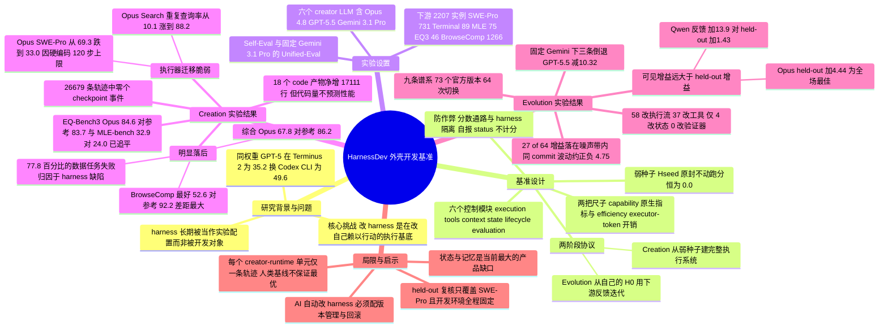

## 一、论文是干什么的？

想象你请了一位极其聪明的厨师，但他能做出什么菜，很大程度上不取决于他的厨艺，而取决于你给他配了什么样的厨房：有没有趁手的刀、有没有计时器、有没有人在旁边帮他记住「这锅汤已经熬了二十分钟」、汤咸了有没有补救流程。同一位厨师，放进苍蝇馆子的后厨和放进米其林后厨，端出来的东西可以天差地别。

大语言模型现在就处在这个处境。模型权重之外那一层软件——负责跑执行循环、调工具、管上下文、失败重试、验证结果的代码——业内叫它**智能体外壳**（agent harness）。论文开篇给了一个很扎心的数据：**权重完全一样**的 GPT-5，装在 Terminus 2 这个外壳里只能解出 Terminal-Bench 2.1 的 35.2%，换成 Codex CLI 就能到 49.6%。厨师没换，厨房换了，成绩差了 14 个百分点。

问题在于，今天几乎所有的智能体评测都是「先把厨房搭好、然后考厨师」，厨房本身被当成实验配置的一部分，而不是被考核的对象。可现实里，把一个通用模型变成真正能在客户环境里跑起来的系统，恰恰是最耗人力的那部分工作——论文用了一个很贴切的行业类比：**前置部署工程师**（forward-deployed engineer, FDE），这个由 Palantir 带火、如今被各家前沿模型公司大量招聘的岗位，干的就是「把模型改造成客户那边真能用的系统，并且长期维护它」。

于是 ByteDance Seed 等机构提出了 HarnessDev：**把评测的单位从「任务输出」换成「可运行的基础设施」**。它不问模型能不能答对一道题，而问模型能不能造出一套能反复用、能被检查、能被继续改进的执行系统。这是该团队 Self-Developing Agents 三件套研究之一（另两个是研究「该改进什么」的 Aspire 和研究「能否从经验中学习」的 S³Gym），项目主页见 [self-developing-agents.github.io](https://self-developing-agents.github.io/)。

## 二、核心方法与创新

### 2.1 两个阶段：Creation 与 Evolution

HarnessDev 把「开发外壳」这件事拆成软件工程意义上的两半：

| 阶段 | 从哪里出发 | 开发信号 | 产出 |
|---|---|---|---|
| **Creation**（创建） | 一个刻意做得很弱的种子外壳 $H_{\mathrm{seed}}$ | 任务规格说明加 1 到 3 个开发用例 | 冻结后的最终外壳 $H$ |
| **Evolution**（进化） | 该模型自己在 Creation 阶段造出的 $H_0$ | 指定反馈集上的下游执行结果 | 成对冻结的候选版本加由模型自己声明的最终版 |

形式化地说，creator 大模型 $L_C$ 在开发环境 $D$ 里造出外壳 $H$；$H$ 随后被**冻结**；再由一个 executor 大模型 $L_E$ 在这个壳里跑下游任务 $x$，产出 $y$，最后由评判器 $J$ 打分：

$$
(L_C, D) \rightarrow H, \qquad (H, L_E, x) \rightarrow y \xrightarrow{J} \mathrm{score}.
$$

这个「造壳的模型」和「用壳的模型」分离的设计是全篇的关键——它让你能分清楚：成绩好到底是因为壳设计得好，还是因为跑它的模型本来就强。

### 2.2 那个刻意做得很弱的种子

如果给模型一个空仓库，考的就变成了命令行和文件格式的杂活；如果给一个成熟框架，规划和验证的结构等于直接送给它。所以作者做了个折中的**弱种子**：它是一层「能跑起来的兼容层，而不是一个会解题的智能体」。

种子会解析任务和模型配置、暴露允许使用的低层工具、写出规定格式的结果与日志。但它**没有**智能体循环、没有任务分解、没有工具策略、没有上下文管理、没有持久状态、没有验证器、没有重试恢复、没有停止规则。它最多发一次连通性探针，但绝不尝试解题。原封不动地跑，它在**每一个下游基准上都是 0.0 分**。

这一点非常聪明：**任何非零的 Creation 分数，都必然来自 creator 自己加进去的执行逻辑。**

creator 必须补齐的是六个控制模块，论文在附录 C 里给了明确的接口规格：

```
execution.py  — run(task) -> Result;  step(state, observation) -> Action
tools.py      — register(toolspec);   call(name, params) -> Observation
context.py    — build(task, history, state) -> Prompt;  compress(messages)
state.py      — save(checkpoint);  load(id) -> State;  resume() -> State
lifecycle.py  — beforeAction / afterAction / onFailure / onTimeout
evaluation.py — evaluate(result, criteria) -> Score;  recordTrajectory(step)
```

### 2.3 两把尺子：能力与效率

评一个「生成出来的外壳」比评一个「生成出来的答案」难得多——壳可能过拟合到写它的那个模型、可能背下了开发用例、可能改好了一处却悄悄弄坏了另一处。所以作者用两个正交的轴来量：

- **能力**（capability）：把冻结的壳拿到 held-out 下游任务上跑，报各基准的原生指标。
- **效率**（efficiency）：这个冻结的壳在部署时**烧掉多少 executor 模型的 token**。注意，creator 造壳、改壳花掉的 token 是**不计入**的，只算部署后的执行开销。

同时设两种执行设置：**Self-Eval** 让 $L_E = L_C$（谁造的壳谁自己用，这是用户真实部署的场景，测的是模型与外壳的协同设计）；**Unified-Eval** 让所有壳都用同一个固定的 executor（Gemini 3.1 Pro），把 executor 能力差异剥掉，测的是这个壳是不是一份可迁移的软件资产。

### 2.4 防作弊：分数通路与外壳隔离

作者明确列了禁止事项：硬编码实例专属解、从任务 ID 或文件名白名单推补丁、偷看隐藏测试与答案、绕开中立的运行时接口自己接 LLM。两个设计让这些约束可查而不只是口头约定：

1. **打分通路与外壳隔离**：外壳自报的 status 永远不作为打分输入；SWE-Pro 只认任务工作目录里真实留下的 repo diff，Terminal-Bench 只认最终环境状态。**没有任何外壳能靠宣称自己成功来拿分。**
2. **全程留痕**：每次运行都保留轨迹、结果、指标产物和冻结的外壳源码，支持事后审计。

作者审计了本文报告的每一次运行，给出的是一个 null result：没有任何外壳通过违规路径拿分，也没有任何一次运行因此被剔除。

### 2.5 Evolution 阶段的赛制

进化阶段目前只聚焦 code 外壳。creator 从自己的 $H_0$ 出发，能看到的反馈是固定的 100 道 SWE-Pro 题和全部 89 道 Terminal-Bench 题。规则相当严格：

- 每个候选版本必须**同时**跑完 100 题 SWE-Pro 和 89 题 Terminal-Bench，两条腿都落地才算一次官方版本。
- 控制器给的预算是 $H_0$ 之后**10 次完整评测对**。两次正式评测之间，最多做 2 次固定子集探针（各取两个基准的前 5 道题），探针结果只作诊断，永不计入官方分。
- creator 最后自己声明一个非 $H_0$ 的最终版本。
- **泛化能力是冻结之后才另测的**：每个官方版本还会在 630 道与反馈集不相交的 SWE-Pro 实例上跑一遍，这个分数**从头到尾不给 creator 看**，所以「对可见反馈的适应」和「对未见任务的泛化」被彻底分开报告。

## 三、使用了哪些模型和计算资源？

### 3.1 六个 creator LLM（造壳的模型）

论文评测的六个 creator $L_C$ 及其开发环境配置（附录表 8）如下，模型均通过**官方 API 或 OpenRouter** 调用：

| Creator LLM | 开发环境 $D$ | Temperature | Top-p | Top-k | 最大输出 token |
|---|---|---|---|---|---|
| **Opus 4.8**（Anthropic） | Claude Code 2.1.177 | 1.0 | default | default | 128,000（实测端点上限） |
| **GPT-5.5**（OpenAI） | Codex 0.144.3 | default | default | — | 128,000 |
| **Gemini 3.1 Pro**（Google） | Claude Code 2.1.177 | 1.0 | 0.95 | 64 | 65,100 |
| **DeepSeek V4 Pro** | Claude Code 2.1.177 | 1.0 | 0.95 | — | 131,072 |
| **Qwen 3.7 Max**（Alibaba） | Claude Code 2.1.177 | 0.6 | 0.95 | 20 | 65,536 |
| **Seed 2.0 Pro**（ByteDance Seed） | Claude Code 2.1.177 | 1.0 | 0.70 | — | 131,072 |

注意一个细节：**除 GPT-5.5 用 Codex 0.144.3 外，其余五个都统一用 Claude Code 2.1.177 作为开发环境**，这是为了尽量控制「造壳时手上的工具」这一变量。

### 3.2 下游 worker（用壳的模型）

- **Self-Eval**：$L_E = L_C$，即谁造的壳就由谁自己执行下游任务。
- **Unified-Eval 与固定执行器消融**：所有壳统一由 **Gemini 3.1 Pro** 执行。
- **RQ1 每个 creator 与基准的组合独立造 3 个壳，报 avg@3。**

人类工程参考系统（附录表 9）用的是各基准官方榜单或系统报告里可核实的最高公开成绩，是「人类外壳加该系统所用执行模型」的组合，不是同一 executor 下的配对对照：

| 基准 | 人类工程外壳 | 配对执行模型 |
|---|---|---|
| SWE-Pro | Public coding-agent setup | Claude Fable 5 |
| Terminal-Bench 2.1 | OpenAI agent setup | GPT-5.6 Sol |
| MLE-bench | MLEvolve | Gemini 3.1 |
| EQ-Bench3 | Kimi Writer | Opus 4.8 |
| BrowseComp | OpenAI browsing stack | GPT-5.6 Sol |

其中 SWE-Pro 的 80.0、Terminal-Bench 2.1 的 88.8、BrowseComp 的 92.2 三个带星号的值是外部报告（取自 OpenAI 官方 GPT-5.6 发布报告），作者没有本地复跑。

### 3.3 硬件与容器资源

论文里唯一明确给出 GPU 型号的是数据分析（MLE-bench）的下游执行环境（附录 B.1）：

> 每道任务在**隔离容器**中执行，配 **1 张 NVIDIA A800-SXM4-80GB GPU（80 GB 显存）、14 vCPU、227 GiB 内存**。

其余三个领域（code、writing、search）的下游执行以调用 API 的 token 消耗为主，论文**未披露 GPU 卡数或集群规模**。creator 造壳阶段本身是纯 API 调用，不涉及权重训练——这不是一篇训练模型的论文。

### 3.4 每个完整计算单位的耗时

论文给出的是**墙钟时限**和**步数上限**，而不是实际平均耗时：

| 计算单位 | 时限或耗时 | 出处 |
|---|---|---|
| MLE-bench 单任务总墙钟 | **36,000 秒（10 小时）** | 附录 B.1 |
| 其中给生成外壳的预算 | 34,200 秒（9.5 小时） | 附录 B.1 |
| 其中给固定评分器的保留时间 | 1,800 秒（30 分钟） | 附录 B.1 |
| MLE-bench 单任务步数上限 | 500 步 | 附录 B.1 |
| RQ2 code 基准单任务 | 7,200 秒（2 小时），同样 500 步上限 | 附录 B.1 与附录 E |
| **RQ2 一次完整评测端到端** | 全部任务并行执行，**通常约 1 到 2 小时** | 附录 E 进化契约原文 |
| 数据集下载与准备 | 在任务计时开始前完成，不占预算 | 附录 B.1 |

进化契约里还有几条运维性时限：提交启动失败的行会在 **30 分钟**后自动释放通道，永不终止的评测占用的通道在 **12 小时**后释放；反馈都发完、预算还有剩余却 **12 小时**不提交新 commit 会收到闲置通知，2 次未响应后进入「只能声明最终版」模式，再过 **24 小时**未声明则该次运行归档作废。契约明确写着「**没有时间预算，等待运行中的评测不花费你任何代价**」——被计费的是评测次数，不是时间。

### 3.5 花了多少钱？

**暂无相关信息。** 论文自始至终**不报告任何美元金额**，只报告 executor 侧的 token 消耗。作者在 3.5 节明确说明这是有意为之：他们直接呈现「性能与 token」的权衡曲线，而不把它压缩成某个成本调整后的单一分数。

能查到的 token 数字（表 3、表 4，单位是**每个外壳的平均执行 token，以百万计**）如下：

- **单项最贵**：Seed 2.0 Pro 的 MLE-bench 外壳在 Unified-Eval 下烧掉 **1,717.5M** token；DeepSeek V4 Pro 的 BrowseComp 外壳 Self-Eval 下 **1,449.9M**；Qwen 3.7 Max 的 SWE-Pro 外壳 Unified-Eval 下 **1,253.3M**。
- **Self-Eval 下单项最省**：Opus 4.8 的 EQ-Bench3 外壳只用 **3.1M**（Unified-Eval 表里更低，Opus 同项为 2.1M、Qwen 为 2.5M）。
- **同一基准上的巨大方差**：MLE-bench 上的 token 用量相差约 **19 倍**（GPT-5.5 的 29.3M 对 Seed 2.0 Pro 的 557.1M），而**贵不等于好**——GPT-5.5 花 29.3M 拿到 19.1 的奖牌率，DeepSeek V4 Pro 花 208.4M 也只拿到 19.6。
- 把表 3 里 Opus 4.8 五个基准的数字**由本综述加总**，跑完一整轮 Self-Eval 评测约需 **1,504.4M（约 15 亿）** 个 executor token；这个加总值论文本身并未直接给出。

其他体现规模的数字：全部下游套件共 **2,207 个唯一实例**；MLE-bench 覆盖 **33 个物理单元、2,475 条结果**；共记录了 **26,679 条任务轨迹**；数据分析领域实际执行了 **2,325 个任务**；RQ2 的九条谱系共产生 **73 个官方版本、64 次相邻版本切换**。

## 四、实验结果

### 4.1 Creation：哪些领域追平了人，哪些还差得远

先看 Self-Eval（谁造的壳谁自己用）的完整结果。Avg. 列是 SWE-Pro、Terminal-Bench、EQ-Bench3、BrowseComp 四项的**无加权平均**（不含 MLE-bench）：

| Creator（Self-Eval） | SWE-Pro | Term.-2.1 | MLE-bench | EQ-Bench3 | BrowseComp | Avg. |
|---|---|---|---|---|---|---|
| 弱种子 $H_{\mathrm{seed}}$ | 0.0 | 0.0 | 0.0 | 0.0 | 0.0 | 0.0 |
| **Opus 4.8 High** | **69.3** | 64.8 | **32.9** | **84.6** | 52.4 | **67.8** |
| GPT-5.5 High | 32.8 | 52.1 | 19.1 | 83.0 | **52.6** | 55.1 |
| Gemini 3.1 Pro High | 43.6 | **68.8** | 32.4 | 74.8 | 35.2 | 55.6 |
| DeepSeek V4 Pro High | 28.9 | 35.6 | 19.6 | 75.4 | 40.9 | 45.2 |
| Qwen 3.7 Max | 33.5 | 41.3 | 3.1 | 68.7 | 32.3 | 44.0 |
| Seed 2.0 Pro High | 10.8 | 6.0 | 5.3 | 71.1 | 3.2 | 22.8 |
| **人类外壳加配对模型** | 80.0 | 88.8 | 24.0 | 83.7 | 92.2 | **86.2** |

逐领域对照人类工程参考，结论非常分明。

**追平或超过人类参考的两个领域：**

- **写作**（EQ-Bench3，人类参考为 Kimi Writer 加 Opus 4.8，**83.7**）：Opus 4.8 造的壳拿到 **84.6**，**略微超过**参考线；GPT-5.5 的 **83.0** 基本追平。也就是说在短篇写作这种一次成型、验证成本低的任务上，模型自己搭的壳已经不比成熟人类系统差。
- **机器学习实验**（MLE-bench 奖牌率，人类参考为 MLEvolve 加 Gemini 3.1，**24.0**）：Opus 4.8 拿到 **32.9**、Gemini 3.1 Pro 拿到 **32.4**，**明显超过**参考线，分别高出 8.9 和 8.4 个百分点。

**仍然差得远的两个领域：**

- **搜索与研究**（BrowseComp，人类参考为 OpenAI browsing stack 加 GPT-5.6 Sol，**92.2**）：**差距最大**。最好的 GPT-5.5 只有 **52.6**，Opus 4.8 为 **52.4**，**差了约 40 个百分点**；最差的 Seed 2.0 Pro 只有 **3.2**。这类任务需要长程信息搜寻，对去重、复核、终止规则的要求极高。
- **代码**（SWE-Pro 人类参考 **80.0**，Terminal-Bench 2.1 人类参考 **88.8**）：**依然明显落后**。SWE-Pro 上最好的 Opus 4.8 是 **69.3**，差 10.7 分；Terminal-Bench 上最好的 Gemini 3.1 Pro 是 **68.8**，差 20.0 分。代码外壳要在多轮里协调仓库检视、编辑、验证，难度结构上就更复杂。

综合看，最强的 Opus 4.8 综合 **67.8** 对人类参考的 **86.2**，仍有 18.4 分的整体差距。另有一个反直觉的数据：**77.8% 的数据分析失败任务被归因于外壳缺陷**，而不只是执行模型的能力不足——瓶颈很大一部分在厨房，不全在厨师。

### 4.2 换个执行器，排名整个变了

把所有壳都交给 Gemini 3.1 Pro 执行（Unified-Eval）之后：

| Creator（Unified-Eval） | SWE-Pro | Term.-2.1 | MLE-bench | EQ-Bench3 | BrowseComp | Avg. |
|---|---|---|---|---|---|---|
| Opus 4.8 High | 33.0 | 52.4 | 16.9 | 74.2 | 53.6 | 53.3 |
| GPT-5.5 High | 27.8 | 49.4 | 16.0 | 46.5 | 55.4 | 44.8 |
| Gemini 3.1 Pro High | 43.6 | 68.8 | 32.4 | 74.8 | 35.2 | 55.6 |
| DeepSeek V4 Pro High | 29.2 | 38.2 | 9.8 | 72.9 | 54.8 | 48.8 |
| Qwen 3.7 Max | 41.3 | 48.6 | 16.0 | 71.5 | 49.9 | 52.8 |
| Seed 2.0 Pro High | 15.6 | 13.1 | 13.3 | 73.1 | 17.3 | 29.8 |

最戏剧性的是 **Opus 的 SWE-Pro 从 69.3 暴跌到 33.0**。原因论文查得很清楚：那个壳把一个 **120 步的上限硬编码**在原执行器周围了；它的 Opus Search 外壳换执行器后，**重复查询率从 10.1% 飙升到 88.2%**——去重、复核和终止规则都是照着原来那个模型的脾气调的。写作也从 84.6 掉到 74.2。

不过这里要替作者补一句公平话：原文 Table 4 的脚注标明，带 ‡ 的代码格子里混进了一个整体崩掉的 R3 副本，**把它剔除后 Opus 在 SWE-Pro 上的敏感性均值是 49.1**（DeepSeek 对应为 43.8 与 57.3）；同理 GPT-5.5 的 EQ-Bench3 那个 46.5 是 avg@3，**排除首个得零分的外壳后是 69.7**。所以「暴跌」确实存在，但没有表面数字看上去那么惨烈。

反过来，Qwen 和 DeepSeek 的一些壳**换成 Gemini 反而变好**，说明它们原来的执行器才是瓶颈：**Qwen 在 BrowseComp 上涨了 17.6 分、在 MLE-bench 上涨了 12.9 分。**

一句话总结：一个能跑的壳当然可以给别的模型用，但**能力只有在提示词、工具协议、预算和停止规则都仍然兼容时才会跟着迁移**。

### 4.3 造出来的壳，代码里到底有什么

18 个 code 外壳总共净增 **17,111 行代码**，但**代码量完全不预测性能**：Gemini 加的行数最少（仅 1,006 行），却拿到了最好的 Terminal-Bench 成绩 68.8。

- 18 个壳**全部**实现了显式执行循环；工具、生命周期控制、验证分别在 13/18、13/18、15/18 个产物中完整。
- **状态与记忆是最明显的短板**：11/18 定义了 State 类，但**只有 1 个**暴露状态保存接口，**只有 1 个**实现周期性检查点。而在 **26,679 条任务轨迹**里，**一次检查点事件都没有出现过**。
- **大量死代码**：code 领域的 108 个组件实例中，72 个在真实运行里触发，18 个只有部分证据，**18 个从未被观测到，而且全部集中在状态与记忆**。写作领域 **587 个特性里有 124 个确认是死代码**，数据领域有 36 个机制位于死路径上。
- **验证多半只是语法层面的**：2,325 个已执行的数据任务里，**441 个产生了退化提交，没有任何一个外壳检测出来**。
- 一个很有启发的相关性发现：**自测数量本身几乎不是有效信号**，它与下游分数的 Spearman 相关只有 0.13 到 0.26 且不显著；而**修订调用次数的相关系数达到 0.57**（$p \leq 0.0005$）。也就是说，测试要有用，必须是「读懂失败、做出针对性改动、再验证一遍」这个闭环，光测不改没意义。

### 4.4 Evolution：收益不稳定，且只能部分迁移

这是全文最需要泼冷水的部分。九条谱系（5 条自执行加 4 条固定 Gemini 执行）的完整结果：

| 设置 | Creator | 反馈对 $H_0 \rightarrow H_{\mathrm{dec}}$ | held-out-630 $H_0 \rightarrow H_{\mathrm{dec}}$ | 最终版差距 |
|---|---|---|---|---|
| Self | Gemini 3.1 Pro | 59.9 到 68.7（**+8.8**） | 48.89 到 51.59（**+2.70**） | 0.00 |
| Self | Opus 4.8 | 71.1 到 74.1（**+3.0**） | 63.02 到 67.46（**+4.44**） | 1.59 |
| Self | Qwen 3.7 Max | 41.8 到 55.7（**+13.9**） | 42.22 到 43.65（**+1.43**） | 3.17 |
| Self | DeepSeek V4 Pro | 47.2 到 60.6（**+13.4**） | 47.30 到 50.48（**+3.17**） | 1.75 |
| Self | GPT-5.5 | 59.2 到 65.1（**+5.9**） | 48.25 到 52.06（**+3.81**） | 0.00 |
| 固定 Gemini | Opus 4.8 | 58.8 到 68.6（**+9.7**） | 48.10 到 50.79（**+2.70**） | 2.54 |
| 固定 Gemini | Qwen 3.7 Max | 62.1 到 63.2（**+1.1**） | 49.52 到 48.41（**−1.11**） | 1.11 |
| 固定 Gemini | DeepSeek V4 Pro | 47.3 到 53.8（**+6.5**） | 43.02 到 40.63（**−2.38**） | 3.02 |
| 固定 Gemini | GPT-5.5 | 56.6 到 59.1（**+2.4**） | 42.22 到 31.90（**−10.32**） | 16.51 |

**收益缩水有多严重？** 看自执行那五行的对比就极其清楚：

- Qwen 在**看得见的**反馈集上涨了 **13.9** 分，到了**看不见的** 630 题上只剩 **+1.43**，**缩水到约十分之一**。
- DeepSeek 反馈集 **+13.4**，held-out 只剩 **+3.17**。
- Gemini 反馈集 **+8.8**，held-out 只剩 **+2.70**。
- 唯一反过来的是 Opus：反馈集只涨 **+3.0**，held-out 反而涨了 **+4.44**，是全场最大的 held-out 提升。
- 五条自执行谱系 held-out 增益的范围是 **+1.43 到 +4.44，平均 +3.11**。

**换个执行器就更惨。** 固定 Gemini 的四条谱系里，**只有 Opus 一条在 held-out 上是正的（+2.70）**，另外三条全部倒退：Qwen **−1.11**、DeepSeek **−2.38**、GPT-5.5 **−10.32**。GPT-5.5 那条尤其吓人：它在反馈集上明明还涨了 2.4 分，held-out 却跌掉 10.32 分，最终版与该谱系 held-out 最佳版之间的差距高达 **16.51** 分。

**为什么说不稳定？** 论文把 64 次官方版本切换逐一分了类：

| 切换类型 | 次数 |
|---|---|
| 两个基准**同时**退步 | 8 |
| 单基准退步 | 16 |
| 跨基准此消彼长 | 3 |
| 无可测量变化 | 7 |
| 有增益但**落在重复运行噪声带内** | 27 |
| 噪声带之外的明确正向证据 | **仅 2** |
| 根本没有可执行的代码改动 | 1 |

**同一个 commit 重复跑，配对分数本身就能波动约 ±4.75 分**——这意味着 64 次切换里有 27 次的提升根本没法归因于代码改动。真正有硬证据的改进只有 2 次。

**版本选择也基本靠不住**：可见反馈分数与 held-out 分数在 64 次切换里**只有 34 次（53.1%）朝同一方向变化**，几乎是抛硬币；creator 自己声明的 9 个最终版本里，**只有 2 个在 held-out 上是最优的**。

**新加的代码一半以上都在裸奔**：169 个新函数或类里，113 个能从入口点抵达，**31 个只能通过死代码抵达，25 个根本没有调用者**。

**失败诊断是最弱的一环**：专门提供的轨迹检视接口在整个实验里**只被调用了两次**；被明确检视过的案例只覆盖了 189 道反馈任务的 **0.5% 到 40.2%**（视谱系而定）。creator 更爱自己写脚本和跑小探针，但探针会骗人——**有一个 GPT-5.5 候选版本通过了全部 5 道 Terminal 探针，在完整集上却只有 0.584**。

**正面例子只有一个特别清晰**：Opus 发现「100 次运行里有 99 次自报成功，实际只有 48 次通过」，把差距追溯到过早完成，然后加了一道完成检查门。反例是 Qwen 的消息净化器，它破坏了合法的 Gemini 工具结果序列。九条谱系里有八条至少完成了一次「读结果、改代码、重评、选版本」的完整闭环。

编辑行为的分布也说明问题：64 次官方切换里，**58 次改执行或控制流、37 次改工具、17 次改生命周期恢复、16 次改上下文，只有 4 次改状态，0 次修改独立验证器**。模型在改「怎么跑」，几乎不碰「怎么记住」和「怎么验」。

## 五、潜在应用与已落地应用

**潜在方向**

1. **给外壳工程师当助手**：论文的动机就是这个。写作和机器学习实验这两个领域的成绩说明，在这类任务上让模型自动生成或迭代外壳已经具备实用价值，可以省掉大量样板搭建工作。
2. **回归测试与外壳 CI**：论文那套「冻结产物、双基准配对评测、事后 held-out 复核、全量轨迹审计」的流水线，本身就是一个可复用的外壳质量门禁。考虑到 53.1% 的方向一致率和 ±4.75 的噪声带，任何想让 AI 自动改外壳的团队，**都必须配版本管理和一键回滚**，这正是项目主页给出的实践建议。
3. **外壳可移植性检查**：Unified-Eval 提供了一套现成方法，用来判断你手里的外壳究竟是一份可迁移的软件资产，还是跟某个模型深度耦合的一次性配置。Opus 那个硬编码 120 步上限的例子，是所有工程团队都该看的反面教材。
4. **状态与记忆是明确的产品缺口**：26,679 条轨迹里零个检查点事件，说明「让智能体真正会存档、会续跑」这件事目前几乎完全没人做对，这是很实在的机会。

**已落地应用**

论文本身是基准工作，**没有报告直接的商业落地案例**。作者承诺参考种子实现、审计脚本和 held-out 任务划分将随基准一起发布，但**综述撰写时尚未查到公开的代码仓库地址**，项目主页目前只挂论文，不提供仓库链接。

论文引用的现实背景是 FDE 岗位在前沿模型公司和数据平台公司的快速扩张，以及 MIT Project NANDA 的那个判断：**一个能干的模型还不等于一个能用的系统**，而今天这个鸿沟是靠人类工程师填的。

## 六、网络上的讨论与评价

**HuggingFace 论文页**（[huggingface.co/papers/2609.01437](https://huggingface.co/papers/2609.01437)）：截至综述撰写时获 **234 票**，是 **Daily Papers 当日第 2 名**，由用户 wuyuhao 于 9 月 3 日提交（评论区带 Paper submitter 标签的 mozhu 是同一次提交的作者账号），被收录进 4 个 collection（AutoResearch、Check out later、Continual learning、Self-improve-Agent）。讨论区有四条评论：

- 提交者 **mozhu** 的自述帖：概括了六个 creator LLM、四领域、五基准的规模，并直言生成的外壳「在 code、search、research 上仍落后成熟人类工程系统，进化增益往往不稳定且依赖运行时模型」。这条帖子拿到 3 个赞。
- 用户 **yuuhan** 给了我认为最到位的一句评价：「这项工作的特别之处不在于它又是一个智能体基准，它瞄准的是**所有人都在依赖、却几乎没人评测的那层工程重活**。」
- **librarian-bot** 自动推荐了七篇相似论文，包括 HarnessOpt-Bench、Evo-Bench、DarwinX、MemoHarness、StarHarness、OneDayAgent、TTHE，可见 2026 年「外壳自动化」已经形成了一个相当拥挤的赛道。
- 用户 **tjjune123** 贴了一期基于本文的播客，发在 TensorBrief 平台，标题为 Can LLMs Build and Evolve Their Own Agent Infrastructure。

**项目主页**（[self-developing-agents.github.io](https://self-developing-agents.github.io/)）把 HarnessDev 放在闭环 RSI 的第三个环节（系统层），并用交互图表复述了核心负面结论：53.1% 的方向一致率、2/9 的最终版最优率、固定 Gemini 下三条谱系倒退。主页还额外给出一个 Creation 阶段的观察：**LLM 造出的 18 个 code 外壳全部能跑，但部分状态与记忆机制在正式执行中从未出现**。主页的结论句是「**目标不是不停地改，而是知道该保留哪些改动**」。

**第三方索引与相关工作**：[HyperAI 论文页](https://hyper.ai/en/papers/2609.01437) 收录了本文。围绕 agent harness 的社区资源在快速增长，例如 [awesome-harness-engineering](https://github.com/ai-boost/awesome-harness-engineering)、[awesome-agent-harness](https://github.com/Picrew/awesome-agent-harness)、[best-of-Agent-Harnesses](https://github.com/RyanAlberts/best-of-Agent-Harnesses)，以及专门收录外壳自我改进方向的 [Awesome-Harness-Self-Improvement](https://github.com/leezythu/Awesome-Harness-Self-Improvement)。相邻工作包括基准 [Harness-Bench](https://arxiv.org/abs/2605.27922)（测配置级外壳效应），以及方法向的 [HarnessBridge](https://arxiv.org/abs/2606.12882)（一个可学习的双向外壳控制器，不是基准）。同系列的另两篇是 [Aspire](https://arxiv.org/html/2608.31111v1) 和 [S³Gym](https://arxiv.org/html/2608.31100)。

**关于 X/Twitter、Reddit、Hacker News**：多轮定向检索**没有找到可核实的讨论帖**。目前公开可见的讨论集中在 HuggingFace 评论区和项目主页。

## 七、思维导图


