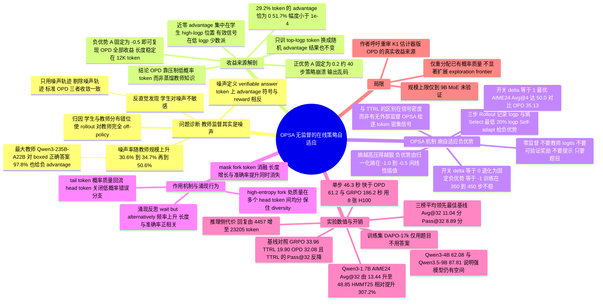

## 一、论文是干什么的？

先说一个大家都熟悉的场景：**在线策略蒸馏**（on-policy distillation，简称 OPD）。它的故事讲得很动听——让小模型（学生）自己写一遍解题过程，然后请一个更强的大模型（教师）逐字批改，告诉学生「这个字你用得好」「那个字你用得糟」。相比强化学习只在最后看一眼答案对不对（信号又稀又晚），这种逐 token 的密集反馈听上去显然更高效。Thinking Machines Lab 在 2025 年把它推火之后，这条路线在 2026 年迅速变成了后训练的主流之一。

这篇来自普渡大学的论文，做的事情就是**掀桌子**。作者把批改过程摊开来数了一遍，发现了一件很尴尬的事：**教师的批改本身就是错的，而且教师越大错得越离谱**。

打个比方。你请一位从没读过学生原文的资深教授，去给一份学生自己写的、思路很跳跃的草稿逐句打分。教授心里有一套自己的写法，学生写的每一句在他看来都「不是我会写的」，于是他倾向于给几乎所有句子扣分——哪怕最后的答案是对的。论文量化了这一点：用 Qwen3-4B 当教师时，**20.4% 的正确答案被打了负分，40.8% 的错误答案被打了正分**，整体噪声率 30.6%；换成 30B-A3B 教师升到 34.7%；换成最大的 235B-A22B 教师则达到 **50.6%**——也就是**掷硬币水平**。更夸张的是，这位最大的教师对被 `\boxed{}` 括起来的最终答案 token，在答案正确时有 **97.8%** 给了负分，答案错误时有 **96.6%** 给了负分：它几乎已经完全不看对错，一律扣分。

真正让作者改变整个研究方向的是下一步实验：把训练数据按「含噪声信号」和「不含噪声信号」切成两半，分别训练。结果是，**只用噪声数据训练的学生，和用干净数据训练的、以及用全部数据训练的标准 OPD，进步速度和最终成绩几乎一模一样**。

这就产生了一个尖锐的问题：如果打反的分数和打对的分数效果一样，那学生到底是在学什么？作者的答案是：**它根本没在学教师的知识，它只是在被反复告知「你刚才那个自己都觉得不太可能的用词，别再用了」**。而这件事，模型自己就能判断，压根不需要教师。基于这个洞察，作者提出了 **OPSA**（On-Policy Self-Adaptation，在线策略自适应）——不要教师、不要标准答案、不要验证器奖励、不要任何提示，只用模型自己的 token 概率和熵。结果 Qwen3-1.7B 在 AIME24 上的 Avg@32 从 13.44 涨到 48.85，**净增 35.41 分（相对提升 263%）**，比配了教师的标准 OPD 还高 **16.77 分**。

## 二、核心方法与创新

### 2.1 先看清楚 OPD 到底在算什么

OPD 优化的是学生分布和教师分布之间的反向 KL 散度，落到实现上就是给学生自己采样出来的每个 token 一个优势值 $A_i$，然后做策略梯度：

$$\mathcal{L}_{\mathrm{OPD}} = -\mathbb{E}\left[\frac{1}{|y|}\sum_{i=1}^{|y|} A_i \log \pi_s(y_i \mid x; y_{<i})\right], \quad A_i = \log \frac{\pi_t(y_i \mid x; y_{<i})}{\pi_s(y_i \mid x; y_{<i})}$$

**大白话**：$\pi_s$ 是学生对某个词的概率，$\pi_t$ 是教师对同一个词的概率。$A_i$ 就是「教师比学生更看好这个词多少」，取了对数。教师更看好就是正数（鼓励多说），教师不看好就是负数（惩罚，让它少说）。$\mathcal{L}$ 前面的负号加上 $\log \pi_s$，效果就是：$A_i$ 为正就把这个词的概率往上推，为负就往下压。

关键在于**梯度长什么样**。设 $z_t^{v}$ 是位置 $t$ 上词 $v$ 的 logit，则：

$$-\frac{\partial \mathcal{L}_{\mathrm{OPD}}}{\partial z_t^{v}} \propto \begin{cases} A_t\left(1 - \pi_s(v \mid x; y_{<t})\right), & v = y_t \ (\text{sampled}) \\ -A_t\,\pi_s(v \mid x; y_{<t}), & v \neq y_t \ (\text{unsampled}) \end{cases}$$

**大白话**：这个式子说明梯度会在两种情况下「消失」——一是 $|A_t|$ 很小（教师和学生看法一致，没什么可改的），二是 $\pi_s(y_t)$ 已经接近 1（学生早就笃定了，$1 - \pi_s$ 趋近于零，再推也推不动）。

作者接着一数：**29.2% 的 token 优势值精确等于 0，51.7% 的 token 优势绝对值小于 $10^{-4}$**。而且这些「零优势」token 高度集中在学生本来就给了高对数概率（high-logp）的位置上——道理很直白：学生特别有把握的词（比如「的」「所以」「因此」），教师看了同一段前文也会觉得该这么写，两人概率几乎相同，相减接近零。

于是作者做了个对照实验：**只拿这些高 logp token 来训练**，无论用真实的教师优势还是从 $[-1, 1]$ 里随便抽的**随机优势**，AIME24 成绩都毫无变化。这坐实了一件事——占了绝大多数篇幅的「顺手写出来的词」，在 OPD 里完全是看客。

### 2.2 决定性实验：把教师换成一个常数

既然只有低 logp 的少数 token 在起作用，那教师给这些 token 打的分，其中的「细粒度偏好信息」到底有没有用？作者做了一个非常干净的消融：**位置选择不变（还是学生 logp 最低的 20% token），但把所有教师优势统统替换成一个固定的常数**。

结果：

| 设置 | 结果 |
|---|---|
| 固定负优势 $A = -0.5$ | AIME24 的 Avg@4 稳步上升到与标准 OPD 同一水平，回复长度也和 OPD 一样逐渐涨到约 12K token 后稳定 |
| 固定正优势 $A = +0.2$ | 约 40 步内策略崩溃，回复长度掉到接近零，梯度范数爆炸，之后输出乱码 |

**大白话**：把教师的全部「意见」压缩成一个数字 $-0.5$，效果和请一个完整的教师模型一样好；但只要把符号翻成正的，模型立刻自毁。这说明真正起作用的**只有那个负号**，教师提供的那一整套 token 之间的偏好排序**是多余的**。

### 2.3 为什么「压制自己都觉得不太可能的词」本身就是学习？

这是全文最反直觉的地方，值得用一个类比讲透。

想象一个人在打草稿。他绝大多数词是顺口就写出来的（模型给的概率很高）；但因为写作时总带着一点随机性（采样温度不为零），偶尔会蹦出一个连他自己都觉得「怎么会写出这个词」的怪词。这些怪词往往会把整段思路带进一条错误的岔路，后面越写越离谱。

OPSA 做的事情就是：**每写完一段，把这一段里自己最没把握的那 20% 的词挑出来，统一告诉自己「下次别这么写」**。

这里的关键在于：**概率是守恒的**。softmax 输出的所有候选词概率加起来必须等于 1。所以「把一个词的概率压下去」并不是凭空销毁信息，而是**把这份概率质量退还给同一个位置上的其他候选词**——就像把一个杯子里的水倒出来，水必然流进旁边的杯子。这个「倒水」的过程，就是从模型自身的分布里榨取学习信号：它不需要外部任何人告诉它水该往哪流，只需要知道哪个杯子里的水本来就不该有。

而且，倒出来的水流向哪里，取决于这个位置的**熵**（不确定性）：

- **在低熵位置**（模型很笃定该写什么，但采样手滑抽到了一个尾部怪词）：压掉这个怪词，概率质量几乎全部回流到那个本来就该写的高概率词上。效果是**提高精度**，避免手滑。
- **在高熵位置**（模型自己也在犹豫，有好几个势均力敌的候选词，典型的就是「wait」「but」「alternatively」这类会开启不同推理分支的岔路口词）：压掉刚才采样到的那个头部词，概率质量会**更均匀地分给其他几个竞争者**，而不是全部堆到某一个上。效果是**保住多样性**，让下次采样有机会走进别的分支。

一句话总结这个机制：**同一个「压下去」的动作，在笃定的地方是纠错，在犹豫的地方是探索**。这也正是它不会像常见的自监督方法那样把模型压成「过度自信然后 Pass@k 崩塌」的原因。

### 2.4 熵决定该压多重

光看 logp 低是不够的，因为「低概率」有两种完全不同的成因：一种是模型整体犹豫（概率摊薄在很多词上，连头部词的 logp 都不高），一种是模型很笃定但采样落到了尾巴上。**熵**恰好能把这两种情况分开。作者先试了一个带方向开关的公式：

$$A_i^{\mathrm{dyn}} = A_i^{\mathrm{fix}} - \frac{1}{4}\delta \cdot r_i, \qquad r_i = 2\,\frac{H_i - H_{\min}}{H_{\max} - H_{\min}} - 1$$

**大白话**：$H_i$ 是第 $i$ 个 token 位置的熵；$H_{\min}$ 和 $H_{\max}$ 是这条回复里被选中的那 20% 低 logp 位置上的最小和最大熵。$r_i$ 把熵归一化到 $[-1, 1]$ 区间，衡量「这个位置相对于本条回复其他位置有多犹豫」。开关 $\delta$ 决定熵和惩罚力度的关系：$\delta = 1$ 表示越犹豫的位置压得越狠，$\delta = -1$ 反过来，$\delta = 0$ 就退化成 2.2 节的固定负优势。

实验结论很清楚：$\delta = 1$（越犹豫压得越狠）在 AIME24 上把 Avg@4 推到 **50.0%**，而同期标准 OPD 只有 **35.13%**；$\delta = -1$ 则在第 350 到 450 步之间训练不稳，梯度范数持续偏高，最终还不如固定负优势。

### 2.5 OPSA 的完整配方

把 $A_i^{\mathrm{fix}} = -\frac{3}{4}$、$\delta = 1$ 代进去，并且只更新 logp 最低的 20% token 集合 $\mathcal{S}_{\mathrm{lowest20}}$，就得到最终目标函数：

$$\mathcal{L}_{\mathrm{OPSA}} = -\mathbb{E}\left[\frac{1}{|\mathcal{S}_{\mathrm{lowest20}}|}\sum_{i \in \mathcal{S}_{\mathrm{lowest20}}} A_i^{\mathrm{dyn}} \log \pi_\theta(y_i \mid x; y_{<i})\right]$$

$$A_i^{\mathrm{dyn}} = -\frac{1}{2} - \frac{H_i - H_{\min}}{2\,(H_{\max} - H_{\min})}$$

**大白话**：这个 $A_i^{\mathrm{dyn}}$ 的取值范围是 $[-1, -0.5]$——本条回复里最不犹豫的那个被选中位置得到 $-0.5$，最犹豫的那个得到 $-1.0$，中间线性插值。所有需要的量（$\log \pi_\theta$ 和 $H_i$）在一次前向里就顺带算出来了，**不需要多加载任何模型，不需要任何标签**。

整套流程只有三步：

1. **Rollout**：用当前策略采样一条回复，顺手记录每个 token 的 log 概率和熵。
2. **Select**：在这条回复内部排序，只保留 logp 最低的 20% 的 token。
3. **Self-adapt**：给这些 token 打上负优势，幅度按归一化后的熵线性放大，然后做一次标准的策略梯度更新。

论文用 Table 1 总结了它和同行的差别：只有 OPSA 同时满足「密集 token 级信号 + 不要可验证奖励 + 不要外部教师 + 不要提示」这四项。GRPO 类的 RLVR 需要可验证奖励且信号稀疏；TTRL 不要外部监督但信号稀疏；OPD 要外部教师；OPSD 用「带提示的自己」当教师，仍然要构造提示。

### 2.6 一个额外的副产品：它自己长出了反思

作者观察到，OPSA 训练过程中回复长度稳步增长，而且**反思类词汇的出现频率显著上升**——就是那些「wait」「however」「but」「alternatively」「hmm」等标志自我纠错的词，而且回复越长准确率越高。

为了验证这不是巧合，作者做了一个「掐掉岔路口」的消融：在选中的 20% 低 logp 位置上，检查学生的前 5 个候选词，如果里面出现了预设反思词表（`wait`、`however`、`but`、`alternatively`、`hmm`、`perhaps`、`check`、`might`、`actually`）中的任何一个，就把这个位置从训练目标里剔除。结果：**回复长度的增长和准确率的提升基本全部消失，而且回复长度在约 300 步时崩溃**。这说明 OPSA 的收益主要就来自在这些「思维岔路口」上重新分配概率质量。

## 三、使用了哪些模型和计算资源？

### 3.1 LLM 模型

**学生 / 被训练的策略模型**（全部在非思考模式 non-thinking mode 下训练和评测，除非另行说明）：

| 模型 | 系列 | 用途 |
|---|---|---|
| Qwen3-1.7B | Qwen3 | 主力分析对象与主实验 |
| Qwen3-4B | Qwen3 | 规模泛化验证，兼作 GRPO 冷启动实验 |
| Qwen3.5-9B | Qwen3.5 | 验证在「已充分后训练的强模型」上是否仍有效 |

**教师模型**（仅在第 2 节噪声分析和 OPD 基线中出现，OPSA 本身不用教师）：

- **Qwen3-4B-Instruct**：噪声率 30.6%，同时也是主表中 OPD 基线所用的教师
- **Qwen3-30B-A3B-Instruct**：噪声率 34.7%
- **Qwen3-235B-A22B-Instruct**：噪声率 50.6%

**数据集**：训练全部用 **DAPO-17k**，且**只用题目，不用标签和标准答案**。评测：域内数学 **AIME24 / AIME25 / HMMT25**，域外代码 **MBPP+**、通用问答 **GPQA-Diamond**。噪声分析部分从 DAPO-17k 随机抽 500 道题，每题各取一条正确和一条错误回复。

**软件栈**：训练框架 **slime 0.2.4**，训练引擎 **Megatron 0.16.0rc0**，rollout / 推理引擎 **SGLang 0.5.14**。

**额外说明**：作者在 HuggingFace 上放出了 4 个 OPSA checkpoint——`Tuwhy/Qwen3-1.7B-OPSA`、`Tuwhy/Qwen3-4B-OPSA`、`Tuwhy/Qwen3.5-9B-OPSA` 以及 `Tuwhy/Olmo-3-7B-Instruct-OPSA`。其中 Olmo-3-7B 这一档**没有出现在论文正文里**，属于论文之外追加发布的模型。

### 3.2 计算资源

论文正文 5.1 节明确写道：**所有实验在 8 张 NVIDIA H100 或 H200 GPU 上完成**。附录 B.1 的超参表里写的是 **8xH100 GPUs**。

其他训练超参（附录 Table 4）：学习率 $1 \times 10^{-6}$；rollout batch size 64；全局 batch size 64；每个 prompt 采样数 1；训练解码 temperature 1.0、top-k 为 -1、top-p 1.0、最大回复长度 12000；评测解码 temperature 0.7、top-k 20、top-p 0.8、最大新 token 32768、每题采 32 条；每 20 步存一次档并验证一次，按验证集 Avg@4 选最佳 checkpoint。

**规模上限说明**：作者在附录 A 的局限性里坦承，「**由于计算资源有限**，实验只覆盖到 9B 以内的模型」，因此 OPSA 能否扩展到更大模型或 MoE 架构仍是未知数。

### 3.3 每个完整计算单位的耗时

**论文没有报告任何以 GPU 小时为单位的总训练开销**，这一项**暂无相关信息**。它报告的是**每个训练步的墙钟时间**（附录 Table 6，8 卡环境下）：

| 模型 / 方法 | 训练单步耗时（秒） | 推理平均 token 数 | 单条推理耗时（秒） | AIME24 Avg@32 |
|---|---|---|---|---|
| Qwen3-1.7B（基座） | 不适用 | 4457 | 1.78 | 13.44 |
| Qwen3-1.7B + GRPO | 186.2 | 19108 | 5.27 | 33.96 |
| Qwen3-1.7B + OPD | 61.2 | 15286 | 5.73 | 32.08 |
| Qwen3-1.7B + OPSA | **46.3** | 23205 | 6.58 | **48.85** |
| Qwen3-4B（基座） | 不适用 | 8015 | 3.31 | 23.33 |
| Qwen3-4B + OPSA | 68.6 | 20972 | 6.97 | 62.08 |
| Qwen3.5-9B（基座） | 不适用 | 6847 | 5.29 | 76.35 |
| Qwen3.5-9B + OPSA | 214.7 | 9695 | 6.31 | 87.81 |

**怎么读这张表**：OPSA 每步 46.3 秒，比 OPD 的 61.2 秒快约 24%，只要 GRPO 186.2 秒的约四分之一。原因有两个——相比 GRPO，它和 OPD 都不需要为了构造对比组而大量重复采样；相比 OPD，它不用额外部署一个更大更慢的教师模型做前向，省下来的显存和算力可以全部分给策略的 rollout 与优化。代价在推理侧：OPSA 训出的模型回复更长（23205 对基座的 4457 token），单条推理从 1.78 秒涨到 6.58 秒，但准确率的涨幅远大于这个开销。

**关于总时长的一个提示**：论文图中出现过的最大训练步数量级约在 400 到 500 步之间（例如 4.1 节提到 $\delta = -1$ 变体「在第 350 到 450 步之间不稳定」）。若按 Qwen3-1.7B 的 46.3 秒每步粗略折算，一次完整训练大致在 6 小时上下的 8 卡墙钟时间——但**这是本综述基于 Table 6 做的推算，论文本身并未给出任何总耗时或 GPU 小时数字**。

## 四、实验结果

### 4.1 主结果：三个模型全面上涨

| 模型 | AIME24 Avg@32 | AIME25 Avg@32 | HMMT25 Avg@32 | MBPP+ Avg@32 | GPQA-D Avg@32 |
|---|---|---|---|---|---|
| Qwen3-1.7B | 13.44 | 9.69 | 5.73 | 58.24 | 27.92 |
| **加 OPSA** | **48.85** | **35.31** | **23.33** | **59.44** | **32.40** |
| 提升 | +35.41（263.5%） | +25.62（264.4%） | +17.60（307.2%） | +1.20 | +4.48 |
| Qwen3-4B | 23.33 | 20.52 | 13.13 | 66.93 | 38.46 |
| **加 OPSA** | **62.08** | **58.44** | **37.40** | **68.35** | **41.29** |
| 提升 | +38.75（166.1%） | +37.92（184.8%） | +24.27（184.8%） | +1.42 | +2.83 |
| Qwen3.5-9B | 76.35 | 56.04 | 44.48 | 77.33 | 70.53 |
| **加 OPSA** | **87.81** | **76.98** | **67.40** | **79.27** | **73.70** |
| 提升 | +11.46（15.0%） | +20.94（37.4%） | +22.92（51.5%） | +1.94 | +3.17 |

Pass@32 也全面上涨，Qwen3-1.7B 在三个数学榜上全部**翻倍或更多**（AIME24 从 40.00 到 80.00，恰好翻倍，AIME25 从 30.00 到 66.67，HMMT25 从 23.33 到 50.00）。**大白话**：Pass@32 涨了，意味着模型不是靠「把已有的会做的题做得更稳」刷分，而是真的解出了以前 32 次都碰不到的题。

值得注意的是 Qwen3.5-9B 这一档——基座在 AIME24 上已经有 76.35 分、Pass@32 高达 93.33 接近饱和，OPSA 仍然能再加 11.46 分。域外的 MBPP+ 和 GPQA-Diamond 涨幅温和但方向一致，说明这不是对数学任务的过拟合。

### 4.2 和各路基线的正面对比（Qwen3-1.7B）

| 方法 | AIME24 Avg@32 | 三榜平均 Avg@32 | 三榜平均 Pass@32 | 需要什么外部监督 |
|---|---|---|---|---|
| 基座 | 13.44 | 9.62 | 31.11 | 无 |
| 加 GRPO | 33.96 | 24.79 | 54.44 | 可验证奖励 |
| 加 TTRL | 19.90 | 11.81 | 27.78 | 无（但靠自一致性） |
| 加 OPD | 32.08 | 22.15 | 54.44 | 外部教师（Qwen3-4B-Instruct） |
| 加 OPSD | 33.33 | 23.58 | 56.67 | 提示 / 参考答案 |
| 加 NSR | 32.08 | 24.13 | 58.89 | 可验证奖励 |
| **加 OPSA** | **48.85** | **35.83** | **65.56** | **全都不要** |

OPSA 比 Table 3 中最强的基线在 Avg@32 上高 **11.04 分**、Pass@32 上高 **8.89 分**；若把附录 Table 7 里的 NSR 也算进来，Pass@32 的领先是 **6.67 分**（65.56 对 58.89）。需要说明的是，OPSA 并不是唯一零外部监督的方法——原文明确指出 TTRL 同样不依赖外部监督，只是它基于自一致性的训练会把策略分布收窄到局部最优、显著拉低 Pass@k。**OPSA 真正独有的是零外部监督与 token 级密集信号两者兼得**。

几个细节很说明问题：

- **TTRL 反而把 Pass@32 拉低了**（从 31.11 掉到 27.78）。它靠多数投票造伪标签，本质上是把分布向某个局部最优收紧，探索空间被压缩。这正是 OPSA 刻意避开的失败模式——OPSA 不强迫策略收敛到任何自生成的目标答案上。
- **OPSD 的效果依赖一个巧合**：作者发现它只有在「学生关思考模式、教师开思考模式」时才有明显收益，而这实际上是在第一个 token 位置人为制造了巨大的分布错位。
- **思考模式下依然有效**：Qwen3-1.7B 开启思考模式的基座在 AIME24 上是 46.56，加 OPSA 后到 52.50。有意思的是，**关着思考模式训练出来的 OPSA 模型，已经能追平开着思考模式的基座**，说明 OPSA 把策略推向了更长的推理形态；再叠加原生思考能力还能继续涨，两者是互补的。

### 4.3 「是不是只是回复变长了？」——token 预算对齐实验

这是一个很关键的质疑：OPSA 训出的模型回复长达 23205 token，基线只有 15000 到 19000，会不会只是「多想了一会儿」的便宜账？

作者做了严格的对照：给 GRPO 和 OPD 的回复砍掉结尾的 `\boxed{}` 答案，接一个「wait」token 继续解码，并加最小长度约束，把长度硬拉到和 OPSA 相当：

| 方法 | 推理 token 数 | AIME24 Avg@32 |
|---|---|---|
| 加 GRPO | 19108 | 33.96 |
| 加 GRPO 补「wait」 | 23261 | 32.81 |
| 加 OPD | 15286 | 32.08 |
| 加 OPD 补「wait」 | 23472 | 31.67 |
| **加 OPSA** | 23205 | **48.85** |

**结论很干脆**：单纯多给 token 不但没帮到基线，反而略微掉分。OPSA 的优势来自分布被重塑，不是来自话变多。

### 4.4 多样性没有塌

用成对 4-gram 的 Jaccard 距离衡量（每题 32 条回复，AIME24 共 30 题）：随着生成长度增加，OPSA 模型和基座的多样性差距逐渐缩小并趋近于零。配合前面 Pass@32 的大幅上涨，两个独立证据都指向「没有多样性崩塌」。

更有意思的是附录 C.2 的发现：**OPSA 的整体训练熵明显低于 GRPO 和 NSR，但 Pass@32 反而更高**。作者由此指出，**总熵根本不是探索能力的可靠指标**，真正重要的是不确定性**分配在哪些位置**——在该笃定的地方笃定，在该犹豫的岔路口保持犹豫。

### 4.5 消融：该训多少比例的 token？

按 logp 从低到高取 10%、20%（论文选用）、30%、40%：

- **只取最低 10% 明显更差**。这批 token 几乎全是「排不进 top-1」的极端尾部词，只压它们会把分布过度尖锐化，熵急剧下降，反而限制了后续提升。
- **20%、30%、40% 都能把 Avg@4 推到 45 以上**，差别不大。说明 OPSA 对这个比例并不敏感，取 20% 就够。

### 4.6 当作 GRPO 的免费冷启动

附录 C.4：拿 Qwen3-4B 的 OPSA checkpoint 当初始化，再在 DAPO-17k 上跑 GRPO，验证集 Avg@4 在 **40 步内又涨了约 9 分**，曲线平滑无崩塌迹象。也就是说 OPSA 不但能单独用，还能当作后续 RL 的一段「不花任何标注成本的预热」。

## 五、潜在应用与已落地应用

**已经落地的部分：**

- 代码开源在 [DripNowhy/On-Policy-Self-Adaptation](https://github.com/DripNowhy/On-Policy-Self-Adaptation)（截至本综述撰写时约 37 star、1 fork，15 次提交，主分支 main）。
- 有一个做得相当讲究的可视化研究解说页：[On-Policy Self-Adaptation 项目页](https://dripnowhy.github.io/On-Policy-Self-Adaptation/)，把「谜题 → 什么在驱动学习 → 配方 → 机制 → 证据」五步串成了一条可交互的叙事线，还给出了一条论文正文里没有的工程提示：**实现时要防住「所有被选中 token 的熵完全相同」这个退化情况**（此时 $H_{\max} - H_{\min}$ 为零会除零）。
- 四个训练好的 checkpoint 已发布在 HuggingFace（Qwen3-1.7B、Qwen3-4B、Qwen3.5-9B、Olmo-3-7B-Instruct），并整理成了一个 collection。

**潜在方向：**

1. **零标注的后训练预热**。附录 C.4 已经证明它能当 GRPO 的冷启动，而且完全不消耗标注预算，这对「有一堆题目但没有标准答案」的场景（大量真实业务语料就是这样）特别对口。
2. **无法构造验证器的领域**。RLVR 的前提是有自动验证器，OPSA 连奖励都不要，理论上可以用在开放式写作、对话、多模态等无法自动判分的任务上——不过论文只在数学、代码、问答上验证过。
3. **大幅降低蒸馏基础设施成本**。如果这个结论站得住，很多团队为 OPD 部署的大教师模型（以及配套的同词表、白盒 logits 访问要求）就都可以拆掉了。论文明确指出 OPD 要求师生共享词表并能白盒访问教师 logits，这本身就严重限制了教师选择。
4. **重审现有 OPD 类方法**。作者在结论里直接呼吁「重新检视用 K1 估计器的 OPD 的机制」——如果多数收益来自重塑学生自己的分布，那这条线上一大批「改进教师信号」的工作可能都需要重新做对照实验。

**作者自己列的局限（附录 A）：**

- 只测到 9B，更大模型和 MoE 架构上能否奏效未知。
- OPSA 本质上是在**重新分配策略已有的概率质量**，所以对那些已经被大量后训练、输出分布过尖、熵极低的模型，收益可能有限。
- 它**不太能扩展策略的探索边界本身**——这一点从思考模式下 Pass@k 提升相对温和可以看出来。作者建议把它和别的 RL 方法组合起来。

## 六、网络上的讨论与评价

**HuggingFace Papers：** 这篇在 [HuggingFace papers 页面](https://huggingface.co/papers/2608.31046)上拿到 **139 个 upvote**，并被标记为 **#1 Paper of the day**，由一作 Yi Ding 本人于 9 月 1 日提交。评论区有三条：

- 一作（账号 `Tuwhy`）自己的一句话总结：on-policy 蒸馏可以在没有有意义的教师指导下改进推理能力，其收益主要来自压制学生采样出的不太可能的 token，这促成了 OPSA 这个用模型自身不确定性做自我改进的无教师方法。
- 用户 `Kutches`：「very interesting」。
- Librarian Bot 的自动推荐，列出了 7 篇同期高度相关的工作：*On-policy Distillation with Verifiable Reward*、*Distill Where You Fail*、*When Teacher Guidance Misleads: Reward-Aligned On-Policy Distillation*、*On-Policy Self-Distillation without Any Supervision*、*Mismatch Matters: On-Policy Distillation Beyond Token Agreement*、*Distilled Reinforcement Learning for LLM Post-training*、*Tail-Aware Top-k On-Policy Distillation*。**这份清单本身很能说明问题**：光看标题就知道「教师信号到底可不可靠」在 2026 年已经是一个被多组人马同时盯上的问题，本文不是孤立的挑衅，而是这一波质疑潮里嗓门最大的一篇。

**技术博客：** DEV Community 上有一篇 9 月 1 日的解读文章 [On-Policy Distillation Works Better Without the Teacher](https://dev.to/reidmarlow/on-policy-distillation-works-better-without-the-teacher-1ac1)（作者 Reid Marlow）。它把论文核心概括为「教师监督基本是噪声，而且教师越大噪声越多」「token 级蒸馏实际上在做的是熵正则化，而不是知识迁移」，并质疑维护一个独立的教师模型是不是**不必要的工程开销**。这篇文章的立场是**完全正面、没有提出任何保留意见**，截至抓取时评论数为 0。

**论文聚合站：** [alphaXiv](https://www.alphaxiv.org/abs/2608.31046) 收录了该论文并生成了 AI 综述，其概括与论文一致，强调普渡这项研究「挑战了 OPD 的两条基本假设——需要白盒访问教师概率、以及教师能准确评判自己没生成过的轨迹」。

**尚未发现的讨论：** 尽管这篇的结论足够有争议性（等于说一整条主流技术路线的核心组件是多余的），但截至本综述撰写时（2026-09-04，论文上线仅 4 天），检索**未发现 Hacker News 上的相关提交**（HN 上关于 on-policy distillation 的讨论帖仍停留在 2025 年 10 月 Thinking Machines Lab 那篇原始博客，且讨论量极小），也**未检索到 Reddit r/MachineLearning 的集中讨论帖**，以及**未检索到机器之心、量子位、知乎的专门解读长文**。X（推特）上也未检索到可确证的作者本人讨论串或第三方批评串。

需要特别说明的一点：检索中出现的两个 on-policy distillation 论文集列表（[chrisliu298/awesome-on-policy-distillation](https://github.com/chrisliu298/awesome-on-policy-distillation) 和 [nick7nlp/Awesome-LLM-On-Policy-Distillation](https://github.com/nick7nlp/Awesome-LLM-On-Policy-Distillation)）里虽然都出现了「OPSA」这个缩写，但经逐条核对，**它们指的是另一篇同名缩写、走「带特权上下文的自教师」路线的工作，与本文不是同一篇**（两个仓库里都检索不到 arXiv 编号 2608.31046）。这类缩写撞车在当前这个拥挤的赛道里很常见，读者检索时需要留意。

**一句话评价这篇的争议性**：目前网络反馈是**一边倒的正面**——高票、日榜第一、解读文章零质疑。但真正的检验还没到来：论文的最强主张（「OPD 的收益不来自知识迁移」）依赖的是 1.7B 到 9B 规模、单一 Qwen 系列、单一 K1 估计器实现下的实验，作者自己在附录里也承认这需要**进一步的理论分析**来确认 OPD 收益的真正来源。这条结论能否推广到更大规模和别的蒸馏实现，是后续最值得盯的争论点。

## 七、思维导图

