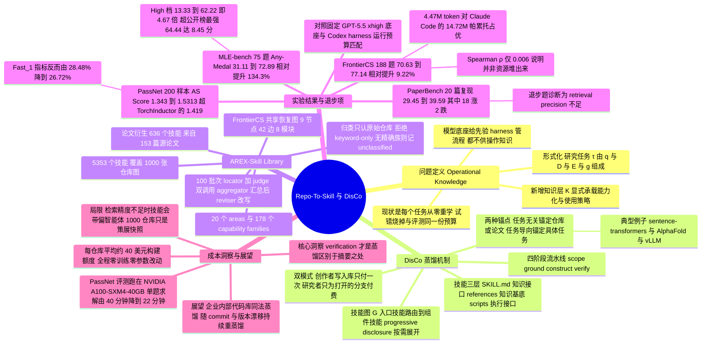

## 一、论文是干什么的？

设想你新招了一位智商极高的应届生。他读过全世界的教科书，任何算法的原理都能给你从头推导一遍。你把他放进公司，交给他一个任务：用我们内部这套数据管线，把推荐模型的 AUC 提上去。

结果他卡住了。不是因为不懂梯度下降，而是因为——公司用的那个特征库的 API 去年改过一次参数名；训练脚本要先设一个环境变量否则会静默地跑在 CPU 上；某个评估函数默认按样本加权，不改就跟线上口径对不上。这些东西没有一条写在教科书里，全都躺在几十个 GitHub 仓库的 issue、示例代码和测试文件里。于是这位天才只能一次次试错：改一版、跑一遍、看报错、再改。等他摸清门道，你给他的预算已经烧完了。

这篇论文说的就是这件事。作者把它命名为**操作性知识**（operational knowledge），并给了一个很精炼的定义：**知道一个方法和让这个方法真的跑起来，中间隔着的那段距离**。他们指出，今天的自主科研智能体一般被拆成两块——提供理解、推理、规划的**模型底座**，和提供编排、记忆、验证、迭代的**外壳**（harness）。这两块都在飞速进步，但两块都不负责装载领域 know-how。模型的先验很广但是固定的，外壳管流程但不提供内容。中间少了一层。

作者的方案是给智能体补上这一层：把 GitHub 仓库、论文这些写给人看、而且太长塞不进上下文的材料，自动蒸馏成一份份紧凑、经过验证的**技能**（skill），按需加载。方法叫 **DisCo**，产出的成果叫 **AREX-Skill Library**：从 1000 个常用机器学习仓库里蒸馏出 5000 多个已验证技能，归入 20 个领域和 178 个能力族。代码发布在 [VectorSpaceLab/AREX-Skill](https://github.com/VectorSpaceLab/AREX-Skill)。

最有说服力的一点在于实验的干净：模型底座（GPT-5.5）不变，外壳（Codex）不变，下游执行预算不变，**唯一变量就是有没有挂上这些技能**。结果 MLE-bench 相对提升 134.3%，PaperBench 提升 34.4%，FrontierCS 提升 9.2%，PassNet 提升 14.0%。

顺带一提，这是 BAAI 同一批人在 [AREX 深度研究智能体](https://arxiv.org/abs/2607.21461) 之后的续作——上一篇做的是智能体怎么自我改进，这一篇做的是智能体开工前应该先知道些什么。

## 二、核心方法与创新

### 2.1 为什么是「技能」这种形式

论文把研究任务形式化为 $\tau=(q,\mathcal{D},\mathcal{E},g)$：问题陈述 $q$、给定的数据材料 $\mathcal{D}$、执行环境与预算 $\mathcal{E}$、必须达到的目标 $g$。传统观点认为智能体系统 $\mathcal{A}=(M_\theta, H)$ 只有底座和外壳两部分。本文把它改写成三部分 $\mathcal{A}_{\mathrm{res}}=(M_\theta, H, \mathcal{K})$。

多出来的 $\mathcal{K}$ 就是作为显式操作上下文提供给智能体的操作性知识，动作采样从 $a_t\sim\pi_\theta(a\mid\tau,h_t,H)$ 变成 $a_t\sim\pi_\theta(a\mid\tau,h_t,H,\mathcal{K})$。

那 $\mathcal{K}$ 长什么样？作者选择用 Anthropic 提出的 Agent Skills 规范来承载，一个技能分三层：

$$
S=(\texttt{SKILL.md},\ \texttt{references/},\ \texttt{scripts/})
$$

对应三种角色：

| 层 | 论文里的叫法 | 类比 |
|---|---|---|
| `SKILL.md` | 知识接口（knowledge interface） | 说明书封面：这东西干什么用、什么时候用、大致怎么做 |
| `references/` | 知识基底（knowledge substrate） | 附录：API 文档、算法细节、参数配置，用到才翻 |
| `scripts/` | 执行接口（execution interface） | 现成的工具：输入输出定死的可执行脚本，直接调不用重写 |

这个三层结构的妙处在于**渐进式披露**（progressive disclosure）：智能体只读最上面那层摘要，剩下的按需展开。所以它可以持有几千个技能，而每次任务只真正读进去那么几个。作者用一句话概括了它和外壳的分工：**外壳决定智能体怎么做研究，技能决定它开工时知道些什么**。

### 2.2 技能图：一个仓库不是一个技能

一个大仓库（比如 vLLM）里的 know-how 显然装不进一个 `SKILL.md`。所以论文把从同一个来源蒸馏出的技能组织成一张**技能图**：

$$
\mathcal{G}=(\mathcal{S},\mathcal{L}),\quad \mathcal{S}=\{S_i\}_{i=1}^{n},\quad \mathcal{L}\subseteq\{(S_i,S_j)\mid i\neq j\}
$$

图里有一个**入口技能**说明这个来源的适用范围，然后路由到各个组件技能——数据准备、训练、推理、评估、部署、故障排查、维护。边 $\mathcal{L}$ 编码的是路由、依赖或组合关系。渐进式披露就在这张图上跑：智能体读入口、顺着自己需要的边往下走、其余的完全不打开。

### 2.3 蒸馏的四步流水线

论文把怎么造技能这件事叫**技能蒸馏**，并规定所有蒸馏运行都走同一条四阶段流水线：

$$
z\ \xrightarrow{\ \mathsf{scope}\ }\ \mathcal{Q}\ \xrightarrow{\ \mathsf{ground}\ }\ \mathcal{X}\ \xrightarrow{\ \mathsf{construct}\ }\ \tilde{\mathcal{G}}\ \xrightarrow{\ \mathsf{verify}\ }\ (\mathcal{G},R)
$$

四步分别回答四个问题：**哪些能力值得做**（$\mathcal{Q}$）、**什么证据支撑它们**（$\mathcal{X}$）、**怎么变成技能**（候选图 $\tilde{\mathcal{G}}$）、**这些技能站不站得住**（验收后的 $\mathcal{G}$ 加一份构建记录 $R$）。

区别只在起点 $z$ 是什么，由此分成两种蒸馏：

- **任务无关蒸馏**（task-agnostic）：起点是一个来源，比如一个仓库、一篇论文、一份教程。提前批量做好，任何任务都能来取。sentence-transformers、AlphaFold、vLLM 这类仓库走的就是这条路。
- **任务导向蒸馏**（task-oriented）：起点是一个具体问题。材料不是给定的而是要主动去搜。先把任务拆成需要的能力，再挑出智能体自己供不上的那些**能力缺口**，然后去找材料补。打一场 Kaggle 比赛属于这一类。

作者反复强调的一条底线是：**验证才是蒸馏区别于摘要的地方**。没有任何技能能仅凭「来源里这么写的」就进库；每个候选都要被检查、能修就修、修不掉的缺口如实记进 $R$ 而不是藏起来。

### 2.4 创作者模式与研究者模式

DisCo 是**同一个智能体的两种模式**，共用同一套底座和外壳：

- **创作者模式**：跑上面那条四步流水线，把验收通过的技能图写进 AREX-Skill Library。
- **研究者模式**：就是式 $\mathcal{A}_{\mathrm{res}}$ 里那个智能体，从库里取出任务相关的分支当作 $\mathcal{K}$ 来解题。

两种模式的成本是**刻意不对称**的：创作者模式每个来源只付一次，之后被所有用到它的任务摊薄；研究者模式只为自己真正打开的那部分付费。这个不对称正是整套方案能规模化的原因——离线蒸馏可以铺得很宽，在线解题不用重新推导。

### 2.5 AREX-Skill Library 的规模与路由

仓库快照的具体数字：**5,353 个技能、1,000 张仓库技能图、20 个领域、178 个能力族**，记录了 2,209 条从仓库到领域-族路径的精确归类，其中 700 个仓库落在不止一个族里（一个仓库支持多种能力就会重复出现）。论文附录 B 列出了完整的路由覆盖，四大板块分别是视觉与生物医学与生成式媒体与语音、语言与智能体与检索、系统与运维与部署与训练、机器人与科学计算与数据科学与负责任 AI。

分类法的构建过程做得相当讲究，值得单独说一句：**输入给模型的只有仓库标识和一段简短摘要**，URL、star 数、原有的类别字段全部剔除，目的是让树反映能力语义而不是流行度或者继承来的标签。流程是先让 LLM 提一棵完整的两级树，再把 1000 个仓库切成 100 个批次（每批 10 个），每批跑两次独立调用——一个 locator 试着把每个仓库归到精确、可接受、勉强、不匹配这四档以压力测试覆盖度，一个独立的 judge 审查这棵树有没有漏掉能力、族之间是否重叠、有没有混轴或者万能筐。聚合器综合 100 份 judge 意见加上确定性统计，再由 reviser 改写整棵树。收敛门槛要求至少两轮评估、全批覆盖、不匹配率与勉强匹配率受控、没有阻塞性问题、没有过载的族，以及聚合器明确给出停止建议。

分类法冻结之后才做最终归类，而且**归类的主要证据是原始仓库本身而不是生成出来的技能图**（图只用来导航），每条归类必须附理由、仓库证据和置信度。**只靠关键词匹配、只靠依赖项、只是可选集成、只在示例里出现过——这四种都判为不合格**。找不到精确匹配的族就记为未分类，绝不硬塞。

运行时，模型先看到路由器描述，沿着领域到族再到仓库图一路收窄，最后只把当前这一步需要的技能、参考文档或脚本载入 $\mathcal{K}$。**完整的库从来不会整个进上下文**。

### 2.6 论文衍生技能与任务导向技能

除了仓库，论文还构建了另外两类：

**论文衍生技能**：把每篇论文拆成模块级技能（方法组件、数据或评估流程、实现工作流），每个模块单独做断言测试，然后跑一次有边界的复现实验——**这一步明确不许读原始实现仓库**，用来检验生成的技能是不是真的携带了操作性知识，而不是只是指回源码。本次研究针对 PaperBench 的 20 个目标，从 153 篇源论文里产出了 **636 个论文衍生技能**，每篇源论文贡献 3 到 5 个代表性模块技能。

**任务导向技能**：MLE-bench 的 75 个竞赛每个建一张描述性技能图；FrontierCS 的 188 个 Agent Track 任务共用一张面向故障恢复的技能图；PassNet 用一张基准级的图，覆盖 FX 图检查、模式匹配、保语义重写、Triton 实现和性能诊断。

其中 FrontierCS 那张图的设计很有意思：**入口技能扮演的是故障恢复路由器**，只有在一次聚焦的初次尝试暴露出具体失败之后才被激活。它会重建一份紧凑的失败快照、定位最早出问题的那一层，然后路由到八个模块之一（建模与方法选择、实现、检查器与评估器构建、验证、交互式推断、在线反应式决策、testlib 判题、平台期突围）。合并重复边之后，这张图共 **9 个节点、42 条有向边**。图里还有一条硬规则：智能体要区分保证合法的兜底方案、已验证的最优冠军方案、实验性挑战者三类，**更弱或者非法的挑战者不能顶替冠军**。

## 三、使用了哪些模型和计算资源？

这一节的信息全部来自论文正文与附录 A，未见出处的一律标注为暂无相关信息。

### 3.1 LLM 模型（含版本号）

| 用途 | 模型 | 出处 |
|---|---|---|
| 下游评测统一底座 | **GPT-5.5**，xhigh reasoning effort | 5.1 节，四个基准全部固定此配置 |
| 下游评测统一外壳 | **Codex** | 5.1 节 |
| 仓库技能图构建 | **GPT-5.5** 与 **GPT-5.6-sol**，xhigh reasoning effort | 4.1 节、附录 A.1 |
| PassNet 构建阶段（省钱用） | **DeepSeek v4 pro** 底座加 **Claude Code** 外壳 | 表 6 标题原文写明 to economize |
| 分类法归纳流水线 | 论文只写 LLM-assisted，未点名具体型号 | 4.2 节、附录 A.1 |

被对比的公开榜单条目（这些不是作者跑的，是从官方榜单抄来的）涉及的模型有：Gemini-3-Pro-Preview（Famou-Agent 2.0、CAIR MARS+、MLEvolve、PiEvolve）、Claude-Opus-4.6（AIBuildAI）、GPT-5（Thesis、R&D-Agent）；FrontierCS 榜单上则有 Claude Opus 4.8、Qwen3.7 Max（均配 Claude Code）和 Gemini 3.1 Pro（配 Gemini CLI）。

值得注意的是：**整套方法没有训练任何模型，也没有改动任何模型参数**。所有算力开销都花在推理侧——调 API 做蒸馏，以及跑基准时的训练与执行。

### 3.2 计算资源

| 项目 | 数值 | 出处 |
|---|---|---|
| PassNet 全部评测硬件 | **NVIDIA A100-SXM4-40GB** | 5.1 节 |
| FrontierCS 智能体容器 | **2 个 CPU 核加 4 GiB 内存** | 5.1 节 |
| FrontierCS 判题限制 | 时限 0.25 秒到 100 秒，内存 128 MiB 到 2 GiB（逐题不同） | 5.1 节 |
| MLE-bench GPU 型号 | **暂无相关信息**（论文只给 GPU-hours 预算，没写卡型与卡数） | 附录 A.2.1 表 5 |
| PaperBench 硬件 | **暂无相关信息** | 全文未提 |
| 仓库蒸馏所用硬件 | **暂无相关信息**（走 API，无自有 GPU 描述） | 附录 A.1 |

### 3.3 每个完整计算单位的耗时与花费

| 计算单位 | 耗时或花费 | 出处 |
|---|---|---|
| 蒸馏一个 GitHub 仓库 | 平均约 **40 美元** 的构建额度 | 4.1 节、附录 A.1 |
| 蒸馏 1000 个仓库 | 约 **4 万美元** 量级；论文未直接给总额，此处仅为 1000 乘 40 的算术换算 | 由 4.1 节两个数字相乘 |
| MLE-bench 单任务探索阶段 | 上限 **24 GPU-hours** | 附录 A.2.1 表 5 |
| MLE-bench 单任务运行阶段 | 上限 **24 GPU-hours**（这一项正是带技能与不带技能两侧对齐的预算） | 附录 A.2.1 表 5 |
| 跑完一次完整 MLE-bench | 75 题，运行阶段按上限推算最多 **1800 GPU-hours**；论文未给实际耗时与美元金额 | 由表 5 每题上限与 75 题推算 |
| MLE-bench 结果重复次数 | **3 次重复运行**取均值与标准误 | 表 1 标题 |
| FrontierCS 单任务 | **5 小时**预算（榜单标准） | 5.1 节、表 3 标题 |
| 跑完一次 FrontierCS Agent Track | 188 题各 5 小时；论文未给墙钟总时长或费用 | 5.1 节 |
| FrontierCS 单任务平均 token | 无技能 **2.46M**，有技能 **4.47M**（已含子智能体） | 表 3 |
| PassNet 训练集全量求解 | 论文原话：跑完 4000 多个实例需要 **20 天以上**且 API 花费可观，所以改用筛选加分发的工作流 | 附录 A.2.4 |
| PassNet 训练集筛选一轮 | 约 **1 天** | 附录 A.2.4 |
| PassNet 单题平均求解时间 | 构建阶段 50 题采样上，从 **40 分钟降到 22 分钟** | 表 6 |

**一句话总结算力画像**：这是一篇几乎不烧自有 GPU、主要烧 API 额度的论文。真正的成本大头是 1000 次每次约 40 美元的仓库蒸馏，以及 MLE-bench 上每题两份各 24 GPU-hours 的预算。论文没有披露 GPU 集群规模、总 GPU 小时数或者项目总花费。

## 四、实验结果

四个基准，同一个对照设计：GPT-5.5 底座固定、Codex 外壳固定、下游运行预算固定，只切换有没有技能。技能构建的一次性开销单独记账，不计入任何一侧。

### 4.1 MLE-bench（全量 75 个 Kaggle 竞赛）

指标是 Any-Medal，也就是拿到任意奖牌的比例。

| 智能体 | 底座 | Low (22) | Medium (38) | High (15) | 全部 (75) |
|---|---|---|---|---|---|
| Famou-Agent 2.0（公开榜最强） | Gemini-3-Pro-Preview | 80.30 | 64.04 | 42.22 | 64.44 |
| AIBuildAI | Claude-Opus-4.6 | 77.27 | 61.40 | 46.67 | 63.11 |
| R&D-Agent | GPT-5 | 68.18 | 21.05 | 22.22 | 35.11 |
| Codex（无技能） | GPT-5.5 | 42.42 | 31.58 | 13.33 | 31.11 |
| **Codex + AREX-Skill** | GPT-5.5 | **86.36** | **69.30** | **62.22** | **72.89** |

这张表有三个看点：

1. **绝对涨幅极大**：31.11% 到 72.89%，涨 41.78 个百分点，相对提升 134.3%。模型一个参数没动。
2. **难题涨得最狠**：High 档从 13.33% 到 62.22%，相当于无技能成绩的 4.67 倍（提升 366.8%）。作者的解释很直白——难题会把智能体暴露在更大的库、实现和调参空间里，无引导的试错在这里最贵。有了技能，它能更早进入解空间里有产出的那片区域。
3. **不需要换外壳**：这是原味 Codex 加技能，没有自定义执行外壳、没有多智能体编排、没有改控制循环，就把公开榜第一的 64.44% 顶到了 72.89%（高 8.45 分），High 档更是比公开最好成绩高 15.55 分。

### 4.2 PaperBench（全量 20 篇论文复现）

平均复现分从 **29.45 提到 39.59**，涨 10.14 分，相对提升 34.4%。**20 题里 18 题涨、2 题跌**，说明不是靠个别离群点撑起来的。

涨幅最大的三题：rice（7.94 到 48.51，涨 40.57，6.1 倍）、sequential-neural（41.67 到 65.37，涨 23.70）、what-will-my-model-forget（9.35 到 30.45，涨 21.10）。最夸张的相对倍数是 ftrl：1.50 到 17.17，**11.4 倍**。

规律很清楚：**基线越低的题涨得越多**。原本就有 52.93（all-in-one）和 56.65（bam）的题，只涨了 1.77 和 2.18。

作者也老老实实报了两个退步的：sample-specific-masks（57.11 到 52.04，跌 5.07）和 stay-on-topic（32.31 到 27.79，跌 4.52）。这两题的无技能分都在 20 题均值之上。他们的诊断是**检索精度问题**——当一篇论文的复现依赖某个狭窄、特异、技能图没覆盖到的实现选择时，跟着检索来的技能走反而会把智能体从它本来能自己摸索出来的路上拽开。这是召回率和精确率之间的经典权衡，作者建议的改进方向是更好的路由，或者在检索到的技能匹配度不高时显式退回无引导推理。

### 4.3 FrontierCS Agent Track（全量 188 道开放式题）

| 智能体 | 底座 | Score | 平均步数 | 平均工具调用 | 平均 token |
|---|---|---|---|---|---|
| Claude Code | Claude Opus 4.8 | 74.5 | 355.4 | 145.7 | 14.72M |
| Claude Code | Qwen3.7 Max | 61.9 | 133.9 | 139.1 | 13.85M |
| Gemini CLI | Gemini 3.1 Pro | 60.2 | 74.3 | 41.6 | 2.00M |
| Codex（无技能） | GPT-5.5 | 70.63 | 55.9 | 64.7 | 2.46M |
| **Codex + AREX-Skill** | GPT-5.5 | **77.14** | 88.7 | 105.0 | 4.47M |

分数从 70.63 到 77.14，涨 6.51 分，相对涨 9.22%。这个基准上作者做的统计检验最扎实：

- **188 题的配对 bootstrap 给出 95% 置信区间为 3.41 到 9.83 分**，区间不跨零。
- 74 题改善、66 题基本不变；改善的题平均涨 22.23 分，退步的题平均跌 8.76 分，正向总量是负向总量的 3.91 倍。
- 分层看，无技能分低于 50 的那 47 道题涨得最猛：均值从 19.43 到 45.99（涨 26.56），其中 30 道越过了 50 分线。
- 188 题里有 **180 题**智能体至少打开过一个技能文件。

最要紧的一条反驳性检验是**会不会只是因为多花了资源**。技能确实让 token、步数、工具调用都变多了，但作者算了相关性：**每题的增益与额外资源消耗几乎完全无关**，Spearman 相关系数在 token 上是 0.006、步数 0.014、工具调用 0.015。而且在那 102 道没有调用子智能体的题上，配对增益仍有 5.54 分。

顺带还有一个漂亮的效率结论：Codex + AREX-Skill 每题 4.47M token，而 Claude Opus 4.8 和 Qwen3.7 Max 配 Claude Code 分别用了 14.72M 和 13.85M（3.29 倍和 3.10 倍），**分数还分别低 2.64 分和 15.24 分**。工具调用少 24.5% 到 27.9%，步数少 33.8% 到 75.1%。按榜单口径，这是一次在四个维度上的**帕累托占优**。

### 4.4 PassNet（200 个图编译器 pass 生成样本）

| 方法 | AS Score | 几何平均加速 | 正确率 | `Fast_1` | 失败样本 |
|---|---|---|---|---|---|
| Eager（参照） | 1.000 | 1.000 | 100.00% | 100.00% | 0 |
| TorchInductor（torch.compile） | 1.419 | 1.505 | 79.70% | 23.60% | 0 |
| Codex + GPT-5.5 | 1.343 | 1.5891 | 81.35% | **28.48%** | 14 |
| **Codex + GPT-5.5 + AREX-Skill** | **1.5313** | **1.6688** | **90.76%** | 26.72% | **5** |

AS Score 从 1.343 到 1.5313，涨 0.1883，相对涨 14.0%。三个附带发现：

- **失败样本从 14 个降到 5 个**，减少 64.3%；正确率从 81.35% 涨到 90.76%（涨 9.41 个百分点）。技能图里的显式流程、拒绝准则和恢复动作直接体现在这里。
- **越过了 TorchInductor**：1.5313 对 1.419，说明带技能的智能体能找到默认编译器管线之外的优化。
- 但 `Fast_1` 这一项**其实是退步的**（28.48% 到 26.72%）。论文没有专门解释这一格，本综述的推测是：技能让更多样本变正确（分母变大），而新变正确的那批里有一部分并不比 eager 快。

构建阶段那张表（表 6，50 个采样训练任务，用 Claude Code 加 DeepSeek v4 pro 省钱跑的）同样给了清晰的曲线：几何平均从 0.5352 到 0.6941，中位数从 0.7340 到 0.7941，匹配失败从 10/50 降到 1/50，平均求解时间从 40 分钟降到 22 分钟。

有意思的是作者对一个异常值的追查：算术平均在无技能基线上反而更高（0.9566），是因为某次运行里有两个实例拿到了 10.63 和 8.18 的离谱高分，而重复运行时同样两个实例只拿到 0.99 和 0.10。顺着这条线索排查，他们发现技能里有一条**规则写得太绝对**——技能警告智能体不要用自定义 kernel 去重写厂商优化过的重算子（大矩阵乘、卷积），这在多数情况下是好默认值，但它挡住了一个 stride 等于 kernel_size 的 conv3d 用例：这种情况下计算其实可以退化成逐元素乘法，而通用 cuDNN 路径还要付重叠卷积带来的布局和 gather 开销。修复方式是把这条警告从绝对禁令改成**可推翻的先验**。这个小故事很能说明验证这一步到底在验什么。

## 五、潜在应用与已落地应用

### 已经落地的部分

- **AREX-Skill Library 本身已开源**，仓库在 [VectorSpaceLab/AREX-Skill](https://github.com/VectorSpaceLab/AREX-Skill)。按附录 A.1 的描述，公开集合包含 `skills/repositories/repo-skills/` 下的 1000 个仓库图入口，以及一个模型可见的 `skills/repositories/repo-skills-router/` 路由器。仓库技能本身**不出现在初始的技能清单里**，必须经由路由器访问——这是控制上下文膨胀的关键设计。仓库整体采用 Apache 2.0，而单个技能保留各自源项目的许可证（写在各自的 `SKILL.md` 里）。
- **DisCo 有独立发布的命令行工具**，作者在 HuggingFace 讨论区贴出了 npm 包地址 [@arex-skill/disco](https://www.npmjs.com/package/@arex-skill/disco)。
- **可以直接挂到现成外壳上**。论文反复强调技能是操作上下文而不是新的控制循环，所以任何支持 Agent Skills 规范的外壳（Claude Code、Codex）都能消费同一批技能。实验里已经在 Codex 和 Claude Code 两套外壳上都跑过。

### 潜在方向

- **给企业内部代码库做同样的事**。论文这套流水线的输入是一个带文档、示例、测试、配置的版本化仓库，公司内部的核心库完全符合这个描述。把新人上手一个内部框架要踩的坑蒸馏成技能，比写 wiki 更适合喂给智能体。
- **随版本自动更新的知识层**。作者特别指出源材料每次发版都会漂移，而每张技能图都带公开的溯源信息（源 commit 或等价标识、包版本、脏状态、相对证据路径）。这为仓库一升级就重蒸馏对应技能图的持续集成留了接口。
- **扩到更多论文**。论文衍生技能目前只做了 PaperBench 相关的 153 篇，作者明说同样的流程可以随验证预算扩展到更多论文。
- **别的专业领域**。操作性知识这个概念本身不限于机器学习——生物信息、电子设计自动化、金融量化，凡是教科书讲原理、真本事藏在仓库 issue 里的领域，都适用同一套拆法。

### 已知的边界

论文自己点出的局限有两条值得记住：一是 PaperBench 上那两道退步的题反映的**检索精度问题**，技能匹配不准时反而有害；二是仓库集合是常用 ML 软件的一份**策展快照，而不是对生态的穷尽划分**，1000 个仓库的挑选依据是开源可见度和实际使用度（GitHub star 数是策展信号之一）。

## 六、网络上的讨论与评价

先说结论：**这篇论文的「热度信号」很强，但「讨论信号」几乎为零**。

### HuggingFace 论文页

[huggingface.co/papers/2609.02749](https://huggingface.co/papers/2609.02749) 上，这篇拿到了 **#1 Paper of the day** 的标记，并带有 Beijing Academy of Artificial Intelligence 的机构徽章。票数在本次核查时显示为 515（本文 frontmatter 记录的是 512，是稍早的快照）。论文由作者之一 Yuyang Hu 在 9 月 3 日提交。关联资源方面是 0 个模型、0 个数据集、1 个 Space（`WhySoCodius/skill-forge`），并被数个 collection 收录。

讨论区**有 3 条留言，但没有一条是实质性讨论**：

1. 账号 `namespace-ERI`（标记为 Paper author 与 Paper submitter）贴了一组链接——Daily Papers 页、arXiv 页、GitHub 仓库、以及上面提到的 DisCo CLI npm 包。纯链接，无正文。
2. 账号 `tjjune123` 发的是广告：推销一个把 HuggingFace 论文转成播客的站点。
3. `librarian-bot` 的自动化相似论文推荐，列出了 Repo2Skill-Evo、Demystifying Agent Skills、Evo-Harness、Practice Makes Unsafe 等 2026 年的同主题工作。

### Hacker News

**没有找到任何相关讨论**。直接查询 HN 的 Algolia 接口，用 AREX-Skill、Repo-To-Skill、2609.02749、DisCo skill distillation 等关键词都没有命中这篇论文的提交或评论——命中的少数结果是模糊匹配的无关旧帖。搜索引擎返回的两条 HN 链接是今年 4 月左右关于 agent skills 这个话题本身的讨论串，跟本文无关。

### Reddit

**未能核查**。Reddit 的搜索接口对本次请求返回 403，搜索工具也不允许抓取 reddit.com。所以这里既不能说有讨论，也不能说没有——是工具限制而非证据。

### X / Twitter

只找到两条自动化论文推送账号的转发，都是复述摘要，没有找到研究者的个人评论：`@HuggingPapers` 写的是「DisCo turns 1,000+ popular ML repositories into 5,000+ executable skills」，`@papersdatacode` 的说法是「Adds verified skill graphs distilled from repos」。这两条是通过 Trendshift 的[仓库页面](https://trendshift.io/repositories/207922)间接看到的，该页显示仓库的 trending delta 为 9。

### 博客与简报：唯一的实质评论

目前**唯一一篇带有独立判断的文字**来自 Ken Ashe 在 9 月 3 日的博客 [Repo-distilled skills are the missing middle layer for research agents](https://kenashe.ai/blog/2026-09-03-repo-distilled-skills-are-the-missing-middle-layer-for-research-agents)。他认可核心诊断——「瓶颈往往不是原始推理能力，而是知不知道本地该怎么下手」——但对数字保持克制：**「我不会把这些数字读成『技能解决了科研自动化』。基准就是基准，而且这篇论文的实验设置本身很重要。」** 他还给了一条务实建议：多数团队并不需要一个五千技能的库，先把自己最痛的五个工作流蒸馏出来就够了。

AI Weekly 的 [Found First 栏目](https://aiweekly.co/editors-blog/found-first-repo-to-skill-5-000-github-distilled-skills-push-a-gpt-5-5-agent-134) 则是不加保留的正面解读，它的提法是：从真实代码库蒸馏出的操作性知识，是叠加在底座模型之上的一层**可分离、可累加的能力层**，因此「技能库本身就成了一项独立于模型的竞争资产」。其余几个聚合站（hyper.ai、ai-tldr.dev、cctest.ai）只是摘要复述，没有原创评论。

### GitHub 仓库的真实活跃度

核查时 [VectorSpaceLab/AREX-Skill](https://github.com/VectorSpaceLab/AREX-Skill) 有 **176 star、14 fork、1 个 open issue**，Apache 2.0，6 位贡献者，仓库创建于 2026-05-28，最后一次 push 是 2026-09-03（论文上 arXiv 的次日）。

值得注意的是：最近 30 条 issue/PR **全部是 PR、零 issue，且每一条的评论数都是 0**。其中 28 条来自 BAAI 一侧的账号。唯一疑似外部贡献的是 9 月 4 日 `umran666` 提交的 PR #31（修 snapshot 遍历、validator 链接崩溃、Windows home 路径展开），提交至今无人回复。**换句话说，社区参与目前基本为零。**

### 一个容易混淆的点

GitHub 上还有一个名字极像但完全无关的仓库 [shuyhere/repo-to-skill](https://github.com/shuyhere/repo-to-skill)，描述是 Turn any GitHub repo into an agent skill。它不是本文的产物，不要搞混。

### 小结

515 票、Paper of the Day、两条机器人推文、两篇博客——**热度是真的，但迄今没有任何人公开质疑过这篇论文的关键主张**。134.3% 这个数字被所有渠道原样复读，唯一一句带保留的评论就是 Ken Ashe 那句「基准就是基准」。关于数据污染风险、技能验证方法学是否可靠、无技能基线是否被削弱这几个最该被追问的方向，本次检索范围内**没有找到任何批评性讨论**。

## 七、思维导图

