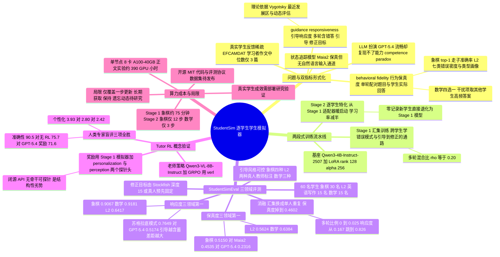

## 一、论文是干什么的？

想象你要培养一位金牌家教。最有效的办法当然是让他多带学生：带得越多，越知道「小明这种爱抢中心兵的孩子该怎么点拨」「小红这类语法基础薄弱的学生该讲规则还是就事论事」。问题是——真学生太贵、太慢了。要凑齐一个有代表性的学生群体、让家教一个个试错、再等几个月看效果，这个循环长到没法用来训练 AI。

于是就有了「学生模拟器」这条路：造一批假学生，让 AI 老师先在假学生身上练手。但作者指出，现有的假学生都只有半条命。

一类是**状态追踪模型**，比如知识追踪（knowledge tracing）和国际象棋界的 Maia2。它们是拿真人数据练出来的，确实很像人——但它们**听不懂人话**。你给它讲一段苏格拉底式的启发，它压根没有接收自然语言的输入通道，只能继续按老样子走棋。

另一类是**直接拿大模型演学生**，比如把 GPT-5.4 的提示词写成「你现在是一个 1200 分的国际象棋初学者」。它对老师的话言听计从、反应流畅——但它演不像。论文里有个很妙的观察：同一个棋局，三个真实棋手会走出三步不同的棋（一个推中兵、一个走稳健的小兵、一个用象钉住马），GPT-5.4 拿着这三个人的历史记录去猜，三个全猜错。你在提示词里把学生的认知状态描述得再精确，模型也不会真的变笨到那个程度。

StudentSim 的目标就是把这两半合成一个：既要**像这个学生本人**，又要**教得动**。作者把这两件事拆成两个可以打分的指标——behavioral fidelity（行为保真度，记作 $\mathcal{F}$）和 guidance responsiveness（引导响应度，记作 $\mathcal{R}$）——然后建了一套叫 **StudentSimEval** 的标准评测协议，覆盖国际象棋、二语英语写作（L2）、数学三个领域共 **60 名真实学生**（30 名棋手、15 名英语学习者、15 名数学学生）。代码开源在 [GitHub](https://github.com/microsoft/StudentSim)，项目页在 [microsoft.github.io/StudentSim](https://microsoft.github.io/StudentSim/)。

这两个指标背后其实是教育学里一个很老的思想：维果茨基的**最近发展区**。衡量一个学习者，既要看他自己能做到什么，也要看他在有人帮忙时能做到什么。$\mathcal{F}$ 量的是前者，$\mathcal{R}$ 量的是后者。作者说得很直白：这两条正是「AI 老师训练」这件事对一个模拟学生的全部要求——一个**个性化的起点**，加上**被教会的能力**。

## 二、核心方法与创新

### 2.1 两个指标：像不像，教不教得动

先把打分方式讲清楚，因为整篇论文都建立在这上面。

每个学生 $i$ 都有两类留存记录：

- **单轮记录** $S_i=\{(x,m)\}$：题目 $x$ 配上这个学生**实际给出**的回答 $m$。注意是实际回答，不是正确答案——学生答错了，那个错答案就是标准答案。
- **多轮记录** $T_i=\{(x,m,\tau,m^{*})\}$：题目、学生的错误回答、老师针对这个错误给的引导 $\tau$、以及引导所指向的**标准修正答案** $m^{*}$。

于是：

- $\mathcal{F}$（行为保真度）等于模拟器在没人帮忙时，答得跟这个学生本人有多像。
- $\mathcal{R}$（引导响应度）等于模拟器读完老师的引导 $\tau$ 之后，有多大比例真的改到了 $m^{*}$。

三个领域的具体算法不一样，因为「回答空间」本身就不一样：国际象棋是走子的 top-1 准确率；L2 写作是生成的作文在**错误密度和七类错误类型分布**上跟这个学习者本人的匹配度（用 LanguageTool 分类）；数学则把开放式答案改造成四选一——正确选项放这个学生实际填的答案（对错都算），另外三个干扰项放**其他学生在同一题上最常填的答案**，这样 top-1 准确率就成了自然的保真度分数。

作者特别强调这两个指标是**正交**的：只保真不响应，等于描述了一个学生但教不动他；只响应不保真，等于从错误的起点开始跟着老师走。目标是右上角那个双高的角落。

### 2.2 两段式训练：先学「学生这个物种」，再学「这一个学生」

真正的技术难点是**数据太稀疏**。论文举的例子很扎心：EFCAMDAT 语料里，一名英语学习者的作文数量**中位数只有 3 篇**，超过三分之二的人写了 5 篇以内。你拿这点数据从头训一个专属模型，只会过拟合，而且每换一个学生就得把「这门学科的学生大体长什么样」重新学一遍。

StudentSim 的解法是把训练劈成两段（这也是全文最核心的设计）：

**Stage 1：pooled training（汇集训练）。** 把一个领域里**所有**学生的记录混在一起，训练出一个领域通用的基础模拟器。这一阶段学的是共性——大家常犯的错、这个领域回答该长什么样、以及最关键的一条：**从自然语言引导到「改变回答」的那条通路**。

**Stage 2：per-student specialization（逐学生特化）。** 从 Stage 1 的适配器接着往下练，只喂一个学生自己的记录，得到一个专属模拟器 $M_i$。60 名学生就是 60 个适配器。

打个比方：Stage 1 相当于把一个人培养成「合格的演员」——懂表演的基本功、懂怎么接对手的戏；Stage 2 才是让这位演员去揣摩某一个具体角色。**你不会让一个没学过表演的人直接背台词。**

这个设计不是拍脑袋的，附录 D.1 做了一个非常干净的对照实验：把 Stage 1 的「100 名棋手的 100,000 条记录」换成「**一名棋手自己的 1,000 条记录重复 100 遍**」，优化步数、批大小、LoRA 秩、学习率、warmup、随机种子全部对齐（都是 391 步），Stage 2 也完全一样。结果 $\mathcal{F}$ 从 0.5131 掉到 0.4602，$\mathcal{R}$ 从 0.9003 掉到 0.8276。也就是说，**Stage 1 的价值确实来自「跨学生」，而不是来自「多训了几步」。**

顺带一个好处：一个**零记录的新学生**不需要额外的冷启动机制，他就是 Stage 1 那个领域模型；有记录之后 Stage 2 顺势特化过去就行。

### 2.3 多轮数据是「引导响应度」的开关

Stage 1 的训练语料里，单轮和多轮记录按固定比例 $\rho=0.20$ 混合。附录 D.3 的扫描结果堪称戏剧性：$\rho=0$（纯单轮）时 $\mathcal{R}$ 只有 **0.167**，只要掺进 **2.5%** 的多轮数据，$\mathcal{R}$ 立刻跳到 **0.826**，之后一路走平台，而 $\mathcal{F}$ 在正负 0.004 内纹丝不动。换句话说，「教得动」这个能力几乎是一个开关——有没有见过「引导到改答案」这种样本，是质的区别，不是量的区别。

多轮语料怎么造的，作者交代得很清楚，而且有一条硬底线：**修正目标 $m^{*}$ 永远由引擎或真人预先确定，LLM 只负责措辞。**

- **国际象棋**：$m^{*}$ 是 Stockfish 深度 15 的最佳走法；引导文本由 GPT-4o 或 GPT-5.1 生成（按学生的走子是否落在引擎 top-k 之外分配），生成时会拿到引擎完整的候选走法评估和后续主变。四种引导风格：错误纠正、对比式、战略式、苏格拉底式。
- **L2 英语写作**：**完全用真人老师的标注**，EFCAMDAT 里本来就有教师逐片段的修改，$m^{*}$ 直接取自这些标注，引导文本只是按点式或规则式两个模板渲染，没有 LLM 生成环节。
- **数学**：$m^{*}$ 是经过审核的平台答案，引导由 GPT-5.4 生成。三种风格：错误纠正、苏格拉底式、概念讲解。

作者还特意声明了三方分离：**写引导的模型、模拟器本身、以及被对比的闭源基线，是三个独立的系统**。模拟器自始至终从不生产引导，只消费引导。

### 2.4 从「模拟学生」到「训练 AI 老师」的闭环

这是论文的第四块贡献，也是把整套东西落回实用的一步：**把训练好的 StudentSim 当作强化学习的奖励模型，去训练一个 AI 象棋老师。**

流程是这样的：每一轮从真实学生记录里抽出一个棋局 $Q$ 和这名学生实际走出的错棋 $A_{\text{prev}}$；AI 老师写一段引导；一个**冻结的** StudentSim 扮演学生，读完引导后给出修正后的走法 $A_{\text{rev}}$；然后用预先算好的 Stockfish 评估，看 $A_{\text{rev}}$ 相对 $A_{\text{prev}}$ 提升了多少厘兵值，这个提升就是奖励。

这里有个精巧的设计：作为奖励的**不是**某个学生的专属适配器，而是 **Stage 1 的汇集版模拟器**——因为目标是让老师对「一般学生」讲得更好，而不是去迎合某一个人的怪癖。

另外，因为 StudentSim 是自家训的小模型，**它的骨干网络是可以被探针读取的**。作者在同一个骨干上挂了两个轻量线性探针作为额外的奖励头：

| 奖励头 | 作用 |
|---|---|
| personalization head | 打分：这段解释是否遵循了预期的教学风格 |
| perception head | 惩罚：解释里有没有说错棋盘，比如报错格子或者凭空捏造一个棋子 |

这两个头作为**乘法门**作用在走子质量项上。作者点出了一个关键的不对称性：**闭源前沿模型的 API 不暴露骨干，所以它当奖励时根本没法挂这种头。** 这不是工程细节，而是「自训小模拟器」相对「调用大模型」的一项结构性优势。此外，GPT-5.4 奖励方案每一次 rollout 都要打一次 API，而 StudentSim 方案整个奖励都在本机算完，没有任何外部依赖。

## 三、使用了哪些模型和计算资源？

这部分论文交代得相当扎实，附录 E 几乎逐项列全了。

### 3.1 涉及的模型（含版本号）

| 角色 | 模型 | 说明 |
|---|---|---|
| 模拟器基座（被微调） | **Qwen3-4B-Instruct-2507** | 三个领域统一使用，训练 LoRA 适配器 |
| 闭源对比基线 | **GPT-5.4** | 提示词扮演学生，三个领域都测 |
| 闭源对比基线 | **GPT-4o** | 同上 |
| 未训练朴素基线 | **Qwen3-4B-Instruct** | 不做领域训练直接提示，用于 L2 和数学；国际象棋不用，因为未训练模型连合法走子都给不稳，分数近乎零没有参考价值 |
| 领域专用状态追踪基线 | **Maia2** | 国际象棋人类风格走子预测模型，按 FEN 与棋手 ELO 条件化 |
| AI 老师策略模型 | **Qwen3-VL-8B-Instruct** | 三个 RL 条件共用同一策略，把棋盘渲染成图片连同文字一起读 |
| 视觉消融对照 | **Qwen3-VL-4B-Instruct** | 附录 D.2 的模态扫描 |
| 引导语料生成器 | **GPT-4o 与 GPT-5.1**（棋）、**GPT-5.4**（数学） | 只负责措辞，不决定修正目标 |
| 外部验证引擎 | **Stockfish**（深度 15） | 提供 $m^{*}$ 与 RL 奖励的厘兵值评估 |

训练框架用 **ms-swift**，强化学习用 **verl**。

LoRA 配置：秩 $r=128$、$\alpha=256$、dropout 0.05，挂在全部线性投影上（q、k、v、o、gate、up、down）。优化器 AdamW，Stage 1 学习率 $1\times 10^{-4}$、cosine 调度、100 步 warmup；Stage 2 学习率减半到 $5\times 10^{-5}$、warmup 缩到 30 步。bf16 加梯度检查点，最大序列长度 4096，有效批大小 256。解码全程贪心（$T=0$），并且把 Qwen3 聊天模板的 `enable_thinking` 钉死为 False——否则短答案预算下模型会一直卡在思考块里，永远吐不出答案。

### 3.2 计算资源

**全部训练都跑在单个 8 卡 A100-40GB 节点上。** 没有多节点，没有更大的卡。

论文正文报告的所有实验合计约 **390 A100-40GB GPU 小时**，拆分如下：

| 项目 | GPU 小时（A100-40GB） |
|---|---|
| Stage 1 汇集训练（三个领域合计） | 约 150 |
| Stage 2 逐学生特化（60 名学生合计） | 约 20 |
| 象棋老师的 SFT 与 GRPO 全部运行 | 约 170 |
| 评测与解码（含 GPT-4o 与 GPT-5.4 基线推理） | 约 50 |

**整个项目**（包括视觉模态扫描、奖励变体对比等消融，以及失败和预备实验）总共用掉约 **1,000 A100-40GB GPU 小时**。作者注明这些都是从运行墙钟时间粗估的，不是精确记账。

强化学习阶段的卡是这样分的：**7 张卡跑训练器**（FSDP2，参数与优化器状态 offload），**1 张卡托管奖励模型**。用 StudentSim 当奖励时，这张卡同时跑模拟器和两个奖励头，整套奖励在本机算完；用 GPT-5.4 当奖励时，则每次 rollout 都要发一次 API 请求。不做 RL 的基线不需要奖励卡。

### 3.3 每个计算单位要跑多久

这正是这篇论文特别值得一提的地方——**它把每个阶段的墙钟时间列成了表**（作者标注为粗估）。

**Stage 1 汇集训练（每个领域一次）：**

| 领域 | 训练样本数 | 总梯度步数 | 墙钟时长 |
|---|---|---|---|
| 国际象棋 | 100,000 | 391 | 约 75 分钟 |
| L2 英语写作 | 7,800 | 93 | 约 25 分钟 |
| 数学 | 23,400 | 91 | 约 30 分钟 |

也就是说，**在 8 卡 A100 上，一个领域的基础模拟器最长一个多小时就能训完**。L2 之所以只有 7,800 条却要跑 3 个 epoch，是因为它按有效批 256 算一个 epoch 只有 31 步，太少了，跑三遍凑到 93 步才和另外两个领域一个量级。

**Stage 2 逐学生特化（每名学生一次）：**

| 领域 | 学生数 | 每人样本数 | epoch | 有效批 | 总优化步数 |
|---|---|---|---|---|---|
| 国际象棋 | 30 | 1,000 | 3 | 256 | 12 |
| L2 英语写作 | 15 | 73 | 3 | 8 | 约 30 |
| 数学 | 15 | 153 | 3 | 256 | 3 |

论文**没有单独给出 Stage 2 单个学生的墙钟分钟数**，只给了总量约 20 GPU 小时和上表的步数（这一项属于「暂无相关信息」，不做推算）。不过从步数就能看出量级：数学只有 3 步优化，国际象棋 12 步，L2 约 30 步——**每个学生的特化都是几步到几十步的事情，短到不能再短**。作者也解释了为什么这样反而合理：Stage 2 是从一个已经训好的适配器暖启动的，个人数据量比汇集语料小两个数量级，所以学习率减半、warmup 缩短、步数极少是符合直觉的配置。也正因为优化窗口这么短，训练器种子对结果的影响很小（数学领域的种子间波动主要来自数据采样种子）。

**AI 老师那一侧：** SFT 用 ms-swift 加 LoRA（秩 32、$\alpha=64$，学习率 $1\times 10^{-4}$，1 个 epoch，有效批 256，最大序列 2048，图片上限 448×448），选用第 **704** 步的检查点并把适配器合并回基座。GRPO 用 verl，组大小 4，KL 损失系数 0.01（low-variance 型），熵系数 0，actor 学习率 $1\times 10^{-6}$，训练批与小批都是 112，两个 RL 条件都在**第 20 个 GRPO 步**的最终检查点上比较。

**稳定性：** 正文的主结果都是 **3 个独立训练种子的均值**（同时变动训练器种子和数据采样种子，每个种子把 Stage 1 加 Stage 2 整条流水线从头重训一遍）。种子间标准差极小：国际象棋 $\mathcal{F}=0.5150\pm 0.0009$、$\mathcal{R}=0.9067\pm 0.0009$。

## 四、实验结果

### 4.1 行为保真度：像不像本人

| 领域 | $\mathcal{F}$ 的定义 | 朴素基线 | GPT-4o | GPT-5.4 | StudentSim |
|---|---|---|---|---|---|
| 国际象棋（30 名棋手） | top-1 走子准确率 | 0.4535（Maia2） | 0.2163 | 0.2316 | **0.5150** |
| L2 写作（15 名学习者） | 错误画像匹配度 | 0.5130 | 0.4718 | 0.5141 | **0.5624** |
| 数学（15 名学生） | 四选一准确率 | 0.4919 | 0.5121 | 0.6121 | **0.6384** |

三个领域全部第一。国际象棋这一栏最能说明问题：**GPT-5.4 只有 0.23，比专门的 Maia2 差了一半**。哪怕把这名棋手的近期对局历史全塞进上下文，「一段文字描述」也约束不住模型在具体棋盘上该走哪一步。

论文里那张图（Figure 4）是全文最直观的一幕：同一个局面，三名真实棋手分别走 e4（推中兵）、e3（稳健）、Bg5（钉住 Nf6）。Maia2 把三个人**全部塌缩成同一步** e4——因为它只按 ELO 条件化，同分段的人在它眼里就是一个人。GPT-5.4 三个全猜错。**StudentSim 三个全中。** 这就是「逐学生训练」真正加进来的分辨率。

### 4.2 引导响应度：教不教得动

| 领域 | $\mathcal{R}$ 的定义 | 朴素基线 | GPT-4o | GPT-5.4 | StudentSim |
|---|---|---|---|---|---|
| 国际象棋（30 名棋手） | 走子修正率 | 0.2721（Maia2） | 0.7655 | 0.7186 | **0.9067** |
| L2 写作（15 名学习者） | 片段改写匹配率 | 0.0200 | 0.3883 | 0.5950 | **0.6417** |
| 数学（15 名学生） | 答案纠正率 | 0.6132 | 0.6940 | 0.7099 | **0.9181** |

象棋那一栏的 0.27 是 Maia2 的成绩，它就是「零引导下限」——Maia2 是国际象棋专用的走子预测器，根本没有读自然语言的通道，给它讲什么都一样。注意 L2 那一栏的 0.02 并不是 Maia2：论文只在象棋上用 Maia2，L2 和数学的朴素基线是**未做领域训练的 Qwen3-4B-Instruct**（象棋一栏则反过来省略了 Qwen3-4B-Instruct，因为未训练的模型连合法着法都难以稳定给出，分数接近零没有参考价值）。

最有意思的是**按引导风格拆开看**（国际象棋）：

| 引导风格 | GPT-4o | GPT-5.4 | StudentSim |
|---|---|---|---|
| 错误纠正 | 0.9550 | 0.9652 | **0.9959** |
| 对比式 | 0.8778 | 0.7696 | **0.9581** |
| 战略式 | 0.7075 | 0.6223 | **0.9076** |
| 苏格拉底式 | 0.5217 | 0.5174 | **0.7649** |

规律很清楚：**引导越含蓄，差距越大**。错误纠正模式下老师直接把答案说出来，谁都能抄；苏格拉底模式下老师只提问不给答案，模型必须自己推出来——这时 GPT-5.4 掉到 0.52，而 4B 的 StudentSim 还有 0.76。

论文给了一个具体案例（Figure 5）：局面 FEN 为 `5Q2/8/8/6PK/3k4/1B6/8/8 w`，白方走子。真实棋手走了 g5g6，这是个严重漏着（厘兵值损失 8638），引擎最佳是后将军 f8b4。苏格拉底式提示只说「把 1.g5g6 和一步从后翼将军的强制后着做个比较……」，**全程没有说出目标格子**。结果：Maia2 原样复现漏着 g5g6；GPT-5.4 知道要走后，但走成了 f8f4；**StudentSim 走出了 f8b4**。一个 4B 的模型加一个个人 LoRA，在闭源大模型失手的地方答对了——作者说这证明多轮训练加进去的是**真的「跟着引导推理」的能力**，而不是「在提示里找答案抄」的捷径。

### 4.3 用 StudentSim 训出来的 AI 老师，人类专家怎么评

这一节最值得记住的结论是：**用训练好的 StudentSim 作为奖励训出来的象棋老师，被人类专家评为在准确性、引导质量、个性化三项上都优于不做 RL 的基线，也优于用 GPT-5.4 模拟器当奖励训出来的老师。**

评委是通过内部定级筛选出来的竞技棋手（等级分最高到 2200），对每条回答做**盲评**、且顺序打乱。三项打分：准确性（回答中没有严重误导性事实错误的比例）、引导质量（1 到 5 分）、个性化（面向一名偏苏格拉底风格的学生给 1 到 5 分）。

| 条件 | 准确性（%） | 引导质量（1 到 5） | 个性化（1 到 5） |
|---|---|---|---|
| 不做 RL | 75.7 | 2.99 | 2.80 |
| GPT-5.4 当奖励 | 71.6 | 3.08 | 2.42 |
| StudentSim 当奖励 | **90.5** | **3.31** | **3.93** |

数字来自 8 名评委在 30 个局面上给出的 74 条最终标注。论文还报了另外两个更严的视角：三重标注子集（48 条标注、16 个局面）和 2000 分以上专家子集（30 条标注、3 名评委），**排序完全一致**。

有两个细节值得注意。第一，**GPT-5.4 当奖励训出来的老师，准确性 71.6% 反而比不做 RL 的 75.7% 更差**，作者归因于它产出严重事实错误的比例明显更高——这说明「找个更强的模型来当奖励」并不天然更好。第二，个性化那一栏差距最悬殊：2.42 对 3.93。作者的解释是三个条件共用同一套老师策略、同一个 SFT 起点、同一份 GRPO 配置，**唯一的变量就是奖励模型**，所以差异只能归到奖励上。

作者自己把这一节的定位说得很克制：这是 **proof of concept**，主张的是「一个保真且响应的模拟器能提供有用且实际的奖励信号」，而不是「我们造出了业界最强的象棋老师」。选国际象棋也是因为它有 Stockfish 这种精确的、独立于模拟器的逐局面评估；换到写作或开放式数学，得先解决「怎么给自由文本回答打可靠的分」，那本身就是另一个开放课题。

### 4.4 其他消融

- **视觉输入没用**：把棋盘渲染成 400×400 的图片喂给 Qwen3-VL-4B-Instruct，$\mathcal{F}$ 从 0.536 变成 0.537，而训练开销大约翻倍。作者的解释是 FEN 加上候选走法与历史特征的文字编码已经把选步所需的全部状态说清楚了。因此三个领域全部采用纯文本方案。
- **引导风格之间可以互相替代**：只用一种风格训练，在四种风格上评测仍能拿到 $\mathcal{R}$ 在 0.72 到 0.80 之间（四风格默认是 0.836）。其中「对比式」迁移性最好，「错误纠正」最差——因为后者会直接点名该走哪一步，模型容易学成抄答案。而**苏格拉底能力是最难靠迁移获得的**，任何单风格训练下它都不超过 0.56。
- **每种风格的能力可以用数据权重调**：把苏格拉底样本权重放大 4 倍，该风格分数从 0.611 升到 0.670，其余三种只动几个点，总体 $\mathcal{R}$ 几乎持平。这意味着**你可以按需造一个特别吃启发式提问、或者对提问无动于衷的学生**，靠调配比例就行，不用改训练流程。

## 五、潜在应用与已落地应用

**已经做出来的：**

- **代码开源**：完整的构建流水线、逐学生切分、评测代码都发布在 [microsoft/StudentSim](https://github.com/microsoft/StudentSim)，MIT 许可证。项目页在 [microsoft.github.io/StudentSim](https://microsoft.github.io/StudentSim/)，页面上标注数据集为 SOON（尚未发布）。
- **一个可复用的评测基准**：StudentSimEval 里 60 名学生的固定名册、冻结的逐学生留出集、统一的 $\mathcal{F}$ 与 $\mathcal{R}$ 打分方式，任何新方法都能直接进来比。作者明确说框架是 benchmark-agnostic 的，将来 L2 或数学领域出现了类似 Maia2 的专用模型，直接加进表里就行，不用改指标。
- **一个 60 个模拟器的参考族**：三个领域的 60 个逐学生适配器构成了论文的 reference family。

**潜在方向：**

- **在线教育平台的原生适配**：作者指出这套方法对部署环境的要求只有两样——一个大群体产生汇集语料，加上每个学习者贡献少量记录。**在线学习平台天然同时具备这两样。**
- **AI 家教的 RL 训练环境**：一池子既保真又教得动的模拟学生，就是一个可以让家教策略反复试错的训练场，而且不用打扰真学生。
- **可定制学生画像的教学实验**：既然引导风格的响应度能靠数据权重调，就可以造出各种性格的模拟学生，用来压测家教在不同学生身上的表现。
- **教师培训与教材评估**：同样的逻辑其实不限于 AI 老师，人类教师的教法、教材的讲解顺序，理论上都能先在模拟学生身上过一遍。

**作者自己划出的边界：**

- 这套框架目前只覆盖「学生的当前状态」和「一步引导后的更新」。真实学习者跨越许多次互动的**获取、保持、遗忘**这些更长期的动态，作者在结论里明确说是「StudentSim 打开的方向」，而不是已经做到的事。
- 真实学生的学习成效需要一次**部署研究**来验证，本文的模拟器反馈结果只是启动那一步的动机。
- 迁移到写作和开放式数学，前提是先有针对自由文本回答的可靠奖励函数，作者称每一项本身都是独立的研究课题。

## 六、网络上的讨论与评价

**HuggingFace 论文页**（[huggingface.co/papers/2609.01591](https://huggingface.co/papers/2609.01591)）：这篇是 **#1 Paper of the day**，本综述撰写时页面显示票数 480，元数据口径取 479。由第一作者 Ke Yang 于 9 月 2 日提交。讨论区目前有 4 条：

- **EmpathYang**（论文提交者，即第一作者）贴出了论文完整摘要。
- **tjjune123** 写了一份 Key Takeaways，把论文归纳为四个技术要点：两段式训练流水线、$\mathcal{F}$ 与 $\mathcal{R}$ 的双指标平衡、覆盖三领域 60 名学生的 StudentSimEval 基准、以及把模拟器接进 tutor RL。他的评价原文是「Fascinating work addressing the sparse data bottleneck in student simulation」，并认为「把学生模拟器用作 AI 老师的 RL 奖励模型是个性化教学的一大步」。他还附了一个自己录的音频播客解读链接。
- **librarian-bot**（自动机器人）推荐了 7 篇相似论文，包括 ELBench、KnowSim、INSIDE the Student's Mind、EduGuard、CSTutorBench 等，可以看出「LLM 学生模拟」在 2026 年确实是个扎堆的方向。
- **researchstudio-bot**（自动机器人）生成了一个可视化 Reel。

页面还显示：目前**没有任何模型、数据集或 Space 引用这篇论文**，被收入 1 个 collection。

**alphaXiv**（[alphaxiv.org/overview/2609.01591](https://www.alphaxiv.org/overview/2609.01591)）：有 20 个 save，页面上有一份**机器生成**的 AI Overview。其中提出了一个概括得挺到位的说法，把提示词扮演学生的失败叫做 competence paradox（能力悖论）——底层大模型自身的能力会盖过它被要求扮演的那个学生的局限，导致它聪明得演不像一个学不会的学习者。需要说明这是 alphaXiv 自动生成的解读，不是人类评论。

**其他平台：** 检索 X/Twitter、Reddit、Hacker News 均**未找到针对这篇论文的具体讨论帖**，中文技术社区也未检索到相关讨论。综合来看，目前公开的评价基本集中在 HuggingFace 讨论区，且以正面和中性介绍为主，**尚未出现实质性的批评或质疑**。

论文的第三方索引可见于 [HyperAI 论文页](https://hyper.ai/en/papers/2609.01591)，内容是摘要的转述，无独立评论。

## 七、思维导图

