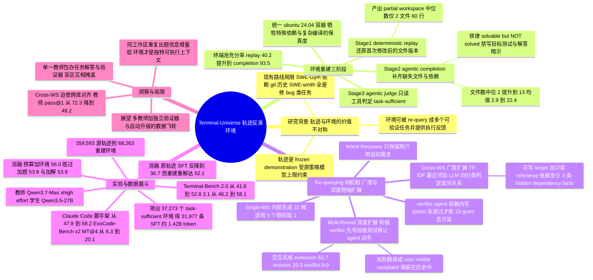

## 一、论文是干什么的？

想象一下考古现场。你手里没有一座完整的古城，只有一本古人写的施工日记：「今天我打开了西厢房第三间的账本，看到上面写着某某某；然后我把账本第 7 行改成了某某某；接着我在院子里新盖了一间柴房。」按常理，这本日记只能当故事读一遍。但如果你足够细心，就会发现——这本日记其实**把那座古城的样子写出来了**。你完全可以照着日记，把西厢房、账本、院子一砖一瓦重新盖回去，甚至把账本恢复到「他改之前」的那一页。盖好之后，这座复原的古城就不再是一本只能读一遍的日记，而是一个可以让新的工匠反复进去干活、干完还能验收的真实工地。

这篇论文干的就是这件事，只不过古城换成了**终端环境**（terminal environment），古人日记换成了**智能体轨迹**（agent trajectory）。如今 Claude Code、Codex 这类跑在命令行里的代码智能体已经产出了海量的操作记录，每一条记录里都密密麻麻写着「Read 了哪个文件、内容是什么」「Write/Edit 把文件改成了什么」。而与此同时，真正稀缺的是**可执行、可验证的环境**。作者一针见血地指出了两者的价值差距：一条轨迹是**一份被冻住的演示**，它的质量被当年那个策略模型的水平死死锁住，而且你根本没法检验它对代码库做的修改到底对不对；一个环境则完全没有这些限制——同一个任务可以让更强的模型重做一遍，结果可以用自己写的测试来验，还能在同一个工作区上出更难的题。所以对后训练来说，**值得规模化的资源是环境，不是轨迹**。

于是 Qwen 团队提出了 Terminal-Universe：把每一条轨迹**反向**还原成一个可复用的环境，再在这个环境上不断出新题、接着聊下去。用他们自己的话说，以前的做法是「从环境里 rollout 出轨迹」，而这篇论文是**把这个映射反过来**，从轨迹里恢复环境。最后的成绩单是：在公开的终端智能体轨迹上跑出 **37.3k 个任务充分的环境**，用这批数据对 Qwen3.5-27B 做监督微调，单轮的 Terminal-Bench 2.1 涨了 **11.9 分**，多轮的 EvoCode-Bench v2 MT@4 涨了 **13.8 分**。

## 二、核心方法与创新

整套流水线可以拆成三大块：**环境重建**、**重新出题**（re-querying）、**验证与筛选**。

### 2.1 环境重建：确定性重放加智能体补全

作者形式化地写道：给定一条轨迹 $\tau$，目标是恢复出一个可执行工作区 $\widehat{E}$，去逼近当年产生 $\tau$ 的那个真实环境 $E$。这个恢复过程天然是**有损的**——没被访问过的文件、隐式的系统依赖、外部网络资源，都不会在轨迹里留下痕迹。所以重建分成三阶段：

**阶段一：确定性重放**（deterministic replay）。按时间顺序处理轨迹里所有的 read、write、edit 操作，对每一个被碰过的路径，记录它在轨迹中**最早**和**最晚**可见的内容。重建出来的初始工作区 $\widehat{E}_0$ 收录的是每个原本就存在的文件的最早版本，也就是**智能体第一次动它之前的样子**；智能体自己新建的文件被排除在外，智能体做过的改动则单独存起来留作后续验证。

这一步的巧思在于「按住不放」：如果把智能体的成果也一起还原回去，那这道题就已经是解完的了。只有把它的编辑扣下来，工作区才处在未解状态，才能重新当题目用。

**阶段二：智能体补全**（agentic completion）。重放出来的 $\widehat{E}_0$ 通常残破得可怜——终端类工作区中位数只有 **2 个文件、60 行文本、0 行源代码**。于是派一个 completion agent 进去，根据恢复出来的任务 $q$ 和现有的部分工作区，把缺失的文件建起来、把残缺的文件补全、把依赖配好。它的铁律是「**让题目可解，但不许把题解出来**」——提示词里明确写着 Complete a Docker workspace so that the given task becomes solvable, but NOT solved，还特别禁止它为尚未实现的目标功能写测试、或者留下暗示答案位置的注释。

补全的效果非常显著（Table 13，中位数 / 均值）：

| 指标 | 终端池·重放后 | 终端池·补全后 | SWE 池·重放后 | SWE 池·补全后 |
|---|---|---|---|---|
| 每个工作区文件数 | 2 / 2.9 | 13 / 22.4 | 5 / 5.6 | 21 / 37.9 |
| 文本行数（全部文件） | 60 / 90 | 539 / 5,761 | 537 / 595 | 1,854 / 6,622 |
| 代码行数（源文件） | 0 / 43 | 316 / 503 | 421 / 487 | 1,643 / 6,302 |

**阶段三：环境过滤**。派一个只有只读 shell 和文件工具的 agentic judge 进去，结合任务 $q$ 判断这个工作区的源码、配置、数据和结构是否足够让一个有能力的智能体动手，标注为「充分」或「不充分」。只有充分的才留下来。

所有重建出来的工作区都跑在**统一的 ubuntu:24.04 容器**里并开放网络访问。作者坦承这是一个取舍：相比为每个仓库定制镜像，统一镜像成本低、部署简单，代价是按前人工作（Zeng et al., 2026）的报告，解题率会有小幅下降。

### 2.2 重新出题：四种玩法

环境建好了，怎么榨干它的价值？论文给了四种互补的机制。

**Intent Recovery（意图恢复）**：把原轨迹里的用户请求整理成一道自包含的任务。单轮轨迹直接用那唯一一条实质性请求；多轮轨迹则以第一条实质性请求确定主题，后面那些澄清、约束、扩展同一任务的请求并进来，跑题的请求剔除掉。关键原则是：可以借助智能体动作和文件证据来**理解**请求，但最终只保留**用户明确说过**的需求。

**Single-WS（单工作区合成）**：让离线生成器检视每个工作区，在「有据可依、结构多样、可验证」三条约束下合成 **5 个候选任务**（内部先生成 10 个候选再打分筛出 5 个不同侧重的），最后每个环境随机挑 1 个有效候选去 rollout 和验证。

**Cross-WS（跨工作区合成）——广度扩展**。这是本文最有意思的创新之一。真实开发中，程序员经常要参考另一个项目的实现，把某个能力搬到手上这个项目里。为了造出这种题，作者先让一个 agent 给每个工作区**画像**（输出 domain、subdomain、主语言、框架、核心能力、关键实体、代码级摘要的 JSON），然后在同语言分组内用 **TF-IDF 最近邻检索**候选对，再让一个 LLM judge 把每一对标成 similar、complementary、**dependency**、unrelated 四类之一，并指出谁缺、谁有。

被选中的 dependency 对，会被组装成**一个可写的 target 工作区加一个只读的 reference 工作区**（挂在另一个路径上）的双仓库任务。妙的地方在于**题面只给 target 端要达成的可观测行为和 reference 的挂载路径，绝口不提 reference 内部长什么样**——任务必须依赖至少 3 个只在 reference 里才能找到的细节，但题面既不能说出这些细节，也不能点名它的内部路径。这样一来 reference 就成了一个货真价实的依赖，解题者只能自己去读、去消化、去改写。为保证多样性，还加了「同一个工作区不得出现在两个配对里」以及使用频次上限的规则。

这种题确实更硬（Table 8）：Cross-WS 相比 Single-WS，助手轮数是 **1.6 倍**、工具调用是 **1.9 倍**、每条记录 token 数是 **1.5 倍**（中位数分别为 23 轮 / 38 次调用 / 46.5k token，对 14 轮 / 20 次 / 30.4k）；教师模型的 pass@1 也从 **72.3% 掉到 49.2%**。

**Multi-Round（多轮用户查询）——深度扩展**。做完第一轮之后，工作区**不重置**，引入一个 user agent 继续提要求。这里有两个精心设计的机制：

1. **演进式任务规格**。user agent 维护一份显式的**需求追踪表**，记录哪些需求还活跃、哪些已满足、哪些被更新过。每次追问之前先更新这张表——增加、修改或替换约束，保证随着工作区演化，对话依然连贯。
2. **轮级验证与反馈**。每一轮 user agent 提交更新后的规格，会先触发一个自动验证器**在编码智能体动手之前**写好本轮的验收测试。智能体回复之后，测试执行器同时跑新标准和仍然活跃的回归检查。最关键的一点是：**解题智能体被严格隔离在测试脚本和 traceback 之外**——它看不到测试，只能收到 user agent 把结构化测试结果翻译成的、自然的、用户视角的抱怨（比如「行数是对的，但聚合值不稳定，重跑同样的输入结果还会变」）。中间失败的轮次会**保留在对话历史里**，为错误诊断与恢复提供真实的监督信号。

user agent 提的要求分三种风格，且**作者不预设任何目标比例**，完全由本轮结果和会话上下文自然决定，实际观测到的分布（Table 17）是：**feature extension（功能扩展）62.7%**、**feature revision（缺陷修订）29.3%**、**feature conflict（需求冲突）8.0%**。会话最多延续 6 个追问轮，或直到发出终止哨兵。筛选后保留的 3,079 条记录平均 **4.51 个追问轮**（注意这指的是 user agent 的提问轮数，与后文提到的「中位数 92 轮」不是一个口径——后者是整段会话里助手侧的交互轮次），其中 **69.6% 含有一次失败并在后续修好**，恰好把「翻车再爬起来」的监督信号保住了。

### 2.3 验证与筛选

每道 Single-WS / Cross-WS 任务，都由一个专门的 verifier agent **在目标容器内部**写出一套自包含的 pytest 测试，通过反复本地执行迭代打磨，严格只检验题面里写明的公开接口和预期行为。

解答由**教师模型**在任务容器内的 Claude Code 脚手架里 rollout。筛选口径分两种：Single-WS 和 Cross-WS 是**全部测试通过才收**；Multi-Round 则改为**轮级筛选**——把终止会话末尾连续失败的那一段尾巴剪掉，只保留至少含两个验证通过轮次的会话，中间那些失败后又救回来的轮次全部保留。收下的轨迹格式化成多轮 SFT 演示，并对评测基准做严格去污染。

## 三、使用了哪些模型和计算资源？

### 3.1 LLM 模型

论文在脚注里给了一句极为干脆的交代：**All model-driven components in this work use Qwen3.7-Max (xhigh effort) as the teacher model.**——本工作中所有由模型驱动的组件，统统用 Qwen3.7-Max（xhigh 推理强度）作为教师模型。也就是说：

| 角色 | 使用的模型 |
|---|---|
| completion agent（工作区补全智能体） | Qwen3.7-Max (xhigh effort) |
| 工作区充分性判官（agentic judge） | Qwen3.7-Max (xhigh effort) |
| 任务生成器（Intent Recovery / Single-WS / Cross-WS） | Qwen3.7-Max (xhigh effort) |
| Cross-WS 工作区画像与关系判定 LLM judge | Qwen3.7-Max (xhigh effort) |
| verifier agent（测试编写智能体） | Qwen3.7-Max (xhigh effort) |
| user agent（多轮追问的用户智能体） | Qwen3.7-Max (xhigh effort) |
| 解答 rollout 的教师 | Qwen3.7-Max (xhigh effort) |
| 最终做后训练的学生模型 | **Qwen3.5-27B**（产物命名为 Terminal-Universe-27B） |

作者在局限性一节里也把这件事当成一条自我批评：**任务、解答、验证器全部出自同一个教师**，它的能力盲区会限制任务覆盖面，它在解答里犯的错也可能同样被它自己写的测试漏掉；未来应该用多个教师，并用一个独立模型来构建验证器。

**脚手架**方面：数据 rollout 用 Claude Code 脚手架；评测则同时用 **Claude Code（版本 2.1.126）** 和 **Terminus2（XML parser）** 两套。Claude Code 评测时会禁用交互与联网检索类工具（WebFetch、WebSearch、AskUserQuestion、EnterPlanMode、ExitPlanMode）。

**Terminal-Bench 上对比过的模型**（Table 3，均为终端任务合成方法产出的模型）：基线与教师是 Qwen3.5-27B 与 Qwen3.7-Max；对比方法包括 TerminalTraj-32B、TermiGen-32B、LiberCoder-235B、Nemotron-Terminal-32B、SkillSynth-32B、Terminal-World-32B、Terminal-Lego-32B、CLI-Universe-32B、TMax-27B、OpenThinker-Agent-32B、Meta-Task-32B、RST-27B、CalibForge-35B-A3B、FACET-Terminal-27B，共 14 个同类模型。其中带星号的 5 个开源权重基线（Nemotron-Terminal-32B、OpenThinker-Agent-32B、TermiGen-32B、TerminalTraj-32B、TMax-27B）是作者自己按 Appendix G 的配置复现测出来的。

### 3.2 计算资源

**GPU 相关信息：暂无相关信息。** 全文没有给出任何 GPU 型号、卡数、节点数或训练集群规模，也没有说明训练框架。论文披露的算力细节只有以下几项：

- **评测容器规格**：每个容器配 **12 个 CPU 核心加 32 GiB 内存**。
- **环境镜像**：统一的 ubuntu:24.04 容器，开放网络访问以便拉取缺失依赖。
- **重放框架**：致谢部分提到「感谢 Ye Li 对**基于 CPU 的重放框架**的贡献，它使得大规模环境重建得以高效进行」——说明确定性重放这一步是纯 CPU 作业，但具体规模未披露。
- **API 与否**：论文只写使用 Qwen3.7-Max（xhigh effort），未说明是走内部 API 还是自建推理集群，也未给出 token 消耗量或费用。

**训练超参数**（这部分是明确的）：对 Qwen3.5-27B 做 SFT，训练 **2 个 epoch**，恒定学习率 $7\times 10^{-6}$，全局批量 **256**，序列长度 **256k token**。训练前先对 Terminal-Bench 任务做 **13-gram 污染检查**，并把所有源自 Terminal-Bench 的数据集从四种重新出题变体中全部排除。训练语料合计约 **1.42B token**。

### 3.3 每个完整计算单位的耗时

**还原一个环境平均多久、以及后训练消耗多少 GPU 小时：暂无相关信息。** 论文没有报告单个环境的重建耗时，也没有报告训练总时长或 GPU 小时数。可查到的时间预算类数字全部是**单次 rollout 或评测的上限**，而非实测均值：

| 场景 | 时间与步数预算 |
|---|---|
| 解答 rollout（数据合成） | 单次上限 4 小时 wall-clock，最多 500 个智能体轮次 |
| Terminal-Bench 2.0 / 2.1 评测 | 同上，4 小时 wall-clock 上限、最多 500 轮 |
| EvoCode-Bench v2 单个有状态任务 | 总计上限 10 小时 wall-clock，每个请求轮最多 500 轮 |
| Multi-Round 会话长度 | 最多 6 个追问轮，或到终止哨兵为止 |

另外，解码配置为温度 1.0、top-p 0.95、交错思考、256k 上下文窗口，单轮回复上限 65,536 token，达到 176k token 时触发主动摘要。Terminal-Bench 分数是 **6 次独立运行**的平均通过率，EvoCode-Bench v2 是 **4 次独立运行**。

## 四、实验结果

### 4.1 数据规模：从 35.9 万条轨迹到 3.7 万个环境

先看漏斗（Appendix A，Table 12）。种子筛选规则是：轨迹结束时观察到的工作区状态至少含 **5 个文件、100 行**内容，且严格剔除所有源自 Terminal-Bench 的语料。

| 源语料 | 池 | 许可证 | 源轨迹数 | 重建出的环境数 |
|---|---|---|---|---|
| SWE-rebench | SWE | CC-BY-4.0 | 67,074 | 6,118 |
| SWE-smith | SWE | MIT | 95,851 | 8,476 |
| CoderForge | SWE | Apache-2.0 | 32,964 | 3,978 |
| SWE-Gym | SWE | MIT | 4,152 | 929 |
| LFM2-Terminal | Terminal | CC-BY-4.0 | 139,841 | 46,037 |
| LiteCoder-Terminal | Terminal | MIT | 19,711 | 2,725 |
| 合计 | | | **359,593** | **68,263** |

经过污染过滤和仓库级去重后，进入充分性判定的是 **38,294 个终端环境加 1,900 个 SWE 仓库**。判定结果（Table 2）：

| 池 | 环境数 | 仅重放的充分率 | 补全后的充分率 |
|---|---|---|---|
| Terminal | 38,294 | 40.2% | **93.5%** |
| SWE | 1,900 | 20.1% | **77.1%** |

**最终得到 37,273 个（即 37.3k）完全充分的环境。** 这批环境里，Python 是绝对主力（占主语言的 **84.7%**），其次是 C++ 和 C；技术领域上，数据处理、DevOps 和安全三类合计占了 **80% 以上**。

**合成的任务量**：经验证器筛选后，Single-WS、Cross-WS、Multi-Round 三路合计产出 **31,977 条 SFT 演示**（Single-WS **25,386** 条、Cross-WS **3,512** 条、Multi-Round **3,079** 条），约 **1.42B 训练 token**。此外 Intent Recovery 单独产出 **35,809** 条（用于消融）。各语料的每条中位统计（Table 19）：

| 数据集 | 记录数 | 轮数 | 工具调用 | token |
|---|---|---|---|---|
| Intent Recovery | 35,809 | 12 | 17 | 36.1k |
| Single-WS | 25,386 | 14 | 20 | 30.4k |
| Cross-WS | 3,512 | 23 | 38 | 46.5k |
| Multi-Round | 3,079 | 92 | 102 | 126.1k |

在 Table 1 的横向对比中，Terminal-Universe 以 **37.3k 环境 / 32.0k 任务**的规模，成为唯一同时具备可执行验证器、多轮扩展和跨工作区合成三项能力的方法（对照组里 RST 有 37.5k 环境但无多轮无跨仓，TMax 14.6k，CLI-Universe 6k，CLI-Gym 只有 29 个环境）。

### 4.2 主结果：单轮加 11.9 分，多轮加 13.8 分

| 模型 | 基座 | 数据量 | 脚手架 | TB2.0 | TB2.1 | EvoCode MT@4 | Case Score |
|---|---|---|---|---|---|---|---|
| Qwen3.5-27B（基座） | - | - | Terminus2 | 41.6 | 46.2 | 6.3 | 67.8 |
| Qwen3.7-Max（教师） | - | - | Terminus2 | 69.7 | 74.5 | 39.8 | 83.4 |
| RST-27B | Qwen3.5-27B | 37.5k | Terminus2 | 49.4 | - | - | - |
| TMax-27B | Qwen3.6-27B | 14.6k | Vanillux2Agent | 42.7 | 44.9 | 17.1 | 72.5 |
| CalibForge-35B-A3B | Qwen3.5-35B-A3B | 5.4k | CalibForge-Eval | 47.6 | - | - | - |
| FACET-Terminal-27B | Qwen3.5-27B | 1.2k | Terminus2 | - | 47.6 | - | - |
| **Terminal-Universe-27B** | Qwen3.5-27B | 32.0k | Terminus2 | **52.8** | **58.1** | **20.1** | **76.1** |

具体提升幅度：

- **Terminal-Bench 2.0**：41.6 到 **52.8**，**提升 11.2 分**（Terminus2-XML）
- **Terminal-Bench 2.1**：46.2 到 **58.1**，**提升 11.9 分**（Terminus2-XML）
- **Terminal-Bench 2.1（Claude Code 脚手架）**：47.8 到 **58.2**，**提升 10.4 分**
- **EvoCode-Bench v2 MT@4**：6.3 到 **20.1**，**提升 13.8 分**
- **EvoCode-Bench v2 Case Score**：67.8 到 **76.1**，**提升 8.3 分**

值得一提的是，EvoCode-Bench v2 只有 26 道编程任务但含 227 个交互轮（每题 5 到 15 个请求），工作区和会话全程持续，验证器会**累积检查**当前需求和之前仍然活跃的需求；MT@4 用的是 fail-stop 计分——一次运行只对它**第一次失败之前连续通过的那些轮**给分。基座模型只拿到 6.3 分，说明它几乎撑不过前两轮就崩了，而训练后能撑到 20.1 分。

### 4.3 消融：每一块都在出力

**（1）重建再解题对比直接模仿原轨迹**（Table 4，Terminal-Bench 2.1）。这是全文最关键的一组对照，因为它直接回答「到底有没有必要费劲重建环境」：

| 变体 | 数据量 | Claude Code | Terminus2-XML | 平均 |
|---|---|---|---|---|
| Qwen3.5-27B | - | 47.8 | 46.2 | 47.0 |
| 直接 SFT 原始轨迹 | 35.8k | 33.0 | 40.3 | **36.7** |
| Intent Recovery（重建后重解） | 35.8k | 51.3 | 52.9 | **52.1** |

结论相当震撼：**直接模仿原始轨迹不但没提升，反而把模型从 47.0 拖到 36.7**；而在重建环境里用更强教师重新解一遍，则提升到 52.1。同样的题、同样的模板、同样的工具调用格式，差别只在于谁来解、在哪解。

**（2）智能体补全值不值**（Table 5）：仅重放 48.7 分，重放加补全 **52.9** 分，**相差 4.2 分**，而且方差从正负 3.5 收窄到正负 1.4。有意思的是，仅重放也比基座高 2.5 分——检查 rollout 发现，教师面对残破工作区时常常**先动手修文件和环境再解题**，这些轨迹仍有价值，只是相当一部分监督信号跑去修工作区了。

**（3）验证器筛选值不值**（Table 6）：Single-WS 上，筛与不筛几乎打平（56.4 对 56.0），但筛完只剩 25.4k 条（原 35.1k）；Cross-WS 上差距明显——不筛 53.2 分，筛完 **55.4** 分，而数据量只有原来的**不到一半**（3.5k 对 7.1k）。**任务越难，验证器筛选越值钱。**

**（4）广度扩展**（Table 7）：Single-WS 单独 56.4，Cross-WS 单独 55.4（只用 3.5k 数据），两者混合 **58.4**。按任务类别拆开看（Figure 6），最大类别 software engineering（26 道题）从 46.9 提到 49.1，model training **提升 15.0**、debugging **提升 10.0**；有三个类别下降 2.1 到 2.5 分，但这些类别最多只有 8 道题，落在运行间波动范围内。

**（5）深度扩展**（Table 9，EvoCode-Bench v2）：

| 变体 | 数据量 | MT@4 | Case Score |
|---|---|---|---|
| Single-WS | 25.4k | 18.4 | 71.9 |
| Single-WS 加 Multi-Round | 28.5k | **21.0** | **76.9** |
| Single-WS 加 Multi-Round（去掉轮级验证器） | 28.5k | 18.8 | 73.2 |

去掉轮级验证器反馈，MT@4 掉 2.2 分、Case Score 掉 3.7 分。作者检查轨迹后发现：**没有「到底哪里还不对」这个有依据的信号，续写就会失去方向，产出更长但质量更低的多轮轨迹。**

**（6）固定预算该花在哪**（Table 10）。从一个 17,558 个环境、每环境 1 题 1 解（17.6k 条）的公共基础池出发，沿三个方向各翻一倍到约 35k 条：

| 变体 | 环境数 | 题/环境 | 解/题 | 记录数 | TB2.1 |
|---|---|---|---|---|---|
| 基础池 | 17,558 | 1 | 1 | 17.6k | 53.2 |
| 加环境 | 35,116 | 1 | 1 | 35.1k | **56.0** |
| 加题目 | 17,558 | 2 | 1 | 35.1k | 53.8 |
| 加解答 | 17,558 | 1 | 2 | 35.1k | 53.9 |

**只有加环境真正带来提升（53.2 到 56.0），加题和加解基本原地踏步。** 这条结论直接印证了论文的核心主张——每一个新环境都贡献一份独特的可执行上下文，而在同一个工作区上多出一道题或多写一份解答，模型基本已经见过了。

**（7）跨领域泛化**（Table 11）：把 Intent Recovery 用在 SWE 工作区（而非终端工作区）上，1,900 个 SWE 仓库中有 **1,464 个**被判为任务充分，产出约 **10.3k** 条训练轨迹。训练后在 Terminal-Bench 2.1 上平均从 47.0 提到 **50.0**（Claude Code 47.8 到 50.6，Terminus2-XML 46.2 到 49.4），两套脚手架同向移动，说明 **SWE 工作区合成的数据对终端智能体行为同样有用**。反方向（终端到 SWE）作者留给了未来工作。

### 4.4 一个质量抽检

作者手工检查了 30 个随机抽样的终端补全结果：**22 个只包含与任务相关的支撑文件**，8 个引入了不必要的大段文件或代码；**30 个补全工作区中没有发现任何一个泄露了任务解答**。这算是对 completion agent「让题可解但不解题」这条铁律的一次人工验收。

## 五、潜在应用与已落地应用

**潜在方向**：

1. **智能体训练数据工厂**。任何积累了大量智能体操作日志的团队（IDE 插件厂商、CI 平台、内部研发工具），理论上都能把已经跑过的历史二次利用成训练环境，而不必从零搭一堆 Docker 镜像。这大概是这篇工作最直接的产业价值。
2. **从 SFT 走向 RL**。论文本身只做了监督微调，但可执行加可验证的环境天然是强化学习的燃料。作者在开篇就强调环境提供执行反馈，把这条路铺得很明白。
3. **多轮交互能力的定向训练**。深度扩展造出的 3,079 条多轮会话，中位数 92 轮、126.1k token，且 69.6% 含有「翻车再修好」的片段。这类数据在真实产品里极难标注，但对「用户抱怨到智能体定位再到修复」这一闭环能力至关重要。
4. **环境复杂度的聚合放大**。作者在讨论里提到一个很有想象力的思路：**当多个会话操作同一个工作区时，把它们一起重放，各自暴露的状态会被合并进同一次重建**，从而产生比任何单条轨迹都更复杂的环境。
5. **随智能体能力自动升级的飞轮**。论文观察到源轨迹的复杂度与合成任务的复杂度正相关——多文件操作、长工具链的轨迹能暴露更广的工作区状态，进而支撑更难的题。这意味着**智能体越强，产出的轨迹越复杂，能重建的环境也越好**，框架会随行业进步自然水涨船高。

**已落地情况**：论文来自 Qwen 团队，产出的模型命名为 Terminal-Universe-27B，基于 Qwen3.5-27B。不过**全文没有给出代码仓库、数据集或模型权重的开放地址**，也没有说明是否会开源；HuggingFace 论文页面上显示引用该论文的模型、数据集、Space 均为 0。所用的六份源语料本身都是公开数据集（SWE-rebench、SWE-smith、CoderForge、SWE-Gym、LFM2-Terminal、LiteCoder-Terminal），许可证从 MIT 到 CC-BY-4.0 不等。**是否已在 Qwen 产品线中实际使用：暂无相关信息。**

**作者自陈的局限**：第一，全部用标准 Ubuntu 24.04 容器而非像 SWE-Factory、RepoLaunch 那样为每个仓库定制环境，遇到需要特殊系统依赖或复杂编译步骤的边缘情况会失真；第二，重建工作区的领域、语言、工具链分布**从根上受限于源轨迹的覆盖范围**；第三，就是前面提过的单一教师包办任务、解答、验证器的问题。

## 六、网络上的讨论与评价

**HuggingFace 论文页面**（[huggingface.co/papers/2609.04148](https://huggingface.co/papers/2609.04148)）：这篇论文由 taesiri 于 9 月 4 日提交，被列为 **#2 Paper of the day**，归入 Qwen 组织名下。截至查阅时页面显示 **213 个 upvote**（本文 frontmatter 记录的是收录当时的 121 票），已被 2 个 Collection 收录（Code 合集与 Workspace 合集）。**但页面的 Community 讨论区目前是空的，没有任何评论。**

**alphaXiv**（[alphaxiv.org/abs/2609.04148](https://www.alphaxiv.org/abs/2609.04148)）：该页面已有一份自动生成的 AI Overview，把论文定位为「弥合已录制轨迹与可执行环境之间鸿沟的框架」，并强调它不靠人工整理仓库、也不从零合成环境，而是从轨迹的工具执行历史里恢复潜在的工作区状态。页面显示 7 次收藏，**未见人类撰写的评论或讨论**。

**Hacker News**：通过 Algolia 全站检索 Terminal-Universe 与 arxiv ID 2609.04148，**没有检索到任何相关的提交或评论**（命中的都是与终端软件生态无关的旧帖）。

**Reddit**：搜索接口返回网络安全拦截（需登录），**未能获取内容**。

**X / Twitter 及中文社区**：多轮检索均**未发现针对这篇论文的具体讨论**。搜索结果大量返回的是 Qwen 团队的其他相关工作（如 Qwen-AgentWorld 语言世界模型）以及同赛道的对比方法（CLI-Universe、TMax 等），说明「终端智能体环境合成」这个方向本身在 2026 年相当热闹，但 Terminal-Universe 本篇由于发布仅一天左右，尚未沉淀出可引用的社区评价。

**小结**：这篇论文的**票数热度很高**（Paper of the day 第 2 名、200 票以上），说明方向本身很受关注，但**目前还没有形成实质性的公开技术讨论**。这与它发布时间极短（2026-09-03 上线，2026-09-04 综述）直接相关。有兴趣的读者可以过一段时间再回访 HuggingFace 与 alphaXiv 页面。

## 七、思维导图

