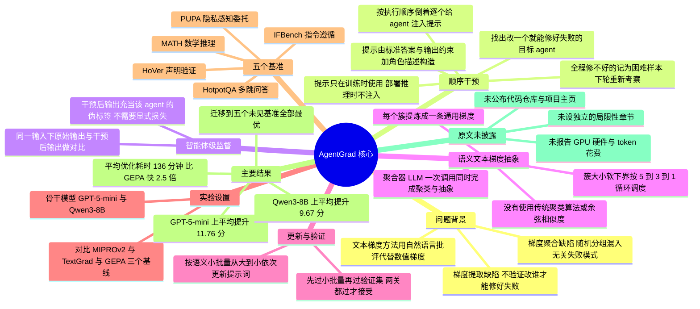

## 一、论文是干什么的？

现在很多 AI 应用不是只用一个大模型，而是让好几个「智能体」（agent）分工协作。比如一个多跳问答系统：第一个智能体负责把问题拆成检索词，第二个负责从检索到的文档里挑证据，第三个负责综合证据写出最终答案。每个智能体的行为由它自己的一段**提示词**（prompt）决定。提示词写得好不好，直接决定整个系统答对还是答错。

问题是，提示词该怎么写？人手工调太慢，于是有了自动提示词优化。其中最主流的一派叫**文本梯度**（textual gradient），代表作是 TextGrad。它的思路很聪明：数值神经网络靠梯度（一个数字，告诉你参数该往哪个方向挪）来更新参数；那大模型系统能不能靠一段自然语言批评来更新提示词？比如让另一个 LLM 读一遍失败案例，然后写下「你的提示词没有要求把人名替换成占位符，建议加上这条」，这段话就相当于梯度，照着改就是一次参数更新。

这篇论文指出，现有文本梯度方法在多智能体场景下有两个很实在的毛病。**第一个毛病在求梯度这一步**：系统答错了，但错在哪个智能体身上？现有方法要么把所有智能体的提示词一起改（贵得离谱），要么轮流改（这次改一号，下次改二号），完全不去验证「改这个到底能不能修好这次失败」。这就像家里电器跳闸，你不查是哪个插座短路，而是轮流换全屋的插座。**第二个毛病在聚合梯度这一步**：把好几条批评意见随机凑一批、直接首尾相接扔给提示词优化器。这批意见里可能一条说要保护隐私、一条说要按格式输出、一条说要多检索一轮——三件毫不相关的事混在一起，优化器不知道该往哪改，改出来的提示词就成了缝合怪，换个测试样本就失效。

AgentGrad 的解法对症下药：用**顺序干预**（sequential intervention）一次只点拨一个智能体，看看谁被点拨之后整个系统就答对了，谁就是罪魁祸首；再把被点拨后产生的那份改良输出当成这个智能体的标准答案（伪标签），从中提取非常具体的改进意见。然后用**语义文本梯度抽象**（semantic textual gradient abstraction）把讲同一件事的批评意见聚成一堆，提炼成一条通用规则，再拿去改提示词。结果是：五个基准全面领先，优化速度还平均快了 2.5 倍。

## 二、核心方法与创新

### 2.1 先把符号说清楚

论文把一个多智能体系统记作 $\Pi$，它由 $N$ 个基于 LLM 的智能体 $(\pi^{1},\ldots,\pi^{N})$ 组成。每个智能体各有一段提示词，全部提示词合起来记作 $\mathcal{P}=(p^{1},\ldots,p^{N})$。给一个输入 $x$，系统产出 $\hat{y}=\Pi(x;\mathcal{P})$。有一个打分函数 $r$（奖励函数），把输出和标准答案 $y$ 比较后给出 0 到 1 之间的分数。

优化目标就是找一组最好的提示词 $\mathcal{P}^{*}$：

$$
\mathcal{P}^{*}=\arg\max_{\mathcal{P}}\,\mathbb{E}_{(x,y)\sim\mathcal{D}_{\text{val}}}\,r\!\left(\Pi(x;\mathcal{P}),\,y\right),\quad\text{s.t. }\#\text{rollouts}\leq B.
$$

逐项解释：$\arg\max_{\mathcal{P}}$ 表示在所有可能的提示词组合里挑一个让后面那个值最大的；$\mathbb{E}_{(x,y)\sim\mathcal{D}_{\text{val}}}$ 是在验证集 $\mathcal{D}_{\text{val}}$ 上取平均；$r(\cdot)$ 是打分；约束条件 $\#\text{rollouts}\leq B$ 意思是「整个跑系统加打分的次数不能超过预算 $B$ 次」——因为每跑一次都要花真金白银调用 LLM，所以这是个**有预算上限的搜索问题**，谁能在同样预算内跑出更好结果谁就赢。

传统文本梯度的定义（沿用 TextGrad 的写法）是：

$$
\frac{\partial\mathcal{L}}{\partial p}=\text{LLM}_{\nabla}\!\left(p,\hat{y},\mathcal{L}\right),
$$

这里 $\mathcal{L}$ 是损失，但它不是数字，而是一段描述失败原因的自然语言；$\hat{y}$ 是当前输出；$\text{LLM}_{\nabla}$ 是一个专门负责求梯度的 LLM，读完这三样东西后吐出一段批评。这个偏导数符号只是个比喻，实际算出来的是文字。

### 2.2 创新点一：顺序干预，挨个排查谁修好算谁的

**类比**：一串老式圣诞彩灯不亮了，串联的，坏一个全灭。怎么找坏灯泡？拿一个好灯泡从最后一个位置开始往前挨个替换，换到哪个位置灯亮了，那个就是坏的。AgentGrad 干的就是这件事，只不过把「换好灯泡」换成了「往这个智能体的提示词里塞一条提示（hint）」。

具体流程（论文算法 1）：

1. 先用当前提示词跑一遍训练集，把答错的样本收集成失败集合 $\mathcal{F}$。
2. **按执行顺序倒着来**，从第 $N$ 个智能体到第 1 个智能体。对第 $n$ 个智能体，往它的提示词里注入提示 $\mathcal{H}$，重跑系统，看哪些失败样本被救回来了：

$$
\mathcal{T}^{n}=\big\{(x_{i},y_{i})\in\mathcal{F}^{n+1}\;\big|\;r\!\left(\Pi^{(n,\mathcal{H})}(x_{i};\mathcal{P}),y_{i}\right)=r_{\max}\big\},
$$

其中 $\mathcal{F}^{n+1}$ 是走到第 $n+1$ 步时还没被解决的失败集合，$\Pi^{(n,\mathcal{H})}$ 表示对第 $n$ 个智能体注入提示 $\mathcal{H}$ 之后的系统，$r_{\max}$ 是满分。这个式子读作：在还没修好的失败里，凡是点拨第 $n$ 个智能体之后拿到满分的，就归到 $\mathcal{T}^{n}$ 名下，认定第 $n$ 个智能体是**目标智能体**。

3. 被修好的从待修集合里划掉：$\mathcal{F}^{n}=\mathcal{F}^{n+1}\setminus\mathcal{T}^{n}$，然后继续排查第 $n-1$ 个。
4. 一路排查到第 1 个智能体还修不好的，算作**困难样本**，本轮先不管。但它们不会被永久丢弃——因为每一轮开始时 $\mathcal{F}$ 都是从训练集重新跑出来的，提示词更新后这些样本还会被重新考察。

**提示 $\mathcal{H}$ 怎么造？** 论文说，$\mathcal{H}$ 由标准答案 $y_{i}$ 或者最终输出必须满足的约束条件构成，再加上一些辅助上下文：数据集说明、多智能体系统结构说明、各智能体角色描述（这些都是 DSPy 等前人工作里常用的元信息）。论文特别强调：**提示 $\mathcal{H}$ 只在训练阶段使用**，优化完的提示词部署上线时不会注入任何 hint，所以不存在偷看答案的问题。

### 2.3 创新点二：智能体级监督，两份输出一对比改进方向就出来了

找到目标智能体只是第一步。更妙的是，顺序干预顺手就产出了一份免费的标准答案。

对同一个中间输入 $x_{i}^{n}$，现在手上有两份输出：

$$
\hat{y}_{i}^{n}=\pi^{n}(x_{i}^{n};p^{n}),\quad \tilde{y}_{i}^{n}=\pi^{n}(x_{i}^{n};p^{n},\mathcal{H}).
$$

$\hat{y}_{i}^{n}$ 是失败那次跑出来的原始输出，$\tilde{y}_{i}^{n}$ 是注入提示之后跑出来的改良输出。两者输入完全相同，唯一的差别就是那条提示，所以**两者之差精确隔离出了这个智能体本来该怎么做**。论文因此把 $\tilde{y}_{i}^{n}$ 当作该智能体的**伪标签**（pseudo-label）。

**类比**：学生做错一道题，老师不是笼统说「你这张卷子不及格」，而是只在第三步旁边写下正确的一行，让学生自己对比我写的和该写的。这个对比比一句不及格信息量大得多。

于是样本级文本梯度就是：

$$
\delta_{i}^{n}=\mathrm{LLM}_{\nabla}\!\left(p^{n},x_{i}^{n},\hat{y}_{i}^{n},\tilde{y}_{i}^{n}\right).
$$

它描述的是：提示词 $p^{n}$ 该怎么改，才能让这个智能体产出 $\tilde{y}_{i}^{n}$ 而不是 $\hat{y}_{i}^{n}$。

关键区别在于：标准文本梯度方法**必须有一个显式的损失 $\mathcal{L}$**，靠比较系统最终输出和标准答案得来；而 AgentGrad **完全不需要显式损失**，$\hat{y}_{i}^{n}$ 和 $\tilde{y}_{i}^{n}$ 之间的落差本身就隐含了智能体级别的监督信号。这也是论文标题里 intervention-guided（干预引导）的含义。

### 2.4 创新点三：语义文本梯度抽象，先归类再提炼

对每个智能体 $\pi^{n}$，所有归给它的失败样本各产出一条 $\delta_{i}^{n}$，汇成集合 $\Omega^{n}$。传统做法是随机抓一批直接拼接。AgentGrad 改成交给一个**聚合器 LLM**：

$$
\{\bar{\delta}^{n}_{j}\}_{j=1}^{M_{n}}=\mathrm{LLM}_{\text{Aggregator}}(\Omega^{n}),
$$

其中 $\bar{\delta}^{n}_{j}$ 是第 $j$ 条通用梯度，$M_{n}$ 是聚出的簇数。注意 $M_{n}$ **由聚合器 LLM 自己决定**，不是人工设定的超参数。

这里要澄清一个容易误会的点：**论文用的不是 K-means 之类的传统聚类算法，也没有用向量余弦相似度这类显式度量**。聚类和抽象是聚合器 LLM 在**同一次调用里耦合完成的两步**：先把语义上相近的样本级梯度分组，再把每组提炼成一条通用梯度。相似性的判断完全依赖 LLM 自身的语义理解。

**聚类粒度怎么控制？** 每个簇会诱导出一个**语义小批量** $\mathcal{D}^{n}_{j}$，即这组梯度背后那些训练失败样本。簇越大，提炼出的规律越普适；簇越小，修正越具体。为了调节抽象层次，论文给聚合器一个**簇大小的软下界**，并且这个下界按**循环调度**变化（论文给的例子是 5 到 3 到 1 再回到 5，如此循环）。这样训练过程会在粗粒度的普适规律和细粒度的具体修正之间来回摆动。这个下界是**建议而非硬约束**——当梯度之间实在差异太大凑不成一堆时，允许聚合器形成更小的簇。

**类比**：客服主管收到一百条用户投诉，不是原封不动念给客服听，而是先归类成「退款流程太慢」「客服态度」「App 闪退」三大类，每类写一条整改要求。这样整改才有方向。

论文里的定性例子很直观（图 5）：目标智能体的任务是把用户的隐私查询改写成脱敏版本，但原始输出里还是漏出了 PTV News（机构名）、Warsaw, Poland（地名）、Mishaali Kapoor（人名）这些标识符。干预后这些都被正确替换成占位符。三条样本级梯度分别指向机构名泄漏、地理位置泄漏、看起来像虚构的标识符泄漏，它们被抽象成一条通用脱敏规则：凡是能识别出某个人、组织或地点的名称和位置，都应视为敏感信息。而另一条语义不同的梯度则被排除在这个簇之外。

### 2.5 更新与双重验证：改了不一定要，得过两关

拿到通用梯度后，提示词优化器 LLM 生成候选提示词：

$$
p_{\text{new}}^{n}=\mathrm{LLM}_{\text{PromptOptimizer}}\!\left(p^{n},\bar{\delta}_{j}^{n}\right).
$$

更新顺序是**按语义小批量大小 $|\mathcal{D}_{j}^{n}|$ 从大到小**，先做影响面广的大改动，再做细微修补。每个候选要过两关：

1. 先在它自己的语义小批量 $\mathcal{D}_{j}^{n}$ 上评测，分数没提升就直接丢弃，省掉后面的开销；
2. 过了第一关，才在留出的验证集 $\mathcal{D}_{\text{val}}$ 上评测，再提升才正式接受，替换掉旧的 $p^{n}$。

两关都过才接受，否则丢弃、看下一条梯度。这个先小批量筛一遍再上验证集的设计正是速度优势的来源之一，下面实验部分会看到数据支撑。

## 三、使用了哪些模型和计算资源？

| 项目 | 论文披露的信息 |
|---|---|
| 任务 LLM（骨干模型） | 两套：闭源的 GPT-5-mini，开源的 Qwen3-8B |
| 优化器组件用什么模型 | **与任务 LLM 同一个模型**。论文明确说明，同一骨干同时充当任务 LLM 和所有优化器组件（梯度提取器、聚合器、提示词优化器），且所有对比算法都采用这一设定，保证公平 |
| GPU 与硬件 | **原文未披露**。全文未出现任何 GPU 型号、显卡数量或硬件配置说明 |
| token 消耗与金额成本 | **原文未披露**。全文未报告 token 数或费用金额 |
| 优化耗时 | 有完整的 wall-clock 数据：AgentGrad 五个基准平均 136 分钟，单个基准 88 到 244 分钟不等，详见第四节表格 |
| rollout 预算 $B$ 的具体数值 | **原文未披露具体数字**。只在优化轨迹分析里给了参照：HotpotQA 上 AgentGrad 约 1000 次 rollout 就达到约 70 分，而 GEPA 需要 6000 次以上才接近同等水平 |
| 随机种子 | 3 个，所有结果报告均值加减标准误 |
| 数据集与划分 | HotpotQA、HoVer、PUPA、IFBench 的多智能体系统结构、数据划分与奖励函数沿用 GEPA 论文的设定；MATH 沿用 MACM 论文的设定。**具体的训练集、验证集、测试集样本数原文未披露** |
| 论文篇幅 | 13 页，无附录 |

需要说明的是，这篇论文的定位是算法框架而非系统工程，所以它把计算资源这件事完全用 wall-clock 时间和 rollout 次数来表达，而没有折算成显卡小时或 API 账单。对于想复现的人来说，成本可以从 rollout 次数乘以每次系统调用的 token 量粗略估算，但论文自己没给这个数。

## 四、实验结果

### 4.1 大白话总结

三句话概括：**准确率最高、速度最快、换个数据集也还是最好**。而且第二点和第一点通常是矛盾的（想更准就得多试），AgentGrad 同时拿下，这是这篇论文最亮眼的地方。

对比的是三个强基线：MIPROv2（贝叶斯优化搜指令和示例）、TextGrad（文本梯度反向传播）、GEPA（轨迹反思加进化搜索），外加一个完全不优化的原始系统。

### 4.2 主线结果，GPT-5-mini 骨干（均值加减标准误，3 个种子）

| 方法 | HotpotQA | HoVer | PUPA | IFBench | MATH | 平均提升 |
|---|---|---|---|---|---|---|
| 不优化 | 46.33 ± 0.69 | 58.11 ± 1.01 | 84.74 ± 0.33 | 73.07 ± 0.60 | 76.48 ± 0.91 | 基准 |
| MIPROv2 | 59.00 ± 1.66 | 62.89 ± 1.34 | 88.33 ± 2.13 | 73.70 ± 0.86 | 83.13 ± 1.72 | +5.66 |
| TextGrad | 67.89 ± 1.31 | 63.22 ± 1.47 | 89.72 ± 2.43 | 73.07 ± 0.60 | 76.48 ± 0.91 | +6.33 |
| GEPA | 68.33 ± 1.55 | 63.11 ± 1.90 | 91.87 ± 1.55 | 75.23 ± 0.32 | 86.37 ± 0.50 | +9.24 |
| **AgentGrad** | **73.89 ± 1.09** | **64.78 ± 1.44** | **95.17 ± 0.49** | **76.08 ± 0.45** | **87.62 ± 0.09** | **+11.76** |

五个基准 AgentGrad 全部第一，平均比不优化高 11.76 分，比次优的 GEPA（+9.24）高出一截。优势最大的是 HotpotQA（73.89 对 GEPA 的 68.33）和 PUPA（95.17 对 91.87）。有个细节值得注意：TextGrad 在 IFBench 和 MATH 上的分数与不优化基线**一模一样**，说明它在这两个任务上一次有效更新都没找到。

### 4.3 换开源骨干 Qwen3-8B

| 方法 | HotpotQA | HoVer | PUPA | IFBench | MATH | 平均提升 |
|---|---|---|---|---|---|---|
| 不优化 | 41.33 ± 0.84 | 36.67 ± 1.02 | 80.87 ± 0.06 | 40.82 ± 1.99 | 83.24 ± 0.38 | 基准 |
| MIPROv2 | 58.33 ± 2.37 | 45.44 ± 0.68 | 85.76 ± 2.86 | 40.08 ± 2.21 | 84.68 ± 0.92 | +6.27 |
| TextGrad | 50.86 ± 5.36 | 51.44 ± 0.78 | 84.50 ± 2.31 | **42.52 ± 0.45** | 83.90 ± 0.67 | +6.06 |
| GEPA | 57.33 ± 2.54 | 50.11 ± 1.60 | 91.03 ± 1.71 | 37.53 ± 1.62 | 85.05 ± 0.48 | +7.62 |
| **AgentGrad** | **60.45 ± 1.68** | **52.11 ± 1.66** | **91.51 ± 0.72** | 41.42 ± 0.99 | **85.81 ± 0.25** | **+9.67** |

换成 80 亿参数的开源小模型，平均提升 +9.67 依然是第一。**一个客观的例外**：IFBench 上 TextGrad 的 42.52 高于 AgentGrad 的 41.42，这是全部十组主线对比里 AgentGrad 唯一没有排第一的格子，论文正文强调的是平均值领先。另外可以看到 IFBench 在 Qwen3-8B 上整体很难，GEPA 甚至比不优化还低了 3 分多。

### 4.4 优化耗时（单位为分钟，GPT-5-mini）

| 方法 | HotpotQA | HoVer | PUPA | IFBench | MATH | 平均 |
|---|---|---|---|---|---|---|
| MIPROv2 | 501 | 1226 | 304 | 581 | 431 | 608 |
| TextGrad | 899 | 1553 | 325 | 332 | 126 | 647 |
| GEPA | 346 | 390 | 319 | 269 | 360 | 337 |
| **AgentGrad** | **109** | **244** | **151** | **90** | **88** | **136** |
| 相对次优的加速比 | 3.2 倍 | 1.6 倍 | 2.0 倍 | 3.0 倍 | 1.4 倍 | **2.5 倍** |

**2.5 倍是对比 GEPA**（次快的基线），绝对时间是 AgentGrad 平均 136 分钟对 GEPA 平均 337 分钟。相对 TextGrad 则是 4.7 倍（647 对 136）。加速最明显的是 HotpotQA：AgentGrad 不到两小时跑完，GEPA 要将近六小时。即便在 TextGrad 罕见地跑得很快的 MATH 上（126 分钟），AgentGrad 也只要 88 分钟。五个基准无一例外，AgentGrad 都是最快的。

### 4.5 为什么又快又好

论文给了一组很有解释力的诊断指标（图 4，在 HotpotQA 和 PUPA 上平均）：

- **小批量改进率**，即候选更新中能在自己那个小批量上提分、从而触发验证的比例：AgentGrad 为 0.72，TextGrad 为 0.44，GEPA 为 0.28。由于只有通过小批量这一关才会去跑昂贵的验证集，这个比例越高，单位时间里 rollout 的利用效率就越高，这直接解释了 wall-clock 的加速来源。
- **验证改进率**，即触发验证后真正带来提升的比例：AgentGrad 为 0.27，对比 0.21 和 0.14。说明快不是靠降低标准换来的，接受的更新泛化性反而更强。

### 4.6 消融实验（GPT-5-mini）

TI 指基于顺序干预的目标识别，AS 指智能体级监督，STGA 指语义文本梯度抽象。

| 配置 | HotpotQA | PUPA |
|---|---|---|
| 朴素基线 | 67.89 ± 0.80 | 85.74 ± 1.65 |
| 加 TI | 69.33 ± 0.38 | 89.58 ± 1.89 |
| 加 TI 加 AS | 70.89 ± 0.62 | 92.23 ± 0.68 |
| 加 TI 加 STGA | 71.89 ± 0.29 | 93.13 ± 0.53 |
| 完整 AgentGrad | **73.89 ± 1.09** | **95.17 ± 0.49** |

三个组件都有正贡献：光是 TI 就带来 +1.44 和 +3.84 分；在 TI 基础上加 AS 再涨 +1.56 和 +2.65；在 TI 基础上加 STGA 涨 +2.56 和 +3.55。论文进一步用图 4 的诊断指标解释了分工：**TI 和 AS 主要拉高小批量改进率**（从 0.51 提到 0.87），也就是改善单个样本的梯度信号质量；**STGA 则牺牲一点小批量改进率，换来验证改进率的提升**，即改善泛化性。三个组件各司其职、互补。

### 4.7 迁移能力：换个没见过的数据集还灵不灵

把在源基准上优化好的提示词，不做任何额外优化，直接搬到同领域的另一个未见基准上测试：

| 源基准 | 目标基准 | 不优化 | MIPROv2 | TextGrad | GEPA | AgentGrad |
|---|---|---|---|---|---|---|
| HotpotQA | 2WikiMultiHopQA | 24.33 ± 0.00 | 31.11 ± 4.81 | 36.22 ± 5.43 | 44.89 ± 4.96 | **51.22 ± 1.63** |
| HoVer | EX-FEVER | 30.00 ± 0.00 | 32.89 ± 0.25 | 32.67 ± 1.49 | 31.44 ± 0.82 | **33.11 ± 0.31** |
| PUPA | PUPA-TNB | 88.40 ± 0.27 | 90.56 ± 2.20 | 89.60 ± 1.20 | 91.51 ± 3.11 | **94.38 ± 0.83** |
| IFBench | IFEval | 91.22 ± 0.11 | 91.70 ± 0.82 | 91.22 ± 0.11 | 93.15 ± 0.47 | **95.00 ± 0.72** |
| MATH | OlympiadBench | 59.33 ± 0.00 | 63.56 ± 2.92 | 66.00 ± 1.43 | 68.33 ± 1.21 | **68.33 ± 1.21** |

五个目标基准 AgentGrad 全部最优，差距最大的是 2WikiMultiHopQA（51.22 对 GEPA 的 44.89）和 PUPA-TNB（94.38 对 91.51）。这说明优化出来的提示词学到的是**可迁移的通用规律**，而不是死记硬背了训练基准的套路，这正是语义梯度抽象想要达到的效果。

### 4.8 局限性

**原文未设独立的局限性章节**，全文也没有对失败模式、伦理风险或适用边界的专门讨论。以下几点是从方法本身推出的客观约束，属于本综述的分析而非原文陈述：

- 顺序干预的提示 $\mathcal{H}$ 需要标准答案 $y_{i}$ 或明确的输出约束，所以这套方法要求训练数据带标注，纯无监督场景用不了。
- 顺序干预的排查成本随智能体数量 $N$ 线性增长，每个失败样本最坏要重跑 $N$ 次系统。规模很大的智能体系统上开销如何尚不清楚，且**原文未披露实验中各基准的智能体数量**。
- 该方法只处理改一个智能体就能修好的失败；需要多个智能体同时改动才能解决的失败会被归为困难样本跳过。
- 聚类完全交给聚合器 LLM，簇数 $M_{n}$ 不可控也不便复现验证，缺少显式的相似度度量意味着聚类质量会随模型能力波动。

## 五、潜在应用与已落地应用

**潜在方向：**

- **企业级智能体流水线调优**。凡是用 DSPy、LangGraph 这类框架搭的多环节 LLM 流水线（检索加改写加生成加校验），都可以套用这套先找出错环节再定点改提示词的思路，把工程师手工调提示词的时间省下来。
- **隐私脱敏与合规**。论文的 PUPA 基准本身就是隐私感知委托任务，定性例子展示了系统如何自动学会人名、机构名、地名都要替换成占位符这类脱敏规则。合规审核、数据出境脱敏这类场景天然契合。
- **多智能体系统的调试工具**。顺序干预本质上是一种**故障归因**（failure attribution）机制，即便不拿去优化提示词，单独用来回答「我的智能体流水线今天为什么错了、错在哪一环」也很有价值，这正是论文相关工作里提到的那条干预式调试研究线。
- **低成本迭代**。2.5 倍的加速意味着同样的时间预算可以多跑几轮优化，或者把优化频率从每月一次提到每周一次，让提示词跟上业务数据分布的漂移。
- **小模型追赶大模型**。Qwen3-8B 上的实验表明，光靠提示词优化就能把开源小模型在 HotpotQA 上从 41.33 拉到 60.45，对本地部署、成本敏感的团队很有吸引力。

**已落地情况：**

截至 2026 年 9 月 11 日，**论文中没有给出任何代码仓库链接或项目主页**，arXiv 页面、HuggingFace 论文页面均未挂出 GitHub 地址，网络检索也未找到官方开源实现。因此目前**没有已知的开源代码或工业落地案例**。不过论文的实验设定大量沿用 GEPA（用于四个基准）和 MACM（用于 MATH）的公开配置，对想自行复现的人来说门槛不算太高。

## 六、网络上的讨论与评价

- **HuggingFace Daily Papers**：该论文于 2026 年 9 月 10 日被推上 HF 每日论文，截至 2026 年 9 月 11 日获得 **89 票**（精确数字，从页面数据中提取）。页面上**没有检索到任何用户评论**，讨论区为空。
- **聚合站点转载**：[HyperAI 超神经的论文页面](https://hyper.ai/en/papers/2609.08572) 收录了该论文，但内容是摘要与要点的自动整理，没有独立评论或人工点评。
- **Hacker News、Reddit、知乎**：截至 2026 年 9 月 11 日，多次检索均**未检索到任何针对 AgentGrad 的专门讨论帖**。搜索结果返回的都是关于 TextGrad、GEPA、提示词优化这一大方向的通用讨论，例如 [TextGrad 的中文解读](https://zhuanlan.zhihu.com/p/9192012739) 和 [智能体优化工具箱综述](https://gradientflow.substack.com/p/inside-the-agent-optimization-toolkit)，并无一篇提及本文。
- **领域热度**：从检索结果可以看出，2026 年多智能体提示词优化是个相当拥挤的赛道，同期还有 MASPO、MASPOB、MAS-PromptBench、SPEAR 等多篇同主题论文，说明这个方向正在快速升温，但也意味着 AgentGrad 面临的横向比较会越来越多。

**小结：** 论文获得了不错的社区关注度（89 票在 HF 上算中上水平），但**尚无深入的社区技术讨论、复现报告或批评意见**。这与论文发布仅三天、且未开源代码有关。

## 七、思维导图

