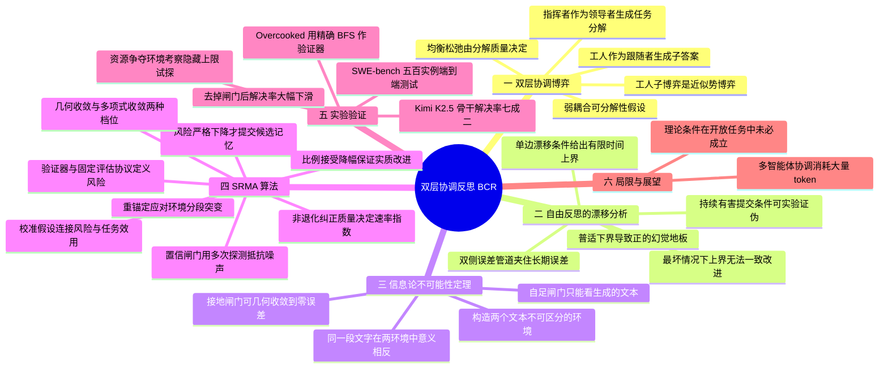

## 一、论文是干什么的？

现在很流行让一堆大模型「组队干活」：一个**指挥者**（orchestrator）把大任务拆成小任务，分给若干**工人**（worker）模型去做；干完一轮之后，大家写「复盘笔记」（论文里叫 reflection，反思）存进一块共享的文字记忆里，下一轮带着这些笔记再干一次。AutoGen、MetaGPT 这类框架都是这个套路，效果确实不错。

但论文作者指出了一个尴尬的现状：**这些系统只有流程说明书，没有理论**。现有文献告诉你「谁跟谁说话」「更新哪个缓冲区」，却回答不了三个问题。第一，指挥者把任务拆得好不好，到底怎样影响工人之间的配合？第二，无脑地一直写复盘笔记，什么时候会真的收敛、什么时候只会卡在一个水平上不动？第三，为什么一个「外部验证器」（比如跑一遍单元测试）能成功，而一个能力更强的「纯文本评审员」却可能失败？

打个生活化的比方。想象一家装修公司：**项目经理**把「装修一套房」拆成水电、木工、油漆几块分给不同师傅；师傅之间难免互相牵扯（水电没走好，木工就没法钉柜子）。每天收工后大家开复盘会，把经验教训写进工地手册。问题是，如果复盘会上有人凭感觉瞎总结（大模型的幻觉），错误的经验会被白纸黑字写进手册，后面所有人都照着错的干，越干越歪。这时候有两种把关人：一种是只听大家开会发言、不去工地看的**会议记录员**；另一种是**拿着卷尺和水平仪去现场实测**的监理。这篇论文用数学严格证明了一件事：**会议记录员这条路在原理上就走不通，无论他有多聪明**；而拿卷尺的监理可以。

论文把这一整套东西装进一个统一框架：用**双层博弈**刻画指挥与执行的关系，用**随机漂移分析**刻画记忆的演化，用**信息论不可能性定理**刻画验证的必要性，最后给出一个叫 **SRMA**（Stochastic Reflective Memory Ascent，随机反思记忆上升）的算法并证明其收敛速率。实验从玩具环境一路做到 SWE-bench 真实代码修复，500 道题上解决率 72.2 个百分点。

## 二、核心方法与创新

### 2.1 第一层：把指挥者与工人建模成双层协调博弈

设用户的复杂问题是 $q\in\mathcal{Q}$，系统要产出一个联合结构化输出 $x\in\mathcal{X}$，目标是让全局效用 $U(x)$（逻辑正确性、约束满足度）最大。

- $q$：用户的问题；$\mathcal{Q}$：所有可能问题构成的集合。
- $x$：整个团队最终交付的答案；$\mathcal{X}$：所有可能答案构成的集合。
- $U(x)$：打分函数，分数越高说明这份答案越好。

如果用单个智能体硬刚，就是直接采样

$$
x\sim p_{\mathrm{LLM}}(\cdot\mid q)
$$

这里 $p_{\mathrm{LLM}}(\cdot\mid q)$ 表示「冻结参数的大模型在给定 $q$ 的条件下生成文本的概率分布」，符号 $\sim$ 读作「从这个分布里采样」，中间的点号 $\cdot$ 是待填入的随机变量占位符。论文引用已有工作说明，任务一大，这样做会出现上下文稀释与推理退化。

于是改成双层结构。**指挥者**（Leader，领导者）先生成一份任务分解方案

$$
\tau\sim p_{\mathrm{LLM}}(\cdot\mid q),\qquad \tau=(\tau_{1},\ldots,\tau_{N})\in\mathcal{T}
$$

- $\tau$（读作 tau）：整份分解方案；$\tau_i$：分给第 $i$ 号工人的子任务；$N$：工人数量；$\mathcal{T}$：所有可能分解方案的集合。

然后每个**工人**（Follower，跟随者）各自生成子答案 $x_{i}\sim p_{\mathrm{LLM}}(\cdot\mid\tau_{i})$，拼起来就是 $x=(x_{1},\ldots,x_{N})$。

「双层」的意思是：上层（指挥者）先动，下层（工人）在上层给定的条件下再动，上层还要预判下层的结果。这跟装修公司里「项目经理先排工序，师傅们在既定工序下互相配合」是一回事。

### 2.2 弱耦合假设：把「师傅之间互相牵扯」量化

现实中子任务不可能完全独立（共享变量、公共接口、联合约束）。论文的**假设 1**（弱耦合可分解性）要求每个工人的动作集合 $\mathcal{X}_i$ 是有限的，工人 $i$ 自己的收益就是本地目标 $g_{i}(x;\tau):=u_{i}(x_{i}\mid\tau_{i})$，而系统级目标可以写成：

$$
U(x)=\sum_{i=1}^{N}u_{i}(x_{i}\mid\tau_{i})+\sum_{(i,j)\in\mathcal{E}}\psi_{ij}(x_{i},x_{j}\mid\tau_{i},\tau_{j})
$$

逐符号解释：

- $\sum_{i=1}^{N}u_{i}(x_{i}\mid\tau_{i})$：**各干各的那部分分数**。$u_i$ 是第 $i$ 个工人在子任务 $\tau_i$ 下交出 $x_i$ 所得的本地效用。
- $\mathcal{E}$：一张**无向交互图**的边集，由分解方案 $\tau$ 决定。$(i,j)\in\mathcal{E}$ 表示第 $i$ 和第 $j$ 个工人之间存在牵扯；每条边只计一次。
- $\psi_{ij}$（读作 psi）：**耦合项**，表示这两个工人的答案配不配得上，配得好加分、配不好扣分。
- $\kappa:=\sup_{(i,j)\in\mathcal{E}}\sup_{x_{i},x_{j}}|\psi_{ij}(x_{i},x_{j}\mid\tau_{i},\tau_{j})|<\infty$：**耦合强度上界**（读作 kappa）。$\sup$ 是上确界，可以粗略理解成最大值；竖线 $|\cdot|$ 是绝对值。$\kappa$ 就是「最严重的一处互相牵扯能有多大影响」。
- $\mathcal{N}_{i}$：工人 $i$ 的耦合邻居集合；$d_{\max}:=\max_{i}|\mathcal{N}_{i}|$：**最大邻居数**，也就是「牵扯最多的那个师傅要跟几个人对接」。

当 $\kappa=0$ 时退化为完全独立的情况。所以 $\kappa$ 和 $d_{\max}$ 这两个数**联合刻画了分解质量**，拆得好就是既少牵扯又少对接人。由于大模型生成是随机的，系统目标实际取期望 $\mathbb{E}[U(x)]$（$\mathbb{E}$ 表示数学期望，即平均而言）。

### 2.3 引理 1 与定理 1：工人的子博弈是近似势博弈

**势博弈**（potential game）是博弈论里最好用的一类博弈：存在一个全局的势函数，任何一个玩家单方面改变策略给自己带来的收益变化，恰好等于势函数的变化。这样一来，每个人自私地改进自己，全局势函数就单调上升，一定会停下来，不会出现无限循环互相拆台。

**引理 1（近似势博弈）**：在假设 1 和固定 $\tau$ 下，工人们的子博弈是一个 $\eta_{c}$-近似势博弈，势函数为 $\mathbb{E}[U(x)]$，松弛量满足

$$
\eta_{c}\;\leq\;2\,d_{\max}\,\kappa
$$

- $\eta_{c}$（读作 eta）：**均衡松弛量**，即「自私改进」和「全局改进」之间最大的偏差。
- 证明思路很直观：工人 $i$ 单方面从 $x_i^{t}$ 换成 $x_i^{t+1}$ 时，全局效用的变化等于本地效用变化再加上一个**耦合残差** $\Delta_{i}^{\psi}$；这个残差最多由 $d_{\max}$ 项组成，每项因 $|\psi_{ij}|\leq\kappa$ 而至多贡献 $2\kappa$（一进一出），故 $|\Delta_{i}^{\psi}|\leq 2d_{\max}\kappa=:\eta_{c}$。

一个理性工人只在收益提升**超过** $\eta_c$ 时才更新，即 $\mathbb{E}[u_{i}(x_{i}^{t+1}\mid\tau_{i})]-\mathbb{E}[u_{i}(x_{i}^{t}\mid\tau_{i})]>\eta_{c}$，这叫 $\eta_{c}$-更优响应（better response）。

**定理 1（跟随者子博弈的收敛性）**：反复执行 $\eta_{c}$-更优响应，**有限步内**必定收敛到某个 $x^{*}(\tau)$，且对每个工人 $i$：

$$
\mathbb{E}[g_{i}(x_{i}^{*},x_{-i}^{*};\tau)]\geq\max_{x_{i}^{\prime}\in\mathcal{X}_{i}}\mathbb{E}[g_{i}(x_{i}^{\prime},x_{-i}^{*};\tau)]-\eta_{c}
$$

- $x_{-i}^{*}$：下标 $-i$ 表示「除了 $i$ 之外的所有人」，即别人都保持均衡策略。
- 这个不等式的意思是：**在别人不变的前提下，我就算换成最优的做法，也最多只能多赚 $\eta_{c}$**。所以 $x^{*}(\tau)$ 是一个 $\eta_{c}$-近似纯策略纳什均衡。
- 证明要点：每次更新都让势函数 $\mathbb{E}[U(x^{t})]$ 严格上升一个正量，而 $\mathcal{X}$ 有限、$U$ 有界，所以不可能无限上升，必然有限步停止。

**推论 1（领导者的分解权衡）**：指挥者要解 $\tau^{*}(q)\in\arg\max_{\tau}\mathbb{E}[U(x^{*}(\tau))]$。记本地可达效用之和 $J_{\mathrm{loc}}(\tau):=\sum_{i}\max_{x_{i}}\mathbb{E}[u_{i}(x_{i}\mid\tau_{i})]$，耦合代价 $C(\tau):=d_{\max}(\tau)\,\kappa(\tau)$，则

$$
\mathbb{E}[U(x^{*}(\tau))]\;\geq\;J_{\mathrm{loc}}(\tau)\;-\;\tfrac{5}{2}\,N\,C(\tau)
$$

大白话：**好的任务分解要同时做到两件事，让每块子任务本身能做到的上限更高（抬高 $J_{\mathrm{loc}}$），并且让子任务之间少扯皮（压低 $C(\tau)$）**。项目经理排工序的艺术，第一次被写成了一个可优化的下界。

### 2.4 第二层：把「写复盘笔记」建模成随机漂移

大模型权重是冻结的，唯一的适应通道是编辑外部文字记忆。论文设两块记忆：工人共享的**执行记忆** $m_{e}\in\mathcal{M}_{e}$，以及指挥者使用的**策略记忆** $m_{o}\in\mathcal{M}_{o}$。固定分解 $\tau$ 时定义

$$
J_{i}(m_{e}\mid\tau_{i})=\mathbb{E}_{x_{i}\sim p_{\mathrm{LLM}}(\cdot\mid\tau_{i},m_{e})}[u_{i}(x_{i}\mid\tau_{i})]
$$

并把效用重新缩放，使**次优性**（sub-optimality）$V_{t}:=V_{i}(m_{e}^{t})=J_{i}^{*}-J_{i}(m_{e}^{t}\mid\tau_{i})$ 落在 $[0,1]$ 内。

- $J_i^{*}$：理论最优值；$V_t$：第 $t$ 步时「离最优还差多远」，0 表示完美，1 表示最差。
- $\mathcal{F}_{t}$：到第 $t$ 次记忆更新为止的全部历史（数学上叫滤流或 sigma 代数，可以理解成「截止目前已知的所有信息」）。

**机制 A：自由反思（free-form reflection）**，即每条生成的反思都无条件追加进记忆。此时纠错信息和幻觉信息被混在同一次更新里。

**假设 2（单边自由漂移）**：存在 $\gamma_{t}\in(0,1]$ 与 $\nu_{t}\geq 0$，使

$$
\mathbb{E}[V_{t+1}\mid\mathcal{F}_{t}]\leq(1-\gamma_{t})V_{t}+\nu_{t}
$$

- $\gamma_{t}$（读作 gamma）：**纠正率**。$\gamma_{t}V_{t}$ 是这一步能砍掉的误差量，$\gamma_t$ 越大纠错能力越强。
- $\nu_{t}$（读作 nu）：**残余误差负荷**，是那些未经检验就被写进记忆的内容带来的平均新增误差。论文特别强调 $\nu_t$ 是**一阶矩（均值）而不是方差**。
- 整个式子读作：在已知历史的条件下，下一步误差的平均值不超过当前误差打个折扣再加上一份污染。

**定理 2（有限时间上界）**：若 $\gamma_{t}\geq\underline{\gamma}>0$ 且 $\nu_{t}\leq\overline{\nu}$，记 $e_{t}:=\mathbb{E}[V_{t}]$，则

$$
e_{T}\leq(1-\underline{\gamma})^{T}e_{0}+\frac{\overline{\nu}}{\underline{\gamma}}\bigl(1-(1-\underline{\gamma})^{T}\bigr)
$$

- 下划线 $\underline{\gamma}$ 表示 $\gamma_t$ 的下界，上划线 $\overline{\nu}$ 表示 $\nu_t$ 的上界。
- 第一项 $(1-\underline{\gamma})^{T}e_{0}$ 随轮数 $T$ 指数衰减，是**初始误差被逐步洗掉**的部分。
- 第二项趋于 $\overline{\nu}/\underline{\gamma}$，是**污染与纠错拉锯后的平台**。
- 结论：$\limsup_{T\to\infty}e_{T}\leq\min\{1,\overline{\nu}/\underline{\gamma}\}$（$\limsup$ 是上极限，可理解成长期而言最坏能有多高）。

**命题 1（最坏情况紧性）**：对任意 $\gamma\in(0,1]$ 和 $\nu\in(0,\gamma]$，都存在一个满足假设 2 且 $\gamma_{t}\equiv\gamma$、$\nu_{t}\equiv\nu$ 的自由反思过程，使得

$$
\lim_{T\to\infty}\mathbb{E}[V_{T}]=\frac{\nu}{\gamma}
$$

也就是说 $\nu/\gamma$ 这个上界**不能被一致地改进**。构造非常简单：确定性递推 $V_{t+1}=(1-\gamma)V_{t}+\nu$ 把 $[0,1]$ 映到自身，取等号，收敛到唯一不动点 $\nu/\gamma$。

这里有个很讲究的地方：**定理 2 只是上界，不能反过来说自由反思一定卡住**。要得到一个对所有过程都成立的正下界，还需要额外的、可被实验证伪的条件。

**假设 3（持续有害提交）**：存在 $\overline{\gamma}\in(0,1]$ 与 $\underline{\nu}\in(0,\overline{\gamma}]$，使得在每个可达状态上

$$
\mathbb{E}[V_{t+1}\mid\mathcal{F}_{t}]\geq(1-\overline{\gamma})V_{t}+\underline{\nu}
$$

- $\overline{\gamma}$：**一步最多能去掉多少比例的误差**，即纠错能力的上限。
- $\underline{\nu}>0$：因为有害反思未经筛查就被提交而**始终存在的净误差注入**。

**定理 3（普适下界）**：在假设 3 下，

$$
e_{T}\geq(1-\overline{\gamma})^{T}e_{0}+\frac{\underline{\nu}}{\overline{\gamma}}\bigl(1-(1-\overline{\gamma})^{T}\bigr)
$$

因而 $\liminf_{T\to\infty}e_{T}\geq\underline{\nu}/\overline{\gamma}>0$。

**推论 2（双侧误差管道）**：假设 2 与假设 3 同时成立时，

$$
\frac{\underline{\nu}}{\overline{\gamma}}\leq\liminf_{T\to\infty}e_{T}\leq\limsup_{T\to\infty}e_{T}\leq\frac{\overline{\nu}}{\underline{\gamma}}
$$

当两侧漂移界重合，即 $\underline{\gamma}=\overline{\gamma}=\gamma$ 且 $\underline{\nu}=\overline{\nu}=\nu$ 时，平均误差**精确收敛到** $\nu/\gamma$。

比喻一下：自由反思就像一个**漏水的水桶一边接水一边漏**。$\gamma$ 对应漏水速度（去掉误差），$\nu$ 对应进水速度（注入幻觉），最终水位稳定在 $\nu/\gamma$，**不管你接多久，水都排不干**。这就是所谓的幻觉地板。

**领导者的外层循环**：在较慢的时间尺度上，定义 $V_{o}(m_{o}^{k})=\Phi^{*}-\Phi(m_{o}^{k})$，其中 $\Phi(m_{o}^{k})=\mathbb{E}[U(x)\mid m_{e}^{\infty}(\tau(m_{o}^{k}))]$。在类似的上漂移条件（$\gamma_{o}^{k}\geq\gamma_{o,\min}>0$，$\nu_{o,k}\leq\nu_{o,\max}$）下，同样的仿射递推给出有限回合界 $\mathbb{E}[V_{o}(m_{o}^{K})]\leq(1-\gamma_{o,\min})^{K}V_{o}(m_{o}^{0})+\nu_{o,\max}/\gamma_{o,\min}$。作者明确声明：**只使用这个有限回合结论，不做任何渐近的领导者后悔值断言**。

### 2.5 核心之核心：信息论不可能性定理

这是全文最硬也最漂亮的一段。

**定义 1（自足闸门 self-contained gate）**：任何一种可以随机化、可以依赖历史的接受规则，只要它仅对**生成的文本过程及其自身随机数**可测，就叫自足闸门。相对地，**接地闸门**（grounded gate）还能额外观察到一个依赖环境的信号，比如真实回报、模拟器状态、测试执行结果或形式化检查器的结论。

注意：**纯文本的大模型裁判（LLM-as-judge）全部属于自足闸门**，而且下面的定理**对一个拥有无限文本处理能力的理想裁判同样成立**，这不是能力问题，是信息问题。

**歧义对构造**（ambiguous pair）：取两个互不相交的反思集合 $C_{0},C_{1}\subset\mathcal{C}$，并要求对每个可达记忆 $m$ 都有

$$
P(C_{0}\mid m)=P(C_{1}\mid m)=\mu\in(0,\tfrac{1}{2}]
$$

- $\mathcal{C}$：所有可能的单条反思文本构成的集合；记忆是一个有限反思序列 $m=(c_{1},\ldots,c_{t})\in\mathcal{C}^{*}$，追加操作写作 $m\oplus c$。
- $P(\cdot\mid m)$：**提议核**，即在当前记忆下生成下一条反思的概率分布。
- $\mu$（读作 mu）：两类反思各自被提出的概率，两边**完全相等**，其余提议都是惰性的，不改变任何东西。

再固定 $\kappa\in(0,1)$（**注意这里的 $\kappa$ 是该构造的收缩参数，与 2.2 节的耦合强度同名但不同义**），定义两个映射

$$
f_{0}(v)=(1-\kappa)v,\qquad f_{1}(v)=\kappa+(1-\kappa)v
$$

- $v$ 是当前误差。$f_0$ 把误差**乘以一个小于 1 的系数**，是**有益**的；$f_1$ 把误差**往 1 的方向拉**，是**有害**的。

然后造两个环境：在环境 $\varepsilon^{+}$ 中，被接受的 $C_{a}$ 类提议施加 $f_{a}$；在环境 $\varepsilon^{-}$ 中，$C_{0}$ 和 $C_{1}$ 的角色**互换**。于是出现了关键局面：**同一段文字，在一个环境里是良药，在另一个环境里是毒药，而文本层面的所有统计规律完全一样**。设 $e_{T}^{\varepsilon}=\mathbb{E}[V^{\varepsilon}(m^{T})]$，两个环境从同一个 $e_{0}\leq\tfrac{1}{2}$ 出发。

**定理 4（自门控不可能性）**：**对任意自足闸门与任意时间跨度 $T$，都有**

$$
\max\{e_{T}^{\varepsilon^{+}},e_{T}^{\varepsilon^{-}}\}\geq e_{0}
$$

**并且**，若 $e_{0}<\tfrac{1}{2}$ 且该闸门在时刻 $T$ 之前以正概率接受了至少一条来自 $C_{0}\cup C_{1}$ 的提议，则上述不等式**严格成立**。

作为对照，同一构造下：

- **自由反思**（全盘接受）满足 $e_{T}^{\varepsilon}\to\tfrac{1}{2}$，两个环境都退化到掷硬币水平；
- **接地闸门**（能观察到真实的 $V^{\varepsilon}$）只接受真正有益的那一类，满足 $e_{T}^{\varepsilon}=e_{0}(1-\kappa\mu)^{T}\to 0$，**在两个环境中都几何收敛到零**。

证明思路：把两个环境用共享的提议随机数和闸门随机数**耦合**起来，于是被接受的类别标签序列在 $\varepsilon^{+}$ 与 $\varepsilon^{-}$ 下**逐点相同**；再利用反射恒等式 $f_{1-a}(v)=1-f_{a}(1-v)$，可得 $e_{T}^{\varepsilon^{+}}+e_{T}^{\varepsilon^{-}}\geq 2e_{0}$，两者之和不小于两倍初始误差，故其中较大的那个必然不小于 $e_0$。

大白话总结：**一个只读会议纪要的评审员，在两个纪要一模一样但真相相反的世界里，行为必然一模一样；既然真相相反，他在其中一个世界里一定做错。这跟他有多聪明无关。**

**备注 1（定理适用范围）**：这是一个**对文本不可区分环境取极小极大**的结论。当转录本身就能证明正确性时（例如一份完全可核验的数学证明），文本自评仍然有用。但当真相依赖外部状态时，例如隐藏的容量上限、API 返回、模拟器状态、不断演化的代码仓库，**再强的裁判能力也替代不了接地**。

### 2.6 SRMA 算法：让验证器当把关人

定理 4 说明了闸门**必须**拿到能区分环境的信号。但论文进一步指出：光有信号还不够，**精确收敛还要求闸门比较的是记忆状态的一个固定误差泛函，而不是两次不受控的一次性随机采样**。

**定义 2（验证器与评估风险）**：验证器是确定性映射 $\mathcal{V}:\mathcal{X}\times\mathcal{T}\to\mathcal{S}$，配一个确定性打分 $\rho:\mathcal{S}\to[0,1]$。再取一个固定的确定性**评估协议** $g_{i}:\mathcal{T}_{i}\times\mathcal{M}_{e}\to\mathcal{X}_{i}$（例如精确规划器，或固定随机种子的解码）。记忆 $m_e$ 的**验证器风险**为

$$
R_{i}(m_{e}):=\rho\!\left(\mathcal{V}(g_{i}(\tau_{i},m_{e}),\tau_{i})\right)
$$

- $\mathcal{V}$：跑一遍检查，产出诊断信息 $s\in\mathcal{S}$，比如一份测试报告。
- $\rho$（读作 rho）：把诊断信息压成 0 到 1 之间的一个风险分数，越小越好。
- 关键要求：$(\mathcal{V},g_{i})$ 是**独立于反思提议分布固定下来的**，不能反过来被反思影响。

**定义 3（验证器把关的 SRMA 更新）**：给定 $m_{e}^{t}$，先算出评估输出 $x_{i}^{t}=g_{i}(\tau_{i},m_{e}^{t})$ 和诊断 $s_{i}^{t}=\mathcal{V}(x_{i}^{t},\tau_{i})$；采样一条反思 $c_{i}^{t+1}\sim p_{\mathrm{LLM}}(\cdot\mid x_{i}^{t},s_{i}^{t},\tau_{i},m_{e}^{t})$，形成候选记忆 $\widetilde{m}_{e}^{t+1}=\mathcal{M}_{e}(m_{e}^{t},c_{i}^{t+1})$。**当且仅当**

$$
R_{i}(\widetilde{m}_{e}^{t+1})<R_{i}(m_{e}^{t})
$$

时接受，令 $m_{e}^{t+1}=\widetilde{m}_{e}^{t+1}$；否则保留 $m_{e}^{t+1}=m_{e}^{t}$。

用装修的比喻：**监理拿着同一把尺子，在写进手册前先量一遍「用了这条新经验之后误差是不是真的变小了」，只有确实变小才准写进手册，否则原样退回。**

算法伪代码（论文 Algorithm 1）逐步为：输入子任务 $\tau_i$、验证器 $(\mathcal{V},\rho)$、评估协议 $g_i$、记忆算子 $\mathcal{M}_e$、初始记忆 $m_{e}^{0}$、预算 $T$；循环 $t=0$ 到 $T-1$：

1. $x_{i}^{t}\leftarrow g_{i}(\tau_{i},m_{e}^{t})$，按当前记忆跑一遍固定协议
2. $s_{i}^{t}\leftarrow\mathcal{V}(x_{i}^{t},\tau_{i})$，$R_{t}\leftarrow\rho(s_{i}^{t})$，拿到当前风险
3. 采样反思 $c_{i}^{t+1}$，形成候选记忆 $\widetilde{m}_{e}^{t+1}$
4. $\widetilde{x}_{i}^{t+1}\leftarrow g_{i}(\tau_{i},\widetilde{m}_{e}^{t+1})$，$\widetilde{R}\leftarrow\rho(\mathcal{V}(\widetilde{x}_{i}^{t+1},\tau_{i}))$，拿到候选风险
5. 若 $\widetilde{R}<R_{t}$ 则接受，否则丢弃

注意第 2 步**每轮都重算当前风险**，这正是 2.8 节重锚定机制得以成立的原因。

### 2.7 SRMA 的三个假设与收敛速率

**假设 4（验证器校准）**：存在 $L<\infty$ 使得对每个可达记忆都有

$$
V_{i}(m_{e})\leq LR_{i}(m_{e})
$$

- $L$：**校准常数**，把验证器分数翻译成真实任务次优性的放大倍数。
- 含义：**验证器风险为零，就能保证任务次优性为零**。作者坦承这一条只适用于精确价值表、完备形式化检查器；对不完备的测试套件，定理只对验证器风险本身成立，不对真实效用成立。

**假设 5（非退化纠正质量）**：存在 $c_{1}\in(0,1]$ 和 $\beta\in[0,1]$，使得当 $R_{t}:=R_{i}(m_{e}^{t})>0$ 时

$$
p_{t}:=\Pr[\mathrm{accept}\mid\mathcal{F}_{t}]\geq c_{1}R_{t}^{\beta}
$$

- $p_t$：这一轮提议被接受的概率。
- $\beta$（读作 beta）：**关键的速率指数**。$\beta=0$ 意味着不管现在还差多远，找到一条真正有用经验的概率都有个固定下限；$\beta>0$ 意味着越接近最优越难找到还能继续改进的经验，这更符合直觉，也更难收敛。

**假设 6（比例接受降幅）**：存在 $c_{2}\in(0,1]$ 使得

$$
\mathbb{E}[R_{t}-R_{t+1}\mid\mathcal{F}_{t},\mathrm{accept}]\geq c_{2}R_{t}
$$

- 含义：**一旦接受，平均至少砍掉当前风险的 $c_2$ 比例**，而不是只挪动一丁点。

**命题 2（单调乘性漂移）**：在定义 3 下，$R_{t+1}\leq R_{t}$ **几乎必然成立**（因为不接受就原样保留，风险永不上升），且

$$
\mathbb{E}[R_{t+1}\mid\mathcal{F}_{t}]=R_{t}-p_{t}\Delta_{t},\qquad \Delta_{t}:=\mathbb{E}[R_{t}-R_{t+1}\mid\mathcal{F}_{t},\mathrm{accept}]
$$

在假设 5 与 6 下，令 $c=c_{1}c_{2}$，得到核心递推

$$
\mathbb{E}[R_{t+1}\mid\mathcal{F}_{t}]\leq R_{t}-cR_{t}^{1+\beta}
$$

**定理 5（精确验证器收敛与速率）**：在假设 5 与 6 下，记 $r_{t}:=\mathbb{E}[R_{t}]$、$c=c_{1}c_{2}$，则 $R_{t}\to 0$ **几乎必然**成立，且

$$
\beta=0:\quad r_{T}\leq(1-c)^{T}r_{0}\quad(\mathrm{geometric})
$$

$$
\beta\in(0,1]:\quad r_{T}\leq\bigl(r_{0}^{-\beta}+c\beta T\bigr)^{-1/\beta}\quad(\mathrm{polynomial})
$$

若假设 4 也成立，则 $\mathbb{E}[V_{i}(m_{e}^{T})]\leq Lr_{T}$，即**真实任务次优性以同样速率收敛到零，只差一个常数因子 $L$**。

这就是摘要里「exactly（精确收敛）、geometrically（几何速率）、polynomially（多项式速率）」三种说法的来源：**精确性**指极限值是 0，而不是像自由反思那样卡在 $\nu/\gamma$；**几何**与**多项式**则是由指数 $\beta$ 决定的两种速率档位。

证明要点：对递推取期望，并对凸函数 $z\mapsto z^{1+\beta}$ 用 Jensen 不等式，得到确定性递推 $r_{t+1}\leq r_{t}-cr_{t}^{1+\beta}$，再套用随机搜索启发式里的**乘性漂移定理与可变漂移定理**即可。

**命题 3（速率阶紧性）**：对任意 $c_{1}\in(0,1]$、$c_{2}\in(0,\tfrac{1}{2}]$、$\beta\in(0,1]$、$r_{0}\in(0,1]$，存在一个让假设 5 与 6 取等号的过程，使得对每个 $T$：

$$
\mathbb{E}[R_{T}]\geq\bigl(r_{0}^{-\beta}+4c\beta T\bigr)^{-1/\beta}
$$

而 $\beta=0$ 时类似构造给出 $\mathbb{E}[R_{T}]=(1-c)^{T}r_{0}$ **精确成立**。也就是说：**几何速率是精确的，多项式指数 $T^{-1/\beta}$ 在时间尺度上至多差一个常数因子**，这就是 order-tight（阶紧）的含义。

### 2.8 两个工程化扩展：置信闸门与重锚定

**命题 4（置信闸门下的随机评估）**：现实中验证器往往带噪声，只能观测到 $R_{i}(m_{e})=\mathbb{E}[Z(m_{e})]$，其中 $Z(m_{e})\in[0,1]$ 是独立同分布的打分。做法是：第 $t$ 轮分别用 $K_{t}$ 次独立探测估计当前风险与候选风险，取置信半径

$$
a_{t}=\sqrt{\frac{\log(4/\delta_{t})}{2K_{t}}}
$$

- $K_{t}$：这一轮跑多少次测试；$\delta_{t}$：本轮允许的失败概率；$a_t$ 由 Hoeffding 不等式给出，探测次数越多 $a_t$ 越小。

**只有当 $\widehat{R}_{t}(\widetilde{m}_{e}^{t+1})+a_{t}<\widehat{R}_{t}(m_{e}^{t})-a_{t}$ 时才接受**（帽子符号 $\widehat{R}$ 表示估计值）。则以至少 $1-\sum_{t}\delta_{t}$ 的概率，**每一次被接受的更新都严格降低了真实的期望验证器风险**。直观理解：两个带误差棒的估计值，**要求误差棒完全分开才认账**，不吃「看起来好一点」的亏。

**命题 5（分段平稳下的重锚定）**：若验证器风险只变化有限次、最后一次变化在 $t_{S}$，并且**当前记忆与候选记忆都在最新的风险函数下重新评估**，那么只要假设 5 与 6 在最后一个平稳段上成立，定理 5 就以时间跨度 $T-t_{S}$ 和初始风险 $r_{t_{S}}=\mathbb{E}[R_{i}^{(t_{S})}(m_{e}^{t_{S}})]$ 重新适用。

大白话：**世界变了（需求改了、接口换了），就得把老手册里那条经验拿到新标准下重新量一遍，不能拿旧分数当护身符。** 只有这样，收敛保证才能在新的一段里重新生效。

**备注 2（可证伪性与速率预测）**：指数 $\beta$ 是**可观测的**，几何档位表现为 $\log R$ 对 $t$ 呈线性，多项式档位表现为 $\log R$ 对 $\log t$ 呈线性且斜率为 $-1/\beta$。自由反思的漂移参数同样可以通过条件漂移回归估计出来。这一点让整套理论具备了实验可证伪性，在这类论文里相当难得。

## 三、使用了哪些模型和计算资源？

| 项目 | 内容 |
|---|---|
| 受控环境（Resource Contest 与 Overcooked）的智能体 | 冻结的 **MiniMax-M2.7**，全程不训练权重，只编辑文本记忆 |
| SWE-bench 主结果骨干 | **Kimi K2.5** |
| SWE-bench 对照骨干 | **DeepSeek**（论文表 4 只写 DeepSeek，未标注具体版本号） |
| 工人脚手架 | **mini-SWE-agent v2** 实例，双层系统中 $N=2$ 个 |
| 协调轮数 | 每个 episode 最多 3 轮协调 |
| 数据规模 | SWE-bench 全部 **500** 个实例；Resource Contest 与 Overcooked 各 **5** 个随机种子 |
| Overcooked 设置 | 3 个双智能体布局，时间跨度 200 步，精确 BFS 验证器 |
| 门控漂移研究样本量 | **412** 次闸门事件，3 个种子用于标定、2 条完整轨迹留出 |
| GPU 型号与数量 | **原文未披露** |
| API 调用方式与供应商 | **原文未披露**（开源仓库提示使用 OpenAI 兼容端点，但论文正文未说明） |
| 墙钟耗时 | **原文未披露** |
| Token 消耗量与美元成本 | **原文未披露**（论文在局限性中仅定性提到多智能体协调会在给出最终答案前消耗大量 token） |
| 采样温度等超参 | **原文未披露**（正文注明完整提示词与配置放在补充材料中） |

论文在正文里明确说明：**所有指标都来自环境真值或仓库测试框架，而不是让大模型当裁判**。这与它的核心主张（接地信号不可替代）保持一致。

## 四、实验结果

### 4.1 Resource Contest：隐藏上限的资源争夺

这是一个隐藏容量上限的分配博弈：工人去试探未知的上限 $M_{i}\in\{0,\ldots,10\}$，指挥者把一个单位预算分配给各工人。每轮最优回报是 $G_{t}^{\star}=\max_{i}M_{i}$，评价指标是累计回报与后悔值 $\sum_{t}(G_{t}^{\star}-G_{t})$。四种难度设置分别是 easy（$N=3$，上限 $(3,5,8)$，$T=15$）、hard（$N=3$，上限 $(6,7,8)$，$T=20$，上限挨得很近，考验分配精度）、many（$N=6$，上限 $(2,4,5,6,7,9)$，$T=20$，搜索空间更大）、drift（$N=3$，上限前 10 轮是 $(3,5,8)$，之后突变为 $(9,5,4)$，考验重新适应）。

| 设置 | 理论最优 | $\varepsilon$-贪心 | 无记忆 | SRMA |
|---|---|---|---|---|
| easy | 120 | $113.1\pm3.0$ | $115.0\pm5.2$ | $\mathbf{118.4\pm2.2}$ |
| hard | 160 | $157.4\pm1.1$ | $158.0\pm2.3$ | $\mathbf{159.2\pm0.9}$ |
| many | 180 | $170.9\pm4.0$ | $174.0\pm3.7$ | $\mathbf{177.3\pm1.9}$ |

SRMA 达到理论最优回报的 98.5 到 99.5 个百分点。执行记忆平均带来 2.6 个回报点的提升，并把平均后悔值从 4.33 降到 1.70（降幅 60.8 个百分点）。论文的解读是：**那些原本零散在各个工人手里的接地上限证据，通过共享记忆变成了指挥者可用的协调通道。**

### 4.2 Overcooked：合作做菜

Overcooked 是一个经典的双人协作做菜环境，得分等于送餐数乘以 20。

| 布局 | Greedy | 无记忆 | 自由反思 | 自门控 | 接地 SRMA |
|---|---|---|---|---|---|
| cramped_room | $120\pm40$ | $180\pm40$ | $240\pm60$ | $280\pm40$ | $\mathbf{320\pm20}$ |
| asymmetric_advantages | $80\pm40$ | $140\pm40$ | $180\pm40$ | $220\pm40$ | $\mathbf{280\pm20}$ |
| centre_pots | $40\pm0$ | $100\pm40$ | $160\pm60$ | $200\pm40$ | $\mathbf{260\pm20}$ |

接地 SRMA 在每个布局上都最好，相对纯文本自门控分别提升 14.3、27.3、30.0 个百分点；首次送餐所需步数为 $22\pm2$、$26\pm3$、$32\pm4$，而自门控是 $26\pm5$、$35\pm6$、$45\pm8$。从「无记忆 → 自由反思 → 自门控 → 接地 SRMA」这条单调上升的链条，恰好把**分解、记忆、接地**三种效应分离开来。

### 4.3 闸门质量：谁在放行毒药？

论文定义「下游有害提议」为**会提高独立评估的 oracle 任务风险**的提议，注意不是闸门自己用的验证器分数。

| 方法 | 有害提议接受率（越低越好） | 有益提议接受率（越高越好） | 最终风险（越低越好） |
|---|---|---|---|
| 无反思 | 不适用 | 不适用 | $0.65\pm0.05$ |
| 自由反思 | $100.0\pm0.0\%$ | $100.0\pm0.0\%$ | $0.42\pm0.12$ |
| 自门控 | $34.5\pm4.2\%$ | $72.8\pm5.1\%$ | $0.28\pm0.08$ |
| 接地 SRMA | $\mathbf{6.2\pm1.8\%}$ | $\mathbf{85.4\pm3.6\%}$ | $\mathbf{0.14\pm0.03}$ |

自由反思来者不拒（两个 100 个百分点），自门控能挡掉一部分但仍放行三分之一的毒药，接地 SRMA 把有害接受率压到 6.2 个百分点，最终风险相对自门控**减半**。作者诚实地指出：剩下那 6.2 个百分点衡量的是**验证器与 oracle 之间的失配**，而不是单调性被违反。

### 4.4 漂移律能否预测留出轨迹？

从 412 次闸门事件中，用 3 个完整种子做标定、留出 2 条完整轨迹。轨迹级 bootstrap 给出 $\widehat{\beta}=0.52\pm0.04$、$\widehat{c}_{1}=1.25$、$\widehat{c}_{2}=0.38$，接受概率近似为 $p_{\mathrm{acc}}(R)\approx\min\{1,\widehat{c}_{1}R^{\widehat{\beta}}\}$。**在完全不拟合轨迹级参数**的前提下，代入式预测 $\widehat{R}_{T}=\bigl(R_{0}^{-0.52}+0.247\,T\bigr)^{-1/0.52}$ 与留出轨迹的皮尔逊相关系数达到 $r=0.94$、均方根误差 0.032，对应的衰减接近 $\mathcal{O}(T^{-1.92})$。bootstrap 下界 $\underline{c}_{1}=0.92$ 与 $\underline{c}_{2}=0.25$ 给出的保守包络在每一个记录步上都位于经验均值风险之上，作者强调这是**观测范围内的经验凭证，不是对未观测状态的断言**。

### 4.5 统计分辨率与重锚定

- **一次性随机验证器**会错误接受 28.4 ± 5.2 个百分点的变差提议（得分 $245.2\pm38.4$）。
- 固定 $K=5$ 次探测把误接受降到 6.8 ± 1.5 个百分点（得分 $312.0\pm18.2$），代价是 225 次验证器调用。
- **自适应置信闸门**达到同等可靠性（7.1 ± 1.8 个百分点，得分 $308.6\pm19.5$），却只用了 $82\pm14$ 次调用，**节省 63.6 个百分点**。

一句话：**接地提供信息，置信控制提供分辨率。**

重锚定实验在 RC 的 drift 设置下进行，最优上限在 $t=10$ 突变而之前写下的文字保持不变。重锚定的接地闸门在 $1.2\pm0.4$ 轮内察觉变化、$2.5\pm0.6$ 轮内切换到新最优、突变后后悔值 $12.6\pm2.8$；使用陈旧锚点的接地变体分别是 $2.4\pm0.5$、$7.8\pm1.2$、$38.2\pm5.5$（切换时间减少 67.9 个百分点、后悔值减少 67.0 个百分点）；纯文本闸门则在 20 轮内**根本没察觉到变化**，后悔值高达 $85.4\pm4.2$。结论：**接地能发现变化，但要快速替换掉过时的记忆还必须重锚定。**

### 4.6 SWE-bench 端到端软件修复

在全部 500 个 SWE-bench 实例上，以仓库测试框架作为接地验证器，补丁必须通过官方测试框架才算解决。

| 系统 | 骨干模型 | 解决率 |
|---|---|---|
| mini-SWE v2（受控） | DeepSeek | $68.2\%$ |
| Bilevel SRMA（受控） | DeepSeek | $71.4\%$ |
| Free-form MA（受控） | Kimi K2.5 | $58.4\%$ |
| mini-SWE v2（公开榜单） | Kimi K2.5 | $70.8\%$ |
| Bilevel SRMA | Kimi K2.5 | $\mathbf{72.2\%}$，即 361/500 |

对照关系需要看清楚：

- **Bilevel SRMA**：$N=2$ 个 mini-SWE-agent v2 工人共享一个代码仓库和一块工作板，最多 3 轮协调，最后提交 $J$ 值最高的补丁。
- **mini-SWE v2 受控行**：单个 mini-SWE-agent v2 工人，无指挥者、无共享记忆。
- **Free-form MA 行**：保持同样的 $N=2$ 多智能体协调，但**无条件提交每一条反思**（不做验证器检查），用来单独隔离出 SRMA 接地闸门的贡献。
- **公开榜单行**：外部参考，**不是受控消融**，作者自己在局限性里也点明了这一点。

最值得注意的数字其实不是 72.2 对 70.8，而是 **72.2 对 58.4**：在同样的 Kimi K2.5 骨干和同样的预算下，**把接地闸门拿掉、退化成自由反思，成绩会从 72.2 个百分点暴跌到 58.4 个百分点**，比单个工人还差得多。这才是整篇理论最有力的实证支撑：**没有验证器把关的多智能体反思不但不涨分，反而会互相把错误经验写进共享记忆，越协作越差。** DeepSeek 上的受控对比（71.4 对 68.2）方向一致，说明增益来自接地把关的协调，而不是模型本身或算力堆砌。

## 五、潜在应用与已落地应用

**已知的开源情况**：作者在 [GitHub 仓库](https://github.com/YihangChen9/Bilevel-Coordinated-Reflection) 放出了参考实现，MIT 许可证，截至综述当日约 9 个 star。仓库包含双层指挥者与工人框架、SRMA 实现，以及 Resource Contest 与 Overcooked 两个测试床；要求 Python 3.10 到 3.12 和一个 OpenAI 兼容的大模型端点，用 `pip install -e .` 安装（Overcooked 需要额外的 `[overcooked]` 依赖），通过 `python -m experiments.rc.run --config easy` 之类的命令跑实验。所有智能体都是通过端点调用的**冻结模型**，不做任何权重训练，指标一律来自环境真值。SWE-bench 端到端实验的完整脚本是否在仓库内，**原文未披露**。

**潜在应用方向**（部分为综述者根据论文机制的合理推演，非原文承诺）：

1. **自动化软件工程**：这是论文已经验证的场景。任何有测试套件、编译器、linter、类型检查器的代码库，天然就具备接地验证器，SRMA 可以直接接入。
2. **形式化验证与定理证明**：证明检查器是完美的确定性验证器，假设 4 的校准条件在这里最容易满足。
3. **机器人与具身智能的多机协作**：物理模拟器或真实传感器读数提供接地信号，Overcooked 实验本身就是这个方向的缩影。
4. **数据分析与科学计算流水线**：可执行的断言、单位检查、量纲检查都能充当廉价验证器。
5. **长期运行的智能体记忆治理**：论文的双侧误差管道给出了一个很实用的工程判据——**如果你的智能体长期停在某个准确率不动，先去测 $\underline{\nu}/\overline{\gamma}$，而不是急着换更大的模型**。
6. **智能体系统的任务分解器设计**：推论 1 把「拆得好不好」变成了 $J_{\mathrm{loc}}(\tau)$ 与 $C(\tau)$ 的显式权衡，可以指导路由器或规划器的目标函数设计。

**局限与落地门槛**（论文自述）：所有保证都是**有条件的**，有界耦合、有限动作集、验证器校准、非退化纠正质量在开放式智能体任务中未必成立；漂移参数只在观测到的轨迹上被验证过；测试套件不完备时，单调性只对验证器风险成立而不对真实任务效用成立；重锚定只给出分段收敛，没有一般的切换后悔界；多智能体协调在给出最终答案前会消耗大量 token；72.2 个百分点这个结果是与公开榜单的 70.8 比较，而不是严格的同条件方法对比。

## 六、网络上的讨论与评价

截至 2026-09-11，这篇论文的社区关注度**主要集中在 HuggingFace Daily Papers**，尚未在 Hacker News、Reddit、知乎等平台检索到集中讨论。具体检索到的内容如下：

- **HuggingFace Daily Papers**：论文获得 **141 票**，被标为 **#2 Paper of the day**。由第一作者 Yihang Chen（账号 scyyc9）于 9 月 7 日提交。页面上有一条来自作者本人的说明性评论，概括了双层协调博弈、不可能性定理与 SRMA 三个要点，该评论获得 9 个点赞与 6 个火苗表情。目前**没有检索到第三方的质疑或辩论帖**。
- **CCTest 的解读文章**（2026 年 9 月 7 日发表，标题为 Verified Reflection for Multi-Agent LLM Systems）：整体持中性介绍立场，认为论文最重要的区分是**产出一段有说服力的反思与验证这段反思确实有帮助之间的差别**，并指出这对长期运行的系统尤其关键，因为错误的经验会不断传播。该文也提了三点保留意见：（1）理论保证依赖有界耦合、校准等假设，现实中未必成立；（2）在真实部署里获取可靠的环境反馈**可能很昂贵甚至不可能**；（3）72.2 对 70.8 的实验结果应当谨慎解读，**不应被当作理论机制是唯一功臣的证据**。文章最后认为作者把工作定位为理论工具与设计原则而非普适解法，这种克制是恰当的。参见 [CCTest 解读](https://cctest.ai/en/articles/from-reflection-to-verified-improvement-in-multi-agent-llms)。
- **HyperAI 论文页**：仅为论文条目收录与结构化摘要，**没有原创中文评论或讨论**。参见 [HyperAI 页面](https://hyper.ai/en/papers/2609.02750)。
- **GitHub 仓库**：约 9 个 star，尚无公开 issue 讨论记录被检索到。

综合来看，**目前的评价基调是理论扎实、方向重要，但实证部分偏弱且外部对照不够严格**。考虑到论文上线仅 9 天，后续讨论仍有发酵空间。

## 七、思维导图

