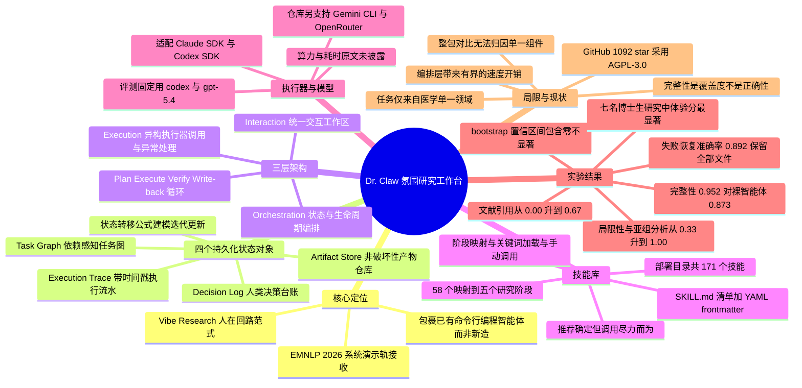

## 一、论文是干什么的？

如果你问一个博士生「你做一篇论文要开几个软件」，答案大概率是：浏览器查文献、ChatGPT 聊思路、VS Code 写代码、终端跑实验、Overleaf 写论文、微信群里跟导师讨论。六个窗口来回切，切到最后，**你自己都想不起来三周前为什么把学习率从 0.01 改成了 0.003**。更糟的是，这个「为什么」并没有被任何一个工具记下来——它只存在于你的脑子里，而脑子是会忘的。

这篇论文抓的就是这个痛点。作者指出，像 Claude Code、Gemini CLI 这样的**命令行编程智能体**（command-line coding agent）其实已经很能干了：它们能读写项目文件、能维持很长的会话上下文、能自己跑命令。但它们**优化的是执行，不是控制**。用论文原话说，计划、中间决策、以及让整个研究过程可复查的那些产物，要么散落各处，要么直接丢失，而人类几乎没有明确的接管点。

于是作者提出了 Dr. Claw——一个开源的科研工作台。它最关键的定位是：**它不再造一个新的智能体**，而是把已有的命令行智能体包起来，在外面加一层状态管理、控制和审计。打个比方：现在的 AI 智能体像一个手很快的实习生，你给它活它就干，但它不写工作日志，干砸了你也不知道是哪一步砸的。Dr. Claw 做的事情不是换一个更聪明的实习生，而是给这个实习生配上一套**项目管理系统**：一张任务甘特图、一个产物仓库、一本决策台账、一份操作流水。实习生还是那个实习生，但整个项目从此可追溯、可回滚、可交接。

作者给这种工作方式起了个名字叫**氛围研究**（Vibe Research），明显是在呼应 vibe coding（氛围编程）的概念。定义是：研究者用自然语言说出高层目标和约束，AI 把它编译成一个可执行的研究循环并执行五项核心操作，最终的验收基于可观测的输出，而**方向和最终决策权始终在人手里**。注意这个定义刻意区别于全自动的 AI 科学家——分工是 AI 干高吞吐、可并行、可模板化的活（检索、写代码、跑实验、总结、起草），人管研究方向、评价标准、关键取舍和最终验收。

这篇论文已被 **EMNLP 2026 System Demonstrations**（系统演示轨）接收。

---

## 二、核心方法与创新

### 2.1 四个持久化状态对象：给研究过程装上黑匣子

Dr. Claw 的地基是四个**持久化状态对象**（persistent state objects）。这四个东西是整篇论文最核心的设计，可以类比成一个正规实验室必备的四样东西：

| 状态对象 | 英文名 | 类比 | 实际记录什么 |
| --- | --- | --- | --- |
| 任务图 | Task Graph | 项目甘特图 | 任务节点的 ID、状态、优先级、依赖关系、所属阶段、类型、所需输入、建议技能、下一步提示词 |
| 产物仓库 | Artifact Store | 实验室档案柜 | 代码、数据文件、分析输出、论文草稿 |
| 决策日志 | Decision Log | 组会纪要 | 人类介入点、批准决定、修改要求、验收标准 |
| 执行轨迹 | Execution Trace | 仪器操作流水账 | 带时间戳的状态迁移、执行器响应、错误事件、恢复动作 |

论文把一次任务交互形式化成一个状态转移：

$$
\mathrm{State}_{t+1} = f(\mathrm{State}_t, \mathrm{Action}_t, \mathrm{Obs}_t)
$$

其中 $\mathrm{State}_t$ 是 $t$ 时刻的工作流状态（由上述四个对象共同构成），$\mathrm{Action}_t$ 是系统或用户触发的动作，$\mathrm{Obs}_t$ 是观测到的反馈。这个写法想强调的是：**Dr. Claw 优化的是迭代式的状态更新，而不是单次回答的质量**。

产物的写回被刻意设计成**非破坏性**（non-destructive）的：

$$
\mathrm{Artifact}_{t+1} = \mathrm{Artifact}_t \cup \Delta\mathrm{Artifact}_t
$$

也就是说，新一轮产生的东西是**并集追加**，而不是覆盖。任务节点状态则沿依赖关系推进：pending 到 running 到 done，完整历史保留在执行轨迹里。这个只加不删的设计，是后面失败恢复能生效的根本原因——就像 Git 不会因为你改错了一行就把整个仓库历史删掉。

### 2.2 三层架构：换发动机不用换车

系统分三层，职责非常清晰：

- **交互层**（Interaction）：统一工作区，包含聊天、任务视图、文件、版本操作。
- **编排层**（Orchestration）：状态与生命周期管理，把高层意图翻译成分阶段的任务。
- **执行层**（Execution）：后端调用、结果返回、跨异构执行器的异常处理。

这个分层的直接好处是：**换后端执行器不改变工作流语义**，同时统一的状态和审计视图不受影响。类比就是混合动力车——发动机可以换成汽油的、电的、氢的，但方向盘、仪表盘、行车记录仪都不用动。

工作流循环是 **Plan 到 Execute 到 Verify 到 Write-back** 四步：给定一个研究想法，系统生成结构化的研究简报和带依赖关系的任务计划，然后循环执行；执行输出写进产物仓库，任务状态更新进任务图，所有人类介入都留在决策日志和执行轨迹里。

### 2.3 技能库：把科研的套路变成可复用文件

Dr. Claw 内置了一个**技能库**（skill library）。每个技能是一个目录，里面有一个 `SKILL.md` 清单文件，其 YAML frontmatter 声明 `name` 和 `description`，通常还有 `version`、`license`、`allowed-tools`、`argument-hint`，以及可选的 `stage` 与 `domain` 键（用于给技能面板做标签索引）。这个设计熟悉 Claude Code 的读者会觉得眼熟——它基本沿用了同一套技能文件约定。

技能库的规模（论文披露的数字）：

- 部署目录中共 **171** 个技能，其中 **87** 个是带独立 `SKILL.md` 的顶层条目
- 三个自研技能族贡献了大部分：`aris-*` 有 **44** 个，`inno-*` 有 **16** 个，`ds-*` 有 **14** 个，其余从公开集合导入
- 映射到五个研究阶段的技能共 **58** 个：survey 11、ideation 14、experiment 18、publication 22、promotion 3（解析器是把阶段基础技能和任务类型技能取**并集**，所以各阶段数字之和与总数不相等）
- 还有 **30** 个顶层技能尚未做阶段映射

技能触达任务有三条路：**阶段技能映射表**自动解析（把任务的 stage 和 type 解析成一组建议技能，挂到任务节点上并注入下一步提示词）、**关键词自动加载**、以及用户从技能面板**手动调用**。技能在激活前会做 frontmatter 解析、schema 与依赖的预检（缺 `name` 的 `SKILL.md` 直接拒绝），并打上版本戳以便回放和审计。

作者非常诚实地承认了一个漏洞：**技能的推荐是确定性的，但调用不是强制的**。解析器只能把建议放进任务提示词里，执行器完全可能视而不见。这一点在实验里真实地咬了他们一口（见第四节）。

### 2.4 多执行器协调与安全策略

Dr. Claw 通过**后端适配器**（backend adapters）对接 Claude SDK 和 Codex SDK（另有 Cursor hooks）。用户可以按任务类型切换执行策略；遇到失败或违反约束时，可以重试（retry）、修订（revise）或直接接管（takeover），而**全局状态不会被打断**。

安全上，论文把权限管理当作一等公民，动作必须落在当前策略允许的动作空间内：

$$
\mathrm{Action}_t \in \mathcal{A}(\mathrm{Policy}_t)
$$

其中 $\mathrm{Policy}_t$ 是 $t$ 时刻的权限配置，$\mathcal{A}(\mathrm{Policy}_t)$ 是可执行动作空间。具体落地为允许或禁止的工具清单、权限模式、沙箱与审批设置。另外，管道的所有变更**先写入持久化状态，再通过 WebSocket 广播**，保证界面永远同步到同一个真相来源。

### 2.5 三视图交互场景

论文用一个三面板的界面来演示整套流程：

- **左侧：技能面板**（Skills Dashboard）。三种交互：按研究阶段浏览技能、按主题标签过滤（如 Ideation、Experiment、Publication）、手动把新技能加入当前项目。作者强调这里测的不是技能数量，而是用户能否在上下文中完成**能力发现与定制**，并把选中的技能转化成可执行步骤。
- **中间：主编排视图**。用一条统一的研究提示词写清目标、约束、验收标准。用户扮演研究负责人（确认目标、做关键决策），Dr. Claw 负责分解、派发、状态反馈。四个状态对象在全过程被监控。
- **右侧：任务列表**（Task List）。这是执行控制视图，展示同步的任务状态——总数、已完成、进行中、待处理的计数，进度条，以及按阶段分组的任务卡片。支持三种操作：进度检视、任务级可追溯（每张卡暴露任务 ID、目标、关联的技能标签）、直接动作入口（从待处理项触发下一步）。

### 2.6 失败恢复走查：本文最有说服力的演示

作者在一个 Derm7pt 皮肤病分类的小项目里**人为注入了一个走错路径的错误**，看系统怎么办。

关键在于系统的反应：它**停下来报错，而不是偷偷自我纠正**。注入的错误被执行轨迹完整捕获；随后在原地完成修复，恢复到一个真实结果（准确率 **0.892**），并且**全部 5 个既有文件都被保留**（**23** 个工具事件被记录在案）。工作台是追加修正后的产物，而不是抹掉失败的那次尝试——先前的流水线状态在修复后依然存活。

这个设计对科研的意义很实在：传统智能体跑崩了，你往往只能从头再来，而且你根本不知道它崩在哪；Dr. Claw 让你能像查监控录像一样定位问题，然后就地打补丁。作者也坦承，这是**单条件的设计演示，没有配对的裸智能体恢复对照实验**。

论文还披露了三级失败处理机制：**管道与文件级**（路径缺失、文件不可读、JSON 解析错误返回明确的 4xx 或 5xx 响应；初始化可重建管道状态默认值）、**权限级**（允许或拒绝检查、明确的拒绝原因、有界的审批超时）、**会话级**（支持中止的执行、结构化错误事件、一致的生命周期状态）。恢复依赖一组非破坏性的任务变更 API：更新状态、修订内容、追加任务、从 pending 或 in-progress 节点继续。

### 2.7 与已有系统的定位差异

论文的表 1 做了一张设计空间对比表，把系统分成三类：端到端自动化研究系统（AI Scientist v1 与 v2、Agent Laboratory、ResearchAgent）、智能体编写工具与编排运行时（AutoGen Studio、Flowise、LangGraph）、可介入的研究智能体（TinyScientist、ResearStudio、IRIS）。对比维度包括：是否包裹 CLI 智能体、是否有任务图、是否内置科研技能、是否支持原地恢复、是否支持运行中接管、是否是面向终端用户的工作区、是否支持无人值守端到端。

Dr. Claw 在全部七个维度上都标为完全支持。作者的措辞很克制：**每个维度单独看都有前人做过**——TinyScientist 同样委托外部编程智能体，AI Scientist-v2 也持久化了结构化的实验树，ResearStudio 允许任意时刻暂停（论文明说这一点 ResearStudio 比 Dr. Claw 更强）——**Dr. Claw 的差异在于把它们组合到了一起**。

---

## 三、使用了哪些模型和计算资源？

这一节要特别说清楚，因为很多人会误以为这是个训了新模型的工作。**作者明确表示不做模型层面的创新，贡献是工作流集成。**

| 项目 | 论文披露的内容 |
| --- | --- |
| 评测用后端执行器 | **codex provider，模型 gpt-5.4**，配置为匹配的 `danger-full-access` 与 `approval-never` 权限档位 |
| 对照组 | 裸的 codex 命令行智能体，**同一个 gpt-5.4 后端**（所以差异只来自编排层） |
| 系统支持的适配器 | 论文正文：**Claude SDK 与 Codex SDK**，另有 **Cursor hooks** |
| 开源仓库实际支持 | **Claude Code CLI、Gemini CLI、Codex CLI、OpenRouter**（OpenRouter 可接入 GPT-5、Claude、Gemini、DeepSeek、Llama 等大量模型） |
| 引言中作为动机提及 | Claude Code、Gemini CLI（作为已有命令行智能体的例子，**并未用于评测**） |
| GPU 型号与数量 | **原文未披露**（Dr. Claw 是编排层，本身不训练模型） |
| API 调用量与费用 | **原文未披露** |
| 墙钟耗时与延迟 | **原文未披露具体数值**。论文只定性承认 Dr. Claw 仍然更慢，这是编排层为记录状态付出的有界开销 |
| 人类研究的耗时数据 | 只有**分档**（小时、天、周、月四档），没有精确秒数；且 Stage 2 明确**排除了模型运行时间** |
| 运行时规模指标 | 任务图平均 **17** 个被追踪任务；执行器每次运行读取约 **12** 个技能文件；任务图平均 **14** 个节点；执行轨迹平均 **14** 次状态迁移；决策日志平均 **10** 条 |
| 数据规模 | 评测任务共 **3** 个医学问题；人类研究 **7** 名参与者；完整性评分包含 **21** 个最佳实践要素 |
| 运行环境 | Node.js LTS（推荐 v22）；复现需固定仓库修订版本、lockfile、运行时版本（Node、后端 SDK 与模型）、权限档位 |

一句话总结：**这是一个纯工程系统论文，算力开销在于你自己付的 LLM API 账单，论文本身没有报告任何 GPU 或成本数字。**

---

## 四、实验结果

作者自己把这部分定性为小规模的探索性试点，而不是有统计功效的对照研究。下面如实呈现。

### 4.1 开放式目标下的研究完整性（第 5.1 节）

**设计巧思**：如果提示词把要求一条条列全了，编排层就没有价值了——一个能干的执行器照着念就行。所以作者故意用**不枚举要求的开放式指令**（大意为：进行一项严谨的、达到发表质量的研究），双方都不被告知评分细则。

**指标**：完整性 = 自发包含的 21 个研究最佳实践要素的比例，包括代码与可复现性、多个模型、交叉验证、校准、消融、统计严谨性、图表、引用自身数值的写作，外加三个科研卫生要素（局限性章节、亚组分析、真实的相关工作引用）。**评分是确定性的、对照产出文件直接判定，没有模型充当裁判。**

**任务**：三个医学问题——Derm7pt 数据集上的黑色素瘤分类、Derm7pt 上的痣分类、临床笔记风险基线。

| 指标 | Dr. Claw | 裸 codex 智能体 |
| --- | --- | --- |
| 汇总完整性（21 要素占比） | **0.952** | 0.873 |
| 任务胜负 | 3 个任务中赢 2 个、平 1 个 | 不适用 |
| 建模类要素（多模型、交叉验证、校准、消融、统计严谨） | 1.00 | 1.00 |
| 局限性章节通过率 | **1.00** | 0.33 |
| 亚组分析通过率 | **1.00** | 0.33 |
| 真实文献引用通过率 | **0.67** | **0.00**（三个任务全军覆没） |
| 写作中文件引用的解析成功率 | 100%（48 处引用） | 62%（8 处引用） |
| 可查询的任务图、执行轨迹、决策日志 | 平均 14 节点、14 迁移、10 条 | **完全没有** |

**大白话解读**：两边在会不会做实验上打平手——都训了三个以上模型，都做了交叉验证、校准、消融和统计检验，这些项两边都是满分 1.00。**差距全部出在科研卫生上**：裸智能体写完就交，不写局限性、不做亚组分析、一条真实文献都不引；Dr. Claw 靠它的文献审计、分析和论文写作技能，把这三项补上了。

**作者自己泼的三盆冷水**，非常值得称道：

1. 汇总差值 $\Delta = +0.079$ 的 95% bootstrap 置信区间是 $[-0.00, +0.14]$，**包含零**。方向一致（三个任务上 Dr. Claw 都不差于裸智能体），但**统计上不显著**——每个任务只跑了一次。
2. 引用解析率 100% 对 62% 这个数字**被引用数量混淆了**（48 条对 8 条），在这个样本量下**不构成结论**，作者明说在格式中立的可追溯性上不宣称优势。
3. 裸智能体没有状态对象这件事**是构造出来的**，因为那些对象本来就是 Dr. Claw 自己的文件格式。作者因此把可审计性称为**一种支持人类监督的架构可供性，而不是一个性能分数**。

**技能触发的可靠性问题**：三次运行里执行器平均读了约 12 个技能文件，但那唯一没打赢的任务（临床笔记），恰恰是因为**文献审计技能没有被触发**，导致 Dr. Claw 同样漏掉了引用。作者的结论是：推荐是有保证的，调用是尽力而为的；而**验证技能是否真的执行（而不只是推荐它）是当前设计最明确的可靠性改进方向**。

### 4.2 非破坏性失败恢复（第 5.2 节）

同一后端（codex 与 gpt-5.4）上的 Derm7pt 小项目，注入走错路径的错误：

| 观测项 | 结果 |
| --- | --- |
| 系统行为 | 停下报错，**不静默自我纠正** |
| 恢复后准确率 | **0.892** |
| 既有文件保留 | **5 个全部保留** |
| 记录的工具事件 | **23 个** |
| 恢复方式 | 追加修正产物，而非抹除失败尝试 |
| 对照实验 | **无**（单条件设计演示） |

### 4.3 人类研究（第 5.3 节与附录 A）

**设置**：招募 **7** 名 AI 方向博士生（子领域涵盖高性能 AI、医学 AI、大语言模型），全部有稳定的研究与论文写作经验并签署知情同意。为降低不熟悉带来的偏差，每人在正式比较前有**三周的免费试用期**。三个条件：**No-AI**（不用 AI 工具）、**Web/Desktop-AI**（通用网页或桌面 AI 助手，如 ChatGPT、Gemini、Claude）、**Dr. Claw**。三个阶段：Stage 1 构思、Stage 2 实验（**排除模型运行时间**）、Stage 3 发表。四个指标：完成时间档、盲评阶段产出分（1 到 5 分）、工具切换次数档、体验分。

**重要的方法学警告**：这是**混合设计**——Dr. Claw 条件用实时日志，两个对照条件用**回顾式报告**。所以作者明说所有统计都是探索性的，而非因果的。统计方法为 Friedman 检验加 Holm 校正的成对 Wilcoxon 事后检验，$n = 7$ 配对参与者。

| 指标 | Stage 1 的 $\chi^2(2), p$ | Stage 2 | Stage 3 |
| --- | --- | --- | --- |
| 时间档 Time Band | 8.96, p=0.0114 | 13.56, p=0.0011 | 14.00, p<0.001 |
| 切换次数档 Switching Band | 1.50, p=0.4724（不显著） | 11.57, p=0.0031 | 10.75, p=0.0046 |
| 产出质量 Performance | 9.25, p=0.0098 | 11.57, p=0.0031 | 11.31, p=0.0035 |
| 体验 Experience | 12.29, p=0.0021 | 13.56, p=0.0011 | 12.07, p=0.0024 |

成对比较（Holm 校正后对比 Dr. Claw）：**体验分是唯一在全部三个阶段、对两个对照组都完全显著的指标**（$p = 0.0469$，九次比较全部通过）。时间档在 Stage 2 和 Stage 3 对两个对照都显著（$p = 0.0469$），但 Stage 1 不显著（$p = 0.1250$）。切换次数在 Stage 1 完全不显著（$p = 1.0000$）。

**大白话**：三个阶段里 Dr. Claw 都对应更短的完成时间档（主要落在 1 小时以内、以及 1 小时到 1 天两档）、最高的产出分（Dr. Claw 优于 Web/Desktop-AI 优于 No-AI）、更少的工具切换和更高的体验分。但**最硬的信号是用起来舒服，而不是做得更对**。作者列出的效度威胁包括：样本量小、系统熟悉度差异、回顾式对照的回忆偏差、Stage 2 排除模型运行时间、以及体验分的主观性。

### 4.4 作者自述的局限性

论文的 Limitations 章节写得相当坦率，值得逐条列出：

1. **整体定位**：小规模探索性演示，不是有统计功效的对照研究；差异是关于工作流编排的方向性证据，不是因果或有功效的效应。
2. **不是消融实验**：固定后端执行器只是控制变量，但 Dr. Claw 把任务图、持久化状态对象、技能库、工作流指令**作为一个整体包**加了进去，**观测到的差距无法归因到任何单一组件**。作者点名「仅技能」对「仅编排」的消融是最自然的下一步实验。
3. **完整性不等于正确性**：21 个要素统计的是产出了多少个预期的研究组件，这是**覆盖度度量，不是正确性检查**；要确立科学可靠性需要专家逐产物评审。
4. **对照对象偏弱**：比较对象是它所包裹的裸执行器——这是包装层加了什么的匹配对照，但**不是一个最先进的编排框架**。其他混淆因素依然存在，比如对两种界面的先验熟悉度。
5. **领域单一**：所有任务都来自医学领域，技能库和结构化任务图抽象能否迁移到其他研究领域——**尤其是刚性结构可能反而添乱的开放式工作**——尚待验证。
6. **速度劣势**：Dr. Claw 仍然更慢，这是编排层记录状态所付出的有界开销。
7. **技能调用不可靠**：推荐有保证，调用尽力而为。
8. **不宣称模型层面创新**：观测到的增益依赖于配置选择（后端模型、权限设置、技能覆盖度）。

---

## 五、潜在应用与已落地应用

### 5.1 开源情况（截至 2026-09-11 实测数据）

| 项目 | 数值 |
| --- | --- |
| 仓库地址 | [github.com/OpenLAIR/dr-claw](https://github.com/OpenLAIR/dr-claw) |
| Star 数 | **1,092** |
| Fork 数 | **119** |
| 开放 issue | 20 |
| 仓库创建时间 | 2026-02-26 |
| 许可证 | **AGPL-3.0**，含 GPL-3.0 上游组件（GitHub API 标记为 NOASSERTION，即非标准单一许可） |
| 主要语言 | JavaScript、TypeScript、TeX、Python |
| 最新 release | v1.1.4（2026-04-12） |
| 配套仓库 | [OpenLAIR/awesome-vibe-researching](https://github.com/OpenLAIR/awesome-vibe-researching)，17 star |
| 项目主页 | [openlair.github.io/dr-claw](https://openlair.github.io/dr-claw/) |

**重要澄清**：HuggingFace Papers 页面上的投票数经 HF 官方 API 核实为 **173 票**。网传的 1.09k 实际上是 **GitHub 的 1,092 star 数**，两个数字容易被混淆，本文按 API 实测值记录。

开源仓库包含的内容（来自 README）：核心应用代码（`src/`、`server/`、`shared/`）、100 多个研究技能的技能库（`skills/`）、Electron 桌面应用（`electron/`）、Python CLI 接口（`agent-harness/`）、三家智能体的集成配置目录（`.claude/`、`.agents/`、`.gemini/`）、文档与测试。功能上除论文描述的研究流水线外，还有聚合 arXiv、HuggingFace、GitHub 和社交媒体的新闻看板、文件浏览器、Git 集成、终端 shell、以及顺序执行任务的 Auto Research。安装要求 Node.js v20 以上（推荐 v22 LTS），并且至少配置一个受支持的 CLI 工具或 OpenRouter API key。

### 5.2 已落地的使用

来自 [Lehigh 大学工程学院的官方报道](https://engineering.lehigh.edu/news/article/meet-dr-claw-open-source-ai-assistant-revolutionizing-research-workflow)（注意：以下为校方新闻稿的说法，**不是论文中的实验数据**）：

- Dr. Claw 由 Lehigh 大学计算机与工程系助理教授 **Lichao Sun** 带领 **5 名博士生**、用约 **3 个月**开发完成，2026 年 3 月中旬公开发布。
- Sun 的原话大意是：在过去，这需要 20 到 30 个人工作一到两年。
- 报道称他实验室一名学生用 Dr. Claw 在 **2 周**内完成了一篇顶会论文，而通常需要 2 到 3 个月。
- Sun 因这项工作受邀加入多伦多大学 **2026 AI Scientists Conference**（AISC）的顾问委员会。
- Lehigh 的 Mayuresh Kothare 教授评价：在如此短的时间内把 Dr. Claw 做成一个有潜力支撑下一代科学发现的开源工具，确实非同凡响。
- 论文将在 **EMNLP 2026 系统演示轨**现场演示，会议于 2026 年 10 月 24 日到 29 日在匈牙利布达佩斯举行。

### 5.3 潜在应用方向

- **可审计的科研合规**：决策日志加执行轨迹天然契合资助机构、伦理委员会和期刊对 AI 使用披露日益严格的要求——你能拿出一份带时间戳的、谁在什么时候批准了什么的完整记录。
- **实验室交接与新人培养**：非破坏性的产物仓库加任务图，让一个项目在学生毕业时可以整体交接，而不是留下一个谁也看不懂的文件夹。
- **技能库作为方法论资产**：`SKILL.md` 这种纯文件、可版本化的格式，意味着一个实验室可以把自己的审稿标准、绘图规范、统计检验流程沉淀成可复用、可分发的技能包。论文提到迁移到新领域只需改一个 JSON 映射表，不用改代码。
- **教学场景**：把什么叫一份完整的研究显式编码成 21 个要素的检查清单，本身就是很好的方法论教具。

### 5.4 需要清醒看待的地方

这个系统解决的是**流程完整性**，不是**科学正确性**。它能保证你的论文有局限性章节，但不能保证那个章节写得对；它能保证有 48 处引用，但引用是否恰当仍需人看。作者自己在局限性里把这一点说得很明白。对初学者的建议是：把 Dr. Claw 当作一个不会忘事的项目经理，而不是一个能替你思考的合作者——这恰恰也是氛围研究这个概念本身想强调的分工。

---

## 六、网络上的讨论与评价

截至 2026-09-11，检索结果如下：**有正式媒体报道，但尚未检索到集中的技术社区讨论。**

已确认存在的报道与收录：

- [Lehigh 大学 P.C. Rossin 工程学院官方新闻](https://engineering.lehigh.edu/news/article/meet-dr-claw-open-source-ai-assistant-revolutionizing-research-workflow) —— 最详细的一篇，含作者访谈原话。
- [EurekAlert 科学新闻稿](https://www.eurekalert.org/news-releases/1128595) —— Lehigh 新闻稿的同步发布。
- [phys.org 报道](https://phys.org/news/2026-05-source-ai-workflow.html) —— 标题大意为开源 AI 助手可改善研究工作流。
- [HyperAI 论文页](https://hyper.ai/en/papers/2609.00365) —— 中文站点的论文收录，但为自动收录条目，无社区评论。

未检索到的：

- **Hacker News**：通过 HN Algolia API 分别检索 `Dr. Claw`、`dr-claw`、`2609.00365`、`vibe research arxiv`，**均未找到关于本论文或本项目的提交帖**。仅有一条弱相关的 `Ask HN: Vibe Researching with AI` 提问帖（8 分），与本论文无直接关联。
- **Reddit**：多次检索 r/MachineLearning 等相关讨论，**未检索到相关帖子**。
- **知乎与中文技术社区**：中英文混合检索，**未检索到中文讨论或评测文章**。
- **HuggingFace 论文页评论区**：API 返回的讨论区无实质性社区评论内容。

一个有意思的现象是：**这个项目的热度主要体现在 GitHub 的 1,092 star 上，而不是在论坛讨论上**——说明它更像是一个被研究者直接拿去用的工具，而不是一个引发范式辩论的话题。另外从传播时间线看，项目 2026 年 2 月底建仓、3 月中旬公开发布、4 月发到 v1.1.4、5 月获媒体报道、8 月底才挂 arXiv、9 月 7 日上 HF Daily Papers——**代码的传播明显早于论文，这也解释了为什么 star 数远高于 HF 投票数**。

---

## 七、思维导图

