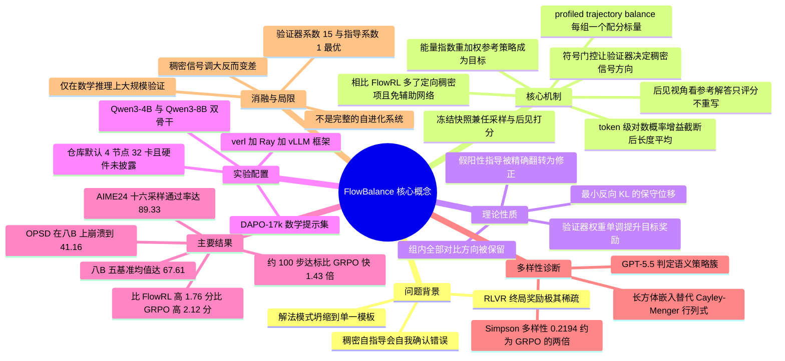

## 一、论文是干什么的？

想象一个正在备战数学竞赛的学生。他做完一道题，只有一个对或错的判定可以对照——这就是所谓的**验证器**（verifier）信号：绝对可靠，但极其稀疏。一份两千字的解答，最后只换来一个字的反馈。学生知道自己错了，却不知道错在第几步。

于是有人想出另一个办法：让这个学生**自己回头批改自己的卷子**，而且批改的时候允许他偷看标准答案。他逐字逐句地看自己写的每一个 token，判断在知道答案的前提下、自己当初写下这个词有多合理。这就是**特权后见指导**（privileged-hindsight self-guidance）：信号非常稠密，每个 token 都有分数，而且不需要请一个更大的老师模型。但问题也很明显——这个学生看了答案之后容易产生幻觉式的自信，他可能觉得某条走错的岔路看起来很有道理，于是把错误也一起强化了。更糟的是，他会越改越向一种自己偏爱的写法收敛，最后只会一招。论文把这两种现象叫做**自我确认**（self-confirmation）和**解法模式坍缩**。

FlowBalance 这篇论文要解决的，就是稀疏但可靠、与稠密但不可靠这两种信号该怎么合作的问题。它给出的答案非常直观：**让验证器决定方向，让自我指导只负责在这个方向上做精细调节**。如果验证器说这条轨迹是对的，那么自我指导的分数原样保留；如果验证器说这条轨迹是错的，那么自我指导的分数直接**取反**——你越是自信地觉得这条错路好，我就越要把它的概率压下去；如果整组采样里全对或全错、验证器给不出任何偏好，稠密分支就**直接关闭**。

更进一步，FlowBalance 不是把这些分数当成一个局部损失去优化，而是用它们定义出**下一步策略应该学会的那整个概率分布**，再用来自 GFlowNet 文献的**轨迹平衡**（trajectory balance）目标去拟合这个分布。这是一个视角上的转变：从这一步该往哪推，变成整个回答空间上的概率该怎么摆。论文由腾讯 HY LLM Frontier 与宾夕法尼亚大学的研究者于 2026 年 9 月 3 日提交到 arXiv，全文 28 页、7 张图、10 张表，在 HuggingFace Daily Papers 上获得 92 票。

## 二、核心方法与创新

### 2.1 整个循环长什么样

FlowBalance 的一轮训练可以拆成五步，论文把它画成一个自我改进循环：

1. 当前策略针对一道题采样出一组回答（rollout group）；
2. 验证器给每个回答一个终局奖励，算出组内相对优势；
3. 把当前策略**冻结**成一份快照，让它在**看到标准答案**的条件下，去给刚才那些已经采样出来的 token 打分；
4. 用验证器的正负号给这些稠密分数**定方向**（符号门控）；
5. 把优势与定向后的稠密分数合成一个轨迹能量，用轨迹平衡把对应的归一化分布学进策略里。

然后刷新快照，进入下一轮。

### 2.2 第一步：验证器的组相对优势

对一道题 $x$，采样 $N$ 个回答 $y^{(1)},\dots,y^{(N)}$，验证器按最终答案是否正确给出奖励 $R_i$。组相对优势为：

$$
A_i=\frac{R_i-\mu_R(x)}{\sigma_R(x)+\epsilon}
$$

逐符号解释：$A_i$ 是第 $i$ 个回答的优势；$R_i$ 是它的终局奖励；$\mu_R(x)$ 是这一组 $N$ 个奖励的均值；$\sigma_R(x)$ 是这一组奖励的标准差；$\epsilon$ 是防止除零的小常数。这就是 GRPO 里那个熟悉的跟同组同学比的做法——不需要单独训练一个价值网络，只要看你在这组采样里排在平均线的哪一边。论文强调所有这些量在反向传播时都被**截断梯度**（stopped）。

### 2.3 第二步：同一个模型的两副眼镜

这是全文最巧妙的设计。论文并不引入外部教师模型，而是让**同一份冻结快照** $\pi_{\theta^-}$ 戴上两副不同的眼镜：

$$
\pi_{\mathrm{roll}}(\cdot\mid s_t)=\pi_{\theta^-}(\cdot\mid x,y_{<t})
$$

$$
\pi_{\mathrm{H}}(\cdot\mid s_t,c)=\pi_{\theta^-}(\cdot\mid x,c,y_{<t})
$$

其中 $s_t=(x,y_{<t})$ 是第 $t$ 步的状态（题目加上已生成的前缀），$c$ 是**只在训练时可见的特权上下文**——论文说它可以是参考解答，也可以是任务反馈。

- $\pi_{\mathrm{roll}}$ 是**生成视角**：它没看过 $c$，负责真正把回答采样出来。
- $\pi_{\mathrm{H}}$ 是**后见视角**：它在回答**已经采样完毕之后**才看到 $c$，只对已有 token 打分，**不重新生成任何 token**，也不接收任何梯度。

打个比方：生成视角是闭卷考试时的你，后见视角是拿着标准答案给自己卷子做批注的你。批注不会改写卷面，只是给每一笔画一个这步有多顺的分数。部署上线时，模型只看到题目，既没有 $c$ 也没有后见视角。

### 2.4 第三步：token 级增益聚合成轨迹级分数

对每个 token 计算截断后的后见增益：

$$
\delta_t^{\mathrm{H}}(y;x,c)=\mathrm{clip}\left(\log\pi_{\mathrm{H}}(y_t\mid s_t,c)-\log\pi_{\mathrm{ref}}(y_t\mid s_t),\,-B,\,B\right)
$$

逐符号解释：$\log\pi_{\mathrm{H}}(y_t\mid s_t,c)$ 是后见视角认为这个 token 的对数概率；$\log\pi_{\mathrm{ref}}(y_t\mid s_t)$ 是**参考策略**（初始检查点的固定副本）给同一个 token 的对数概率；两者之差就是知道答案之后这个 token 变得多合理了；$\mathrm{clip}$ 把这个差值截断在 $[-B,B]$ 区间内，防止个别极端 token 主导整条轨迹；$B$ 是截断上界（开源代码里默认 $B=4.0$）。

然后沿整条回答做长度平均：

$$
G_{\mathrm{H}}(y\mid x,c)=\frac{1}{T}\sum_{t=1}^{T}\delta_t^{\mathrm{H}}(y;x,c)
$$

其中 $T$ 是回答的 token 数。除以 $T$ 是为了让长短不一的回答可比。$G_{\mathrm{H}}$ 就是这条轨迹的**自我指导分数**：一个标量，表示戴上特权眼镜之后这条轨迹整体平均比参考策略顺了多少。

### 2.5 第四步：符号门控，本文的灵魂

稠密信号有用，但它可能对一条最终被判错的轨迹给出很高的分数。FlowBalance 的做法是让验证器来拍板方向：

$$
E_{\mathrm{FB}}(y\mid x,c)=\eta_A\,A(y)+\beta_G\,G_{\mathrm{H}}(y\mid x,c)\,\mathrm{sgn}(A(y))
$$

逐符号解释：$E_{\mathrm{FB}}$ 是这条轨迹的**能量**，能量越高，目标分布给它的概率越大；$\eta_A\ge 0$ 是验证器系数，控制听验证器话的程度；$A(y)$ 是 2.2 节的组相对优势；$\beta_G\ge 0$ 是自我指导系数；$G_{\mathrm{H}}$ 是 2.4 节的轨迹级稠密分数；$\mathrm{sgn}$ 是符号函数，取值为 $+1$、$-1$ 或 $0$。

三种情况一目了然：

- $A(y)>0$，验证器说对：$\mathrm{sgn}=+1$，稠密分数**原样叠加**，进一步抬高这条成功轨迹；
- $A(y)<0$，验证器说错：$\mathrm{sgn}=-1$，稠密分数**被反转**，越自信的失败被压得越狠；
- $A(y)=0$，全组同分、没有偏好：$\mathrm{sgn}=0$，稠密分支**整个关闭**。

这不是一个启发式过滤器。论文的命题 4 给出了精确的量化结果，见 2.8 节。

### 2.6 第五步：能量指数重加权参考策略

有了能量，目标分布定义为一个以参考策略为底的 Gibbs 分布：

$$
p^{\star}(y\mid x,c)=\frac{1}{Z(x,c)}\,\pi_{\mathrm{ref}}(y\mid x)\exp\!\left(\frac{E_{\mathrm{FB}}(y\mid x,c)}{\tau}\right)
$$

逐符号解释：$\pi_{\mathrm{ref}}(y\mid x)$ 是参考策略给整条回答的概率，它**决定了分布的支撑集并控制漂移**，目标分布只会在参考策略本来就有概率的地方重新分配质量；$\exp(E_{\mathrm{FB}}/\tau)$ 是指数重加权因子，能量高的轨迹被放大；$\tau>0$ 是温度，$\tau$ 越小重加权越激进；$Z(x,c)$ 是**配分函数**，等于所有可能回答上 $\pi_{\mathrm{ref}}\exp(E_{\mathrm{FB}}/\tau)$ 的总和，负责把总概率归一到 1。

这里可以用一个生活类比：$\pi_{\mathrm{ref}}$ 是一锅原味汤底，能量项是往里加的调味料，温度 $\tau$ 是加调料时手抖的幅度，而配分函数 $Z$ 保证无论怎么调味这锅汤还是一锅汤——总量守恒。论文特别解释了**为什么必须做归一化**：局部的稠密分数只能说明单个 token 在特权视角下长什么样，却说不出完整回答之间的概率质量该怎么分配；配分项正是把相对能量翻译成守恒概率的那一步。

### 2.7 第六步：profiled trajectory balance

这个目标分布的问题是 $Z(x,c)$ 要对所有可能的回答求和，根本算不出来。**轨迹平衡**（trajectory balance，来自 GFlowNet 文献，Malkin 等 2022）给出了绕开的办法：如果策略真的拟合上了目标分布，那么下面这个等式对每条轨迹都应该成立：

$$
\tau\log Z(x,c)+\tau\log\frac{\pi_\theta(y\mid x)}{\pi_{\mathrm{ref}}(y\mid x)}-E_{\mathrm{FB}}(y\mid x,c)=0
$$

把左边定义为**残差** $\Delta_{\mathrm{TB}}$，训练目标就是把残差压到 0：

$$
\mathcal{L}_{\mathrm{FB}}(\theta)=\mathbb{E}_{(x,c)\sim\mathcal{D}}\left[\frac{1}{2N}\sum_{i=1}^{N}\Delta_{\mathrm{TB}}(y^{(i)};x,c)^2\right]
$$

逐符号解释：$\pi_\theta$ 是**可训练**的当前策略，是唯一接收梯度的地方；$\log(\pi_\theta/\pi_{\mathrm{ref}})$ 是策略相对参考策略的对数似然比；$\mathcal{D}$ 是题目加特权上下文构成的数据集；$N$ 是组内回答数；平方使它变成一个最小二乘形式的回归目标。奖励、优势、自我指导分数、配分估计、采样出的回答**全部截断梯度**。

那 $\log Z$ 怎么办？FlowBalance 不像 FlowRL 那样训练一个单独的配分网络，而是**直接从这一组采样里 profile 出来**（profile 在统计里指把讨厌参数用它的最优值代入消掉）。每条回答都隐含一个估计：

$$
\widehat{\log Z}_i(x,c)=\frac{E_{\mathrm{FB}}(y^{(i)}\mid x,c)}{\tau}-\log\frac{\pi_\theta(y^{(i)}\mid x)}{\pi_{\mathrm{ref}}(y^{(i)}\mid x)}
$$

然后取组内平均：

$$
\widehat{\log Z}(x,c)=\frac{1}{N}\sum_{i=1}^{N}\widehat{\log Z}_i(x,c)
$$

**一个 rollout 组只需要一个标量估计**，且梯度被截断。这就是标题里 profiled 的含义。

论文另外还给出了一个**子轨迹平衡**（subtrajectory balance）版本，把奖励拆成每个 token 的增量 $r_t^{\mathrm{FB}}=\tau\log\pi_{\mathrm{ref}}(y_t\mid s_t)+\frac{\beta_G}{T}\delta_t^{\mathrm{H}}\mathrm{sgn}(A)+\eta_A A\,\mathbf{1}\{t=T\}$，可以在长回答上提供更稠密的拟合信号。不过**本文实验一律使用完整回答版本**。

### 2.8 四条理论性质

论文没有证明全局收敛，而是直接分析目标分布本身的四个性质。

**命题 1，组内对比全部保留**：残差为零当且仅当任意两条轨迹的概率比满足

$$
\frac{\pi(y^{(i)})}{\pi(y^{(j)})}=\frac{\pi_{\mathrm{ref}}(y^{(i)}\mid x)}{\pi_{\mathrm{ref}}(y^{(j)}\mid x)}\exp\!\left(\frac{E_i-E_j}{\tau}\right)
$$

也就是说，那个未知的配分常数只吸收了**一个公共偏移**，剩下 $N-1$ 个独立对比方向全部保留下来用于训练。比喻：全班成绩统一加 5 分不影响排名，profile 掉的正是这个加 5 分。

**命题 2，最小改动的保守更新**：在所有达到同等期望能量的组内分布中，FlowBalance 的目标是相对参考策略**反向 KL 最小**的那一个。也就是说，它是够到这个改进水平所需的最小挪动。

**命题 3，验证器的单调控制权**：固定自我指导分数不变，

$$
\frac{\partial}{\partial\eta_A}\mathbb{E}_{p^{\star}}[R]=\frac{\mathrm{Var}_{p^{\star}}(R)}{\tau(\sigma_R(x)+\epsilon)}\ge 0
$$

方差非负，所以加大验证器权重**永远不会降低**目标分布的期望验证奖励。验证器始终是一个货真价实的控制旋钮，不会被稠密信号架空。

**命题 4，假阳性指导的精确纠正**：对同一组里一个验证通过的回答 $y_+$ 和一个被判错的回答 $y_-$，

$$
\frac{p^{\star}_{\mathrm{gated}}(y_+)}{p^{\star}_{\mathrm{gated}}(y_-)}=\frac{p^{\star}_{\mathrm{ungated}}(y_+)}{p^{\star}_{\mathrm{ungated}}(y_-)}\exp\!\left(\frac{2\beta_G G_{\mathrm{H}}(y_-\mid x,c)}{\tau}\right)
$$

当 $G_{\mathrm{H}}(y_-\mid x,c)>0$，也就是后见视角错误地看好了那条失败轨迹时，指数因子大于 1，符号门控把这份假自信**从自我强化压力直接翻转成一个偏向正确答案的概率比修正**。这是一个精确的等式，不是定性说法。

论文还在可精确枚举的小空间上做了数值诊断：在四模态诊断中，只用奖励塑形的成功质量是 $0.818$，不加门控的自我指导是 $0.832$，FlowBalance 达到 $0.900$，同时把稳健成功模态的质量从 $0.327$ 提到 $0.440$；在二元假自信扫描的 $G_-=0.5$ 处，FlowBalance 的目标成功概率为 $0.894$，奖励塑形为 $0.817$，无门控塑形为 $0.807$。保守性方面，一个能量匹配的全支撑替代方案需要 $0.973$ 的反向 KL，而 FlowBalance 的指数倾斜只要 $0.273$，相差约 $3.6$ 倍。信息效率方面，在组大小 $N=32$ 时，profile 全部对比只有每组一个对比估计器局部高斯参数风险的 $2.92\%$，约为其 $1/34$。

### 2.9 与 FlowRL 的关系

FlowRL 同样属于轨迹平衡家族，但它的能量是**纯结果驱动**的 $\eta_A A(y)$，而且 FlowRL 使用一个额外的、与 prompt 相关的配分网络。FlowBalance 做了两件事：

1. **能量里多了一项**定向后的稠密自我指导 $\beta_G G_{\mathrm{H}}\,\mathrm{sgn}(A)$；
2. **配分项改为组内 profile**，不再需要辅助网络。

论文明确说，与 FlowRL 的对比正是为了在**同一个轨迹平衡家族内部**隔离出额外稠密指导的价值。稳定性与速度方面，论文报告 FlowBalance 相比 FlowRL 在两个骨干上都提升了平均性能，同时改善了训练速度与稳定性；不过论文给出的具体速度数字（约 100 步对约 143 步达到 0.5 的 AIME24 验证准确率，$1.43$ 倍）以及 400 步稳定性曲线，**对照组是 GRPO 而不是 FlowRL**。FlowRL 与 FlowBalance 之间的逐步速度曲线**原文未披露**。

## 三、使用了哪些模型和计算资源？

| 项目 | 情况 |
|---|---|
| 骨干模型 | Qwen3-4B、Qwen3-8B，两个规模各自独立跑全套对比 |
| 参考策略 | 初始检查点的固定副本 |
| 训练时打分器 | FlowBalance 与 RLSD 用**当前策略的冻结副本**条件于 $c$；OPSD 用固定的特权教师 |
| 多样性评判模型 | GPT-5.5，仅用于 AIME24 语义策略聚类判定，不参与训练 |
| 训练数据集 | 论文正文**未点名**具体数据集；开源仓库的默认训练文件是 train_dapo17k.parquet，即 DAPO-17k 数学 RL 提示集，约 17k 条 |
| 评测集 | AIME24 用 Pass@16；HMMT25、Minerva、MATH500、OlympiadBench 用 Pass@1 |
| 训练框架 | 仓库内置 vendored 版 verl，配合 PyTorch、Ray、FSDP、vLLM |
| GPU 型号 | **论文未披露**。仓库 ENVIRONMENT.md 提到 H20 编译器封装，runtime_env.yaml 设置 TORCH_CUDA_ARCH_LIST 为 9.0（Hopper 架构），路径命名指向腾讯内部集群；这些属于代码线索而非论文正式声明 |
| GPU 卡数 | **论文未披露**。仓库训练脚本默认 NNODES 为 4、N_GPUS_PER_NODE 为 8，即 4 节点共 32 卡，序列并行 SP_SIZE 为 8 |
| 训练耗时 | **原文未披露**，仓库亦未给出墙钟时间 |
| 训练步数 | 主表用 step 180 的检查点；动态曲线与回答长度曲线跑到 400 步 |
| 随机种子 | 主表每格为 5 个种子的均值与样本标准差 |
| Rollout 组大小 $N$ | 论文 Table 5 标注为各方法一致、待发布（pending release）；仓库脚本默认 N_RESP_PER_PROMPT 为 8 |
| 最大回答长度 | 论文 Table 5 同样标注待发布；仓库脚本默认 prompt 2048 token、response 8192 token |
| 学习率 | **论文未披露**；仓库默认 1e-6 |
| 默认超参 | $\eta_A=15$、$\beta_G=1$；仓库额外给出 $B=4.0$、重要性比上限 1.2、训练 prompt 批大小 256、mini-batch 128 |
| 温度 $\tau$ 的取值 | **原文未披露**具体数值 |

需要强调的是，论文在附录 D.1 明确声明这批大规模实验的设计目的是**比较策略更新目标本身，而不是比较基础设施选择**，所以同一骨干下所有方法共享相同的训练提示、rollout 组大小、最大回答长度、验证器、优化器调度、检查点节奏和评测脚本。这也解释了为什么硬件细节在正文中被刻意淡化。

## 四、实验结果

### 4.1 主表：五个数学基准

所有数字为 step 180、5 个种子的均值与样本标准差，单位为百分比。AIME24 用 Pass@16，其余用 Pass@1。Avg. 是五个基准均值的无加权平均。

**Qwen3-4B**

| 方法 | AIME24@16 | HMMT25 | Minerva | MATH500 | OlympiadBench | Avg. |
|---|---|---|---|---|---|---|
| GRPO | 78.00 ± 1.83 | 26.67 ± 2.36 | 51.18 ± 1.36 | 92.04 ± 0.98 | 63.68 ± 0.58 | 62.31 |
| OPSD | 65.33 ± 3.80 | 14.67 ± 2.98 | 47.28 ± 0.56 | 87.56 ± 1.34 | 55.76 ± 1.47 | 54.12 |
| RLSD | 73.33 ± 2.36 | 21.33 ± 3.80 | 50.29 ± 0.88 | 91.44 ± 0.52 | 61.36 ± 0.66 | 59.55 |
| FlowRL | 75.33 ± 1.83 | 30.67 ± 4.94 | **51.99 ± 1.51** | 92.84 ± 0.62 | 65.25 ± 0.49 | 63.22 |
| **FlowBalance** | **80.00 ± 0.00** | **32.00 ± 2.98** | 50.51 ± 0.56 | **93.28 ± 0.59** | **65.49 ± 0.92** | **64.26** |

**Qwen3-8B**

| 方法 | AIME24@16 | HMMT25 | Minerva | MATH500 | OlympiadBench | Avg. |
|---|---|---|---|---|---|---|
| GRPO | 85.33 ± 1.83 | 31.33 ± 7.67 | 52.87 ± 1.02 | 93.16 ± 0.83 | 64.78 ± 0.62 | 65.49 |
| OPSD | 48.67 ± 3.80 | 4.00 ± 3.65 | 38.46 ± 3.85 | 74.56 ± 4.81 | 40.09 ± 3.57 | 41.16 |
| RLSD | 82.67 ± 3.65 | 28.00 ± 1.83 | 52.94 ± 1.38 | 93.44 ± 0.17 | 63.56 ± 1.19 | 64.12 |
| FlowRL | 86.67 ± 0.00 | 30.67 ± 4.35 | 52.79 ± 1.37 | 92.92 ± 0.50 | 66.20 ± 1.05 | 65.85 |
| **FlowBalance** | **89.33 ± 1.49** | **34.67 ± 9.89** | **53.68 ± 0.78** | **93.52 ± 0.30** | **66.85 ± 0.46** | **67.61** |

大白话总结：

- 在 4B 上，FlowBalance 的五基准均值比 GRPO 高 1.95 分、比 OPSD 高 10.14 分、比 RLSD 高 4.71 分、比 FlowRL 高 1.04 分。五个基准里赢了四个，Minerva 输给 FlowRL。
- 在 8B 上，FlowBalance **五个基准全部第一**，均值比 GRPO 高 2.12 分、比 OPSD 高 26.45 分、比 RLSD 高 3.49 分、比 FlowRL 高 1.76 分。
- 若只看论文特别强调的核心四基准（AIME24、HMMT25、MATH500、OlympiadBench），FlowBalance 比 FlowRL 高 1.67 分（4B）和 1.98 分（8B）；比 GRPO 高 2.60 分（67.69 对 65.10，4B）和 2.44 分（71.09 对 68.65，8B）。
- 最触目惊心的是 **OPSD 的崩溃**：在 8B 上均值只有 41.16，比 GRPO 低了 24 分以上，HMMT25 更是掉到 4.00。论文认为这印证了一个假说：直接模仿一个看过答案的特权教师，会压制模型的不确定性表达、缩短推理链、削弱探索与自我纠错。
- 提升最大的地方是 AIME24 Pass@16。这很符合直觉：Pass@16 奖励的是 16 次采样里至少中一次，而 FlowBalance 的整个设计就是把概率质量**摊开到多条正确轨迹上**，而不是全部堆在一条上。同时 MATH500 和 OlympiadBench 这类 Pass@1 指标也在小幅稳定上涨，说明它没有为了采样型指标牺牲单次准确率。

### 4.2 训练动态（Qwen3-8B）

| 观察项 | FlowBalance | 对照 |
|---|---|---|
| 达到 0.5 的 AIME24 验证准确率所需步数 | 约 100 步 | GRPO 约 143 步，$1.43$ 倍加速 |
| 400 步长训练 | 始终接近峰值 | GRPO 在约 180 步后急剧退化 |
| 回答长度 | 保持较长的推理轨迹 | 直接 OPSD 迅速坍缩到很短的回答 |

注意：这些曲线的对照组是 GRPO 与 OPSD，**FlowRL 的逐步曲线原文未给出**。

### 4.3 消融：两个系数

验证器系数 $\eta_A$ 扫描（Qwen3-8B，$\beta_G=1$ 固定，step 180，5 种子）：

| $\eta_A$ | AIME24@16 | HMMT25 | Minerva | MATH500 | OlympiadBench | Avg. |
|---|---|---|---|---|---|---|
| 5 | 86.00 ± 1.49 | 30.00 ± 8.50 | 53.46 ± 1.24 | 93.32 ± 0.41 | 65.46 ± 0.69 | 65.65 |
| 10 | 85.33 ± 1.83 | 30.00 ± 3.33 | 52.43 ± 0.81 | 93.20 ± 0.32 | 66.11 ± 0.51 | 65.41 |
| **15** | **89.33 ± 1.49** | **34.67 ± 9.89** | **53.68 ± 0.78** | **93.52 ± 0.30** | **66.85 ± 0.46** | **67.61** |

自我指导系数 $\beta_G$ 扫描（Qwen3-8B，$\eta_A=15$ 固定）：

| $\beta_G$ | AIME24@16 | HMMT25 | Minerva | MATH500 | OlympiadBench | Avg. |
|---|---|---|---|---|---|---|
| **1** | **89.33 ± 1.49** | **34.67 ± 9.89** | 53.68 ± 0.78 | 93.52 ± 0.30 | **66.85 ± 0.46** | **67.61** |
| 2 | 87.33 ± 1.49 | 32.00 ± 5.06 | 53.68 ± 1.40 | **93.64 ± 0.33** | 65.73 ± 1.16 | 66.48 |
| 3 | 86.00 ± 1.49 | 30.00 ± 4.08 | 53.46 ± 1.39 | 93.56 ± 0.55 | 66.74 ± 0.66 | 65.95 |

这两张表讲的是同一个故事：**验证器的话要多听，自己的话要少听**。把 $\beta_G$ 从 1 加到 3，AIME24 从 89.33 跌到 86.00，HMMT25 从 34.67 跌到 30.00。论文由此得出一个重要结论——收益来自**被校准的**自我指导，而不是来自把稠密信号调得更响。

### 4.4 AIME24 受控多样性诊断

这是论文最有意思的一节。评价的不是措辞多样性，而是**语义策略多样性**。

**度量方式**：用 Simpson 多样性指数

$$
D_{\mathrm{Simpson}}=1-\sum_{k=1}^{K}p_k^2
$$

其中 $p_k$ 是**正确轨迹**中被归入第 $k$ 个策略簇的比例，$K$ 是簇数。这个数的直观含义是：**随机抽两条正确轨迹，它们用的是不同语义策略的概率**。

**协议**：只用种子 0、step 180 的检查点；对 AIME24 的 30 道题，每道题每个方法解码 16 条完整回答，即 $30\times 3\times 16=1440$ 条完整轨迹；全部交给 GPT-5.5 评判模型，由它抽取每条轨迹的数学表示、使用的工具与定理、策略签名，然后把核心策略相同的轨迹聚成一簇；回答不截断、不做启发式压缩。

**结果**：

| 方法 | 正确轨迹 Simpson 多样性 | 相对 GRPO |
|---|---|---|
| GRPO | 0.1017 | 1.00 倍 |
| RLSD | 0.1456 | 1.43 倍 |
| **FlowBalance** | **0.2194** | **2.16 倍** |

论文还给了具体案例说明这不是文字游戏。AIME24 第 23 题：GRPO 的代表性解答用的是标准的 Cayley-Menger 行列式，把四面体当成六条两两距离；FlowBalance 则识别出 $41=4^2+5^2$、$80=4^2+8^2$、$89=5^2+8^2$，发现隐藏的 $4\times 5\times 8$ 长方体嵌入，把体积计算化简成一个标量三重积。两条路都得到 $r=20\sqrt{21}/63$、答案 104，但**用的数学对象根本不同**。附录还给了另外三组同类案例：包络线对重根、子午面圆相切对隐式曲面法向、坐标消元对三角双曲线参数化。

## 五、潜在应用与已落地应用

**开源情况**：代码已公开在 [GitHub 仓库 alexhuang13/FlowBalance](https://github.com/alexhuang13/FlowBalance)，同时有一个 [项目博客](https://alexhuang13.github.io/FlowBalance-Blog/)。仓库结构相当完整：内置 vendored 版 verl 训练框架，recipe 目录下分别有 flowsd（FlowBalance 本体，沿用内部旧名 FlowSD）、grpo、rlsd、opsd、sdpo、antisd 六套配方，还有 evaluation/math（数学评测与判分）、analysis/diversity（语义策略多样性分析）、launch（多节点启动器）。需要注意的是，截至检索时该仓库的 star 数还只有个位数（3 星、0 fork），社区使用量尚未起来。另外论文里的 $\beta_G$ 在代码中叫 FLOWSD_BETA_Q，$\eta_A$ 叫 FLOWSD_ETA_R，对照时要注意命名映射。

**潜在方向**，部分来自论文自述的下一步：

- **外层课程与任务生成的结合**。论文明确说 FlowBalance 只解决了经验到策略的内循环，任务分布是固定的。把它和一个外层的课程学习或引导式任务生成器（论文点名了 R-Few 式的 Challenger 与 Solver 系统）接起来，才构成完整的自进化系统。
- **任何有自动验证器的领域**。凡是能写出程序化判分的场景——代码生成配单元测试、定理证明配证明检查器、工具调用配执行结果——都天然满足 FlowBalance 的两个前提：稀疏可靠的终局信号，加上一份训练时可见的参考答案或反馈。
- **需要保留多条正确路径的场景**。Pass@k 型指标、需要给用户呈现多种解法的教育产品、需要先产生多样候选再做重排的系统，都直接受益于 FlowBalance 对解法坍缩的抑制。
- **特权上下文的扩展**。论文把 $c$ 定义得很宽，可以是参考解答**也可以是任务反馈**，所以在 agent 场景里 $c$ 完全可以是执行日志、报错栈、环境返回——这些都是事后才知道、推理时看不到的信息。
- **便宜的稠密监督**。因为后见视角就是模型自己的冻结副本，不需要更大的教师模型、也不需要额外生成回答，这条稠密信号的边际成本主要是一次额外的前向打分。

**已落地应用**：截至 2026-09-11，**未检索到**除研究代码之外的生产环境落地案例。论文来自腾讯 HY LLM Frontier 团队，但没有公开信息表明该方法已用于任何已发布的混元模型。

## 六、网络上的讨论与评价

截至 2026-09-11，经过多轮检索（关键词包括 FlowBalance、2609.03241、FlowRL 组合，以及配合 Hacker News、Reddit、知乎、Twitter 的站点限定搜索），**尚未检索到关于这篇论文的集中讨论**。具体情况如下：

- **HuggingFace Daily Papers**：92 票，是当天热度靠前的论文之一，但页面上没有检索到实质性的评论讨论。
- **Hacker News**：未检索到相关提交或讨论串。
- **Reddit**：未检索到相关帖子。
- **知乎及中文技术社区**：未检索到专门的解读文章。搜索结果中出现的均为 TTRL、Flow-GRPO 等其他强化学习论文的解读，与本文无关。
- **聚合站点**：[HyperAI 的论文页面](https://hyper.ai/en/papers/2609.03241) 收录了这篇论文并给出机器生成的摘要与几条潜在讨论点（方法能否推广到数学以外的推理任务、特权上下文带来的训练开销、验证器本身不完美时提升是否还能迁移），但这属于站点自动生成内容，不是社区真实讨论。另有 [Envisioning Vocab](https://www.envisioning.com/vocab/flowbalance) 的词条式介绍。
- **GitHub**：仓库 star 数为个位数，尚无 issue 讨论。

考虑到论文提交于 2026 年 9 月 3 日、距今仅一周多，讨论尚未形成是正常的。上述结论仅反映检索时点的状态。

论文自己列出的四条**局限**也值得放在这里一并考量：第一，大规模实验只覆盖数学推理，能否推广到 agent、多模态或其他长时程领域仍未知；第二，回答长度的对比只是诊断出一种相关的失败模式，并没有证明回答更长导致准确率更高；第三，多样性分析只是单个检查点、单个种子、由大模型判定的诊断，而非多种子的人工研究；第四，实验刻意把任务分布固定住以隔离内循环，FlowBalance 本身**不是**一个能自己生成或筛选新任务的完整自进化系统。

## 七、思维导图

