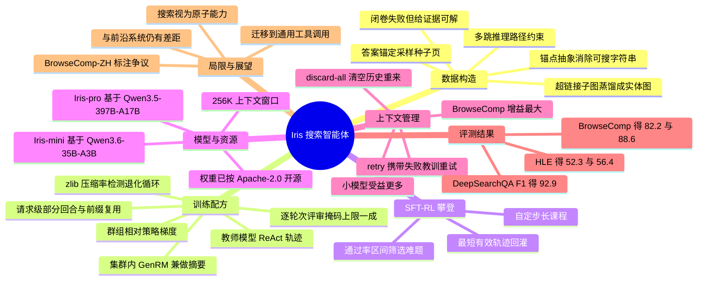

## 一、论文是干什么的？

想象你要回答这样一个问题：「有一位在某个北欧国家出生的物理学家，他博士导师的另一位学生后来创办了一家现在市值最高的半导体设备公司，请问这位物理学家在哪一年获得了某学会的终身成就奖？」这种问题的特点是，**你没法把它直接丢进搜索框**——因为题目里压根没有任何一个可以直接搜的专有名词，每一个线索都是「某个某某」。你必须先查出第一个空是谁，再顺着查第二个空，一环扣一环，最后才能锁定答案。

这就是所谓的**搜索智能体**要干的活儿。它不是普通的聊天机器人，而是一个会自己上网、自己决定搜什么关键词、自己判断搜回来的网页有没有用、自己决定还要不要继续找的 AI。这篇论文来自一个叫 AllSpark 的团队，他们发布了两个这样的模型：小号的 **Iris-mini**（350 亿总参数、30 亿激活参数）和大号的 **Iris-pro**（3970 亿总参数、170 亿激活参数），并且把整套「怎么造训练题、怎么训练、怎么评测」的方法完整写了出来。论文只有 12 页、2 张图，更像一份工程技术报告而非理论论文。

这篇论文最值得一提的地方，其实是它的**诚实**。作者发现了一件业内有点尴尬的事：不同搜索智能体之间公布的分数差距，很多时候并不是模型本身聪明程度的差距，而是**推理时那套「上下文管理」外壳**带来的差距。打个比方，两个学生考同一场开卷考试，一个学生只有一张草稿纸、写满就得交卷，另一个学生草稿纸写满了可以擦干净重来一遍——后者分数高，未必是脑子更好使。所以 Iris 团队坚持**每个基准都汇报「开上下文管理」和「关上下文管理」两组数字**，并且固定工具集、上下文上限和判分模型，让大家看清楚哪一部分是模型能力、哪一部分是外壳红利。结果显示，光是这层外壳就能在 BrowseComp 上给小模型带来超过 17 分的提升，比大多数系统之间公布的差距都大。

结论上，在开启上下文管理（discard-all 策略）时，Iris-mini 在 BrowseComp、BrowseComp-ZH、DeepSearchQA、HLE 四个基准上拿到 82.2 / 84.8 / 86.9 / 52.3，Iris-pro 拿到 88.6 / 85.1 / 92.9 / 56.4，都是各自参数量档位里开源搜索智能体的最强综合成绩。所有结果都来自**单个 ReAct 智能体**，没有子智能体、没有测试时投票验证。

---

## 二、核心方法与创新

整篇论文可以拆成三块积木：**怎么造题**、**怎么训练**、**推理时怎么省上下文**。

### 2.1 数据构造：把百科的超链接反着用

训练搜索智能体最难的不是训练，而是**没有合适的题**。网上自然存在的问题要么太简单（模型不用搜就会），要么答案不唯一没法自动判分。人工出题又太贵。

Iris 的思路很巧妙：**反向利用网页之间的超链接结构**。

把整个网页语料看成一张有向图 $G=(V,E)$，节点是网页，边是超链接。造题时：

1. **挑种子页**。他们用的是「答案锚定」模式——先定好一个目标答案实体 $y$，再去找描述它的网页作为种子页 $v_0$。这就像先想好谜底，再倒着编谜面。
2. **顺着出链展开一小片子图** $G_{\text{sub}}$，即种子页加上它指向的若干页面，每页正文截断到固定预算长度。这里有个工程细节：渲染网页的阅读服务会把内嵌的超链接标签剥掉，所以他们额外从语料的**结构化语义镜像，也就是 RDF 三元组**里恢复真实出链集合，再和渲染后的页面标记合并，尽量提高链接召回率。
3. **蒸馏成实体图**。原始网页噪声太大，他们把子图压缩成一张紧凑连通的实体图 $G_e=(V_e,R_e)$，节点是显著实体、边是带类型的语义关系，且只保留位于「通往种子主题的多跳路径」上的部分，得到一副密实的关系骨架。
4. **在实体图上出多跳题**。生成初始问题 $q_0$ 及其推理路径 $P$，硬性要求路径长度 $|P|\ge N$，也就是这道题至少依赖 $N$ 个互相耦合的关系。
5. **锚点抽象，即实体混淆**——这是防作弊的关键一步。

关于第 5 步：如果题目里直接出现「爱因斯坦」三个字，智能体只要把这个字符串扔进搜索引擎就绕过了全部推理。所以他们定义了一个抽象算子 $\mathcal{A}$，把**除答案之外的每一个实体**都改写成描述性指称，并且要求改写后的文本里**不含该实体的名称和别名**，同时又能唯一地确定这个实体。改写后的问题 $\tilde{q}=f_{\text{abs}}(q_0,\mathcal{A})$ 保持推理结构和答案不变，但**只能靠推理消歧，不能靠字符串匹配**。这就是本文开头那个「某个北欧国家出生的物理学家」式问法的来源。

6. **双判据验真**。一道题要同时满足两条才收：

$$
c_{\text{diff}}(\tilde{q})=\mathbb{I}\left[M_{\text{ref}}(\tilde{q})\ne y\right]
$$

即参考模型在**闭卷、无工具**状态下答错，说明这题不是背出来的；以及

$$
c_{\text{solv}}(\tilde{q})=\mathbb{I}\left[M_{\text{ref}}(\tilde{q}\mid G_e)=y\right]
$$

即把实体图当作证据喂进去以后**能答对**，说明这题答案唯一且确实可解。只有两条同时成立才进入训练集 $\mathcal{D}$。答案是否相等由一个语义匹配判分模型决定。

用考试打比方：第一条筛掉「课本上就有、不用查」的送分题，第二条筛掉「给你标准答案你都对不上」的错题和歧义题，剩下的才是真正需要「会查」的好题。除了自造的题，他们还混入了一部分内部题库和开源题集。

**注意**：论文全文**没有披露训练题目的总量**，也没有给出 $N$、$K$、$n$ 等具体阈值。

### 2.2 训练配方：先临摹，再实战，交替上升

**第一步：监督微调的数据来自「老师」。** 他们让一个强力教师模型 $M_T$ 在 ReAct 范式下真刀真枪地上网解题，工具只有两个：$\mathcal{T}=\{\textsc{search},\textsc{scrape}\}$，即搜索和抓取网页。每一步是「想一下、调个工具、看返回」，最后给出答案。关键细节：**每条观测都是当场生成的文档级摘要，而不是原始网页**，这样整条轨迹才不会撑爆上下文。

**第二步：两道过滤关。**

- **粗筛，整条轨迹级别**：先看对不对——必须正常终止，且答案被判分模型判为正确；再看有没有「卡壳」——重复循环、疯狂刷工具、思考标签没闭合等病态行为。这里有个很聪明的检测器：**滑动窗口压缩率**

$$
\rho_{\text{cr}}(w)=\frac{|w|}{\left|\mathrm{zlib}(w)\right|}
$$

  原理是**重复的文本比流畅的文本压缩得狠得多**。只要某个窗口的压缩比超过阈值 $\tau_{\text{cr}}$，就说明这里在打转，而且不管循环周期多长、从哪儿开始都能抓到，计算量还只有 $O(n)$。辅以周期性重复行、超长单字符串、连续两次参数完全一致的工具调用等检测器。最后还要求至少有 $K$ 次工具调用轮次，把「一查就中」的浅层题扔掉，再做一次完全相同轨迹的去重。

- **细筛，单轮次级别**：一条整体正确的轨迹里，仍可能夹杂一个糟糕的步骤，比如多余的搜索、编造的工具名、或者「想的和做的对不上」。难点在于，孤立看着很浪费的一步，往往是合理的探索。作者的做法很有意思——**评判标准不是人手写的，而是从数据里长出来的**：先采样一批轨迹让判分模型自由吐槽，再把反复出现的失败模式（比如「误解题意」）归纳成一份明确的评分细则，写进最终的判分提示词。判分模型看到问题、参考答案和该轮次前后固定窗口的上下文，输出 keep 或 mask，即 $m_t\in\{0,1\}$。为防止筛得太狠，**任何一条轨迹中最多只能掩掉 10% 的助手轮次**。被掩掉的轮次**仍然留在上下文里，只是不计入训练损失**——历史照看，错误不学。

  训练目标即带掩码的似然最大化，$\mathcal{L}_{\text{SFT}}(\theta)=-\mathbb{E}\sum_t m_t\log\pi_\theta(u_t\mid C_{<t})$，观测、用户和系统 token 天然零损失。另有一个「回放算子」保证训练时重建的可见历史与推理时**逐字节一致**。

**第三步：强化学习，对着真实搜索引擎练。** 采用群组相对策略梯度。两个工程亮点：

- **请求级部分回合，partial rollout**。长程搜索有严重的「长尾」问题：极少数会话跑得特别久，把整个同步训练步卡死。常规做法是丢掉未完成的工作，他们改为**在请求这一级中断**：一旦本步已经攒够完成的轨迹，就把还在跑的超采样会话掐掉，下一步**从已提交的前缀继续跑**。所有 rollout 组织成一片森林，节点是消息状态，每个节点缓存自己的 token、损失掩码、对数概率和权重版本差异；由于一条恢复的轨迹拼接了不同策略权重下生成的前缀，他们用**截断重要性采样**来修正这个错配。代价是大约 $2\times$ 的超采样冗余，好处是 rollout GPU 在同步同址调度下不空转。
- **奖励与摘要都放在集群内自己跑**。他们在训练集群里另开几个 FP8 引擎，跑一个内部的 Qwen3.5-397B-A17B 模型，同时担任两个角色：一是**生成式奖励模型**，对抽取出的答案 $\hat{y}_\tau$ 与参考答案 $y^{*}$ 给出二元判定 $R(q,\tau)=\mathbb{I}\left[\operatorname{GenRM}=\textsc{A}\right]$，不加格式奖励项，因为空答案或思考中途被截断的答案抽取结果为空，本来就得 0 分，连判分都不用调；二是**观测摘要器**，把每个抓回来的网页压成一小段与查询相关的摘要。作者特意强调，这是 rollout 里**唯一的上下文缩减机制**，没有消息历史裁剪、没有滑动窗口，所以**策略在推理时看到的上下文和训练时学到的完全一致**。这么做还顺带甩掉了训练环路对外部 API 的依赖，一份算力分配同时覆盖训练、rollout 和打分。

**第四步：SFT-RL 攀登，iterative climbing。** 这是论文标题里「攀登」的由来。SFT 和 RL 不是「先 A 后 B」跑一遍，而是**循环交替**：一轮 RL 探索完当前策略，挑出一小撮高质量 rollout 用监督微调「回灌」进模型，RL 再从更新后的模型继续跑。每一次这样的循环叫作一次「攀登」。

为什么要这样做？因为两种目标函数的长处不同：RL 靠组内相对奖励**打磨当前策略已经采得出来的行为**；而监督微调可以**直接强化那些罕见但成功的轨迹**，不必指望它们在群组相对梯度里贡献出多少信号。就像爬楼梯，RL 负责试探下一级台阶在哪儿，SFT 负责把脚踩稳再迈下一步。

回灌样本的挑法有讲究：每个查询最多留一条 rollout；设 $\bar{R}(q)$ 为该查询 rollout 组内的通过率，只选 $0<\bar{R}(q)\le 1/2$ 的查询——**能做对但还不稳**的那一档；在成功的 rollout 里要求至少 $K_{\text{rft}}$ 次工具调用，滤掉蒙对和过于取巧的，然后在满足条件的里面**选最短的那条**，劝阻无谓的搜索。因为难度区间是用「当前策略的通过率」定义的，随着策略变强，这个区间会**自动滑向更难的题**，天然形成一条自定步长的课程；候选池枯竭时也就自然给出了停止信号。

**注意**：论文**没有披露攀登了多少轮**，也没给学习率、裁剪比例等超参数，只写了一句「更多细节将在未来发布」。

### 2.3 推理时的上下文管理

这是全文最有「揭盖子」意味的一节。所谓上下文管理（CM），针对的是这个痛点：长程搜索常常**在解完所有约束之前就把上下文烧光了**，导致有效搜索预算远小于名义上的窗口大小。

论文评测了两种策略，都不是他们原创，而是沿用社区已有的做法：

- **discard-all，来自 DeepSeek-V3.2**：当运行中的上下文触及预设阈值、却还没拿到最终答案时，**把整段交互历史全部清空，从原始问题重新开始**。像草稿纸写满了就整张擦掉重写。GitHub 评测脚本里给出的示例阈值是 131072 个 token，即 128K。
- **retry，来自 MiroThinker**：当一次尝试没能产出可解析的答案时，把这次失败的搜索经历**压缩成一段简短描述**，附加到任务上再试一次。作者的评价是，retry 可以看作是「带着逐步累积的先验知识」的 discard-all——它记得哪些路已经走死了。

作者明确表示，他们**不采用**某些系统用的额外测试时验证或重答机制，例如 XYZ-Aquila 在 BrowseComp-ZH 上的 reverify 和 reanswer，因为那已经超出了「上下文管理」本身的范畴。他们也拒绝为不同基准分别定制 CM 策略，认为那没有实际意义。

---

## 三、使用了哪些模型和计算资源？

| 项目 | 内容 |
| --- | --- |
| Iris-mini 基座 | **Qwen3.6-35B-A3B**，350 亿总参数 / 30 亿激活参数，MoE |
| Iris-pro 基座 | **Qwen3.5-397B-A17B**，3970 亿总参数 / 170 亿激活参数，MoE |
| 上下文窗口 | 两者均为 256K token |
| 模型架构标识 | HuggingFace 上均标为 `qwen3_5_moe` 与 `Qwen3_5MoeForConditionalGeneration` |
| SFT 配置 | 2 个 epoch，全局批大小 64，最大序列长度 262144 token |
| RL 训练引擎 | 开源 **Relax** 框架，一个面向大规模全模态后训练的异步强化学习引擎 |
| 奖励模型与摘要器 | 内部 Qwen3.5-397B-A17B，以 FP8 引擎形式部署在训练集群内部 |
| 致谢的开源项目 | MiroThinker、Relax、ms-swift、slime |
| GPU 型号与卡数 | **原文未披露** |
| 训练耗时 | **原文未披露** |
| RL 阶段调用的搜索引擎 API 供应商 | **原文未披露**，只说明工具集为 search 与 scrape，且对着真实搜索训练 |
| 搜索 API 成本 | **原文未披露** |
| 训练题目总量 | **原文未披露** |
| 攀登轮数与 RL 超参数 | **原文未披露** |

关于基座模型的查证：论文 4.1 节明确写道两个模型分别从 Qwen3.6-35B-A3B 和 Qwen3.5-397B-A17B 初始化；GitHub README 的模型表格、以及 HuggingFace 模型卡的 `base_model` 标签，即 `Qwen/Qwen3.6-35B-A3B` 与 `Qwen/Qwen3.5-397B-A17B`，三处互相印证，**可以确认**。

关于机构：论文署名为「AllSpark Team」，正文**没有标注任何机构**。GitHub 仓库末尾留的联系邮箱域名为 `mails.tsinghua.edu.cn`，作者中的 Yuantao Gu、Xu Chu 也与清华大学相关，但**论文本身未作声明**，此处不做定论。

关于算力透明度，值得一提的是：这份报告在方法上写得相当细，连 zlib 压缩率检测器和截断重要性采样都交代了，却**对硬件、耗时、成本三项只字未提**，这是它信息披露上最大的空白。

---

## 四、实验结果

### 4.1 大白话版

Iris-mini 只有 350 亿参数，实际每次只激活 30 亿，却在 BrowseComp 上打到 82.2 分，**逼近甚至超过了一批万亿参数级别的大模型**：Kimi-K2.6 是 83.2，DeepSeek-V4-Pro 预览版是 83.4。这相当于一个轻量级选手在特定项目上打进了重量级组的成绩区间——代价是它只专精搜索这一件事。

Iris-pro 则在约 400B 档位上**四个基准全部领先或持平**，其中 BrowseComp 88.6 分比同档最强的 XYZ-Aquila-pro 高 3.8 分，HLE 56.4 分高 3.1 分，BrowseComp-ZH 85.1 分与其打平。更有说服力的是，Iris-pro 在**标准 ReAct 设置**下就达到了 MiroThinker-H1 和 Apodex-1.0-H 在**重算力配置**下的水平——也就是说，别人靠堆推理时的算力才拿到的分数，它靠模型本身就够了。

但作者也直说了：**离最强的前沿系统仍有差距**。Kimi-K3 在 BrowseComp 上是 91.2，GPT-5.6 Sol 是 90.4，Apodex-1.0-H 是 90.3；HLE 上 Claude Fable 5 拿到 64.5，明显高于 Iris-pro 的 56.4。

### 4.2 四个基准分别是什么

| 基准 | 考什么 | 评分方式 |
| --- | --- | --- |
| **BrowseComp** | 依据多条间接、互相约束的线索定位长尾实体并给出简短答案 | 准确率 |
| **BrowseComp-ZH** | 同上，但聚焦中文语源；共 289 道题 | 准确率 |
| **DeepSearchQA** | 考察搜索答案的**全面性**而非单一答案片段的对错，分数反映应召回证据的覆盖比例 | F1 |
| **HLE** | Humanity's Last Exam，跨学科专家级学术推理，检索只是辅助而非答案主来源；本文评测**纯文本子集** | 准确率 |

评测协议：每题**单次 rollout，即 pass@1**，用各基准官方评测提示词交由判分模型打分，所有基准统一工具集、统一上下文长度上限、统一最大轮次预算。为防基准泄漏，他们在三个环节封锁了 `huggingface.co/datasets` 和 `huggingface.co/spaces`：搜索结果中剔除、抓取时拒绝、以及即便模型凭记忆直接给出 URL 也会被工具管理器的事后守卫拦下。

### 4.3 主结果表，开启 CM 且 Iris 采用 discard-all

| 模型 | 规模 | BrowseComp | BrowseComp-ZH | DeepSearchQA | HLE |
| --- | --- | --- | --- | --- | --- |
| MiroThinker-1.7-mini | 30B | 67.9 | 72.3 | – | 36.4 |
| FORT-Searcher | 30B | 72.2 | 75.0 | – | – |
| Apodex-1.0-mini | 35B | 71.5 | 80.6 | 82.2 | 46.8 |
| Nex-N2-mini | 35B | 74.1 | 79.6 | 87.2 | 37.1 |
| Agents-A1 | 35B | 75.5 | – | – | 47.6 |
| XYZ-Aquila-mini | 35B | 78.8 | 82.9 | **89.5** | 51.1 |
| **Iris-mini** | 35B | **82.2** | **84.8** | 86.9 | **52.3** |
| MiroThinker-1.7 | 397B | 74.0 | 75.3 | – | 42.9 |
| Apodex-1.0 | 397B | 75.5 | 82.6 | 84.6 | 49.0 |
| Nex-N2-Pro | 397B | 83.7 | 79.6 | 92.3 | 50.0 |
| XYZ-Aquila-pro | 397B | 84.8 | **85.1** | 92.5 | 53.3 |
| **Iris-pro** | 397B | **88.6** | **85.1** | **92.9** | **56.4** |
| Kimi-K2.6 前沿对照 | 1T | 83.2 | – | 92.5 | 54.0 |
| DeepSeek-V4-Pro 预览版 | 1.6T | 83.4 | – | – | 48.2 |
| Kimi-K3 | 2.8T | 91.2 | – | 95.0 | 56.0 |
| GPT-5.6 Sol | – | 90.4 | – | – | 58.0 |
| Claude Fable 5 | – | 88.0 | – | 94.2 | 64.5 |

注：Iris-mini 唯一没拿第一的是 DeepSearchQA，86.9 对 XYZ-Aquila-mini 的 89.5。部分 HLE 分数为全集评测结果，部分基准数值由 XYZ-Aquila 团队复现。

### 4.4 消融：上下文管理开关的差异

这是全文最精彩的一张表。

| 系统与设置 | BrowseComp | BrowseComp-ZH | DeepSearchQA | HLE |
| --- | --- | --- | --- | --- |
| OpenSeeker-v2 30B，无 CM | 46.0 | 58.1 | – | 34.6 |
| REDSearcher 30B，无 CM | 42.1 | 49.8 | – | 34.3 |
| REDSearcher 30B，discard-all | 57.4，增 15.3 | 58.2，增 8.4 | – | – |
| FORT-Searcher 30B，无 CM | 55.9 | 62.1 | – | – |
| FORT-Searcher 30B，discard-all | 72.2，增 16.3 | 75.0，增 12.9 | – | – |
| **Iris-mini 无 CM** | 64.7 | 72.3 | 81.0 | 43.2 |
| Iris-mini，retry | – | 83.0，增 10.7 | 89.1，增 8.1 | 52.0，增 8.8 |
| Iris-mini，discard-all | 82.2，增 17.5 | 84.8，增 12.5 | 86.9，增 5.9 | 52.3，增 9.1 |
| Iris-mini，discard-all 加 retry | **85.9，增 21.2** | 85.1，增 12.8 | 89.9，增 8.9 | 52.4，增 9.2 |
| **Iris-pro 无 CM** | 72.6 | 76.8 | 86.4 | 50.8 |
| Iris-pro，retry | – | 84.1，增 7.3 | 92.3，增 5.9 | **56.6，增 5.8** |
| Iris-pro，discard-all | 88.6，增 16.0 | 85.1，增 8.3 | 92.9，增 6.5 | 56.4，增 5.6 |
| Iris-pro，discard-all 加 retry | **90.3，增 17.7** | 85.1，增 8.3 | **93.4，增 7.0** | **56.6，增 5.8** |

从这张表可以读出四个结论：

1. **裸模型能力本身就领先。** 在完全不开 CM 的情况下，Iris-mini 的 64.7 与 72.3 就已经大幅超过 FORT-Searcher 的 55.9 与 62.1、OpenSeeker-v2 的 46.0 与 58.1、以及 REDSearcher 的 42.1 与 49.8。Iris-pro 再在此基础上分别提高 7.9 和 4.5 分。作者据此论证，他们的优势**不是靠推理时外壳堆出来的**。
2. **小模型从 CM 中获益更多。** Iris-mini 的增益普遍大于 Iris-pro。作者的解释很到位：两者的上下文预算一样大，差别在于**消耗速度**——小模型需要更多步骤才能解完同一组约束，于是更频繁地撞上限，CM 能捞回来的自然更多。换句话说，**CM 最有价值的场景，是模型已经学会了有效的搜索行为、却在施展开之前先没了纸。**
3. **增益强烈依赖基准类型。** 对 Iris-mini 而言，CM 在 BrowseComp 上最高值 21.2 分，BrowseComp-ZH 最高 12.8 分，HLE 最高 9.2 分，DeepSearchQA 最高 8.9 分。这个排序**不能用「剩余提升空间」解释**——HLE 的无 CM 基线只有 43.2，是四者里最低的，增益却不如 BrowseComp。真正的解释是**会话有多频繁地耗尽上下文**：BrowseComp 这类任务需要反复检索、筛选、整合证据，交互历史越滚越大，上下文本身成了瓶颈，重置历史就等于给同一道题额外买了搜索次数；而 HLE 考的是专家级知识与推理，检索只是补充，它的短板不是上下文问题。
4. **有一个天花板效应。** BrowseComp-ZH 上有三个配置落在**完全相同**的 85.1 分：Iris-mini 的 discard-all 加 retry、以及 Iris-pro 的两个 CM 配置。在一个 289 题的基准上，这对应三次都是 246 题答对。作者认为这说明**剩下的差距已经不是模型容量能解决的**了。

作者最后特别克制地表态：discard-all 加 retry 在多数设置下最强，能把 Iris-pro 的 BrowseComp 推过 90 分，但**每次 retry 都意味着一整轮完整的搜索尝试，推理成本很高**。因此他们把 retry 视为「对推理时激进策略上限的一次探索」，而不是主推配置；主结果表一律汇报 discard-all，即便 retry 分数更高。他们援引 DeepSeek 的观点：**对比 CM 策略时必须把实际算力成本一起算进去。**

### 4.5 局限性

- **与最前沿系统仍有差距**，作者明确承认这是未来工作的重要方向。
- **评测范围窄**，只覆盖四个搜索基准，作者自陈这只是「一个有用的初步视角」，更广阔的智能体场景尚待探索。
- **基准标注本身可能有错。** 附录 A 给了一个有趣的案例：BrowseComp-ZH 第 85 题的官方标准答案是「兰尼斯特」，而 Iris 答的是「波顿」。题目线索指向《权力的游戏》：流亡的小女儿是艾莉亚、加入无面者，由此锁定史塔克家族、长女为珊莎。追溯珊莎的两次正式婚姻——她虽与乔佛里订婚但从未成婚，第一次正式婚姻是第三季嫁提利昂，第二次是第五季嫁拉姆斯，所以**第二次婚姻对应的是波顿家族而非兰尼斯特**。Iris 因此在官方评测下被判错。作者以此说明基准标注与原作存在潜在不一致，并表示这促使他们去开发标注质量更高、能力覆盖更广的新基准。
- **算力、耗时、成本、数据量全部未披露**，可复现性依赖后续承诺的发布。

---

## 五、潜在应用与已落地应用

### 5.1 已落地的开源情况

论文说「计划发布权重」，实际上**已经发布了**，并且是宽松许可：

- GitHub 仓库：[AllSpark-Research/Iris](https://github.com/AllSpark-Research/Iris)
- 模型权重：[Iris-mini](https://huggingface.co/AllSpark-Research/Iris-mini) 与 [Iris-pro](https://huggingface.co/AllSpark-Research/Iris-pro)，**均为 Apache-2.0 许可**，非门禁模型，`transformers` 可直接加载
- 评测框架：仓库内的 `Iris-Harness/` 目录**开源了产出论文全部数字的那套代码**——智能体主循环、两个工具、各种上下文管理策略、四个基准及其判分器，可对接任何 OpenAI 兼容端点运行
- 截至检索时，HuggingFace 上 Iris-mini 下载量 293 次、点赞 6 次，Iris-pro 下载量 652 次、点赞 5 次；GitHub 星标 47 个；AllSpark Research 组织有 3 名成员、8 名关注者

需要留意的是：README 末尾写着「**数据构造与训练流水线即将发布**」，论文 3.3 节也说「更多细节将在未来发布」。也就是说，**目前开源的是权重加评测，训练侧尚未完整开放**。

### 5.2 潜在应用方向

**最直接的方向是「跨领域迁移」，而这恰恰是论文结论里最有前瞻性的一段。** 作者报告了一个实验之外的观察：合成的搜索数据、以及作为在线策略蒸馏教师的搜索专精模型，**对没有专门针对的领域也产生了正向迁移**，具体包括通用工具调用，即 BFCL 和 $\tau$-bench，以及协同办公类任务，即 OfficeQA 和 APEX。

他们由此提出一个观点：**搜索也许应该被看作一种「原子能力」，而不是一个垂直方向的专精。** 它诱导出的行为，即在信息不完整时如何行动，并不局限于网页浏览，而是在任何需要「摸着石头过河」的智能体场景里都能复用。如果这个观察能推广，那么搜索数据和搜索派生的教师模型就应该贯穿整个训练过程，而非局限在一个独立的专精阶段；它们的价值也不该只用浏览性能来衡量。**不过论文只给了定性描述，没有提供这部分的具体数字。**

其他可以设想的应用：

- **深度研究助手**：Iris-pro 在 DeepSearchQA 上 92.9 的 F1 说明它擅长「把某个主题的证据收全」，适合做尽职调查、文献综述、竞品调研这类要求覆盖度而非单点正确的任务。
- **私有化部署的中文搜索智能体**：BrowseComp-ZH 上 85.1 分且权重是 Apache-2.0，对有数据合规要求、不能把查询发给外部 API 的机构很有吸引力。
- **可复现的智能体评测基础设施**：`Iris-Harness` 统一了工具集、上下文上限和判分器，本身就可以当作社区横向对比搜索智能体的公共尺子。这套「同一根尺子量两遍，开 CM 和关 CM 都报」的做法，很可能成为后续论文的汇报规范。
- **蒸馏教师**：论文本身就把搜索专精模型当作在线策略蒸馏的教师使用，小团队可以借此把搜索能力注入自己的模型。

---

## 六、网络上的讨论与评价

截至 2026-09-11 的检索结果如下，**没有发现规模化的社区讨论**：

- **HuggingFace Daily Papers**：由第一作者 Ziyuan Liu，用户名 circleLZY，作者身份已验证，于 2026-09-07 提交，获得 **62 票**。这是该论文目前最主要的关注度指标，但页面上未见实质性的评论讨论。
- **Hacker News**：确实有一条提交，用户 codelion，2026-09-07，链接指向 arXiv 摘要页，但只有 **1 分、0 条评论**，等于石沉大海。
- **Reddit、知乎、微信公众号**：多次检索均**未找到**针对本文的专门讨论帖或解读文章。
- **GitHub**：仓库星标 47 个，尚无可见的社区争论。
- **第三方解读文章**：检索到 [CCTest.ai 的一篇英文评述](https://cctest.ai/en/articles/iris-pushes-search-agents-forward-with-sft-rl-climbing)，总体评价偏正面但有保留。它肯定 Iris「把任务构造、轨迹质量、策略优化与上下文处理当作同一个训练问题来处理」的统一视角，认为这一框定很重要，因为搜索链条即便在知识充足时也会因为观测、查询或中间结果处理不当而失败。批评方面提出三点：一是**评测场景有限**，没有在更换搜索工具、不同延迟预算或部署级成本下做测试；二是**可复现性存疑**，取决于承诺的权重与完整数据、训练、评测配方能否真正兑现；三是认为**推理时状态管理在搜索智能体评测中应该得到更多重视**，但这个缺口尚未被充分填补。
- 另有 [HyperAI 的论文页面](https://hyper.ai/en/papers/2609.04304) 收录，属于自动聚合性质，无独立评论。

综合来看：**这篇论文在专业圈内被注意到了，62 票不算低，但尚未引发热烈讨论**。这可能与它是一份工程报告、且训练流水线尚未开源有关——社区往往要等到能上手复现时才会真正热闹起来。

---

## 七、思维导图

