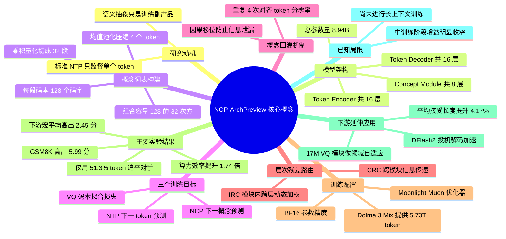

## 一、论文是干什么的？

今天几乎所有大语言模型，训练时做的都是同一件事：**猜下一个词**。给模型看一段文字，让它预测紧接着出现的那个 token，猜错了就调整参数。这个目标函数叫 Next Token Prediction（NTP，下一 token 预测），简单、通用、可无限扩展，是过去若干年大模型成功的基石。

但它也有个明显的别扭之处。想象你在教一个学生写文章，但每次只让他写下一个字，从来不问他「这段话你打算表达什么意思」。学生当然也能学会写作，可他脑子里那些「段落大意」「论证结构」这类抽象东西，完全是在反复练习写字的过程中**顺带**长出来的副产品，没有任何一道题直接考它。研究者们早就发现，模型的隐藏层里确实自发涌现出了语义概念、空间关系甚至世界状态的表示，但训练信号从来没有直接作用在这些抽象表示上。

这篇由上海人工智能实验室与上海交通大学 LUMIA Lab 合作的技术报告，提出的 NCP-ArchPreview 就是要补上这一课。它在保留「猜下一个词」的同时，额外让模型**猜下一个概念**（Next Concept Prediction，NCP）。这里的「概念」不是人工标注的，而是模型自己从隐藏状态里长出来的：把连续 4 个 token 的隐状态做平均，得到一个概念向量，再用向量量化把它归入一个自动学出来的「概念词表」。于是模型每往前走 4 个 token，就要额外回答一道题：接下来这 4 个 token 大致对应哪个概念？答案再反过来喂回 token 层，指导后面 4 个字怎么写。

换个类比：原来的模型像是一个只会「一个字一个字往下接」的人；NCP-ArchPreview 则像是一个人先在脑子里冒出「我下一句要讲的是一个转折」这样的念头，再把这个念头落实成具体的字。作者把这套架构做到了 8.9B 参数、5.73T token 的规模，是目前**潜空间语言模型（latent-space language model）做到的最大规模的一次验证**。结果相当亮眼：在完全相同的数据上，它只消耗 51.3% 的训练 token 就追平了 OLMo-3-7B 的最终预训练损失，训练完成后下游任务宏平均高出 2.45 分。

需要说明的是，论文名字里的 ArchPreview（架构预览）不是谦辞。作者把它定位为一次**架构层面的可行性验证**，模型只完成了预训练和中训练（mid-training），没有做长上下文扩展，也没有做指令微调，所以它不是一个拿来即用的聊天模型，而是一份「这条路走得通」的证据和一批开源检查点。

## 二、核心方法与创新

### 2.1 整体三段式结构

传统 Transformer 是一摞同质的层。NCP-ArchPreview 把 OLMo-3-7B 原本的 32 层劈成两半，中间塞进一个新模块，变成三段：

- **Token Encoder**（16 层）：照常处理 token，输出 token 级隐状态。
- **Concept Module**（8 层）：在**压缩后的概念序列**上工作，负责「猜下一个概念」。
- **Token Decoder**（16 层）：拿着 token 隐状态 + 预测出的概念，输出下一个 token 的概率。

关键在于中间这段的序列长度只有原来的四分之一。设压缩因子为 $k=4$，输入长度 $T$ 的 token 序列对应的概念序列长度就是 $M=\lfloor T/k \rfloor$。所以 Concept Module 虽然有 8 层、参数量和 8 个普通 Transformer 块相当，但注意力计算量只有约四分之一。这是整篇论文「便宜」的关键来源之一。

整个模型的输入输出接口和普通自回归模型**完全一样**：进去是 token，出来是 token，可以照常做逐 token 的采样解码。概念层是藏在内部的，不改变对外行为。

### 2.2 概念是怎么造出来的：从池化到乘积量化

**第一步，池化成连续概念。** Token Encoder 先产出隐状态：

$$
h_{1:T} = \text{TokenEncoder}_{\theta_e}(x_{1:T}), \quad h_t \in \mathbb{R}^{d}
$$

逐符号解释：$x_{1:T}$ 是输入的 $T$ 个 token；$\theta_e$ 是 Token Encoder 的参数；$h_t$ 是第 $t$ 个 token 的隐状态向量；$d$ 是隐藏维度，本文为 4096。

然后把每连续 $k$ 个隐状态做**均值池化**，得到第 $m$ 个连续概念向量：

$$
c_m = \frac{1}{k}\sum_{i=1}^{k} h_{(m-1)k+i}, \quad c_m \in \mathbb{R}^{d}
$$

逐符号解释：$m$ 是概念的序号；$k=4$ 是压缩因子；$(m-1)k+i$ 是这一组里第 $i$ 个 token 的全局位置；求和再除以 $k$ 就是取平均。说人话：**把相邻 4 个字的表示揉成一个意思块**。

**第二步，把连续概念离散化。** 直接让模型去回归一个连续向量是有风险的：损失只说「离目标多远」，却没有定义「什么样的向量才算一个合法的概念」，模型可以随便漂移到语义空间里任何一个角落。所以作者用向量量化（Vector Quantization, VQ）建了一本**概念词典**，强迫预测结果落在词典条目的组合里。

但这里有个容量难题。要覆盖自然语言里的概念多样性，词典必须极大；可词典一大，最近邻查找和码本训练都会崩。作者的解法是**乘积量化**（Product Quantization, PQ）——这是信息检索领域一个经典技巧。

先把概念向量切成 $S$ 段：

$$
c_m = \text{concat}\left(c_m^{1}, \ldots, c_m^{S}\right), \quad c_m^{s} \in \mathbb{R}^{d/S}
$$

逐符号解释：$S$ 是切分的段数，本文为 32；$c_m^{s}$ 是第 $s$ 段子向量，维度 $d/S = 4096/32 = 128$。

每一段有自己的小码本 $E^{s} = \{e_1^{s}, \ldots, e_N^{s}\}$，$N$ 是每个码本的条目数（本文为 128）。对每一段独立找最近的码字：

$$
n_m^{s} = \arg\min_{n \in \{1,\ldots,N\}} \left\| c_m^{s} - e_n^{s} \right\|_2^2, \qquad d_m^{s} = e_{n_m^{s}}^{s}
$$

逐符号解释：$\|\cdot\|_2^2$ 是欧氏距离的平方；$n_m^{s}$ 是选中的码字编号；$d_m^{s}$ 是量化后的第 $s$ 段结果。最后把 32 段拼回去就得到完整的量化概念 $d_m$。

**为什么这招管用？** 打个比方。如果要给全世界的人编一本「长相词典」，一本词典把每张脸整体存一遍，条目数会爆炸。乘积量化的做法是把脸拆成眼睛、鼻子、嘴巴等 32 个部位，每个部位只准备 128 种选项，那么组合起来就有 $128^{32}$ 种「脸」。论文里的**潜在词表容量正是 $N^{S} = 128^{32}$**，而实际存储的码字只有 $32 \times 128 = 4096$ 个。**用很小的码本撑起一个天文数字级别的概念空间**，这是整套设计的巧思所在。

### 2.3 Concept Module 怎么预测下一个概念

Concept Module 就是一摞标准 Transformer 层，输入是历史概念序列 $c_{<m}$，输出一个潜在状态：

$$
u_m = \text{ConceptModule}_{\theta_c}(c_{<m})
$$

接下来是这篇论文的一个精巧之处。既然概念被量化成了离散码字，最自然的做法是让模型做分类、选一个码字——但 argmax 不可导，梯度传不回去。作者的做法是：**为每一段配一个预测头，输出该段码本上的概率分布，然后取期望**。

$$
\boldsymbol{\pi}_m^{s} = \text{softmax}\left(\text{PredictionHead}_c^{s}(u_m)\right), \quad \boldsymbol{\pi}_m^{s} \in \mathbb{R}^{N}
$$

$$
\hat{c}_m^{s} = \sum_{n=1}^{N} \pi_{m,n}^{s}\, e_n^{s}
$$

逐符号解释：$\boldsymbol{\pi}_m^{s}$ 是第 $m$ 个概念第 $s$ 段在 128 个码字上的概率分布；$\pi_{m,n}^{s}$ 是选中第 $n$ 个码字的概率；$e_n^{s}$ 是对应码字向量；$\hat{c}_m^{s}$ 是加权平均出来的「软预测」。32 段拼接起来得到预测概念 $\hat{c}_m$。

这样一来，预测结果永远是**学到的码字的线性组合**，既保持了全程可导，又被约束在一个有结构的空间里，不会自由漂移。可以理解成：模型不是随便画一张脸，而是说「眼睛 70% 像 A 型、30% 像 B 型，鼻子像 C 型……」然后把这些部件混合出来。

### 2.4 概念怎么「回灌」到 token 层

预测出的概念序列长度只有 $M$，而 Token Decoder 需要长度为 $T$ 的输入，还必须严格保证不能偷看未来。作者的处理是：**先重复 $k$ 次对齐分辨率，再做一次因果移位**。设移位量 $\Delta = k$，token 级的概念信号为：

$$
b_t = \begin{cases} 0, & 1 \le t < \Delta \\ \hat{c}_{\lfloor (t-\Delta)/k \rfloor + 2}, & \Delta \le t < T \end{cases}
$$

逐符号解释：$b_t$ 是注入到第 $t$ 个位置的概念向量；前 $\Delta$ 个位置补零，因为此时还没有任何完整概念可用；$\lfloor (t-\Delta)/k \rfloor + 2$ 是查表索引，作用是确保**每个预测概念只在「用于预测它的那些 token 状态都已被处理完」之后才被注入**，杜绝信息泄漏。

由于概念和 token 共享同一个隐藏维度 $d$，融合方式非常朴素，就是逐元素相加：

$$
\tilde{h}_t = h_t + b_t
$$

然后 Token Decoder 基于融合后的状态照常做自回归预测：$p(x_{t+1} \mid x_{\le t}) = P_{\theta_d}(\tilde{h}_{\le t})$。

这一步是「概念指导生成」的落点：**模型先想清楚接下来这一小段要表达什么，再把这个念头当作额外线索交给写字的那一半网络**。

### 2.5 层次残差连接：IRC 与 CRC

三个模块处在不同深度、不同粒度，信息怎么流通是个问题。作者借鉴 MUDDFormer 的动态稠密连接，设计了两类连接。

**IRC**（Intra-Module Residual Connections，模块内残差）：标准 Transformer 是 $H_{\ell+1} = H_{\ell} + R_{\ell}$，只能加上一层的输出。IRC 把候选集扩展为该模块内所有历史层状态：

$$
H_{\ell+1}^{s} = \sum_{j=1}^{\ell+1} w_{\ell,j}^{s}\, X_{\ell,j}^{s}, \qquad w_{\ell}^{s} = \text{MLP}_{\ell}^{s}(R_{\ell}^{s})
$$

逐符号解释：$H_{\ell}^{s}$ 是模块 $s$ 第 $\ell$ 层的输入；$R_{\ell}^{s}$ 是该层 Transformer 块的输出（残差相加之前）；$X_{\ell,j}^{s}$ 是候选状态集合中的第 $j$ 项；$w_{\ell,j}^{s}$ 是由一个轻量 MLP 根据当前块输出动态算出的系数。这些系数**不做归一化**，因此可以取负值，表示带符号的组合。初始化时令 $w_{\ell}^{s} = [0,\ldots,0,1]$，也就是**一开始完全退化为标准残差连接**，训练过程中再慢慢学会去引用更早的层。

**CRC**（Cross-Module Residual Connections，跨模块残差）：在模块之间搭桥，源模块导出的多层表示先按粒度对齐（分块或重复），再用 softmax 归一化系数聚合：

$$
\boldsymbol{\alpha}_{\ell}^{s \leftarrow u} = \text{softmax}\left(\text{MLP}_{\ell}^{s \leftarrow u}(T_{\ell}^{s})\right), \qquad M_{\ell}^{s \leftarrow u} = \sum_{j=1}^{K} \alpha_{\ell,j}^{s \leftarrow u}\, \text{LN}(S_j^{u})
$$

$$
T_{\ell,\text{out}}^{s} = T_{\ell}^{s} + D_{\ell}^{s \leftarrow u} \odot M_{\ell}^{s \leftarrow u}
$$

逐符号解释：$u$ 是源模块，$s$ 是目标模块；$S_j^{u}$ 是源模块导出的第 $j$ 层表示，共 $K$ 层；$\text{LN}$ 是层归一化；$T_{\ell}^{s}$ 是目标模块当前状态；$D_{\ell}^{s \leftarrow u} \in \mathbb{R}^{d}$ 是一个可学习的对角缩放向量；$\odot$ 表示逐元素相乘。$D$ 初始化为很小的值，**模型起步时几乎等同于原始骨干网络**，再逐渐学会利用跨模块通路。

论文用了三条跨模块连接：Token Encoder 到 Concept Module、Token Encoder 到 Token Decoder、Concept Module 到 Token Decoder。其中第三条同样遵守因果移位，不会泄漏未来 token。

### 2.6 三个损失函数与联合训练

**VQ 损失**（只训码本，不动主干）：

$$
\mathcal{L}_{VQ} = \frac{1}{MS}\sum_{m=1}^{M}\sum_{s=1}^{S}\left\| \text{sg}(c_m^{s}) - d_m^{s} \right\|_2^2
$$

逐符号解释：$\text{sg}(\cdot)$ 是 stop-gradient（停止梯度）操作，意思是「这一项只当常数看，不往回传梯度」。因为目标 $c_m^{s}$ 被 stop-gradient 包住，这个损失**只会把码字往连续概念的分布上拉，而不会反过来改变 Token Encoder 的隐状态**。这样码本就像一群跟随者，始终追踪主干长出来的表示分布，而不会绑架主干。

**NCP 损失**（本文的主角）：

$$
\mathcal{L}_{NCP} = \frac{1}{M-1}\sum_{m=2}^{M}\left\| \hat{c}_m - \text{sg}(c_m) \right\|_2^2
$$

逐符号解释：$\hat{c}_m$ 是根据历史概念预测出来的第 $m$ 个概念；$c_m$ 是实际池化出来的第 $m$ 个概念；目标同样被 stop-gradient 冻住。所以 $\mathcal{L}_{NCP}$ 更新的是 Concept Module，以及**通过输入端的 $c_{<m}$ 间接更新 Token Encoder**。这条间接路径很重要：它促使 Token Encoder 在编码时多保留一些「对预测未来概念有用」的信息。

**NTP 损失**（老本行）：

$$
\mathcal{L}_{NTP} = -\frac{1}{T-1}\sum_{t=1}^{T-1} \log p_{\theta_d}\left(x_{t+1} \mid \tilde{h}_{\le t}\right)
$$

**总损失**：

$$
\mathcal{L}_{total} = \mathcal{L}_{NTP} + \alpha\,\mathcal{L}_{NCP} + \beta\,\mathcal{L}_{VQ}
$$

其中 $\alpha$ 和 $\beta$ 是两个辅助目标的权重系数。**原文未披露 $\alpha$ 与 $\beta$ 的具体数值**，也未描述权重的课程化调度（例如随训练阶段变化），论文只说明「三个目标在整个训练过程中联合优化」。整个系统是端到端训练的：码本、Token Encoder、Concept Module、Token Decoder 同时更新，没有分阶段冻结。

### 2.7 优化器与一个有趣的踩坑

矩阵参数用 Moonlight Muon 优化器，embedding、bias 等非矩阵参数用 AdamW：

$$
W_t = W_{t-1} - \eta_t\left(\frac{\lambda_{Muon}\, O_t}{\sqrt{\max(d_{in}, d_{out})}} + \lambda_{wd}\, W_{t-1}\right)
$$

逐符号解释：$O_t$ 是 Muon 正交化之后的更新方向；$\eta_t$ 是学习率调度值；$\lambda_{Muon}$ 控制更新幅度；$\lambda_{wd}$ 是权重衰减；$d_{in}$ 和 $d_{out}$ 是权重矩阵的输入输出维度。默认学习率 $6 \times 10^{-5}$，余弦调度与 OLMo-3-7B 保持一致。

作者在 4.6 节报告了一个值得所有做大规模训练的人注意的发现：**沿用 OLMo-3 的 layer-wise Q/K 归一化配合 Muon 优化器，会导致注意力 logit 持续膨胀**，伴随梯度范数剧烈尖峰和少数注意力头的范数离群。诊断结论是 Muon 的全矩阵更新会耦合多个头的更新，而 layer-wise 归一化只约束整体尺度，管不住单个头，于是个别头逐渐主导 pre-softmax 分数。改成 **per-head Q/K 归一化**能有效抑制这个现象。不过为了与 OLMo-3-7B 做严格可控的对照，主实验仍然沿用了 layer-wise 版本，per-head 只作为消融里的稳定化手段报告。

## 三、使用了哪些模型和计算资源？

| 项目 | 内容 |
|---|---|
| 骨干模型 | OLMo-3-7B 架构 |
| 总参数量 | 8.94B（HuggingFace 页面显示 8,938,363,792） |
| 层数划分 | Token Encoder 16 层 + Concept Module 8 层 + Token Decoder 16 层 |
| 隐藏维度 / FFN 维度 | 4,096 / 11,008 |
| 注意力头数 / KV 组数 / 头维度 | 32 / 32 / 128 |
| 词表大小 | 100,278 |
| 最大训练长度 | 8,192 token |
| 位置编码 | RoPE，base 为 500,000 |
| 注意力模式 | 局部窗口 4,096 token，每第四层用全注意力 |
| 激活 / 归一化 | SwiGLU / RMSNorm，$\epsilon = 10^{-6}$ |
| 概念压缩因子 $k$ | 4 个 token 状态压成 1 个概念 |
| PQ 段数 $S$ / 每段码字数 $N$ / 码字维度 | 32 / 128 / 128 |
| 潜在概念词表容量 | $128^{32}$ 种码字组合 |
| 参数精度 | BF16 |
| 优化器 | Moonlight Muon（矩阵参数）+ AdamW（其余） |
| 学习率 | $6 \times 10^{-5}$，余弦调度 |
| Stage-1 数据 | Dolma 3 Mix，5.73T token |
| Stage-2 数据 | Dolma 3 Dolmino，约 100B token 中训练 |
| 检查点保存 | Stage-1 每 100,000 步保存一次 |

关于算力，需要**如实标注多项缺失**：

- **GPU 型号：原文未披露。** 全文没有出现任何具体的加速卡型号。
- **训练总卡数：原文未披露。** 唯一出现的 GPU 数量是 5.1 节领域自适应吞吐实验中的「8 GPUs」和「1 GPU」，这是小规模对照实验，不是预训练集群规模。
- **训练总耗时与 GPU 小时数：原文未披露。** 论文完全没有给出墙钟时间或 GPU 小时的统计。
- **分布式训练框架：原文未披露。**
- **预训练全局 batch size：原文未披露**（仅在 scaling ladder 附录中提到对 batch size 做过搜索，drafter 训练中提到全局 batch size 为 512）。

论文口径里的「算力」一律用**解析 FLOPs** 表达而非实测机时。例如作者定义每个标准 OLMo-3-7B Transformer 块的参数量为 $P_{blk}$、计算量为 $F_{blk}$，则 NCP-ArchPreview 相当于 $40 P_{blk}$ 参数但只有 $34 F_{blk}$ 计算，因为 Concept Module 的序列长度只有四分之一。

已知的间接线索是：在搜索「NCP」前作的报道中提到，前身工作 ConceptLM 的算力由上海人工智能实验室提供；本文封面署名机构为 Shanghai AI Lab 与上海交通大学 LUMIA Lab，可以合理推断算力来源相同，但**这一点论文本身没有明说**。

## 四、实验结果

### 4.1 训练损失：一半数据追平对手

这是全文最抓眼球的结果。两个模型在**完全相同的数据、完全相同的顺序**上训练：

| 阶段 | 指标 | 数值 |
|---|---|---|
| Stage-1 | 追平 OLMo-3-7B 最终损失所需 token 占比 | 51.3% |
| Stage-1 | 等效收敛加速 | 1.95 倍 |
| Stage-1 | 最终损失差（末段） | 低 0.091 |
| Stage-2 | 追平所需 token 占比 | 66.2% |
| Stage-2 | 等效收敛加速 | 1.51 倍 |
| Stage-2 | 最终损失差 | 低 0.027 |

而且 Stage-1 的损失差距是**随训练推进不断扩大**的，说明这不是某个阶段的短暂优势。

### 4.2 下游评测：Stage-1 全面领先，Stage-2 增益收窄

评测覆盖 30 个基准族，遵循 OLMo-Core 的评测协议。关键数字（Vanilla 指官方发布的 OLMo-3 对应阶段模型）：

| 类别 | 指标 | Stage-1 Vanilla | Stage-1 NCP | 差值 | Stage-2 Vanilla | Stage-2 NCP | 差值 |
|---|---|---|---|---|---|---|---|
| 总体 | Overall AVG | 46.59 | 49.04 | **+2.45** | 56.98 | 57.57 | +0.59 |
| MMLU | AVG | 54.50 | 56.73 | +2.24 | 58.32 | 59.94 | +1.62 |
| 数学 | GSM8K | 39.27 | 45.26 | **+5.99** | 79.68 | 83.02 | +3.34 |
| 数学 | GSM-Symbolic | 18.85 | 22.80 | +3.95 | 57.32 | 60.32 | +3.00 |
| 数学 | AVG | 20.79 | 24.54 | +3.75 | 55.63 | 57.39 | +1.76 |
| 代码 | HumanEval | 27.10 | 31.38 | +4.28 | 49.31 | 45.62 | -3.69 |
| 代码 | AVG | 25.15 | 27.79 | +2.64 | 39.42 | 38.77 | -0.65 |
| 多选 STEM | AVG | 84.47 | 86.93 | +2.47 | 89.65 | 88.67 | -0.98 |
| 多选非 STEM | PiQA | 72.25 | 80.85 | **+8.60** | 78.35 | 81.45 | +3.10 |
| 多选非 STEM | AVG | 70.08 | 74.71 | +4.63 | 76.85 | 77.76 | +0.91 |
| 通用问答 | AVG | 54.29 | 54.76 | +0.47 | 53.49 | 54.04 | +0.55 |
| 似然（越低越好） | BPB AVG | 0.824 | 0.811 | -0.014 | 0.793 | 0.763 | -0.030 |

大白话总结：**预训练阶段结束时，新架构在几乎所有基准上都赢，数学提升幅度最大（相对提升约 18%）。** 到了中训练阶段（Stage-2），总体还是赢 0.59 分，但代码类反而小幅落后。作者给出的解释是 Stage-2 数据中代码只占约 10%，模型更好地拟合了整体混合分布，就会在占比小的领域上让出一点。

作者还诚实地报告了一个反直觉现象：Stage-2 的三个配方 V1/V2/V3，训练损失依次更低，但**下游表现依次更差**。这说明「损失越低 = 能力越强」在中训练阶段并不成立，可能源于训练数据分布与下游任务分布的错位。为此他们在附录 C 提出了一套代理指标方案：用 177,202 条专家轨迹（63 个来源、六大领域、约 100M 教师后缀 token，由一个冻结的 Qwen3.7-Plus 教师生成）计算能力维度的 NLL，只需一次冻结前向就能筛选配方。实测该代理指标与下游排序完全一致，HumanEval 的拟合 $R^2$ 达到 0.999，MMLU-STEM 为 0.962，但 BBH 只有 0.531。

### 4.3 消融：增益究竟来自哪里

这是回应「是不是只因为参数变多了」这个质疑的关键实验。四个配置在前 200B token 上对照：

| 模型 | 参数量 | 计算量 |
|---|---|---|
| NCP-ArchPreview | $40 P_{blk}$ | $34 F_{blk}$ |
| Vanilla（原版 OLMo-3-7B） | $32 P_{blk}$ | $32 F_{blk}$ |
| Vanilla size-aligned（参数对齐） | $40 P_{blk}$ | $40 F_{blk}$ |
| Vanilla computation-aligned（计算对齐） | $34 P_{blk}$ | $34 F_{blk}$ |

结论：NCP-ArchPreview **大幅优于计算对齐的 baseline**，说明增益不能用「多花了算力」解释；同时它**用 34/40 = 85% 的计算量逼近了参数对齐的 40 层 baseline**。逐组件叠加实验（Vanilla 到 +CM 到 +CM+Residual 到 +CM+Residual+NCP）显示三个组件各自都带来单调的损失下降，其中 NCP 目标本身是最后一块拼图。

层次残差的单独消融在 1B 规模、150B token 上做：

| 变体 | 平均语言模型损失 | 相对参照的损失变化 | 额外解析 FLOPs |
|---|---|---|---|
| 无层次残差（参照） | 2.2588 | 0.0000 | 0.000% |
| IRC + CRC（完整方案） | 2.2265 | **-0.0323** | +0.051% |
| 仅 IRC | 2.2315 | -0.0273 | +0.024% |
| IRC + 输入级跨模块连接 | 2.2292 | -0.0296 | +0.024% |
| IRC + 全阶段 softmax | 2.2295 | -0.0294 | +0.024% |
| Block AttnRes（$S=4$）+ 跨模块连接 | 2.2409 | -0.0180 | +0.026% |

完整方案以 **0.051% 的额外计算换来 0.0323 的损失下降**，性价比极高。作者也提醒，这个解析 FLOPs 口径没有计入源状态物化、内存带宽、规约操作和小核启动开销，实际运行时的代价会更高。

### 4.4 Scaling Law

在 $10^{19}$ 到 $10^{20}$ FLOPs 的多个预算点上，每个预算都搜索学习率、批大小以及模型尺寸与数据量的分配，取最优验证损失。结果显示 NCP-ArchPreview 相比 OLMo-3 的计算最优训练曲线，**算力效率提升 1.74 倍**。附录 D 列出了全部 27 个实验点的隐藏宽度、三段深度配置、每 token FLOPs 与训练 token 数。

值得一提的是作者对 FLOPs 估计的修正：因为 Concept Module 每个 chunk 只运行一次，经典的 $C \approx 6 N_{param} D$ 公式（$N_{param}$ 为非嵌入参数量、$D$ 为训练 token 数）会失真，他们改用 $C = F_{tok} D$，其中 $F_{tok}$ 是每 token 的解析训练 FLOPs。

## 五、潜在应用与已落地应用

### 5.1 只更新 17M 参数的 VQ 领域自适应

这是概念空间在预训练之后的第一个「变现」场景，也是论文里非常实用的一节。思路是：**冻结整个 token 级主干，只更新 VQ 码本和概念预测头**，一共 17M 可训练参数，而且**不新增任何参数**（对比 LoRA 要额外加 17M）。

三个领域各自从 Stage-1 检查点继续训练：代码用 Magicoder，数学用 Orca-Math，知识用 TriviaQA-RC。

| 领域 | 方法 | 目标域平均 | 相对基线变化 | 通用能力平均变化 |
|---|---|---|---|---|
| 代码 | +Full（8.9B 全参） | 28.43 | -1.61 | -0.48 |
| 代码 | +LoRA（17M） | 31.38 | +1.34 | -0.11 |
| 代码 | **+VQ** | **32.69** | **+2.65** | -0.42 |
| 数学 | +Full | 36.72 | +6.16 | -0.97 |
| 数学 | +LoRA | 33.71 | +3.15 | -0.42 |
| 数学 | **+VQ** | 34.83 | +4.27 | **+0.39** |
| 知识 | +Full | TriviaQA 58.28 | +18.00 | -0.29 |
| 知识 | +LoRA | TriviaQA 57.76 | +17.48 | -0.14 |
| 知识 | **+VQ** | TriviaQA 49.47 | +9.19 | **+0.03** |

读法：**代码领域 VQ 训练是三种方法里唯一全面正向的，也是唯一四项代码任务全部提升的；数学领域 VQ 在目标提升和通用能力保持之间取得最好的平衡（唯一通用能力不降反升的方法）；知识领域 VQ 明显不如全参和 LoRA。** 作者对最后一点的解释很到位：已有研究表明 Transformer 的 FFN 层像键值记忆，事实知识就存在那里；VQ 训练完全不碰主干 MLP，自然改写不了事实关联。

效率方面更漂亮（微批为 1、8 张 GPU 的条件下）：

| 方法 | 吞吐（token/s/GPU） | 单卡显存占用 |
|---|---|---|
| 全参训练 | 7,739 | 90.3% |
| LoRA | 10,400 | 49.0% |
| **VQ** | **15,632** | **32.4%** |

同样是优化 17M 参数，VQ 比 LoRA 快 50%，比全参快 2.02 倍。微批为 2、单卡时，全参直接 OOM，LoRA 占 87.9%，VQ 只用 51.6%。

### 5.2 给投机解码的 drafter 注入概念表示

这是第二个落地场景。先解释 **DFlash2 是什么**：它是 Inco AI 在 2026 年 8 月发布的一篇技术博客提出的方法，属于**块并行投机解码 drafter**这一类——传统投机解码的草稿模型一次只出一个 token，而块扩散（block diffusion）类方法可以一次前向就提出一整块 token，大幅降低起草延迟。DFlash2 的两个关键组件是：用**两抽头动态卷积**建模相邻草稿位置之间的局部依赖，以及用一个**轻量路径选择器**从每个位置的 top-16 候选里挑出一条连贯序列。

但块并行 drafter 有个固有难点：一次提出多个未来位置，很难保持整条轨迹的语义连贯。作者的直觉是，Concept Module 输出的概念表示天然就携带「接下来这一段大概要说什么」的信息，正好补上这块短板。

具体做法：对已验证前缀末尾位置 $t$，取最后一个完整 Target chunk 的概念表示 $c_{\lfloor t/k \rfloor}$，在 drafter 的每一层、每个提案位置注入：

$$
\tilde{s}_{t,j}^{(\ell)} = s_{t,j}^{(\ell)} + \tanh\left(g^{(\ell)}\right) \odot \text{RMSNorm}_{\ell}\left(c_{\lfloor t/k \rfloor}\right), \quad j = 1, \ldots, K
$$

逐符号解释：$s_{t,j}^{(\ell)}$ 是 drafter 第 $\ell$ 层第 $j$ 个提案位置的状态；$g^{(\ell)}$ 是该层的可学习门控标量，$\tanh$ 把它压到 $(-1, 1)$；$\odot$ 是逐元素相乘；$K$ 是提案位置数。门控**初始化为零**，意味着训练初期概念信号完全不起作用，模型自己决定要不要以及何时采纳它。这一改动只给 1.1B 的 drafter 增加了 **0.04M 参数**，且不增加 Target 模型的任何计算。

评测用平均接受长度（Mean Accepted Length, MAL）衡量：

$$
\text{MAL} = \frac{1}{R}\sum_{r=1}^{R} c_r
$$

其中 $R$ 是验证轮数，$c_r$ 是第 $r$ 轮提交的 token 数（含 Target 的纠正或奖励 token）。

| 基准 | Baseline | Baseline + Concept | 相对提升 |
|---|---|---|---|
| GSM8K | 6.351 | 6.537 | +2.93% |
| MATH | 6.105 | 6.240 | +2.22% |
| HumanEval | 5.432 | 5.845 | **+7.59%** |
| MBPP | 5.844 | 6.099 | +4.37% |
| **宏平均** | **5.933** | **6.180** | **+4.17%** |

实验设置严格对齐：相同的在线 Target 蒸馏流程、相同数据顺序、相同随机种子和训练预算，序列长度 8,192，每序列 512 个训练锚点，全局 batch 512，固定 5B token 子集重复 10 个 epoch，验证时提案视野为 16 个草稿 token。

### 5.3 与多 token 预测的协同

作者还在 3B 规模上验证了 NCP 与 MTP（Multi-Token Prediction）是互补而非替代的关系。3B 版 NCP-ArchPreview 划分为 8 层 Encoder、4 层 Concept Module、7 层 Decoder；对照组把 OLMo-3-3B 的 16 层按 8/1/7 切分并加上相同的层次残差。MTP 层按 DeepSeek-V3 的做法预测两位之后的 token，损失权重 0.3。

| 模型 | 平均语言模型损失 | 相对 OLMo-3 + Residual | 训练 FLOPs | FLOPs 变化 |
|---|---|---|---|---|
| OLMo-3-3B + Residual | 2.3805 | 0.0000 | $3.245 \times 10^{21}$ | 0.00% |
| OLMo-3-3B + Residual + MTP | 2.3739 | -0.0065 | $3.750 \times 10^{21}$ | +15.55% |
| NCP-ArchPreview | 2.3707 | -0.0098 | $3.227 \times 10^{21}$ | -0.57% |
| NCP-ArchPreview + MTP | 2.3664 | -0.0141 | $3.731 \times 10^{21}$ | +14.98% |

重点：**NCP 单独带来的改进（0.0098）大于给 baseline 加 MTP 带来的改进（0.0065），而且 NCP 的 FLOPs 还略低；两者叠加还能继续变好。**

### 5.4 开源情况

作者明确表示是为了「加速非原版基础架构的开源研究」而发布。已开源内容：

- [HuggingFace 模型集合 ArchSpace-Collection/ncp-archpreview](https://huggingface.co/collections/ArchSpace-Collection/ncp-archpreview)：约 19 个条目，包含 Stage-1 最终检查点、Stage-2 的 v1/v2/v3 三个配方版本、从第 100,000 步到第 1,300,000 步的中间检查点，以及一个名为 NCP_ArchPreview_dolma3_8.9B_Stage2_DFlash2_NCPFlash 的 1B 级 drafter 模型。
- [评测代码 LUMIA-Group/ncp_olmo_eval](https://github.com/LUMIA-Group/ncp_olmo_eval)，同时以 [ncp-olmo-eval](https://pypi.org/project/ncp-olmo-eval/) 的名字发布在 PyPI 上，提供 OLMo 与 NCP-ArchPreview 的可复现评测。
- 推理部署走 [InternLM/lmdeploy](https://github.com/InternLM/lmdeploy)。

组织 ArchSpace 本身也值得一提：它自我定位为「把大模型架构探索变成可复用知识」的开放实验，把社区提出的架构假设放进透明、可追溯、可复现的训练与评测流程，并把成功结果、负面结果和设计权衡都沉淀为共享资产。截至综述时该组织共有 40 个模型、4 个集合、1 个数据集。

### 5.5 潜在方向

论文与作者展望里提到的方向包括：**长上下文**（概念通路运行在压缩序列上，上下文越长这条路径的优势理论上越明显，作者认为这是特别有利的场景，但本次预览版没做）、**能力感知的数据配方筛选**（附录 C 的代理指标可扩展成常规工具）、**把语言模型损失与下游能力更稳定地打通的检查点选择准则**。

## 六、网络上的讨论与评价

**截至 2026-09-11，尚未检索到关于本文的集中讨论。** 以下是如实记录的检索结果：

- **HuggingFace Papers**：该论文在 HF 每日论文页面获得 **106 票**（精确数字，来自 HF 官方 API），由第一作者之一 Yuliang Liu（HF 账号 yuliang03181）于 2026-09-11 提交。页面下只有一条评论，来自提交者本人，内容是一句简短的自我描述：「A large-scale new architecture with latent space prediction.」。模型集合本身获得 15 个赞，Stage-1 检查点下载 819 次，三个 Stage-2 版本各下载 700 余次（数据采集于 2026-09-11）。
- **Reddit / Hacker News**：多次针对 `2609.10715`、`NCP-ArchPreview`、r/LocalLLaMA、Hacker News 的定向搜索均未找到任何相关帖子。论文 9 月 9 日才上 arXiv，9 月 11 日才登上 HF 每日论文，尚未进入社区讨论周期。
- **中文社区**（知乎、机器之心、量子位等）：同样未检索到针对本文的解读文章。
- **X / Twitter**：未检索到讨论本文的推文。

不过，**这篇论文的直接前身获得过一定关注**。前作 ConceptLM（[Next Concept Prediction in Discrete Latent Space Leads to Stronger Language Models](https://arxiv.org/abs/2602.08984)，2026 年 2 月，同一批核心作者）首次提出了 NCP 目标、乘积量化概念词表和概念条件生成，当时有 [Tanishq Mathew Abraham 在 X 上的推介](https://x.com/iScienceLuvr/status/2021161792110559311)、[arxiviq 的 Substack 解读](https://arxiviq.substack.com/p/next-concept-prediction-in-discrete)、[Alan Hou 的中文博客介绍](https://alanhou.org/blog/arxiv-next-concept-prediction/)以及 [AkihikoWatanabe 论文笔记仓库的记录](https://github.com/AkihikoWatanabe/paper_notes/issues/4496)。ConceptLM 当时只在 1.5B 以内从头训练，并通过继续预训练把 NCP 加到一个已有的 8B 模型上；本文的贡献在于**让 NCP 从预训练第一步就开启，并推到 8.9B 参数、数万亿 token 的规模**。

一个中立的观察：由于「超越 next-token prediction」是长期热门话题，这篇论文的关注度（106 票）在 HF 每日论文中属于偏高水平，但目前的讨论集中在「点赞」而非「辩论」阶段。考虑到模型权重与评测代码已完整开源，后续出现独立复现与批评性讨论的可能性较大。

## 七、思维导图

