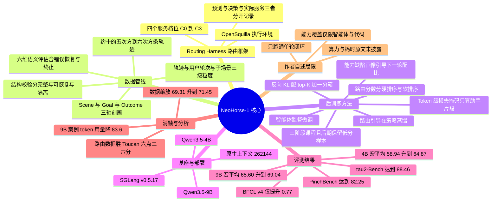

## 一、论文是干什么的？

想象你开了一家规模不小的翻译公司。客户的稿子进来以后，前台有一位「调度员」：简单的产品说明书派给实习生，法律合同派给资深译员，特别棘手的多语种项目派给首席专家。日复一日，这家公司的调度系统里积攒下海量记录——**每一单被判定成什么难度、最后交给了谁、这个人怎么一步步查资料改稿、客户最后满不满意**。

大多数公司会把这些记录当成运营台账，用完就归档。这篇论文的核心主张是：**这堆台账其实就是一套现成的教材，而且是一套自带难度标签、自带批改结果的教材**。你完全可以拿它回头去培训实习生，让实习生的水平往资深译员靠。更妙的是，实习生变强之后重新回到岗位上，调度系统又会记录下他新的强项和短板，于是下一轮培训的重点自动就变了。这个「用 → 记录 → 发现短板 → 针对性再训 → 继续用」的循环，就是论文说的**递归自我改进**（Recursive Self-Improvement，简称 RSI）。

放回到 AI 的语境：这里的「翻译公司」是一套**智能体执行框架**（harness，可以理解成给大模型套的一层外壳，负责管理上下文、工具调用和环境交互）；「调度员」是**智能体路由**（agentic routing），它在每一轮用户请求上判断这个请求需要多强的能力，然后分派给模型池里合适的那个模型；「实习生」就是被训练的 4B 和 9B 小模型。论文把这套东西叫 **NeoHorse-1**，是一个 Agent-Native（原生为智能体而生）的模型家族，由前华为诺亚方舟实验室主任、盘古大模型负责人王云鹤创办的基元律动（TokenRhythm）牵头，联合无问芯穹、清华、北大、港中文、阿里巴巴等机构完成。

需要说清楚的是，作者自己也承认：这篇报告**只跑通了这个循环的第一圈**。它证明了「从路由日志里榨出来的数据确实比公开合成数据管用」，但「转第二圈、第三圈还能不能继续涨」，论文明确写着 remains to be tested（尚待验证）。所以把它读成一份**工程可行性验证报告**，比读成「AI 开始自我进化了」要准确得多。

## 二、核心方法与创新

整套系统可以拆成两大块：**数据侧**（怎么把线上日志变成能训练的教材）和**方法侧**（怎么用这份教材训模型）。

### 2.1 路由框架：四个能力档位 C0 到 C3

路由器工作在「用户轮次」（user turn）这个粒度上——也就是从用户说一句话开始，到用户下一次说话为止的这一整段（中间模型的思考、工具调用、工具返回都算在这一轮里）。它根据当前请求、最近的对话、之前的路由决策以及可用的执行状态，把这一轮归到四个服务档位之一：

- **C0**：处理边界清晰、低风险的请求
- **C1**：通用默认档
- **C2**：支持多步推理与执行
- **C3**：提供最强能力或最高可靠性（这一档可能由多个提议模型加一个聚合器组成）

这里有一个很关键、也很容易被忽略的设计：论文把**路由器的原始预测**、**被策略调整后的决策**、**实际服务的档位**三者分开记录。为什么要分开？因为实际服务的那个档位可能被用户手动指定覆盖、可能因为某个模型临时不可用而降级、可能因为服务策略而改变。**用「最后是谁干的活」来当难度标签是不准的，用「路由器原本判断需要多强能力」才准**。论文明确说，用于课程排序的是前者（路由估计），不是后者（实际执行）。

### 2.2 数据管线：三级粒度加两道质检

语料被组织成三个互相嵌套的粒度：

- **轨迹**（trajectory）：一次完整的交互，保留用户请求、模型响应、工具调用、环境观测、恢复尝试、终止结果
- **用户轮次**（user turn）：序列化训练的基本单位
- **子场景**（subscene）：相邻的、共享同一个局部目标的若干用户轮次，是语义刻画的单位

然后过两道质检门。

**第一道是结构校验**，纯规则、不用模型打分。它检查载荷可读性、消息结构、请求与响应是否齐全、事件的因果顺序、工具调用与结果是否配对闭合，并检测缺失响应、孤儿观测、重复或冲突的工具调用 ID、未解析的内部调用、含混的终止分支。输出三种结果：**内部完整**（直接进入下一关）、**部分可恢复**（只取因果闭合的子轨迹）、**隔离**（丢弃）。

**第二道是六维语义评估**，由一个只能引用轨迹中显式证据的语义评判员来做，六个维度是：目标达成、指令遵循、工具使用、证据一致性、错误恢复、终止。每个维度打 PASS、WARN、FAIL 或 NOT_EVALUATED 四种判定之一。论文特别强调一条原则：**证据缺失或评判调用中断，绝不能被折算成正面结论**。这是防止质检被自己糊弄过去的关键。

此外，每个子场景还从三个轴被刻画：**Scene**（用户在做什么、在什么场景下）、**Goal**（期望达成什么、成功如何判定）、**Outcome**（这次尝试可验证的结果）。这三个轴加上路由信号，就构成了后面「能力引导数据分配」的坐标系。

### 2.3 智能体监督微调：只给该学的地方算损失

训练序列长这样：历史对话作为上下文，当前这一轮的助手输出作为学习目标。哪些 token 要算损失、哪些不算，用一个二值掩码 $m_{i,t}$ 控制。$m_{i,t}=1$ 的是当前轮里保留的助手目标片段——包括存在时的推理内容、序列化的工具调用及其参数、可见回复以及回复结束符。其余一切（系统指令、工具规格、框架注入的上下文、用户消息、工具返回结果、padding）都是 $m_{i,t}=0$。

损失函数（原文式 1）：

$$
\mathcal{L}_{\text{SFT}}(\theta,\mathcal{B}) = -\frac{\sum_{i\in\mathcal{B}}\sum_{t=2}^{T_i} m_{i,t}\log p_{\theta}(x_{i,t}\mid x_{i,<t})}{\sum_{i\in\mathcal{B}}\sum_{t=2}^{T_i} m_{i,t}}
$$

符号含义：$\mathcal{B}$ 是一个批次里的若干条序列；$x_{i,t}$ 是第 $i$ 条序列第 $t$ 个 token；$T_i$ 是该序列长度；$p_{\theta}$ 是参数为 $\theta$ 的模型给出的概率；$m_{i,t}$ 就是上面那个掩码。分母是这一批里被监督的 token 总数——所以这个目标**按被监督 token 数归一化，而不是按序列总长度或轮次数量归一化**，等于说每个被监督的 token 权重相等。

另一个上下文策略细节：**当前轮的推理内容保留，更早轮次的推理内容丢弃**，只留下可见回复和工具交互作为上下文。这跟 Qwen3.5 与 DeepSeek-V3.2 的做法一致。

### 2.4 路由引导的课程学习：按需要多强的能力来排课

有了路由档位，就有了天然的难度代理。论文给出两种打分方式（原文式 2）。设 $k_i \in \{0,1,2,3\}$ 是分配到的档位索引，$\pi_{i,k}$ 是路由器对档位 $C_k$ 给出的归一化分数（满足 $\pi_{i,k} \geqslant 0$ 且 $\sum_{k=0}^{3}\pi_{i,k}=1$）：

$$
s_i = \begin{cases}
k_i, & \text{hard ordering} \\[4pt]
\sum_{k=0}^{3} k\,\pi_{i,k}, & \text{soft ordering}
\end{cases}
$$

**硬排序**就是直接用档位编号；**软排序**是用分数加权的平均档位。软排序的好处在于，两个同样被分到 C2 的样本，如果一个对 C3 的支持度更高，它的 $s_i$ 就更大，能被区分开。这个 $s_i$ **只用来决定样本什么时候被呈现，不用来给损失加权**。

课程本身分三个阶段，每个阶段大约占三分之一的样本，整体从低分往高分推进，但**刻意在后期保留一部分低分样本**。为什么？论文的解释是：防止训练末期被高需求交互彻底垄断。这就像考前冲刺不能只刷压轴题，还得留几道基础题维持手感，否则简单题反而容易做错。每个样本一轮只用一次；三个阶段之间**不重置优化器、不重启学习率调度**，也就是说这是一次连贯的训练，只是数据配比在滑动。

### 2.5 路由引导的在策略蒸馏：老师盯着学生自己写的作业改

SFT 有个根本性的错配：训练时模型看到的前缀是「录好的标准答案」，部署时模型看到的前缀是「自己刚生成的东西」。一旦自己写偏了，后面就没见过这种局面。这就是所谓的分布偏移。

**在策略蒸馏**（On-Policy Distillation，简称 OPD）的解法是：让学生自己生成，老师在学生走过的每一步上给出监督信号。具体流程：

1. 取录制轨迹中「助手回复之前的那一刻」作为生成起点（starting context）
2. 每个起点用式 2 打一个路由分数，同样按三阶段分配，记阶段 $j$ 的上下文分布为 $\rho_j$，其中 $j \in \{1,2,3\}$
3. 阶段 $j$ 里，rollout 用的学生检查点 $p_{\bar{\theta}}$ 对批次里每个上下文生成一条回复，得到回复批次 $\mathcal{R}$
4. 一个**固定的教师模型**在每个位置上给出下一 token 分布

为了压缩监督信号，只保留 rollout 学生在每个位置的 top-$K$ 候选 token，剩余概率质量全部并入一个额外的桶，得到 $K+1$ 个桶上的粗化分布 $\tilde{P}_{\theta,r,t}$（学生）和 $\tilde{Q}_{r,t}$（教师）。目标函数是按回复归一化的**反向 KL 散度**（原文式 3）：

$$
\mathcal{L}_{\text{OPD}}(\theta;\mathcal{R}) = \frac{1}{\sum_{r\in\mathcal{R}} w_r}\sum_{r\in\mathcal{R}}\frac{w_r}{L_r}\sum_{t=1}^{L_r} D_{\mathrm{KL}}\!\left(\tilde{P}_{\theta,r,t}\;\|\;\tilde{Q}_{r,t}\right)
$$

其中 $L_r$ 是回复 $r$ 保留的长度，$w_r$ 是固定的回复权重（不加权时取 1），$D_{\mathrm{KL}}$ 是 KL 散度。注意方向是 $\tilde{P}$ 在前——这是**反向 KL**，倾向于让学生的分布收缩到教师分布的高概率模式上，而不是铺开去覆盖教师的所有可能。提示 token 和 padding 不计损失；梯度只穿过学生的概率，生成出的 token、候选 ID、教师打分都固定住。

合起来的分阶段目标（原文式 4）：

$$
\mathcal{L}_{R\text{-}\mathrm{OPD}}^{(j)}(\theta) = \mathbb{E}_{\mathcal{C}\sim\rho_j,\;\mathcal{R}\sim p_{\bar{\theta}}(\cdot\mid\mathcal{C})}\left[\mathcal{L}_{\text{OPD}}(\theta,\mathcal{R})\right]
$$

训练过程中会**刷新 rollout 检查点**，所以越到后面，教师监督的是越新的学生行为；但在收集到的那批回复上做优化时，rollout 参数 $\bar{\theta}$ 保持不动。

### 2.6 能力引导的数据分配：把评测结果变成下一轮的配方

这是闭环的最后一环。每一轮迭代，当前检查点会在一个**与训练数据严格去污染隔离**的分层评测套件上跑一遍，结果按语义属性、质量维度、结果状态、路由档位聚合，形成一张**模型缺陷画像**（model-deficiency profile）。下一轮的训练配比就朝着表现差的区域倾斜，同时保持广覆盖。

论文强调了一个取舍：**这些分配决策改变的是数据组成，而不是引入一个专门针对失败的新目标函数**。已验证成功的轨迹提供正向监督，有信息量的失败则用来标记「这块需要补课」。

## 三、使用了哪些模型和计算资源？

| 项目 | 情况 |
| --- | --- |
| 基座模型 | Qwen3.5-4B（40 亿参数）与 Qwen3.5-9B（90 亿参数），产出 NeoHorse-1-4B 与 NeoHorse-1-9B |
| 教师模型（OPD） | 原文只说是一个固定的教师，**具体型号原文未披露** |
| 路由模型池 | 论文说是异构模型池配合多个 harness（含 OpenSquilla），**具体成员清单原文未披露** |
| GPU 型号与卡数 | **原文未披露**。论文正文、附录均无任何 GPU、NPU、集群规模的描述 |
| 训练耗时 | **原文未披露**。无每步、每阶段或总训练时长数据 |
| 训练超参 | 学习率、批大小、优化器设置、训练轮数 **原文未披露**（仅说明三阶段之间不重置优化器与学习率调度） |
| top-$K$ 的具体取值 | **原文未披露**（只给了 $K+1$ 分箱的形式） |
| 数据规模 | 主语料约 $10^5$ 到 $10^6$ 条框架生成轨迹；另有公开的指令、推理、工具使用、代码、偏好数据补充覆盖。精确的轨迹数 $N_{\text{traj}}$ 与 token 数 $N_{\text{tok}}$ 论文说记录在 training manifest 里，**正文未给出数字** |
| 推理部署 | SGLang v0.5.17；温度 $=1.0$、top-$p=0.95$、top-$k=20$、min-$p=0.0$、presence penalty $=1.5$、repetition penalty $=1.0$；思考模式开启 |
| 最大输出长度 | IFEval、IFBench、HumanEval、LiveCodeBench v6 用 51200 token；其余 benchmark 用 32768 token |
| 上下文窗口 | 模型卡标注原生 262144 token，配合缩放配置可扩展到约 1010000 token |

关于算力，唯一的公开线索来自中文媒体报道而非论文本身：据[量子位报道](https://www.qbitai.com/2026/09/485555.html)与[网易转载的发布稿](https://www.163.com/dy/article/L6AN0J9B05118HA4.html)，无问芯穹为该项目提供了算力支持与 Infra 优化，通过模型算法与芯片硬件协同优化来提升训练效率、优化成本——但**同样没有给出任何卡数或时长的数字**。

评测细节上有两点值得留意：QwenClawBench、WorkBuddy Bench、$\tau^2$-Bench 跑三次独立运行取算术平均，而 **PinchBench 和 VitaBench 只跑了单次**；VitaBench 的用户模拟器与评判模型改用 DeepSeek-V4-Flash，因为原推荐模型已下线。

## 四、实验结果

一句话总结：**后训练在两个尺寸上都有普遍提升，而且 4B 模型训完之后，综合分已经很接近甚至在部分项目上超过了 9B 的原始基座**。

### 4.1 4B 赛道（原文表 1）

| 模型 | BFCL v4 | Vita Bench | $\tau^2$ Bench | Pinch Bench | WorkBuddy | QwenClaw | HumanEval | LiveCodeBench v6 | IFBench | IFEval | 平均 |
| --- | --- | --- | --- | --- | --- | --- | --- | --- | --- | --- | --- |
| Qwen3.5-4B（基座） | 61.02 | 21.50 | 84.29 | 71.19 | 24.62 | 38.47 | 87.20 | 53.71 | 60.33 | 87.06 | 58.94 |
| Spark-X2.5-4B | 63.71 | 37.00 | 77.72 | 62.37 | 26.47 | 43.52 | 92.07 | 54.86 | 73.33 | 91.13 | 62.22 |
| Gemma-4-E4B-it | 47.18 | 5.00 | 43.60 | 47.60 | 11.65 | 22.98 | 84.76 | 52.00 | 40.00 | 74.68 | 42.95 |
| Nanbeige-4.2-3B | 67.28 | 31.50 | 85.08 | 66.78 | 21.03 | 40.66 | 98.78 | 72.50 | 55.00 | 84.47 | 62.31 |
| Agents-A1-4B | 46.60 | 39.25 | 81.00 | 75.07 | 33.37 | 43.16 | 92.68 | 56.57 | 63.33 | 83.55 | 61.46 |
| **NeoHorse-1-4B** | 61.79 | 32.00 | **88.46** | **77.33** | **34.41** | **44.68** | 96.95 | 59.43 | 65.33 | 88.35 | **64.87** |

注：Nanbeige-4.2-3B 的 LiveCodeBench v6 分数 72.50 是原文标注的官方博客引用值，非作者自测。

宏平均从 58.94 提到 **64.87**，涨了 5.93 分。**相对基座提升最大的几项**：VitaBench 加 10.50、WorkBuddy Bench 加 9.79、HumanEval 加 9.75、LiveCodeBench v6 加 5.72、$\tau^2$-Bench 加 4.17。而函数调用类的 BFCL v4 只涨了 0.77——这个分布很说明问题：**训练数据来自真实的多步执行轨迹，所以受益最大的就是需要多步执行的任务**；单轮函数调用本来就不太依赖这种经验。

### 4.2 9B 赛道（原文表 2）

| 模型 | BFCL v4 | Vita Bench | $\tau^2$ Bench | Pinch Bench | WorkBuddy | QwenClaw | HumanEval | LiveCodeBench v6 | IFBench | IFEval | 平均 |
| --- | --- | --- | --- | --- | --- | --- | --- | --- | --- | --- | --- |
| Qwen3.5-9B（基座） | 64.88 | 31.25 | 88.04 | 74.55 | 39.60 | 44.04 | 92.68 | 65.14 | 66.33 | 89.46 | 65.60 |
| Granite-4.2-8B | 52.06 | 23.00 | 62.28 | 56.93 | 35.07 | 37.01 | 96.34 | 72.00 | 78.00 | 92.98 | 60.57 |
| Ornith-1.5-9B | 65.03 | 26.75 | 83.68 | 68.22 | 29.29 | 47.27 | 93.90 | 47.43 | 40.00 | 71.35 | 57.29 |
| Gemma-4-12B-it | 62.06 | 36.50 | 59.37 | 58.89 | 29.65 | 43.53 | **100.00** | 73.14 | 77.67 | 94.27 | 63.51 |
| Muse-Glimmer-30B | 53.74 | **48.50** | 76.64 | 71.35 | **45.85** | 46.11 | 98.17 | 65.71 | 78.67 | 93.90 | 67.86 |
| **NeoHorse-1-9B** | **67.43** | 42.25 | **90.82** | **82.25** | 40.15 | **48.73** | 98.17 | 65.14 | 66.33 | 89.09 | **69.04** |

宏平均从 65.60 提到 **69.04**，涨了 3.44 分。注意这里出现了一个诚实的细节：**指令遵循类基本持平，IFEval 还略降了 0.37 分**（89.46 降到 89.09），LiveCodeBench v6 持平（都是 65.14）。作者自己的解读是：对更强的基座来说，这套训练的边际收益**更集中在交互式执行上，而不是相对静态的指令合规**。

另外，NeoHorse-1-4B 在 $\tau^2$-Bench（88.46 对 88.04）、PinchBench（77.33 对 74.55）、HumanEval（96.95 对 92.68）等项目上已经追平或超过了 Qwen3.5-9B 基座——这正是论文标题里 narrowing the aggregate gap（缩小总体差距）的实证。

### 4.3 数据来源对比（原文表 3）

这是全文最关键的一组对照实验：同样从 Qwen3.5-4B 起步，同样的课程调度、优化器设置、随机种子、打包方式、评测协议、相近的训练预算，只换数据来源。

| 训练数据 | LCB | HE | IF | BFCL | $\tau^2$ | 平均 |
| --- | --- | --- | --- | --- | --- | --- |
| 公开智能体数据 Toucan | 49.14 | 87.80 | 56.33 | 54.77 | 73.54 | 64.32 |
| 路由框架数据（本文） | 53.14 | 96.34 | 61.33 | 57.20 | 84.85 | 70.57 |
| 差值 | +4.00 | +8.54 | +5.00 | +2.43 | +11.31 | **+6.26** |

五项全胜，平均高 **6.26 分**，其中 $\tau^2$-Bench 高 11.31 分、HumanEval 高 8.54 分。这条结论的分量在于：它把涨分归因到了**数据来源本身**，而不是课程学习这个算法技巧——因为算法两边完全一样。

### 4.4 数据规模缩放（原文图 7）

从同一个质量排序的轨迹池里构造**严格嵌套**的子集（大子集完整包含小子集），固定模型初始化、优化、打包和遍历次数。在 LiveCodeBench、HumanEval、IFBench、BFCL V4、$\tau^2$-Bench 五项的无加权平均上，分数从基座的 **69.31** 稳步升到最大数据规模下的 **71.45**。横轴是「唯一被监督 token 数」，对数刻度。

### 4.5 轨迹层面的定性分析

论文还做了案例分析，比表格更能说明差别在哪：

- **QwenClawBench 项目排期任务**：Qwen3.5-4B 找到了工作目录里的相关文件，但**漏看了一封含有更新后依赖约束的经理邮件**，于是基于过期信息排期、产出无效日程、还把文件写错了位置。NeoHorse-1-4B 则取到了这条补充证据、识别出更新后的依赖、重算并验证了排期、把结果存到了指定路径。
- **WorkBuddy 代码修复任务**：NeoHorse-1-4B 尝试一次就停手，没有建立起有效的测试与修复循环，留下了一个线程执行语义的错误。NeoHorse-1-9B 走完了「编辑 到 测试 到 检查 到 修复」的完整循环，反复吸收执行反馈直到验证器通过。
- **PinchBench 数据分析任务**：发现 pandas 不可用后，NeoHorse-1-4B 反复尝试装依赖、手写 CSV 解析、打本地补丁，全部失败还引入了新错误，最终没能交出报告。NeoHorse-1-9B 认出原路走不通，果断改用 Python 标准库的 csv 和数学库，完成了分析和报告。相比 4B 的轨迹，9B 轨迹的模型请求数、执行时间、token 用量分别减少了约 **70.8%**、**76.7%**、**83.6%**。

作者的结论很到位：大模型的优势**不在于动作更多或搜索更广，而在于更能识别出这条路走不通并及时换路**，把有限的交互预算花在真正推进任务的动作上。

### 4.6 一个小提醒：到底是 10 个还是 11 个 benchmark？

这里有个需要说明的出入。arXiv v1 的摘要和结论都写的是 ten benchmarks（十个），正文表 1、表 2 也确实是十列加一个平均列：BFCL v4、VitaBench、$\tau^2$-Bench、PinchBench、WorkBuddy Bench、QwenClawBench、HumanEval、LiveCodeBench v6、IFBench、IFEval。而 [HuggingFace 论文页](https://huggingface.co/papers/2609.08183)上呈现的摘要版本写的是 eleven benchmarks（十一个）。两处表述不一致，**以正文表格为准应为 10 个**，可能是不同版本摘要的口径差异（例如是否把 $\tau^2$-Bench 的 Airline、Retail、Telecom 三个域分开计数）。

## 五、潜在应用与已落地应用

### 5.1 已经开源的东西

模型和代码都已经放出来了，许可证是 **Apache License 2.0**（相当宽松，允许商用）：

- [GitHub 仓库 TokenRhythm/NeoHorse](https://github.com/TokenRhythm/NeoHorse)：截至检索时 133 star、3 fork、0 open issue。内容包括技术报告、对话与工具调用的 Python 示例脚本、SGLang 与 vLLM 的部署说明
- [HuggingFace 模型合集](https://huggingface.co/collections/TokenRhythm/neohorse-1)：包含 [NeoHorse-1-4B](https://huggingface.co/TokenRhythm/NeoHorse-1-4B) 与 [NeoHorse-1-9B](https://huggingface.co/TokenRhythm/NeoHorse-1-9B)，BF16 safetensors 格式，另有 GGUF 量化版本（8bit、5bit、4bit）。ModelScope 上也有镜像
- 基座模型的视觉组件已被移除，专注纯文本推理
- **训练数据本身没有开源**——仓库里只有数据处理理念的描述，没有实际语料

### 5.2 潜在应用方向

- **端侧与私有部署的智能体**：4B 带 GGUF 量化，本身就是为了能在消费级硬件上跑智能体任务而准备的。对于不能把数据送出内网的场景（内部代码库、企业文档、客服工单），一个 4B 就能接近 9B 基座的模型有实际意义
- **任何已经在跑模型路由的团队**：这篇论文最可迁移的其实不是模型，而是**方法论**。如果你的产品已经在用「简单请求走便宜模型、复杂请求走贵模型」的路由策略，那么你手上已经有了这篇论文所需的全部原材料——路由预测、执行日志、任务结果。把这些做成课程学习的难度标签，几乎是零额外标注成本
- **蒸馏的成本控制**：反向 KL 加 top-$K$ 分箱的做法，把教师监督从全词表分布压成了 $K+1$ 个桶，这是一个很实际的工程省钱手段
- **数据质检流程本身**：结构校验的三档输出（完整、部分可恢复、隔离）加六维语义评估，是一套可以直接照搬到自家轨迹数据管线的设计

### 5.3 商业背景

据中文媒体报道，基元律动由王云鹤（前华为诺亚方舟实验室主任、盘古大模型负责人）创办，[新浪财经](https://finance.sina.com.cn/jjxw/2026-09-08/doc-inirceww4611871.shtml)与[界面新闻](https://www.jiemian.com/article/15070150.html)都在 9 月 8 日发布了该模型的快讯。作者列表中还出现了 Visionplus Capital 和 WX Capital 两家投资机构的署名，这在技术报告里比较少见。

## 六、网络上的讨论与评价

截至 2026-09-11，讨论的**热度集中在 HuggingFace 和中文科技媒体，英文社区尚未出现集中的深度讨论**。

**HuggingFace 论文页**：精确票数 **390 票**，被标为 #1 Paper of the day（当日第一），由作者之一 JarvisPei 于 9 月 9 日提交。页面评论区目前只有作者贴出的仓库链接、若干条已被隐藏或标记为垃圾的评论，以及 librarian-bot 的自动推荐。该 bot 列出的相似论文包括 Nanbeige4.2-3B、RSIBench-Data、Agentic Routing、AREX、UI-Mate、LEGO-RL、Macaron-V1 等，可以看出「harness 原生数据飞轮」和「递归自我改进」在 2026 年已经形成了一个相当拥挤的研究方向。

**中文媒体**：[量子位](https://www.qbitai.com/2026/09/485555.html)的报道标题是「王云鹤创业后交出首个模型」，重点落在团队背景和「4B 综合表现达到或超越 9B 基础模型」这个卖点上，并提到清华、北大团队参与算法研究、无问芯穹提供算力与 Infra 优化。该报道同时提出了一个**行业层面的质疑**：头部模型厂商也在向 Agent 基础设施延伸、垂直整合趋势明显，中间层公司的长期生存空间存疑。[网易转载的发布稿](https://www.163.com/dy/article/L6AN0J9B05118HA4.html)措辞相对克制，明确把成果定位为「递归自我改进的单轮工程验证」，并指出改善主要体现在流程清晰、反馈可观察的任务上——这个限定说得比论文摘要还诚实。

**英文技术博客**：[HackerNoon](https://hackernoon.com/neohorse-1-4b-a-4b-model-built-for-ai-agents-and-tool-use)、[MindStudio](https://www.mindstudio.ai/blog/neohorse-1-4b-recursive-self-improvement)、[AI/TLDR](https://ai-tldr.dev/releases/tokenrhythm-neohorse-1/) 等聚合站点都做了发布报道，内容基本是模型卡和技术报告的复述，属于资讯性转载而非独立评测。

**Hacker News 与 Reddit**：多次定向检索均**未找到专门的讨论帖**。知乎方面也未检索到有实质内容的独立分析文章。考虑到论文发布仅三天，这是正常的；HF 上 390 票的热度与英文社区讨论的缺席形成的反差，更可能反映的是投票来源以中文圈和 HF Daily Papers 订阅者为主。

**值得关注但尚无人公开讨论的点**（笔者观察，非检索所得）：论文中大量基线模型与评测集（Spark-X2.5-4B、Agents-A1-4B、Ornith-1.5-9B、Muse-Glimmer-30B、PinchBench、WorkBuddy Bench、QwenClawBench、OpenSquilla 等）在公开生态中知名度有限，评测又基本由作者自测完成，因此这套数字的可复现性还需要第三方验证。

## 七、思维导图

