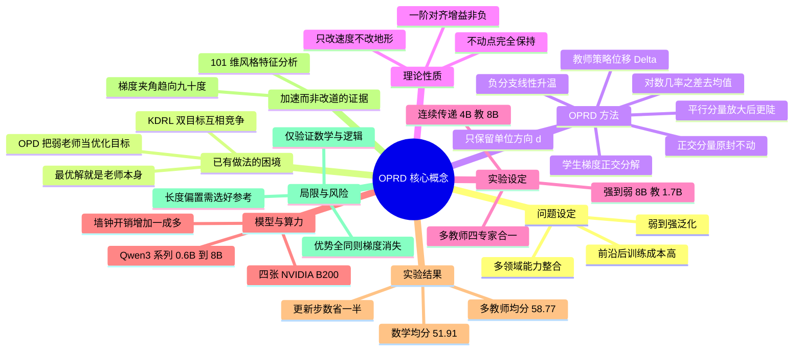

## 一、论文是干什么的？

想象一所中学。有一位老教师，他本人的数学水平其实只能考 40 分左右，但他刚刚花了一年时间自学、刷题、总结，从原来的 20 分提高到了 40 分。现在学校来了一个天赋极高的新生，这个学生潜力能上 90 分，但眼下还是一张白纸，只能考 26 分。问题是：**这位只能考 40 分的老师，能不能把这个学生教到 90 分？**

按常理，老师教学生就是「你照着我写的答案抄」。这样最好的结果是学生也考 40 分——老师的水平成了学生的天花板。这正是机器学习里**知识蒸馏**（distillation）的困境：蒸馏的数学目标是让学生的输出分布去匹配老师的输出分布，那么这个目标函数的最优解，**就是老师本身**。老师多强，学生最多多强。

这篇论文的核心洞察非常漂亮：**别去学老师会什么，去学老师「进步的方向」。** 老教师从 20 分涨到 40 分的这个过程中，他脑子里发生了什么变化？他学会了「遇到几何题先画辅助线」「算完要回代验算」「不要急着下结论」。这些「变化量」本身是宝贵的、通用的，并不受他 40 分水平的限制。论文把这个「进步向量」提取出来，不是拿它当学生的作业答案，而是**当成一个方向指示牌**：学生自己做题、由判卷程序打分（这就是 RLVR，可验证奖励强化学习），当学生自己摸索出的改进方向恰好和老教师当年的进步方向一致时，就把这一步**踩得更用力一点**；如果不一致，学生该怎么走还怎么走。

这个方法叫 **OPRD**（On-Policy Reverse Distillation，在线策略反向蒸馏）。名字里的「反向」（Reverse）指的是知识流动的方向反了——传统蒸馏是大模型教小模型（强到弱），这里是小模型教大模型（弱到强）。「在线策略」（On-Policy）指的是训练数据全部来自学生自己当下生成的回答，而不是老师预先写好的标准答案。

为什么这件事重要？论文给了两个非常现实的产业场景：

1. **世代传递**：每训练一代新的前沿大模型，后训练（post-training）阶段要重新烧掉巨量算力。上一代模型辛辛苦苦用 RL 训练出来的成果，能不能直接「转账」给下一代更大的模型，而不是让新模型从零再来一遍？
2. **多领域整合**：与其在一个巨无霸模型上同时调数学、代码、逻辑的奖励函数（每次试错都极贵），不如先用一堆便宜的小模型分头把各个领域练好，再把它们的成果**合并**进一个大模型。

这两件事的共同需求都是：让弱模型的后训练成果流向强模型，**但绝不能让弱模型限制强模型的上限**。

顺带一提，「弱到强泛化」这条研究线源自 OpenAI 在 2023 年底的工作（Burns 等人，2024 年正式发表），他们的原始动机是 AI 对齐：未来超越人类的 AI 只能由能力不如它的人类来监督，那这种「弱监督」还有效吗？他们用 GPT-2 去监督 GPT-4，发现学生确实能超过老师，但只能补回强监督差距的一部分。OPRD 这篇论文把这个话题从「对齐安全」拉到了「工程效率」的维度。

## 二、核心方法与创新

### 2.1 先看清楚传统方法卡在哪

要理解 OPRD，先得看懂它的两个对照组。

**RLVR**（可验证奖励强化学习）：学生自己生成答案，程序自动判对错（比如数学题对答案、代码跑测试），对的就鼓励、错的就惩罚。设学生策略为 $\pi_\theta$，输入 $x$ 来自数据集 $\mathcal{D}$，学生采样出回答 $y$，走过的每个前缀记为 $s_t=(x,y_{<t})$。设第 $t$ 个 token 的优势值为 $A_t$（大致就是「这个 token 有多值得鼓励」），$\mathbf{z}_t$ 是该位置的下一 token logits 向量，那么 token 级别的策略梯度是：

$$
\mathbf{g}_t := A_t \nabla_{\mathbf{z}_t} \log \pi_\theta(y_t \mid s_t)
$$

逐符号解释：$\nabla_{\mathbf{z}_t}$ 表示对 logits 向量求梯度；$\log\pi_\theta(y_t\mid s_t)$ 是学生在前缀 $s_t$ 下选出真实采样到的 token $y_t$ 的对数概率。整个 $\mathbf{g}_t$ 是一个和词表等长的向量，它告诉你「为了让奖励更高，这个位置各个词的 logit 应该怎么调」。RLVR 的好处是上限只取决于验证器和学生自身的能力，缺点是**慢**——学生要靠自己盲目试错。

**OPD**（在线策略蒸馏）：学生自己生成回答，但每走一步都去问老师「你在这个位置会怎么选词」，然后逼学生对齐老师。常见的反向 KL 形式是：

$$
\mathcal{L}_{\mathrm{OPD}}(\theta) := \mathbb{E}_{x\sim\mathcal{D},\, y\sim\pi_\theta(\cdot\mid x)}\left[\sum_t D_{\mathrm{KL}}\big(\pi_\theta(\cdot\mid s_t)\,\|\,\pi_T(\cdot\mid s_t)\big)\right]
$$

这里 $\pi_T$ 是冻结的老师策略，$D_{\mathrm{KL}}$ 是 KL 散度（衡量两个概率分布差多远）。OPD 的好处是**快**，因为每个 token 都有密集的监督信号。但致命问题写在数学里——在可实现的前提下，这个目标的逐点最优解是：

$$
\arg\min_{\pi(\cdot\mid s_t)} D_{\mathrm{KL}}\big(\pi(\cdot\mid s_t)\,\|\,\bar\pi_T(\cdot\mid s_t)\big) = \bar\pi_T(\cdot\mid s_t)
$$

**最优解就是老师本人。** 学生学到头就是复刻老师，天花板焊死了。

论文还强调，老师的最终策略其实混杂了三样东西：后训练学到的真本事、从它自己的基座模型继承的偏好、以及受限于小模型容量的将就行为。直接匹配老师，等于把这三样**全盘照收**。

### 2.2 第一步：提取「老师的进步方向」

OPRD 的做法是：不看老师现在是什么样，只看老师**变了什么**。

准备两个冻结的模型：$\pi_T$ 是做完 RL 后训练的老师，$\pi_T^{\mathrm{ref}}$ 是这个老师做 RL **之前**的参考策略（也就是它的起点）。在学生自己走到的每个前缀 $s_t$ 上，分别取这两个模型的下一 token logits 向量 $\mathbf{z}_T(s_t)$ 和 $\mathbf{z}_T^{\mathrm{ref}}(s_t)$，相减，再做去均值处理：

$$
\mathcal{C}(\mathbf{v}) := \mathbf{v} - \frac{1}{|\mathcal{V}|}(\mathbf{1}^\top\mathbf{v})\mathbf{1}
$$

$$
\Delta_t := \mathcal{C}\big(\mathbf{z}_T(s_t) - \mathbf{z}_T^{\mathrm{ref}}(s_t)\big) = \mathcal{C}\big(\log\pi_T(\cdot\mid s_t) - \log\pi_T^{\mathrm{ref}}(\cdot\mid s_t)\big)
$$

逐符号解释：$\mathcal{V}$ 是词表，$|\mathcal{V}|$ 是词表大小，$\mathbf{1}$ 是全 1 向量。$\mathcal{C}$ 这个算子做的事就是「把向量每个分量都减去平均值」，因为 logits 整体加一个常数不改变 softmax 之后的概率，去均值是为了扔掉这个无意义的公共偏移。$\Delta_t$ 就是**老师的策略位移**：在这个具体的语境下，后训练让老师对哪些词更偏爱了、对哪些词更嫌弃了。

类比：这就像把老师做 RL 前后的两本错题笔记摊开对比，只看**红笔改动的部分**，而不看整本笔记。

关键的一步是：论文**只取这个位移的方向，扔掉它的大小**：

$$
\mathbf{d}_t := \Delta_t / \lVert\Delta_t\rVert_2
$$

这里 $\lVert\cdot\rVert_2$ 是 L2 范数。为什么要归一化？因为 $\Delta_t$ 的大小是在弱老师那个小小的策略空间里学出来的，它的**强度**对强学生不一定合适，甚至不一定能提高验证器奖励。所以只借用它的「指路」功能，不借用它的「推力」。

### 2.3 第二步：把方向用来放大学生自己的梯度

现在手上有两个向量：学生自己的验证器梯度 $\mathbf{g}_t$，和老师的进步方向 $\mathbf{d}_t$。OPRD 把前者按后者做**正交分解**。

定义对齐系数（内积）：

$$
u_t := \mathbf{d}_t^\top \mathbf{g}_t
$$

投影分量和正交分量分别为：

$$
\mathrm{Proj}_{\mathbf{d}_t}(\mathbf{g}_t) := u_t\mathbf{d}_t, \qquad \mathbf{g}_t^{\perp} := \mathbf{g}_t - \mathrm{Proj}_{\mathbf{d}_t}(\mathbf{g}_t)
$$

然后，**只把投影分量放大，正交分量原封不动**：

$$
\tilde{\mathbf{g}}_t := \mathbf{g}_t + \lambda_t\,\mathrm{Proj}_{\mathbf{d}_t}(\mathbf{g}_t) = \underbrace{(1+\lambda_t)\,\mathrm{Proj}_{\mathbf{d}_t}(\mathbf{g}_t)}_{\mathrm{amplified}} + \underbrace{\mathbf{g}_t^{\perp}}_{\mathrm{unchanged}}
$$

其中 $\lambda_t\ge 0$ 是放大强度。训练时用 $\tilde{\mathbf{g}}_t$ 代替 $\mathbf{g}_t$ 做反向传播。

类比：学生在解题迷宫里摸索，他自己的梯度 $\mathbf{g}_t$ 是他当前想迈的那一步。老教师站在旁边指了一个方向 $\mathbf{d}_t$。OPRD 的规则是：把学生这一步**分解**成「沿着老师指的方向的那部分」和「垂直于老师方向的那部分」，然后只把前者放大 $1+\lambda_t$ 倍。注意——老师**从不替学生决定往哪走**，老师只能让学生在他本来就想走的方向上走得更快。如果学生压根不想往老师指的方向走（即 $u_t=0$，两者正交），那老师的指示完全不起作用。

这就是 reverse distillation 与普通蒸馏最根本的区别：**老师从来不是优化目标，只是一个缩放器。**

### 2.4 「保持策略优化的不动点」到底是什么意思

这句话是这篇论文理论上最漂亮的部分。把上面的操作写成矩阵形式：

$$
\tilde{\mathbf{g}}_t = (\mathbf{I} + \lambda_t\mathbf{d}_t\mathbf{d}_t^\top)\,\mathbf{g}_t
$$

其中 $\mathbf{I}$ 是单位矩阵，$\mathbf{d}_t\mathbf{d}_t^\top$ 是秩为 1 的投影矩阵。当 $\lambda_t\ge0$ 时，这个矩阵是**可逆的正定矩阵**，于是有两条性质：

$$
\tilde{\mathbf{g}}_t = \mathbf{0} \iff \mathbf{g}_t = \mathbf{0}
$$

$$
\langle \mathbf{g}_t, \tilde{\mathbf{g}}_t\rangle = \lVert\mathbf{g}_t\rVert_2^2 + \lambda_t u_t^2 \ \ge\ \lVert\mathbf{g}_t\rVert_2^2
$$

第一条论文称为 Stationarity，第二条称为 Alignment Gain。

**第一条（不动点保持）的含义**：「不动点」（stationary point）就是梯度为零、优化停下来的那些点，它们决定了优化过程最终会收敛到哪里——也就是**目标是什么**。这条式子说：改造后的梯度为零，当且仅当原梯度为零。换句话说，OPRD **一个不动点都没有增加，也一个都没有删除**。整个优化问题的「地形图」——山峰在哪、山谷在哪——完全没变，变的只是学生在这张地形图上**爬山的速度分布**。

这就回答了「为什么不改变不动点却能加速」这个看似矛盾的问题。用一个类比：你把汽车的油门踏板改灵敏了，车能去的地方一个都没多、一个都没少（地图没变），但你到达目的地的时间变短了。相比之下，传统蒸馏是**改了地图**——它在老师的位置上凿出一个新的山谷，学生掉进去就出不来了。

**第二条（对齐增益）的含义**：$\langle\cdot,\cdot\rangle$ 是内积，衡量改造后的梯度和原梯度「劲往一处使」的程度。这个内积等于原梯度长度的平方，**加上一个非负项** $\lambda_t u_t^2$。由于是平方项，不论 $u_t$ 是正是负都贡献正收益。这保证了：改造后的更新方向一定**不会**把原来的一阶进展抵消掉，而且 $|u_t|$ 越大（学生和老师方向越吻合或越对立），一阶进展越大。论文在附录 A 里把这些 token 级的增益加总，得到了整个回答上「保证的一步上升量」。

### 2.5 第三步：非对称的正负分支调度

$u_t$ 的**符号**含义不同，需要区别对待：

- $u_t \ge 0$：学生想走的方向和老师的进步方向**一致**。放大它等于强化「验证器和老师都认可」的更新，这是最可靠的加速来源。
- $u_t < 0$：学生想走的方向和老师**相反**。放大它等于强化「验证器支持、但偏离老师」的行为——这正是**学生超越老师**的通道。

但论文指出一个陷阱：两个信号里都可能含有和奖励无关的系统性偏置。形式化地写作 $\mathbf{g}_t = \mathbf{g}_t^{\star} + \epsilon_t$，其中 $\mathbf{g}_t^{\star}$ 是真正提升奖励的信号，$\epsilon_t$ 汇总了结构性偏置（最典型的就是「回答长度」偏好）。如果只放大一侧符号，这个偏置会被**系统性地累积放大**。

所以 OPRD 采用非对称调度。在第 $k$ 个优化步：

$$
\lambda_t := \begin{cases} \lambda, & u_t \ge 0,\\[4pt] \lambda\cdot\min\!\left\{\dfrac{k}{K_{\mathrm{warm}}},\,1\right\}, & u_t < 0,\end{cases}
$$

其中 $\lambda$ 是放大强度，$K_{\mathrm{warm}}$ 是预热步数。**正分支从第一步就满功率开启**（早期学生弱，跟着老师走最靠谱）；**负分支从 0 线性爬坡到 $\lambda$**（早期学生的 rollout 质量差，它「反对老师」的意见不可信；训练后期学生变强了，这些反对意见才值得放大）。由于始终 $\lambda_t\ge0$，前面两条理论性质在整个调度过程中都成立。

类比：一个新来的天才学生，第一周让他先老老实实照着老教师的思路练；练熟了之后，再逐步鼓励他「你要是觉得老师这招绕远了，就按你自己的来」。论文在附录 B.3 里对比了三种调度（负分支爬坡、正分支退火、固定对称），发现固定对称（一上来就 $\lambda_+=\lambda_-=1.0$）学得明显更慢，印证了这个设计。

工程细节：实际实现中，$\mathbf{d}_t$ 只在**学生策略下概率最高的 10 个 token**上截断计算（支撑集为「实际采样到的 token 并上学生 top-10」），把修正集中在高概率词表区域，避免在整个十万级词表上做稠密运算。

## 三、使用了哪些模型和计算资源？

### 模型

全部来自 **Qwen3 系列**（Qwen Team, 2025b），涵盖 instruct 版和 Base 版：

| 角色 | 场景 | 老师 | 学生 |
|---|---|---|---|
| 连续模型传递（数学） | AIME 等 | Qwen3-4B，GRPO 第 75 步检查点，non-thinking | Qwen3-8B，non-thinking |
| 连续模型传递（推理） | Reasoning Gym 四任务 | Qwen3-4B-Base，String 任务用第 75 步、其余用第 105 步 | Qwen3-8B-Base |
| 多教师整合 | Reasoning Gym 四任务 | 4 个 Qwen3-4B-Base 单任务专家 | 1 个 Qwen3-8B-Base |
| 强到弱蒸馏（数学） | AIME'24 | Qwen3-8B，第 105 步 | Qwen3-1.7B |
| 强到弱蒸馏（推理） | Knights & Knaves | Qwen3-8B-Base，第 105 步 | Qwen3-0.6B |
| 梯度消失失败案例 | Knights & Knaves | Qwen3-8B-Base，第 105 步 | Qwen3-1.7B-Base |

参数量就写在型号里：0.6B / 1.7B / 4B / 8B，即约 6 亿到 80 亿参数。所有老师都是先用 GRPO 在对应训练数据上后训练出来的，训练学生时**完全冻结**。OPRD 额外需要的参考策略 $\pi_T^{\mathrm{ref}}$ 用的是**原始未经 RL 的 Qwen3-4B 系列模型**。

### 硬件与算力

- **GPU 型号与卡数**：**4 张 NVIDIA B200**，使用 FSDP（Fully Sharded Data Parallel）分片训练。论文在附录 C 和附录 K 两处均明确写了这一点。
- **精度与并行配置**：BF16、DP4、rollout TP1、Flash Attention 2、去 padding、梯度检查点。rollout 引擎设 `gpu_memory_utilization=0.60`、`max_num_seqs=128`。动态 token 批处理每卡上限 36,864 tokens。
- **总训练耗时**：**原文未披露**。论文没有给出任何一次完整实验跑了多少小时或多少 GPU-hours。
- **单步墙钟时间**（附录 K 的受控测量：64 prompts，每个 8 条 rollout，每条回答强制固定 16,384 tokens，四次独立试验）：

| 方法 | 单步总时间（秒） | 相对 GRPO 开销 | Rollout | 冻结模型前向 | 参数更新 |
|---|---|---|---|---|---|
| GRPO | 977.72 ± 16.83 | 基准 | 602.20 | 0.00 | 304.00 |
| OPD | 1048.00 ± 17.49 | +7.2% | 610.74 | 60.46 | 305.38 |
| KDRL | 1055.41 ± 15.94 | +7.9% | 618.20 | 60.17 | 305.92 |
| **OPRD** | **1094.44 ± 16.17** | **+11.9%** | 607.39 | 108.80 | 306.79 |

注意：rollout 生成占了 GRPO 单步的 61.6%，是绝对大头。OPRD 之所以比 OPD 只多 4.4%，是因为它多出来的开销几乎全部来自「额外再前向一次参考策略」（60.46 秒变成 108.80 秒）。而真正做投影和缩放的那个 hook，只让参数更新多花 2.79 秒，仅占 OPRD 整步的 0.25%。

- **显存峰值**：OPRD 整步最大值 **151.27 GiB/卡**，比 GRPO 高 13.98 GiB（+10.2%），比 OPD 和 KDRL 高 13.21 GiB。其中可辨认的两大来源是：冻结的老师与参考模型参数分片 3.75 GiB，以及修正 hook 里瞬时分配的 9.43 GiB 稠密梯度张量。论文特别说明，用「实际采样 token 并上 top-10」的稀疏支撑集（最多仅 1.38 MiB），避免了额外 9.27 GiB 的「回答长度乘以词表」拷贝。

### 数据集

- **数学训练**：DAPO-Math-17K（约 1.7 万题）。
- **推理训练**：Reasoning Gym 的四个任务——Knights & Knaves（骑士与无赖逻辑题）、Quantum Lock、String Manipulation、Countdown。每个任务构造 20,000 条固定题池，19,800 条训练、200 条留作评测。分析章节另外用到了 Color Cube 和 Binary Matrix 两个任务。
- **数学评测**：AIME'24、AIME'25、HMMT'25、OlympiadBench，指标 Mean@16（每题采 16 次取平均）。
- **推理评测**：上述四任务，指标 Pass@1。

### 关键超参数

学习率 $1\times10^{-6}$ 常数调度、前 10 步 warm-up；AdamW（$\beta=(0.9,0.999)$，weight decay 0.01，梯度裁剪 1.0）；PPO 裁剪区间 $[0.20,0.28]$；**不加 KL 正则、不加熵正则**；采样温度 1.0、top-p 1.0、无 top-k；最大 prompt 长度 2,048 tokens；最大回答长度数学 20,480、Reasoning Gym 8,192；每个 prompt 采 8 条 rollout；prompt batch 与 mini-batch 数学为 64/64、Reasoning Gym 为 64/32。数学任务有长度惩罚：16,384 tokens 以内不罚，之后线性惩罚，到 20,480 tokens 时罚到 $-1$。

OPRD 自身只有两个超参：$\lambda_+=0.5$ 固定，$\lambda_-$ 从 0 爬到 0.5，爬坡窗口数学为 30 步、Reasoning Gym 为 75 步。训练步数：单老师 150 步、多老师 300 步、强到弱 45 步。

## 四、实验结果

论文的核心指标口径要先说清楚：**已训练策略那几行不是最终检查点的分数，而是训练过程中 5 个等间隔检查点的平均分**（单老师取第 30/60/90/120/150 步，多老师取第 60/120/180/240/300 步）。这种算法是故意的——它同时反映了「最终多强」和「学得多快」，这正是 OPRD 主打的卖点。

### 实验一：连续模型传递（4B 老师教 8B 学生）

大白话：一个只有 40 分左右的 4B 老师，去带一个初始 26 分的 8B 学生，看能带到什么程度。

| 策略 | AIME'24 | AIME'25 | HMMT'25 | Olympiad | 数学均分 | Knights | Quantum | String | Count | 推理均分 |
|---|---|---|---|---|---|---|---|---|---|---|
| 老师（4B） | 42.50 | 38.75 | 21.25 | 52.15 | 38.66 | 57.50 | 46.58 | 32.00 | 42.50 | 44.65 |
| 学生初始（8B） | 25.63 | 19.58 | 12.50 | 46.22 | 25.98 | 11.00 | 3.14 | 3.00 | 3.00 | 5.04 |
| 加 GRPO | 46.63 | 36.42 | 21.96 | 52.52 | 39.38 | 54.20 | 36.24 | 35.50 | 41.30 | 41.81 |
| 加 OPD | 46.92 | 38.21 | 21.42 | 51.24 | 39.44 | 55.00 | 39.62 | 35.10 | 41.60 | 42.83 |
| 加 KDRL | 53.46 | 43.13 | 26.08 | 53.28 | 43.99 | 53.30 | 36.63 | 38.10 | 49.50 | 44.38 |
| **加 OPRD** | **66.92** | **56.04** | **31.42** | **53.26** | **51.91** | **73.30** | **51.11** | **42.20** | **54.10** | **55.18** |

读法：OPRD 的数学均分 51.91，比最强基线 KDRL 高 **7.92 分**；推理均分 55.18，高 **10.80 分**。AIME'24 上更是从老师的 42.50 飙到 66.92，**学生的分数超过老师的 1.5 倍**。在 Knights & Knaves 上，学生最终 73.30，而老师只有 57.50。

学习曲线的形状比数字更说明问题：OPD 一开始涨得很快，但**在老师的水平附近就趴窝了**（这正是「老师即天花板」的实证画面）；GRPO 一路慢慢爬，能爬得高但太慢；OPRD 则**前期跟 OPD 一样快，后期不但不趴窝，还持续往上走**，明显早于 GRPO 就达到了后者训练结束时的水平。论文在引言里量化了这一点：OPRD 达到弱老师水平所需的学生更新步数，比 GRPO **少 33% 到 67%**，早期检查点最高领先 **22.7 个百分点**。

### 实验二：多教师整合（4 个 4B 专家合并进 1 个 8B 学生）

大白话：四个各自只擅长一科的小老师，能不能合力教出一个四科全能、且每科都超过对应老师的大学生？

| 策略 | Knights | Quantum | String | Count | 均分 |
|---|---|---|---|---|---|
| 四位专家老师（4B-Base） | 57.50 | 46.58 | 32.00 | 42.50 | 44.65 |
| 学生初始（8B-Base） | 11.00 | 3.14 | 3.00 | 3.00 | 5.04 |
| 加 Mix-RL | 64.90 | 43.91 | 35.90 | 46.00 | 47.68 |
| 加 MOPD | 57.10 | 37.70 | 35.50 | 42.10 | 43.10 |
| 加 KDRL | 65.90 | 44.09 | 35.00 | 44.90 | 47.47 |
| **加 OPRD** | **80.70** | **59.68** | **39.70** | **55.00** | **58.77** |

OPRD 均分 58.77，**超过 Mix-RL 11.09 分、超过专家均分 14.12 分，且四个任务上全部超过对应的专家老师**——说明这不是「拆东墙补西墙」的跨任务折中，而是全面提升。达到「老师级水平」所需的更新步数比 Mix-RL **少 55%**。论文推测原因是：OPRD 只放大每个任务自己的梯度沿该任务老师方向的分量，而不是去匹配整个专家策略，因此天然减少了跨任务干扰。这个投影操作形式上像多任务优化里的 PCGrad，但作用对象不同——PCGrad 是在两个冲突的任务梯度之间投影，OPRD 是在「学生梯度」与「老师方向」之间投影，而且它**只放大、从不删除任何分量**。

### 实验三：强到弱蒸馏（验证方法不依赖师生大小关系）

| 策略 | AIME'24，8B 教 1.7B | Knights & Knaves，8B-Base 教 0.6B | 均分 |
|---|---|---|---|
| 老师 | 52.29 | 64.50 | 58.40 |
| 学生初始 | 10.00 | 5.00 | 7.50 |
| 加 GRPO | 18.92 | 20.60 | 19.76 |
| 加 OPD | 29.79 | 20.20 | 25.00 |
| 加 KDRL | 25.33 | 33.70 | 29.52 |
| **加 OPRD** | **33.58** | **49.40** | **41.49** |

即使在传统的「大教小」场景，OPRD 也比 OPD 高 3.79 分（AIME'24）和 29.20 分（K&K）。这说明 OPRD 不是一个只在弱到强这个特殊方向才管用的技巧。

### 与其他弱到强方法的横向对比

| 策略 | AIME'24 | Knights | String | 均分 |
|---|---|---|---|---|
| 老师 | 42.50 | 57.50 | 32.00 | 44.00 |
| 学生初始 | 25.63 | 11.00 | 3.00 | 13.21 |
| 加 GRPO | 46.63 | 54.20 | 35.50 | 45.44 |
| 加 OPD | 46.92 | 55.00 | 35.10 | 45.67 |
| 加 W2SR-P，在老师正确轨迹上做 SFT | 45.42 | 62.50 | 38.00 | 48.64 |
| 加 S2L-PO，混入弱探索者的离策略 rollout | 60.54 | 63.40 | 38.70 | 54.21 |
| 加 OPSD，用老师正确草稿作特权上下文自蒸馏 | 15.88 | 24.60 | 24.60 | 21.69 |
| 加 Direct-OPD，把策略位移当稠密奖励 | 35.04 | 49.20 | 29.20 | 37.81 |
| 加 W2S-OPD，把位移重锚到学生基座造代理老师 | 52.96 | 59.50 | 35.20 | 49.22 |
| **加 OPRD** | **66.92** | **73.30** | **42.20** | **60.81** |

这张表很关键：Direct-OPD 和 W2S-OPD 是两篇**同期的相关工作**，它们也提取了「弱老师的策略位移」，但都把位移本身**当成了优化目标**。结果 OPRD 分别高出它们 23.00 分和 11.59 分。论文的解释是：那两种做法完全依赖位移里编码的信息，而 OPRD 通过保留正交分量 $\mathbf{g}_t^{\perp}$，让学生仍然可以追求「位移里没有、但验证器支持」的改进方向。这可以说是对「只放大、不替换」这个设计哲学最有力的实证辩护。

### 「老师只是加速而非改道」是怎么验证出来的

论文用了三条独立的证据链：

1. **回答风格的统计指纹**（4.4 节，图 5b）。在 AIME'24 上，用 **101 个标准化特征**刻画每个模型的回答风格，分成五大类：连接词、情态词、语法、标点、句段结构。然后计算「归一化距离差」，看每种方法的平均风格是更靠近弱老师，还是更靠近「只用 GRPO 纯 RL 训出来的那个学生」。结论非常干净：**在全部五个类别上，OPD 都更像老师；而 OPRD 都更像 GRPO 学生。** 也就是说，OPRD 的学生吸收了老师学到的东西，却没有继承老师的说话方式——它走的仍然是自己那条 RL 路线，只是走得更快。

2. **梯度夹角的动态追踪**（图 3c）。在 Knights & Knaves 上追踪 $\mathbf{d}_t$ 和 $\mathbf{g}_t$ 之间的平均夹角 $\theta_t$（排除组内奖励全同导致 $\mathbf{g}_t=\mathbf{0}$ 的 rollout 组）。训练早期，$u_t>0$ 的 token 呈现显著对齐、$u_t<0$ 的呈现显著对立，说明老师方向和学生梯度有很强的耦合，这正是「引导得动」的前提。随着训练推进，两组的平均夹角**都向 90 度收敛**。由于 $\lVert\mathrm{Proj}_{\mathbf{d}_t}(\mathbf{g}_t)\rVert_2/\lVert\mathbf{g}_t\rVert_2 = |\cos\theta_t|$，趋向正交意味着能被老师放大的那部分梯度占比越来越小——**老师的影响力随训练自动衰减**。这是「加速」而非「改道」的最直接量化刻画：老师是个助推器，推完就自动脱落。

3. **token 级的具体案例**（图 5a）。在一条 AIME'25 的回答里，学生的 top-1 token 是 `0`，直接补完得到 2016；而老师位移 $\mathbf{d}_t$ 下的 top-1 token 是 `5`。作者强行让学生输出 `5`，同样的学生会走「252 加 504 等于 756，756 加 1260 等于 2016」这条更绕的路——**老师那条路也是对的，只是绕**。这个 `0` 恰好是展示的 token 里与 $\mathbf{d}_t$ 对齐度最负的。OPRD 的负分支在这里抬高了 `0` 的 logit、压低了 `5` 的，**选择了学生自己更短的解法而不是老师那条有效但绕远的路**。

### 消融实验

- **引导方向 $\mathbf{d}_t$ 的构造方式**（图 3a）：对比「归一化的弱策略位移」「OPD 的教师匹配梯度」「OPSD 的自蒸馏梯度」三种选择。**弱策略位移最快也最持久**。OPD 梯度捕捉的是完整的师生差异，老师太弱时加速有限；OPSD 是离策略监督，会限制学生探索别的推理路径。
- **放大强度 $\lambda$**（图 3b）：扫 $\lambda\in\{0, 0.05, 0.1, 0.2, 0.5, 1.0\}$（$\lambda=0$ 即 GRPO）。**任何 $\lambda>0$ 都优于 $\lambda=0$**，且 $\lambda$ 增大到 0.5 之前，早期加速也随之变快；超过 0.5 后基本没变化。所以默认 $\lambda=0.5$，**不需要精细调参**。这个「引导强度与学习速度的系统性对应关系」本身就是「加速确实来自方向修正」的证据。
- **老师检查点质量**（表 3 右）：分别用 GRPO 第 15/60/105/150 步的 4B-Base 检查点当老师。越晚、越强的检查点让学生学得越快。由于 $\Delta_t$ 已归一化，这个好处不能归因于位移的**大小**，只能说明晚期检查点编码了**更有奖励信息量的方向**。最惊人的一个数字：**第 60 步的老师在 Knights & Knaves 上只有 29.0% Pass@1，对应的 OPRD 学生却冲到了约 88%**——老师的绝对水平确实没有构成学生的天花板。
- **参考策略的选择**（图 4b、4c）：在 Color Cube 任务上，用第 0 步还是第 30 步当 $\pi_T^{\mathrm{ref}}$，结果差距巨大——第 0 步参考导致 OPRD 在 **52.5%** Pass@1 就卡住（甚至低于 GRPO 和 KDRL），换成第 30 步则跃升到 **89.5%**。原因见下节的长度偏置。
- **分支调度策略**（附录 B.3，图 7）：对比默认的 $\lambda_-$ 爬坡（$\lambda_+=0.5$、$\lambda_-$ 从 0 到 0.5）、$\lambda_+$ 退火（$\lambda_+$ 从 0.5 到 0、$\lambda_-=0$）、固定对称（$\lambda_+=\lambda_-=1.0$）。前两种都有快速的早期增益，固定对称尽管用了更大的 $\lambda=1.0$ 却明显更慢。作者因此把 $\lambda_-$ 爬坡定为默认。

### 局限性

论文自己列得很坦诚：

1. **梯度消失会让方法失效**。OPRD 要求验证器梯度非零。在 Qwen3-8B-Base 教 Qwen3-1.7B-Base 做 Knights & Knaves 的极端实验里，学生大多数回答直接无效，组内奖励全部相同，组相对优势归零，$\mathbf{g}_t=\mathbf{0}$，投影也就没了——**老师的引导彻底失去着力点**。结果 OPRD、GRPO、KDRL 三者全都在 20% Pass@1 以下，而依赖稠密匹配目标、不依赖验证器奖励的 **OPD 反而达到 40.5%**。作者的缓解建议是先做一小段任务专属 SFT 或蒸馏预热。
2. **长度偏置会被放大**。$\mathbf{g}_t$ 和 $\mathbf{d}_t$ 里都可能编码「回答变长或变短」这种与奖励相关但与推理质量无关的成分，投影放大会把它系统性地加剧。Color Cube 上第 0 步参考策略比老师的回答长得多，导致 $\Delta_t$ 含有很强的「缩短」成分，OPRD 就疯狂缩短回答，早期涨得很猛但最终卡在 52.5%。把参考挪到第 30 步（老师初期长度坍缩之后）就解决了。Binary Matrix 上也观察到同样的模式。
3. **规模未验证**。实验只覆盖 Qwen3 的 0.6B 到 8B，**跨模型家族的迁移、前沿规模的效率都没有测过**。附录 K 显示当前开销不大，但作者承认在前沿规模上要保持这个开销，需要在混合并行中精心安排冻结策略的放置、分片与调度，以及跨模型分片和词表分片的通信高效修正。
4. **任务多样性有限**。只评了数学和逻辑推理。代码生成、智能体环境、语言理解等场景**完全没有测**。作者把代码和智能体环境列为最有价值的下一步，因为那里的反馈来自程序执行或环境响应，且早期动作会影响后续观测和奖励。

## 五、潜在应用与已落地应用

### 潜在方向

**模型世代之间的「后训练成果转账」。** 这是论文最直接的产业价值。目前每一代前沿模型的后训练基本都是推倒重来，RL 阶段的算力开销随模型规模急剧上升。OPRD 提示了另一条路：在**小模型上**做 RL 探索（便宜、迭代快），把学到的策略位移作为方向信号，去加速大模型自己的 RL。论文在未来工作里明确指出，规模越大这个思路越划算——用小模型学一个策略位移，可能比直接用验证器反馈优化大模型便宜得多。

**多领域能力整合的新范式。** 与其在一个巨无霸模型上反复调各个领域的奖励函数和环境（每次实验都烧钱），不如让各领域团队在 4B 级别的模型上独立迭代，最后用 OPRD 一次性合并。论文的多教师实验证明这条路不仅可行，而且**合并后每一科都超过原专家**。

**递归自我改进流水线。** 论文的未来工作一节专门讨论了这个方向，并引用了两个业界例子：早期模型参与监督了 GPT-6 Astra 的训练（OpenAI, 2026），Google 报告用智能体循环来递归地评估和改进 Gemini 3.8 Flash（Gemini Team, 2026）。作者设想把反向蒸馏接进这类流水线——让上一代模型不只贡献训练监督和评估，还能**通过自己的后训练策略位移直接参与后继模型的参数更新**，从而检验「每一代都当下一代的老师」这个循环能否持续提升样本效率。

**轻量的工程改造成本。** OPRD 只有 $\lambda$ 和 $K_{\mathrm{warm}}$ 两个超参，且 $\lambda$ 不敏感（0.5 以上基本一样）；额外开销 11.9% 墙钟、10.2% 显存；核心逻辑是在反向传播的 logits 梯度上挂一个 hook。对已有的 GRPO 训练栈来说，这是一个侵入性很小的改动。

### 已落地情况

- **开源状态**：论文 HF 页面关联了 GitHub 仓库 [raymin0223/on_policy_reverse_distillation](https://github.com/raymin0223/on_policy_reverse_distillation)。截至 2026-09-11，该仓库创建于 2026-07-31，**README 只有一句 Ongoing project，paper coming soon on arXiv，尚未发布任何代码**，star 数为 5，未设置开源协议。论文正文中也没有给出代码链接，复现细节只在附录 C 和附录 G.1 中以文字形式提供。
- **HF 生态**：HuggingFace 论文页显示该工作**没有关联任何模型、数据集或 Space**（对应字段均为 0）。
- **已知的工业界应用**：**原文未披露**，也未检索到任何厂商声明在生产中使用 OPRD。但论文引用显示，它所改进的 OPD 本身已经是前沿模型后训练的常规步骤，被 Qwen3、GLM-5、Kimi、小米等团队的技术报告采用——这意味着 OPRD 的落地路径是现成的。
- **算力致谢**：论文致谢 Kee-Eung Kim 通过 National AI Research Hub 项目提供算力支持，并感谢 Rishabh Agarwal（OPD 原作者之一）对相关工作和算法设计的讨论。

## 六、网络上的讨论与评价

截至 2026-09-11，**尚未检索到针对这篇论文的集中讨论**。具体情况如下：

- **HuggingFace Daily Papers**：这是目前唯一有量化热度信号的地方。论文于 2026-09-09 由作者之一 Sangmin Bae（HF 用户名 bsmn0223）提交到 Daily Papers，获得 **87 票**。作者 Jongwoo Ko 已在 HF 上认领（claimed verified）了自己的作者身份。**论文的 HF 讨论区没有任何评论帖**。
- **Reddit 与 Hacker News**：多次检索均**未找到**针对 2609.08798 的讨论帖。注意有一个容易混淆的同名缩写——arXiv 2606.06021 是另一篇叫 OPRD: On-Policy Representation Distillation 的论文，与本文无关，搜索时会互相干扰。
- **X / Twitter**：未检索到针对本文的传播帖。检索时找到的是 AK（用户名 _akhaliq）在 2026-07-14 转发的**另一篇**相关论文 Weak-to-Strong Generalization via Direct On-Policy Distillation（arXiv 2607.05394），也就是本文表 3 里作为同期工作对比的 Direct-OPD。
- **中文社区**（知乎等）：未检索到中文解读或讨论。
- **聚合站点**：[HyperAI](https://hyper.ai/en/papers/2609.08798) 收录了这篇论文，但只是元数据条目，没有评论或编辑点评。alphaXiv 上未检索到本文的讨论页。

**一个值得注意的间接信号**：2026 年围绕「弱到强加在线策略蒸馏」的论文在密集涌现——arXiv 2607.05394（Direct-OPD）、2607.26246（Weak-to-Strong On-Policy Distillation）、2604.13016（Rethinking On-Policy Distillation）、2609.11768 等，甚至已经出现了 [awesome-on-policy-distillation](https://github.com/chrisliu298/awesome-on-policy-distillation) 这样的论文集合仓库。本文自己也在表 3 里明确把 Direct-OPD 和 W2S-OPD 标注为同期工作。这说明「提取弱模型的策略位移来指导强模型」是 2026 年的一个**多队伍同时撞上的热点方向**，而 OPRD 在其中的差异化定位是「位移只当缩放器，绝不当优化目标」。这篇论文能否成为该方向的代表作，还要看后续的代码发布和独立复现。

## 七、思维导图

