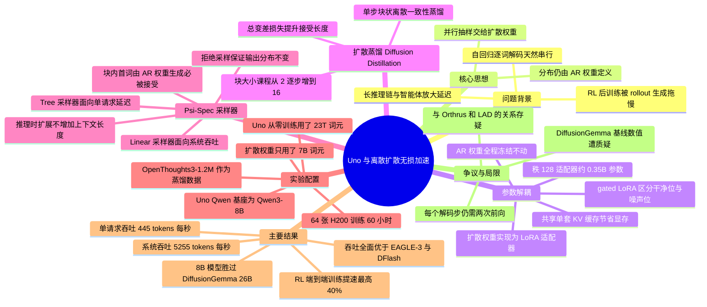

## 一、论文是干什么的？

现在的大语言模型（LLM）几乎都是**自回归**（autoregressive，简称 AR）的：它被训练来做「下一个词预测」（next-token prediction，NTP），所以生成的时候只能一个字一个字往外蹦。想写 1000 个词，就得老老实实跑 1000 次前向计算。这个限制在今天特别难受——推理模型动辄输出几万个思考词元（token），智能体（agent）要反复调用工具、反复重试，强化学习（RL）后训练阶段的大部分时间也都耗在「让模型把答案生成出来」这一步上。

有没有办法一次吐出一串词？有两条现成的路，但都有代价。第一条是**投机解码**（speculative decoding）：额外训练一个小小的「草稿模型」先猜几个词，再让大模型一次性验证，猜对了就赚到。它的好处是数学上**无损**——最终输出的概率分布和原模型一模一样；坏处是你得额外养一个草稿模型，还要单独给它一套键值缓存（KV cache），显存和工程复杂度都上去了。第二条是**扩散语言模型**（diffusion LLM，简称 d-LLM）：干脆把模型改造成扩散模型，天生就能并行生成一整块词。坏处是它改动了基座模型的权重，输出分布变了，质量普遍打折；而且它的加速在批量（batch size）一大就会消失，而真实服务场景恰恰是大批量的。

这篇论文提出的 **Uno** 想把两边的好处都占了。它的核心思路一句话就能说清：**让模型的输出分布仍然由原来的自回归权重定义，但用一套额外的扩散权重去并行地从这个分布里抽样**。打个比方：原来的 AR 模型是一位口述文章的作家，一个字一个字念；现在给他配一个速记助手，助手根据上下文一口气猜出接下来 4 到 16 个字，作家扫一眼，把开头连续猜对的部分直接采纳，第一个猜错的地方由作家自己补一个字。关键在于——**作家本人没有被改造过**，他的写作习惯（概率分布）一字未变，所以最后写出来的文章，和他一个字一个字念出来的文章，在统计意义上完全一致。这就是标题里「lossless（无损）」的含义。

论文把这一类模型叫做 **diffusion-augmented LLM**（扩散增强的大语言模型），把配套的采样器叫做 $\Psi$-Spec（读作 Psi-Spec），把训练出来的模型叫做 **Uno**（取 unify 即「统一」之意，因为 AR 权重和扩散权重被统一在同一个架构里）。他们的 8B Uno 在智能体工具调用、编程、长上下文推理这三类基准上，全面超过了 26B 的开源扩散模型 DiffusionGemma 和闭源的 Mercury 2，同时吞吐量相对基座 AR 模型最高提升到约 3 倍。

## 二、核心方法与创新

### 2.1 先回忆两个背景概念

**自回归分解。** AR 模型把一句话的概率按链式法则拆开：

$$
\log p_\theta(x) = \sum_{\ell=1}^{L} \log p_\theta(x_\ell \mid x_{<\ell})
$$

这里 $x$ 是一条长度为 $L$ 的词元序列；$x_\ell$ 是第 $\ell$ 个词元；$x_{<\ell}$ 表示它前面所有词元组成的前缀；$\theta$ 是模型参数；$p_\theta(x_\ell \mid x_{<\ell})$ 就是「看了前缀，下一个词是什么」的概率。这个分解的好处是似然建模强、能用 KV 缓存；坏处就是第 $\ell$ 个词必须等前 $\ell-1$ 个词都生成完才能算。

**离散扩散。** 扩散模型的做法是先把干净序列 $x$ 逐步加噪变成纯噪声，再学着反向去噪。本文采用的前向加噪过程是：

$$
z_t^\ell \sim q_t^\ell(\cdot \mid x; \pi) := \mathrm{Cat}\big(\cdot;\ \alpha_t x^\ell + (1-\alpha_t)\pi\big)
$$

逐个符号解释：$z_t$ 是时刻 $t$ 的含噪序列（$t \in [0,1]$，$t=0$ 是干净数据，$t=1$ 是纯噪声）；$z_t^\ell$ 是它第 $\ell$ 个位置上的词元；$\mathrm{Cat}(\cdot;\pi)$ 表示概率向量为 $\pi$ 的类别分布；$\alpha_t$ 是从 $\alpha_0 = 1$ 单调降到 $\alpha_1 = 0$ 的噪声调度；$\pi$ 是噪声先验。如果 $\pi = m$（特殊的 MASK 词元）就是常见的「掩码扩散」（MDM）；如果 $\pi = 1/K$（$K$ 是词表大小，即在整个词表上均匀分布）就是**均匀态扩散**（USDM）。本文选择后者，理由是均匀态扩散天然支持自我纠错、少步生成，推理时扩展性也更好。

### 2.2 参数解耦：一个架构，两条通路

Uno 的每一层都有两套权重：

- **AR 权重 $\theta_{AR}$**：就是标准 LLM 的全部参数，按标准配方训练（预训练、监督微调 SFT、RL 后训练）。它**唯一决定输出质量**。
- **扩散权重 $\theta_\Delta$**：以 **LoRA 低秩适配器**的形式，挂在每一个权重矩阵旁边。它**只负责加速**，不参与定义分布。

于是模型有了两条通路：**起草通路**用 $\theta_{AR} + \theta_\Delta$，**验证通路**只用 $\theta_{AR}$。这个设计有三个直接好处：第一，草稿和验证共享同一个骨干网络，两个分布天然靠得很近，接受率高；第二，只有**一套** KV 缓存，不像 EAGLE-3 或 DFlash 那样要维护两套，峰值显存更低；第三，因为 $\theta_{AR}$ 从头到尾冻结，验证者就是原封不动的基座模型。

还有一个容易忽略但很关键的细节：Uno 沿用了 **NTP 参数化**，即每个位置的 logits 预测的是**下一个**干净词元；而传统扩散语言模型预测的是**当前位置**的干净词元。保持 NTP 参数化，才能让扩散通路和 AR 通路说同一种语言。

### 2.3 Diffusion Distillation：怎么教会扩散权重并行出词

目标很明确：让扩散权重一次性并行起草的那一块词元，尽量接近 AR 模型会逐词生成出来的那一块。训练时 $\theta_{AR}$ 全程冻结，只更新 $\theta_\Delta$。总损失是两项的加权：

$$
\mathcal{L}(\theta_\Delta;\ \theta_{AR}, \alpha, \beta) = \mathbb{E}_{x \sim D,\ z_1 \sim \pi^L}\big[\alpha \mathcal{L}_{\mathrm{DCD}} + \beta \mathcal{L}_{\mathrm{TV}}\big]
$$

其中 $x$ 是训练数据中的干净序列，$z_1$ 是完全被噪声污染的序列，$\alpha$ 和 $\beta$ 是两项损失的权重系数。

**第一项：单步块状离散一致性蒸馏 $\mathcal{L}_{\mathrm{DCD}}$。** 原始的离散一致性蒸馏（DCD）要沿着一条多步去噪轨迹逐段蒸馏，在 LLM 规模上反复构造并存储中间隐变量太贵了。作者直接把整条轨迹压成**一步**：从完全噪声 $z_1$ 一步映射到干净序列。为了让「一步」可行，又把序列切成 $N$ 个大小为 $B$ 的**块**（block）分别处理：

$$
\mathcal{L}_{\mathrm{DCD}} = \sum_{b=1}^{N}\sum_{\ell=1}^{B} D_{\mathrm{KL}}\Big(x^{(N+b,\ell)}_{\theta_\Delta,\theta_{AR}}([x, z_1])\ \Big\|\ x^{(b,\ell)}_{\theta_{AR}}([x, z_1])\Big)
$$

符号解释：$b$ 是块的编号，$\ell$ 是块内位置；$[x, z_1]$ 表示把干净序列和噪声序列拼接起来送进模型（所以噪声块的下标要偏移 $N$ 个块）；$D_{\mathrm{KL}}$ 是 KL 散度；竖线左边是**学生**（扩散通路，用 $\theta_{AR}+\theta_\Delta$，看到的是噪声块和它前面的干净上下文），右边是**教师**（AR 通路，只用 $\theta_{AR}$）。

这里有个漂亮的工程技巧：教师和学生的预测是在**同一次前向**里算完的。做法是用块因果注意力掩码，让干净部分内部因果注意、每个噪声块内部因果注意、噪声块额外能看到它前面所有干净块；再用 **gated LoRA**（门控 LoRA）技术，在干净位置上把适配器**关掉**、在噪声位置上**打开**。于是同一次前向，干净位置输出的就是纯 AR 教师 logits，噪声位置输出的就是学生 logits。

**第二项：总变差损失 $\mathcal{L}_{\mathrm{TV}}$。** 采样时只保留草稿中**连续被接受的最长前缀**，所以真正决定加速比的是「能连对几个」。根据投机解码的理论（Leviathan 等人论文的推论 3.6），接受概率由草稿分布与目标分布的总变差距离决定，于是直接优化它：

$$
\mathcal{L}_{\mathrm{TV}} = \sum_{b=1}^{N}\sum_{\ell=1}^{B} \Big| x^{(N+b,\ell)}_{\theta_\Delta,\theta_{AR}}([x, z_1]) - x^{(b,\ell)}_{\theta_{AR}}([x, z_1]) \Big|
$$

即学生与教师两个概率向量的逐元素绝对差之和。论文发现 $\alpha = 0,\ \beta = 1$（纯 TV 损失）加速比最高；但先用 $\alpha = \beta = 1$ 训一段再切换收敛更快。消融还显示 $\mathcal{L}_{\mathrm{DCD}}$ 的数值量级本来就比 $\mathcal{L}_{\mathrm{TV}}$ 大约一个数量级，所以把它的权重压到 0.01 效果最好。

### 2.4 Psi-Spec 采样器：无损性到底怎么保证

这是全文最关键的部分，我们一步步拆。

**第一步，起草。** 已有前缀 $x$（长度 $L$）。想一次生成 $B$ 个词元，就在末尾接上 $B-1$ 个从先验 $\pi$ 里随机抽的词元，记作 $z_1$。然后跑**一次**扩散前向，得到这一整块的预测。论文在附录 B.2 证明，对于单步生成，$\Psi$-采样器在 $t=0$ 处诱导的分布退化成一个极其简洁的形式：

$$
\Psi_0^\ell = \begin{cases} x^\ell_{\theta_{AR},\theta_\Delta}([x_L, z_t]), & \ell > 1 \\ x^\ell_{\theta_{AR}}([x_L, z_t]), & \ell = 1 \end{cases}
$$

读法是：块内**第一个**位置的 logits **只用 AR 权重**算（因为那个位置的输入是干净词元 $x_L$，而扩散适配器只在噪声上训练过，用它会有分布偏移）；其余位置才用 AR 权重加扩散适配器。同样靠 gated LoRA 在一次前向里完成。于是草稿分布就是各位置边缘分布的乘积：

$$
p_{\mathrm{draft}} = \prod_{\ell=2}^{B} x^\ell_{\theta_{AR},\theta_\Delta}(\cdot)
$$

**第二步，验证。** 把「前缀 + 第一个词 + $B-1$ 个草稿词」一次性喂给**只用 $\theta_{AR}$** 的验证通路，拿到 AR 的真实分布 $p$，然后套用标准投机解码的拒绝采样修正：对每个位置 $i$ 抽 $r_i \sim U[0,1]$，若 $r_i > \min(1, p_i / q_i)$（$q_i$ 是草稿在该位置给出的概率）就拒绝；取第一个被拒绝的位置 $n$，把它之前的草稿全部接受，并从**归一化后的残差分布** $\mathrm{Norm}([p_n - q_n]_+)$ 里重抽一个词顶替；若全部接受，就从最后一个草稿词之后的 logits 里再多抽一个词。

**无损性的论证要点**，归纳起来就是三条，缺一不可：

1. **验证者从未被改动。** $\theta_{AR}$ 在 Diffusion Distillation 全程冻结，只训练 LoRA 适配器；gated LoRA 又保证验证路径上适配器是关闭的。所以验证者就是**字面意义上的原模型**。这正是 Uno 与自投机解码（self-speculative decoding，如 TiDAR、I-DLM）的根本区别——后者为了让模型能做扩散生成，把基座权重本身改掉了，于是「被保留下来的分布」已经不是原模型的分布了。论文还专门复现了 I-DLM 的所谓无损变体，发现它的采样器做的是贪心起草却没有相应调整拒绝采样规则，**实际并不无损**。
2. **接受规则是经过证明的分布保持算子。** Leviathan 等人的投机采样定理保证：只要用「以 $\min(1, p/q)$ 的概率接受、否则从残差分布重抽」这套规则，最终输出严格服从目标分布 $p$，与草稿分布 $q$ 的好坏**完全无关**。草稿猜得准只影响速度，不影响正确性。
3. **块内第一个词元天然合法。** 因为它是用纯 AR 权重采的，草稿分布与验证分布完全相同，必定被接受。这条既保证了最坏情况也不会倒退，又给出了吞吐的下界。

由此得到每次前向的产出量（tokens per forward pass，TPF）的界：每一轮需要两次前向（起草一次、验证一次），最坏情况产出 2 个词（必接受的首词加上验证者补的替换词），最好情况产出 $B+1$ 个词，所以

$$
1 \le \mathrm{TPF} \le \frac{B+1}{2}
$$

**第三步，两种候选采样策略。** 起草时可以只出一条候选，也可以出一棵候选树：

- **Linear 采样器**（优化系统吞吐）：每个位置直接按边缘分布抽一个词，只产生一条候选序列。大批量时推理是**计算受限**的，没有余力验证更多候选，所以这种最省。
- **Tree 采样器**（优化单请求吞吐）：小批量时推理是**显存带宽受限**的，算力大量闲置，于是每个位置取 top-$K$ 个候选构成一棵前缀树，用树注意力（tree attention）并行验证，再按对数概率排序只保留 top-$V$ 条前缀做剪枝。超参是 $(B, K, V)$，分别是块大小、分支因子、前缀预算。

### 2.5 推理时扩展（inference-time scaling）

$\Psi$-Spec 还开了一条新的「花更多算力换更好质量」的路子：让去噪步数 $T$ 超过起草词元数 $B$。已有结果表明当校正强度 $\kappa_t < 1$ 时，增加 $T$ 会持续提升样本质量。作者指出，**与思维链等常规推理时扩展方法不同，这种方式不增加上下文长度**。但他们也诚实地说明：如果多步去噪真的能超过 AR 模型的质量，那就得把 AR 验证关掉（否则输出会被拉回 AR 的水平），而这个质量与算力的权衡他们留给了未来工作，**本文并未系统实验**。

### 2.6 与各条技术路线的区别一览

| 路线 | 代表方法 | 是否无损 | 是否需要额外模型 | Uno 的差异 |
|---|---|---|---|---|
| 投机解码 | EAGLE-3、DFlash | 无损 | 需要独立草稿模型，两套 KV 缓存 | 单一架构双通路，共享 KV 缓存，额外参数更少 |
| 自投机解码 | TiDAR、I-DLM、FLARE | 有损（改了基座权重） | 不需要 | 基座权重冻结，真正无损 |
| 扩散语言模型 | DiffusionGemma、LLaDA、Nemotron-Labs-Diffusion | 有损 | 不需要 | 质量不打折，且大批量下仍有加速 |
| 多词元预测 | Medusa、MTP | 无损 | 需要改架构加预测头 | 不改架构只加 LoRA，且论文认为二者可叠加 |

特别值得强调的是 d-LLM 路线的那条「加速会消失」：论文指出 Nemotron-Labs-Diffusion 和 DiffusionGemma 在大批量下**比各自的基座 AR 模型还慢**。而现实中的智能体负载天然就是并发的——一个请求就会触发并行子智能体、分支轨迹、工具调用和重试，服务系统还要跨请求做批处理。所以作者反复强调：**只报 batch size 为 1 的延迟，是一个很窄的工况，会高估实际收益**。

## 三、使用了哪些模型和计算资源？

论文做了两套实验，一套从零训练，一套增强开源模型。

### 3.1 从零训练的 Uno（8B）

**架构**：稠密的仅解码器因果 Transformer，36 层，隐藏维度 4096，SwiGLU 风格 MLP 宽度 12288，32 个查询头、8 个 KV 头、头维度 128，分组 RMSNorm，RoPE（$\theta = 10^7$），词表 250624，最大配置上下文 524288。Transformer 主体 6.95B 参数，另有约 2.05B 参数来自不共享的输入与输出词表矩阵。

**AR 权重训练**：约 23T 词元的内部高质量数据，分阶段扩展上下文：

| 阶段 | 上下文长度 | 词元量 | 学习率 | 预热步数 |
|---|---|---|---|---|
| 预训练 | 8K | 21.9T | 峰值 3e-4，WSD 调度 | 3000 |
| 扩展一 | 32K | 1.1T | 3e-4 线性衰减到 3e-5 | 1250 |
| 扩展二 | 128K | 0.5T | 恒定 3e-5 | 500 |
| 扩展三 | 512K | 0.3T | 恒定 3e-5 | 200 |

**扩散权重训练（Diffusion Distillation）**：对每个权重矩阵加秩为 128 的 LoRA 适配器（正文写 LoRA-$\alpha = 256$；附录 C.6.4 的消融则说 Uno 采用 $\alpha_{\mathrm{LoRA}}/r_{\mathrm{LoRA}} = 64$、Uno-Qwen 采用 16，正文与附录此处**存在不一致**）。从 SFT 数据里随机抽 **7B 词元**训练，AR 权重冻结。课程安排是：上下文 16384 下训 1.8B 词元，块大小依次取 2、4、8 各 600M 词元；随后在上下文 65536、块大小 8 下训 5.2B 词元。全局批大小 128，WSD 学习率调度，200 步预热，峰值学习率 5e-5，损失系数 $\alpha = 0.01,\ \beta = 1$。

**训练硬件与耗时**：**约 60 小时，8 个 H200 节点、每节点 8 张 GPU，合计 64 张 H200**。

所谓「negligible overhead（开销可忽略）」的具体含义就在这里：AR 权重吃了约 23T 词元，扩散权重只吃 7B 词元，**相差约 3300 倍**（占比约 0.03%）。论文的原话是「训练扩散权重所需的词元量比 AR 权重少若干个数量级」。

### 3.2 增强开源模型的 Uno-Qwen（8B）

**基座**：直接用开源的 **Qwen3-8B** 检查点初始化 AR 权重，全程冻结。

**扩散权重**：每个权重矩阵加秩 128、$\alpha_{\mathrm{LoRA}} = 256$ 的 LoRA，共 **0.35B 可训练参数**。在 **OpenThoughts3-1.2M** 上训 3 个 epoch，约 **14.7B 词元**，最大序列长度 4096；块大小课程 $B \in \{2,4,6,8,12,16\}$，每半个 epoch 递增一档；全局批大小 64，恒定学习率 1e-5，2% 预热步；$\alpha = 0,\ \beta = 1$。

**训练硬件与耗时**：**约 32 小时，4 个节点、每节点 8 张 H200，合计 32 张 H200**。

这套实验还顺带证明了一个很实用的性质：**扩散权重和 AR 权重不必在同一数据分布上训练**。论文特意验证了反面——如果直接拿 OpenThoughts 去微调 Qwen3-8B 的主干，质量会明显下滑（最多掉约 15 个百分点，比如 AIME-25 从 70.7 掉到 53.3，HumanEval 从 94.4 掉到 77.8）；而 Uno 的做法冻结主干、只训适配器，质量分毫不动。

### 3.3 推理与评测环境

- 所有吞吐评测都在**单张 H200 GPU** 上完成，精度 bfloat16。
- 评测协议叫 **1K/8K 吞吐测试**：固定 1024 个随机输入词元、8192 个输出词元。作者批评现有评测直接在下游任务上测吞吐会偏袒那些输出更短的模型，所以他们先测各方法的平均 TPF，再按 $\lceil n/\mathrm{TPF}\rceil$ 跑固定步数，保证所有方法在相同的有效输入输出长度下比较。
- 采样参数：温度 1，top-p 为 0.95，top-k 为 50；上下文窗口 262144、最大生成 131072（Uno 主实验）；Uno-Qwen 用 Qwen3-8B 原生的 32768。
- 实现：在 **Nano-vLLM** 和 **SGLang** 里都支持 Linear 与 Tree 采样器；论文所有实验用的是 Nano-vLLM 实现。
- Mercury 2 的数据来自 Artificial Analysis 的公开追踪（2026 年 8 月 30 日），它跑在**更快的 Blackwell GPU** 上，且未披露量化精度。

## 四、实验结果

### 4.1 相对基座 AR 模型的加速

先看最本质的一组对比：同一个 8B 模型，开不开 Uno 的差别（1K/8K 测试，单张 H200）。

| 指标 | 基座 AR | Uno | 提升 |
|---|---|---|---|
| 最大系统吞吐（tokens/s） | 3577 | 5255 | 约 1.5 倍 |
| 最大单请求吞吐（tokens/s） | 176 | 383 | 约 2.2 倍 |

注意这里的「最大系统吞吐」是在基座 AR 模型能装下的最大批量（batch size 为 64）下测的。论文摘要里的「最高 3 倍」和结论里的「最大批量下仍有 2 倍」是跨全部配置的上界表述，而具体到这张表就是 1.5 倍与 2.2 倍。Uno-Qwen 那边的数字是：batch size 为 1 时 **2.5 倍**，最大批量时 **1.6 倍**。

### 4.2 与扩散语言模型的对比（准确率）

Uno（8B）对阵 Mercury 2（参数量未披露）、DiffusionGemma（26B 稀疏 MoE，激活 4B，从 Gemma 4 微调而来）、Nemotron-Labs-Diffusion（14B）：

| 基准 | Uno 8B | Mercury 2 | DiffusionGemma 26B-A4B | Nemotron-Labs-Diffusion 14B |
|---|---|---|---|---|
| $\tau_3$ Banking（工具调用） | **25.8** | 9 | 未报告 | 未报告 |
| $\tau_2$ Telecom（工具调用） | **90.1** | 71 | 68.1 | 14.3 |
| $\tau_2$ Retail（工具调用） | **67.1** | 未报告 | 65.5 | 5.6 |
| Terminal-Bench v2.1（终端智能体） | **39.6** | 27 | 14.7 | 4.5 |
| SWE-bench Verified（智能体编程） | **68.4** | 未报告 | 18.7 | 0.8 |
| AA-LCR（长上下文推理） | **68.0** | 36 | 19.7 | 7.3 |
| Humanity's Last Exam | **18.6** | 16 | 9.2 | 2.6 |
| GPQA-Diamond | **77.1** | 77 | 70.7 | 40.4 |
| AA-Omniscience | 14.3 | **20** | 17.7 | 11.0 |
| GSM8K | **95.4** | 未报告 | 95.1 | 93.1 |
| MATH500 | **98.9** | 未报告 | 92.4 | 89.2 |
| AIME-24 | **93.0** | 未报告 | 73.7 | 56.7 |
| AIME-25 | **90.7** | 未报告 | 74.3 | 40.0 |
| AIME-26 | **86.3** | 未报告 | 70.7 | 46.7 |
| MBPP | **84.1** | 未报告 | 80.1 | 73.8 |
| HumanEval | **95.2** | 未报告 | 95.1 | 84.8 |

结论是：8B 的 Uno 在智能体工具调用、智能体编程、长上下文推理上全面胜出，唯一落后的是知识类的 AA-Omniscience（14.3 对 20），作者归因于模型规模和训练数据的差异。

吞吐这边（论文表 7）：

| 方法 | 最大系统吞吐（tokens/s） | 最大单请求吞吐（tokens/s） |
|---|---|---|
| Uno（本文） | **5255** | 383 |
| 基座 AR（本文） | 3577 | 176 |
| DiffusionGemma | 1136 | **836** |
| Nemotron-Labs-Diffusion | 2794 | 290 |
| Mercury 2 | 1197 | 769 |

可以看到一个很有意思的反转：**DiffusionGemma 在 batch size 为 1 时确实最快，836 对 383，但在大批量下只有 Uno 的约五分之一**。这正是论文反复强调的那一点——d-LLM 的加速在并发下会蒸发。至于 Mercury 2，它公开报告的是 1K 输入、批量 10 时 1154 tokens/s，Uno 的最大系统吞吐约为其 4.6 倍，而且 Uno 跑在更慢的 H200 上、用的是 bfloat16。

顺带一提，扩散模型的 TPF 数字看起来吓人（DiffusionGemma 平均 17.56，Nemotron-Labs-Diffusion 5.41，Uno 只有 1.9 到 2.7），但 TPF 高不等于快——它们每次前向要跑双向注意力、没法很好复用 KV 缓存，实际墙钟时间反而更差。

### 4.3 与无损投机解码方法的对比（Uno-Qwen）

这一组是最同台竞技的，因为 EAGLE-3 和 DFlash 也都是无损方法，基座都是 Qwen3-8B（温度 1）：

| 指标 | Uno-Qwen | EAGLE-3 | DFlash |
|---|---|---|---|
| 平均接受长度 $\tau$（系统吞吐配置，$B=4$） | **3.89** | 2.08 | 2.07 |
| 平均接受长度 $\tau$（单请求配置） | **5.97** | 3.48 | 2.74 |
| 系统吞吐（tokens/s） | **5733** | 4944 | 5351 |
| 单请求吞吐（tokens/s） | **445** | 284 | 370 |
| 峰值显存（GiB，$B=4$） | **122.2** | 130.0 | 130.1 |
| 额外参数量（B） | **0.35** | 0.40 | 1.05 |

作为对照，基座 Qwen3-8B 自己是系统吞吐 3662、单请求 176 tokens/s。论文还指出 DFlash 的训练成本高得多：块大小为 $B$、序列长为 $L$ 时，DFlash 需要 $B \cdot L$ 的训练上下文，而 Uno 恒定只需 $2L$，与 $B$ 无关。

Uno 在**所有并发度**下都帕累托占优（论文表 18 给了从 1 到 64 并发的完整网格）。一个细节：并发 128 对所有方法都超出了单卡容量，无数据。

### 4.4 加速 RL 后训练

这是很实际的一个收益。作者从 SFT 检查点出发，用 DAPO 算法训了数学、代码、工具使用、网页搜索四个专家模型，**只更新 AR 权重，扩散适配器冻结、纯粹用来加速 rollout**，最后用 ISO-Merger（RAM）这种无数据方法把四个专家合并成一个。结果：

- **端到端训练最高提速 40%**，主要来自数学和代码专家；工具使用和搜索专家收益较小，因为它们的运行时间被工具调用本身主导。
- 一个反直觉但令人安心的发现：RL 会持续改变 $\theta_{AR}$，照理说草稿分布会逐渐漂移、偏离验证分布、接受率下降；但实测**在 SFT 检查点上训练的扩散适配器，经过大量 RL 后训练仍保留了加速能力，平均 TPF 只从 2.25 降到 2.10，降幅约 6%**。
- 论文明确写了「详细结果将在下一版给出」，所以这部分目前只有汇总数字。

### 4.5 消融实验

| 消融项 | 结论（平均 TPF） |
|---|---|
| 损失组合 | 纯 TV 损失 2.39 最佳，纯 KL（DCD）2.22，等权 KL 加 TV 为 2.23；把 KL 权重压到 0.01 可微升到 2.40 |
| LoRA 秩 | 秩 128 得 2.39，秩 256 得 2.47，但可训练参数从 349M 涨到 698M，推理成本也上升 |
| 块大小课程 | 渐进增大（0.5@2、0.5@4、0.5@6、0.5@8、0.5@12、0.5@16）得 2.71，固定 $B=16$ 得 2.65 |
| LoRA 挂载位置 | 挂到全部投影矩阵最好（2.39），只挂 Q、K、V、O 得 2.38，只挂 O 得 2.38，只挂 Q、V 得 2.26，只挂 Q 得 2.14 |
| $\alpha_{\mathrm{LoRA}}/r_{\mathrm{LoRA}}$ 比值 | 训练 1 个 epoch 时 64 最优，训练 3 个 epoch 时 16 最优 |
| 采样器配置（Uno） | Linear 采样器 $B=4$ 系统吞吐最高（5190）；Tree 采样器 $(16,32,32)$ 单请求吞吐最高（379） |

一个有趣的观察：Linear 采样器的 TPF 从 $B=4$ 的 1.8 涨到 $B=8$ 的 2.2，但 $B=16$ 只到 2.3，**收益明显递减**，而验证成本是线性上涨的，所以最优块大小并不大。

### 4.6 局限与未尽之处

论文**没有独立的 Limitations 章节**，以下是散落在正文各处的限制：

- **DCD 的训练与测试不匹配**：DCD 在确定性的概率流轨迹上训练，而采样时走的是随机去噪轨迹，这一失配限制了它的效果（附录 A.5 明说）。
- **每步仍需两次前向**（起草加验证），因此 TPF 的理论上界卡在 $(B+1)/2$。能把两次合成一次的「二次采样器」（quadratic sampler）需要高效算子支持，**留给未来工作**。
- **推理时扩展未做系统实验**：多步去噪能否超越 AR 质量、超越后该不该关掉验证，论文自己说留待后续。
- **RL 部分结果不完整**，承诺下一版补充。
- **多词元预测类的架构改动与 Uno 正交**，可能进一步提升接受率，但未做实验。
- 评测用的是合成的 1K/8K 定长负载，而非真实生产任务的长度分布。
- 单请求场景下 Uno 并非最快（DiffusionGemma 更快），Uno 的优势主要在并发服务。

## 五、潜在应用与已落地应用

**已经落地的部分：**

- **代码与检查点已开源**，Apache-2.0 协议。仓库在 [ifm-ai/uno](https://github.com/ifm-ai/uno)（撰写时约 67 星、9 个 fork），项目主页在 [s-sahoo.com/uno](https://s-sahoo.com/uno/)。
- 已发布的 HuggingFace 检查点包括 `s-sahoo/uno-qwen3-8B`、`IFM/K2-Horizon-7B-Uno`、`IFM/K2-Horizon-0.9B-Uno`。
- 推理侧已在 **Nano-vLLM** 与 **SGLang** 两个引擎上实现了 Linear 和 Tree 采样器；环境要求 Python 3.10、PyTorch 2.11.0（CUDA 12.8）、FlashAttention-2（线性解码），可选 FlashAttention-3（树验证）。
- 内部已用于加速 IFM 自家模型的 RL 后训练流程（数学、代码、工具、搜索四个专家）。

**潜在应用方向：**

1. **现有开源模型的即插即用提速。** 这大概是最直接的价值：只要有 AR 检查点，训一组 LoRA 适配器（32 张 H200 跑 32 小时的量级）就能拿到 1.6 到 2.5 倍吞吐，而且输出分布保证不变——对已经做过合规评测、不能承受行为漂移的生产系统特别友好。
2. **智能体服务的成本优化。** 论文一路强调的就是大批量场景，而智能体负载天然高并发。系统吞吐提升 50% 直接等价于同样的卡能多服务一半的请求。
3. **RL 后训练提速。** rollout 生成是 RL 的主要瓶颈，端到端 40% 的提速对训练成本影响可观；而且适配器在 RL 过程中无需同步更新。
4. **替换现有投机解码栈。** 相比 EAGLE-3 与 DFlash，Uno 额外参数更少、只需一套 KV 缓存、峰值显存更低，是一个同接口且更省的替换件。
5. **架构无关的推广。** 论文说该框架适用于任何因果自回归网络，包括状态空间模型（SSM），不限于 Transformer。

## 六、网络上的讨论与评价

截至 2026-09-11，这篇论文在 HuggingFace Papers 上获得 **138 票**，并且评论区有实质性的技术争论（这在 HF 上并不常见）：

- **与 Orthrus 的原创性之争。** 用户 chiennv 指出「这里的核心框架和 4 个月前发布的 Orthrus（arXiv 2605.12825）完全一样」。第一作者 s-sahoo 回复说两者确有相似之处，但 Uno **不改动架构和注意力模式**，而 Orthrus 加了扩散注意力头、在扩散块内使用双向注意力；并承诺在修订版中补充讨论。chiennv 再次反驳，认为两者都是冻结 Transformer 主干加可训练扩散参数，注意力是双向还是因果「只是一个设计选择」，核心框架依然相同。这个争论目前没有定论。
- **漏引 LAD。** 用户 Ruurd 指出论文漏引了 LAD（LoRA-Adapted Diffusion），后者同样用轻量 LoRA 适配器做扩散适配、同样冻结预训练权重；不过他也肯定了 Uno 的扩展工作。作者已承认疏漏并承诺更新。
- **生产环境的质疑。** 用户 O96a 质疑加速比在「H100 上批量 32、KV 缓存有压力」的真实条件下是否还成立，并追问去噪步数的开销。用户 Travis-ML 补充说「每步要两次前向」，并认为评测覆盖的基座模型种类偏少。
- **基线数字被 Google 研究员反驳。** 据 [implicator.ai 的报道](https://www.implicator.ai/uno-lossless-ai-speedup/)（2026-09-07），Google 研究员 Brendan O'Donoghue 质疑论文对 DiffusionGemma 的吞吐测量，称他测到的是约 2700 tokens/s 而非论文的 1136，认为「真实数字应该是 3k tok/s 或更高」。该报道同时提醒：核心加速数字**尚未经过独立验证**；「无损」只保证概率分布不变，**不代表输出逐字相同，也不意味着更少幻觉或更强推理**；单请求场景下反而是 DiffusionGemma 更快。
- **偏正面的技术评论。** [The Salt 的通讯](https://thesalt.substack.com/p/lossless-diffusion-speedups-random)（2026-09-10）称这是「近期见过的最有意思的、让扩散在 LLM 推理中变得实用而又不牺牲质量的尝试」，特别欣赏它「把推理加速变成了类似一个额外蒸馏阶段」的思路。
- 另有 [cryptobriefing](https://cryptobriefing.com/uno-diffusion-llm-throughput/)、[HyperAI](https://hyper.ai/en/papers/2609.04010) 等媒体的报道，内容基本是论文摘要的转述。
- **未检索到 Hacker News 或 Reddit r/LocalLLaMA 的集中讨论帖**，也未检索到中文社区（知乎等）针对本文的专门讨论。

## 七、思维导图

