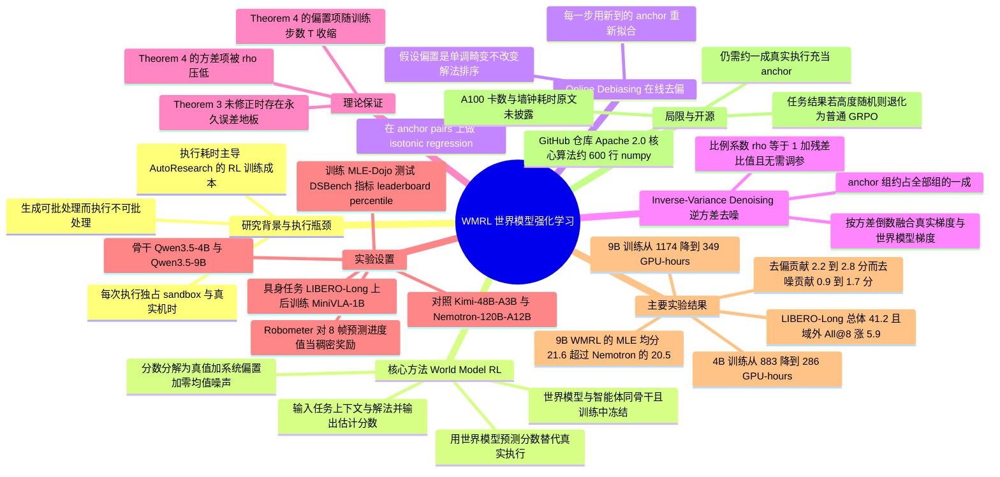

## 一、论文是干什么的？

这几年有一类很火的 AI 应用叫「**自动科研智能体**」（AutoResearch agent）：你把一个机器学习竞赛题目丢给它，它自己读数据说明、自己写特征工程和模型代码、自己跑实验、看到分数不理想再改一版。听上去就像雇了一个不用睡觉的实习研究员。

要让这个「实习生」越做越好，现在的主流办法是**强化学习后训练**：让它对同一道题写出好几份不同的解法，把每份解法真的跑一遍拿到分数，分高的解法就鼓励、分低的就抑制，反复迭代。问题出在「真的跑一遍」这四个字上。

作者点出了一个很扎心的结构性矛盾：一条训练轨迹由两段组成，**生成**（智能体写代码）和**执行**（把代码跑起来拿分数），而这两段的扩展方式完全不同。生成是纯 GPU 计算，可以把几十上百条一起打包批处理，加卡就能变快；执行却必须一条一条来，每一条都要独占一个沙箱容器、占用真实的物理机时间，而训练一个模型可能要跑几万次 Kaggle 级别的实验。打个比方：这就像一个厨房里有 100 个厨师同时切菜（生成可以并行），但全店只有一个烤箱，每道菜都必须单独进烤箱烤 40 分钟（执行不可并行）。菜越复杂、烤得越久，烤箱就越是整个后厨的瓶颈，再招厨师也没用。

这篇论文的解法直白得近乎大胆：**干脆别用那个烤箱了**。他们用一个「世界模型」（world model）——本质上是另一个语言模型——让它光看智能体写出来的代码和任务描述，就**预测**这份解法最后能拿多少分，把真实执行整个替换掉。这个方法叫 **World Model RL**（WMRL）。当然，凭空猜分数肯定不准，所以论文真正的技术含量在于配套的两个纠偏装置：**Online Debiasing**（在线去偏）和 **Inverse-Variance Denoising**（逆方差去噪），并且从理论上证明了这两个装置严格改善了收敛保证。

## 二、核心方法与创新

### 2.1 先看原来的训练是怎么做的

论文的强化学习基线是 **GRPO**（Group Relative Policy Optimization）。智能体策略记作 $\pi_\theta$，优化目标是期望分数：

$$
J(\theta) := \mathbb{E}_{\tau \sim \pi_\theta}\left[ r(\tau) \right]
$$

这里 $\tau$ 是一条完整轨迹（一份解法），$r(\tau)$ 是它真实跑出来的分数。GRPO 的梯度估计是组内相对比较（论文式 1）：

$$
\hat{g} := \frac{1}{n}\sum_{i=1}^{n} A_i\, s_i, \qquad A_i := r(\tau_i) - \frac{1}{n}\sum_{j=1}^{n} r(\tau_j), \qquad s_i := \nabla_\theta \log \pi_\theta(\tau_i)
$$

翻译成人话：对同一道题生成 $n$ 份解法组成一「组」，算出这组的平均分，谁高于平均分（优势 $A_i$ 为正）就往那个方向推一把，谁低于平均分就往反方向推。$s_i$ 是这份解法的对数概率梯度，代表往这个方向调参数就更容易再写出这份解法。

关键点是：这个公式里每一个 $r(\tau_i)$ 都要真实执行一次才能拿到。**这就是烤箱瓶颈的数学来源**。

### 2.2 世界模型：用预言家替代烤箱

WMRL 的做法是让一个世界模型输出预测分数 $\hat{r}(\tau)$。它的输入是任务上下文加上智能体写出的解法，输出是对执行结果的预测，从中抽取出一个估计分数。重要的工程细节是：**这个世界模型在整个强化学习过程中是冻结的**，不参与更新，只负责被查询。它使用与智能体同规模的骨干模型。

但预言家不是神仙，它的预测必然有误差。论文把这个误差拆成两部分（式 3）：

$$
\hat{r}(\tau) = r(\tau) + b(\tau) + \xi(\tau)
$$

其中 $b(\tau)$ 是**系统性偏置**（有界，$|b(\tau)| \le B$），$\xi(\tau)$ 是**零均值随机噪声**（标准差不超过 $\sigma$）。

这个拆分很关键，因为两种误差的危害完全不同。用体育打分做类比：

- $b(\tau)$ 像一个**有偏见的裁判**：他总是给某国选手压低 0.5 分。这种误差不会因为多打几次分而抵消，会一直系统性地把训练带偏。
- $\xi(\tau)$ 像**裁判手抖**：这次高 0.3 下次低 0.3，平均下来是准的，只是让信号变糊。

论文的两个纠偏装置正好一个对付一种。

### 2.3 Online Debiasing 在线去偏

对付有偏见的裁判，最自然的办法是找几场比赛让他和权威裁判同时打分，然后学一个换算表。WMRL 就是这么做的：训练过程中保留一小股**真实执行**的信号，称为 **anchor**（锚点）。这些 anchor 组既被世界模型打分、也被真实执行打分，形成配对数据集 $\mathcal{P}$。然后做**单调重标定**（式 4）：

$$
\hat{f} = \arg\min_{f} \sum_{(\hat{r}_j,\, r_j) \in \mathcal{P}} \left( f(\hat{r}_j) - r_j \right)^2
$$

这个优化用 **isotonic regression**（保序回归）求解，并且**每一步都用新到的 anchor 重新拟合**，这就是「在线」二字的含义。

为什么必须是单调的？论文的 Assumption 6 明确要求：偏置必须表现为一种**单调畸变**，也就是说世界模型可以整体压分、可以把分数拉伸压缩，但**不能把好解法和坏解法的排序搞反**。只要排序是对的，就存在一个单调函数能把它校正回去。这也是保序回归这个工具能成立的前提。

### 2.4 Inverse-Variance Denoising 逆方差去噪

去偏之后剩下的是噪声。这时 WMRL 手上有两股梯度信号：来自真实执行的 $g_E$（干净但稀少）和来自世界模型的 $g_{WM}$（含噪但海量）。怎么配比？统计学里的标准答案是**按方差的倒数加权**，谁更可信谁权重大（式 5）：

$$
\hat{g} = \frac{V_E^{-1} g_E + V_{WM}^{-1} g_{WM}}{V_E^{-1}|\mathcal{G}_E| + V_{WM}^{-1}|\mathcal{G}_{WM}|} = \frac{\rho\, g_E + g_{WM}}{\rho\,|\mathcal{G}_E| + |\mathcal{G}_{WM}|}, \qquad \rho := \frac{V_{WM}}{V_E} = 1 + c\sigma^2
$$

符号含义：$V_E$ 和 $V_{WM}$ 分别是真实执行组、世界模型组的梯度方差；$|\mathcal{G}_E|$ 和 $|\mathcal{G}_{WM}|$ 是两类组的数量；$\rho$ 是两者的方差比值，$\rho$ 越大说明世界模型越不可靠，真实执行的那一票就越重。

最妙的是工程实现上 $\rho$ **不需要人工调参**：

$$
\rho = 1 + \frac{\hat{\eta}^2}{\hat{\eta}^2_{\mathrm{cal}}}
$$

其中 $\hat{\eta}^2$ 是校正后的世界模型分数与真实分数在 anchor 上的均方残差，$\hat{\eta}^2_{\mathrm{cal}}$ 是热身阶段结束时的残差值。也就是说，系统会**自己实时测量世界模型现在有多准，然后自动决定该信它几分**。论文明确写这一项没有自由参数。

实践中，anchor 组大约占全部组的 **10%**。也就是九成的打分靠世界模型脑补，一成靠真跑校准。

### 2.5 理论保证：两个定理

论文给出了收敛性分析。**Theorem 3** 描述的是只用世界模型、不做任何修正的情况：收敛界等于标准的几何衰减项，再加上一个 $O(M^2 B^2)$ 的偏置项和一个 $O(\gamma V_{WM})$ 的方差项，这两项构成**永久性的误差地板**，训练再久也降不下去。

**Theorem 4** 是加上两个修正装置后的 WMRL：偏置项变成 $O\!\left(M^2 B^2 / (1 + T/T_0)\right)$，**随训练步数 $T$ 增加而收缩**；方差项变成 $O\!\left(\gamma V_{WM} / (1 + V_{WM}/V_E)\right)$，**被显著压低**。两项都严格小于 Theorem 3，只要世界模型不完美就一定有改善。

一个有意思的理论与实验对照：论文指出偏置项在误差界里是**全尺寸**进入的，而噪声项是被步长**衰减**后进入的，所以理论预测去偏的收益应该大于去噪，而消融实验的数字确实符合这个预测（见第四节）。

## 三、使用了哪些模型和计算资源？

| 项目 | 具体内容 |
|---|---|
| 智能体骨干 | **Qwen3.5-4B**（40 亿参数）与 **Qwen3.5-9B**（90 亿参数） |
| 世界模型骨干 | 与智能体**同规模同骨干**，训练中保持冻结 |
| 对比的开源大模型 | **Kimi-48B-A3B**（480 亿参数，激活 30 亿）、**Nemotron-120B-A12B**（1200 亿参数，激活 120 亿） |
| 具身实验策略模型 | **MiniVLA-1B**（10 亿参数的视觉语言动作模型） |
| 具身实验世界模型 | **Robometer**，一个现成的 VLM，从图像预测任务成功率；参数量**原文未披露** |
| GPU 型号 | **NVIDIA A100**（原文只说所有实验使用相同的 A100 配额） |
| GPU 卡数与节点数 | **原文未披露**（只给 GPU-hours 总量，不给卡数） |
| 训练总算力 | 4B：GRPO 883 GPU-hours，WMRL 286 GPU-hours；9B：GRPO 1174 GPU-hours，WMRL 349 GPU-hours |
| 每步与每轮墙钟耗时 | **原文未披露** |
| 推理耗时 | **原文未披露** |
| 学习率、组大小 $n$、batch 大小、训练步数、上下文长度、热身长度 | **原文未披露**（正文指向 Appendix D，但正文与可抓取到的附录内容中未给出具体数值） |
| MLE-Dojo 训练集与测试集任务数 | **原文未披露**（只说按类别均衡手工划分，完整任务清单放在 Appendix C） |
| DSBench 与 LIBERO-Long 任务数 | **原文未披露** |
| Anchor 比例 | 约 10% 的组同时用真实执行打分 |

数据与评测集方面：训练用 **MLE-Dojo**（基于真实 Kaggle 竞赛构建的机器学习工程基准）的训练划分；测试用 MLE-Dojo 的留出划分，以及与训练集**完全不相交**的 **DSBench**（数据科学基准，含 Binary-Cls、Multi-Cls、Regression、Other 四类）。具身实验用 **LIBERO-Long** 长时程操作基准，分域内和域外（OOD）两种评测。评测指标上，MLE-Dojo 采用官方的 **leaderboard percentile**（把提交结果换算成在真实竞赛排行榜上的百分位），VLA 任务用成功率百分比。

## 四、实验结果

### 4.1 主实验：又快又好

先说最抢眼的结论：**又省钱又提分**。原本要烧 883 GPU-hours 的 4B 训练，WMRL 只要 286 GPU-hours，提速 3.1 倍；9B 从 1174 降到 349，提速 3.4 倍。而且省下来的不是性能，WMRL 的分数**反而比全真实执行的 GRPO 还高**。

| 方法 | GPU-hours | MLE Tab | MLE Text | MLE Img | MLE 均分 | DSBench 均分 |
|---|---|---|---|---|---|---|
| Qwen3.5-4B 原始 | — | 13.7 | 8.0 | 0.2 | 7.3 | 17.1 |
| Qwen3.5-9B 原始 | — | 17.4 | 8.1 | 3.4 | 9.6 | 23.9 |
| Kimi-48B-A3B | — | 12.3 | 10.1 | 2.0 | 8.1 | 17.3 |
| Nemotron-120B-A12B | — | 35.1 | 18.8 | 7.6 | 20.5 | 31.7 |
| Qwen3.5-4B-GRPO | 883 | 24.8 | 16.6 | 4.3 | 15.2 | 25.7 |
| Qwen3.5-9B-GRPO | 1174 | 33.3 | 17.1 | 5.9 | 18.8 | 31.2 |
| Qwen3.5-4B-WM 纯世界模型 | 269 | 21.2 | 14.6 | 3.0 | 12.9 | 23.1 |
| Qwen3.5-9B-WM 纯世界模型 | 330 | 28.0 | 15.9 | 4.5 | 16.1 | 28.0 |
| **Qwen3.5-4B-WMRL** | **286** | 28.0 | 16.1 | 5.2 | **16.4** | **28.8** |
| **Qwen3.5-9B-WMRL** | **349** | 38.0 | 19.4 | 7.4 | **21.6** | **32.8** |

几个值得盯住的数字：

1. **小模型打赢大模型**。9B 的 WMRL 版本 MLE 均分 21.6，压过了 1200 亿参数的 Nemotron-120B-A12B 的 20.5，参数量差了约 13 倍；DSBench 上 32.8 对 31.7 也是领先。
2. **纯世界模型不够用**。只用世界模型不做修正（表中 WM 行）虽然最省钱（269 与 330 GPU-hours），但分数明显低于 GRPO（12.9 对 15.2，16.1 对 18.8）。**这证明了两个修正装置不是锦上添花，而是这套方法能否成立的关键**。
3. **多花的钱很少**。从纯 WM 到完整 WMRL，4B 只多花了 17 GPU-hours（269 到 286），却换来 MLE 均分从 12.9 提到 16.4。

### 4.2 迁移实验：换到机器人上也管用

为了证明方法不只适用于写代码，作者把 WMRL 搬到了具身智能的 VLA 策略后训练上。这里世界模型换成了 Robometer，它对每条轨迹采样 8 帧图像，预测一个进度值当作稠密奖励；而环境在轨迹末尾返回的那个稀疏成功信号就充当 anchor。

| 方法 | 域内均值 | Best@8 | All@8 | 域外均值 | 域外 Best@8 | 域外 All@8 | 总体 |
|---|---|---|---|---|---|---|---|
| MiniVLA-1B 原始 | 5.6 | 5.6 | 5.6 | 2.9 | 2.9 | 2.9 | 3.8 |
| MiniVLA-1B-SFT | 37.3 | 41.3 | 33.1 | 37.5 | 44.7 | 32.1 | 37.4 |
| MiniVLA-1B-GRPO | 39.3 | 48.8 | 34.4 | 37.8 | 45.3 | 31.2 | 38.3 |
| MiniVLA-1B-WM | 39.1 | 45.6 | 34.4 | 39.3 | 45.6 | 34.1 | 39.2 |
| **MiniVLA-1B-WMRL** | **41.2** | 47.5 | **37.5** | **41.2** | **48.8** | **37.1** | **41.2** |

数值为成功率百分比。最值得注意的是**域外泛化**：WMRL 在域外 All@8 上从 GRPO 的 31.2 提到 37.1，涨了 5.9 个点，是所有格子里提升最大的。这暗示用世界模型打分某种程度上起到了正则化作用，让策略没那么容易过拟合到训练任务的具体细节上。

### 4.3 消融实验：两个装置缺一不可

| Online Debiasing | Inverse-Variance Denoising | 4B MLE | 4B DSBench | 9B MLE | 9B DSBench |
|---|---|---|---|---|---|
| 关 | 关 | 13.5 | 25.3 | 16.8 | 29.5 |
| 关 | 开 | 14.9 | 26.2 | 18.0 | 31.2 |
| 开 | 关 | 15.7 | 28.1 | 19.4 | 31.7 |
| **开** | **开** | **16.4** | **28.8** | **21.6** | **32.8** |

结论有三条：

- **单独用去偏**带来 2.2 到 2.8 分的提升，**单独用去噪**带来 0.9 到 1.7 分，**两个一起用**带来 2.9 到 4.8 分。两者互补，谁也不冗余。
- 去偏的贡献明显大于去噪，**这与理论分析的预测完全吻合**：偏置以全尺寸进入误差界，而噪声被步长衰减。理论和实验对上号，是这篇论文比较有说服力的地方。
- 什么修正都不做，只是把两路奖励信号简单混一混（表中第一行），结果是**跑不过纯真实执行的 GRPO**。

### 4.4 作者自述的局限

论文对适用边界写得相当诚实，值得单独列出来：

1. **对偏置形态有强假设**。Assumption 6 要求偏置是单调畸变、噪声在轨迹之间独立，这正是让偏置能被单调拟合学到的前提。如果世界模型会把好坏解法的排序颠倒，保序回归就救不回来。
2. **anchor 的执行成本不可能归零**。方法仍然需要训练全程维持一小股（约一成）真值信号，所以并不是完全摆脱沙箱。
3. **强随机任务会退化**。作者举了一个反例：如果一个任务的结果取决于任何阅读代码都看不出来的随机性，那么 $\hat{\eta}^2$ 会一直很大，梯度实际上全部由 anchor 组扛着，WMRL 就**退化成普通的 GRPO**。好消息是它退化成基线而不是学坏。
4. **未展开讨论的点**：anchor 比例为什么取 10%、世界模型的质量下限在哪里，论文没有给出敏感性分析。

## 五、潜在应用与已落地应用

**开源情况**：论文有项目主页 [WMRL Project Page](https://xiyuanyang45.github.io/WMRL/) 和代码仓库 [xiyuanyang45/WMRL](https://github.com/xiyuanyang45/WMRL)。截至 2026-09-11，该仓库为 **7 star、0 fork**，Apache 2.0 协议，主分支 23 次提交。仓库内容包括：核心算法 `wmrl/`（约 600 行纯 numpy 实现，涵盖去偏、去噪、优势计算和修正循环）、科研智能体分支 `ml_research/`（MLE-Dojo 与 DSBench）、具身智能体分支 `embodied/`（LIBERO-Long 上的 VLA 后训练），以及 99 个不需要 GPU 即可运行的测试。核心算法只有约 600 行且不依赖 GPU，这个设计对想要移植到自己训练框架的人非常友好。

**潜在应用方向**，按作者自己划定的边界推演：

1. **任何奖励昂贵但可预测的场景**。作者明确说这套构造只要求两件事：奖励的获取代价高，但可以从智能体产出的工件中被预测出来；同时有一小股真值信号可以持续做锚定。符合这个描述的场景很多，例如编译器优化 Pass 搜索、芯片 EDA 的布局布线评分、CI 流水线上的软件工程智能体、湿实验室的实验方案评估。
2. **机器人后训练**。VLA 实验已经验证了可行性，而机器人恰恰是执行代价最夸张的领域：仿真慢、真机更慢且会有硬件磨损。
3. **降低科研智能体的准入门槛**。3 倍多的算力削减意味着原来需要企业级集群才能跑的实验，学术实验室也许就能承担了。
4. **给小模型加好训练这条路线添一个注脚**。9B 打赢 120B 这个结果，支持了与其无脑堆参数、不如把后训练的信号质量和训练效率做好的技术判断。

**已落地案例**：截至综述日期，除作者自己开源的代码库外，**暂未检索到公开的工业界部署案例**。不过作者中有多位来自 Amazon（包括 Sheikh Sarwar、Zhan Shi、Huiyuan Chen、Xing Fan、Chenlei Guo 等），产业侧的应用意图是比较明显的。

## 六、网络上的讨论与评价

**HuggingFace Papers**：这篇论文在 HF 论文页获得了 **433 票**，是同时段热度相当高的一篇。这个票数本身说明社区对用世界模型绕开 RL 执行瓶颈这个思路很买账，毕竟被沙箱执行卡住训练速度，是几乎所有做智能体强化学习的团队共同的痛点。

**Hacker News、Reddit、知乎、X**：截至 2026-09-11，经过多轮检索，**尚未检索到针对这篇论文（arXiv 2608.12564）的集中讨论帖**。搜索结果中出现的相关讨论大多指向同期的邻近工作，例如 Hacker News 上关于 [Qwen-AgentWorld: Language World Models for General Agents](https://news.ycombinator.com/item?id=48654351) 的讨论，以及 Snowflake 工程博客关于 [Agent World Model](https://www.snowflake.com/en/blog/engineering/agent-world-model-for-agentic-reinforment-learning/) 的文章。这说明用语言世界模型给智能体 RL 提供环境或奖励，在 2026 年已经形成了一个相当拥挤的研究赛道，但针对本文的专门评论尚未出现。

**GitHub 热度**：7 star、0 fork，属于刚发布不久、社区还没跟进的状态。这与 HF 上 433 票的高关注度形成了对比，说明目前更多人是在看热闹和记笔记，真正上手复现的还不多。

**同期相关工作对照**（可作为延伸阅读线索，均来自检索结果）：Qwen-AgentWorld（语言世界模型）、Agent World Model（合成环境做智能体 RL）、ECHO（终端智能体免费学世界模型）、WMPO（基于世界模型的 VLA 策略优化）等。本文与这些工作的区别在于，它不是用世界模型去**生成环境**，而是用世界模型去**替代奖励计算**，并且给出了偏置与方差两路误差的显式修正和收敛性证明。这个把世界模型当成有偏噪声估计器、然后用统计学手段修正它的视角，是它比较独特的地方。

## 七、思维导图

