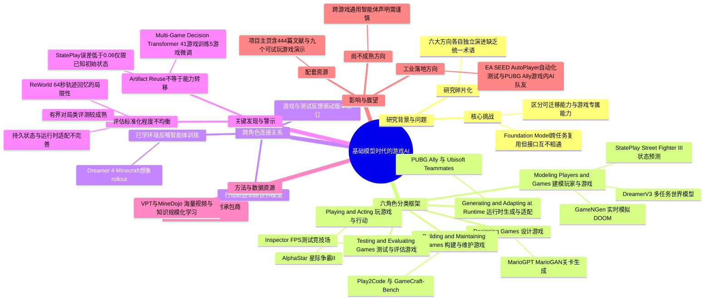

## 一、论文是干什么的？

想象你在玩一款开放世界游戏，游戏里有会陪你聊天、随机应变的 NPC 队友，游戏关卡是 AI 现场生成的，游戏本身的 bug 也是 AI 自动写代码修复的，甚至连测试这款游戏"好不好玩"这件事，都有 AI 在后台悄悄跑测试脚本。这些场景听起来分散在完全不同的领域，但这篇论文认为它们其实是同一场变革的不同侧面：**大模型（基础模型）正在把游戏这个行业从头到尾都改造了一遍**。

这篇论文不是提出一个新算法、新模型，而是一篇**综述**（survey）——作者花了大量精力把过去几年里几百篇分散的研究论文和产业系统梳理成一张清晰的地图。论文本身长达 120 页，引用了 419 篇核心文献（配套项目网站累计收录 444 篇相关文献），是目前关于"AI 与游戏"结合方向规模数一数二的系统性梳理。

打个类比：如果把"AI 用于游戏"这个领域比作一座正在快速扩张、但还没有规划图的城市，各个研究团队像是在城市不同角落各自盖楼——有人在研究怎么让 AI 打游戏打得比人类还强（比如 AlphaStar 打星际争霸），有人在研究怎么让 AI 自动生成关卡，有人在研究怎么让 AI 帮忙写游戏代码、修 bug，彼此之间几乎不看对方的图纸。这篇论文做的事情，就是站在城市上空画一张统一的地图，把这些各自为战的研究工作归到**六个角色**里，让读者一眼看清"AI 在游戏产业链的哪个环节做什么、用了什么技术、还有哪些坑没填上"。

论文作者来自新加坡国立大学（National University of Singapore）和南洋理工大学（Nanyang Technological University），并配套发布了一个可交互的项目网站（收录 444 篇文献、可按角色和年份筛选检索），以及九个可以直接在浏览器里试玩的 AI 生成/AI 参与制作的小游戏演示。

## 二、核心方法与创新

因为这是一篇综述而非提出新方法的论文，它的"创新"体现在**分类框架本身的设计**上——好的分类框架能帮读者迅速建立起对一个庞杂领域的整体认知，这正是这篇论文最大的价值所在。

### 2.1 为什么要按"角色"分类，而不是按技术分类？

很多综述习惯按技术类型分类（比如"强化学习方法""大语言模型方法""扩散模型方法"），但这篇论文认为，游戏 AI 领域更适合按照**AI 输出结果被谁使用、用来做什么**来划分，因为同一种技术（比如同一个大模型）可能同时被用在完全不同的场景里，而不同场景对"什么算成功"的判断标准也完全不同。于是作者提出了六个角色：

1. **玩游戏与行动（Playing and Acting）**：AI 亲自上场，通过做决策、和队友/对手沟通来参与游戏。代表性系统包括 DeepMind 的 **AlphaStar**（打星际争霸 II）、OpenAI 的 **OpenAI Five**（打 Dota 2）、Google 的 **SIMA 2**（能听指令玩多款游戏）、**NitroGen**（在《巫师3》《火箭联盟》等游戏中学习视觉运动操作）。这类似于培养一个"电竞选手"或"游戏陪玩"。

2. **建模玩家与游戏（Modeling Players and Games）**：AI 不直接玩，而是学习预测游戏世界怎么运转、玩家会怎么行动。代表系统有 **DreamerV3**（学一个"世界模型"来做多任务学习）、**GameNGen**（让 AI 学会"实时模拟"整个 DOOM 游戏画面和逻辑）、**Genie 2/3**（能凭空生成可交互的游戏环境）、**StatePlay**（在《街霸3》里预测游戏内部状态）。这类似于培养一个能"预判"游戏走势的解说员或数据分析师。

3. **设计游戏（Designing Games）**：AI 提出内容和规则的创意方案。代表系统有 **MarioGPT**、**MarioGAN**（自动生成超级马里奥关卡）、**NarrativeGenie**（生成剧情叙事）、**Sentient Sketchbook**（人机协同关卡设计工具）。这类似于一个"关卡策划助理"。

4. **构建与维护游戏（Building and Maintaining Games）**：AI 实际动手写代码、修 bug、迭代软件。代表系统有 **Play2Code**、**GameCraft-Bench**、**OpenGame**、**DreamGarden**。这类似于一个"初级程序员"，能听需求写代码、跑起来试错。

5. **运行时生成与适配（Generating and Adapting at Runtime）**：游戏正在被玩的当下，AI 实时改变玩家的体验。代表系统有《绝地求生》的 **PUBG Ally**（AI 队友）、育碧的 **Ubisoft Teammates**、**PANGeA**（在《暗影》类游戏中做实时对话生成）。这类似于游戏里一个"随机应变的 NPC 队友"。

6. **测试与评估游戏（Testing and Evaluating Games）**：AI 负责产出关于游戏行为或质量好坏的证据。代表系统有 **Inspector**（FPS 类游戏的自动化测试竞技场）、EA SEED 团队的 **AutoPlayer**、**iv4XR**（在《太空工程师》里做自动化测试）。这类似于游戏发售前的"内测质检员"。

### 2.2 六个角色之间是怎么串起来的？

如果这六个角色只是孤立分类，价值有限。这篇论文更关键的洞察是指出了角色之间的**数据/能力流动关系**，例如：

- **"玩"产生的轨迹数据，反过来训练"建模"用的世界模型**（trajectories train world models）：AI 打游戏留下的行动记录，可以被用来训练能模拟游戏世界的模型。
- **学出来的世界模型，又反过来给"玩"提供训练用的虚拟环境**：比如 Dreamer 4 在《我的世界》里学到的环境模型，可以让智能体在"想象"中练习，不必真的在游戏里跑。
- **"设计"阶段提出的关卡方案，交给"构建"阶段变成真正能跑起来的代码**：设计规范驱动可执行实现。
- **"玩"和"测试"环节产生的反馈，回过头驱动"构建维护"里的代码修订循环**。
- **智能体在游戏里留下的行动轨迹，被"测试"环节当作诊断证据**，用来定位软件缺陷。

这套"角色 + 连接"的框架，本质上是在说：基础模型的确让同一套预训练模型可以同时"触达"六个角色（比如一个大语言模型，既能拿来当 NPC 对话，也能拿来写代码、拿来生成关卡文案），这是"基础模型时代"区别于以往的关键变化——以前这六件事各自需要专门训练的小模型，现在一个通用大模型可以身兼数职。

### 2.3 论文提出的核心警示："复用产物不等于能力迁移"

这是全文最重要的一条结论，论文用不少篇幅反复论证：**同一个模型、同一套方法，在 A 游戏里表现好，不代表能力可以原样搬到 B 游戏里**，因为不同游戏的操作方式、规则、引擎接口、状态表示、玩家群体往往是"游戏专属"的，不能假设它们是通用的。论文举了几个很具体的例子帮助理解：

- **参数共享不等于跨游戏泛化**：Multi-Game Decision Transformer 在 41 款雅达利游戏上一起训练，看起来是"一个模型打天下"，但拿到 5 款没见过的新游戏上，仍然需要针对性微调和测试，不能直接宣称"学会了所有雅达利游戏"。SIMA 2 虽然用共享权重覆盖多款游戏，但每接入一款新游戏仍需要专门的适配工作。
- **接口不同，泛化说法就不能混用**：SIMA 靠"听指令"操作，NitroGen 靠"看画面学操作"，两者虽然都叫"能玩多款游戏"，但技术路线完全不同，"泛化能力"这四个字在两者身上的含义并不可以互换比较。
- **预测游戏状态准，不等于游戏状态全对**：StatePlay 在《街霸3》里把状态预测误差压到 0.06 以下，但这个数字只在"已知初始数值状态"的前提下成立；WorldMind 用大模型当裁判打分，"偏好度"约 70%，但这不能证明它对完整游戏状态判断是正确的。
- **设计出关卡内容，不等于关卡真的能玩**：MarioGPT 能生成马里奥关卡的布局创意，但生成的内容还必须经过"是否真的可通关、好不好玩"的检验，这是两件不同的事。

用大白话说就是：**不要看到一个 AI 系统在某个游戏里的成绩单，就默认它换个游戏也能一样好**——这正是这篇综述提醒游戏行业和研究者要警惕的"虚假泛化"陷阱。

## 三、使用了哪些模型和计算资源？

需要特别说明：**这是一篇综述论文，作者本身并没有训练任何新模型，也没有使用 GPU 集群做实验**。论文的工作是文献调研、系统梳理和分类归纳，不涉及原创的模型训练或计算资源投入。

不过，论文中评述、举例的大量代表性系统各自使用了不同的基础模型和计算资源，这里摘录几个论文中提到的例子，帮助读者感受这个领域的技术栈规模：

- **Dreamer 4**（用于《我的世界》的世界模型）：使用了约 2500 小时带动作标注的承包商操作数据进行训练。
- **VPT（Video PreTraining）**：先用较小规模的带标注《我的世界》数据训练一个"动作标注器"，再用它给海量互联网视频打标签，实现大规模学习。
- **MineDojo**：整合了大规模《我的世界》相关视频和网络知识库，作为智能体的知识来源。
- **Voyager、STEVE-1、GITM** 等系统：都依赖预训练大语言模型（如 GPT 系列）作为智能体的"大脑"，在《我的世界》等开放世界游戏里做规划和决策。
- **GPT 系列相关工具**（如论文中提到的 Playbot 开发工具、ARC-AGI-3 测试环境）：使用较新的通用大模型作为底座。

论文虽然未在综述正文中系统汇总每个系统的具体 GPU 型号和训练时长（这本身也印证了论文提出的一个批评：这个领域里各系统之间**报告的实验细节、计算资源披露程度参差不齐**，缺乏统一标准），但可以看出，游戏 AI 领域使用的基础模型和计算资源跨度很大——从几百小时规模的人工标注数据，到互联网级别的海量视频与文本语料都有。

## 四、实验结果

由于这是一篇综述，没有作者自己做的"实验结果"，取而代之的是论文在系统梳理数百篇文献后总结出的几条**领域级规律和差距**，这部分内容对读者理解"这个领域现在处于什么阶段"很有价值：

| 发现 | 大白话解读 |
|---|---|
| 广泛预训练扩大了可用接口，但没有消除游戏特定的结构 | 大模型确实让 AI 能同时应付更多种游戏任务，但每款游戏自己的操作方式、规则细节依然要单独适配，不会因为用了更强的大模型就自动"通吃" |
| 游戏对局过程正越来越多地提供数据和反馈，而不只是最终得分 | 以前评价 AI 打游戏好不好，主要看"赢没赢、分数多少"；现在越来越多研究开始利用游戏过程中的中间行为、轨迹当作训练信号和诊断依据 |
| 进展呈现"任务依赖"特征：有界的对局类任务已经有较统一的评测基准，但持续创作、实时适配、真实玩家体验相关的任务缺乏统一评测标准 | 简单说：AI"打游戏打得好不好"这件事已经比较容易量化衡量了（比如打分、胜率），但"AI 设计的关卡好不好玩""AI 队友是否真的提升了玩家体验"这类更主观、更持续的任务，目前业界还没有公认的评测标准，各做各的 |
| 持久状态维护、重复软件修订、玩家建模验证、持续运行时适配、代表性自动化测试仍不完善 | 这五类任务被论文点名为"评估最不成熟"的领域——比如 AI 能不能记住玩家几十分钟前捡到的道具（持久状态），或者一个"玩家画像"模型是不是真的准确反映了心理学意义上的玩家特征，目前都缺少可靠、独立的验证方法 |

论文也给出了一个很直观的例子说明"评估碎片化"的问题：一款名为 ReWorld 的系统只在 64 秒的往返轨迹上测试"视觉记忆能力"，但游戏里真正重要的持久状态（比如角色生命值、库存清单）需要用完全不同的方式去验证，二者不能互相替代作为"记忆能力过关"的证据。

## 五、潜在应用与已落地应用

**已经在产业中落地或接近落地的方向**（论文中提及并举例）：

- **游戏内 AI 队友/NPC**：《绝地求生》的 PUBG Ally、育碧的 Ubisoft Teammates 已经是实际产品或demo中出现的 AI 队友系统，能在游戏进行过程中实时对话、协作。
- **自动化游戏测试**：EA 旗下 SEED 团队的 AutoPlayer 等系统已经被用于游戏发布前的自动化测试，帮助发现 bug、评估平衡性，这是目前工业界采用度较高的方向之一，因为"评估最标准化"的正是这一类有边界的任务。
- **AI 辅助内容生成**：类似 MarioGPT 这样的关卡生成工具，以及项目页面展示的九个可试玩浏览器小游戏（Cloud Sling 物理解谜、Sprout Guard 塔防、Neon Kart 竞速、Moonlight Garden 空间解谜、Aurora Outpost 回合制策略等），展示了 AI 参与内容生产和游戏构建的可行性。

**潜在但尚不成熟的应用方向**（论文明确指出证据不足、需要更多研究）：

- **持久世界记忆的开放世界 NPC**：让 NPC 长期记住与玩家的互动历史，目前技术验证仍局限在短时间窗口。
- **基于心理学验证的玩家画像/推荐系统**：现有的玩家建模方法大多止步于"重构误差好不好看"，还未经过独立的心理学量表验证。
- **AI 全自动化游戏开发（从策划到上线）**：虽然 Play2Code、OpenGame 等系统已经能做代码生成和局部修订，但距离"完全自动化的游戏工作室"还有很长距离。
- **跨游戏通用智能体**：能够不经过重新训练/微调就无缝适应任意新游戏的 AI，目前论文认为这类声称需要格外谨慎看待。

## 六、网络上的讨论与评价

论文在 HuggingFace Papers 页面上获得了较高的关注度（约 117-119 个赞同），说明其在 AI 研究社区内引发了不小的兴趣，这与其体量之大（120 页、419 篇核心参考文献）以及"游戏+AI"这一话题本身的大众吸引力有关。论文作者本人在 HuggingFace 页面发布了论文概要，强调这是一份"活的"配套资源——包括交互式的分类地图、可检索的文献库，以及六个可试玩的 AI 生成/参与制作的小游戏（实际项目页面展示为九个浏览器小游戏演示）。

经过检索，**未找到** Reddit（如 r/MachineLearning）或 Hacker News 上针对这篇论文的专门讨论帖，也没有找到游戏开发者社区（如 GDC 相关论坛）对这篇综述的独立评价文章。搜索结果主要指向论文本身在 arXiv、HuggingFace 以及其配套 [GitHub 仓库](https://github.com/Eurekaleo/awesome-ai-for-games)（`Eurekaleo/awesome-ai-for-games`）的页面，尚未发现广泛的第三方深度评论或争议讨论。如后续出现更多讨论，建议读者关注论文配套的项目主页和 GitHub 仓库获取更新。

## 七、思维导图

