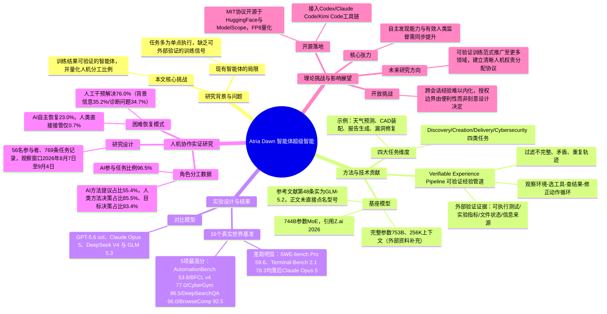

## 一、论文是干什么的？

想象一下，你请了一位非常能干的实习生，他不仅能帮你写代码、跑实验、查文献，还能自己发现程序里的漏洞并修好，甚至能把最终的研究报告排版得整整齐齐。但同时，你依然要审核他的每一个关键决定——用什么方法、验收标准是什么——这些拍板权还是握在你手里。这篇论文讲的正是这样一个"实习生"：一个名叫 Atria Dawn 的智能体大模型，以及围绕它展开的一场关于"人和AI到底该怎么分工"的大规模观察实验。

论文由上海人工智能实验室联合多家高校机构完成，作者多达143人。它做了两件事：第一，训练并发布了一个专门面向科研与工程任务的智能体基座模型 Atria Dawn Preview，在16个真实世界的评测基准上拿到了5项最高分；第二，也是论文的一大亮点，研究团队把这个模型自己的研发过程当成了一次"活体实验"，记录了56名参与者在四周时间里完成的769条任务，分析人和AI到底谁在做什么——谁提出方案、谁做决定、遇到困难时谁来救场。结论颇有意思：AI已经能大量参与提方案、写代码、改方案,但绝大多数关键决策权仍然掌握在人类手里。

## 二、核心方法与创新

**核心创新一：可验证经验管道（Verifiable Experience Pipeline）。** 这是整篇论文方法部分的心脏。可以把它理解成一条"带质检的流水线"：AI智能体在真实可执行的环境里干活——观察当前状态、挑选工具、检查工具返回的结果、然后修正自己的下一步动作，全过程留痕。干完之后,系统不是简单地"觉得做得不错"就算数,而是用外部的、客观的证据来验证结果好不好,比如跑一遍单元测试、看实验的量化指标、检查文件或程序的最终状态、做几何结构校验，甚至看是否有可靠的信息来源支撑。只有真正被验证"确实做对了"的轨迹,才会被留下来用于后续训练;不完整的、自相矛盾的、重复的、或者行为上不合理的轨迹都会被过滤掉。这就像老师批改作业不是凭感觉打分,而是拿着标准答案和测试用例逐条核对,只有真正验证通过的答案才会被收进"错题本"反过来教学生。

**核心创新二：四大任务维度的能力设计。** 论文把智能体要处理的真实工作拆成四类,分别是"发现"（Discovery，做科研、跑机器学习实验,比如天气预测、优化任务）、"创造"（Creation，写软件、做交互应用、CAD机械设计）、"交付"（Delivery，整理报告和演示文稿）、"网络安全"（Cybersecurity，找漏洞、验证修复）。这四类基本覆盖了一个"数字员工"在科研机构和工程团队里可能被指派的主要工作类型。

**核心创新三：把自己的研发过程做成人机协作研究样本。** 这是本论文最与众不同的地方——很多论文只讲模型多强,但这篇论文额外做了一个类似"民族志调查"的研究:让56名参与者在真实开发Atria Dawn的过程中记录自己和AI的每一次互动,一共留下769条任务记录。然后统计AI在"定目标""选方法""做验收"这三个环节里,分别是AI提议得多还是人类提议得多、最终拍板的又是谁。结果显示,AI在"选方法"这一步的提议占比能到55.4%,但真正拍板的决定权,人类始终占85%以上。换句话说,AI越来越像一个积极建言的合作者,但"最后一锤定音"这件事,人类还没有放手。

## 三、使用了哪些模型和计算资源？

- **基座大模型**：论文正文这句话本身写的是"基于一个7440亿参数的混合专家（MoE）基座模型"，引用标注为"Z.ai，2026"，句子里确实没有直接写出型号名字。但顺着这条引用查到论文参考文献列表第48条,原文写的就是"Z.ai, GLM-5.2"（HuggingFace模型卡片,revision cf457fa734ab,2026年9月14日访问）——也就是说,基座模型是GLM-5.2这一点,其实来自论文自己的参考文献,并不是单纯拼凑外部资料得到的推测。X/Twitter博主、AI Weekly、OrcaRouter.ai等外部报道也都认为其基座是GLM-5.2,与论文引用相互印证。不过"完整模型（GLM-5.2）参数量为753B""支持约25.6万（256K）token的上下文长度"这两个具体数字,论文正文确实没有给出,是综合GLM-5.2模型卡片等外部资料补充的信息,特此说明。
- **GPU/训练硬件**：论文全文**没有披露**训练所用的GPU型号、数量或集群规模,也没有说明预训练/强化学习训练具体消耗了多少算力或多长时间。
- **评测阶段的资源与耗时**：论文倒是披露了不同评测基准里,每个任务分配的沙箱资源和超时时间,例如 Workspace-Bench 每个任务分配2个CPU核心和8GB内存，执行时限为2小时；GDPval 分配4个CPU核心和8GB内存，代理超时（AgentTimeout）设为4小时；CyberGym 分配2个CPU核心和4GB内存，超时时间为4小时10分钟。这些是评测任务的资源上限,不是训练耗时。
- **训练算法细节**：论文提到训练用的是上述"可验证经验管道"来收集和筛选轨迹,但并未在正文中明确写出具体使用的强化学习算法名称（比如是否为PPO、GRPO等),也没有公布奖励函数的具体数学形式。
- **人机协作研究的时间窗口**：论文记录人类与AI协作数据的观察期是从2026年8月7日到9月4日，约四周时间。
- **对比模型**：评测中拿来做对比的模型包括 GPT-5.6 sol、Claude Opus 5、DeepSeek V4 等当时的前沿模型（论文原文未说明这些对比模型是通过API调用还是本地部署）。

**小结：** 关于"用了哪些GPU、训练花了多长时间"这类硬件与算力细节,论文正文中确实没有披露,只能如实说明"论文中未明确说明"。

## 四、实验结果

论文在16个真实世界任务基准上评测了 Atria Dawn Preview，并与 GPT-5.6 sol、Claude Opus 5、DeepSeek V4 等前沿模型做了对比。以下是根据论文正文抓取到的部分对比数据（个别模型在某些基准上未公布成绩，用"—"表示,由于抓取时机与工具限制,以下数字请以论文原文Table 1为准）：

| 评测基准 | Atria Dawn | GPT-5.6 sol | Claude Opus 5 | DeepSeek V4 |
|---|---|---|---|---|
| AutomationBench | 53.8 | 45.7 | 49.4 | 41.7 |
| BFCL v4 | 77.0 | — | — | 71.4 |
| CyberGym | 86.5 | 83.6 | — | 83.3 |
| DeepSearchQA | 96.0 | 93.2 | — | — |
| BrowseComp | 92.5 | 92.2 | 90.8 | 83.4 |
| Workspace-Bench-Lite | 68.2 | 60.5 | 70.1 | 58.1 |
| SkillsBench | 66.4 | 62.5 | 63.7 | 65.0 |
| Workspace-Bench | 65.0 | 56.0 | 65.8 | 55.7 |
| MLE-bench Lite | 86.2 | 88.9 | 88.0 | 86.8 |
| WideSearch | 81.9 | 83.3 | — | — |
| DeepResearch Bench II | 51.1 | 50.7 | 54.1 | 46.6 |
| τ³-Bench Banking | 41.2 | 46.9 | 48.7 | 44.3 |
| Terminal-Bench 2.1 | 78.3 | 85.1 | 90.2 | 78.7 |
| GDPval（经济价值分） | 1583 | 1682 | 1768 | 1517 |
| SWE-bench Pro | 59.6 | 61.4 | 74.7 | 58.3 |
| JobBench | 50.3 | 45.4 | 68.0 | 54.1 |

用大白话说：这16项测试里,Atria Dawn 在 AutomationBench（自动化任务）、BFCL v4（工具调用能力）、CyberGym（网络安全漏洞分析）、DeepSearchQA（深度检索问答）、BrowseComp（网页浏览与信息收集）这5项上拿到了最高分,论文摘要也明确提到"在16个基准中的5个上取得了当时报告过的最高分"。但在像 SWE-bench Pro（软件工程修复代码能力）、Terminal-Bench 2.1（命令行操作）、JobBench 这些任务上,Claude Opus 5 的分数明显更高。整体来看,Atria Dawn 属于"有专长但非全面碾压"的水平——在检索、自动化和安全类任务上比较突出,但在复杂软件工程类任务上还有差距。

在人机协作研究部分,几个关键数字很值得记住：

| 观察维度 | 数值 |
|---|---|
| 任务记录中涉及AI参与的比例 | 约96.5% |
| 参与者认为"没有AI就做不成"的任务占比 | 约33.2% |
| AI在"选方法"环节的提议占比 | 约55.4% |
| 人类做出最终方法/参数决策的占比 | 约85.5% |
| 人类对任务目标拥有最终决定权的占比 | 约93.4% |
| 遇到困难时靠人工干预解决的比例 | 约76.0% |
| AI自主排查恢复的比例 | 约23.0% |
| 人工干预方式中"提供背景信息"的占比 | 约35.2% |
| 人工干预方式中"诊断问题"的占比 | 约34.7% |
| 人类直接接手代码编辑的占比 | 仅约3.2% |
| 人类完全接管任务的占比 | 仅约0.7% |

大白话解读：AI已经能大量参与"出主意""写代码""改方案"，但从这组数据看,人类几乎不会真的"甩手不管",绝大多数情况下还是在把关方向和拍板,只有很少的情况才需要人类亲自下场改代码或整个接管。

## 五、潜在应用与已落地应用

**已经落地的部分：** Atria Dawn Preview 模型已经以 MIT 开源协议的形式发布在 HuggingFace 和 ModelScope 上（[internlm/Atria-Dawn-Preview](https://huggingface.co/internlm/Atria-Dawn-Preview)），并提供了FP8量化版本方便部署,支持通过 SGLang（0.5.13以上版本）或 vLLM（0.23.0以上版本）本地部署,也提供了国内外的托管API,还可以接入 Codex、Claude Code、Kimi Code 等编程智能体工具链使用。据外部报道,该模型是在2026年9月11日"悄悄"上线代码仓库的,没有配发官方博客或宣传,直到论文发布才被广泛注意到。GitHub仓库（[atria-asi/Atria-Dawn-Preview](https://github.com/atria-asi/Atria-Dawn-Preview)）目前有约476颗星、23个复刻（fork）。

**潜在应用方向：** 论文设想的场景主要集中在科研机构和工程团队的日常工作流,包括：自动做实验设计与执行、机器学习工程调参、软件与交互应用开发、CAD机械设计、报告与演示文稿自动生成、网络安全漏洞挖掘与修复验证等。更长远地看,论文提出的"可验证经验管道"这种训练范式,本身也可以被其他团队借鉴,用来训练"结果可核验"的智能体,而不只是"看起来说得头头是道"的智能体。

## 六、网络上的讨论与评价

搜索结果显示,这篇论文和配套模型在发布后引发了不少科技媒体和社交平台的关注,具体包括：

- **X（原Twitter）上的讨论**：有博主（用户名 marcusyul）专门发帖介绍"上海AI实验室公布了 Atria Dawn Preview 的官方仓库",强调该模型"基于7440亿参数MoE基座模型打造,目标是完成任务而不只是回答问题",并列举了证据检索等能力点。
- **科技媒体报道**：多家AI资讯类网站发文报道,包括 AI Weekly（标题为"Shanghai AI Lab Ships Atria Dawn Preview, a 744B Agentic MoE"）、Startup Fortune（标题强调"悄悄发布"）、OrcaRouter.ai（专门写了一篇对比文章"Atria Dawn vs GLM 5.2: Same Base, Two Post-Trainings"，讨论 Atria Dawn 与其基座模型 GLM-5.2 在后训练方式上的差异）、Pandaily 等。这些报道大多聚焦于"低调发布、无官方博客""744B参数""开源MIT协议"这几个话题点。
- **社区评价基调**：从搜索到的报道标题和内容看,讨论的焦点更多落在"一个国家队背景的实验室,罕见地以近乎'裸发'的方式（没有大张旗鼓宣传）放出了一个格局不小的开源智能体模型"这件事本身,而不是对论文里人机协作研究部分的深入探讨；也有博客专门做了 Atria Dawn 与其基座 GLM-5.2 的横向对比分析。
- **未找到的内容**：没有搜索到 Reddit 或 Hacker News 上关于这篇论文的专门讨论帖；也没有找到 HuggingFace 论文页面下方是否有用户评论区讨论内容（页面抓取工具未能提取到该部分内容）。

## 七、思维导图

