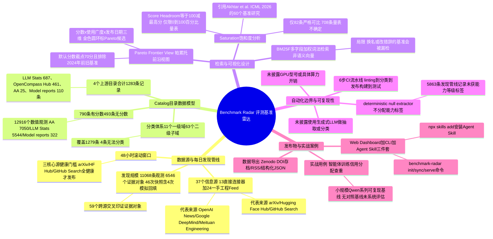

## 一、论文是干什么的？

如果你想给一家新开的餐厅定级，最靠谱的做法不是自己瞎猜，而是打开大众点评，看看这家店有没有被收录、评分从哪来、评论是不是真实用户写的。AI 圈子里的"餐厅评分"就是各种评测基准（benchmark），比如 MMLU、GPQA、SWE-bench 这些跑分。但问题是，AI 圈子没有一个统一的"大众点评"：跑分散落在论文里、GitHub 仓库里、模型发布的技术报告里、各种第三方排行榜网站里，同一个基准换个模型测一遍，数据格式、打分方式、报告口径可能完全不一样，研究者想搞清楚"这个基准到底是谁提出的、代码在哪、别人是怎么测的、这个分数还有没有参考价值"，往往要东拼西凑地去查好几个网站。

这篇论文提出的 Benchmark Radar，做的就是给 AI 评测基准建一个"大众点评"式的实时数据库和搜索引擎。它不是自己发明新的评测方法，而是每天自动去多个信息源"巡逻"，发现新出现的评测论文、数据集、代码仓库和分数报告，把它们整理归档，并保留每一条记录的原始出处链接，让使用者可以点进去核实证据，而不是盲目相信一个孤立的数字。论文把这个系统称为"活的"数据库（living database），强调它不是发布一次就不再更新的静态列表，而是持续抓取、持续增量更新的系统。截至论文撰写时的快照，系统已经收录了来自 4 个基准目录（catalog）的 1,283 条基准记录，并额外维护着一套独立的"每日发现"数据流，用于追踪最新出现但尚未被正式编目的评测相关论文和项目。

## 二、核心方法与创新

### 1. 两条并行的数据管线：目录（Catalog）与发现（Discovery）

Benchmark Radar 系统里有两套互相独立但又互相印证的数据流。第一套叫"目录"，收录的是相对成熟、已经被其他权威榜单收录过的基准，来自 4 个上游目录：LLM Stats（687 条，主要提供基准名称与描述及来源出处）、OpenCompass Hub（461 条，提供论文、代码库、数据集链接）、Artificial Analysis（25 条，当前商业评测目录，观测量最大）、以及从模型卡片和技术报告中人工整理出的 Model reports（110 条）。四者合计正好是 1,283 条基准记录，其中 790 条带有具体分数，493 条暂无分数记录。

第二套叫"每日发现"，用于捕捉刚刚冒出来、还没进入权威目录的新鲜内容。这套流程每天扫描一个 48 小时的滚动时间窗口，统计各信息源返回的条目数和报错情况，剔除日期在未来的异常行（防止时区或元数据错误造成的脏数据），只有当 arXiv、Hugging Face Hub、GitHub Search 这三个"核心源"都健康可用时，当天的发现结果才会被正式发布。截至统计节点，发现管线已经积累了 11,068 条观测记录、对应 6,546 个不重复的"证据对象"（论文、仓库、数据集等），横跨 46 次快照（其中 4 次是为了补全历史而模拟生成的回填快照），并且发现有 59 个证据对象被不止一个信息源同时报道，说明系统具备一定的跨源去重与交叉核验能力。

### 2. 37 个信息源：13 个直接连接器 + 24 个一手研究/工程 Feed

支撑每日发现的信息源一共 37 个，分成两类。第一类是 13 个"直接连接器"，直接对接学术和代码平台的官方接口，包括 arXiv、Hugging Face Hub、GitHub Search、GitHub Organizations、Hugging Face Papers、Kaggle Datasets、Zenodo、Crossref、OpenReview、GitHub Releases、OpenAlex、Semantic Scholar、Brave Search（论文附录中还提到 Hacker News 作为搜索来源之一）。第二类是 24 个"一手研究/工程 Feed"，专门盯着各大 AI 机构自己发布的博客和公告，包括 OpenAI News、Google DeepMind、Google AI、Google Research、Qwen、Meta Research、Mistral AI、Microsoft Research、NVIDIA Developer、NVIDIA AI Blog、Apple Machine Learning Research、Stability AI、AWS Machine Learning、IBM Research、Databricks、Ai2、Sakana AI、Ollama、Replicate、Nomic AI、Hugging Face Blog、LangChain、Together AI，以及美团技术团队（Meituan Engineering）。这种设计的好处是，很多重要的评测结果其实首发于厂商自己的博客而不是论文，靠传统的论文检索是抓不到的，需要专门盯着这些"一手信源"。

### 3. 检索方式：BM25F 词法检索，而非语义向量检索

Benchmark Radar 的搜索功能使用的是 BM25F 算法，这是经典信息检索里 BM25 的"多字段加权"版本：系统会给基准的名称字段、短语匹配等设置不同的权重加成，本质上仍然是关键词匹配，而不是基于向量嵌入的语义相似度检索。论文在"局限与未来工作"部分也坦诚承认，这种词法匹配会漏掉那些换了名字或者用不同措辞描述的基准（比如"改了个名字重新发布"的情况），要解决这个问题需要引入语义检索并配合人工标注的相关性判断，这是留给未来的工作。

### 4. 可视化设计：Pareto 前沿图与饱和度分析

系统提供的网页仪表盘里有两个比较有技术含量的视图。一个是 Pareto 前沿图（Pareto Frontier View），把"报告分数"、"被多少个模型测过（衡量该基准的使用广度）"、"基准发布日期（或者用首次出分日期作为代替）"三个维度放在一起画图，用金色圆环标出处于 Pareto 前沿上的候选基准（也就是那些分数高、使用广、还比较新的"高性价比"基准），空心标记提醒读者这条记录的分数量表未经验证或计数存疑，虚线轮廓则提示发布日期是用模型发布日期顶替的代理值而非基准本身的发布日期；该视图默认只展示分数不低于 70 分且发布时间较新（排除已知 2024 年之前的旧基准）的记录。

另一个是饱和度分析（Saturation）。论文借鉴了 Akhtar 等人 2026 年发表于 ICML、对 60 个语言模型基准做系统研究后提出的"饱和"定义（即分数普遍逼近满分、区分度下降的现象），并据此设计了"分数空间"（score headroom）指标：headroom 等于 100 减去该记录报告过的最高分，但这个指标只在记录明确声明使用 0 到 100 的百分比量表、且方向是"分数越高越好"时才会计算。经过审计，1,283 条记录里只有 82 条满足这个"可比较"的严格条件，另外 708 条虽然也有分数，但量表口径未知或不统一，系统会保留这些原始数值但不会拿它们做跨基准的饱和度比较，避免把苹果和橘子放在一起硬算。

### 5. 分类体系：11 个一级领域、63 个二级子领域

系统对 1,283 条目录记录中的 1,279 条完成了领域分类，划分成 11 个一级领域和 63 个二级子领域，分类标签直接取自各上游数据源自带的字段（比如 OpenCompass Hub 自己的维度标签、LLM Stats 自己的分类、Artificial Analysis 自己的分类、以及模型报告注册表里记录的领域），而不是靠 Benchmark Radar 自己重新打标。剩下 4 条无法分类的记录，是 LLM Stats 里一些"社区提交"的行，由于抓取时没有拿到描述、分类或输入形式等任何字段，系统选择老实记录"缺失原因"，而不是靠猜标题强行归类。

## 三、使用了哪些模型和计算资源？

这是这篇论文比较特别的一点：它不是一篇训练大模型的论文，通读全文和附录后，没有找到任何关于使用大语言模型（LLM）来做数据抽取、自动分类或"每日发现"内容摘要的描述。恰恰相反，论文在"局限与未来工作"一节中明确写道，系统里负责给"每日发现"产生的条目打能力标签的模块被称为"确定性空抽取器"（deterministic null extractor），这个模块目前的作用就是不给 5,863 条来自发现管线的记录分配任何能力等级标签，论文原话说"任务-能力分类在本次重建版本中仍未经验证"，也就是说这部分自动分类功能目前是刻意留白、走的是确定性规则而非生成式模型的路线。检索功能用的是前面提到的经典 BM25F 词法算法，同样不涉及神经网络推理。

关于计算资源（GPU 型号、云服务器、训练或推理时长、每日抓取处理耗时等），论文全文和附录中**均未提及**具体数字或硬件配置，只提到发现管线每次运行会检查一个 48 小时的滚动窗口、发布前会跑一套包含linting、格式检查、目录归一化、分类、发布构建、测试这 6 个步骤的持续集成（CI）流水线。因此关于具体算力开销和每日处理耗时，只能如实注明"论文中未明确说明"。

## 四、实验结果

这篇论文没有传统意义上"跑分对比、消融实验"的实验部分，它的"实验结果"更像是一份对自己数据库做的审计报告（Full-Catalog Census），核心数字如下表：

| 统计维度 | 数值 |
|---|---|
| 基准目录数量 | 4 个（LLM Stats、OpenCompass Hub、Artificial Analysis、Model reports） |
| 目录记录总数 | 1,283 条（790 条有分数，493 条无分数） |
| 数值观测总数 | 12,916 个（来自 790 条有分数的记录） |
| 观测来源拆分 | Artificial Analysis 7,050 个、LLM Stats 5,544 个、Model reports 322 个 |
| 一级领域 / 二级子领域 | 11 个 / 63 个，覆盖 1,279 条记录 |
| 可比较的百分比量表记录 | 82 条（满足 0-100 分、方向明确的严格条件） |
| 量表不确定的记录 | 708 条（保留原始分数，但不参与跨基准比较） |
| 每日发现累计观测 / 证据对象 | 11,068 条观测 / 6,546 个证据对象，跨 46 次快照 |
| 跨信息源交叉印证的证据对象 | 59 个 |

论文还做了一个"实战用例"：一位贡献者想确认自己设计的新评测方法（关于智能体训练中的信用分配问题，要求用小规模 Qwen 系列模型做可复现基线实验）是否与已有工作重复。他把任务交给一个编程 Agent，让 Agent 装上 Benchmark Radar 的命令行客户端和配套的"Agent Skill"，下载本地数据副本后离线检索，再结合联网搜索交叉核对，最终整理出一张聚焦的对比表格，辅助判断该评测设计是否有新意。论文承认这个案例"没有对照基线"，检索精度、任务适配度、节省的时间成本目前都还没有经过系统评估。

需要提醒的是，本综述在网络检索过程中还看到该项目 GitHub 仓库自身的说明文字提到"已追踪超过 11,923 条记录"，这是项目持续更新后比论文快照更新的数字，不属于论文正文披露的实验结果，仅供参考。

## 五、潜在应用与已落地应用

**潜在应用**：对普通研究者而言，这类工具最直接的用途是"查重"和"选型"——在设计新的评测基准之前，先搜一下有没有人做过类似的东西，避免重复造轮子；在给自己的模型选评测集时，可以借助 Pareto 前沿图找到那些"区分度还没饱和、被广泛使用"的基准，而不是随手抓一个可能早已过时的老基准。对于做元研究（研究"评测本身"）的学者来说，这个数据库也提供了一个可以持续增长的语料，用来研究评测生态的演化趋势，比如某类基准是何时开始流行、又是何时开始饱和的。

**已落地应用**：与很多只停留在论文里的原型不同，Benchmark Radar 已经是一个真实上线并持续运行的开源项目。项目代码托管在 [GitHub](https://github.com/ktwu01/benchmark-radar)，网页仪表盘已经发布在 [benchmark-radar.org](https://benchmark-radar.org/)，包含 Leaderboard（排行榜）、Pareto（前沿图）、Saturation（饱和度）、Trends（趋势）、Blog（每日简报）、Search（搜索）等多个板块；论文还开放了结构化数据导出（[基准目录 JSON](https://benchmark-radar.org/data/benchmark-index.json)、[每日发现观测 JSON](https://benchmark-radar.org/data/radar.json)）和 [RSS 订阅](https://benchmark-radar.org/feed.xml)；命令行工具支持 `benchmark-radar init`、`benchmark-radar sync`、`benchmark-radar serve` 等命令，可以把数据同步到本地做离线查询，并且提供 `--json` 参数输出结构化结果，方便接入其他自动化脚本或 Agent；系统还打包了一个可以通过 `npx skills add ktwu01/benchmark-radar` 安装的 Agent Skill，让编程 Agent 能直接调用这个数据库（前面提到的"实战用例"用的就是这个能力）。论文正文对应的存档版本也发布在 [Zenodo](https://doi.org/10.5281/zenodo.22167102)（永久 DOI），软件发布版本可在 [GitHub Releases](https://github.com/ktwu01/benchmark-radar/releases/tag/v0.11.0) 找到，具备完整的可复现构建流程。

## 六、网络上的讨论与评价

本综述在撰写时未能获取到 HuggingFace 论文页面的评论区内容（页面抓取只返回了部分缓存片段，未包含用户评论），也没有检索到 Hacker News、Reddit 等主流社区上关于这篇论文的专门讨论帖。不过在检索项目的 GitHub 仓库时，发现该仓库的 Issue 区有一些实质性的社区反馈：有审阅者在反馈中建议项目应该更清楚地区分"已验证的目录条目"和"刚被雷达抓到、尚未验证的新线索"，并加上验证状态和新鲜度标记；建议更明显地展示各个信息源自身的健康状态；建议补充可复现性相关的元数据，比如数据集存放位置、许可证、代码可用性、评测设置和任务分类体系。该审阅者的结论是"这个项目确实有真实的潜力"，并表示愿意进一步交流想法。此外，仓库里能看到项目维护者几乎每天都会发布"每日社交清单"（Daily social checklist）一类的 Issue，说明项目团队仍在持续、高频地运营和更新这个系统。整体来看，目前能找到的讨论集中在项目自身的工程改进建议上，尚未见到独立第三方对论文方法论的评审或争议性评价。

## 七、思维导图

