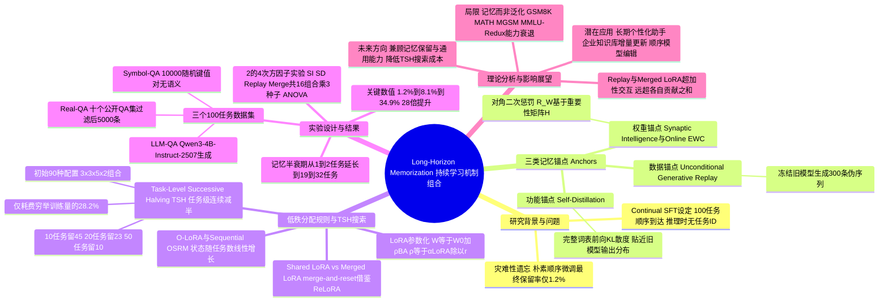

## 一、论文是干什么的？

想象一个学生要连续参加100场小测验，每场测验考的知识点完全不同，而且考完一场之后，课本和笔记全部收走，不能再翻看——学生只能靠"更新自己脑子里的记忆"来应付下一场考试。等到第100场考完，回头问他第1场、第10场、第50场考的内容，他还能记得多少？这篇论文研究的正是大语言模型的这个处境。

具体来说，作者们提出了一个叫作**长时程记忆**（long-horizon memorization）的研究场景：让一个大语言模型通过连续的监督微调（continual supervised fine-tuning）依次学习100个"问答任务"，每个任务学完之后，原始训练数据就不再保留，模型在回答问题时也不知道当前问题属于哪个任务（也就是没有"任务编号"提示）。这和人们熟悉的"一次性把所有数据混在一起训练"完全不同，更接近真实世界里知识分批到来、模型需要不断更新自己的场景，比如一个长期陪伴用户的助手，每天都会学到一些新的用户偏好或事实，但不能每次都把过去几年的所有对话重新训练一遍。

论文发现一个很扎心的结果：如果什么都不做，只是简单地一个任务接一个任务地微调下去，模型在学完100个任务后，平均只能正确回答**1.2**%的历史问题——绝大多数旧知识都被新知识"挤掉"了，这就是机器学习里经典的**灾难性遗忘**（catastrophic forgetting）问题。论文的核心贡献，就是系统性地研究如何把多种"防遗忘机制"组合起来使用，最终把这个保留率从1.2%大幅提升到34.9%，相当于提升了28倍。

## 二、核心方法与创新

### 用"锚点"给记忆打标记

论文把已有的防遗忘手段归纳成三种"锚点"（anchor），可以类比成给模型的记忆设置三种不同风格的"提醒方式"：

- **数据锚点**（Data Anchor）：类比成"每次学新知识前，先自己出几道旧知识的模拟题练习一下"。具体做法是**无条件生成式回放**（unconditional generative replay）：训练新任务之前，先用上一轮训练好的模型（冻结不动）生成300条伪造的旧内容序列（生成时用一个专门的"回放起始符"触发，空输出会被丢弃），然后训练时把这些回放数据和当前任务的数据按比例混合，一起用来更新模型。
- **功能锚点**（Function Anchor）：类比成"请一位刚下课的老老师坐在旁边，随时提醒你别把说话的风格和习惯忘了"。具体做法是**自蒸馏**（self-distillation）：把学习新任务之前的旧模型当作一个不参与训练的"教师"，让新模型在学习当前任务数据时，其输出的概率分布要尽量贴近旧模型的输出分布（用完整词表上的前向KL散度衡量）。注意它只作用于当前任务的数据，而不是回放出来的伪数据。
- **权重锚点**（Weight Anchor）：类比成"给脑子里每一根神经连线标注重要程度，重要的连线尽量别乱动"。具体做法是估计每个参数对之前任务的重要性，然后在更新时对重要参数加惩罚，让它们变化更小。论文测试了两种经典实现：**Synaptic Intelligence**（SI）和**Online EWC**（在线弹性权重巩固），两者都用对角二次惩罚项 $\mathcal{R}_W^t(\Theta) = \frac{1}{2}(\vartheta - \vartheta_{t-1}^\star)^\top H_{t-1} (\vartheta - \vartheta_{t-1}^\star)$ 来实现，区别只在于如何估计重要性矩阵 $H_{t-1}$。

### 低秩分配规则：记忆存在哪儿

除了"保留什么信息"（锚点解决的问题），论文还关心第二个维度："新学的东西存在模型的哪个位置"，这就是**低秩分配规则**（low-rank allocation rule）。论文基于LoRA（Low-Rank Adaptation）展开：对于预训练权重矩阵 $W_0$，LoRA用两个小矩阵 $A$、$B$ 加一个缩放系数 $\rho = \alpha_{\mathrm{LoRA}}/r$ 来表示更新，即 $W = W_0 + \rho BA$。论文比较了几种"存放规则"：

- **Shared LoRA**（共享LoRA）：所有任务都在同一对 $A$、$B$ 矩阵上继续训练，$B_tA_t$ 就代表学完第1到第 $t$ 个任务后的完整LoRA适配器，好比所有笔记都写在同一个本子上，越写越挤。
- **Merged LoRA**（合并LoRA）：每学完一个任务，就把这一轮学到的更新 $\rho B_t^\star A_t^\star$ "折叠"进主干的稠密权重矩阵，即 $W_t = W_{t-1} + \rho B_t^\star A_t^\star$，然后给下一个任务重新初始化一对全新的LoRA矩阵。这好比每次学完一章就把笔记正式誊抄进课本，再拿一张空白便签纸开始记下一章——这种"合并再重置"的思路借鉴自ReLoRA。
- **O-LoRA**：给每个任务分配一对全新的LoRA矩阵并把之前所有任务的矩阵冻结拼接起来，状态会随任务数线性增长。
- **Sequential OSRM**：结合Merged LoRA与"基于任务特征的初始化"，利用之前任务在网络里的平均隐藏状态做奇异值分解（SVD），把新LoRA矩阵初始化在过去任务信息量最小的方向上，从而减少干扰。

论文强调，Shared LoRA和Merged LoRA的额外存储状态是**恒定**的，不会随任务数增加而增长，而O-LoRA和Sequential OSRM的状态是**随任务数线性增长**的。

### 任务级逐次减半搜索（Task-Level Successive Halving）

三种锚点（各自有开/关及超参数选项）乘上低秩分配规则，组合数量非常多，如果每种组合都跑满100个任务再比较，代价太高。论文因此设计了**任务级逐次减半**（Task-Level Successive Halving，TSH）算法，思路类似"多轮淘汰赛"：

- 初始候选池共有 $3 \times 3 \times 5 \times 2 = 90$ 种配置（权重锚点：无/SI/Online EWC 共3种；功能锚点：无/两种自蒸馏权重 共3种；数据锚点：无/4种回放超参数组合 共5种；低秩分配：Shared/Merged 共2种）。
- 先让全部90种配置学习10个任务，按平均最终保留率排名，只保留前45名；再学到20个任务，保留前23名；再学到50个任务，保留前10名；这最后10名配置一路训练到全部100个任务，得到最终结果。
- 每一轮的打分公式是对多个随机种子取平均后的最终保留率：$F_r(a) = \frac{1}{|S|}\sum_{s \in S} \frac{1}{r}\sum_{j=1}^{r} M_{r,j}^{a,s}$，其中 $M_{i,j}$ 表示学完第 $i$ 个任务后在第 $j$ 个任务上的准确率。
- 论文用一个简单的成本核算公式估计搜索节省了多少训练量：$C = \sum_k n_k (r_k - r_{k-1})$，代入具体数字得到 $C = 90 \times 10 + 45 \times 10 + 23 \times 30 + 10 \times 50 = 2540$ 个"配置乘任务"训练单位，而如果把全部90种配置都训满100个任务则需要9000个单位，也就是说这套逐次减半搜索只用了穷举搜索**28.2**%的训练量，节省了71.8%。论文也验证了：虽然这种淘汰机制不保证一定留下全局最优配置，但10个任务时的排名和最终100个任务的排名高度一致（Spearman相关系数在0.90到0.95之间）。

### 三个100任务的记忆数据集与因子实验

为了系统检验上述机制，论文专门构造了三个语义真实程度递增的100任务数据集：

- **Symbol-QA**：10,000对完全随机生成的"键-值"关联（6位字符的键对应4位字符的值，取自62个字符的字母表），100个任务、每个任务100条，键和值之间没有任何语义联系，纯考验死记硬背。
- **LLM-QA**：用**Qwen3-4B-Instruct-2507**模型围绕100个虚构主题（比如"虚构灯塔看守人的故事"）生成10,000条问答对，保证每个问题在整个数据集里只对应唯一答案，100个任务、每个任务100条。
- **Real-QA**：从十个公开问答数据集（TriviaQA、NQ-Open、PopQA、SQuAD、WebQuestions、OpenBookQA、SciQ、ARC-Easy、ARC-Challenge、MedMCQA）各抽取500条真实问答，并过滤掉基础模型在训练前采样5次就能答对的"太简单"的题目，最终得到5,000条，100个任务、每个任务50条。

三个数据集依次代表"完全没有语义规律""有语言外形但知识是虚构的""完全真实世界知识"三种递进情形，用来测试防遗忘方法是否只对某一类知识有效。

有了TSH搜索给出的初步线索后，论文进一步设计了一个 $2^4$ **因子实验**（factorial experiment）：让SI（权重锚点）、自蒸馏SD（功能锚点）、回放Replay（数据锚点）、Merged LoRA（是否使用）这四个"开关"各自独立开启或关闭，形成16种组合，每种组合跑3个随机种子，再用方差分析（ANOVA）拆解出每个机制的"主效应"以及它们两两、三三乃至四者之间的"交互效应"，从而判断哪些机制是真正互补的、组合起来是否比单独用更好。

## 三、使用了哪些模型和计算资源？

- **基座模型**：论文在附录表3中明确写明，所有微调实验统一使用 **Qwen3-4B-Base** 作为骨干模型（backbone），采用bfloat16精度训练，LoRA配置为秩 $r=32$、$\alpha_{\mathrm{LoRA}}=64$，作用于注意力和MLP的 `q_proj, k_proj, v_proj, o_proj, gate_proj, up_proj, down_proj` 这些线性层，每个任务训练10个epoch。
- **数据生成用模型**：构造LLM-QA数据集时，使用了指令微调版本的 **Qwen3-4B-Instruct-2507** 来生成虚构问答内容（这是用来"造数据"的模型，和用来做实验的骨干模型Qwen3-4B-Base是两个不同的checkpoint）。
- **GPU型号与数量**：经过对论文正文、全部附录（A到E）以及项目开源代码仓库README的检查，论文中**没有明确说明**具体使用了哪种GPU型号或多少块GPU，只在开源代码仓库的说明中提到"需要一块CUDA GPU来运行论文规模的实验"这类笼统描述，没有给出具体型号。
- **训练/搜索耗时**：论文附录D.1提供的是一个抽象的"训练成本核算"，即把"一个配置训练一个任务"算作一个计量单位，逐次减半搜索总共消耗2540个单位，而穷举搜索需要9000个单位（节省71.8%）——但这只是一个相对的工作量计数，论文中**没有给出**任何真实的挂钟时间（wall-clock time），比如单次任务微调具体用了多少分钟、整个TSH搜索或完整100任务训练总共花了多少小时或天数，这些具体耗时信息在论文中同样未明确说明。

## 四、实验结果

论文的核心指标是**最终保留率**（Final Retention）：模型学完全部100个任务后，对所有100个任务的平均正确率。三个数据集上的关键数字如下：

| 方法 | Symbol-QA | LLM-QA | Real-QA | 三数据集平均 |
|---|---|---|---|---|
| 朴素顺序微调（无任何防遗忘机制） | 约1.0% | 约1.4% | 约1.3% | 1.2% |
| 最强的单一机制（仅用一种锚点或分配规则） | 4.2% | 7.5% | 12.5% | 8.1% |
| 三种锚点全部叠加 + Merged LoRA（论文最佳组合） | 23.2% | 41.8% | 54.8% | 34.9% |

也就是说，只靠单独一种机制（无论是回放、自蒸馏还是权重正则化），最多也只能把保留率从1.2%拉到8.1%左右；但把数据、功能、权重三种锚点和Merged LoRA这种低秩分配规则**同时组合**起来使用后，效果出现了跳跃式提升，达到34.9%，是朴素微调的**28倍**，并且在三个数据集上都稳居前3名的方法之列（这是唯一一种能做到这一点的组合）。

论文还用"记忆半衰期"（memory half-life，即准确率跌到初始值一半时经过的任务数）来衡量遗忘速度：朴素微调的记忆半衰期只有1到2个任务（学完就忘），最强单一机制能撑到4到11个任务，而最佳组合方法能把半衰期延长到19到32个任务（三个数据集分别为19、32、32个任务），相当于把"记忆能撑住的时间"拉长了十几到几十倍。

因子实验的结果显示，回放（Replay）和Merged LoRA是贡献最大的两个机制：单独增加回放平均能带来9.5到19.3个百分点的提升，单独增加Merged LoRA平均能带来5.9到20.5个百分点的提升；更关键的是，这两者一起使用时会产生**超加性交互**（super-additive interaction）——也就是说，两者组合带来的收益，远大于各自单独收益简单相加的结果（比如在Real-QA上，两者单独贡献之和只有13.9个百分点，但组合后带来了46.9个百分点的提升）。不过论文也诚实地指出了局限：这种组合方法提升的是"记忆"而非"泛化"能力，也就是模型只是记住了训练时见过的原始问法，换一种问法未必答得上来；同时，即便记忆保留率大幅提高，模型在GSM8K、MATH、MGSM、MMLU-Redux这些通用能力测试上依然会出现明显的能力衰退，如何在"记住新知识"和"保住原有通用能力"之间兼顾，仍是一个尚未解决的问题。

## 五、潜在应用与已落地应用

**潜在应用方向**包括：需要长期陪伴、持续积累用户偏好和事实的个性化助手；企业内部知识库随时间不断增量更新、又不想每次都全量重训模型的场景；以及作为"顺序模型编辑"（sequential model editing，即不断对模型做小修小补）这类任务的一种替代方案，因为论文的设定本质上也是在测试"模型能否持续、可靠地记住许多次连续更新"。

关于**已落地应用**，目前从公开资料看，这仍然是一项处于研究阶段的工作，论文作者在项目主页 [compose-cl.github.io](https://compose-cl.github.io/) 和代码仓库 [github.com/cozheyuanzhangde/compose-cl](https://github.com/cozheyuanzhangde/compose-cl) 公开了实现代码，并在 [HuggingFace 数据集页面](https://huggingface.co/datasets/cozzyde/long-horizon-memorization) 发布了论文构造的Symbol-QA、LLM-QA、Real-QA三个数据集，方便其他研究者复现或在此基础上继续研究，但暂未查到已经被集成进产品或商业系统的具体案例。

## 六、网络上的讨论与评价

经过检索，这篇论文截至综述撰写时（2026年9月18日）主要出现在arXiv、alphaXiv、HuggingFace Papers等学术论文聚合页面上，作者团队来自约翰霍普金斯大学（Johns Hopkins University）的Daniel Khashabi教授（Intelligence Amplification Lab）与Tianmin Shu教授（Social Cognitive AI Lab）课题组。截至目前，暂未检索到Reddit、Twitter/X、Hacker News等社区平台上有针对这篇论文的专门讨论帖或博客解读，如实说明：目前找到的主要是论文本身、其项目主页和开源代码仓库，尚未发现独立的第三方评价或热议。

## 七、思维导图

