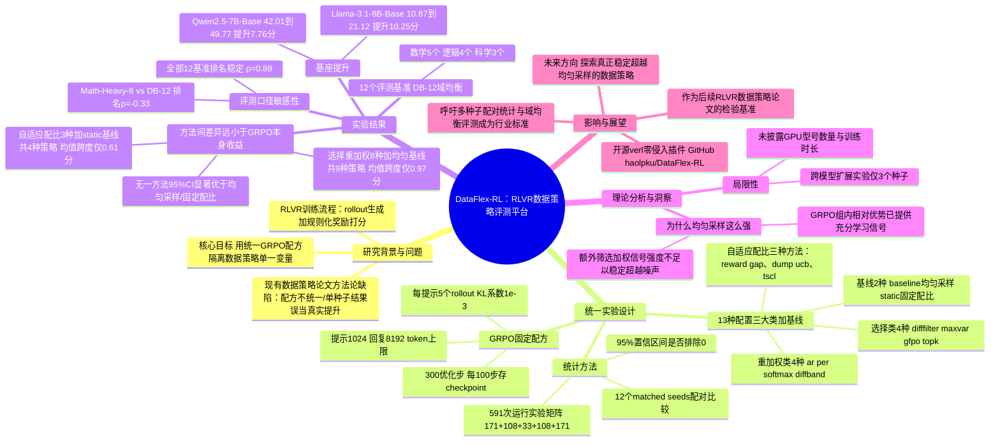

## 一、论文是干什么的？

近两年，训练大模型做数学、逻辑推理时流行一种叫 RLVR（Reinforcement Learning with Verifiable Rewards，可验证奖励强化学习）的方法：让模型自己生成很多个候选答案（术语叫 rollout，可以理解为模型的"多次尝试"），用可以自动判断对错的规则（比如数学题答案能直接核对）给每次尝试打分，再用强化学习让模型往得分高的方向调整。

围绕这套流程，学术界近年提出了大量"数据策略"，也就是不直接改模型结构，而是改"喂给模型学习的数据该怎么挑、怎么加权、怎么配比"的技巧。例如：只挑一部分做得好或做得差的尝试来训练、按某种规则给不同尝试分配不同的学习权重、动态调整数学题和逻辑题在训练数据里的比例等。几乎每一篇提出新数据策略的论文都会报告"效果比基线好几个百分点"，但这些论文往往各自换了不同的基座模型、不同的验证器、不同的训练超参数，导致读者根本无法判断：效果提升到底是这个数据策略本身带来的，还是训练配方里其他因素凑巧带来的。

这篇论文的作者们做了一件"扫雷"性质的工作：他们搭建了一个叫 DataFlex-RL 的评测平台，把训练配方（用什么算法、多少步、什么超参数）严格固定住，只单独更换"数据策略"这一个变量，然后在同样的模型、同样的随机种子、同样的评测基准下，一次性、公平地把市面上有代表性的十几种数据策略拉出来"同场竞技"。结果发现：绝大多数号称"更聪明"的数据挑选和加权方法，其实和最朴素的"随机均匀采样"相比，改进量小到统计学上说不清是真提升还是噪声。这是一篇诚实报告"负面结果"（negative result）的论文——它的价值不在于提出了多牛的新方法，而在于用严谨的对照实验证明了很多"看起来有效"的常见做法其实经不起推敲。

## 二、核心方法与创新

### 1. 用统一的 GRPO"配方"做公平对照

论文的核心创新不是发明新算法，而是"控制变量法"的工程化落地。所有实验都基于同一套 GRPO（Group Relative Policy Optimization，一种不需要额外训练价值网络、通过组内相对比较来计算优势值的强化学习算法）配方：每个提示词生成5个候选回复（rollout）、KL 散度惩罚系数固定为$10^{-3}$、提示词和回复的长度上限分别是1024和8192个token、每次训练跑300个优化步数并每100步存一次检查点。唯一被替换的变量，就是"数据策略"本身。这样一来，如果某个数据策略在这套统一配方下依然打不过最简单的随机均匀采样，就很难再用"配方不同、不公平"当借口。

### 2. 十三种配置：把常见数据策略分门别类

论文一共设计并对照了13种配置，分为三大类：

**选择类方法（在4种候选之外还有均匀采样基线）**：从每一批生成的回复里，按某种规则挑一部分参与训练。包括：`difffilter`（按照组内求解率过滤，类似 DAPO 的思路，把太简单或太难、组内全对或全错的题目样本剔除）、`maxvar`（保留能让奖励方差最大化的那一半左右回复子集，思路来自 PODS）、`gfpo`（按效率比排序，只保留其中一部分高效回复）、`topk`（只保留批次内得分最高的前50%回复）。

**重加权类方法**：不丢弃回复，而是给不同回复分配不同的学习权重。包括：`ar`（对低概率 token 进行阻尼压制）、`per`（借鉴优先经验回放 PER 思路对当前批次加权）、`softmax`（按优势值做 $w_i \propto \exp(a_i / T)$ 的指数加权，温度 $T=1$）、`diffband`（给处于批次四分位区间的回复2倍权重）。

以上选择类和重加权类合计正好8种方法，是论文重点检验"有没有普遍性效果"的对象。

**自适应配比类方法**：动态调整数学、逻辑、科学三个领域在训练批次中的占比。包括：`reward_gap`（基于领域间奖励差距动态调整）、`dump_ucb`（借鉴多臂老虎机里的 UCB 探索策略做领域采样）、`tscl`（Teacher-Student Curriculum Learning，师生课程学习思路）。这3种和固定均匀配比的基线 `static`（三个领域各占三分之一，$p_t(d) = 1/3$）做对照。

再加上完全不做任何干预的 `baseline`（均匀采样）控制组，一共 4（选择）+ 4（重加权）+ 3（自适应配比）+ 2（均匀采样/固定配比两个基线）= 13 种配置。

### 3. 统计严谨性：多种子配对置信区间，而不是"跑一次算数"

以往很多论文只跑一两个随机种子就报告结果，容易把噪声误当成真实提升。这篇论文对主实验用了12个"匹配种子"（matched seeds，即不同方法之间使用完全相同的一组随机种子，做配对比较而不是独立比较），并计算每种方法相对均匀采样的95%置信区间是否包含0——如果包含0，就说明"看不出这个方法比随机采样更好"，哪怕点估计的平均值看起来略高。整个实验矩阵总共跑了591次训练：其中171次是广度探索性研究、108次是把三个基准选择方法从3个种子扩到12个种子做验证、33次是机制和强度控制实验、108次是额外的 Qwen2.5-7B-Base 补充实验，还有171次是跨基座模型规模和系列的扩展实验。

### 4. 揭示"评测口径"本身也能左右结论

论文另一个重要发现是方法论层面的：如果只用12个基准里偏数学的6个基准（5个数学基准加上 GPQA-Diamond，论文称为 Math-Heavy-6）去给各方法排名，和用全部覆盖数学、逻辑、科学三大领域、彼此权重均衡的12个基准（Domain-Balanced-12，简称 DB-12）去排名，两种排名的斯皮尔曼等级相关系数（Spearman's $\rho$）是**负0点33**（$\rho = -0.33$），也就是说，只看数学类基准得出的"哪个方法更好"的结论，和综合数学、逻辑、科学后得出的结论方向几乎是反的。而如果只是省略掉"逻辑推理"这一个领域，排名也会明显反转；但只要保留全部12个基准做综合评分，不同统计口径得出的排名基本一致（$\rho = 0.88$）。这说明很多论文里"某方法领先"的结论，可能只是因为挑选的评测基准范围偏窄。

## 三、使用了哪些模型和计算资源？

**基座模型：** 主实验使用 Qwen2.5-7B-Base 和 Llama-3.1-8B-Base 两个基座模型（均为未经过指令微调的 Base 版本，论文全文未使用 Qwen2.5-7B-Instruct 或其他 Instruct 版本）。此外，论文还做了跨模型规模的补充实验，覆盖 Qwen2.5-1.5B、Qwen2.5-3B、Qwen2.5-14B 以及 Llama-3.2-3B，这部分补充实验每个配置只跑3个随机种子（比主实验的12个种子少）。

**训练框架：** 所有实验基于开源强化学习训练框架 verl（v0.5及以上版本），使用 GRPO 算法训练。

**GPU 型号与数量、训练时长：** 论文全文（包括正文的实现细节部分）**均未披露**具体使用的 GPU 型号、显卡数量、机器集群配置，也没有给出单次训练或整个591次实验矩阵所消耗的墙钟时间（wall-clock time）或总计算小时数。作者在 GitHub 仓库的说明中也只提到"单元测试不需要 GPU"，同样没有公布训练所用的硬件规格。这是本文在计算资源披露上的一个明显缺口，读者如果想复现全部591次训练，需要自行估算所需算力。

**实验规模：** 整个实验矩阵累计591次独立训练运行，是目前同类"数据策略评测"研究里规模较大的一个。

## 四、实验结果

先看最重要的"基座提升"数字：在 Qwen2.5-7B-Base 上，完全不用任何数据策略、只用最朴素的均匀采样 GRPO 训练，12基准综合平均准确率（Overall）就能从未训练时的42.01分提升到49.77分，提升了7.76个百分点；在 Llama-3.1-8B-Base 上，同样的均匀 GRPO 能带来从10.87分到21.12分、约10.25个百分点的提升。这说明 GRPO 这个算法框架本身确实有效，问题在于：在这个已经很有效的基础上，那些花哨的数据策略还能不能再"锦上添花"。

答案是：基本不能。核心结论列举如下：

| 发现 | 具体数字/说明 |
|---|---|
| 选择类和重加权类方法（共8种）相对均匀采样 | 没有一种方法的配对95%置信区间不包含0，即统计上无法确认真的比随机采样好 |
| 自适应配比方法（3种）相对固定均匀配比 | 同样没有一种方法在相同精度水平下确认优于固定三分之一配比 |
| 8种选择/重加权方法加上均匀采样基线（共9种策略）| 均值跨度只有0点97个百分点 |
| 3种自适应配比方法加上固定配比基线（共4种策略） | 均值跨度只有0点61个百分点 |
| 对比均匀 GRPO 带来的整体提升 | 高达7.76个百分点，远大于以上两类数据策略互相之间不到1个百分点的差异 |
| 换用不同评测口径（Math-Heavy-6 对比 DB-12） | 方法排名的斯皮尔曼相关系数为负0点33，排名方向几乎相反 |
| 只去掉逻辑推理这一个领域再评分 | 排名同样会明显反转 |
| 保留全部12个基准综合评分 vs 部分变体评分 | 相关系数为0点88，结论基本稳定 |
| 跨基座模型（Qwen 系列多个规模、Llama-3.2-3B）扩展实验 | 没有哪种数据策略在所有模型上都是"赢家"，不同模型规模下同一方法的效果方向甚至会反过来 |

简单说：这篇论文得出的最扎实结论是——**均匀采样是一个很强的基线**，多数号称更聪明的数据挑选、加权、配比方法，在严格控制变量、多种子配对比较的条件下，并没有表现出可靠、可重复的优势。真正带来大幅提升的是 GRPO 算法本身，而不是这些数据策略层面的"锦囊妙计"。

## 五、潜在应用与已落地应用

**作为评测方法论的模板：** DataFlex-RL 最直接的应用场景，是给后续所有想提出新 RLVR 数据策略的研究者提供一个"及格线"检验工具——在发表新方法之前，先用这套统一配方、多种子配对置信区间、多领域均衡基准的流程跑一遍，看看是不是真的能打过均匀采样，而不是靠换基座模型、换验证器等混杂因素"包装"出提升。

**已落地的开源工具：** 作者已经把评测平台的核心代码开源在 GitHub（[haolpku/DataFlex-RL](https://github.com/haolpku/DataFlex-RL)），定位是一个"零侵入"（zero-fork）的 verl 插件，让使用者不需要修改 verl 源码，就能灵活配置"保留哪些 rollout、如何加权、下一批从哪个领域采样"这三类数据调度机制。仓库里还包含框架无关的打分器/执行器实现、诊断辅助工具、端到端示例、不依赖 GPU 的单元测试，以及一个独立的评测配套仓库，文档托管在 [DataFlex-RL 文档站点](https://haolpku.github.io/DataFlex-RL-Doc/)。截至综述撰写时，该仓库星标数较少（约5个星标），仍处于较早期的社区采用阶段。

**对业界训练实践的提示：** 对于正在做 RLVR 训练的团队而言，这篇论文提示了一个务实的经验：与其花大量工程精力去实现和调试复杂的 rollout 筛选、重加权或自适应课程学习策略，不如先把均匀采样 GRPO 跑扎实，再谨慎评估额外的数据策略是否真的带来了统计显著的收益。

## 六、网络上的讨论与评价

经过检索，本文在 Hacker News、Reddit、X（Twitter）等主流社区**未发现针对本篇论文的专门讨论帖或长篇评论**。搜索到的相关链接大多是自动聚合类网站（如 Papers with Code、HyperAI、Pith Review、awesomepapers.io 等）对论文摘要的转载或镜像，并非真人评论或深入讨论。HuggingFace 论文页面在抓取时也没有显示用户留言（可能是尚未有人评论，或讨论区内容需要动态加载）。

考虑到本文的核心结论——"大多数 RLVR 数据策略并不比均匀采样更好"——是一个相对反直觉、也可能让相关领域一些前序工作的说服力打折扣的负面结果，按理会引发一定讨论，但截至综述撰写时（2026年9月18日，论文发布仅约两周），尚未检索到有分量的社区反响、批评或跟进讨论。这可能与论文发布时间较短、传播尚未充分展开有关，也可能是因为负面结果类论文本身在社交媒体上天然传播度较低。如后续出现相关讨论，需要另行补充。

## 七、思维导图

