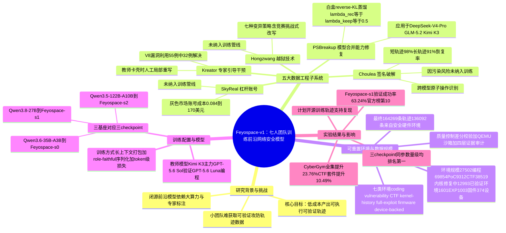

## 一、论文是干什么的？

一直以来，训练一个能自主完成网络安全攻防任务（比如找漏洞、写利用代码、打 CTF 比赛）的 AI 模型，被认为是只有大公司才玩得起的游戏——需要海量算力、大量专家标注数据，还要有渠道拿到高质量的"老师模型"生成的训练样本。这篇论文讲的是一个只有七个人的独立团队，没有依赖堆算力，而是靠一整套精心设计的数据加工流水线，训练出了在权威网络安全评测榜单 CyberGym 上排进前十的开源模型。

打个比方：如果说训练顶级网络安全模型像是造一辆赛车，大公司的做法是砸钱造更大的发动机（堆算力、堆参数量），而这七人团队的做法更像是精工细作——设计更聪明的传动系统、更精准的调校方案，用同样甚至更小的"发动机"（基座模型）跑出更快的圈速。论文的核心贡献是这套数据加工流水线本身，以及围绕"如何又快又便宜地生产可验证的网络安全训练数据"而设计的五个子系统。

值得一提的是，论文标题里的"Cyber Mercury Seven"呼应了美国历史上最早的七位"水星计划"宇航员——暗喻这是一支规模很小、但完成了"不可能任务"的团队。

## 二、核心方法与创新

论文的核心是一套数据中心（data-centric）框架，由五个各自独立又互相配合的子系统组成，专门解决"训练网络安全智能体时缺高质量数据"这个瓶颈问题。

**Choulea**（签名破解）尝试从 OpenAI、Anthropic、Google 等厂商的闭源模型 API 返回结果中，还原出被加密或隐藏起来的推理过程。它的思路是找出模型推理里反复出现的"原子操作"（触发认知转换的最小控制单元），再分析这些原子操作在不同模型间的组合方式。在 2026 年 8 月 21 日各厂商加固防御之前，这套方法对 4096 token 以内的推理轨迹能做到 98% 的恢复成功率，更长的轨迹也有 91%。但作者出于数据质量和"污染"风险的考虑，明确说明这批还原出来的轨迹**没有**被用于本次训练。

**SkyReal**（杠杆账号）分析的是网络上灰色市场里那种低价倒卖 API 额度的账号供应链，发现单个账号成本在 0.084 美元到 170 美元之间浮动，相对于官方标价能撬动约 273 倍的"杠杆"，团队甚至搭建过用免费层服务和反向代理同步跑一千多个查询单元的系统。但和 Choulea 一样，论文明确说明这套系统**没有**被用在最终的训练管线里。

**Hongzwang**（越狱技术）是七种绕过教师模型安全限制的"变异策略"组合，包括任务拆解、措辞改写、角色扮演式请求、上下文重排、把请求包装成工具调用、调节任务的"攻击强度"，以及把请求包装成竞赛挑战。这套方法覆盖了 Web/API、二进制漏洞利用、逆向工程、密码学、取证、移动安全六大方向，其中"竞赛挑战"这一招额外解决了 39% 原本会被拒答的案例。同样地，论文说明这套技术最终也**没有**被用于正式训练数据的生产。

值得注意的是：五个子系统里有三个（Choulea、SkyReal、Hongzwang）都属于"研究了但没敢用"——这更像是团队对数据来源合规性和质量风险的一次系统性排查报告，而非最终训练配方的一部分。这种"做了实验、写了论文、但主动弃用"的态度，在数据伦理上是一个值得关注的细节。

真正进入训练管线的是另外两个子系统：

**PSBreakup**（模型合并能力修复）解决的是另一个问题：很多厂商为了安全考虑，会把强模型和弱模型"合并"（Model-Orthogonal Parameter Distillation，MOPD）来削弱其网络攻防能力，但这也会误伤模型本该保留的正常能力。PSBreakup 用白盒的、token 级别的反向 KL 蒸馏，先用双向行为干扰探针定位哪些能力域被误伤，再用提示词构造出一个可控的"教师"，用 $\lambda_{rec}=\lambda_{keep}=0.5$ 的权重、每个能力域 300 条公开基准问题来做修复训练。这套方法被应用在 DeepSeek-V4-Pro、GLM-5.2、Kimi K3 三个模型上，用来找回它们被合并操作削弱的网络安全能力。

**Kreator**（专家引导干预）解决的是教师模型在写复杂漏洞利用代码时"卡壳"的问题：当教师模型（主要是 Kimi K3）解不出来时，人类专家会给出关键的提示性步骤（平均每个环境约 3.6 次干预），然后只让教师模型针对被干预的那几步做"局部重写"，而不是整条轨迹推倒重来——论文举例说在一批较难的 V8 漏洞利用任务里，55 个案例中有 32 个是这样解决的。这种局部修补的方式比整条轨迹重新生成要省钱得多。

在数据生产的另一端，团队还搭建了一套可自动重置的执行环境体系，覆盖七大类：普通编程环境（coding）、漏洞复现环境（vulnerability）、CTF 环境、内核历史环境（kernel-history）、完整漏洞利用环境（full-exploit）、固件环境（firmware）和真实设备环境（device-backed）。每个环境都配有可执行程序和可重置的验证信号——类似一个能反复运行、自动判分的考场。具体规模上：

| 环境类别 | 数据来源 | 环境/挑战数量 |
|---|---|---|
| 基础编程 | 3,751 个 GitHub 仓库 | 27,502 个环境，验证成功率 79% |
| 漏洞复现（Advanced A） | 343,214 条 CVE 记录 | 69,854 个可用 PoC |
| CTF（Advanced B） | 作者团队自有 CTF 题库 | 9,312 道题目 |
| 内核历史（Advanced C） | 428,000 条内核提交，识别出 38,519 个安全相关修复 | 12,993 个已验证环境 |
| 完整漏洞利用（Advanced D） | 前三类素材整合 | 1,601 个 EXP 案例 |
| 硬件相关 | 固件重宿主 + 真实设备 | 1,003 个固件环境 + 374 个真实设备环境 |

漏洞类和内核类数据靠"差分校验"（同一个 PoC 在有漏洞版本上能触发、在打了补丁的版本上就失效）来自动判断轨迹是否有效，硬件相关的环境则跑在隔离的 QEMU 虚拟环境里以保证安全。所有候选轨迹都要经过"执行验证"加"四层证据审计"才能进入训练集，最终留下 164,269 条轨迹，其中 136,092 条来自安全与硬件类环境。训练阶段使用长上下文序列打包和"角色忠实"的轨迹序列化方式做监督微调（SFT），损失函数按 token 级别设计。

## 三、使用了哪些模型和计算资源？

**起始基座模型：** 论文里明确提到三个基座，分别对应训练出的三个 checkpoint——`Qwen3.6-35B-A3B` 对应 `Feyospace-s0`，`Qwen3.8-27B` 对应 `Feyospace-s1`，`Qwen3.5-122B-A10B` 对应 `Feyospace-s2`。

**教师模型（通过 API 调用）：** 主力漏洞利用轨迹生成用的是 `Kimi K3`；`GPT-5.6 Sol` 用于外部结果验证和基础编程环节的脚手架搭建；`GPT-5.6 Luna` 负责编程数据的第二梯队生成。此外，PSBreakup 子系统的能力修复对象是 `DeepSeek-V4-Pro`、`GLM-5.2` 和 `Kimi K3` 三个模型。

**GPU 型号、数量：** 论文中未明确说明具体的 GPU 型号或总卡数，但附录披露了三个 checkpoint 各自的分布式并行配置（例如 Qwen3.6-35B-A3B 使用张量并行 TP=2、上下文并行 CP=4、专家并行 EP=8、数据并行 DP=4），可以看出训练规模不小，但无法从中推算出准确的 GPU 数量或硬件型号。

**训练与数据生成耗时：** 论文中未明确说明。文中只提到防御方在 2026 年 8 月 21 日之后升级了针对 Choulea 方法的防护措施，以及榜单成绩的统计截止日期是 2026 年 9 月 1 日，但没有给出具体的数据生产周期或训练所耗费的时间。

## 四、实验结果

论文用网络安全领域的权威评测集 CyberGym 以及多个 CTF 题库的汇总结果来衡量模型能力：

| 指标 | 结果 |
|---|---|
| CyberGym 全集平均提升（相对各自的基座模型） | 23.76% |
| 汇总 CTF 题库平均提升（相对各自的基座模型） | 10.49% |
| Feyospace-s1 在 CyberGym 官方榜单的验证成功率 | 63.24% |
| Feyospace-s1 在 CyberGym 官方榜单排名（截至 2026-09-01） | 第 10 名 |
| 三个 checkpoint 在各自参数规模区间内的排名 | 均为第 1 名 |

简单说：这套流水线训出来的模型不但比自己的"出厂设置"（基座模型）强了近四分之一，还在同等参数规模的开源模型里做到了断层第一，甚至挤进了包含众多更大规模闭源模型的官方总榜前十。这对于一个七人团队来说，是相当亮眼的成绩单。

## 五、潜在应用与已落地应用

这类模型的价值主要体现在防御性安全研究上：

- **自动化漏洞挖掘与验证**：模型能够根据 CVE 描述自动生成、验证 PoC（概念验证利用代码），这对安全团队快速评估某个漏洞的实际危害程度、决定修复优先级很有帮助。
- **CTF 训练与安全教育**：可重置的 CTF 环境和自动判分体系，本身就是一套现成的安全人才培养工具，能让学习者和防御方研究人员反复演练攻防技巧。
- **固件与物联网设备安全测试**：论文构建的固件重宿主和真实设备环境，让研究者不需要买齐一堆实体设备也能大规模测试嵌入式系统的安全性，这对资源有限的防御团队尤其有价值。
- **内核补丁历史分析**：基于 42.8 万条内核提交构建的"漏洞修复"数据集，可用于训练自动识别安全补丁、辅助内核维护者做回归测试的工具。
- **红队自动化辅助蓝队防御**：把模型用作自动化的攻击模拟工具，帮助企业在真正的攻击者出手之前发现自己系统里的薄弱环节。

**已落地应用：** 论文作者表示将会开源本次工作中用到的训练轨迹数据，以支持社区复现和后续研究，但截至论文发布（以及本综述撰写）时，尚未检索到模型权重或代码已经公开发布的确切信息。值得一提的是，团队在方法探索阶段主动放弃了使用签名破解、灰色市场账号和越狱技术生产的数据，这种对数据来源合规性的取舍，本身也可以看作是防御性安全研究中"负责任的数据实践"的一个参考案例。

## 六、网络上的讨论与评价

这篇论文目前的网络讨论热度不算高。HuggingFace 论文页面收获了 134 个投票，X（原 Twitter）上的 `HuggingPapers`/`DailyPapers` 账号发帖简要介绍了论文的核心结果（164,269 条验证轨迹、CyberGym 提升 23.76%、CTF 提升 10.49%）。

行业newsletter [AI Weekly](https://aiweekly.co/alerts/feyospace-v1-hits-6324-on-cybergym-in-seven-author-paper) 对这篇论文做了简评，编辑认为这项工作说明"前沿级别的攻防型网络安全智能体，不再需要实验室规模的组织架构才能做出来"，同时提出了两个值得关注的悬而未决的问题：一是团队最终是否会以可供实际使用的许可证发布模型权重和数据集；二是当榜单上排名靠前的竞品模型接受统一标准的重新评测时，Feyospace-s1 目前的排名能否保持住。文章还提到这篇论文目前的传播主要限于学术圈内，只有个别 AI 领域的观察者在 Bluesky 上做了转发，尚未看到 Reddit、Hacker News 等平台上出现专门的讨论帖。

## 七、思维导图

