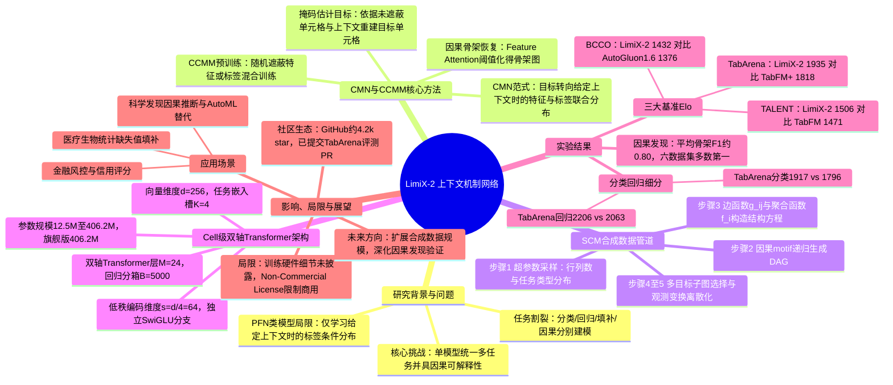

## 一、论文是干什么的？

我们平时打交道最多的数据，其实不是图片和文字，而是像 Excel 表格一样的「结构化数据」——一行是一条记录，一列是一个字段，里面有数字、有类别、也常常有缺了的格子。近几年大语言模型（如 GPT 系列）在文本上大获成功，但表格数据一直没有一个真正通用的「GPT」：银行风控用的是一套模型，医院诊断又要重新训练一套，缺失值填补往往还要单独建模。

LimiX-2 想做的事情，就是给表格数据也造一个「通用大脑」：一个训练好的模型，不用针对具体任务重新训练或微调，只要把新的表格数据当作「上下文」喂给它，它就能同时做分类、回归、缺失值填补，甚至还能猜出哪些列之间存在因果关系（谁影响谁）。这有点像给 Excel 装上了一个像 GPT 一样的「看一眼数据就懂套路」的助手。LimiX-2 是 Stable AI 与清华大学团队「LimiX」系列模型的第二代旗舰版本，前一代 LimiX-1（以及更轻量的 LimiX-2M、LimiX-16M）已经在同类任务上有过尝试，这次的核心卖点是提出了一套新的建模范式，并在三大公开榜单上刷新了纪录。

## 二、核心方法与创新

### 1. 从「猜答案」到「学规律」：Contextual Mechanism Networks（CMN）

过去这类表格基础模型（学术上叫 Prior-Fitted Networks，PFN，TabPFN 是代表作）的训练目标基本都是：给定一批「上下文样本」 $D_{ctx}$（相当于一些已知答案的例子）和一个新样本的特征 $x$，直接预测它的标签 $y$，用公式写就是学习条件概率

$$p(y \mid x, D_{ctx})$$

这种做法只盯着「答案」，不关心数据内部各个变量之间到底是怎么相互产生、相互影响的。LimiX-2 提出的 Contextual Mechanism Networks（CMN，「上下文机制网络」）把目标换成了学习整个数据的联合生成结构：

$$p(x, y \mid D_{ctx})$$

通俗理解：不是死记硬背「这种输入对应那种输出」，而是尝试理解「这些变量之间存在什么样的生成规律（机制）」。理解了机制之后，分类、回归、填缺失值、找因果关系，本质上都只是从这套机制里问不同的问题而已，所以一个模型就能通吃多种任务。

### 2. 训练目标：Context-Conditional Masked Modeling（CCMM）

具体怎么训练模型去学这套「机制」？论文用的方法叫 Context-Conditional Masked Modeling（CCMM，「上下文条件掩码建模」），思路类似于我们熟悉的「完形填空」：把表格里一部分格子（可以是标签，也可以是普通特征）随机遮住，让模型基于「上下文表格」和「本行没被遮住的其它格子」去猜被遮住的值。写成公式就是，对某一行 $i$ 中被遮住的第 $j$ 列，模型要学习估计

$$q_\theta\bigl(x_{i,j} \mid x_{i,-\pi_i},\, X_{ct},\, y_{ct}\bigr)$$

其中 $x_{i,-\pi_i}$ 表示这一行里没被遮住、可以看到的其它特征，$X_{ct}$、$y_{ct}$ 是作为「参考例子」的上下文表格及其标签。训练时会随机组合「遮标签」「遮特征」两种情况混合练习，这样模型既学会了预测任务，也顺带学会了缺失值填补这种「猜格子」的能力，一举两得。

### 3. 训练数据从哪来：结构因果模型（SCM）合成数据

真实世界的表格数据很难大规模收集且带隐私问题，LimiX-2 走的是「合成数据」路线，用结构因果模型（Structural Causal Model, SCM）批量「无中生有」造训练数据，大致分五步：

1. **采样超参数**：随机决定这份合成表格有多少行、多少列（连续型/类别型分别定）、是分类任务还是回归任务，这些数量本身也是从正态分布、均匀分布、Beta 分布等分布族里随机抽的，保证多样性。
2. **生成因果图（DAG）**：通过反复拼接「链式」「共同因」「对撞结构」等基础因果小模块（motif），像搭积木一样递归展开出一张有向无环图，代表变量之间「谁是谁的因」。
3. **给每条因果边装上具体的函数**：每个变量 $X_i$ 的取值由它的「因」变量 $\mathrm{PA}(X_i)$ 通过某种函数计算出来，再加上随机噪声，公式是

   $$X_i = f_i\Bigl(\{\,g_{i,j}(X_j)\,\}_{j \in \mathrm{PA}(X_i)},\ \epsilon_i\Bigr)$$

   这里 $g_{i,j}$ 是「边函数」，可以是多层感知机（MLP）、卷积、决策树、线性映射、核函数、分段函数、周期函数等各种形式的组合；$f_i$ 是把多个「因」的影响汇总起来的聚合方式（简单平均、加权、神经网络聚合等）；$\epsilon_i$ 是随机噪声，模拟现实世界的不确定性。
4. **挑选哪些列当特征、哪些当目标**：用多目标选择机制，尽量让抽出来的训练任务覆盖各种不同的子图结构和统计特性，避免训练数据「偏科」。
5. **给数据「化妆」成更像真实表格**：对数值做随机的缩放、非线性变换、取对数、取指数等操作；对分类变量做随机离散化，并控制每个类别出现的频率，让合成数据看起来更接近真实世界杂乱的表格，而不是过于「干净」的数学函数。

### 4. 架构：按「单元格」而不是按「行」来表示数据

和很多把一整行压缩成一个向量的表格模型不同，LimiX-2 采用「cell 级」（单元格级）表示：表格里每一个格子（某一行某一列的具体值）都会拥有自己的向量表示，然后用一个「双轴 Transformer」分别在「同一行的不同列」和「同一列的不同行」两个方向上做注意力计算，交替进行，这样模型既能看清一行内各个字段的关系，也能看清同一字段在不同样本间的分布规律。论文中给出的具体配置包括：向量维度 $d=256$（比前代 LimiX 的 192、96 更大）、任务嵌入槽位数量 $K=4$、双轴 Transformer 堆叠 $M=24$ 层、回归目标离散化为 $B=5000$ 个分箱、低秩特征编码维度 $s=d/4=64$。特征处理和任务预测分别用独立的注意力模块和 SwiGLU 前馈网络处理，不共享参数。

### 5. 额外的「彩蛋」能力：因果骨架恢复

因为 CMN 范式本身就在学习变量间的生成机制，论文发现模型内部的「特征注意力」（feature attention）权重天然带有因果信息：把每个变量轮流当作预测目标、其余变量当特征输入，注意力分数高的地方往往对应真实的因果连接。对分数设一个阈值筛选，就能从稠密的注意力图里恢复出稀疏的「因果骨架图」（哪些变量之间存在直接因果关系），并用「骨架 F1 分数」和「结构汉明距离（SHD）」两个指标衡量恢复得准不准。

## 三、使用了哪些模型和计算资源？

- **基座情况**：LimiX-2 不是在某个已有的大语言模型或图像模型基础上微调而来，而是一个从零训练的、专为表格数据设计的 Transformer 架构（cell 级双轴注意力，见上文架构细节）。
- **参数规模**：论文在实验中评估了从约 1250 万（12.5M）到约 4.06 亿（406.2M）参数的多个模型规模，正式发布的旗舰版 LimiX-2 使用的是约 4 亿（406.2M）参数版本；此外家族里还有更轻量的 LimiX-2M（约 200 万参数）和 LimiX-16M（约 1600 万参数），但那是同系列的独立模型（不同论文），并非本文讨论的 LimiX-2 本体，容易和名字混淆，需要注意区分。
- **训练数据规模**：训练语料全部来自前述结构因果模型合成生成，论文强调这类数据「可以按需无限扩展」，但没有给出具体合成了多少张表格或多少个 token。
- **GPU 型号、数量、训练时长**：论文全文（包括正文与附录）**均未披露**具体使用了哪种型号、多少块 GPU，也没有给出训练所花费的具体时间，这部分论文中未明确说明。
- **推理端信息**：根据其 Hugging Face 模型卡片，推理代码基于 PyTorch（示例环境为 torch 2.9.1、Python 3.12 及以上），支持 CUDA 加速、FlashAttention 优化以及混合精度和自动分批（autobatching），CPU 上也可以运行但速度会慢很多。

## 四、实验结果

论文把 LimiX-2 拿到三个不同性质的公开表格数据基准上做对比，评估方式统一采用类似棋类比赛的 Elo 分数（分数越高代表综合战胜其它模型的能力越强），对比对象包括 XGBoost、CatBoost、AutoGluon 1.6，以及 TabPFN、TabFM 等其它表格基础模型。

| 基准测试 | 侧重点 | LimiX-2 得分 | 第二名 | 差距情况 |
|---|---|---|---|---|
| TabArena | 综合分类与回归任务榜单 | Elo 1935 | TabFM+ 得 1818 | 平均名次 5.5，明显领先 |
| TALENT | 大规模表格学习基准 | Elo 1506 | TabFM 得 1471 | 相对提升空间比对手更小（6.75% 对比 9.17%），说明离理论上限更近 |
| BCCO | 综合胜率对比基准 | Elo 1432，聚合获胜次数 50.4 | AutoGluon 1.6 得 1376，获胜次数 24.5 | 获胜次数接近对手的两倍 |

细分到分类和回归任务上，LimiX-2 在 TabArena 的分类子榜上拿到 1917 分（对手 TabFM+ 为 1796 分），回归子榜拿到 2206 分（对手为 2063 分）；在 TALENT 上分类拿到 1475 分、回归拿到 1584 分，同样保持领先。

另外在因果骨架恢复的实验中，LimiX-2 在多个数据集上取得了平均约 0.80 的骨架 F1 分数，并在多数测试数据集上排名第一，说明它不仅预测准，模型内部学到的「变量关系」也确实和真实的因果结构对得上。

用大白话总结：无论是「预测得准不准」还是「猜出来的变量因果关系对不对」，LimiX-2 在论文测试的这几套公开榜单上都比此前最好的表格模型和 AutoML 工具（AutoGluon）表现更好，而且是**同一个模型**不用改动就能应付这些不同类型的任务。

## 五、潜在应用与已落地应用

**潜在应用方向：**
- 金融风控、信用评分等需要处理大量结构化表格且样本类别不平衡的场景；
- 医疗、生物统计中常见的「样本少、字段多、还带缺失值」的表格数据分析与缺失值填补；
- 科学发现、社会科学研究中需要从观测数据反推变量间因果关系的场景（因果骨架恢复功能）；
- 企业内部报表、运营数据分析中「一个模型多任务复用」，减少针对每张新表都重新训练模型的工程成本；
- 作为 AutoML 工具的替代或补充，在不需要人工调参、不需要针对新数据集重新训练的情况下直接给出预测。

**已落地/已知进展：**
- 模型权重与推理代码已经在 [GitHub](https://github.com/limix-ldm-ai/LimiX)（截至综述撰写时约 4.2k star）、[Hugging Face](https://huggingface.co/stable-ai/LimiX-2) 与 ModelScope 上开源发布，供社区直接下载使用；
- 已有开发者向知名表格模型评测榜单 TabArena 的官方代码库提交了将 LimiX-2 接入榜单的 Pull Request（如 [PR #574](https://github.com/autogluon/tabarena/pull/574) 和 [PR #575](https://github.com/autogluon/tabarena/pull/575)），意味着 LimiX-2 已经开始被第三方评测体系正式收录对比；
- 目前主要仍处于研究与评测阶段，论文中未提及已经在具体商业产品或生产系统中部署的案例；权重许可为「非商业许可（Non-Commercial License）」，商业化落地存在授权限制。

## 六、网络上的讨论与评价

- 这篇论文在 Hugging Face Papers 页面获得了 126 个投票，说明在论文发布社区中关注度不低；
- 科技媒体 Pandaily 对 LimiX-2 的发布做了专门报道，介绍其为 Stable AI 与清华大学彭岑（Peng Cui）团队联合推出的结构化数据基础模型；
- 在 GitHub 上，AutoGluon 团队维护的 TabArena 评测仓库收到了社区提交的、把 LimiX-2 接入官方排行榜的 Pull Request，属于比较实质性的社区技术验证行为；
- 需要特别提醒读者注意一个容易混淆的地方：搜索时会发现另一篇标题相近的论文和一条 Hacker News 上的「Show HN」帖子，讨论的是「LimiX-2M」（一个仅约 200 万参数、专注于「用更小体积达到不错效果」的轻量表格模型，对应另一篇 arXiv 论文 2606.04485），这与本综述介绍的、约 4 亿参数的旗舰模型「LimiX-2」（arXiv 2609.17488）**是同系列下的两个不同东西**，本综述未发现专门针对本文所述的旗舰版 LimiX-2 的 Hacker News 或 Reddit 深度讨论帖，如实说明。

## 七、思维导图

