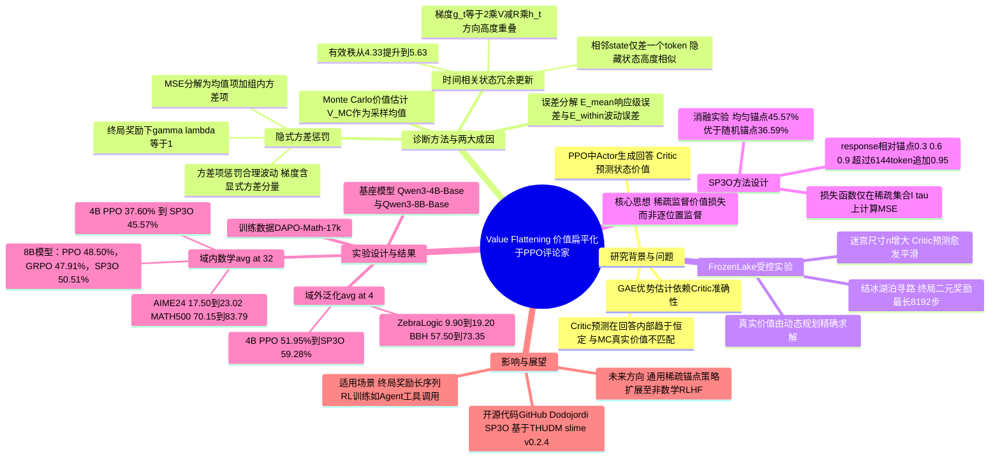

## 一、论文是干什么的？

现在训练像 Qwen 这样能做数学推理的大模型，很流行用一种叫 PPO（Proximal Policy Optimization，近端策略优化）的强化学习算法。PPO 里有两个角色：一个是"演员"（policy，负责生成回答），一个是"评论家"（critic，也叫价值函数，负责在演员写到一半的时候就预判"照这个写法接下来大概率能不能拿高分"）。评论家判断得越准，演员就能越快学到该往哪个方向改进。

这篇论文发现，实践中这个"评论家"经常出现一个隐蔽却影响很大的毛病，作者把它叫作**价值扁平化**（Value Flattening）。可以这样类比：假设你要预测一只股票在一天内每一分钟的价格走势，真实价格其实有涨有跌、波动明显；但你训练出来的预测模型不管什么时候问它，给出的曲线几乎都是一条几乎不动的直线，只是这条直线的整体高度会随大盘涨跌而微调。放到大模型写一段推理过程上，就是：模型写到第 10 个词、第 50 个词、第 200 个词时，这些"半成品"的真实成功概率其实差异很大（比如刚开始蒙对方向和已经算错了方向，成功率应该天差地别），但评论家给出的预测值几乎都差不多、扁平成一条线，完全体现不出这种起伏。这样一来，演员从评论家那里得到的"哪里该改进"的信号就变得又粗又糙，学习效率大打折扣。

论文的贡献分三步：第一，用实验证据把"价值扁平化"这个现象严格地定义、测量出来；第二，从数学上分析出它产生的两个根本原因；第三，针对这两个原因设计了一种简单的修正方法，叫 $\mathrm{SP}^3\mathrm{O}$（Sparse Proximal Policy Optimization，稀疏近端策略优化），并在真实的大模型（Qwen3-Base 系列）数学推理训练中验证了效果。

## 二、核心方法与创新

### 2.1 怎么发现并量化"价值扁平化"

评论家预测得准不准，总要有一个"标准答案"作对比。论文用的标准答案是蒙特卡洛（Monte Carlo）估计：对回答里的某个中间位置 $s_t$，让当前的演员从这里往后反复生成很多次（多次独立续写 $\tau_t^{(k)}$），把这些续写最终拿到的奖励 $G_t^{(k)}$ 取平均，就得到这个位置"真实"应有的价值：

$$\hat{V}^{\pi}_{\mathrm{MC}}(s_t) = \frac{1}{K}\sum_{k=1}^{K} G_t^{(k)}$$

拿这个"真实值"和评论家自己给出的预测值逐位置对比，论文把整体误差拆成两部分（对应论文中的公式 11）：一部分是"整条回答平均水平上的误差"（$\mathcal{E}_{\mathrm{mean}}$，即评论家整体是不是猜高了或猜低了），另一部分是"同一条回答内部，位置与位置之间波动形态的误差"（$\mathcal{E}_{\mathrm{within}}$，即评论家有没有把该起伏的地方也预测出起伏）。作者发现，真正拖累训练的主要是后者：把相邻位置的价值变化画成散点图，蒙特卡洛真实值的变化幅度分布很广（有涨有跌），但评论家自己预测值的变化幅度几乎都挤在零附近，完全没有跟着真实值走对角线。这就是"价值扁平化"被量化观测到的样子。

### 2.2 FrozenLake 受控实验：排除大模型的干扰因素

大模型场景太复杂，为了确认"价值扁平化"不是某种和语言、和 Transformer 结构绑定的偶然现象，作者专门设计了一个简单到可以算出精确答案的对照实验：经典强化学习环境 FrozenLake（结冰的湖面寻路游戏）。智能体要在一个有"洞"的方格地图上从起点走到终点，掉进洞里或超过最长 8192 步都算失败，只有真正走到终点才拿到奖励 1，其余情况奖励 0。因为地图是有限、离散的，每个格子"最终能走到终点的概率"是可以用动态规划精确算出来的，相当于有了"上帝视角"的标准答案。

实验里逐步把地图尺寸 $n$ 调大（也就是拉长了从起点到终点需要走的步数），其他训练设置保持不变，结果发现：地图越大，评论家在各个格子上给出的价值预测就越"糊"、越趋于平滑，和精确算出来的真实概率之间的局部对比度（相邻格子该有的差异）越来越差，一致性也越来越差。这说明价值扁平化会随着"决策序列变长、奖励只在最后才出现"这种结构而系统性地恶化，和具体用的是不是语言模型无关，是这一类强化学习问题本身的通病。

### 2.3 两个根本原因

**原因一：隐式方差惩罚。** 在大模型的 RLHF 训练里很常见的设定是"只在回答生成完毕时给一次奖励"（中间过程没有奖励），并且常用 $\gamma=\lambda=1$（不对未来做折扣）。在这种设定下，同一条回答里，从任何一个中间位置 $t$ 算起，回报目标其实都退化成了同一个终局奖励 $R$。于是评论家在一整条回答上的均方误差损失可以做如下代数展开（对应论文公式 5）：

$$\frac{1}{T}\sum_{t=1}^{T}(v_t - R)^2 = (\bar{v} - R)^2 + \frac{1}{T}\sum_{t=1}^{T}(v_t - \bar{v})^2$$

等式左边是我们平时以为在优化的"预测准不准"，但把它拆开后会发现，它其实同时等于两项之和：第一项是"整条回答的平均预测值离终局奖励有多远"（这是我们想要的），第二项却是"这条回答内部各位置预测值之间的方差"。也就是说，只要用同一个终局奖励去监督整条回答里的每一个位置，损失函数里就会**隐含地**惩罚评论家在同一条回答内部给出任何波动——哪怕这种波动本该存在（比如快写错的时候价值理应下降）。这不是有人故意加的正则项，而是"每个位置共用同一个目标"这个训练设定本身，在数学上自动附赠的副作用，论文称之为"隐式方差惩罚"。对梯度做展开（论文公式 17）也能看到，更新方向里明确含有"压低组内方差"的分量。

**原因二：时间相关状态的冗余更新。** 大模型生成的相邻位置 $s_t$ 和 $s_{t+1}$ 只差一个新词，两者对应的隐藏状态 $h_t$、$h_{t+1}$ 几乎一样，尤其是在训练早中期。评论家某个位置的梯度大致是 $g_t = 2(V_\phi(s_t) - R)\,h_t$，既然相邻位置的 $h_t$ 高度相似、和终局奖励的差距也相近，那么相邻位置产生的梯度方向也高度相似。论文观测到，隐藏状态相似度、梯度相似度、"更新能量"在整个训练过程中都保持在很高水平（论文图 3），说明模型实际上是在一遍遍重复施加几乎同一个方向的更新，而不是分别学习每个位置应有的差异化价值。这些冗余更新进一步把评论家往"整条回答一个值"的方向拉平。论文用"有效秩"（effective rank）衡量更新方向的多样性，改用稀疏监督后，梯度更新的中位有效秩从 4.33 提高到了 5.63，说明更新方向变得更多样、冗余更少了。

### 2.4 解决方案：$\mathrm{SP}^3\mathrm{O}$

既然病根是"每个位置都用同一个终局目标去算损失"，最直接的药方就是**别在每个位置都算损失**。$\mathrm{SP}^3\mathrm{O}$（Sparse Proximal Policy Optimization）的做法是：一条回答里只挑出少数几个、彼此拉开距离的位置去计算价值函数的均方误差损失，其余位置的价值损失直接不计入训练：

$$\mathcal{L}_v^{\mathrm{SP}^3\mathrm{O}}(\phi) = \frac{1}{\sum_{\tau\in\mathcal{B}}|\mathcal{I}(\tau)|}\sum_{\tau\in\mathcal{B}}\sum_{t\in\mathcal{I}(\tau)}\left(V_\phi(s_t) - \hat{G}_t\right)^2$$

这里 $\mathcal{I}(\tau)$ 就是每条回答里被选中用来算损失的稀疏位置集合。论文默认的取法很简单：按回答长度的相对位置，取 30%、60%、90% 这三个点；如果回答特别长（超过 6144 个词），再多加一个 95% 的点。

这个改动同时打中了前面两个病根：第一，方差惩罚只会作用在这几个稀疏点之间，而不是强迫整条回答从头到尾都趋于同一个值，位置之间该有的合理起伏就不会被强行抹平；第二，因为这几个锚点在序列里离得很远，它们对应的隐藏状态天然差异更大，梯度也就不再高度重叠，减少了"同一个更新反复做很多遍"的浪费，让每次更新携带的信息更丰富。论文的消融实验也验证了"稀疏点该怎么选"很重要：固定在 30%/60%/90% 这种均匀分散的位置，效果明显好于随机挑三个位置（在 Qwen3-4B 上分别是 44.65% 对 36.59%），说明关键不只是"少算几个点"，而是要让这几个点足够分散。

## 三、使用了哪些模型和计算资源？

**基座模型：** 论文在 Qwen3-4B-Base 和 Qwen3-8B-Base 两个规模上做了强化学习训练实验（均为未经指令微调的预训练基座版本），训练数据用的是 DAPO-Math-17k 数学题数据集。训练超参数方面，论文给出了 rollout 批大小 64×8=512、演员学习率 $1\times10^{-6}$、评论家学习率 $4\times10^{-6}$、单条回答最长 8192 个 token、采样温度 1.0。

**GPU 型号与数量、训练耗时：** 论文正文中没有给出任何 GPU 型号、GPU 数量或训练所用小时数/天数等信息，检索全文也未发现相关表格或描述——这部分**论文中未明确说明**。公开代码仓库（GitHub 上的 `Dodojordi/SP3O`）的使用文档中提到跑 Qwen3-4B-Base 基线实验的快速上手示例用到了"八张 GPU"，但这只是仓库的示例配置说明，并非论文正文披露的实验硬件规格，因此不能直接当作论文实际实验所用的硬件资源来引用。

## 四、实验结果

论文在数学推理任务上对比了三种训练方式：普通 PPO、GRPO（另一种流行的强化学习算法，不需要单独的评论家）、以及本文提出的 $\mathrm{SP}^3\mathrm{O}$。

**域内数学题（avg@32，即每题采样 32 次取平均正确率）：**

| 模型 | PPO | GRPO | $\mathrm{SP}^3\mathrm{O}$ |
|---|---|---|---|
| Qwen3-4B-Base | 37.60% | 39.26% | **45.57%** |
| Qwen3-8B-Base | 48.50% | 47.91% | **50.51%** |

在 Qwen3-4B-Base 上具体细分基准：AIME24 从 17.50% 提升到 23.02%；MATH500 从 70.15% 提升到 83.79%；OlympiadBench 从 36.35% 提升到 48.68%。也就是说，仅仅改变价值损失的计算方式（只监督 3 个稀疏点），就让 4B 模型的平均正确率比普通 PPO 高出近 8 个百分点，8B 模型也有约 2 个百分点的提升。

**跳出训练分布的推理能力（avg@4，用来检验模型有没有学到能泛化的推理能力，而不只是在训练题型上死记硬背）：**

Qwen3-4B-Base 上，PPO 是 51.95%，$\mathrm{SP}^3\mathrm{O}$ 达到 59.28%，提升 7.33 个百分点。其中逻辑推理基准 ZebraLogic 从 9.90% 大幅提升到 19.20%（接近翻倍）；综合推理基准 BBH 从 57.50% 提升到 73.35%；AGIEval 从 65.87% 提升到 71.44%。

整体来看，$\mathrm{SP}^3\mathrm{O}$ 不仅在训练所用的数学题类型上表现更好，在完全没训练过的逻辑推理、综合推理任务上提升幅度反而更大，说明修复"价值扁平化"带来的不只是分数好看，而是让模型学到了更本质、更容易迁移的推理能力。

## 五、潜在应用与已落地应用

**潜在应用方向：** 这篇论文针对的"终局奖励、序列很长、相邻状态高度相似"这种训练结构，并不只出现在数学推理里。任何用 PPO 训练大模型完成长链条任务的场景都可能碰到同样的价值扁平化问题，比如代码生成与调试、多轮工具调用的智能体（agent）训练、需要多步规划的对话系统等。理论上，只要奖励是"整个过程结束才给一次"的强化学习训练，都可以尝试用类似 $\mathrm{SP}^3\mathrm{O}$ 这种"只在稀疏关键点监督价值函数"的思路来提升训练效率和稳定性。

**已落地应用：** 这是一篇 2026 年 9 月刚发布的研究论文，作者在 GitHub（`Dodojordi/SP3O`）公开了代码，并给出了项目主页，代码基于已有的 THUDM/slime 强化学习训练框架（v0.2.4）搭建。但目前没有证据显示该方法已经被应用到具体的商业产品或对外发布的大模型正式训练流程中，应视为仍处于学术研究和开源验证阶段。

## 六、网络上的讨论与评价

该论文在 HuggingFace Papers 页面获得了 61 个点赞（upvotes），热度不低，但截至综述撰写时，页面本身未见到实质性的讨论评论内容。通过网络搜索，除了 arXiv 官方页面、Papers with Code 之类的论文信息聚合站点自动生成的条目外，未能找到 Reddit、X（Twitter）、知乎等社区上针对本文的实质讨论帖或专门的技术解读文章。因此这方面的网络讨论情况**论文之外暂未找到相关公开评价**，仅能确认其在 HuggingFace 上获得了较高的点赞热度。

## 七、思维导图

