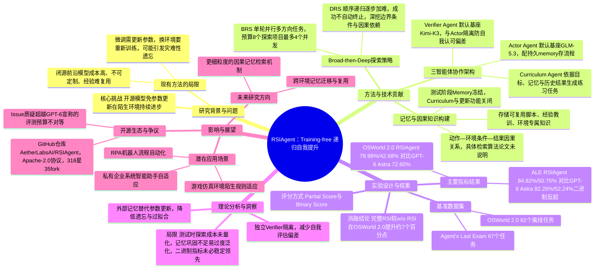

## 一、论文是干什么的？

现在很多 AI 智能体（Agent）需要在电脑桌面、操作系统这类"数字环境"里完成任务，比如自动点菜单、填表格、操作陌生软件。问题是：这些智能体一旦被扔进一个从没见过的新环境（比如换了一套完全陌生的操作系统界面），常常会手足无措——不知道某个按钮点了会发生什么，不知道哪些操作有隐藏的限制。

传统的解决办法是**微调（fine-tuning）**：拿这个新环境里的数据去重新训练模型，调整它内部成千上万亿个参数的数值。这就像是给一个人做"脑内芯片重编程"手术——效果可能不错，但成本高、耗费大量 GPU 算力，而且换一个新环境往往就要重新做一次手术，还可能让模型在其他任务上的能力变差（这种副作用在业内被称为"灾难性遗忘"）。

这篇论文提出的 RSIAgent 换了一种思路：**完全不碰模型参数**，而是让几个智能体分工合作，先在新环境里"到处逛一逛、试一试"，把摸索出来的经验（比如"这个按钮点了会跳出一个确认框，必须先点确认才能继续"）写进一本外部的"记忆笔记本"。等真正开始做任务时，模型直接翻这本笔记本查经验，而不是重新洗一次脑。论文用一个形象的说法概括这个过程：**递归自我提升（Recursive Self-improvement）**——通过不断探索、验证、记笔记，一轮一轮地把这本笔记本越写越厚、越写越准。

## 二、核心方法与创新

### 训练式微调 vs 记笔记式适应

为了理解 RSIAgent 的"training-free（训练无关）"到底特殊在哪，可以做这样一个类比：

- **微调式适应**：好比一个人搬到新城市后，直接做脑部手术，让自己"天生"就认得当地的路——需要专业设备（GPU 算力）、需要大量训练素材、手术还有风险（可能影响其他记忆功能），换个城市往往还要再做一次。
- **RSIAgent 的记笔记式适应**：好比新员工入职后，先花几天时间到处走走、把"哪个门锁着""哪条路是单行道""哪个流程必须先审批"这些经验记在一个笔记本里。上岗后遇到类似情况，直接翻笔记本查答案，大脑（也就是大模型本身）完全不用做任何手术，笔记本换个人也能直接用。

这正是论文强调的重点：探索阶段积累的记忆最终会被"冻结"，可以直接提供给别的任务复用，全程不需要更新模型参数。

### 三个智能体的分工

RSIAgent 由三个角色组成，各司其职：

- **课程智能体（Curriculum Agent）**：相当于"出题老师"，扮演系统的高层协调者。它根据总体目标、已经积累的记忆和之前的执行结果，决定接下来应该让系统去练习哪些任务。
- **执行智能体（Actor Agent）**：相当于"做题的人"，负责理解环境、生成具体的操作动作，并配有一本持久记忆，用来存放这个环境特有的知识和可复用的操作流程。
- **验证智能体（Verifier Agent）**：相当于"独立阅卷老师"，专门检查执行结果是否真的达到了任务要求，它会直接查看环境反馈（比如执行结果、界面状态），并且刻意与执行智能体相互隔离，避免"运动员兼裁判"式的自我认可偏差。

三者构成一个循环：课程智能体出题 → 执行智能体做题 → 验证智能体判卷 → 结果写入记忆 → 课程智能体根据新记忆再出下一题。

### "广泛探索再深入探索"（Broad-then-Deep）策略

论文把探索过程分成两个阶段：

- **广泛递归自我探索（BRS）**：像地毯式扫街，课程智能体在每一轮里一次性提出多个方向各不相同的练习任务，并行执行和验证。论文里设定的具体参数是"名义预算 8 个探索项目，最多 4 个并发执行"。这一阶段的目标是尽快摸清环境的整体轮廓，找出哪些地方还是"知识盲区"。
- **深度递归自我探索（DRS）**：像是反复琢磨某一个难点，这一阶段变成顺序进行的递归循环，逐步提高练习难度。论文特别强调："练习成功了并不会自动让探索停下来"——课程智能体会检视验证结果，自行判断是否还有必要继续深挖同一个方向，专门去找隐藏的边界条件、约束条件，以及此前没被发现的因果依赖关系。

每当验证智能体确认一次经验有效，这条经验就会立刻被并入记忆，然后课程智能体才会决定下一步探索什么方向，如此循环，这就是"递归"二字的由来。

### 记忆机制：因果关系笔记本

论文提到，记忆中保存的是"环境特定知识、可复用的操作流程和脚本、以及从历史执行中总结的经验教训"，其中包含"动作—环境条件—结果"之间可复用的因果关系。不过需要如实说明：**论文正文和附录都没有给出记忆的具体数据结构（是不是 JSON、纯文本还是别的格式）、也没有说明因果三元组具体如何编码，以及执行智能体在做任务时是用什么检索算法从记忆里把相关经验找出来的**，这些实现细节论文中未明确说明。

到了真正做任务（测试阶段）的时候，累积下来的记忆会被冻结，只提供给执行智能体使用；课程智能体和记忆更新功能这时会被关闭——相当于"记笔记的阶段结束了，考试时只能看笔记，不能再往上添内容"。

## 三、使用了哪些模型和计算资源？

**作为被增强对象的开源基座模型：**
- GLM-5.3——论文中默认作为执行智能体（Actor Agent）的基座
- Kimi-K3——论文中默认作为验证智能体（Verifier Agent）和课程智能体（Curriculum Agent）的基座

**用于对比的闭源基线模型：** GPT-6 Astra、Claude Opus 5、Claude Fable 5、Muse Spark 1.3

**用于对比的开源基线模型：** Kimi-K2.6、DeepSeek V4 Pro、Qwen3.8-Max

**计算资源：** 论文正文和附录都**没有披露**具体使用了哪些 GPU 型号、多少张卡，也没有给出 API 调用成本或每次探索/rollout 消耗的具体时间。作者只在讨论局限性时承认"RSI 需要额外的测试时探索和练习，这可能引入不小的计算成本"，但没有给出量化数字。

不过论文对应的开源代码仓库（`AetherLabsAI/RSIAgent`）透露了一些运行环境的侧面信息：需要 Python 3.12、Linux 主机并配备 Docker 和 `/dev/kvm` 虚拟化权限、157 GiB 到 324 GiB 的存储空间（取决于跑哪个基准测试），并通过 OpenRouter 的 API 密钥调用大模型。这说明实际实验很可能是按次计费调用云端 API 完成的，而不是自建 GPU 集群做参数训练——这与"training-free"的设计思路是一致的，但论文本身并未给出这部分资源开销和费用的具体数字。

## 四、实验结果

论文在两个基准测试上做了评估，每个基准都用两种打分方式：**部分分**（Partial Score，类似按步骤给分）和**二进制分（Binary Score，必须全部做对才算通过，类似及格/不及格）**。

**OSWorld 2.0（82 个离线任务）：**

| 方法 | 部分分 | 二进制分 |
|---|---|---|
| RSIAgent（不做递归自我提升） | 71.97% | 37.80% |
| **RSIAgent（完整版）** | **78.98%** | **42.68%** |
| GPT-6 Astra | 72.60% | 未披露 |
| Claude Opus 5 | 70.19% | 34.72% |

**Agent's Last Exam（67 个任务）：**

| 方法 | 部分分 | 二进制分 |
|---|---|---|
| RSIAgent（不做递归自我提升） | 83.75% | 49.25% |
| **RSIAgent（完整版）** | **84.82%** | **50.75%** |
| GPT-6 Astra | 82.26% | 52.24% |
| Claude Opus 5 | 79.54% | 46.27% |

简单来说：在 OSWorld 2.0 上，用 GLM-5.3 和 Kimi-K3 搭配 RSIAgent 框架后，部分分比 GPT-6 Astra 高出约 6.38 个百分点，比 Claude Opus 5 也更高；在 Agent's Last Exam 上，部分分比 GPT-6 Astra 高出约 2.56 个百分点。

需要客观指出的一点是：在 Agent's Last Exam 上，RSIAgent 的**二进制分（50.75%）其实低于 GPT-6 Astra 的二进制分（52.24%）**，也就是说如果按"必须全部做对才算通过"的严格标准，GPT-6 Astra 在这个基准上仍然领先。论文主要用部分分来展示自己的优势，这一点在解读结果时需要留意。

另外，对比"不做递归自我提升"和"完整版 RSIAgent"两行数据可以看出，探索—验证—记忆积累这一整套流程确实带来了实打实的提升（OSWorld 2.0 上部分分提升了约 7 个百分点），说明改进主要来自这套自主探索机制，而不只是模型本身更强。

## 五、潜在应用与已落地应用

**潜在应用方向：**
- 电脑/手机自动化操作助手（比如自动完成办公软件里的重复性任务）
- 企业内部私有系统的智能适配——很多公司有自己定制的内部系统，通用大模型往往不熟悉，RSIAgent 这类"先探索再记笔记"的方案可以让智能体快速上手，而不需要为每套内部系统单独训练模型
- RPA（机器人流程自动化）场景中，帮助机器人适应界面频繁更新的软件
- 游戏或仿真环境中，智能体需要适应陌生地图或规则时的自适应能力

**已落地情况：** 目前这项工作仍处于研究和开源代码阶段（GitHub 仓库 `AetherLabsAI/RSIAgent`，采用 Apache 2.0 协议开源），尚未检索到被集成进商业产品的公开报道。论文在 HuggingFace 上获得 71 票，代码仓库开源不久也已获得三百余颗星，说明社区关注度不低，但截至综述撰写时还没有发现落地到具体商业产品的案例。

## 六、网络上的讨论与评价

- 论文合著者 Biwei Huang 在 X（原 Twitter）上发帖介绍了这项工作，称"能否让智能体探索一个新环境、学习其中的因果结构，并且在不更新模型权重的情况下持续进步？"，并表示使用 Kimi-K3 和 GLM-5.3 作为基座模型时，RSIAgent 的表现超过了包括 GPT-6 在内的一些前沿闭源模型。

- 代码已经在 [GitHub](https://github.com/AetherLabsAI/RSIAgent) 开源，采用 Apache 2.0 协议，截至综述撰写时有 318 颗星、35 次 fork。项目还提供了配套的[项目主页](https://aetherlabsai.github.io/RSIAgent/)。

- 值得关注的是仓库里的一条质疑：GitHub Issue #5（标题为"Unmatched evaluation does not support the public 'outperforms GPT-6' claim'"，即"不对等的评测无法支撑对外宣称的'超越 GPT-6'"）指出，RSIAgent 在测试中获得了额外的探索和"反复练习"机会，而作为对比的基线模型却是"预算不设上限"的跑法，双方在交互次数和资源投入上并不对等；该用户还提到，作者自己内部的报告其实承认了"预算和评测协议不完全匹配"，但对外宣传时省略了这个前提，并要求作者提供一个"用相同预算隔离出递归课程/记忆机制本身带来多少收益（而不是单纯靠更多交互次数）"的对照实验。截至综述撰写时，这个 issue 仍处于未获回复的开放状态。

- 仓库里的 Pull Request #1（已于 2026 年 9 月 15 日合并）修复了两个工程问题：一是 OSWorld 各探索阶段缺失用户模拟器的路由绑定，二是评测框架里基于文本的检测机制把正常的应用路径记录、任务说明文本误判成异常（false positive）。这类修复从侧面说明该评测代码框架在刚开源时还不够成熟，需要社区协作打磨。

- Issue #2 中有用户询问 RSIAgent 是否提供"codex harness"（即是否兼容类似 Codex 一类编程智能体的评测框架），但未见到维护者的正式回复记录。

## 七、思维导图

