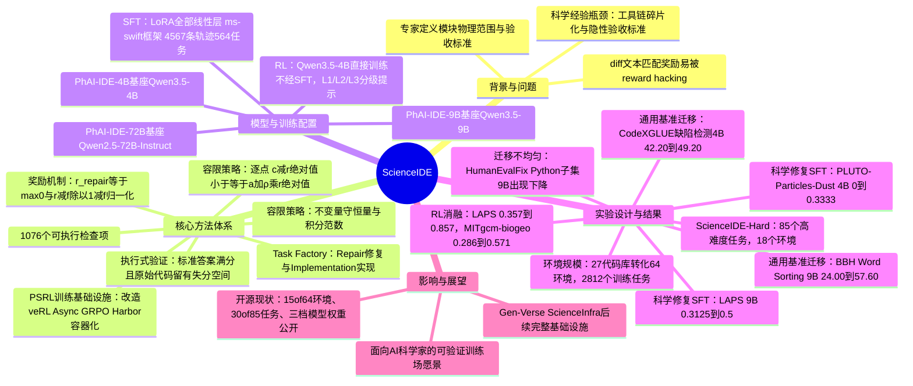

## 一、论文是干什么的？

全世界的科学家写了几十年的科研代码：模拟星系怎么演化的天体物理程序、模拟海洋洋流的海洋模型、模拟等离子体的物理引擎……这些代码里藏着大量专业知识，但它们几乎没法直接拿来训练 AI 智能体。原因很朴素：这些代码库的编译环境五花八门，跑起来经常要装一堆冷门依赖；判断一次修改「对不对」也不像判断数学题答案对不对那么简单——要看数值是否落在物理上合理的误差范围内，要看能量、质量这些「守恒量」有没有被破坏，这些验收标准往往只存在于领域专家的脑子里，从没写成任何机器能读的规则。论文把这个难题起名叫**科学经验瓶颈**（scientific experience bottleneck）：科学代码里明明有海量的「经验」，却没法转换成 AI 能学习的可靠训练素材。

ScienceIDE 要解决的就是这件事。可以把它类比成：市面上有很多物理实验室的操作手册（科研代码），但从来没人把它们改造成可以真人上手做、还能自动判卷的实验课。ScienceIDE 做的事情，就是找一批领域专家，把这些代码库改造成一个个「容器化的实验室」——AI 智能体拿到一段代码和一个任务描述，动手改代码，系统会自动重新编译、重新跑一遍物理模拟，把结果和标准答案在数值上比对，比对通过才算真的做对了，而不是简单看代码改得像不像参考答案。基于这套改造出来的环境，团队训练出了三个不同大小的模型：PhAI-IDE-72B、PhAI-IDE-9B、PhAI-IDE-4B。

## 二、核心方法与创新

**1. 专家定义的科学案例与验收标准（Expert-defined Scientific Cases）**

要把一份科研代码变成能自动判卷的「考场」，第一步是请领域专家划出代码库里每个模块负责的物理范围，然后把这个模块官方自带的单元测试、回归测试、示例问题都收集起来，每一条都标注好它属于哪个模块。接着定义两类**容限策略**（tolerance policy）来判断数值答案对不对：
- 逐点策略：$|c-r|\le a+\rho|r|$，即计算值 $c$ 和参考值 $r$ 之间的误差不能超过一个「绝对误差 $a$ 加相对误差 $\rho|r|$」的容忍范围；
- 不变量策略：专门用来检查能量、质量等守恒量，以及分布、积分范数这类整体性质有没有被破坏。

这些容限阈值本身也不是随便拍脑袋定的，而是用「标准初始条件」和「加了扰动的初始条件」都跑一遍去自我验证，摸出一个合理的容限下限。论文提到，这样一套流程最终沉淀出了 1,076 个可执行的检查项，用来核对数值输出和物理不变量是否正确。

**2. 任务工厂（Task Factory）：怎么批量造题**

有了验收标准之后，还需要大量「习题」。ScienceIDE 的做法是让 AI 智能体先提议一批「语义编辑位点」（也就是代码里可以做手脚的地方），专家负责审核这些位点在物理意义上是否合理、是否等价，审核通过后，用确定性程序把这些规则展开成一批批候选任务，主要分两类：
- **修复任务（Repair）**：往一份「钉死不动」的官方原版代码里注入一个语义级别的错误，智能体要找出问题并修好，让代码的物理测试用例重新跑通；标准答案就是这次注入操作的精确逆操作。
- **实现任务（Implementation）**：把某个函数/例程的核心逻辑挖空，智能体要重新把它实现出来，让整个求解器重新得出原来该有的结果。

每一道候选题在正式收录前都要过一道**执行式验证**：官方标准答案代入进去必须得满分（1.0），没修的原始代码必须留有明显的「答错」空间（不能本来就是满分，否则出不了区分度），而且提供给智能体的容器镜像里绝对不能夹带任何答案线索。

**3. 打分机制：让「蒙混过关」变得很难**

奖励不是看智能体改的代码和标准答案的文字差异（diff）像不像，而是看重新跑出来的物理模拟数值对不对。具体地，先算出一次尝试在所有物理测试用例上的平均分 $r$，再用公式

$$r_{\mathrm{repair}} = \max\!\left(0, \frac{r-f}{1-f}\right)$$

做归一化，其中 $f$ 是「完全不修改原始代码」时能拿到的基础分。这样一来，什么都不做的智能体永远得零分，真正把物理结果修对了才能拿到接近满分的奖励，这就比单纯比对代码文本更难被「投机取巧」蒙混过去。

**4. 训练基础设施：PSRL**

强化学习部分跑在一个叫 **PSRL** 的训练后端上，它是对开源框架 veRL 的改造版本，核心思路是用一个「参数服务器」把生成数据（rollout）、算奖励、更新模型这三件事解耦开，让生成和训练可以异步进行、只要求模型版本之间的「陈旧程度」在一定范围内即可，不必严格同步等待。这样做的好处是：接入一个跑在独立容器里、通过 OpenAI 兼容接口通信的「黑箱」智能体，几乎不用改动框架本身的代码——ScienceIDE 只需要提供一个智能体循环和一个奖励函数，通过配置注册进去就行。每一次任务执行都被包装成 [Harbor](https://github.com/laude-institute/harbor) 项目定义的容器化 episode。

## 三、使用了哪些模型和计算资源？

**基座模型：** 论文明确写道三个模型分别在以下基座上微调而来：
- PhAI-IDE-4B 基于 Qwen3.5-4B
- PhAI-IDE-9B 基于 Qwen3.5-9B
- PhAI-IDE-72B 基于 Qwen2.5-72B-Instruct

需要提醒读者注意一点不太对称的地方：4B 和 9B 用的是 Qwen3.5 系列基座，72B 却用的是上一代的 Qwen2.5-72B-Instruct，论文正文中没有解释这个选择的原因（比较合理的猜测是当时还没有对应规模的 Qwen3.5-72B 版本可用，但这只是推测，不是论文自己说的）。

**训练数据与方法：**
- 训练用的「演示轨迹」（demonstrations）共 4,567 条，来自 564 个任务；另有 544 条轨迹、来自 81 个任务的验证集。这些轨迹是用一个论文中称为 "GPT-5.6-sol" 的强力求解模型生成、再经过执行验证筛选后得到的（这个模型名称在论文里就是这样写的，具体是什么产品目前没有更多资料佐证，如实转述）。
- **监督微调（SFT）**：用 LoRA 方式微调所有线性层，训练框架是 [ms-swift](https://github.com/modelscope/ms-swift)，GitHub 仓库中的 SFT 说明文档确认了这一流程（工具轨迹 JSONL → 数据与标签检查 → LoRA 训练 → 适配器权重）。
- **强化学习（RL）**：以 Qwen3.5-4B 为起点、不经过 SFT 直接做强化学习，采用多轮 episode 加上分级提示（论文里叫 L1/L2/L3 三档提示强度），算法是异步 GRPO（Group Relative Policy Optimization），跑在前面提到的 PSRL 框架上。

**计算资源：** 论文正文和 GitHub 仓库均未透露具体使用了哪种型号的 GPU（例如 A100、H100 等），这一点在原文和代码仓库里都没有明确说明。GitHub 上公开的 RL 训练示例配置里提到，一次典型的强化学习训练用了「3 个节点，其中 8 张卡负责生成、16 张卡负责训练」，合计约 24 块 GPU，但这只是仓库给出的一个可复现示例配置的规模，不代表论文里全部实验所用的总算力。论文正文中给出的时间信息也只有很局部的一条：某个「有代表性的」训练步骤里，一次参数更新耗时 2,069 秒（总步骤耗时 3,210 秒），其中生成数据（rollout）部分耗时 751 秒——这只是单步的时间切片，论文并未报告整个训练过程的总时长（多少小时或多少天）。

**环境构建耗时：** 论文没有给出把 27 个科研代码库改造成 64 个可执行环境总共花了多长时间（比如「用了几个月」这类描述），这一信息暂无相关说明。

## 四、实验结果

**科学代码修复任务（held-out，即模型没见过的任务）**

| 训练方式 | 模型 | 测试环境 | 训练前 → 训练后 |
|---|---|---|---|
| SFT | PhAI-IDE-4B | PLUTO-Particles-Dust | 0.0000 → 0.3333 |
| SFT | PhAI-IDE-9B | LAPS | 0.3125 → 0.5000 |
| RL（从 Qwen3.5-4B 直接练，不经 SFT，第30步） | — | LAPS | 0.357 → 0.857 |
| RL（同上） | — | MITgcm-biogeo | 0.286 → 0.571 |

（分数是 0 到 1 的验证器打分，含部分分。RL 这两行用的是从 Qwen3.5-4B 直接做强化学习训练出来的检查点，属于单独的消融实验，不完全等同于最终发布的 PhAI-IDE-4B。）

**迁移到通用基准的效果（部分代表性结果，百分制）**

| 模型 | 基准 | 题目数 | 训练前 → SFT 后 | 提升 |
|---|---|---|---|---|
| PhAI-IDE-4B | CodeXGLUE 缺陷检测 | 2,604 | 42.20 → 49.20 | +7.03 个百分点 |
| PhAI-IDE-9B | BBH Word Sorting | 125 | 24.00 → 57.60 | +33.60 个百分点 |
| PhAI-IDE-72B | CodeXGLUE 代码修复（refinement） | 5,707 | 1.63 → 2.40 | +0.77 个百分点 |

论文强调这种迁移**并不是每个基准都在涨**：比如 9B 模型在 HumanEvalFix 的 Python 子集上反而出现了下降。作者自己也说明这些收益「不是均匀的」，只是整体上，在很多个模型与基准的组合里能看到正向迁移的证据，说明从科研代码修复里学到的能力，一部分确实能泛化到通用代码、推理、知识类任务上。受限于目前能拿到的资料，论文附录里更完整的对照表格（含更多推理类如 GSM8K、知识类如 MMLU-Pro、ARC-Easy 的具体数值）未能逐一核实到精确数字，这里如实说明，不做编造。

**环境与任务规模统计**

| 项目 | 数量 |
|---|---|
| 覆盖的科研代码库 | 27 个 |
| 转化出的可执行环境 | 64 个（已公开 15 个，49 个作为保留测试集） |
| 制造出的训练任务总数 | 2,812 个（以修复类和实现类为主） |
| ScienceIDE-Hard 公开评测集 | 85 个高难度任务（已公开 30 个，55 个保留），来自 PLUTO、Athena++、MITgcm、LAPS、PHANTOM 等 5 个主力代码库覆盖的 18 个环境 |

覆盖的学科领域包括天体物理流体、等离子体物理、海洋与大气建模、粒子模拟，以及仓库里进一步列出的材料科学（如 DScribe、Pymatgen）、量子计算（如 Stim、EDKit）等方向。

## 五、潜在应用与已落地应用

**潜在应用方向：**
- 帮科研人员快速上手一份陌生的老旧科学代码库，AI 智能体可以先做体检式的调试和修复，降低新人接手的门槛；
- 作为科学代码的自动化回归测试/跨平台移植工具，比如编译器升级或换硬件架构之后，用它来验证数值结果是否依然正确；
- 作为未来「AI 科学家」类智能体的训练场和评测场，用真实、可执行、有物理意义的验证标准替代简单的代码文本比对，减少「投机取巧刷分」的空间；
- 这套「把跑得动、验证得了的软件转化成智能体环境」的思路本身，也可能推广到物理科学之外，比如化学模拟引擎、生物信息学流水线等领域。

**已经落地的部分：**
- 训练出的三档模型权重 PhAI-IDE-4B / 9B / 72B 已经发布在 Hugging Face 的 [ScienceIDE Model Series](https://huggingface.co/collections/AItonomy/scienceide-model-series) 合集中，可以直接下载使用；
- 部分环境（64 个环境中的 15 个）和部分高难度任务（85 个 ScienceIDE-Hard 任务中的 30 个）连同 SFT、RL 训练代码，已经开源在 [GitHub](https://github.com/aitofound/ScienceIDE) 仓库；
- 项目背后更完整的基础设施（全部环境、完整任务库、任务自动生成流水线）由团队标注为「仍在建设中」，会持续维护在 [Gen-Verse/ScienceInfra](https://github.com/Gen-Verse/ScienceInfra) 仓库，随着工作推进逐步公开；
- 论文发布次日即登上 Hugging Face Daily Papers 热榜（GitHub 仓库自述「排名第一」，Hugging Face 论文页面截至综述撰写时显示为「当日第二」，两处排名描述略有出入，可能与统计时间点不同有关），显示出一定的社区关注度。

## 六、网络上的讨论与评价

在 Hugging Face 论文页面上，这篇论文获得了 71 个投票（点赞），提交者为论文作者之一 Ling Yang。页面下方的评论区目前主要是两类内容：提交者本人贴出的代码与模型链接，以及一条自动化的「Librarian Bot」机器人推荐——它根据 Semantic Scholar 的相似度推荐了几篇相关论文（如 UI-Mate、Apodex 1.1、Self-Evolving Coding Agents 等），并未看到来自其他研究者的实质性讨论或质疑；另外有一条评论被标记为垃圾信息而隐藏。

通过网络搜索，目前能找到的主要是各类论文聚合站点（如 Papers with Code、pith.science）和自动化的「每日论文摘要」机器人（例如 GitHub 上的每日论文抓取仓库）对这篇论文摘要的转载，内容基本是复述论文摘要本身，暂未检索到独立的深度评测文章、播客讨论或社区争议。整体来看，这篇论文目前处于「刚发布、社区正在消化」的阶段，尚未形成公开的、有实质分歧的讨论。

## 七、思维导图

