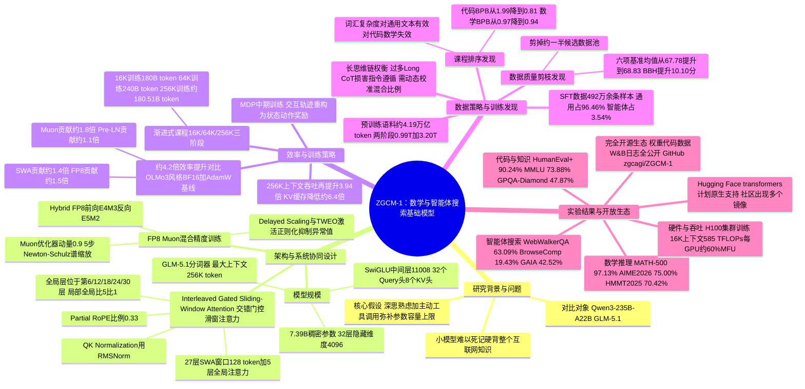

## 一、论文是干什么的？

假设你要培养一个学生去解奥数题、查资料写研究报告。一种做法是让他把整个图书馆的书都背下来——这就好比训练一个几千亿参数的超大模型，靠海量参数「死记硬背」互联网上的知识。另一种做法是：让这个学生只学好扎实的基础知识，但教会他遇到不会的问题时，先仔细思考，再主动去查资料、用计算器、搜网页、跑代码验证——这就是这篇论文里 **ZGCM-1** 采用的思路。

ZGCM-1 是一个只有7.39B（约73.9亿）参数的稠密语言模型，由中国的「北京中关村人工智能研究院」（ZGC AGI）团队完全从零训练而成。论文的核心主张是：像7B这样规模的小模型，不可能被动记住整个开放网络的全部知识，但可以通过「深思熟虑的内部推理」加上「主动使用外部工具」这两件事的结合，突破参数容量的天花板。换句话说，与其让模型死记硬背，不如把它训练成一个既会独立思考、又懂得何时查资料的「聪明的小个子」。论文的另一大亮点是「完全开源」：不仅公开了最终模型权重，还公开了预训练、中期训练、后训练各阶段的中间检查点、全部训练代码、分阶段数据和数据配方，以及训练过程中的 Weights & Biases（W&B）实验日志，方便其他研究者复现和二次开发。

## 二、核心方法与创新

ZGCM-1 的技术方案可以概括为「架构与系统协同设计」加「渐进式课程与MDP中期训练」两大部分，围绕着如何在有限算力下，把一个7B模型训练得又快又好、又能用256K（约25万）token的超长上下文来思考和查资料。

**1. 混合门控滑窗注意力（Interleaved Gated Sliding-Window Attention）。** 普通的Transformer在处理长文本时，每个字都要和前面所有字计算关联，上下文越长计算量越大。ZGCM-1的做法类似读书时的策略：大多数时候只盯着眼前一小段（一个128 token宽的滑动窗口）细读，但每隔几层会抬头把整本书重新通览一遍。具体来说，模型共32层，其中27层使用「门控滑窗注意力」（局部窗口128 token），只有第6、12、18、24、30层这5层使用「全局因果注意力」（能看到全文），局部与全局层数的比例是5比1。此外还搭配了QK Normalization（用RMSNorm归一化查询和键向量）和Partial RoPE（旋转位置编码只作用于33%的维度），进一步兼顾计算效率和长距离关系的建模能力。

**2. FP8 Muon混合精度训练。** 训练大模型通常用32位或16位浮点数做计算，数值越精细，占用显存和计算量也越大。ZGCM-1采用了更「粗颗粒度」的8位浮点数（前向传播用E4M3格式，反向传播用E5M2格式），来大幅提速和省显存。但8位浮点数值范围窄、容易溢出出错，所以论文引入了「延迟缩放」（Delayed Scaling，参考过去1024步的数值范围动态调整缩放系数）和「TWEO激活正则化」两项技术，专门压制训练过程中异常突增的激活值，防止数值发散导致训练失败。在优化器方面，矩阵形状的参数使用 Muon 优化器（动量0.9，通过5步Newton-Schulz迭代做谱归一化），标量参数则沿用更常见的Adam优化器。

**3. 渐进式课程与MDP中期训练（Progressive Curriculum & MDP Mid-Training）。** 模型的训练分为「通用预训练」和「中期训练」两大阶段。通用预训练先后用0.99万亿和3.20万亿token训练（合计约4.19万亿token），打好语言和知识基础。随后进入中期训练，让模型的上下文长度像升级打怪一样逐步扩展：先在16K上下文上训练180B token，再扩展到64K上下文训练240B token，最后挑战256K超长上下文，训练约180.51B token（三阶段合计约600.51B token）。与此同时，论文把智能体与外部工具的交互过程（发出指令、获得工具返回结果、决定下一步动作）重新表述为强化学习里的马尔可夫决策过程（MDP），即用状态、动作、奖励的框架来组织训练数据，让模型学会像做决策一样连贯地使用工具，而不只是简单模仿别人的对话记录。

**4. 效率提升从哪里来。** 论文报告，把以上这套组合拳用在16K上下文预训练阶段后，要达到同样的训练损失（loss），所需时间比一个参照基线（一个OLMo3风格、用BF16精度加AdamW优化器训练的7B模型）快约4.2倍。这约4.2倍的提升可以拆解为四部分贡献的叠加：5比1的混合滑窗注意力设计贡献约1.4倍，FP8混合精度训练贡献约1.5倍，Muon优化器贡献约1.8倍，Pre-LN结构调整贡献约1.1倍。而在256K超长上下文阶段，5比1的滑窗设计让吞吐量比全量注意力再提升3.94倍，同时把显存中KV缓存的占用降低到约六分之一（即减少约6.4倍），这对于让7B级别的小模型也能跑得动超长上下文非常关键。

**5. 几个值得注意的数据策略发现。** 论文的消融实验发现：按「词汇复杂度」给文本排序作为课程学习策略，对通用文本有效，但对代码和数学文本反而是个很差的难度衡量指标——采用更合适的排序后，代码的BPB（每字节比特数，越低说明模型对这类文本建模越准）从1.99降到0.81，数学的BPB从0.97降到0.94。对候选训练数据剪枝掉约一半质量较低的部分后，六项基准测试的平均分从67.78提升到68.83，其中推理类基准BBH的提升幅度达到10.10分。另外，如果监督微调阶段塞入过多「长思维链」（Long CoT）推理轨迹，会损害模型正常遵循指令的能力，需要动态校准数据混合比例来缓解；同样，如果只用智能体交互数据做微调，模型的对话交互会显得不自然、保真度下降，必须搭配通用指令数据一起训练才能打好基础。

## 三、使用了哪些模型和计算资源？

**模型规模与结构：** ZGCM-1是一个完全从零开始训练的7.39B参数稠密（非MoE）Transformer模型，而不是在某个已有大模型基础上微调得来。具体结构为32层Transformer，隐藏维度4096，SwiGLU前馈网络中间层维度11008，注意力部分为32个查询头、8个键值头（分组查询注意力，每个头维度128）。分词器（tokenizer）使用的是GLM-5.1的分词器。模型最大支持256K token的上下文长度，并且在同一个模型里同时支持「深度思考模式」和「直接响应模式」两种回答方式。

**计算硬件：** 论文提到训练使用了英伟达H100 GPU集群，其中在架构消融实验部分明确提到使用了8块H100 GPU做对比测试。论文给出了具体的吞吐效率数字：在16K上下文长度下，达到585 TFLOP/s每GPU（约相当于60%的BF16等效模型算力利用率MFU）；在4K序列长度下，吞吐量为每GPU每秒9566个token。但是，论文并未明确披露用于完整训练的GPU总数量、集群总规模，也没有给出每个训练阶段（16K/64K/256K）各自的实际墙钟训练时长（wall-clock time）或总的GPU小时数/总浮点运算量——这些属于论文中未明确说明的信息，只能看到相对效率倍数（如约4.2倍）的比较，看不到具体天数、周数等绝对时间。

**训练数据规模：** 通用预训练阶段合计约4.19万亿token（分两步：0.99万亿加3.20万亿）；中期训练（渐进式扩展上下文）合计约600.51B token（约合6005.1亿token，注意B=十亿，不能直接等同中文的「亿」；三段分别为16K阶段180B、64K阶段240B、256K阶段约180.51B）；监督微调（SFT）阶段使用了492万余条样本（准确数字为4,921,933条），其中通用类数据占96.46%，智能体类数据（深度研究、软件工程、终端交互）占3.54%，SFT阶段实际打包训练了约194.6亿token，训练10个轮次（epoch）。

**关键超参数：** 预训练阶段Muon优化器学习率固定为2×10的负4次方，权重衰减0.1，梯度裁剪阈值1.0，FP8缩放历史窗口为1024步；中期训练学习率为1×10的负4次方，16K/64K/256K三个阶段的全局批量大小分别为768、192、48，平均每个优化器步骤处理约1260万token，256K阶段RoPE基频调整为1000万；SFT阶段学习率按余弦衰减从1×10的负4次方降到1×10的负6次方，全局批量大小48，权重衰减0.01，梯度裁剪阈值1.0。

**开源发布情况：** 论文团队已经把模型权重、训练代码、数据集全部公开发布。GitHub代码仓库地址为[zgcagi/ZGCM-1](https://github.com/zgcagi/ZGCM-1)，模型权重发布在[Hugging Face（zgcagi/ZGCM-1-7B）](https://huggingface.co/zgcagi/ZGCM-1-7B)，训练数据发布在[Hugging Face数据集（zgcagi/ZGCM-1-Data）](https://huggingface.co/datasets/zgcagi/ZGCM-1-Data)。根据Hugging Face模型页面显示，模型采用MIT开源许可证，上线以来月下载量已超过1000次。

## 四、实验结果

用大白话说，ZGCM-1的核心卖点是「以小博大」：一个只有7B参数的模型，在数学解题和需要联网查资料的智能体任务上，能够和体量比它大几十倍的模型（比如official对比中提到的Qwen3-235B-A22B、GLM-5.1）掰手腕。论文和多篇第三方报道都提到，ZGCM-1-7B在同等7B到8B参数规模的模型里，多项数学与推理基准平均分排名第一。

| 任务类别 | 基准测试 | ZGCM-1-7B得分 |
|---|---|---|
| 数学推理 | MATH-500 | 97.13% |
| 数学推理 | AIME 2026 | 75.00% |
| 数学推理 | AIME 2025 | 73.33% |
| 数学推理 | HMMT 2025 | 70.42% |
| 代码能力 | HumanEval+ | 90.24% |
| 综合知识 | MMLU | 73.88% |
| 综合知识 | GPQA-Diamond | 47.87% |
| 智能体搜索 | WebWalkerQA | 63.09% |
| 智能体搜索 | Binary Function Search | 62%（50道题中答对31道，即31/50） |
| 智能体搜索 | BrowseComp | 19.43% |
| 智能体搜索 | GAIA（纯文本子集） | 42.52% |

需要说明的是，MATH-500、AIME等数学基准得分是在论文所说的「思考模式」（thinking mode，即模型先输出较长的内心推理过程再给答案）下取得的。另外有第三方文章提到，ZGCM-1在20个基准测试、对比6个同为7B到8B规模的推理模型的横向比较中，在MATH-500、AIME 2026、HMMT 2025/2026、IMO-AnswerBench、HumanEval+等多项上都拿到最好成绩；但同一篇第三方评测也提醒读者，部分评测细节和分数报告并不完整，结论仍需要社区进一步复核验证。

## 五、潜在应用与已落地应用

**潜在应用方向：**
- **低成本数学辅导/解题助手：** 由于模型体量小（7B）却在数学基准上表现突出，非常适合部署在算力有限的场景（比如学校机房、本地单卡服务器），做自动批改、解题步骤讲解等教育应用。
- **长文档深度研究智能体：** 256K的超长上下文加上「深度研究」类SFT数据训练，使它适合做需要阅读大量资料、多步骤检索总结的科研助理或行业调研助手。
- **软件工程与终端自动化：** SFT数据里专门包含了软件工程执行验证轨迹和终端交互轨迹，理论上可以支撑自动化写代码、调试、执行终端命令等DevOps场景。
- **边缘/私有化部署：** 完全开源（权重加代码加数据加训练日志）使得企业或研究机构可以在自己的私有环境里复现、微调、审计整个训练流程，而不依赖闭源API。

**已经落地的迹象：**
- 团队已在GitHub和Hugging Face正式发布了模型权重、训练代码和数据集，Hugging Face模型页面显示月下载量已超过1000次，说明已经有实际用户在下载使用。
- 搜索发现Hugging Face的[transformers](https://github.com/huggingface/transformers)开源库已经出现了一个为ZGCM架构添加原生支持的Pull Request（`#48828`，标题为「Add native ZGCM model support」），这意味着主流开源生态正在推进对这个新架构的官方兼容，方便更多开发者直接调用。
- 出现了若干社区镜像与二次整理仓库（例如为其撰写中文说明的镜像仓库），说明中文开发者社区已经开始关注和传播这个项目。

## 六、网络上的讨论与评价

综述撰写时（2026年9月18日）搜索到的公开讨论有限，没有找到Hacker News或Reddit上的专门讨论帖，这一点如实说明。能找到的相关评价主要来自技术资讯类网站：

- 科技评测网站CCTest发布的文章《ZGCM-1: An Open 7B Model for Efficient Agentic Reasoning》认可论文「把模型能力当作架构、数据质量、交互设计整合起来的系统性工程问题」这一思路，称赞其不只是刷榜，而是提供了一整套可复现的训练方法论；但文章也提出批评性意见，指出论文中「部分评测分数报告不完整、细节缺失」，因此论文宣称的「媲美更大模型」等说法仍然「需要进一步验证」，实际可用性还要看它在真实环境里的稳定性和开源材料的可复现程度。
- HyperAI、Papers with Code等论文索引类网站收录了这篇论文的基本信息，但未见深入的评论区讨论。
- 一些GitHub上的论文自动追踪机器人（如个人维护的research-issues、squelch-news-engine等仓库）自动同步收录了这篇论文的摘要，属于自动化信息聚合，不构成实质性的人工讨论或评价。

整体来看，目前网络上关于ZGCM-1的讨论以「转载与索引」为主，实质性的社区争论或深度点评还比较少见，这与论文发布时间较新（2026年9月11日）、社区尚在消化验证阶段有关。

## 七、思维导图

