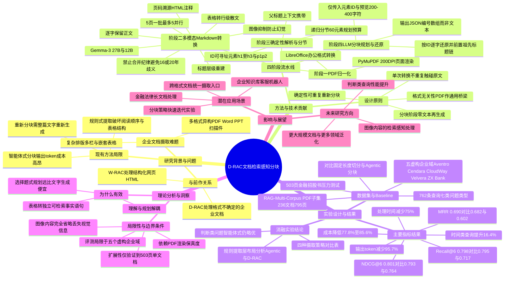

## 一、论文是干什么的？

想象你是一家大公司的档案管理员，仓库里堆满了各种格式的资料：Word合同、PPT汇报、Excel报表、扫描的纸质文件、还有各种排版复杂的PDF说明书。现在老板要求你把这些资料整理成一个个「知识卡片」，方便员工提问时能立刻查到答案——这其实就是当下很火的检索增强生成（RAG）系统在企业里落地时要做的「文档摄取」工作。

问题在于，这些文档的格式五花八门，排版还经常很复杂：有的是多栏排版，有的表格套表格，有的标题层级混乱。如果用传统的「抠文字」工具直接提取文本，就好比把一本精心装订的说明书撕碎了再随便堆到一起——文字的顺序全乱了，表格里「这行数字对应哪个标题」的关系也丢了，AI读到这种碎片文字时经常会理解错。而如果改用更聪明的「智能体式」方法，让大模型逐段重新阅读、重新生成整理好的文字，效果虽然更好，但代价极其昂贵——每处理一份文档都要让大模型把内容整个「重新抄写」一遍，产生的输出内容（也就是要花钱的部分）非常多。

这篇论文提出的D-RAC，就是想在「便宜但混乱」和「聪明但烧钱」之间找到一个两全其美的办法。它是Yellow.ai团队此前提出的「网页检索感知分块」（W-RAC，一个专门处理网页HTML内容的框架）的姊妹篇，这次把同样的思路扩展到了几乎所有企业文档格式：PDF、Word、PPT、Excel、扫描件，统统能处理。

## 二、核心方法与创新

D-RAC的核心思路可以用一个比喻来理解：与其让一个昂贵的专家反复誊抄整份文件，不如先请专家**通读一遍**并做好详细的**标签和索引**，之后无论想怎么切分这份文件，只需要在索引上做选择题，而不需要专家再重新誊写内容。

具体来说，D-RAC分成四个阶段：

**第一步：格式归一化（PDF Normalization）**。不管原始文件是Word、PPT还是Excel，D-RAC先用LibreOffice等工具把它们统一转换成PDF格式。这一步的道理很简单：PDF几乎是所有办公文档格式的「通用翻译语言」，任何格式转成PDF都有一套确定、可靠的规则，不需要AI介入，纯靠传统软件就能完成，成本几乎为零。

**第二步：多模态Markdown转换**。把PDF的每一页渲染成图片（分辨率200 DPI，最长边限制在1568像素以匹配视觉模型的输入习惯），然后用一个能「看图」的多模态大模型（论文中用的是Gemma-3），以5页为一批、最多5批并行的方式，把这些页面图片「读」出来，转换成结构清晰的Markdown文本。这里有几条很关键的「检索友好」规则：
- **逐字保留正文文本**，不许AI自由发挥改写句子；
- **表格转成逐行大白话**：比如一张产品参数表，AI不是简单地把表格原样复制，而是把每一行数据配合列标题，写成一句完整的话，比如「某型号发动机的最大功率是200马力」，这样即使这句话以后被单独抽出来检索，别人也能看懂完整意思，不会因为脱离了表格上下文而变得残缺。论文中特别强调一条「禁止合并」的纪律：绝不能把不同行的数据合并成一句含糊的话（比如把两种保修年限写成「16年或20年」这种让人分不清对应关系的句子），因为这种「偷懒合并」是让表格信息在检索时失真的隐形杀手；
- **压制图片**：遇到图表、照片等图片内容，D-RAC选择直接忽略，而不是让AI去凭空「脑补」一段图片描述——因为多模态模型看图生成文字说明时经常一本正经地编造内容（幻觉），与其编错不如不编；
- **重建清晰的标题层级**，明确哪些内容属于一级标题、二级标题；
- **记录页码来源**，方便追溯每段内容出自原文档第几页。

**第三步：确定性解析与分节**。转换出来的Markdown会被解析成一个个带编号的「元素」，比如标题记作h1、h2、h3，正文段落记作p1、p2……每个元素都有独立的ID，就像图书馆给每本书、每一页贴上索书号。如果文档特别长（论文测试过500多页的文档），系统会用一种递归分节算法，按标题边界把大文档切成一个个小节，同时保证每个小节都「记得」自己的上级标题是什么，避免长文档一次性塞给大模型处理不过来（每次规划最多处理60个元素）。

**第四步：分块规划与还原**。这是全文最关键的省钱设计：大模型在这一步**只看得到元素的编号、层级关系，以及一小段预览文字（200到400个字符)**，它的任务不是重新写文字,而是输出「哪些编号应该组成一个知识块」这样的编号数组（类似「p3, p4, p5 组成一块」）。等规划完成后，系统再用编号，把原始的逐字文本**拼接**回来，并在每个知识块前面自动加上它所属的标题链条（比如「产品手册 > 第三章 > 保修政策」），确保每个知识块读起来都有完整的上下文。

这个设计的巧妙之处在于：**大模型只需要读懂结构、做「选择题」，完全不需要动笔重新写一遍原文**。相比之下，此前流行的「智能体式分块」方法，是让大模型把整段文字读进去后重新原样或改写输出一遍，这个「重新誊写」的过程会消耗大量的输出token（也就是要花钱的部分），因为生成文字远比选择编号贵得多。论文测算，D-RAC能把这部分输出内容减少95.7%。而且因为分块规划阶段是纯粹基于编号做决策，同一份转换好的Markdown文档，以后想换一种分块策略（比如把知识块从「3到8段」改成「5到10段」），也不需要再花大钱重新转换一次文档，只需重新跑一遍便宜的规划阶段即可，这就是论文强调的「确定性可重复分块」优势。

## 三、使用了哪些模型和计算资源？

- **多模态转换模型**：Gemma-3 27B 和 Gemma-3 12B（谷歌开源的多模态大模型），通过AWS Bedrock云服务调用，温度参数设为0.1（也就是让模型输出尽量稳定、少随机发挥）。
- **分块规划模型**：同样使用 Gemma-3 27B，通过AWS Bedrock调用。
- **向量嵌入模型**：Amazon Titan Text Embeddings V2，输出1024维向量，用于后续检索评测。
- **对比基线模型**：在成本对比实验中，论文额外用GPT-4.1和Gemini 2.5 Pro的定价来测算「智能体式分块」方法的花费，作为对照组（并非D-RAC本身运行时依赖这两个模型）。
- **计算基础设施**：全部通过AWS Bedrock云端API完成，没有提及自建GPU集群；页面渲染用PyMuPDF库（在普通CPU上跑，200 DPI），办公文档格式转换用LibreOffice。转换阶段采用5页一批、最多5批并行处理的方式来提高吞吐。

**耗时数据**（这是论文报告较为详细的部分）：
- 整个236份文档（共795页）的语料库，多模态转换阶段累计耗时3758秒（约62.6分钟），加上分块规划后总耗时约71.7分钟（墙钟时间）；平均每份文档15.9秒，平均每页4.7秒。
- 压力测试用的503页超大文档：用Gemma-3 27B转换耗时21.6分钟，用更小的Gemma-3 12B耗时13.4分钟。
- 分块规划阶段：236份文档合计只需541.8秒（约9分钟），平均每份文档2.3秒；503页压力测试文档的5060个元素，规划耗时68.7秒（通过95次并行调用完成）。
- 全流程实现零转换错误、零分块错误，5584个元素全部被覆盖且不重复。

论文没有提及自建GPU型号（因为全部通过AWS Bedrock托管API完成，用户不直接接触底层硬件），因此这部分具体GPU型号信息暂无相关信息。

## 四、实验结果

论文在自建的RAG-Multi-Corpus基准的PDF子集上做评测：236份文档、795页，覆盖汽车、高校、云服务、企业科技、银行五个虚构企业领域；配套762条人工标注的问答查询，涵盖描述性、分析性、比较性、判断性、时间性、流程性、开放性七类问题。

**检索效果对比**（数值越接近1越好）：

| 指标 | 固定长度切分（基线） | 智能体式分块（昂贵基线） | D-RAC |
|------|------|------|------|
| Recall@6（前6个结果命中率） | 0.717 | 0.795 | 0.798 |
| MRR（平均倒数排名） | 0.602 | 0.682 | 0.690 |
| NDCG@6（排序质量） | 0.764 | 0.793 | 0.801 |

可以看到，D-RAC在几乎所有指标上都追平甚至略微超过了昂贵的智能体式分块方法，而且D-RAC处理的原始输入更「难」——是从渲染后的图片页面里重新识别出来的文字，而不是像智能体式方法那样直接拿现成的干净文本源。

分类型来看，D-RAC在**时间类问题**上领先固定长度分块最多，达到16.4%的相对提升；在**比较类**问题上领先9.7%；**分析类**问题领先8.9%。这说明D-RAC对「需要跨段落、跨表格对照信息」的复杂问题特别有帮助。唯一表现略逊的是判断类（是非题）问题，智能体式分块仍保持小幅优势（0.86对0.82）。

**成本对比**（重头戏）：

| 指标 | 智能体式分块 | D-RAC | 降幅 |
|------|------|------|------|
| 输出token数量 | 270,454 | 11,714 | 减少95.7% |
| 处理成本（按GPT-4.1定价） | $2.815 | $0.624 | 减少77.8% |
| 处理成本（按Gemini 2.5 Pro定价） | $3.112 | $0.448 | 减少85.6% |
| 处理耗时 | 2167.5秒 | 541.8秒 | 减少75% |

简单说：同样处理236份文档、达到几乎一样的检索效果，D-RAC的花费只要智能体式方法的两成左右，速度快了四倍。论文还测试了大规模场景（503页的金融招股书），证明这套方法在超长文档上也不会突然变慢或出错，具备良好的扩展性。

## 五、潜在应用与已落地应用

D-RAC是W-RAC（前作，专门处理网页HTML内容的检索感知分块框架）的延伸，两者定位互补：W-RAC负责结构天然清晰的网页内容，D-RAC负责「剩下的一切」——各种办公文档、扫描件、PDF。论文作者明确将两者定位为一套统一的、可用于生产环境的企业文档摄取基础设施。

**潜在应用场景：**
- 企业内部知识库/客服机器人：把公司积累的产品手册、政策文件、合同、报表等各类文档批量转换成可检索的知识片段，供员工或客户提问时调用；
- 金融、法律等强监管行业：这些行业文档常常是几百页的招股书、合同、监管报告，论文特别测试了503页金融招股书场景，说明其对长文档、高价值文档的适配性；
- 需要频繁调整分块策略的场景：因为D-RAC把「理解文档」和「切分文档」拆成了两个独立阶段，企业可以在不重新花钱做多模态转换的前提下，反复试验不同的分块粒度、不同的检索策略，特别适合还在打磨RAG系统效果的团队；
- 跨格式文档的统一入口：由于第一步就是把所有格式转成PDF，理论上任何能「打印」出来的文档格式（Word、PPT、Excel、图片扫描件、甚至部分网页）都可以复用同一套流程。

**已落地应用**：论文本身就来自Yellow.ai（一家提供企业对话式AI/客服机器人产品的公司）的AI研究团队，可以推断该方法是为其自身企业级RAG产品线服务或与之高度相关的内部技术积累，但论文正文中未提供公开的开源代码仓库或产品页面链接。经检索，暂未找到该论文对应的公开GitHub代码库或产品Demo页面。

## 六、网络上的讨论与评价

经过检索，没有找到该论文在Twitter/X、Reddit或Hacker News等社区上的实质性讨论帖或评论区争论。搜索结果主要是论文聚合与镜像类网站对论文内容的转述摘要，包括[HyperAI 论文页](https://hyper.ai/en/papers/2609.24220)、[Papers with Code 页面](https://paperswithcode.co/paper/2609.24220)、[awesomepapers.io 信息检索分类页](https://awesomepapers.io/information-retrieval/papers/hf2609.24220)，以及一篇简要技术解读文章[《D-RAC: Multimodal Chunking for Enterprise RAG》](https://cctest.ai/en/articles/d-rac-rebuilds-the-entry-point-for-enterprise-rag)，这些内容基本都是对论文摘要和方法的复述，未见独立的评价性观点或争议讨论。因此，关于社区反响，如实说明：暂无找到实质性的网络讨论。

## 七、思维导图

