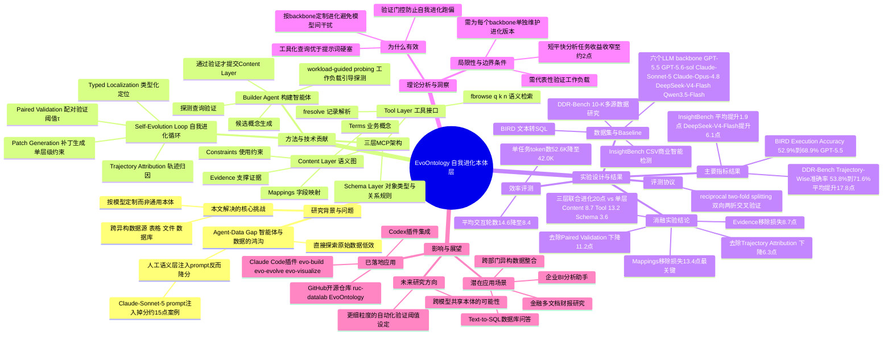

## 一、论文是干什么的？

想象你是一个刚入职的新员工，公司给了你一堆杂乱的文件柜、Excel表格和数据库，里面字段名千奇百怪，有的叫`cust_id`，有的叫`customer_no`，还有一堆没人解释过的业务规则。你要根据老板的口头指令去这些资料里找答案，光靠自己摸索非常低效，还容易出错。现在很多所谓的「数据智能体」（Data Agent，能自动查数据库、读表格、写SQL的AI）就处在这种处境：它们能听懂人类的自然语言指令，但对真实世界里杂乱无章的数据结构（论文称之为「agent-data gap」，即智能体与数据之间的鸿沟）却常常摸不着头脑。

现有的解决办法通常是两种：要么让智能体自己一点点去探索原始数据（费时费力，还容易探索不全），要么由人工提前写好一份「数据字典」塞进提示词（prompt）里让模型背下来。但论文发现后一种做法有个反直觉的问题：把说明书硬塞进提示词里，反而会让模型表现变差，因为模型很容易被信息量太大的提示词搞晕，或者压根不知道怎么在合适的时机用上这些信息。这篇论文提出的 **EvoOntology**，就是要解决这个问题：它把数据的「说明书」做成一个可以被智能体主动查询、并且会随着使用不断自我完善的知识系统，而不是一次性写死的文本。

## 二、核心方法与创新

EvoOntology 的核心思路可以类比成给智能体配了一位「越用越懂业务的资料管理员」，而不是给它一本永远不会更新的说明书。这位管理员以 [MCP](https://github.com/ruc-datalab/EvoOntology)（Model Context Protocol，一种让大模型能像调用工具一样访问外部资源的标准协议）服务的形式存在，包含三层结构：

**1. 内容层（Content Layer）**：这是管理员脑子里存的知识，本质上是一张有类型的语义图，里面包含四类元素——「Terms」（业务概念，比如「活跃用户」到底指什么）、「Mappings」（概念到具体字段的映射关系，比如「活跃用户」对应哪张表的哪个字段）、「Constraints」（使用规则和限制，比如某字段不能为空、某两个字段互斥）、「Evidence」（支撑这些知识的证据数据）。

**2. 模式层（Schema Layer）**：定义了整个知识图谱本身长什么样，包括对象类型有哪些、允许存在哪些关系类型，相当于「说明书的目录结构规范」。

**3. 工具层（Tool Layer）**：暴露给智能体的两个可调用接口，一个叫`fbrowse(q,k,n)`用来做语义检索（按查询词找相关概念，返回k个候选、n条细节），另一个叫`fresolve`用来根据具体的标识和条件把抽象概念解析回真实的数据记录。智能体不再是死记硬背，而是像用搜索引擎一样主动去「问」这位管理员。

这套系统怎么从零开始搭建，靠的是一个**构建智能体（Builder Agent）**。它不是凭空瞎猜数据结构，而是采用「工作负载引导的探测」（workload-guided probing）方式：先从训练任务里找出候选的业务概念，然后针对每个候选概念发出探测性查询去验证这个概念到底能不能在真实数据里落地（有没有对应的字段、数据是否吻合），只有真正通过验证的候选概念才会被正式写进本体的内容层。这就像管理员上岗第一天不是道听途说记笔记,而是每条信息都要亲自去仓库核实一遍才登记造册。

最核心的创新是**自我进化循环（Self-Evolution Loop）**，一共四步：

1. **轨迹归因（Trajectory Attribution）**：管理员会回顾之前智能体执行任务时留下的「工作日志」（历史交互轨迹），分析出哪些地方本体知识不够用，导致智能体走了弯路或者答错了。
2. **类型化定位（Typed Localization）**：把归因出来的问题精确定位到到底是内容层、工具层还是模式层出了毛病——就像医生问诊先确定病灶在哪个器官。
3. **补丁生成（Patch Generation）**：针对定位到的问题，生成一个改动方案，而且这个改动被严格限定在单一层级内，不会牵一发动全身。
4. **配对验证（Paired Validation）**：这是整套机制里最关键的把关环节——新方案不是想改就改，必须先在一部分留出来没用过的验证数据上，和旧版本「背靠背」比一比，只有提升幅度超过某个阈值$\tau$才会被正式采纳，否则这次修改就作废。

值得强调的是，EvoOntology 会针对不同的大模型底座分别进化出不同版本的本体，因为论文发现「不同模型犯错的方式不一样」——同一份说明书对GPT系列模型有效的部分，未必对Claude或者DeepSeek同样有效，所以本体的进化是「按模型定制」的，而不是一套本体通吃所有模型。

另外论文的实验设计也很讲究：采用「双向两折交叉」的评测协议，把数据分成两份，一份70%用来构建和进化本体、剩下30%做验证，然后调换角色再做一遍，最终成绩取两个方向的平均值，避免了「在训练数据上进化、又在训练数据上测试」这种自己给自己打高分的问题。

## 三、使用了哪些模型和计算资源？

论文中测试了六种大语言模型作为智能体的「大脑」（底座模型），分别是：GPT-5.5、GPT-5.6-sol、Claude-Sonnet-5、Claude-Opus-4.8、DeepSeek-V4-Flash、Qwen3.5-Flash。这些都是通过标准的模型调用（很可能是API调用）方式接入的现成大模型，论文没有对这些模型本身做微调或重新训练，EvoOntology改进的是外挂的本体知识系统，而不是模型参数本身。

因此，论文中没有提及具体的GPU型号、GPU数量或训练所需的硬件配置——这与很多需要从头训练神经网络的论文不同，本文的方法论层面属于「智能体+外部知识系统」的工程方案，主要开销体现在多次调用大模型API（用于构建本体、执行任务、评估轨迹）上，而非传统意义上的GPU训练。

关于耗时，论文提供了一个间接但有意思的效率数据：使用EvoOntology后，智能体完成任务所需的平均交互轮数从14.6轮降到8.4轮，每个任务消耗的总token数从5.26万降到4.2万，比不用EvoOntology的基线还要减少约20%的token开销——也就是说,虽然多了一层本体查询的开销，但因为智能体少走了很多弯路，总体反而更省。至于具体每次评估或每条轨迹跑一遍需要多少秒/分钟这样的真实墙钟时间，论文暂无相关信息。

## 四、实验结果

论文在三个数据智能体相关的基准测试上做了实验：

| 基准测试 | 测试内容 | 主要指标 | 基线表现 | EvoOntology表现 | 提升幅度 |
|---|---|---|---|---|---|
| DDR-Bench | 类似「10-K财报」的多来源数据综合研究任务 | Trajectory-Wise准确率（对完整历史的综合理解，是论文汇报的核心指标）| 六个模型底座平均53.8% | 六个模型底座平均71.6% | 平均提升17.8个百分点（单个底座最高提升26.7点即GPT-5.5从64.2%到90.9%，最低4.8点即Qwen3.5-Flash从14.3%到19.1%）|
| BIRD | 面向真实数据库的文本转SQL任务 | 执行准确率 | 约52.9%（以GPT-5.5为例） | 68.9%（以GPT-5.5为例） | 六个模型底座平均提升约7.4个百分点 |
| InsightBench | 在CSV数据集上做商业智能异常/洞察检测 | 检测准确率 | — | — | 平均提升约1.9个百分点，其中DeepSeek-V4-Flash提升最多，约6.1个百分点 |

简单说，效果最惊艳的是在处理「又宽又杂」的多来源数据研究任务（DDR-Bench）上，提升接近18个百分点；在结构化程度更高、任务本身范围较窄的SQL查询和商业智能场景里，提升相对温和一些（分别约7个百分点和不到2个百分点），说明这套方法对「数据越乱、来源越多样」的场景越有价值。

论文还做了详细的消融实验（拆掉某个部件看性能掉多少）：

- 去掉「配对验证」这道把关环节，性能暴跌约11.2个百分点，说明没有严格验证的自我进化非常危险，很容易把本体改坏。
- 去掉「轨迹归因」这一步，性能下降约6.3个百分点。
- 三层（内容、工具、模式）一起进化的效果比只让单独一层进化要好得多：三层联合进化能带来约20个百分点的提升，而单独进化内容层、工具层、模式层分别只能带来8.7、13.2、3.6个百分点的提升，说明三层协同优化远比单点优化更有效。
- 在本体结构层面，去掉「Mappings」（字段映射关系）损失最大，约13.4个百分点；去掉「Evidence」（证据支撑）也会掉约8.7个百分点，说明这两类知识对智能体最为关键。

## 五、潜在应用与已落地应用

这项技术的潜在应用场景非常直接：任何需要AI智能体去操作杂乱多源数据的场合都用得上，比如企业内部的商业智能分析助手（自动查数据仓库回答老板的业务问题）、金融领域的财报和多文档研究助手、跨部门数据整合的问答系统，甚至是帮程序员自动理解一个陌生代码库/数据库结构后再动手写查询语句。

已经落地的部分是本文最大的亮点之一：作者团队已经把 EvoOntology 开源并做成了实际可用的插件工具，仓库地址为 [ruc-datalab/EvoOntology](https://github.com/ruc-datalab/EvoOntology)。根据仓库说明，它可以直接作为插件安装到 Claude Code（`claude plugin install evoontology@evoontology`）和 Codex（`codex plugin add evoontology-codex@evoontology`）这类主流编程/智能体工具里，安装后可以直接用`/evo-build`（构建本体）、`/evo-evolve`（进化本体）、`/evo-visualize`（可视化本体结构）这几个命令来使用，说明这不只是一篇纸面论文，而是已经变成了开发者能立刻上手试用的工具。

## 六、网络上的讨论与评价

搜索发现这篇论文已经有一定的网络讨论热度。一篇发布在 Substack 上的技术博客 [learnagentic.substack.com 的文章](https://learnagentic.substack.com/p/what-is-evoontology-why-your-agents)对这篇论文做了比较深入的解读，标题直译是「为什么你的智能体的数据字典应该藏在一个工具背后，而不是塞进提示词里」。该文章重点强调了论文中一个反直觉的发现：把数据字典直接塞进提示词反而会让某些模型（文中提到Claude Sonnet 5）掉分约15个点，而把同样的信息改造成可主动查询的MCP工具后，效果反而提升了约17.8个点；文章还指出这套方法「按模型定制本体」的做法很务实，因为不同模型犯错的方式不同；同时也比较客观地提到了这套方案的落地成本，比如需要为不同的模型底座分别做进化、需要有代表性的验证数据集、需要把本体作为一个独立服务来维护，并不是万能药，在「短平快」的分析任务上收益会明显收窄（约2个百分点）。

此外还搜索到 [DAIR.AI Academy 的论文页面](https://academy.dair.ai/papers/evoontology-a-self-evolving-ontology-layer-for-data-agents-2609.15779) 和 X（原Twitter）上「Artificial Intelligence Papers」账号转发的论文通知帖，但这两处更多是论文信息的转载和索引，未见展开的实质性评论内容。总体来看,目前网络讨论主要集中在「提示词注入 vs 工具化查询」这个核心反直觉发现上，尚未搜到大规模的社区争议或负面评价。

## 七、思维导图

