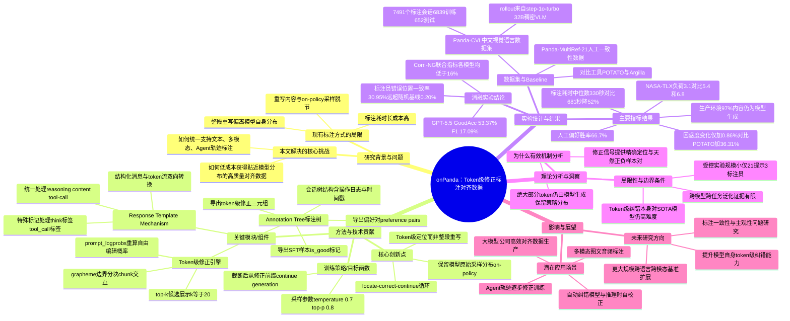

## 一、论文是干什么的？

训练一个像 ChatGPT 这样的大模型，光靠原始网络文本是不够的，还需要人工标注「好答案长什么样」的数据，这个过程叫「对齐」。传统做法很像老师批改作文：模型先写一整段回答，标注员看完觉得哪里不对，就把整段推倒重写一份「标准答案」。问题是，这样写出来的「标准答案」往往和模型自己会说的话相差很远——就像让一个学生模仿老师的范文，风格、用词习惯完全对不上号，模型学起来效果打折扣，这个现象论文里称为「偏离模型自身分布」。

onPanda 这篇论文提出了一个新的标注工具，思路更像「改病句」而不是「重写作文」：标注员不需要通读全文再重写，只需要找到回答里第一个出问题的词（token），然后要么从模型自己给出的几个候选词里选一个更好的，要么手动打一个正确的词进去；改完这一个词后，系统会自动把后面的内容截断，让模型从这个改好的位置重新接着往下生成，如此反复，直到整段回答变得满意为止。因为绝大部分文字仍然是模型自己生成的，只是被人在关键节点「掰了个弯」，最终数据依然贴近模型本身的说话习惯，特别适合用来做后续的监督微调（SFT）和偏好学习。论文还顺带发布了一个基于此工具标注出来的中文视觉语言数据集 Panda-CVL，以及一个配套的评测基准。

## 二、核心方法与创新

onPanda 的核心是一个「定位—修正—续写」的循环（论文称为 locate-correct-continue loop），可以理解成三步走：

**第一步：定位问题词。** 标注员在阅读模型输出时，只要找到第一个不合适的词就停下来，不需要通读评估整段话。这大大减少了标注员需要处理的信息量，就像校对文章时只需要划出第一个错别字，而不是重新构思整篇文章。

**第二步：修正这个词。** 系统会记录模型在生成这个位置时，实际采样到的概率，以及概率最高的候选词列表（默认展示top-k=20个候选，每个候选还附带被选中的概率）。标注员有两个选择：直接从候选列表里挑一个更合适的词（这种情况标注效率最高，鼠标点一下就行），或者如果候选词都不满意，就手动输入自己想要的文字进行「自由编辑」。对于自由编辑的内容，系统会用一种叫 `prompt_logprobs` 的接口请求，重新计算这段新文字在模型看来的概率，保证数据的概率信息始终是准确的。

**第三步：截断并续写。** 一旦某个位置被修正，系统会把这个位置之后原本模型生成的内容全部丢弃，然后让模型基于「修正后的前缀」重新生成后续内容。这一步是整个方法的巧妙之处：因为后续内容依然是模型自己写出来的，所以整段回答从头到尾大部分文字都保持着模型原本的语言风格和概率分布，只有标注员出手干预过的极少数几个词是「外来」的。这就是论文强调的「on-policy」（贴近模型自身策略）特性——修正数据看起来几乎就是模型自己会说的话，而不是人硬凑出来的范文。

为了让这套「改词」的思路能用在更复杂的场景，论文还设计了两个配套机制：

- **响应模板机制（Response Template Mechanism）：** 现代大模型的输出不只是普通文字，还可能包含思考过程（用 `</think>` 这类特殊标记包裹）、工具调用参数（用 `<|tool_call_begin|>` 这类标记包裹）等结构化内容。onPanda 把这些结构化消息和模型的原始token流之间建立了一套双向转换规则，这样无论是修正模型的「思考过程」、「最终回答」还是「调用工具的参数」，标注员看到的界面和操作方式都是统一的，不需要为每种内容类型单独开发标注逻辑。

- **标注树与数据协议（Annotation Tree）：** 由于一次标注过程中可能反复修正、多次分支尝试，onPanda 把整个标注会话组织成一棵树，每个对话节点上都记录了操作日志、时间戳和采样配置。标注完成后，这棵树上的不同分支可以被导出成三种不同用途的数据：直接标记为「好」的完整回答可以做监督微调（SFT）样本；同一位置的「修正前/修正后」自然构成了一对「负例/正例」，可以直接用作偏好学习（preference learning）的数据对；此外每一次逐词修正记录本身，也可以单独整理成「定位错误位置+给出正确替换」的训练样本，用来训练模型自己学会做token级纠错，这正是 Panda-CVL 基准想要评测的能力。

打个通俗的比方：传统标注方式像是请一位作家把学生的作文整个重写一遍当范文；onPanda 则像是一位经验丰富的编辑，拿着红笔只在关键的病句处画个圈、写上建议改法，其余大部分文字原封不动地保留学生自己的语言风格，改完之后再让学生（模型）根据这个建议接着往下写完。这样编辑省时间，而且学生学到的还是「贴近自己写作习惯的改进」，而不是完全模仿别人的风格。

## 三、使用了哪些模型和计算资源？

**用于生成待标注内容（rollout）的模型：**
- 效率对比实验中，让模型先生成待标注草稿用的是 Qwen3.5-35B-A3B（instruct 模式），采样参数为温度 0.7、top-p 0.8。
- Panda-CVL 视觉语言数据集的图文回答由 step-1o-turbo（一个320亿参数的稠密视觉语言模型）生成。

**用于评测 Panda-CVL 基准的模型（共9个，包括推理增强版本）：**
Doubao-Seed-2.1-pro、GPT-5.5（xhigh 模式）、GPT-5.6-sol（xhigh 模式）、GPT-6（xhigh 模式）、Kimi-K2.6、Step-3.7-Flash、Step-5-Preview、Qwen3.6-35B-A3B、Qwen3.5-397B-A17B（含 Instruct 变体）。

**GPU/算力细节：** 论文正文中没有披露具体使用的GPU型号、数量，也没有给出训练或推理所耗费的具体机时/总时长等信息，暂无相关信息。系统支持对接 vLLM、SGLang、llama.cpp、ollama 等主流推理框架，也可通过 Model Context Protocol（MCP）连接外部工具环境（如 Claude Code、Codex、OpenClaw），但这些属于系统兼容性说明，并非具体算力耗时数据。

## 四、实验结果

论文做了一个「21个提示词、3位标注员」的小规模受控对比实验，把 onPanda 和两个已有的标注工具 POTATO、Argilla 放在一起比较：

| 工具 | 标注耗时中位数 | 人工偏好胜率 | 生成内容困惑度PPL | 困惑度变化ΔPP |
|------|------------|----------|-----|-----|
| onPanda | 330秒 | 66.7% | 1.181 | +0.86% |
| POTATO | 681秒 | 54.8% | 1.596 | +36.31% |
| Argilla | 336秒 | 28.6% | 1.161 | -0.83% |

可以看到，onPanda 花的时间只有传统重写工具 POTATO 的一半左右（标注耗时中位数降低了52%），标注员事后更偏好 onPanda 标注出的结果，而且最终文本的困惑度几乎没怎么升高（说明修正后的内容仍然很「像」模型会自然说出的话），相比之下 POTATO 整段重写的方式让困惑度飙升了36%多，说明重写出的内容和模型原本的语言习惯偏离较大。

在标注员的主观负荷调查（NASA-TLX，数值越低代表标注员感觉越省力）中，onPanda 得分 3.1，明显优于 Argilla 的 5.4 和 POTATO 的 6.8。

论文还统计了 onPanda 在实际生产环境中的使用数据：

| 标注类型 | 会话数 | 修正次数 | 标注耗时中位数 |
|------|------|------|------|
| 视觉（Vision） | 25,596 | 5.76万次 | 1.65分钟 |
| 音频（Audio） | 105,143 | 31.9万次 | 1.93分钟 |
| 智能体轨迹（Agentic） | 1,257 | 1.08万次 | 31.31分钟 |

在视觉标注场景中，97.0%的最终文字仍然是模型直接生成的，只有2.1%是从候选词里选出来的，0.9%是标注员手打的——这正好印证了论文的核心主张：修正后的数据绝大部分内容仍然贴近模型自身的输出分布。

在 Panda-CVL 基准测试中，评测的9个大模型整体表现并不理想：表现最好的模型（如 GPT-5.5、GPT-6）在「定位错误位置+给出正确替换」这个联合指标（Corr.-NG）上普遍低于16%，说明「精准定位并纠正token级错误」这件事，对当前最先进的大模型来说仍然是一个有难度的能力，这也是论文发布这个基准想要推动社区研究的方向。此外，在人工标注一致性检验中（4位标注员各自独立标注同一批21个样本），标注员之间在错误位置的判断上完全一致的比例是30.95%（远高于随机猜测的0.20%基线），说明「哪里出了错」本身也存在一定的主观性。

## 五、潜在应用与已落地应用

**潜在应用场景：**
- 大模型公司训练自家对齐数据时，用onPanda替代传统人工重写标注，可以显著压低标注成本和时间，尤其适合需要频繁迭代、快速产出高质量SFT与偏好数据的场景。
- 多模态标注：论文展示的响应模板机制天然支持图文对话、音频对话的逐词修正，已经在生产环境的视觉和音频标注中大规模使用。
- 智能体（Agent）轨迹标注：通过MCP协议接入真实工具环境（如Claude Code、Codex等编程智能体框架），可以对智能体在真实任务执行过程中的每一步决策进行细粒度修正，用于训练更可靠的agent。
- 训练「自动纠错模型」：Panda-CVL这类数据本身可以用来训练模型学会自己发现并修正token级错误，未来有可能被集成进推理时自我校正、或用作RLHF中的奖励信号来源。

**已落地应用：**
- 论文作者已经在生产环境里大规模使用onPanda，累计标注了超过13万条会话（视觉2.5万+、音频10.5万+、智能体轨迹1257条），说明这不只是一个学术原型，而是已经投入实际数据生产流水线的工具。
- 开源了配套数据集 [Panda-CVL-train](https://huggingface.co/datasets/diyer22/Panda-CVL-train) 和 [Panda-CVL-test](https://huggingface.co/datasets/diyer22/Panda-CVL-test)，均以CC0公共领域协议发布。
- 项目主页：[on-panda.github.io/Panda-CVL](https://on-panda.github.io/Panda-CVL/)，代码仓库：[github.com/on-panda/on-panda](https://github.com/on-panda/on-panda)。

## 六、网络上的讨论与评价

目前没有在 Reddit、Hacker News 或 Twitter/X 上找到关于这篇论文的实质性技术讨论帖。搜索到的相关信息主要来自以下几处：

- 论文笔记聚合站点 [AkihikoWatanabe/paper_notes 的 GitHub issue](https://github.com/AkihikoWatanabe/paper_notes/issues/6623) 收录了这篇论文的摘要笔记，但没有附带评论性观点。
- 行业资讯站点 [AI Weekly](https://aiweekly.co/alerts/onpanda-paper-reports-52-cut-in-llm-alignment-annotation-time) 报道了这篇论文，标题为「onPanda paper reports 52% cut in LLM alignment annotation time」，编辑在文中特别提醒读者注意论文的局限：这是一个规模较小的受控实验，标注员数量、任务量以及在不同模型上的泛化表现细节披露有限，建议对齐团队在真正采用这套流程前先用自己的基线做对比测试再决定。
- 论文聚合网站 Papers with Code 和 awesomepapers.io 收录了该论文条目，但主要是转述摘要，未见独立评论。

整体来看，这篇论文在HuggingFace上获得了54个点赞，说明在AI社区内有一定关注度，但截至目前公开的深度讨论（尤其是批判性技术讨论）还比较少见，暂无找到更多网络讨论。

## 七、思维导图

