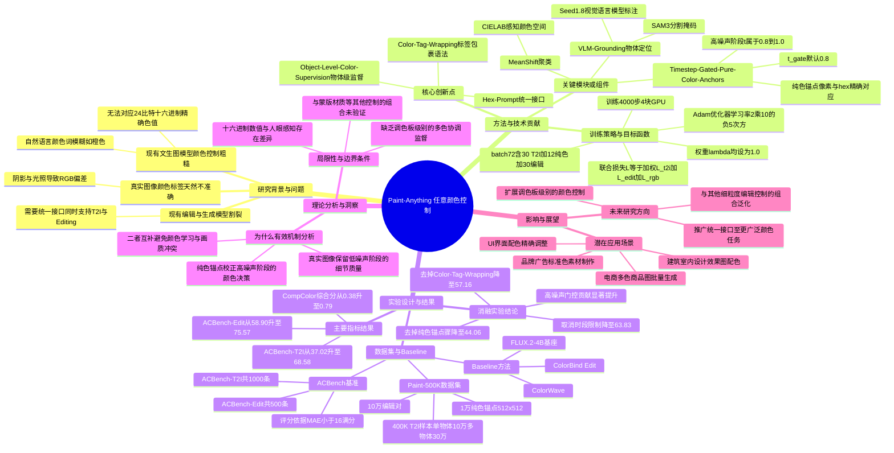

## 一、论文是干什么的？

想象你是一个平面设计师，客户给你一个品牌色卡，明确要求「这个杯子必须是 `#FF6B35`（一种特定的橙色），不能是差不多的橙色，必须一模一样」。如果你用现在的AI绘图工具，输入「橙色的杯子」，AI画出来的橙色可能偏红、偏黄，跟客户要的色号完全对不上，因为AI理解的「橙色」是一个模糊的概念，而不是一个精确的数字。

这篇论文做的事情，就是教会AI绘图模型看懂并精确执行「十六进制颜色代码」（就是网页设计里常见的像 `#FF6B35` 这种六位字符的颜色编码，一共能表示1600多万种颜色）。无论是从零生成一张新图片，还是给已有图片里的某个物体换颜色，用户都可以直接把颜色代码写进文字提示词里，AI就能画出误差很小、几乎精确匹配的颜色。这个系统叫 Paint-Anything，来自字节跳动 Seed 团队。它的核心卖点是「生成」和「编辑」两件事用同一套接口搞定，不用分别训练两套模型。

## 二、核心方法与创新

这篇论文的思路可以类比成教小孩认颜色：如果你只给小孩看真实世界的苹果、橙子照片，告诉他「这是红色」「这是橙色」，小孩学到的颜色概念会比较模糊，因为照片里有阴影、反光、光线偏色等干扰，红色苹果在照片里其实包含了很多种深浅不一的红。但如果你额外给小孩看一张纯色卡片，明确告诉他「这就是 `#FF0000`」，小孩就能建立起数字代码和颜色之间精确的一一对应关系。Paint-Anything正是把这两种「教材」结合起来训练模型。

具体来说，论文提出了三个关键技术点：

**第一，颜色标签包裹（Color-Tag Wrapping）。** 把十六进制颜色值用类似 `<color>#AABBCC</color>` 这样的标签包起来，直接嵌入到文字提示词中，这样模型能明确识别出「这是一个颜色指令」，而不是把颜色代码当成普通文字乱猜。

**第二，物体级颜色监督（Object-Level Supervision）。** 团队构建了一个叫 Paint-500K 的数据集，做法是：先用视觉语言模型（VLM，即能看懂图片内容并生成文字描述的AI）自动找出图片描述里提到的物体，再用分割模型把这个物体的像素区域精确抠出来，然后用一种叫 MeanShift 聚类的算法，在感知均匀的 CIELAB 颜色空间（一种更贴近人眼感受的颜色数学表示方式，比常见的RGB更准确）里统计这个物体的主色调，从而得到「这张图里这个物体对应的十六进制颜色标签」。这样模型学到的不是整张图的颜色，而是「某个具体物体应该是什么颜色」，更贴近实际使用场景（比如只想改变杯子的颜色，背景不变）。

**第三，按噪声阶段分时段训练的纯色锚点（Timestep-Gated Pure-Color Anchors）。** 这是全文最巧妙的设计。扩散模型（目前主流的AI画图技术，工作原理是从一张全是噪点的图片开始，一步步去除噪声还原出清晰图像）在生成过程中会经历从「高噪声（刚开始，图像还是一团模糊）」到「低噪声（接近完成，细节逐渐清晰）」的过程。论文发现：真实照片里的颜色标签因为阴影、反光，天然存在误差，不适合用来教模型「精确颜色」这件事；但如果专门造一批纯色图片（比如整张图就是纯粹的 `#FF6B35` 橙色色块，没有任何阴影和纹理），像素值和十六进制代码完全对得上，非常适合校正颜色的精确度。于是团队让这批纯色图片只在生成过程的高噪声阶段（噪声时间步 $t$ 落在0.8到1.0之间，用 $t\sim\mathcal{U}(t_{\mathrm{gate}},1.0)$ 表示，其中默认 $t_{\mathrm{gate}}=0.8$）参与训练，因为高噪声阶段正是模型决定「大致颜色方向」的关键时刻；而真实图片和编辑样本仍然覆盖整个噪声区间（$t\sim\mathcal{U}(0,1)$）来保证自然图像的整体质量不受影响。这就好比先让学生做大量真实场景的模糊练习建立整体感觉，再在关键的「确定基调」环节额外做一批标准答案精确的专项训练，两者互不干扰又能相互补充。

训练时用的总损失函数是三部分加权相加：

$$\mathcal{L}=\lambda_{t2i}\mathcal{L}_{t2i}+\lambda_{edit}\mathcal{L}_{edit}+\lambda_{rgb}\mathcal{L}_{rgb}$$

分别对应「文字生成图片」「图片编辑」「纯色精确对齐」三个目标，论文中三个权重都设为1.0，也就是同等重视。

消融实验（也就是把某个组件拿掉看效果下降多少，用来证明这个组件确实有用）证实了每一部分的价值：去掉颜色标签包裹，效果从68.58降到57.16；去掉纯色锚点，效果暴跌到44.06，几乎腰斩，说明纯色锚点是最关键的一环；如果把纯色锚点从「只在高噪声阶段用」改成「全程都用」（即取消时段限制），效果也会从68.58降到63.83，证明分时段训练这个巧思本身就带来了实打实的提升。

## 三、使用了哪些模型和计算资源？

**基座模型：** 论文基于 FLUX.2-klein-base-4B（是当前较新的Rectified-Flow类文生图扩散模型架构）。这里的"4B"指的是负责去噪的Transformer主体（DiT）本身约40亿参数；如果算上打包在一起、训练时保持冻结不参与更新的Qwen3文本编码器，完整系统总参数量约80亿。作者还额外在 FLUX.2-9B 和 Z-Image Base 两个模型上验证了方法的通用性。训练时文本编码器、VAE（变分自编码器，负责图像和潜空间之间的转换）都保持冻结，只微调去噪的Transformer主体部分。

**训练资源：** 论文提到训练使用了4块GPU，具体型号论文正文未透露；训练步数为4000步，每步批量大小为72（其中30个文生图样本、12个纯色样本、30个编辑样本混合组成）；优化器为Adam，学习率为2×10⁻⁵。

**单次生成耗时：** 论文没有给出具体的单张图片生成或训练总耗时（如训练花费多少小时），暂无相关信息。

**数据构建所用的辅助模型：** 用 SAM3 做图像分割掩码提取，用 Seed1.8（字节跳动自研的视觉语言模型）做图像描述标注，用 Qwen-Image-Edit 合成编辑数据对。

## 四、实验结果

论文提出了自己的评测基准 ACBench（Any Color Benchmark），分两部分：ACBench-T2I（1000条文生图颜色测试提示，其中500条单物体、500条双物体）和 ACBench-Edit（500条真实图片的换色编辑测试）。评分方式是：用SAM3先定位目标物体，提取该区域的平均RGB颜色，再和目标十六进制颜色算像素误差（MAE），误差在16以内算满分，误差在16到64之间按比例扣分。

关键结果对比如下：

| 模型 | ACBench-T2I 得分 | ACBench-Edit 得分 | CompColor 综合得分 |
|---|---|---|---|
| FLUX.2-4B 基座模型（未改进前） | 37.02 | 58.90 | 0.38 |
| Paint-Anything（本文方法） | 68.58 | 75.57 | 0.79 |
| 提升幅度 | 提升约85.3% | 提升约28.3% | 提升约2.1倍 |

简单说，原始模型画出来的颜色和用户想要的颜色经常「跑偏很大」，满分100分大概只能拿37分左右（相当于「大方向对但细节不准」）；用了 Paint-Anything 之后能拿到近70分，接近及格线以上很多，颜色编辑任务更是能拿到75分以上。论文还对比了专门做颜色控制的其他方法（如 ColorWave、ColorBind/Edit），Paint-Anything 在生成任务上领先22.04分，在编辑任务上领先15.19分，说明这不是简单的「基座模型升级带来的免费提升」，而是这套训练方法本身确实更有效。

## 五、潜在应用与已落地应用

**潜在应用场景：**
- 电商产品图：同一款商品快速生成不同颜色的版本（比如一件衣服换出十种颜色供买家挑选），而且颜色要跟真实库存色号严格对应。
- 品牌广告设计：广告素材里需要用到企业指定的标准色（比如某品牌的专属红色），不能靠AI「猜个差不多的红」。
- UI/UX配色调整：给界面截图或设计稿里的按钮、图标批量换成指定的设计规范色号。
- 建筑/室内设计效果图：给墙面、家具指定精确的涂料色号做效果预览。

**已知讨论中的落地案例：** 在 GitHub 上有一个名为 GRAFIK 的项目（作者 cetej）在其 [issue #2](https://github.com/cetej/GRAFIK/issues/2) 中专门讨论了引入 Paint-Anything 的技术思路，用于其「精确换色到指定十六进制值」的编辑流程（Phase 2 图像合成阶段）。该讨论认为论文中「高噪声阶段用纯色锚点校正、低噪声阶段用真实图片保证自然度」这个训练技巧本身有独立参考价值，并建议先用 Delta E 感知色差指标做实测验证，再决定是否采纳，态度比较务实和审慎。

**开源情况：** 论文正文中没有明确给出代码仓库或项目主页链接，Paint-500K 数据集的源图像也被论文说明为内部数据，暂未公开。

## 六、网络上的讨论与评价

网络上关于这篇论文的讨论不算特别多，主要集中在论文聚合类网站（如 Papers with Code、alphaXiv、Hugging Face Papers 页面）的转载和摘要复述，没有找到 Twitter/X、Reddit 或 Hacker News 上的实质性讨论帖。

比较值得参考的是一篇独立技术博客的评论文章，作者 Ken Ashe 在 [其博客](https://kenashe.ai/blog/2026-09-18-paint-anything-makes-hex-colors-a-first-class-diffusion-control) 中给出了较为中肯的分析：

- 认可这篇论文把「十六进制颜色控制」当作一个正儿八经的训练和评测问题来解决，而不是简单靠提示词技巧糊弄过去，这个思路方向是对的，尤其适合专业设计场景对品牌色的严格要求。
- 同时也提出了批评和担忧：其一，「基准测试可能只奖励了任务本身设定的那种特定形式」，颜色精确匹配只是设计师关心的众多维度之一（还有边缘处理、材质一致性、可访问性等未被测量）；其二，「十六进制数值不等于人眼感知」，同一个数值在不同光照下看起来可能不一样，真实的品牌团队还要同时兼顾RGB、CMYK、潘通色号和无障碍设计等约束，这些都超出了模型目前能处理的范围；其三，精确颜色控制能否和其他控制手段（如蒙版、材质、视角控制）组合使用还不确定。
- 该博客建议的落地场景包括产品摄影变体生成、广告概念稿（需要品牌安全色）、电商图片批量换色等受限工作流，并强调短期内价值在于减少人工调色的时间，但长期实用性取决于模型是否能在换色的同时保住其他重要细节不受影响。

另外，前文提到的 GRAFIK 项目 [issue #2](https://github.com/cetej/GRAFIK/issues/2) 也是一处真实的、有一定深度的工程实践讨论，虽然规模不大，但反映了独立开发者对论文方法的具体评估思路（不盲信论文数字，主张自行用感知色差指标复测）。

## 七、思维导图

