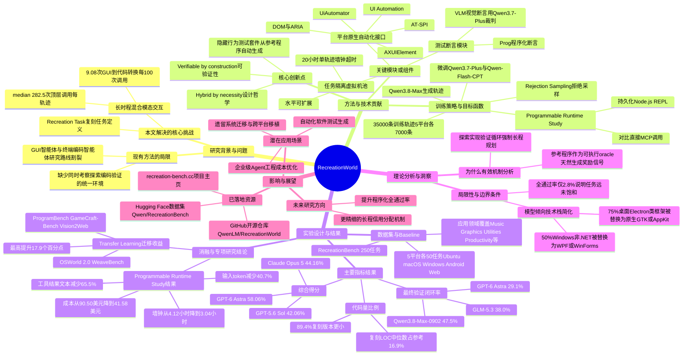

## 一、论文是干什么的？

想象一下，你被要求"照着一个正在运行的App，重新做一个功能一样的出来"——你不能看源代码，只能一边点这个App的各种按钮、菜单、设置项，一边猜它内部是怎么实现的，然后自己动手写代码，把它复刻出来，最后还要打开自己写的程序，跟原版一个一个功能地对比检查有没有做对。这就是这篇论文提出的核心任务，论文把它叫做「复刻任务」（Recreation Task）。

过去的AI智能体研究基本分成两条互不相干的路线：一类专门练"用鼠标键盘操作图形界面"（比如点按钮、填表单），另一类专门练"在终端里写代码"。但现实中的数字工作，比如一个真正的软件工程师去逆向理解一个老系统再重写，或者一个自动化测试员边点软件边写脚本，往往是这两件事交替进行、缺一不可的。这篇论文提出的RecreationWorld，就是要专门考察和训练这种「既要会操作界面，又要会写代码」的混合型智能体，而且覆盖了Ubuntu、macOS、Windows、安卓和网页这五个主流平台，规模和覆盖面都相当大。

## 二、核心方法与创新

### 1. 用「复刻」这件事同时逼出探索、编码和自我验证三种能力

论文设计任务的方式很巧妙：给智能体一句高层次的需求描述（比如"做一个和这个一样的计算器App"），再给它一个可以实际点击操作的参考程序（但看不到源代码），要求它交出一份能编译运行、且行为跟参考程序一致的完整源代码。整个过程被总结成一个"探索—实现—验证"的循环：智能体需要自己判断什么时候该去点点参考程序看效果、什么时候该回头写代码、写完之后又该怎么运行自己的程序去核对结果。论文统计发现，一条完整的任务轨迹平均要经历282.5次顶层工具调用，平均每100次调用里有9.08次是"从操作界面切换到写代码"这样的模态转换，说明这确实是个需要长时间、多轮来回折腾的任务，不是几步就能搞定的。

论文把这种设计称为"因为必要而混合"：任务的规格说明只能通过操作参考程序去猜出来，但最终交付物又必须是代码，两者天然绑在一起。同时它也是"天生可验证"的：因为有一个真实可运行的参考程序当"标准答案"，系统就可以自动从参考程序的行为里生成隐藏的测试用例，不需要人工逐条编写正确答案。

### 2. 可大规模扩展的执行基础设施

为了能同时跑成千上万个这样的任务，论文搭建了一套基础设施：每个任务分配一个独立隔离的虚拟机工作节点，这些节点可以在云端按需水平扩展；每台机器上都固定版本的图形环境和自动化接口，避免因为系统更新导致结果不可复现；每次任务允许智能体最多跑20小时（这是一个相当长的超时时间，说明任务确实很复杂）。不同平台用了各自原生的界面自动化协议——桌面端用AT-SPI、AXUIElement、UI Automation这类无障碍接口，安卓用UiAutomator，网页用DOM和ARIA标准——这样智能体拿到的界面信息更结构化、更可靠，而不是单纯靠截图猜。测试用例的生成和最终评测都会在全新的、干净的平台实例上进行，避免"作弊"或环境污染。

### 3. 用「拒绝采样」筛选出高质量训练数据，再微调出专用模型

在训练环节，论文先用一个更强的模型（Qwen3.8-Max）在开源GUI应用上生成大量尝试轨迹，然后用前面提到的"行为验证器"（也就是那套自动化测试）给每条轨迹打分，只保留分数高的轨迹留作训练数据——这个技术叫「拒绝采样」（Rejection Sampling），相当于让强模型多次尝试，只挑做得好的那些例子来教小模型。最终五个平台各挑出7000条高质量轨迹，一共35000条，用来微调两个基础模型：Qwen3.7-Plus和一个经过持续预训练的检查点Qwen-Flash-CPT。

### 4. 测试题怎么出：既看程序结果，也看长得像不像

RecreationBench（论文配套的评测基准）里每道题的测试分两类：一类是「程序化断言」（Programmatic Assertions），直接调用平台API去检查具体的文本内容、控件状态、数据是否正确保存下来了；另一类是「视觉断言」（VLM Assertions），靠一个视觉语言模型（用的是Qwen3.7-Plus充当裁判）去看画面渲染出来的布局、颜色、画布内容对不对。所有测试题目都先在真实参考程序上跑通验证过，并且经过人工复核后才会正式冻结进基准，保证测试本身不会出错。

### 5. 一个有意思的效率发现：给智能体一个"持久化的代码执行环境"更省钱更快

论文还做了一个专门的对比研究（第5.2节）：让Claude Opus 4.8在50个Windows应用任务上分别用"持久化的Node.js交互式解释器（REPL）"和"直接调用MCP工具"两种方式跑同样的任务。结果发现两种方式做出来的任务质量差不多，但用持久化REPL的方式能把工具返回结果的文本量减少65.5%，输入token减少40.7%（虽然输出token反而多了15.7%），整体耗时从平均4.12小时降到3.04小时，估算的每个任务成本也从90.5美元降到41.58美元。这说明给智能体一个能"记住状态、持续交互"的代码执行环境，比每次都通过标准协议来回传输大段文本要高效得多。

## 三、使用了哪些模型和计算资源？

**参与评测的模型（10个前沿模型，文中重点提及以下几个）：**
- GPT-6 Astra（评测中综合得分最高，58.06%）
- Claude Opus 5（44.16%）
- GPT-5.6 Sol（42.06%）
- Qwen3.8-Max-0902
- Claude Opus 4.8
- GLM-5.3
- Qwen3.7-Plus
- Qwen-Flash-CPT

**训练相关模型：**
- 轨迹生成模型：Qwen3.8-Max（用来在开源GUI应用上生成训练用的探索-编码轨迹）
- 视觉裁判模型：Qwen3.7-Plus（用于视觉断言判分）
- 被微调的目标模型：Qwen3.7-Plus 和 Qwen-Flash-CPT（一个持续预训练检查点）

**计算资源与耗时：**
论文明确提到的资源信息包括：使用"水平可扩展的虚拟机池"作为执行环境的基础设施，单个任务的最大允许时长为20小时（这是评测/训练轨迹采集时的墙钟超时上限，不是训练总时长）；在效率对比实验中给出了具体的墙钟耗时和成本数据——用持久化Node.js REPL平均每任务3.04小时、每任务约41.58美元，用传统MCP工具调用方式平均每任务4.12小时、约90.50美元。除此之外，论文没有披露具体的GPU型号、GPU数量、总训练卡时或总训练时长等信息，这部分**暂无相关信息**。

## 四、实验结果

论文用RecreationBench（250道题，5个平台各50道）对10个前沿模型做了评测，部分关键结果如下：

| 模型 | 综合得分 | 最终验证闭环率 |
|---|---|---|
| GPT-6 Astra | 58.06% | 29.1% |
| Claude Opus 5 | 44.16% | 23.6% |
| GPT-5.6 Sol | 42.06% | 暂无相关信息 |
| Qwen3.8-Max-0902 | 暂无相关信息 | 47.5% |
| GLM-5.3 | 暂无相关信息 | 38.0% |

几个值得注意的发现：

- 即使是得分最高的GPT-6 Astra，也只有2.8%的任务能做到"程序化测试全部通过"，说明这个任务确实很难，离满分还很远。
- 智能体写出来的代码普遍比参考程序简洁得多：中位数上，复刻出来的代码量只有参考程序的16.9%，89.4%的复刻版本比原版小，92.3%用了更少的文件，83.8%的情况会把代码都堆在一个最大的单文件里——这既说明模型倾向于"抓大放小"，抓住能通过测试的核心功能，也暴露出工程规范性上的短板。
- 模型在技术选型上也会"偷懒"：75%的Ubuntu/macOS上基于Electron、Tauri、Wails这类跨平台框架的参考程序，被智能体改用更原生的GTK/AppKit重写；50%的Windows非.NET程序被改成WPF或WinForms实现，说明模型更倾向于用自己更熟悉、更简单的技术栈去逼近效果，而不是严格还原原始技术选型。
- 用RecreationWorld的训练轨迹微调过的模型，在5个完全不同的分布外测试集（ProgramBench编程测试、GameCraft-Bench视觉编程、Vision2Web网页开发、OSWorld 2.0电脑操作、WeaveBench混合任务）上都取得了提升，最高提升幅度达到17.9个百分点，说明这套复刻训练确实能锻炼出可以迁移到别的任务上的通用能力，而不只是死记硬背当前的题目。
- 训练前后模型的行为模式也发生了变化：在ProgramBench上模型更倾向于每次Bash调用后就去验证结果，在GameCraft-Bench和Vision2Web上模型读图的比例上升，在OSWorld 2.0和WeaveBench上模型使用GUI操作的比例上升，说明训练确实让模型学会了"该探索的时候多探索、该验证的时候多验证"这种更合理的行为习惯。

## 五、潜在应用与已落地应用

**已经开放的资源：**
- 项目主页：[recreation-bench.cc](https://recreation-bench.cc)
- 代码仓库：[GitHub - QwenLM/RecreationWorld](https://github.com/QwenLM/RecreationWorld)
- 数据集：[Hugging Face - Qwen/RecreationBench](https://huggingface.co/datasets/Qwen/RecreationBench)
- 同步镜像：[ModelScope - Qwen/RecreationBench](https://modelscope.cn/datasets/Qwen/RecreationBench)

论文作者已经把基准、执行环境、任务题库以及训练用的轨迹数据都公开发布了，属于典型的"开源基准+开源数据"落地方式，方便学界和业界在统一标准下比较不同模型。

**潜在应用场景：**
- 训练能自主完成"逆向理解+重新实现"这类复杂软件工程任务的智能体，比如老系统迁移、跨平台移植、竞品功能复刻等真实工作场景。
- 作为评测标准，衡量一个通用大模型的"电脑使用能力"是否真的具备工程落地价值，而不只是停留在简单的点击操作或代码补全层面。
- 论文中验证的"持久化代码执行环境比逐次调用MCP工具更省钱更快"这一发现，可以直接指导智能体产品在工程实现上的架构选择，帮企业级Agent应用节省推理成本。
- 论文中的自动化测试生成思路（从一个可运行的参考系统里自动导出行为测试）也可能被借鉴到自动化软件测试、遗留系统文档化等领域。

## 六、网络上的讨论与评价

通过搜索发现，这篇论文目前主要出现在论文聚合与转载类站点上，例如HyperAI论文页、PapersWithCode、以及一篇总结性文章[Qwen releases RecreationBench benchmark](https://saudishopper.com.sa/en/qwen-releases-recreationbench-benchmark-ubuntu/)，该文章只是客观转述了RecreationBench的功能和用途（250个桌面自动化任务、开放在Hugging Face上供复现实验），没有包含第三方的评价或争议观点。

搜索还找到一个标题涉及Qwen的Hacker News讨论帖（"Something is afoot in the land of Qwen"），经核实其内容只是泛泛讨论Qwen系列模型的编程能力和本地部署体验，并未提及RecreationWorld或RecreationBench这篇论文本身。

综合来看，暂未找到针对这篇论文的实质性Reddit、Twitter/X或Hacker News社区讨论，目前公开可见的主要是论文页面本身和自动转载/聚合类网站的内容摘要。

## 七、思维导图

