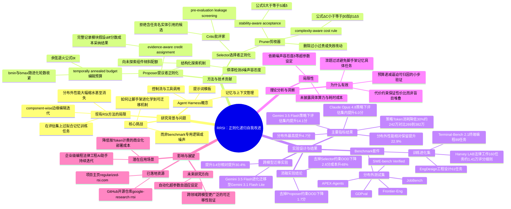

## 一、论文是干什么的？

现在很多所谓的智能体（Agent）产品，比如自动写代码的助手、自动处理法律文书的工具，背后并不是靠一个更聪明的大模型，而是靠一整套围绕大模型搭建的「脚手架」——包括给模型的提示词模板、任务怎么拆解、什么时候调用什么工具、怎么记住之前做过的事情等等。这套脚手架就像厨师手里的菜谱和厨具组合：同一个厨师（大模型），换一套更好的菜谱和摆盘流程，做出来的菜可能天差地别。

最近学术界流行让AI自己去改进这套脚手架：让一个AI系统不断地对脚手架做小修改、测试效果、保留有效的修改，循环往复，这被称为「递归自我改进」（Recursive Self-Improvement，RSI）。但问题来了——就像一个学生如果只是拼命刷一套模拟题，可能会把这套题的答案背下来，考试成绩飙升，但换一套新题就打回原形。这篇论文发现，现有的脚手架自我进化方法也有同样的毛病：在用来训练的那批任务上表现越来越好，但换到没见过的新任务（论文称为「分布外」任务）上，进步会大幅缩水甚至完全消失。这篇论文要解决的就是这个「刷题式过拟合」问题。

## 二、核心方法与创新

论文提出的方法叫RRSI（正则化递归自我改进），核心思路是给这个「自我进化」的过程加上几道「刹车」和「过滤网」，防止它跑偏去死记硬背具体的训练任务，而是逼着它学到真正通用、可迁移的改进技巧。整个系统分为「提议者」（Proposer）和「选择者」（Selector）两大块，各自都有约束机制。

**提议者这一侧的两个约束：**

第一个是「时间退火的编辑预算」。每一轮进化，提议者可以对脚手架打的补丁（也就是一次改动里能捆绑多少处修改）数量是有上限的，而且这个上限会随着进化轮数按余弦曲线逐渐收紧，公式是 $b_t = \lceil b_{\min}+(b_{\max}-b_{\min})\cdot\frac{1}{2}(1+\cos(\pi t/T))\rceil$。直觉上类似于：项目刚起步时允许大改大动，但越往后越要求「小步快跑」，每次只改一处，这样才能准确判断到底是哪一个改动带来了效果，不容易把「蒙对了」的噪声也当成有效经验保留下来。

第二个是「历史感知的探索鼓励机制」。系统会完整记录每一次尝试改了哪个模块、当初的假设是什么、具体改动内容、带来的分数和成本变化、最终是被接受还是拒绝。当进化陷入停滞（也就是几轮下来的进步幅度都在噪声容忍度 $\delta$ 以内时）系统会主动把提议配额留给那些还没被探索过的脚手架组件，避免所有努力都堆在同一个已经被反复修改过的模块上。

**选择者这一侧配了一个「批评家」和一个「剪枝器」：**

批评家（Critic）负责在正式跑评测之前做「泄题检查」：如果一个候选修改里直接写死了某个具体任务的名字、特定实体，或者针对某个基准测试量身定制的逻辑，就会被直接筛掉——这就像监考老师发现有学生的草稿纸上抄了标准答案的关键词，直接判定作弊、不予采纳。

剪枝器（Pruner）则负责事后清理，遵循「稳定性优先接受」原则（即新方案的得分 $\hat S(H')$ 必须不低于历史最好水平减去噪声容差，$\hat S(H') \geq S^*-\delta$，防止把一次运气好的噪声波动误判为真实进步），以及「复杂度代价约束」（新增的运行成本 $\Delta C$ 必须满足 $\Delta C \leq \beta_0+\beta_1\Delta S$，也就是说想要更贵的方案，就必须换来相应更大的分数提升，否则不划算）。同时也会主动删掉那些改动太小、太贵或者已经不再产生实际效用的旧改动，保持整个脚手架的精简。

打个类比：如果把普通的自我进化系统比作一个不加约束、只看短期考试分数的学生，什么捷径都愿意走，那么RRSI就相当于给这个学生配了一个既检查是否作弊（批评家）、又要求学习方法必须具备可迁移性和高性价比（剪枝器和预算限制）的严格班主任，逼着学生把功夫下在真正的基本功上。

## 三、使用了哪些模型和计算资源？

根据arxiv全文页面披露的信息：

- 用作被优化对象（也就是脚手架里被驱动执行任务的「策略模型」）的骨干大模型，主实验采用 Claude Opus 4.8；用于跨模型稳健性测试的还有 Gemini 3.5 Flash 和 Gemini 3.1 Flash Lite。
- 论文提出的进化系统本身（提议者、分析器、泄题批评家等组件）也使用 Claude Opus 4.8 来驱动。
- 论文中没有披露具体的GPU型号、GPU数量或本地算力集群信息，模型调用均通过API方式进行（Anthropic与Google的模型API）。
- 论文没有给出每一轮进化、每次评测或全部实验的具体墙钟时间（wall-clock time），也没有给出总训练/进化耗时。论文用「每次试验消耗的策略Token数」来衡量效率，例如RRSI平均每次试验消耗约242万Token，而未加正则化的基线方法消耗约269万到382万Token不等，即耗时或调用量方面暂无具体分钟/小时级别的数字，只有以上按Token量估算的相对效率对比。

暂无相关信息（关于GPU型号、机时、具体分钟/小时耗时）。

## 四、实验结果

论文在覆盖编程、办公自动化（agentic workspace）和工程设计三大类共八个基准测试上做了评估，其中三个用于「训练进化」（in-distribution），另外五个从未在进化过程中见过，用来检验泛化能力（out-of-distribution）。

| 场景 | 基准测试 | 结果 |
|---|---|---|
| 训练集（进化时用到）| Terminal-Bench 2.1（89个终端编程任务，以Claude Opus 4.8为策略模型）| 从74.2%提升到80.2%，提升6.0分 |
| 训练集 | Harvey LAB（160个法律工作任务，约1.41万条评分细则）| 有明显提升 |
| 训练集 | EngDesign（61个工程设计仿真任务）| 有明显提升 |
| 分布外（未参与训练）| SWE-bench Verified、JobBench、GDPval、APEX-Agents、Frontier-Eng 共五个 | 最高提升4.7分，平均比未加正则化的方法多保留约22.9%的分布外性能 |

除了效果之外，效率也有提升：RRSI进化出来的脚手架运行时消耗的策略Token数比不加正则化的版本少约30%（约242万 vs 269万到382万）。另外，论文换用能力较弱的Gemini 3.5 Flash作为策略模型重复实验时，因为起点更低、提升空间更大，Terminal-Bench 2.1的分数从64.6%提升到78.7%，提升幅度达到14.1分，这是论文中提到的最大单项提升数字（不是用Claude Opus 4.8做出来的）。

消融实验也验证了每个组件都有必要：去掉提议者一侧的约束（预算和探索鼓励），分布外性能下降1.7分；去掉选择者一侧的约束（批评家和剪枝器），分布外性能下降2.6分，同时运行成本反而上升了48%。

另外论文还做了跨模型迁移实验：用Gemini 3.5 Flash进化出来的脚手架，直接套到没见过的Gemini 3.1 Flash Lite上使用，依然能带来3.4分（相对提升30.4%）的效果，说明学到的改进确实具有一定的通用性，而不是针对某个特定模型量身定做的小聪明。

## 五、潜在应用与已落地应用

**潜在应用场景：**

- 企业内部的AI编程助手、法律文书助手、工程设计辅助工具，可以用这种「带刹车的自我进化」方式持续优化自己的工作流程，而不用担心换了新客户、新项目类型就完全失灵。
- 任何需要长期维护、多次迭代的智能体产品（例如客服机器人、数据分析助手），都可能借鉴这种「预算递减+批评家过滤+剪枝」的思路，避免团队在AB测试中被短期指标误导，做出只在内部测试集上好看、实际用户体验很差的「伪优化」。
- 由于该方法减少了运行时Token消耗（也就是降低了实际调用大模型的成本），对于需要大规模部署、按Token计费的商业化智能体系统而言，具有直接的降本意义。

**已落地/已公开的资源：**

- 论文作者公开了代码仓库 [github.com/google-research/rrsi](https://github.com/google-research/rrsi)，采用Apache 2.0协议开源，仓库内包含核心搜索逻辑、三个领域实例（终端编程Agent、文档办公Agent、工程设计Agent）、基于Git worktree的候选版本管理，以及支持多基准并行评测的框架。
- 论文还提供了项目主页 [regularized-rsi.com](https://regularized-rsi.com/)，介绍论文核心内容。

## 六、网络上的讨论与评价

通过搜索论文标题关键词与arxiv编号，找到了以下真实存在的讨论痕迹：

- 该论文已被提交至Hacker News（[讨论帖链接](https://news.ycombinator.com/item?id=49799183)），标题为「RRSI: Regularized Recursive Self-Improvement of Agent Harnesses」，由用户Betelbuddy发布，截至查阅时只获得1个点赞，暂无实质性的评论内容出现在帖子下方，讨论热度较低。
- 有第三方论文追踪站点（如awesomepapers.io、HyperAI、Papers with Code镜像站等）收录并转载了该论文的摘要信息，但均为自动化摘要聚合，没有观察到额外的原创评论或深入分析。
- 未搜索到Twitter/X、Reddit上有实质性的用户讨论或评价帖子。

总体来看，这篇论文目前在社区层面的讨论热度还比较有限，主要以论文聚合站点的收录为主，尚未观察到广泛的技术博客解读或社交媒体热议。

## 七、思维导图

