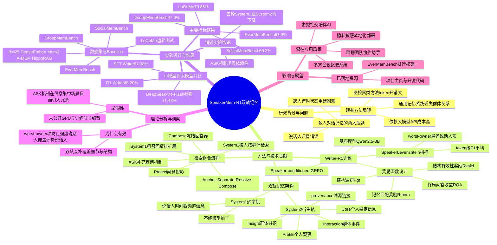

## 一、论文是干什么的？

想象你在一个几十人的微信群里潜水了大半年，某天有人问你：小李上个月说过要不要参加聚餐？你要回答这个问题，得先想起谁是小李、他到底说了什么、这句话是对谁说的、后来事情有没有变化。这对人来说已经很费脑子了，对AI助手来说更难，因为多人群聊里话题跳来跳去，同一句话可能被误记成别人说的，而且一个人前后说的话如果自相矛盾，AI还得知道以哪次为准。

这篇论文要解决的正是这个问题：**如何让AI在多人对话中长期、准确地记住谁说了什么、说给谁听、事情后来怎样了**。现有的通用记忆系统大多是为一对一聊天设计的，一旦放到群聊场景，经常会把话记错到别人头上（说话人归属错误），或者没办法把分散在不同人、不同时间点的线索拼到一起（关系理解和状态重建困难）。作者提出了一个叫**SpeakerMem-R1**的系统，专门针对多人对话场景，用双轨记忆加上强化学习训练出的小模型来记笔记，达到了比现有方法更好的效果。

## 二、核心方法与创新

### 2.1 双轨记忆架构：既要有逐字记录，也要有整理笔记

论文的核心思路可以类比成一个尽职的会议记录员，同时做两件事：

- **System 1（逐字轨）**：像录音笔一样，把每句话原封不动地记下来，附带说话人、时间戳、所在频道等信息，完全不经过语言模型加工，保证信息不失真、不遗漏。
- **System 2（衍生轨）**：像会议纪要一样，把原始对话提炼成结构化的笔记，分成四层：
  - 个人层面的**Core**（稳定的身份信息、事实、立场）和**Profile**（对这个人的观察、他人对他的看法）；
  - 群体层面的**Interaction**（跨人的事件、决定）和**Insight**（群体共识、规范）。

每一条衍生记录都写清楚：内容是什么、谁说的（source）、关于谁（owner）、属于哪一层、涉及哪个事件、什么时间、当前状态，以及指回System 1原始记录的溯源链接（from_ids）。这样即使衍生笔记整理错了，也能顺着链接回去核对原话，类似给会议纪要每一条都标注录音时间戳方便回放核实。

### 2.2 Writer-R1：用强化学习训练一个又小又准的记笔记模型

传统方法通常直接调用一个超大的通用大模型来做整理归纳的工作，成本高、也难以本地部署。作者反其道而行之，用一个只有30亿参数的小模型**Qwen2.5-3B**作为记笔记的写入器（Writer），并且用强化学习专门训练它，这个训练出来的模型叫**Writer-R1**。

训练用的算法是**Speaker-conditioned GRPO**（说话人条件化的组相对策略优化），是GRPO算法针对多人对话场景的改进版本。简单说，GRPO让模型对同一段对话生成多份不同的整理结果（论文里每次采样8条轨迹，即$G=8$），然后互相比较打分，好的写法获得更高奖励，从而不断调整模型的写作策略。

奖励函数设计得很讲究（原文公式9）：

$$r_{g,t} = w_{\mathrm{valid}} \cdot R^{\mathrm{valid}}_{g,t} + w_{\mathrm{mem}} \cdot R^{\mathrm{mem}}_{g,t} + P_{g,t} + w_{\mathrm{QA}} \cdot \gamma^{T-1-t} \cdot R^{\mathrm{QA}}_{g}$$

其中权重分别为$w_{\mathrm{valid}}=0.20$、$w_{\mathrm{mem}}=0.45$、$w_{\mathrm{QA}}=0.35$，折扣因子$\gamma=0.95$。这四部分分别对应：

1. **结构有效性奖励**（格式写得对不对）；
2. **记忆匹配奖励**（用下面要讲的SpeakerLevenshtein指标衡量记得准不准）；
3. **结构惩罚项**（避免写重复或者混乱的记录）；
4. **下游问答收益**（写完的笔记最终能不能帮AI答对问题，这个奖励按时间衰减，鼓励尽早写出有用的信息）。

### 2.3 SpeakerLevenshtein：一个专门为多人对话设计的评分尺子

论文提出了一个新指标叫**SpeakerLevenshtein**（公式7），用来衡量写出来的笔记和标准答案有多接近：

$$\Phi_{SL}(M, M^*) = 0.80 \cdot \frac{1}{|P|}\sum F_p + 0.20 \cdot \min(F_p)$$

这里$F_p$是针对每个人（owner）单独计算的token级F1分数，前半部分是所有人的平均分（权重0.80），后半部分特意取**最差的那个人的分数**（权重0.20）。这个设计很关键：如果群里有个话多的人和一个很少说话的人,单纯平均分容易被话多的人的高分掩盖话少的人被记错的问题，加入"最差表现"这一项就像考试里额外扣一个短板分,逼着模型对每个人都要记准，而不是挑着记。

### 2.4 检索阶段：Anchor–Separate–Resolve–Compose 四步法

有了记忆之后，回答问题时怎么把相关信息找出来？论文设计了一套四步检索流程：

1. **Project（投影/定位问题）**：分析问题涉及的主题、是问某个人（PERSON行）还是问群体（GROUP行）、需要看全部历史还是最近片段、有没有指定说话人和关注对象的约束；
2. **System 1检索**：先粗召回40条候选原话（$n=40$），再筛选排序找出真正必要的、扩展抓取上下文邻近消息，如果信息不够还会生成一个补充查询词做第二轮检索（ASK/Sufficiency机制）；
3. **System 2检索**：展开与问题相关的人物/群体行，在每一行内按事件检索，如果衍生层是空的就退回去用原始逐字记录兜底；
4. **Compose（组合呈现）**：把说话人、关注对象、时间、溯源信息都保留下来，一起交给一个**冻结不变的回答模型**（Frozen Answerer）生成最终答案，方便追溯每个答案是从哪条记录来的。

检索预算是固定的（避免无限制地喂信息）：System 1侧最终保留Top-10条原话，System 2侧每个人物/群体行保留2条记录、来源限定1条，两条轨道独立分配预算，互不挤占。

## 三、使用了哪些模型和计算资源？

**写入器（Writer）基座模型**：Qwen2.5-3B，通过SFT监督微调打底后，再用Speaker-conditioned GRPO强化学习训练成Writer-R1。

**用于对比的大模型写入器（作为性能参照上限）**：DeepSeek-V4-Flash。

**答案生成阶段用到的模型**：DeepSeek-V4-Flash 或 GPT-5.6-luna。

**用于自动判题（判断答案对错）的模型**：GPT-4o-mini；在EverMemBench基准上使用GPT-4.1-mini和Gemini-3-Flash联合判题。

**训练超参数**：每次采样8条轨迹（$G=8$）、共30个rollout训练轮次、每轮更新2个epoch、学习率$10^{-6}$、采样温度0.8、top-p为0.95、折扣因子$\gamma=0.95$。

**GPU型号、具体训练时长**：论文正文、项目主页（[https://2022hpsk.github.io/SpeakerMemR1](https://2022hpsk.github.io/SpeakerMemR1)）及GitHub仓库（[https://github.com/2022hpsk/SpeakerMemR1](https://github.com/2022hpsk/SpeakerMemR1)）均未披露具体使用了多少块GPU、什么型号、以及训练总耗时，暂无相关信息。

**推理开销（token消耗，间接反映成本）**：论文报告了每道问题平均消耗的token数，SpeakerMem-R1约为9713个token/问题，而对比方法BM25约1289个token/问题，Mem0/A-MEM/HippoRAG等方法则消耗14930到17402个token/问题——说明SpeakerMem-R1在准确率提升的同时，token开销控制得比多数图检索类方法更省。

## 四、实验结果

论文在三个新提出（或采用）的多人对话记忆基准，以及一个双人对话基准上做了评测，核心是"二选一判对错"的问答准确率：

| 基准数据集 | SpeakerMem-R1准确率 | 此前最好方法 | 提升幅度 |
|---|---|---|---|
| GroupMemBench（745道题，6类问题） | 47.9% | 44.6%（BM25最优） | 高3.3个百分点 |
| SocialMemBench（1031道题，9类问题） | 69.2%（论文按"每个基准挑选表现最好的SpeakerMem-R1配置"报告的标题成绩，具体是关闭ASK补充查询的变体）| 56.8%（A-MEM最优） | 高12.4个百分点 |
| EverMemBench（2400道题，9种行为标签） | 61.9% | 52.5%（BM25最优） | 高9.4个百分点 |
| EverMemBench官方排行榜 | 62.33% | —— | 当前最好成绩 |
| LoCoMo（1986道双人对话题，边界测试） | 70.85%（1407/1986题答对） | —— | —— |

对比的基线方法包括：BM25（关键词检索）、Dense Embed（语义向量检索）、Mem0、A-MEM、HippoRAG，以及LightRAG、RippleMem、EverOS等基于图结构的方法；在SocialMem上还对比了"给模型看全部原文"（Full Context）这个理论上限方法。

**小模型写入器 vs 大模型写入器的对比实验**（用305道留出的SocialMem问题，固定查询和答案条件下测试）：

| 写入器 | 准确率 |
|---|---|
| 只做监督微调的Qwen2.5-3B（SFT Writer） | 57.38%±0.33% |
| 经过强化学习训练的Qwen2.5-3B（R1 Writer，30步） | 68.20%±0.66%（提升10.82个百分点） |
| 大模型参照（DeepSeek-V4-Flash） | 71.48%±0.66% |

也就是说，一个只有30亿参数、可以在本地部署的小模型，经过强化学习训练后，**达到了大模型写入器95.4%的效果**，这是论文的一个重要卖点：不用依赖昂贵的大模型API也能做好记忆整理。

**消融实验**发现：去掉System 1（逐字记录轨）或去掉System 2（衍生结构轨）都会让三个基准的准确率下降，说明两条轨道各有各的用处、缺一不可；个人视角和群体视角的记忆也表现出互补效果。这里需要说明一点：上面表格里SocialMemBench的69.2%，用的是论文"每个基准分别选最优配置"报告的标题成绩（对应关闭ASK这一变体）；如果统一使用开启ASK的标准满配系统（这是消融实验里做对比的基准线），三个基准分别是47.9%、64.9%、61.9%。关闭"补充查询"机制（ASK）后，GroupMemBench和EverMemBench准确率略降（47.0%和60.5% vs 标准满配的47.9%和61.9%），但SocialMemBench反而从64.9%略微上升到69.2%，说明这个机制对信息分散的场景更有用，但在SocialMemBench这类场景下会引入冗余检索、反而干扰判断——这也是论文选择"分基准挑最优配置"来报告标题成绩的原因。

## 五、潜在应用与已落地应用

**潜在应用场景**：

- **群聊/团队协作AI助手**：企业内部微信群、Slack、Discord等多人群组场景中，帮团队快速回忆"谁在什么时候说过什么、决定了什么"；
- **虚拟社交陪伴类AI**：需要长期记住多个用户各自身份、立场、关系变化的社交类产品；
- **客服与多方会议纪要系统**：多人参与的客服会话或视频会议场景中自动整理归属清晰的结构化纪要；
- **本地化/隐私敏感部署**：由于Writer可以用30亿参数小模型本地跑，适合对数据隐私要求高、不方便调用云端大模型API的场景。

**已落地/已公开的资源**：

- 项目主页：[https://2022hpsk.github.io/SpeakerMemR1](https://2022hpsk.github.io/SpeakerMemR1)
- 开源代码仓库：[https://github.com/2022hpsk/SpeakerMemR1](https://github.com/2022hpsk/SpeakerMemR1)
- 论文在EverMemBench官方排行榜（由EverMind-AI维护）上取得了当前最佳成绩，说明其方法已被第三方评测体系纳入并验证。

## 六、网络上的讨论与评价

经过检索，除了HuggingFace Papers页面显示该论文获得了较高的点赞数（80票，并在论文页面本身标注为当日热门论文之一），暂未搜索到Reddit、X（Twitter）、Hacker News等平台上关于本论文的实质性讨论帖或深入评价。HuggingFace论文页面本身也没有展示用户评论区的具体讨论内容。因此关于本文的社区反响，目前只能确认其在HuggingFace上受到了较多关注，暂无找到进一步的网络讨论。

## 七、思维导图

