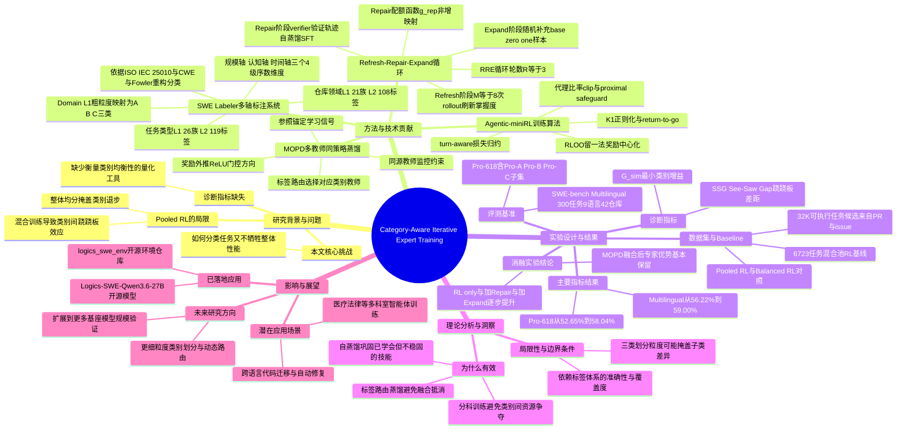

## 一、论文是干什么的？

想象一个刚入职的全能程序员，要同时负责修后台数据库的bug、修前端界面的显示问题、还要优化系统底层的运行效率。如果公司只给他一个笼统的"多写代码、多通过测试"的考核标准去训练他，很可能出现这种情况：他在修数据库bug上突飞猛进，但修前端问题的能力反而退步了，因为训练资源和注意力被最容易拿分的那类任务"抢走"了。这就是论文发现的核心问题：现在训练能自动写代码、改bug的AI智能体（也就是能像程序员一样操作代码仓库、跑测试、修bug的软件工程智能体）时，通常把各种各样的任务（修后端服务、修前端界面、修系统工具等）混在一起做强化学习训练，结果整体分数看起来在涨，但拆开来看，有些类别的任务其实在退步，只是被其他类别的进步"平均"掩盖了。

这篇论文的作者来自阿里巴巴集团，他们提出了一套"先分科培养专家，再把专家能力合并回一个通用模型"的训练方法。这就好比先把这位全能程序员送到三个不同的"专科培训班"（比如后端专科班、前端专科班、系统专科班），让他在每个专科里都练到位，然后再用一种巧妙的"知识融合"方式，把三位专科专家的本领全部教给同一个人，最终这个人既不偏科，样样都比之前更强。

## 二、核心方法与创新

整个方法可以拆成三大块：**怎么给任务分类**、**怎么训练每个类别的专家**、**怎么把多个专家合并成一个模型**。

**第一块：SWE Labeler（任务打标签系统）。** 论文首先要解决"任务到底该怎么分类"的问题。他们设计了一套多维度的标签体系，给每个代码任务打上七个维度的标签，包括任务类型（分成26个大类、119个细分小类，参照ISO/IEC 25010软件质量标准和CWE安全漏洞分类等权威标准）、代码仓库所属领域（21个大类、108个细分小类）、任务规模、认知难度、预计耗时等。这就像给病人做全面体检，不是简单说"生病了"，而是精确到"哪个器官、什么程度的问题"。有了这套细致的标签后，论文把仓库领域的一级标签进一步归并成三个大类：A类（偏服务端、数据、安全相关）、B类（偏用户界面/前端应用）、C类（偏系统底层、工具链、运行时环境），后续专家训练就按这三类来分工。

**第二块：Agentic-miniRL + Refresh-Repair-Expand（RRE）训练循环。** 对每一个类别，论文用一种叫Agentic-miniRL的强化学习算法训练专家模型——简单说就是让模型在真实的代码仓库环境里反复尝试解决问题（读代码、改代码、跑测试、看报错、再改），根据是否解决问题给奖励，用叫RLOO（一种通过"留一法"计算基准线来降低方差的技巧）的方式打分。但光靠强化学习会遇到"练着练着某些题型突然不会了"的问题，于是论文加入了RRE三步循环：

- **Refresh（刷新）**：用最新的模型对每道题重新试跑8次（$M=8$），重新评估这道题目前"掌握得怎么样"，掌握得太好或太差的题会被筛选调整；
- **Repair（修复）**：把上一轮强化学习里模型自己独立做对、且通过验证的解题过程收集起来，做一次自我蒸馏式的监督微调（SFT），相当于"让自己教自己"，把已经学会但不稳固的技能巩固住，用一个叫$g_{rep}$的配额函数决定每道题保留多少条轨迹；
- **Expand（扩展）**：在下一轮强化学习开始前，从"基础题库"里随机补充一些新的训练样本，防止模型只在一个小圈子里打转、逐渐固化偏科。

这样"训练—巩固—扩展"循环三轮（$R=3$），每个类别都能训出一个扎实的专科专家，不会出现"一边学一边忘"的现象。

**第三块：Label-Routed Multi-Teacher On-Policy Distillation（标签路由的多教师同策略蒸馏，简称MOPD）。** 三个专科专家训好后，怎么合成一个通用模型？论文的做法不是简单地把三个模型的参数平均或者做模型融合，而是让这三个专家分别当"老师"，根据任务的类别标签，把对应类别的老师"请"过来指导学生模型在这道题上的学习（这就是"标签路由"的含义——不同类型的题，请不同的专科老师来教）。蒸馏过程中还用了"奖励外推"（通过ReLU门控方向来判断该往哪个方向学）和"参照锚定"的学习信号，并且全程监控"同源教师"（也就是这些老师本来就是从同一个基础模型训出来的，蒸馏时要确保学生没有跑偏太远）。这样最终得到的单个模型，既保留了三位专家各自的绝对优势，又不会因为强行融合而互相抵消。

论文还提出了两个诊断指标来衡量"是不是在偏科"：$G_{sim}$（各类别里进步最小的那个类别的提升幅度，越高说明各类都在稳步进步）和SSG，即See-Saw Gap跷跷板差距（整体平均提升与最小类别提升之间的差值，越小说明各类别进步越均衡，不存在"拆东墙补西墙"的现象）。这两个指标就是论文用来证明"我们的方法真的让各科都变强了，而不是靠某一科的超常发挥撑起平均分"的关键证据。

## 三、使用了哪些模型和计算资源？

**基座模型：** 论文使用阿里巴巴的Qwen3.6-27B（一个270亿参数的稠密模型，即所有参数都参与每次计算，不是稀疏的混合专家结构）作为起点，最终训练出的模型命名为Logics-SWE-Qwen3.6-27B，已经开源发布在Hugging Face（[Logics-MLLM/Logics-SWE-Qwen3.6-27B](https://huggingface.co/Logics-MLLM/Logics-SWE-Qwen3.6-27B)），采用Apache-2.0许可协议。

**训练环境：** 论文中的强化学习训练是在真实的、容器化的代码仓库环境里进行的，使用一个名为RepoLaunch的系统通过Docker容器给模型提供可执行的仓库沙箱，让模型真的能跑代码、跑测试、看报错反馈。

**GPU型号、数量、具体训练时长：** 论文正文提到在"5.6节：训练基础设施与优化"部分会介绍相关配置，但公开的论文全文摘录中并未给出具体的GPU型号、GPU数量或以小时/天计的训练总时长等信息，暂无相关信息。同样地，论文中也没有透露每次rollout（模型尝试解题）平均耗时多久、或调用了哪家云服务商的API等细节，暂无相关信息。

**数据规模：** 训练用了从合并后的代码仓库PR（拉取请求）和关联issue（问题工单）中构造出的3.2万个可执行任务候选，其中用于"混合池强化学习"基线对比的任务混合集包含6723个任务。

## 四、实验结果

论文在两个评测基准上验证效果：

| 评测基准 | 基座模型分数 | 最终模型（MOPD）分数 | 提升幅度 |
|---|---|---|---|
| Pro-618（从SWE-bench Pro筛选出的618个任务，剔除了社区反馈的环境或测试有问题的样本） | 52.65% | 58.04% | +5.39个百分点 |
| SWE-bench Multilingual（覆盖42个代码仓库、9种编程语言的300个任务） | 56.22% | 59.00% | +2.78个百分点 |

Pro-618又进一步拆成三个子类：Pro-A（服务端/数据/安全类，221题）、Pro-B（用户界面类应用，201题）、Pro-C（系统底层/工具链/运行时，196题）。论文的关键发现是：如果直接用传统的"把所有任务混在一起做强化学习"（Pooled RL）来训练，虽然整体平均分也会涨，但拆开看某些类别（比如某一类系统底层任务）分数会不升反降，出现"跷跷板效应"——一头翘起来，另一头就压下去。而论文提出的"先分类训练专家、再用MOPD融合"的方法，能让$G_{sim}$（最弱类别的提升）明显提高、SSG（跷跷板差距）明显缩小，也就是说各类任务都在稳步变强，不再是拆东墙补西墙。论文还做了消融实验，逐步比较了"只做强化学习"、"强化学习+Repair自蒸馏"、"再加上Expand扩展样本"这几种配置，证明RRE循环里的每一步都对最终效果有实质贡献；同时也验证了MOPD融合后，三位专家各自的优势大部分都能保留到最终的单一模型里，而不是融合完就被"稀释"掉了。

## 五、潜在应用与已落地应用

**潜在应用场景：** 这套"按类别分专家训练、再融合"的思路不仅适用于软件工程智能体，理论上也能用于任何"任务类型天然存在多个差异较大的子领域"的智能体训练场景，比如医疗问诊助手（内科/外科/儿科等科室差异很大）、法律咨询助手（合同法/刑法/知识产权法等）、多语言客服助手等——只要任务能被合理分类、且不同类别之间存在"训练资源互相挤占"的风险，这套框架都有参考价值。对于企业内部的代码维护、自动修复bug、跨语言代码迁移等实际研发场景，这类模型可以直接用来辅助或部分替代人工完成仓库级别的代码修改任务。

**已落地应用：** 论文训练出的最终模型Logics-SWE-Qwen3.6-27B已经开源发布在 [Hugging Face（Logics-MLLM/Logics-SWE-Qwen3.6-27B）](https://huggingface.co/Logics-MLLM/Logics-SWE-Qwen3.6-27B)，采用Apache-2.0开源许可，任何人都可以下载使用。此外还能查到一个相关的开源仓库 [logics_swe_env](https://github.com/jzwilliams07/logics_swe_env)，据描述是该模型训练所用的开源SWE环境（软件工程任务的可执行环境构造代码）。

## 六、网络上的讨论与评价

经过检索，暂无找到关于这篇论文本身（"One to More, More to One"、"Category-Aware Iterative Expert Training"等关键词）在Twitter/X、Reddit、Hacker News等社区的实质性讨论帖。搜索结果中能找到的相关内容，主要是围绕论文所使用的基座模型Qwen3.6-27B本身在Hugging Face上的讨论帖（例如关于Qwen3.6-27B在SWE-bench Verified上达到高分、社区对Qwen团队的称赞等），但这些讨论针对的是基座模型本身，并非针对这篇具体的训练方法论文，因此不能算作对本论文的讨论。截至撰写本综述时，本论文尚未发现有博客解读、论坛热帖或社交媒体上的专门讨论，如实说明为暂无找到网络讨论。

## 七、思维导图

