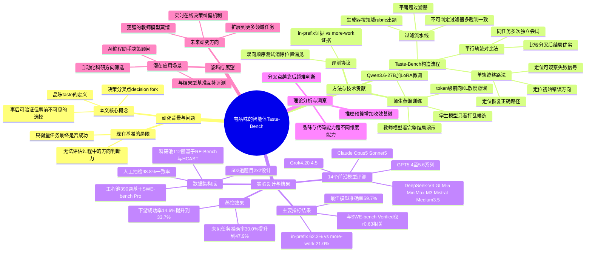

## 一、论文是干什么的？

想象你在装修房子，工头要不断做选择：先做水电还是先做防水，用A牌瓷砖还是B牌瓷砖。有经验的老师傅往往能在事情还没做完、结果还没出来之前，就凭直觉判断出哪条路更靠谱——这种能力可以叫做「品味」或者「判断力」。现在的AI智能体（比如帮你写代码、做科研实验的AI）也要完成很多需要连续做上百步决策的长任务，比如修复一个复杂的软件bug，或者设计一个实验方案。问题是，这些AI在关键的分岔路口，往往不知道该走哪条路才是「有品味」的选择，只有等到最后结果出来才后知后觉。

这篇论文要解决的问题就是：怎么科学地衡量一个AI智能体的「品味」好不好，以及能不能让它变得更好。作者们发现，现有的评测方式大多只看任务最终有没有成功（比如代码是否通过测试），却不衡量AI在半路上、结果还没揭晓时，选择方向的能力到底强不强。于是他们提出了一个新基准，专门考察AI在还看不到结局的时候，能不能选对方向。

## 二、核心方法与创新

论文的核心创新是构造了一个叫**Taste-Bench**的基准测试集，思路非常巧妙：不需要人工一条条去标注哪个决策是对的，而是从AI自己跑出来的真实任务记录（trajectory，轨迹）里自动「挖」出可以用来考试的题目。

具体做法是找「决策分叉点」（decision fork）——也就是轨迹中出现多条可能路径、且事后看只有一条能走向好结果的地方。论文用两种方式来挖掘这些分叉点：

**第一种：平行轨迹对比法。** 让AI对同一个任务独立尝试很多次（相当于让很多个「工头」分别去装修同一栋房子），然后找出这些尝试中途走向不同方向、但最终有的成功有的失败的地方。把「事后证明更好的方向」和「更差的方向」放在一起做成一道选择题，考AI能不能不看结局就选出更优的那条路。

**第二种：单轨迹绕路法。** 有些AI自己走弯路：先走了一条错误的路线，中途遇到明显的失败信号，然后调头，改用另一种做法并最终成功。论文用一个「生成器模型」在轨迹里自动定位三个关键事件：一开始选错方向的那一刻、观察到失败的那一刻、以及后来找到正确做法并恢复的那一刻。这样就能从单条轨迹里提炼出「原本该在哪个点上做出更好判断」的题目。

为了保证题目质量，论文设计了一套过滤流水线：
- **生成器**依据针对不同领域（工程/科研）定制的评分规则（rubric）产出候选题目；
- **平庸题过滤器**剔除那些光看题目文字表述、不用真正理解内容就能蒙对的题目；
- **不可判定过滤器**只保留那些让多个「裁判模型」在看完完整结局后依然能达成一致判断的分叉点，避免出题本身有争议。

最终整个基准由**502道题目**组成，按照「构造方式（平行/绕路）」和「领域（工程/科研）」做了2×2的交叉设计：工程类题目390道（来自517个SWE-bench Pro任务上跑出的2677条评分轨迹），科研类题目112道（来自METR的RE-Bench/HCAST共47个AI研发任务上跑出的1132条运行记录）。人工抽检100道题目后，与自动挖掘出的标签一致率高达98.8%，说明这套自动出题流程是可靠的。

考试的方式是：给AI呈现分叉点之前的上下文，加上两个候选走向（不透露结局），让AI判断哪个候选更优；而且为了排除「AI只是喜欢选第一个选项」这种位置偏见，同一道题会把两个候选的先后顺序换一遍，两次都答对才算真正掌握。

**第二个创新点是训练方法——师生蒸馏（teacher-student distillation）。** 既然「上帝视角」的裁判模型（教师模型）能看到完整结局从而知道哪个选择更好，那能不能把这种「事后诸葛亮」的判断力提炼出来，教给一个只能看到分叉点之前信息的「学生模型」呢？具体做法是：教师模型接收题目和「已知是更优的候选」的完整演示，学生模型则只能看到题目和两个打乱顺序、看不出结局的候选；训练时对教师模型生成的推理过程做**token级别的前向KL散度蒸馏**，让学生在不作弊（看不到答案）的情况下学会教师的判断路数。学生模型基于**Qwen3.6-27B**并使用**LoRA**适配器进行微调。

## 三、使用了哪些模型和计算资源？

- **被评测的前沿模型**：论文测试了14个前沿大模型，包括Claude系列（Opus 5、Sonnet 5）、GPT系列（5.4至5.6多个版本）、Grok（4.20、4.5）、DeepSeek-V4、GLM-5系列、MiniMax M3以及Mistral Medium 3.5。
- **蒸馏训练的基座模型**：学生模型基于**Qwen3.6-27B**，使用**LoRA**低秩适配器做参数高效微调；训练目标是token级别的前向KL散度蒸馏，教师模型是能看到完整结局的裁判/生成器模型（论文未明确指出教师具体用的是哪个基座模型型号）。
- **数据来源任务集**：工程领域用的是**SWE-bench Pro**（517个任务），科研领域用的是**METR**的**RE-Bench**和**HCAST**（47个任务）。
- **GPU型号、具体训练时长、API调用成本等信息**：暂无相关信息，论文正文未明确披露训练所用的GPU型号、数量、单次训练/评估耗时或总训练时长。

## 四、实验结果

论文的实验结果概括起来就是：现在最强的AI也远没有「老师傅」的判断力，而且看得越远、判断越差；但可以通过蒸馏训练明显改善。

| 指标 | 数值 |
|---|---|
| 表现最好的模型（GPT-5.6 Sol）准确率 | 59.7% |
| 证据在分叉点前文（in-prefix）时的准确率 | 62.3% |
| 证据要等到更晚（more-work，考验更长远判断）时的准确率 | 21.0% |
| Taste-Bench与SWE-bench Verified的相关系数 | r等于0.63（仅解释39%的方差） |
| 顶尖4个SWE-bench模型在Taste-Bench上的分差 | 相差10.7分（而SWE-bench上仅差4.0分） |
| 增加推理预算对GPT-5.6 Sol的影响 | 几乎无效，变化为负0.2分 |
| 增加推理预算对GPT-5.6 Luna的影响 | 提升有限，为正2.2分 |
| 蒸馏后学生模型在未见过的工程题目上的准确率 | 从30.0%提升到47.9%（提升17.9个百分点） |
| 在41个未见过的SWE-bench Pro任务上，用学生模型的建议辅助执行 | 成功率从14.6%提升到33.7%（提升19.1个百分点） |
| 若给出完全正确的建议（理论上限） | 成功率最多可提升24.4个百分点 |

简单说就是几个要点：
1. 目前没有一个AI模型能在这个「品味测试」上接近满分，说明这是一个普遍短板，不是某一家模型的问题。
2. 需要预判更长远后果的问题（more-work，即证据要靠后面更多工作才能验证）明显更难，说明AI越往远看越糊涂。
3. 单纯让模型「多想一会儿」（增加推理token预算）几乎不能解决这个问题，说明这不是靠简单堆算力就能补上的短板。
4. Taste-Bench的分数和常见的代码能力基准（SWE-bench）相关性并不强，说明「品味」和「写代码能力」是两种不同的本领，评测代码能力强不代表AI就会做长远决策。
5. 好消息是，通过师生蒸馏，确实可以把这种「品味」训练出来，并且能迁移到没见过的新任务上，还能实实在在提升下游任务的最终成功率。

## 五、潜在应用与已落地应用

**潜在应用方向：**
- 在AI编程助手、自动化科研（AI Scientist类系统）等长时间自主运行的智能体中，加入「品味打分」模块，在关键决策点先做多方案对比，选出更靠谱的方向再执行，减少走弯路浪费的时间和算力。
- 作为一种新的模型评测维度，与现有的「任务是否成功」类基准（如SWE-bench）互补，用来筛选那些「过程判断力强」而不只是「最终蒙对了」的模型。
- 蒸馏出的「品味」模块可以做成一个轻量级的「决策顾问」，实时插入到更大的智能体系统中，在每个关键节点给主执行模型提建议，而不需要让庞大的主模型自己重新训练。

**已知落地情况：**
- 论文已公开发布了代码仓库和数据集：代码见 [GitHub仓库](https://github.com/wbopan/tastebench)，数据集见 [Hugging Face数据集页面](https://huggingface.co/datasets/wenbopan/taste-bench)，方便社区复现和在此基础上继续研究。
- 论文的Hugging Face论文页面：[huggingface.co/papers/2609.25804](https://huggingface.co/papers/2609.25804)。

## 六、网络上的讨论与评价

通过检索Twitter/X、Reddit、Hacker News及技术博客等渠道，未能找到围绕这篇论文展开的实质性网络讨论或热议帖子。目前能确认的是该论文已被收录在HyperAI等论文聚合站点（[hyper.ai/en/papers/2609.25804](https://hyper.ai/en/papers/2609.25804)）以及Papers with Code（[paperswithcode.co/paper/2609.25804](https://paperswithcode.co/paper/2609.25804)），并在Hugging Face论文页面上获得了120个点赞，但页面本身未展示实质性的评论内容。由于未搜到有价值的社区讨论或评价文字，如实说明：暂无找到网络讨论。

## 七、思维导图

