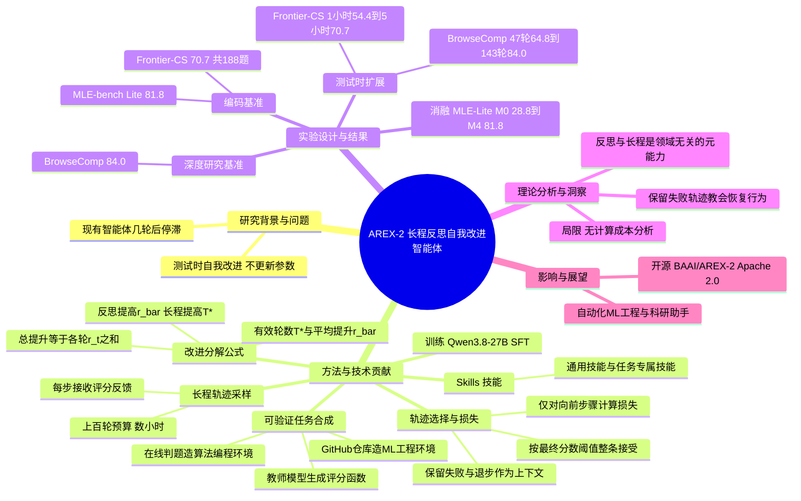

## 一、论文是干什么的？

先说一个日常场景：你写一篇作文，交给老师批改，老师给了分数和评语，你根据评语改第二稿，再改第三稿……真正厉害的学生，不是第一稿写得多好，而是**每一稿都比上一稿强，而且能一直改下去**，改十稿、二十稿还不会越改越乱。

这篇论文关注的正是大模型智能体的这种能力，称为**自我改进**（self-improvement）：在测试阶段（不再更新模型参数），让智能体反复提出方案、拿到反馈、反思、修订。论文把它拆成两个互补的本领：

- **反思**（reflection）：看了反馈之后，能真正做出一个比当前方案更好的新方案；
- **长程执行**（long-horizon execution）：在很多很多轮里一直保持有效，不会中途跑偏、陷入死循环或把已经做好的东西改坏。

这是 BAAI 此前 AREX 工作的续作。前作 AREX（见本站综述「AREX：面向深度研究的递归自我改进智能体」，arXiv 2607.21461）主要面向深度研究（搜索、答题）场景；而 AREX-2 把重点转向**长程、可量化反馈**的任务（机器学习工程和算法编程），并发现在这些任务上学到的「反思加长程」能力，可以直接迁移回深度研究任务。本篇是独立的新论文，下文不要求读者了解前作。

## 二、核心方法与创新

### 2.1 把「进步」拆成两个因子——像健身计划

论文用一个很简洁的式子描述自我改进。设 $s_t$ 是前 $t$ 轮中取得的**最好分数**，$s_0$ 是起点分数，$r_t$ 是第 $t$ 轮的期望提升，则总提升就是各轮提升之和：

$$
\mathbb{E}[s_T]-s_0=\sum_{t=1}^{T} r_t
$$

再定义「有效轮数」$T^*$（提升超过阈值 $\epsilon$ 的轮数）和「有效轮的平均提升」$\bar{r}$：

$$
T^*=\left|\{t\le T: r_t>\epsilon\}\right|,\qquad \bar{r}=\frac{1}{T^*}\sum_{t\le T:\,r_t>\epsilon} r_t
$$

这样总提升大致就是 $T^*\times\bar{r}$。用健身类比：想长肌肉，要么每次训练的效果更好（对应反思，提高 $\bar{r}$），要么能长期坚持训练不受伤、不断练（对应长程执行，提高 $T^*$）。过去的智能体往往两头都不行：几轮之后就没有新进展了，甚至越改越差。

注：以上公式与符号依据 arXiv HTML 全文整理，个别符号细节以原文为准。

### 2.2 去哪里学这两个本领？——找「有标准答案、能打分」的练习场

作者的假设是：反思和长程执行是**与领域无关**的通用能力，所以不必在目标领域里学，只要在「最容易提供监督信号」的场景里学就行。他们选了两类任务：

- **机器学习工程**（来自 GitHub 仓库）：比如给一个数据集，要训练出分数尽量高的模型；
- **算法编程**（来自在线判题系统 online judge）：题目有明确的评分函数。

这两类任务共同的好处是：每提交一次方案，都能得到明确的分数反馈，而且值得反复迭代很多轮。就像练钢琴有节拍器、练围棋有胜负，反馈清晰，才能学得出「怎么改」。

### 2.3 数据构造流水线

1. **造环境**：由一个「教师模型」把原始来源（GitHub 仓库或判题题目）转换成可执行的环境，包括任务描述和评分函数。教师模型具体是哪一个，暂无相关信息。
2. **验环境**：要求参考解法必须能跑通，而朴素基线的分数必须显著低于参考解，保证环境有「提升空间」。
3. **长程采样**：让智能体拥有上百轮、持续数小时的预算（相关页面表述为每个任务数百次工具调用量级），并具备三个条件：足够长的轮数预算；能查文档、搜代码来获取「操作性知识」；每一步都能看到反馈。
4. **按最终结果挑轨迹**：整条轨迹是否入选，取决于最终分数是否超过相对参考解的阈值，以及过程是否合规（格式正确、没有违规）。**关键设计：失败的尝试和退步没有被过滤掉**，而是保留在上下文里，让模型学会「搞砸了怎么恢复」。
5. **只对向前的步骤算损失**：训练时只对「推动方案前进」的决策施加监督，失败尝试只作为上下文出现，不被模型模仿。

生活类比：这就像带徒弟练手艺。不是只给他看「完美成品的制作视频」，而是让他看整个过程——中间师傅也做坏过、返工过——但只让徒弟模仿「做对的那几步」，同时记住「做坏之后是怎么补救的」。

### 2.4 技能（Skills）

论文还引入两类「操作性知识」：**通用技能**（提前从机器学习仓库和常见实践中整理好）与**任务专属技能**（针对具体任务去检索相关信息而成，但不包含任务本身的答案材料）。这些技能在造数据和模型推理时都可以用，相当于「给学生配一本参考手册」。

### 2.5 训练方式与迁移

模型以 Qwen3.8-27B 为底座，用新造的长程轨迹，加上前作 AREX 的**深度研究数据**（未改动）混合后做监督式模仿学习（SFT）。**深度研究类基准没有加入任何新的训练数据**，所以在 BrowseComp 等任务上的提升，被作者解释为从编程和机器学习任务迁移过来的元能力。

## 三、使用了哪些模型和计算资源？

| 项目 | 信息 |
|---|---|
| 基础模型 | Qwen3.8-27B（约 270 亿参数；模型卡标注上下文长度 262,144 tokens，支持文本与图像输入） |
| 训练方式 | 在合成长程轨迹与 AREX 原有深度研究数据的混合上做监督微调（模仿学习） |
| 教师模型 | 暂无相关信息（论文称由「教师模型」造环境并生成轨迹，未查到具体型号） |
| 训练 GPU 型号与数量 | 暂无相关信息 |
| 训练总时长 / GPU 小时 | 暂无相关信息 |
| 训练轨迹数量、环境数量 | 暂无相关信息 |
| 单个任务的推理预算 | Frontier-CS：每个任务最多 5 小时；MLE-bench Lite：每个任务最多 12 小时（遵循 OpenMLE 协议）；非编程任务：内循环最多 300 轮、总共最多 1500 轮 |
| BrowseComp 扩展分析的轮数 | 47 轮到 143 轮（见下文） |
| 开源情况 | 模型权重 [BAAI/AREX-2](https://huggingface.co/BAAI/AREX-2)（Apache 2.0 许可）；代码仓库 [VectorSpaceLab/AREX-2](https://github.com/VectorSpaceLab/AREX-2)（评测运行器和数据集定义，Apache-2.0，未见训练代码）；模型卡建议用 vLLM 或 SGLang 部署，但未给出具体 GPU 配置 |

论文正文没有提供明确的计算成本或延迟分析。以上「暂无相关信息」表示在现有材料中未出现相关内容，并非确认不存在，不排除原文附录中另有说明。

## 四、实验结果

AREX-2（27B）的主要成绩如下（数值来自 arXiv 全文与摘要）：

| 基准 | AREX-2 | 说明 |
|---|---|---|
| MLE-bench Lite | 81.8 | 机器学习工程，每任务最多 12 小时 |
| Frontier-CS（188 题 Agent Track） | 70.7 | 算法编程，每任务最多 5 小时；论文称比所报告的最强开源权重基线高 16.0 分，距最强闭源系统差 5.7 分（表中最强闭源为 GPT-5.6 Sol 的 76.4） |
| BrowseComp | 84.0 | 前作 AREX-Base（122B-A10B）为 82.5 |
| HLE（仅文本子集） | 52.6 | 前作 AREX-Base 为 52.4 |
| GAIA | 92.2 | 前作 AREX-Base 为 85.4 |
| DeepSearchQA | 93.8 | 前作 AREX-Base 为 89.9 |

几点值得注意：

- **用更小的模型超过更大的前作**：27B 的 AREX-2 在四个深度研究基准上都超过 122B 总参数的前作 AREX-Base，而且没有加新的深度研究数据。
- **仍落后于顶级闭源模型**：论文自己承认在 BrowseComp 与 HLE 的最好成绩上仍与最强闭源模型有差距；论文表格中 BrowseComp 与 HLE 的最好成绩也仍由闭源模型保持。
- **测试时扩展曲线持续上升**：在 Frontier-CS 上，预算从 1 小时增加到 5 小时，得分从 54.4 升到 70.7（加 16.3 分）；论文称它起步并不最高，但随预算增加逐步反超。在没有外部正确性反馈的 BrowseComp 上，从 47 轮增加到 143 轮，准确率从 64.8% 升到 84.0%（加 19.2 分）；论文还拿前作 AREX-122B 做了对比，后者在相近轮数下增幅明显更小（具体数值以原文为准）。

### 消融实验（MLE-bench Lite，逐步叠加）

| 阶段 | 模型 | 技能 | 轮数预算 | 得分 |
|---|---|---|---|---|
| M0 | Qwen-27B（未训练） | 无 | 基础 | 28.8 |
| M1 | Qwen-27B | 通用技能 | 基础 | 41.2 |
| M2 | Qwen-27B | 任务专属技能 | 延长 | 68.2 |
| M3 | AREX-2 | 任务专属技能 | 基础 | 75.8 |
| M4 | AREX-2 | 任务专属技能 | 延长 | 81.8 |

读法：技能和更长的轮数预算本身就能让未训练的底座提升很多（28.8 到 68.2），但**训练**在此基础上仍带来明显增益（M2 到 M4 加 13.6 分），而且训练过的模型能更好地利用更长的预算（M3 到 M4 加 6.0 分）。

说明：不同来源对部分对比基线的名称和分数转述不完全一致，因此上表只列了能互相印证的数字，对比基线的细节请以原文表格为准。

## 五、潜在应用与已落地应用

**潜在应用：**

- **自动化机器学习工程师**：给定数据集和评分标准，智能体连续数小时自己调参、改特征、改模型、看结果、再改。
- **竞赛编程与代码优化**：在评测反馈明确的场景里反复迭代解法。
- **深度研究与信息检索**：论文显示反思能力能迁移，对没有标准答案反馈的长链条搜索也有帮助。
- **科研助手**：「提出假设、跑实验、读结果、改进」本身就是一个长程反思循环。

**已落地情况：**

- 模型权重已在 HuggingFace 发布（[BAAI/AREX-2](https://huggingface.co/BAAI/AREX-2)，Apache 2.0），也有社区转的量化版本（如 numsu/AREX-2-27B-INT8-W8A16）。
- 评测代码已在 [GitHub](https://github.com/VectorSpaceLab/AREX-2) 开源，包含 BrowseComp、GAIA、HLE 等数据集的评测运行器。
- 除此之外，没有查到商业产品中已部署该模型的公开信息。

## 六、网络上的讨论与评价

- 论文在 HuggingFace Papers 周榜（2026 年第 40 周）上有 123 个点赞。
- 技术社区文章：DEV Community 上有一篇 [AREX-2 解读文](https://dev.to/prabhakar_chaudhary_7afe4/arex-2-advancing-self-improving-llm-agents-via-long-horizon-reflection-3d18)，整体是正面介绍，把长程推理和测试时扩展视为下一个前沿，没有提出批评。该文还声称模型能在 30 轮里持续改进，并与 GPT-4o 作对比，这些具体说法未在论文中得到证实，请谨慎看待。
- 搜索结果里还有一些 GitHub 上个人整理的论文索引与模型页面镜像，以及一则 2026 年 9 月 30 日的 Reddit 讨论线索，但没能获取到实质性的讨论内容。
- 未检索到来自 Hacker News、X 的针对该论文的实质性评论。因此，社区的批评性意见目前暂无相关信息；论文自己承认的局限包括：与顶级闭源模型仍有差距，以及没有计算成本分析。

## 七、思维导图

