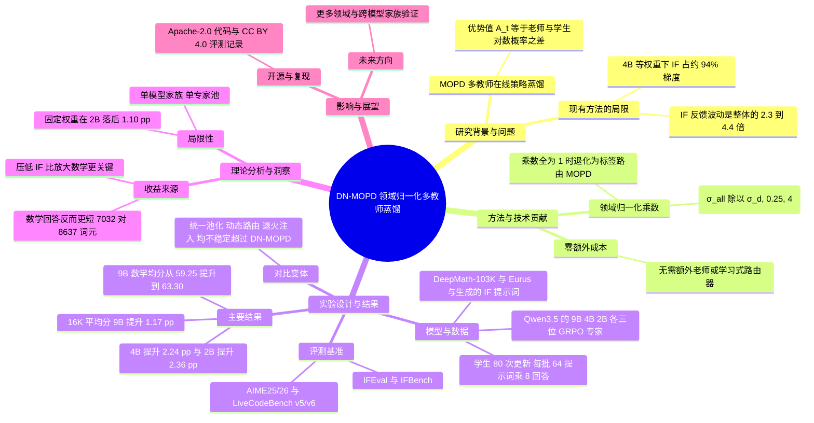

## 一、论文是干什么的？

想象一所学校里有三位特级教师：数学老师、编程老师、写作规范（指令遵循）老师。现在要培养一个「全科学生」，让他同时学会三门课。现实中的做法是：学生自己先做一道题（这叫「在线策略」，也就是学生用自己的答案来被评价），然后由对应科目的老师逐字逐词地点评「这个词你写得对不对、该不该这么写」。这套办法叫 **多教师在线策略蒸馏**（Multi-Teacher On-Policy Distillation，简称 MOPD）。

问题出在「点评力度不均衡」。论文发现，指令遵循老师的点评起伏特别大（评分波动幅度是数学老师的好几倍），学生被它的声音淹没，结果数学老师教的东西几乎没学进去，合并后的学生甚至打不过单个最强的老师所训练出来的学生。作者提出 **DN-MOPD**（Domain-Normalized MOPD）：每个批次里先量一量各科老师点评的「音量」，再把每门课的音量调到同一水平线上，之后照常训练。整个改动只多了一步计算，不需要额外的老师、不需要额外调用老师模型、也不需要训练路由器。

## 二、核心方法与创新

### 1. 先理解 MOPD 的反馈长什么样

学生在某道题上生成一串词元（token）。对每个词元，对应领域 $d$ 的专家老师会给出一个「优势值」，论文中定义为老师与学生对该词元的对数概率之差：

$$A_t = \log p_{T_d}(y_t \mid h_t) - \log \pi_u(y_t \mid h_t)$$

大白话：老师觉得这个词越应该出现、而学生越没把握，这个差值就越大，学生就越要往老师那边靠。这相当于一个「逐字批改」的信号。

### 2. 发现问题：不同领域的信号「音量」差很多

作者统计了每个领域里这些对数比值的标准差：

- 指令遵循（IF）的波动幅度是合并后整体波动的 2.3 到 4.4 倍。
- 数学的波动幅度只有整体的约 0.5 倍。
- 在等权重训练时，以初始 4B 学生为例，指令遵循那部分损失贡献了约 94% 的合并梯度（来自作者的统计）。

生活类比：三个人同时在会议室讲话，其中一个人用扩音器，另外两个人根本听不见。

### 3. 解决办法：领域归一化（Domain Normalization）

每个批次内，用 $\sigma_d$ 表示领域 $d$ 中所有有效响应词元的对数比值的总体标准差，用 $\sigma_{\mathrm{all}}$ 表示把所有领域的词元混在一起算出的标准差。每个领域的乘数为：

$$w_d = \mathrm{clip}\left(\frac{\sigma_{\mathrm{all}}}{\sigma_d},\ 0.25,\ 4\right), \qquad \widetilde{A}_t = w_d A_t$$

也就是：音量大的领域被调小，音量小的领域被调大，并且限制在 0.25 倍到 4 倍之间防止调得太极端。归一化后的优势值再送进原本的带截断的策略梯度目标。当所有乘数都等于 1 时，DN-MOPD 就退化成普通的按标签路由的 MOPD。

典型现象是：数学乘数被放大（约 2 倍上下），代码接近 1，指令遵循经常被压在 0.25 的下限（作者也承认这意味着指令遵循没有被完全拉平）。

### 4. 对比的其他方案

论文还对比了几种思路，都没能稳定超过 DN-MOPD：

- 统一池化（对多个老师的概率取平均）：相对变化在 -0.41 到 +0.30 个百分点之间。
- 动态路由（按响应选老师）：-0.25 到 +0.28 个百分点。
- 退火注入（早期先模仿）：-0.24 到 +1.11 个百分点，但始终低于 DN-MOPD。

## 三、使用了哪些模型和计算资源？

| 项目 | 内容 |
|---|---|
| 基础模型 | Qwen3.5，三个尺寸：9B、4B、2B（学生与老师同尺寸） |
| 老师（专家） | 每个尺寸各训练 3 个 GRPO 专家：数学、代码、指令遵循 |
| 训练数据 | 数学：DeepMath-103K 提示词；代码：Eurus 提示词；指令遵循：生成的提示词；学生训练共 2,700 条提示词（每个领域 900 条） |
| 专家训练 | 各专家的更新次数不同：9B 为数学 250、代码 200、指令遵循 400；4B 为 320、300、400；2B 三个领域均为 400。候选 rollout 批为 128 个提示词乘 8 条回答，优化器全局批为 256 条回答；温度 1.0，提示词上限 2,048 词元，回答上限 8,192 词元；学习率 $10^{-6}$（5 次预热后恒定），Adam betas 为 (0.9, 0.98)，权重衰减 0.1 |
| 学生训练 | 主实验 80 次更新（延长实验为 160 次），每批 64 个提示词乘 8 条回答，共 512 条；学习率与优化器同专家 |
| 代码与框架 | 官方 [GitHub 仓库](https://github.com/LiXin97/DN-MOPD) 基于 Uni-OPD 与 miles 训练框架，用 SGLang 做 rollout 与老师服务，用 vLLM 做评测；Python 3.12、torch 2.11 |
| GPU | 仓库说明训练在单节点 8 块 GPU 上（GPU 0 到 3 用于 actor 与 rollout，GPU 4 到 6 用于老师服务）；**GPU 型号：暂无相关信息**（论文正文、项目页与仓库摘要中均未找到） |
| 耗时 | **每次训练或评测的耗时：暂无相关信息**。论文只说明更新次数，未公布墙钟时间；归一化本身只多算两个标准差，开销可忽略 |

注：GPU 型号和耗时暂无相关信息，并非确认不存在，只是现有材料中未给出。

## 四、实验结果

评测基准共六个：数学用 AIME25/26，代码用 LiveCodeBench v5/v6，指令遵循用 IFEval-541 和 IFBench-300。评测时的最大回答长度上限分别设为 16K 和 8K。

### 1. 六项平均分（16K 上限）

| 尺寸 | 按标签路由的 MOPD | DN-MOPD | 提升（百分点） |
|---|---|---|---|
| 9B | 58.4 | 59.6 | +1.17 |
| 4B | 50.3 | 52.5 | +2.24 |
| 2B | 26.6 | 29.0 | +2.36 |

在 8K 上限下提升更大，三个尺寸约为 +2.47 到 +3.08 个百分点。数学是恢复最明显的领域。DN-MOPD 在每个尺寸上都超过了最强的单老师基线，而普通的标签路由 MOPD 没有做到（该句来自此前的网页摘要，未在原文逐字核对）。

### 2. 9B 模型分领域分数（论文表 1，16K 上限，各领域为其两个基准的平均）

数学为 AIME25 与 AIME26 的平均，代码为 LiveCodeBench v5 与 v6 的平均，指令遵循为 IFEval 与 IFBench 的平均（由原表分基准数值换算，三领域再平均即得六项总分）。

| 方法 | 数学 | 代码 | 指令遵循 |
|---|---|---|---|
| 初始模型 | 60.15 | 53.15 | 58.10 |
| 数学专家 | 64.55 | 51.40 | 58.60 |
| 代码专家 | 61.95 | 56.40 | 58.45 |
| 指令遵循专家 | 57.55 | 52.75 | 64.30 |
| 标签路由 MOPD | 59.25 | 54.70 | 61.20 |
| DN-MOPD | 63.30 | 53.85 | 61.60 |

可以看到：普通 MOPD 的数学只有 59.25，比初始模型还低，几乎没从数学专家（64.55）那里学到东西；DN-MOPD 把数学拉到 63.30，指令遵循也略有提升，代码略有下降。

### 3. 关键消融

- 只下调指令遵循的权重，在 16K 上限下 4B 和 2B 分别找回约 1.79 和 2.19 个百分点；只上调数学的权重分别只找回约 1.20 和 0.27 个百分点。说明收益主要来自「压住嘈杂的老师」，而不是「给数学加音量」。
- 固定权重（乘数 2、1、0.25，对应数学、代码、指令遵循）在 2B 上比逐批估计落后 1.10 个百分点。
- 数学提升并不是靠「写得更长」：数学回答的平均长度从 8,637 缩短到 7,032 词元（标签路由对比 DN-MOPD）。

### 4. 局限性（作者自述）

- 每个尺寸只用了一个专家池，只在一个模型家族（Qwen3.5）内验证；三个随机种子只覆盖学生训练，没有覆盖专家重新训练。
- 收益依赖于老师与学生的具体配置。
- 裁剪边界没有按尺寸调参，指令遵循的乘数经常撞到 0.25 的下限。
- Hugging Face 模型卡还提示：这套方法并非整体最好的整合方案（对比 SeqKD-SFT 等替代方案），且只涉及三个领域、单一随机种子。

## 五、潜在应用与已落地应用

潜在方向：

- 把多个领域的强化学习专家合并成一个通用模型，是大模型后训练的常见需求，DN-MOPD 的归一化可以作为一个几乎无成本的插件。
- 任何「多个信号源规模不一」的多任务蒸馏（比如再加入工具调用、安全对齐等老师）都可以参考这种按波动幅度调权重的思路。

已落地情况：

- 作者已开源代码，采用 Apache License 2.0，并提供评测记录（CC BY 4.0）。
- 作者在 Hugging Face 上发布了多个模型，例如 [DN-MOPD-Qwen3.5-9B](https://huggingface.co/XINLI1997/DN-MOPD-Qwen3.5-9B)（还有 4B、2B 以及 160 次更新版本）。
- 是否已被工业界产品采用：暂无相关信息。

## 六、网络上的讨论与评价

- 未检索到来自 Hacker News、Reddit、X 等的针对这篇论文的实质性讨论（论文发布才几天）。
- 公开可见的内容只有论文页面、项目页（[lixin.ai/DN-MOPD](https://lixin.ai/DN-MOPD/)）、[GitHub 仓库](https://github.com/LiXin97/DN-MOPD)，以及聚合站 [hyper.ai](https://hyper.ai/en/papers/2609.35347) 的收录。
- 同期有一批同方向的论文，说明这是热点：例如 [MOPD 原论文](https://arxiv.org/abs/2606.30406)、[Open-MOPD](https://arxiv.org/pdf/2608.19098)、[MOPD-Router](https://arxiv.org/html/2609.30837)、[D3-MOPD](https://www.alphaxiv.org/abs/2608.24987) 等，它们分别从能力失衡、路由、领域调度等角度改进 MOPD。它们与 DN-MOPD 的具体关系尚未核实。

## 七、思维导图

