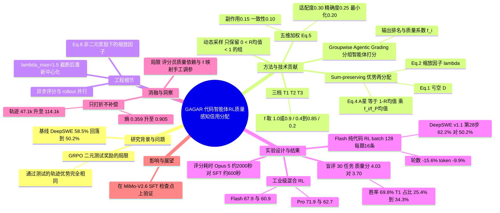

## 一、论文是干什么的？

先说一个生活类比。假设你在带一群学生做编程作业，评分规则只有一条：「程序能通过所有测试用例就给满分」。结果会怎样？有的学生写了十行干净利落的修改，有的学生改了五百行、顺手还把无关的文件也动了一遍，只是碰巧也通过了测试。按规则，两人都是满分。时间一长，学生就学会了「只要过测试，怎么折腾都行」，代码越写越啰嗦、越改越乱。

现在主流的代码智能体强化学习（RL）就有这个问题。常用的 GRPO（Group Relative Policy Optimization，组相对策略优化）会让模型对同一道题采样一组（一个 group）解法，用「是否通过测试」当奖励，组内通过的解法拿到**完全相同**的优势值（advantage，可以理解为「这次表现比平均水平好多少」）。于是，写得漂亮的补丁和写得拖沓、带副作用的补丁得到同样的鼓励。

这篇论文提出 GAGAR（Groupwise Agentic Grading and Advantage Redistribution），核心想法是：在「通过测试」之外，再请一位「会动手检查的评分老师」把同一组里所有通过测试的方案放在一起比较、排名，然后根据排名把奖励分得不一样，同时保证奖励的总量不变。论文来自小米 MiMo 团队（作者署名 Xiaomi LLM Core），并且在小米自家的 MiMo-V2.6 系列模型上验证；论文是在 MiMo-V2.6 系列的 RL 前 SFT 检查点上做工业级规模的验证。论文正文并未明确说该方法已进入小米的正式生产训练流程。

## 二、核心方法与创新

### 1. 整体流程：像「一场有评委的比赛」

对每道题，模型先产出 $n=16$ 条轨迹（trajectory，即智能体一次完整的修改代码过程），测试会把它们分成两类：通过的集合 $\mathcal{P}$ 和失败的集合 $\mathcal{F}$。GAGAR 在此基础上做三件事：

1. **动态采样**（dynamic sampling）：只保留「既有通过又有失败」的组，即组平均奖励 $0<\bar R<1$。如果一组全对或全错，大家的优势都是 0，学不到东西，直接丢掉。
2. **智能体评分员联合打分**（groupwise agentic grading）：把同一组所有轨迹放进同一个共享工作区，评分员（一个能读文件、能跑命令的智能体）逐条回看轨迹摘要、读相关片段、交叉核对补丁，必要时还会跑针对性的检查，最后只对**通过测试的**候选排名，并给出带证据引用的质量系数 $f_i$。
3. **总量守恒的优势再分配**（sum-preserving advantage redistribution）：把排名靠后的方案的优势打折，再把「省下来的」优势按比例分给所有通过的方案，让通过方案的正优势总和和原来一样。

类比：老师手里有一份固定的「奖学金池」，原本通过测试的同学平分。现在老师发现有人的作业质量不高，就少发一点，但并不把钱收回，而是按质量比例重新分给大家，于是写得好的同学拿到的比原来更多，总额不变。

### 2. 为什么要「总量守恒」

只下调低质量方案的优势、不补回去，会让一个组里优势的总和变成负数（论文里的亏空 $D$），整个组变得「偏惩罚」。论文的消融实验显示，这种「只打折不补偿」的做法会让策略熵（policy entropy）暴涨、轨迹越来越长，训练不稳定。总量守恒则相当于只改变「谁拿多少」，不改变「总共发多少」。

### 3. 关键公式（按论文编号）

组内平均中心化的结果优势为 $A_i = R_i - \bar R$，其中 $\bar R = n^{-1}\sum_j R_j$。

对通过的轨迹按质量系数 $f_i$ 打折后，会出现一个亏空（论文 Eq. 1）：

$$
D = \sum_{i\in\mathcal{P}} (1-f_i)A_i \ge 0
$$

再用缩放因子 $\lambda$ 重新放大（论文 Eq. 2）：

$$
\lambda = \frac{S_+}{\sum_{j\in\mathcal{P}} f_j A_j},\qquad
A^*_i=\begin{cases}\lambda f_i A_i, & i\in\mathcal{P}\\ A_i, & i\in\mathcal{F}\end{cases}
$$

其中 $S_+$ 是原来通过轨迹的正优势总和。等价地（论文 Eq. 4）：

$$
A^*_i=(1-\bar R)\cdot\frac{f_i}{\bar f_{\mathcal{P}}},\qquad \bar f_{\mathcal{P}}=|\mathcal{P}|^{-1}\sum_{j\in\mathcal{P}} f_j
$$

这个形式有三个好处：通过轨迹的优势总和不变（仍为 $S_+$）；两条通过轨迹的优势之比正好等于它们质量系数之比；失败轨迹的优势一点不动。

### 4. 评分员怎么打分

评分员从五个维度评价通过测试的方案，权重如下（论文 Eq. 5）：

$$
W_i = 0.30\,s^{\mathrm{app}} + 0.25\,s^{\mathrm{prec}} + 0.20\,s^{\mathrm{min}} + 0.15\,s^{\mathrm{side}} + 0.10\,s^{\mathrm{style}}
$$

| 维度 | 权重 | 直观理解 |
|---|---|---|
| 方案适配度（approach suitability） | 0.30 | 思路对不对路，是不是在解决真正的问题 |
| 实现精确度（implementation precision） | 0.25 | 代码细节是否准确到位 |
| 改动最小化（minimality） | 0.20 | 有没有多改、乱改 |
| 无意外副作用（unintended side effects） | 0.15 | 有没有悄悄破坏别的功能 |
| 代码库一致性（codebase consistency） | 0.10 | 风格、约定是否跟项目一致 |

得到排名后，轨迹被分成三档：第一档 $\mathcal{T}_1$（强，$f_i$ 取 1.0 或 0.9）、第二档 $\mathcal{T}_2$（中等，$f_i$ 在 0.4 到 0.85 之间）、第三档 $\mathcal{T}_3$（有重大缺陷，$f_i=0.2$）。据论文附录，Flash 实验使用的参数为 $f_{\mathrm{runner}}=0.9$、$f_{\min}=0.4$、$f_{\max}=0.85$、$f_{\mathrm{low}}=0.2$，缩放上限 $\lambda_{\max}=1.5$（缩放因子被截断为 $\min(\lambda,\lambda_{\max})$，之后再重新中心化以保持组内零和）。

### 5. 工程上的几个小心思

- 评分是**异步**进行的，和 rollout 采集同时跑，不阻塞训练。
- 评分结果无效时，退回普通的二元奖励。
- 若检测到轨迹依赖了「外部答案」（external solution reliance），该轨迹奖励归零，并重新计算组统计量。
- 基础设施故障造成的无效轨迹、评测有问题的任务，都在计算组统计量前被屏蔽或剔除。
- 序列级优势会广播给该轨迹所有由模型生成的 token；如果训练系统本身带有长度惩罚等非二元的连续奖励调整（与打分分开），论文 Eq. 8 给出了对应的缩放因子写法，使方法仍能保持总量守恒。
- 评分员用自训的 SFT 模型而非直接调用大闭源模型：论文给出的数据是，用 Claude Opus 5 做评分员每组平均约 2000 秒，换成 SFT 训练的评分员约 600 秒。

## 三、使用了哪些模型和计算资源？

| 项目 | 内容 |
|---|---|
| 被训练的策略模型 | **MiMo-V2.6-Flash**：总参数 310B，激活参数 15B；**MiMo-V2.6-Pro**：总参数 1.02T（约 1.02 万亿），激活参数 42B |
| 评分员（grader） | MiMo-V2.6-Pro 的**RL 前 SFT 检查点**，Flash 和 Pro 两组实验都用它做在线评分员 |
| 对比用的评分员 | Claude Opus 5（仅作为评分时间的对照） |
| 批大小与采样 | 纯代码 Flash 对照实验：batch size 128，每题 16 条 rollout；混合任务工业级实验：1568 个 prompt，每题 16 条 rollout；损失按 token 平均（token-mean） |
| GPU 型号与数量 | 暂无相关信息（论文未披露） |
| 单次完整训练的耗时 | 暂无相关信息（论文未披露总训练时长） |
| 评分耗时（单个组） | 约 600 秒（SFT 评分员）；约 2000 秒（Claude Opus 5） |
| 其他 | 学习率、PPO 裁剪参数、评分员 SFT 数据规模、训练任务数量：暂无相关信息 |

补充说明：论文摘要明确写的是在 MiMo-V2.6-Flash（总参数 310B）与 MiMo-V2.6-Pro（总参数 1.02T）的 RL 前 SFT 检查点上做评估。是否公开模型或代码仓库，暂无相关信息。

## 四、实验结果

### 1. 纯代码 RL 对照实验（Flash）

| 基准 | 基线（二元奖励 GRPO） | GAGAR | 备注 |
|---|---|---|---|
| DeepSWE v1.1，第 28 步 | 先升到 58.5%，后跌到 50.2% | 62.2% | 比基线高 12.1 个百分点；峰值 63.4%（第 44 步） |
| DeepSWE 轨迹轮数 | 132.3 | 111.6 | 下降 15.6% |
| DeepSWE token 数 | 191.9k | 172.9k | 下降 9.9% |
| SWE-bench Pro | 在第 16 到 28 步停在约 59% | 第 52 步 62.5% | 轮数 58.4 降到 54.6（下降 6.5%），token 79.9k 降到 68.6k（下降 14.1%） |

白话：基线在训练中越练越「胖」，成绩还往回掉；GAGAR 成绩更高，而且轨迹更短、更省 token。

### 2. 实现质量的盲评（30 个任务，最终检查点）

- 质量评分：GAGAR 4.03，基线 3.70。
- 在两边都通过测试的情形下，GAGAR 的胜率为 69.8%；组内排名第一的比例为 65.0%。
- 第一档（$\mathcal{T}_1$）占比由 25.4% 提升到 34.3%。
- 提升最明显的维度是实现精确度、改动最小化、避免副作用。

### 3. 消融：去掉「总量守恒再分配」

只打折、不补偿（downweighting-only）时：

| 指标 | 只打折 | 带再分配（GAGAR） |
|---|---|---|
| 策略梯度损失 | 0.0304 | 0.0021 |
| 策略熵（第 1 到 30 步） | 0.359 升到 0.905 | 0.358 升到 0.513 |
| 平均轨迹长度 | 47.1k 升到 114.1k | 46.5k 升到 69.9k |

此外，只打折版本的 DeepSWE 成绩出现大幅波动（第 18 步 56.5%，第 20 步 48.8%，第 28 步 56.2%），第 22 步轨迹峰值达到 246.7k token、158.3 轮。结论：再分配对训练稳定性很关键。

### 4. 工业级混合任务 RL（论文第 4.5 节）

| 模型 | DeepSWE v1.1（avg@3） | SWE-bench Pro |
|---|---|---|
| MiMo-V2.6-Flash | 67.9% | 60.9% |
| MiMo-V2.6-Pro | 71.9% | 62.7% |
| Kimi K3 | 69.0% | 63.3% |
| GPT-5.6 Sol | 73.0% | 60.5% |
| Claude Opus 5 | 74.0% | 79.9% |

注意：这张表里的对手数据按论文表格转述；混合任务里同时训练了其他领域，因此无法单独说明代码部分的增益有多少来自 GAGAR。

### 5. 局限（论文有所提及，部分条目为综述者归纳，措辞未逐条核对原文）

1. 严重依赖评分员质量，论文没有分析评分员的失败模式。
2. 异步评分仍带来每组约 600 秒的延迟。
3. 工业级实验是混合任务，代码方面的单独贡献不清楚。
4. 无法利用不同轨迹之间共享的中间状态。
5. 没有与其他质量感知的信用分配方法（如 PAPO、EDAS 等）在同一模型上做对比。
6. 质量系数映射看起来针对 Flash 手工调过，能否泛化未知。
7. Pro 上的提升较小。

## 五、潜在应用与已落地应用

**已落地：** 论文在 MiMo-V2.6-Flash 与 MiMo-V2.6-Pro 的 RL 前 SFT 检查点上做了工业级规模的混合任务 RL 实验，但论文并未明确说明该方法已用于正式的生产训练或对外产品，因此这里没有确认的落地案例。

**潜在方向（以下为综述者的推断，不是论文的结论）：**

- 任何「可验证但存在质量差异」的任务，例如数据分析脚本、配置运维等，都可以套用「先用硬验证筛选，再用评分员比较质量，最后总量守恒再分配」的思路。
- 让 RL 训练出的代码智能体少写冗余代码、少改无关文件，更适合真实的代码评审与维护场景。
- 用较小的 SFT 评分员替代昂贵的闭源大模型做在线评分，降低成本。

## 六、网络上的讨论与评价

- 搜索到的内容主要是论文页面的转载与摘要：[arXiv 页面](https://arxiv.org/abs/2609.32577)、[HuggingFace 论文页](https://huggingface.co/papers/2609.32577)、[hyper.ai 论文页](https://hyper.ai/en/papers/2609.32577)，以及某 GitHub 仓库里自动收录论文页面的 issue（没有实质讨论）。
- DEV Community 上有一篇 Reid Marlow 的博文 [Binary Test Rewards in Code Agent RL Reward Sloppy Diffs](https://dev.to/reidmarlow/binary-test-rewards-in-code-agent-rl-reward-sloppy-diffs-52pn)，介绍了 GAGAR 的思路，并提出自己的观点：建议在语义评估之前，先用确定性的结构检查（如 AST diff、依赖变化、范围越界）把边界卡住，再让评分员判断改动是否真正满足需求。这是博主个人观点，不是论文内容。
- 另有介绍 MiMo-V2.6 的第三方博客（如 mindstudio.ai、orcarouter.ai），但它们谈的是 MiMo-V2.6 本身，对 GAGAR 的专门评论暂无相关信息。
- 未检索到 Reddit、Hacker News、X 上针对该论文的具体讨论串。整体来看，社区讨论目前较少，质量评价需等待更多独立复现。

## 七、思维导图

